# Chapter 1: Scale from Zero to Millions of Users

## Introduction
Scaling a system to support millions of users is a complex, iterative journey requiring refinement and optimization. This chapter outlines how to begin with a single server setup and scale the architecture step by step to handle millions of users.

The single most useful way to read this chapter is as a **story, not a checklist**. Nobody designs a twelve-component architecture on day one. Each component below exists because something concrete broke, and almost every fix introduces a new problem that the next section solves. Every section here is therefore framed as:

- **What broke** — the symptom that forced this change.
- The fix itself.
- **What it now costs you** — the complexity, money, or correctness problem you just bought.

If you can tell that story in an interview, you have demonstrated far more than someone who can name the same twelve boxes.

### The scaling story at a glance

| Roughly when | The bottleneck that shows up | The fix | Section |
|---|---|---|---|
| Day one | Nothing — one box is genuinely fine | Single server | [§1](#section-1-single-server-setup) |
| First real traffic | App and DB fight over the same CPU and RAM | Separate the database tier | [§2](#section-2-database-separation) |
| Server maxed out | One machine has a hard ceiling | Decide vertical vs horizontal | [§3](#section-3-vertical-vs-horizontal-scaling) |
| Web tier saturated | One web server = outage when it dies | Load balancer + multiple web servers | [§4](#section-4-load-balancer) |
| Reads saturate the DB | Single DB serves every read and write | Read replicas | [§5](#section-5-database-replication) |
| Reads still slow | Same expensive queries run over and over | Cache tier | [§6](#section-6-caching) |
| Users far away are slow | Static assets cross oceans on every request | CDN | [§7](#section-7-content-delivery-network-cdn) |
| Can't auto-scale web tier | Sessions pinned to specific servers | Make the web tier stateless | [§8](#section-8-stateless-web-tier) |
| Global users, regional outages | One data center = one blast radius | Multi-data-center | [§9](#section-9-multi-data-center-setup) |
| Slow work blocks requests | Expensive jobs run inside the request | Message queue + workers | [§10](#section-10-message-queue) |
| Flying blind | No idea what is slow or broken | Logging, metrics, automation | [§11](#section-11-logging-metrics-and-automation) |
| Writes saturate the DB | Replicas scale reads, not writes | Shard the data tier | [§12](#section-12-database-scaling) |

> **Interview angle:** interviewers rarely want all twelve at once. They want to see you add complexity *only when prompted by a bottleneck*, and name the cost of each addition. Jumping straight to "sharded, multi-region, event-driven" on a problem with 10k users reads as over-engineering.

---

## Section 1: Single Server Setup
Initially, all components (web app, database, cache) run on a single server. 

   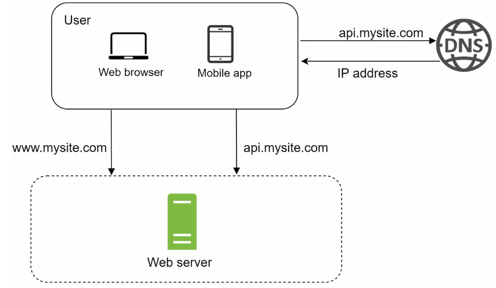

**What broke:** nothing yet. This is the correct starting point, and it is worth saying so out loud in an interview — a single modern server handles a surprising amount of traffic, often a few thousand requests per second for a simple application, which covers the first tens of thousands of users comfortably.

### Request Flow
1. Users access the application via domain names (e.g., `api.mysite.com`), resolved to IP addresses using DNS.
2. IP address of the web-server is returned to the browser or mobile app.
3. HTTP requests are sent to the web server, which returns HTML or JSON responses.

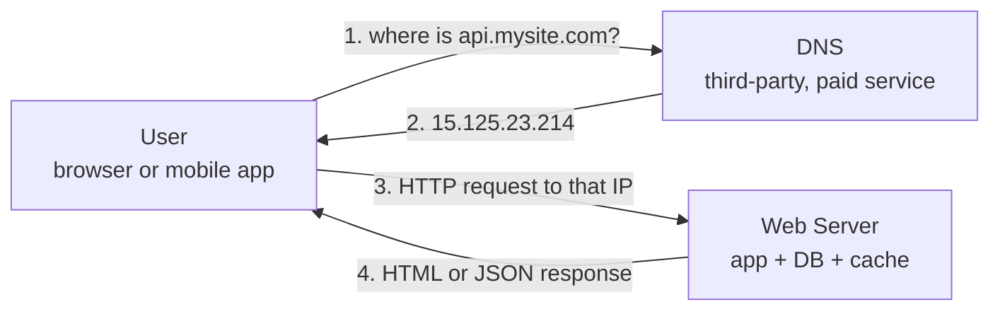

Note that DNS is typically a **third-party paid service**, not something you run — which is why it does not appear as a box you own in later diagrams.

### Traffic Sources
1. **Web Applications:** Use server-side languages (e.g., Python, Java) for business logic and client-side languages (e.g., JavaScript, HTML) for presentation.
2. **Mobile Applications:** Communicate with the web server using HTTP and JSON for lightweight data exchange.

**What it now costs you:** everything shares one fate. One bad deploy, one runaway query, or one hardware failure takes down the whole product, and there is no way to scale the app independently of the database.

---

## Section 2: Database Separation
As the user base grows, the database is moved to a dedicated server to allow independent scaling of web and database tiers.

   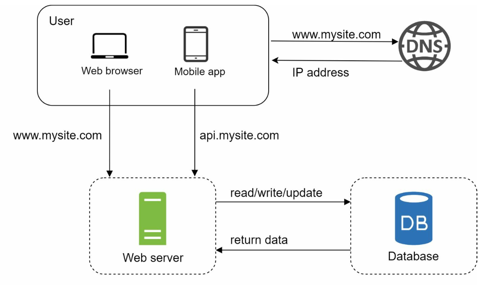

**What broke:** the web app and the database compete for the same CPU, RAM, and disk. A traffic spike starves the database; a heavy query starves the app. You also cannot tune one without hurting the other — web servers want CPU, databases want RAM and fast disk.

Splitting them gives you two tiers that **scale and fail independently**, which is the precondition for everything that follows.

### Database Choices

1. **Relational Databases (SQL):** Structured data stored in tables. Examples: MySQL, PostgreSQL.
2. **Non-Relational Databases (NoSQL):** Suitable for unstructured data or low-latency requirements. Categories include:
   - Key-Value Stores
   - Graph Databases
   - Column Stores
   - Document Stores

- Non-relational databases might be the right choice if:
   - application requires super-low latency.
   - data is unstructured, or  there is no relational data.
   - only need to serialize and deserialize data (JSON, XML, YAML, etc.).
   - need to store a massive amount of data.

### Choosing between them

| Question | Leans relational (SQL) | Leans non-relational (NoSQL) |
|---|---|---|
| Shape of the data | Well-known, stable, highly interrelated | Varies per record, evolves fast, self-contained documents |
| Query pattern | Ad-hoc queries, joins, aggregations you can't predict | A small set of known access patterns, usually by key |
| Transactions | Needs multi-row ACID (money, inventory, bookings) | Single-record atomicity is enough |
| Consistency | Strong consistency required | Eventual consistency acceptable |
| Scale of writes | Fits one primary, or shards you manage deliberately | Designed to scale writes horizontally out of the box |
| Typical examples | MySQL, PostgreSQL | DynamoDB, Cassandra, MongoDB, Redis, Neo4j |

Two corrections to common misconceptions worth knowing:

- **"NoSQL means no schema" is false.** The schema moves from the database into your application code — *schema-on-read* instead of schema-on-write. The constraint still exists; it is just no longer enforced for you, which means old records in formats you forgot about are now your problem.
- **"SQL doesn't scale" is also false.** Relational databases handle enormous load; what is genuinely hard is *distributing* them, because joins and transactions across machines are expensive. See [§12](#section-12-database-scaling).

> **Interview angle:** "SQL or NoSQL?" is almost never answerable in the abstract. Tie it to the access pattern you established in requirements — "the feed is always read by `user_id` and never joined, so a key-value store fits; payments need multi-row transactions, so those stay relational." Picking different stores for different parts of one system is a strong answer, not a hedge.

**What it now costs you:** a network hop between app and database, which is now on your latency budget, plus a second thing to operate, back up, and monitor.

---

## Section 3: Vertical vs Horizontal Scaling
### Vertical Scaling
- Adds more resources (CPU, RAM) to existing servers.
- Limited by hardware constraints and lacks redundancy.

### Horizontal Scaling
- Adds more servers to the pool, making it more suitable for large-scale systems.
- A load balancer is used to handle the request routing between the servers.

**What broke:** a single server hit its ceiling. Now you choose *how* to add capacity, and the two options differ in more than size.

| | Vertical ("scale up") | Horizontal ("scale out") |
|---|---|---|
| How | Bigger machine — more CPU, RAM, faster disk | More machines behind a load balancer |
| Ceiling | Hard — bounded by the largest machine available | Effectively unbounded for stateless tiers |
| Cost curve | Superlinear — the top-end machine costs far more than 2× the mid-range one | Roughly linear, on commodity hardware |
| Failover | None. The big machine is a single point of failure | Built in — lose one node, the rest serve traffic |
| Complexity | Very low. No code changes, often just a restart | Real. Needs a load balancer, stateless design, distributed debugging |
| Scaling down | Slow and usually requires downtime | Fast, and makes auto-scaling possible |

**Vertical scaling is genuinely the right answer more often than interview folklore suggests.** It is the correct first move when traffic is modest, when the team is small, or — importantly — for the **database tier**, where scaling out is a one-way architectural door (see [§12](#section-12-database-scaling)). The usual real-world shape is: scale the database up as far as is reasonable, and scale the stateless web tier out.

> **Interview angle:** don't dismiss vertical scaling as naive. Saying "I'd scale the DB up first because sharding is irreversible, and scale the web tier out because it's stateless" shows you understand that these are different tiers with different constraints.

**What it now costs you:** choosing horizontal means every subsequent section in this chapter. That is the trade — capacity in exchange for distributed-systems complexity.

---

## Section 4: Load Balancer

   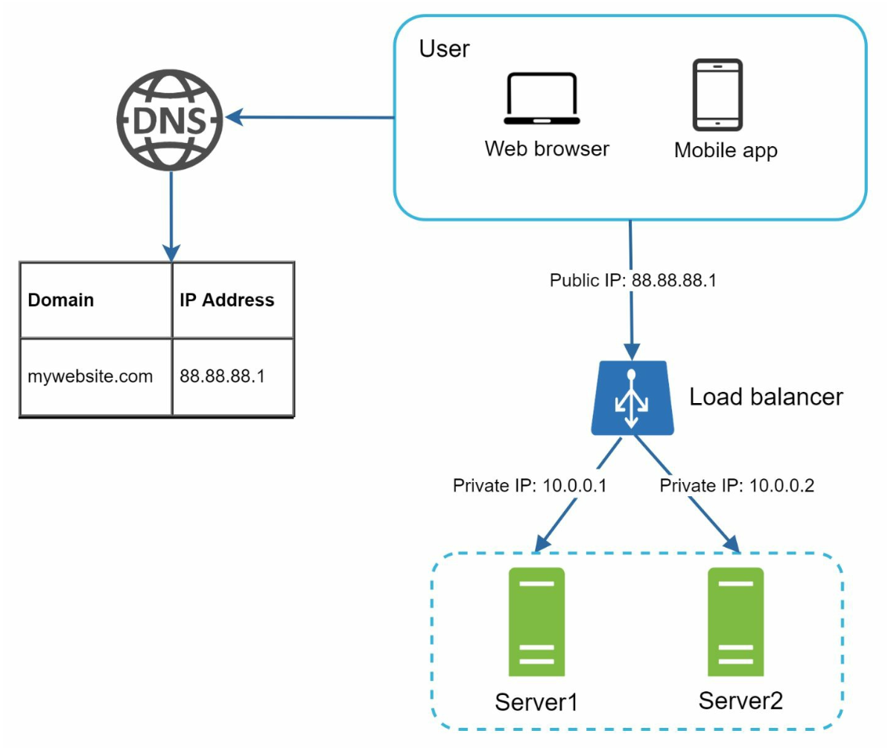

**What broke:** a single web server is both a capacity limit and a single point of failure (SPOF). If it goes down, users see nothing; if it saturates, everyone's requests slow down together.

A **load balancer** distributes traffic among multiple servers. Benefits include:
1. Redundancy: If a server goes offline, traffic is rerouted.
   -  If server 1 goes offline, all the traffic will be routed to server 2.
2. Scalability: Easily add servers to handle traffic spikes.
   -  If the website traffic grows rapidly, subsequent servers can be added to handle the additional traffic.

An important detail: users resolve DNS to the **load balancer's public IP**, and the web servers move to **private IPs** reachable only inside the network. This is a security win as much as a scaling one — the web servers are no longer directly addressable from the internet.

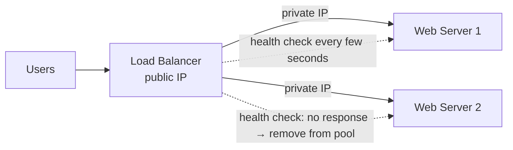

### Layer 4 vs Layer 7

| | L4 (transport) | L7 (application) |
|---|---|---|
| Decides on | IP and port | URL path, headers, cookies, method |
| Can do | Fast, protocol-agnostic forwarding | Path-based routing, TLS termination, compression, caching, sticky sessions |
| Cost | Very low latency, cheap | Must parse the request, so slightly more work per request |
| Typical use | Raw TCP throughput, non-HTTP protocols | Normal HTTP APIs and websites |

### Distribution algorithms
- **Round robin** — each server in turn. Fine when requests and servers are uniform.
- **Weighted round robin** — bigger servers get a larger share. Useful with mixed hardware.
- **Least connections** — send to whoever is least busy. Better when request durations vary a lot.
- **Consistent hashing on a key** — the same key reliably lands on the same server, which matters for cache locality. See [Chapter 5 – Consistent Hashing](../05.%20Consistent%20Hashing/).

### Health checks
The load balancer continuously probes each server and removes unhealthy ones from the pool. Two things to understand:

- A health check should test the things the request path actually needs (can it reach the database?), but **not so deeply** that one slow dependency makes every server report unhealthy at once and empties the pool.
- Removing a node is only half the job. In-flight requests need **connection draining** so you don't cut off users mid-request during a deploy or scale-down.

### Gotchas & failure modes
- **The load balancer is now the SPOF.** In practice you run them in a redundant pair, or use a managed one; it is worth saying this out loud rather than pretending the box is magic.
- **Sticky sessions are a trap.** L7 balancers can pin a user to one server so in-memory sessions keep working. This "fixes" session loss but breaks the thing you came for: you can no longer freely add, remove, or restart servers, and load becomes uneven. [§8](#section-8-stateless-web-tier) removes the need for stickiness entirely — treat it as a smell, not a solution.
- **Uneven load despite round robin** — long-lived connections (WebSockets, HTTP keep-alive) mean new servers may receive almost no traffic, because balancing happens at connection time, not request time.

> **Interview angle:** expect "what happens when a server dies mid-request?" and "how does the LB know a server is healthy?" Having an answer for connection draining and health-check depth separates experience from recall.

**What it now costs you:** the web tier is now redundant, which exposes the next bottleneck — every one of those servers still hammers the same single database.

---

## Section 5: Database Replication

   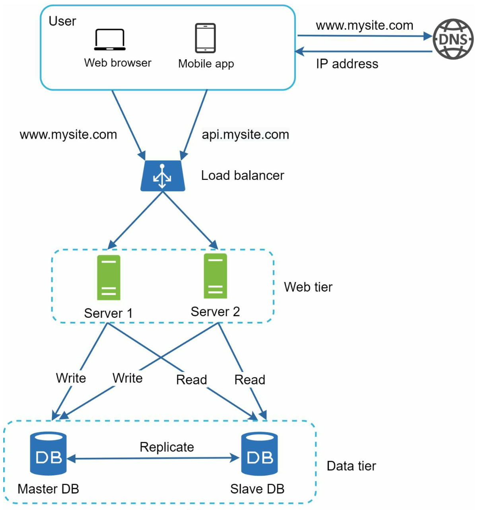

**What broke:** all web servers read from one database. Reads dominate most workloads, so the database saturates long before the app tier does — and it is still a single point of failure for the entire product.

### Master-Slave Model
- **Master Database:** Handles write operations.
   - All the data-modifying commands like insert, delete, or update must be sent to the master database.
- **Slave Databases:** Handle read operations, improving performance and reliability.
   - Since the ratio of reads to writes is higher in most applications; thus, the number of slave
databases in a system is usually larger than the number of master databases.

> Terminology note: modern tooling and documentation use **primary/replica** (or leader/follower) for the same roles. The book's master/slave wording is kept here to match it, but primary/replica is what you will see in practice.

### Benefits
1. Improved performance through parallel read operations.
2. High availability and data reliability through redundancy.

### How the write is propagated

| Mode | The write returns when… | Risk | Cost |
|---|---|---|---|
| **Asynchronous** | The master has committed. Replicas catch up later | Replicas serve stale data; a master crash can lose recent writes | Fast writes. The common default |
| **Synchronous** | Every replica has confirmed | None of the above | Write latency = the slowest replica. One slow replica stalls all writes |
| **Semi-synchronous** | At least one replica has confirmed | Small — bounded data loss | A sensible middle ground, widely used in production |

### Gotchas & failure modes

**Replication lag and read-your-own-writes.** This is the single most common correctness bug introduced by replication. A user updates their profile, the write goes to the master, and the immediate page reload reads from a replica that hasn't received the change yet — so the user sees their *old* data and concludes the save failed.

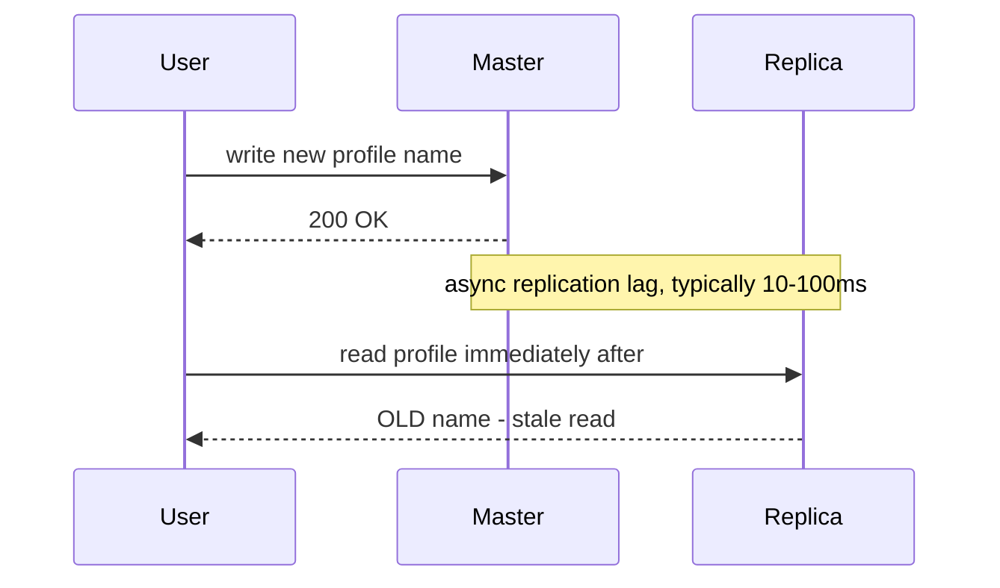

Standard mitigations, roughly in order of preference:
- **Read from the master for that user** for a short window after their own write.
- **Route reads within a session to the same replica** so the user at least sees monotonic data.
- **Track a write timestamp or log position** in the session and wait for the replica to reach it before reading.
- Accept the staleness where it genuinely doesn't matter — a view counter, not a bank balance.

**Split-brain.** If the old master is actually alive but unreachable (a network partition, not a crash), promoting a replica gives you **two nodes accepting writes**, and the two histories diverge. Real failover therefore needs **fencing** — conclusively taking the old master out of service, often via a quorum of observers rather than a single health check. "I'd promote a replica" is an incomplete answer; "I'd promote a replica and fence the old master" is the complete one.

**Replicas scale reads, not writes.** Every replica receives every write. Adding the tenth replica does nothing for write capacity and in fact adds replication load to the master. Write scaling is [§12](#section-12-database-scaling).

### Failure Handling
- If only one slave database is available and it goes offline, read operations will be directed
to the master database temporarily.
- In case multiple slave databases are available, read operations are
redirected to other healthy slave databases and a new server will replace the old one. 
-  If the master database goes offline, a slave database will be promoted to be the new
master.
- In production system the chosen slave database might not be up to date, hence data needs to be updated by running data
recovery scripts (methods like multi-masters and circular replication could help).

> **Interview angle:** "where do reads go?" and "what does the user see right after they write?" are near-guaranteed follow-ups. Naming replication lag unprompted is a strong signal.

**What it now costs you:** eventual consistency on reads, failover machinery to get right, and a read path that still touches disk on every request — which the next section addresses.

---

## Section 6: Caching
A **cache** stores frequently accessed data in memory to reduce database load. The cache tier is a temporary data store layer, much faster than the database. 

   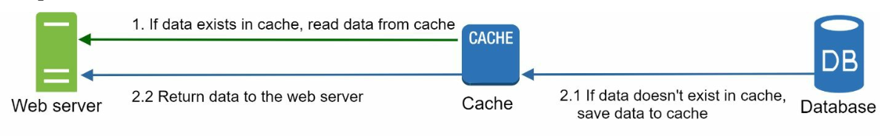

**What broke:** the same expensive queries run thousands of times per second for data that barely changes. Even with replicas, every read costs a network hop plus disk work. An in-memory cache hit is **orders of magnitude** cheaper than a database query — see the latency table in [Chapter 2](../02.%20Back%20Of%20the%20Envelope%20Estimation/) for why that gap is so large.

### The cache-aside pattern
This is the default, and the one the diagram above shows. The application — not the database — owns the cache:

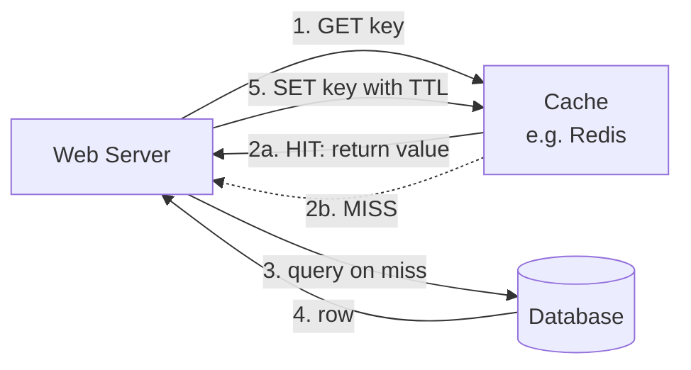

### Caching strategies

| Strategy | How it works | Best for | Watch out for |
|---|---|---|---|
| **Cache-aside** (lazy loading) | App checks cache, falls back to DB, then populates cache | The general default; read-heavy workloads | Every miss costs a full round trip; first request after expiry is slow |
| **Read-through** | Cache itself fetches from the DB on a miss | Keeping fetch logic in one place | Same cold-start cost; needs cache-provider support |
| **Write-through** | Write to cache and DB together, synchronously | Read-after-write consistency | Adds latency to every write; caches data that may never be read |
| **Write-back** (write-behind) | Write to cache, flush to DB asynchronously | Write-heavy workloads | **Data loss if the cache dies before flushing** |
| **Write-around** | Writes go only to the DB; cache populates on read | Data written far more often than read | First read after a write is always a miss |

### Caching considerations
1. **Use case**: Consider using cache when data is read frequently but modified infrequently.
2. **Expiration Policies:** Once cached data is expired, it is removed from the cache. When there is no expiration policy, cached
data will be stored in the memory permanently.
3. **Consistency:** This means keeping the data store and the cache in sync. Inconsistency
can happen because data-modifying operations on the data store and cache are not in a single transaction. 
4. **Mitigating failures**: A single cache server represents a potential single point of failure, multiple
cache servers across different data centers are recommended to avoid SPOF.
5. **Eviction Policies:**: Once the cache is full, items need to be evicted to free up memory. LRU is the most popular cache eviction policy.

### Choosing a TTL
TTL is a direct trade between staleness and database load, and there is no universally right value:
- **Too short** → high miss rate, so the cache stops protecting the database.
- **Too long** → users see stale data, and memory fills with entries nobody reads.

A practical approach is to set TTL from how stale the data is *allowed* to be by the product, then invalidate explicitly on writes for the cases that matter. A useful sizing heuristic: traffic is usually heavily skewed (the classic 80/20 shape), so caching a small fraction of the hottest keys often removes the large majority of database reads — you rarely need to cache everything.

### Eviction policies

| Policy | Evicts | Good when |
|---|---|---|
| **LRU** (least recently used) | The item untouched for longest | General purpose — the usual default |
| **LFU** (least frequently used) | The item requested least often | Stable hot set; resists one-off scans polluting the cache |
| **FIFO** | The oldest inserted item | Order of arrival matters more than access pattern |
| **TTL-only** | Whatever expired | Data with a natural freshness lifetime |

### Gotchas & failure modes

- **Cache stampede / thundering herd.** A popular key expires, and the thousands of concurrent requests that were being served from it *all* miss simultaneously and hit the database at once — which can take the database down, precisely at peak traffic. Mitigations: **jittered TTLs** so keys don't expire in lockstep, **request coalescing** (a single in-flight fetch per key while others wait), a short **lock** on the recompute, or **proactive refresh** just before expiry.
- **Cache penetration.** Requests for keys that don't exist in the database either (often a scraper or an attack) miss the cache every time and pass straight through. Mitigations: **cache the negative result** with a short TTL, or front the cache with a **Bloom filter** that can cheaply say "definitely not present".
- **Hot key.** One key — a celebrity, a viral post — gets so much traffic that the single cache node holding it saturates, even though the cluster as a whole is idle. Mitigations: replicate that key across nodes, or add a small local in-process cache in front of the shared cache.
- **The cache becomes load-bearing.** Once the database can only cope *because* the cache is absorbing 95% of reads, a cold cache after a restart means the database gets 100% of traffic and falls over — so the system cannot recover. This is a real outage pattern. Mitigations: warm the cache before taking traffic, restart nodes gradually, and keep enough database headroom to survive a partial cache loss.
- **Invalidation is genuinely hard.** Deleting the cache entry *after* the DB write is the common ordering, but concurrent readers can still repopulate a stale value in the gap. Accept the small window, or use versioned keys so a write makes old entries unreachable rather than needing deletion.

> **Interview angle:** "what happens when your cache goes down?" is an extremely common probe, and the honest answer — the database is suddenly exposed to full traffic — is where cache warming and headroom come in. Also expect "how do you invalidate?"

**What it now costs you:** a third tier to operate, a consistency window between cache and database, and a new dependency your database now quietly relies on.

---

## Section 7: Content Delivery Network (CDN)
A **CDN** improves load times by caching static content (images, CSS, JavaScript) on geographically distributed servers.

   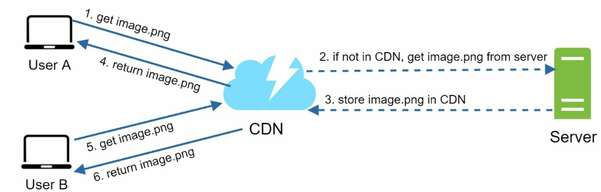

**What broke:** caching helped your database, but it did nothing about **distance**. A user in Sydney hitting a server in Virginia pays well over 100 ms of round-trip latency *per request* that no amount of server-side optimization can remove — and a page pulling 50 assets pays it repeatedly. The only fix is to move the bytes physically closer.

### Workflow
1. User requests content from the nearest CDN server.
2. If unavailable, content is fetched from the origin server and cached.

### Push vs pull

| | **Pull CDN** | **Push CDN** |
|---|---|---|
| How content arrives | Fetched from your origin on the first request for it | You upload it to the CDN ahead of time |
| First request | Slow — a cache miss goes to origin | Fast — already there |
| Best for | Large catalogs, frequently changing content | Small, stable sets of large files |
| Operational burden | Low — content self-manages | You own publishing and expiry |

### CDN considerations
1. **Cost:** CDNs are run by third-party providers which charge for data transfers in and out of the CDN.
2. **Cache Expiry:** The cache expiry time should neither be too long nor too short.
3. **CDN fallback:** If there is a temporary CDN outage, clients should be able to detect the problem
and request resources from the origin.
4. **Invalidating files:** If files are updated the cache should be invalidated to point to the updated files.

### Making updates actually take effect
Invalidation APIs exist, but they are slow and imprecise across hundreds of edge locations. The technique used in practice is **versioned filenames** (`app.a1b2c3.js`, `logo.v2.png`): the URL changes when the content changes, so a new URL can never serve an old cached file, and you can set a very long TTL without fear. This is why build tools fingerprint asset filenames by default.

For content that must stay private, **signed URLs** let the CDN serve a file only to someone holding a time-limited token — the standard pattern for paid downloads or private media.

### What not to put behind a CDN
- Anything **personalized per user** — a CDN caching one user's dashboard and serving it to another is a serious data leak, not just a bug.
- **Frequently changing API responses**, where the TTL would be too short to earn a hit.
- **Small, rarely requested** files, where the per-request cost outweighs the saving.

> **Interview angle:** mention that a CDN does more than cache — it also terminates TLS near the user and keeps connections warm, which removes handshake round trips. And expect "how do you ship a CSS change?" — versioned filenames is the expected answer.

**What it now costs you:** a third-party bill proportional to traffic, and a cache you only partially control.

---

## Section 8: Stateless Web Tier
By moving session data to a shared datastore, web servers become stateless. This allows:
1. Easier horizontal scaling.
2. Auto-scaling based on traffic.

**What broke:** this is the bill from [§4](#section-4-load-balancer). When a web server keeps session data in its own memory, every subsequent request from that user *must* return to that same server. That forces sticky sessions, which means you cannot scale down, cannot deploy without logging people out, and cannot balance load evenly.

Here is the stateful arrangement being replaced — session state living inside each server:

   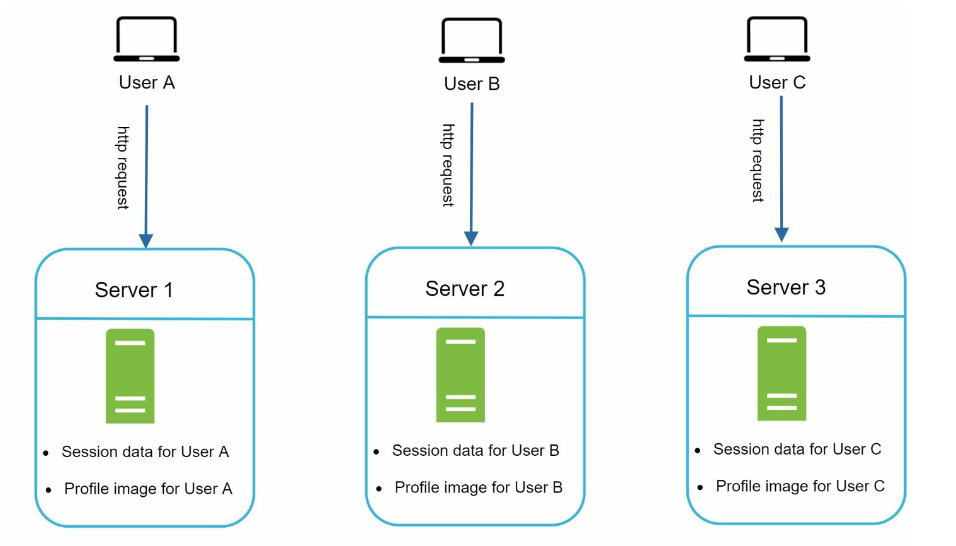

And the stateless version, with session state moved to a shared store that every server can reach:

   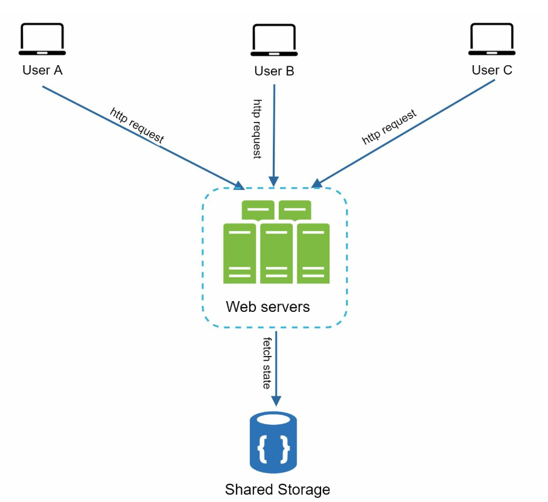

The important shift is that **any server can now serve any request**. That single property is what makes auto-scaling, zero-downtime deploys, and instant failover possible — which is why "keep the web tier stateless" is the first item in this chapter's takeaways.

### Where to put the session

| Approach | How it works | Pros | Cons |
|---|---|---|---|
| **Sticky sessions** | LB pins each user to one server | No code change | Blocks scale-down and clean deploys; uneven load; losing a server logs its users out |
| **Shared session store** (Redis, Memcached, DynamoDB) | Every server reads and writes session state centrally | Truly stateless servers; revoking a session is instant | A network hop per request; the store becomes critical infrastructure |
| **Signed token in a cookie** (e.g. JWT) | State lives in the client; the server only verifies a signature | No session store at all; scales trivially | **Revocation is hard**; token size on every request; stale claims until expiry |

### Gotchas & failure modes
- **Token revocation.** With self-contained tokens, "log out everywhere" and "ban this user right now" don't work — the token stays valid until it expires, because nothing is consulted to verify it. The usual compromise is short-lived access tokens plus a refresh token checked against a server-side store, which reintroduces a small amount of state on purpose.
- **"Stateless" doesn't mean no state anywhere.** It means no *session affinity* — the state moved to a shared tier. Uploaded files, in-memory caches, and background job state all need the same treatment, and local disk writes are the most commonly forgotten one.
- **Don't put large objects in the session.** It is now fetched over the network on every request.

> **Interview angle:** this is the step that enables auto-scaling, so interviewers often ask it as "how do you handle traffic spikes?" The chain is: stateless tier → any server serves any request → add and remove servers freely.

**What it now costs you:** a shared session store on the critical path, and a revocation story you have to design deliberately.

---

## Section 9: Multi-Data Center Setup
Deploying across multiple data centers improves availability and reduces latency. Strategies include:

   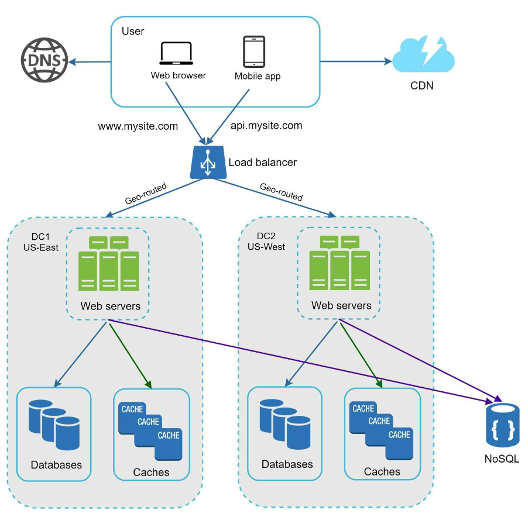

**What broke:** one data center is one blast radius. A regional power, network, or provider failure takes the whole product offline no matter how many servers you run inside it — and users on the far side of the planet still pay the latency.

1. **GeoDNS Routing:** Direct users to the nearest data center.
2. **Data Replication:** Synchronize data across centers to prevent inconsistencies.

### Active-active vs active-passive

| | **Active-active** | **Active-passive** |
|---|---|---|
| Traffic | All regions serve users | One serves; the other stands by |
| Latency | Better — users hit a nearby region | Unchanged for distant users |
| Failover | Shift traffic by reweighting DNS | Promote the standby, which takes time |
| Hard part | **Write conflicts** when two regions accept writes to the same data | Idle capacity you pay for; failover is rarely tested |
| Cost | Highest | Lower |

### Key considerations
- **Traffic redirection:** Effective tools are needed to direct traffic to the correct data center.
- **Data synchronization:** A common strategy is to replicate data across multiple data centers. 
- **Test and deployment:**  Automated deployment tools are vital to keep services consistent through all the data centers.

The deployment point deserves more weight than it usually gets: with multiple regions, **every** change must roll out consistently to all of them, and a half-deployed state across regions is its own class of outage. This is why multi-region is as much an operational commitment as an architectural one.

### Gotchas & failure modes
- **Cross-region latency is physics.** Inter-region round trips run to roughly 100 ms and more. Any design that makes a synchronous cross-region call *per request* has already lost, which is why active-active setups push hard toward asynchronous replication.
- **Write conflicts.** If two regions accept a write to the same record, something must resolve the divergence — last-write-wins (simple, silently loses data), version vectors, or CRDTs. Alternatively, partition by **home region** so each record has exactly one region that may write it, which sidesteps conflicts entirely.
- **DNS failover is not instant.** Clients and intermediate resolvers cache DNS beyond the TTL you set, so some traffic keeps arriving at a dead region for minutes. Health-check-driven routing at the load-balancer or anycast layer reacts faster.
- **Untested failover is not failover.** A standby region that has never taken real traffic will have drifted — stale configuration, missing capacity, expired credentials.

> **Interview angle:** ask whether the requirements actually demand multi-region. It is justified by an availability SLO or by global latency, not by ambition — and saying so demonstrates judgment.

**What it now costs you:** conflict resolution, a far more complex deployment pipeline, and a large bill.

---

## Section 10: Message Queue
A **message queue** is a durable component, stored in memory, that supports asynchronous
communication. It serves as a buffer and distributes asynchronous requests.

   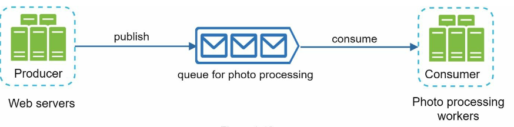

**What broke:** some work is simply too slow to do inside a request — encoding a video, applying filters to a photo, sending email, generating a report. Done synchronously it holds a web server thread for seconds or minutes, so a burst of uploads exhausts the web tier and users stare at a spinner or time out.

- Input services, called producers/publishers, create messages, and publish them to a message queue.
- Other services called consumers/subscribers, connect to the queue, and perform actions defined by the messages.

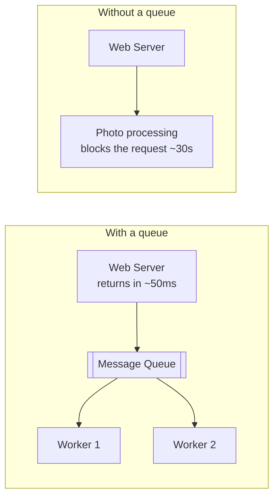

The queue buys you two distinct things that are worth naming separately:

- **Decoupling.** The producer doesn't need to know who consumes, how many consumers exist, or whether any are running right now. Workers can be deployed, restarted, or scaled independently of the web tier.
- **Buffering / load levelling.** A traffic spike grows the queue instead of overwhelming the workers. You now scale workers on **queue depth** — a far better signal than CPU — and a backlog degrades latency gracefully rather than dropping requests.

### Gotchas & failure modes
- **Delivery guarantees.** *At-most-once* can drop messages. *At-least-once* is the common default and can deliver duplicates. *Exactly-once* is mostly unachievable end-to-end; what is practical is at-least-once delivery plus **idempotent consumers** — handlers safe to run twice, usually via a deduplication key. Design for duplicates rather than assuming they can't happen.
- **Poison messages and the dead-letter queue.** One malformed message that crashes its consumer gets redelivered forever and blocks everything behind it. A **DLQ** parks messages after N failures so the rest of the queue keeps moving — and the DLQ needs an alert, or failures pile up silently.
- **Ordering is not free.** Most queues guarantee order only within a partition or key, and the moment you run multiple consumers in parallel, global ordering is gone. If order matters, partition by a key (e.g. `user_id`) so related messages stay sequential.
- **Backpressure.** If producers are permanently faster than consumers, the queue grows without bound until it hits its limit and starts rejecting or dropping. A queue smooths *spikes*; it cannot fix a sustained capacity shortfall.
- **The user-visible contract changes.** "Your upload is being processed" is a different product experience from "done", and the client needs some way to learn about completion — polling, a webhook, or a push notification.

> **Interview angle:** proposing a queue invites "what if a worker crashes halfway through?" The expected answer involves retries, visibility timeouts, idempotency, and a DLQ.

Covered in much more depth in [Chapter 19 – Distributed Message Queue](../19.%20Distributed%20Message%20Queue/).

**What it now costs you:** eventual completion instead of immediate results, duplicate handling, and another piece of infrastructure to monitor.

---

## Section 11: Logging, Metrics, and Automation

   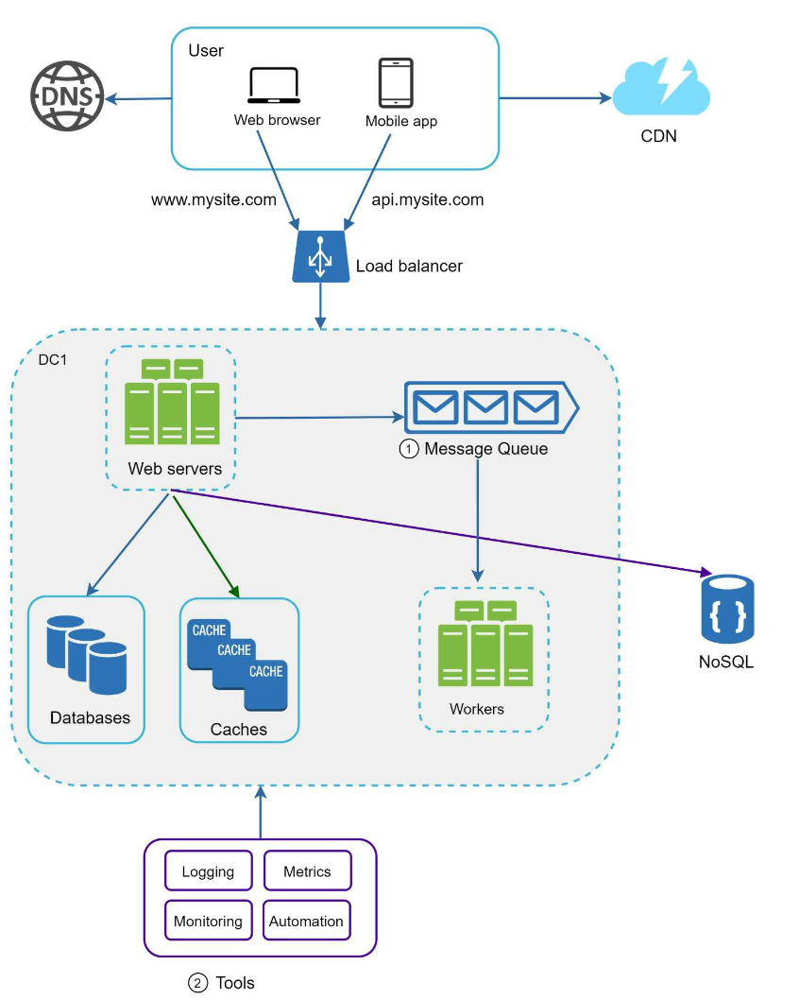

**What broke:** with a dozen components across multiple regions, "the site is slow" is no longer a question you can answer by reading one log file over SSH. You cannot operate what you cannot see.

### Importance
1. **Logging:** Tracks errors and system health.
2. **Metrics:** Provides insights into performance and user activity.
3. **Automation:** Streamlines testing, deployment, and scaling.

### The three pillars

| Pillar | Answers | Shape |
|---|---|---|
| **Metrics** | "Is something wrong, and since when?" | Cheap numeric time series — rates, errors, durations, saturation |
| **Logs** | "What exactly happened in this case?" | Expensive, high-detail events. Aggregate centrally; local log files are useless at this scale |
| **Traces** | "Which of the twelve components is the slow one?" | One request followed across services via a propagated trace ID |

Metrics are usefully grouped by level:
- **Host** — CPU, memory, disk, network per machine.
- **Aggregated tier** — database query latency, cache hit rate, queue depth, pool utilisation.
- **Business** — signups, revenue, daily active users. These are the ones that tell you whether an incident actually mattered.

### Gotchas & failure modes
- **Averages hide outages.** A mean response time looks fine while 5% of users time out. Alert and design against **percentiles** — p95, p99 — not averages.
- **Alert on symptoms, not causes.** "Error rate above 1% for 5 minutes" is actionable; "CPU above 80%" fires constantly and trains everyone to ignore alerts. Alert fatigue is a real failure mode.
- **Logs without a correlation ID are nearly unusable** once a request crosses several services. Generate a request ID at the edge and propagate it everywhere.

**What it now costs you:** real spend on observability — it is common for log and metric volume to rival application traffic — plus the discipline to keep alerts meaningful.

---

## Section 12: Database Scaling
### Vertical Scaling
- Adds hardware resources but has physical and cost limitations.
- Has multiple drawbacks:
   -  Greater risk of single point of failures.
   -  Overall cost of vertical scaling is high

**What broke:** replicas scaled reads; caches scaled reads further. But **every write still lands on one master**, and no amount of replication changes that. When write throughput or raw data volume exceeds what one machine can hold, the data tier has to be split.

### Horizontal Scaling (Sharding)

   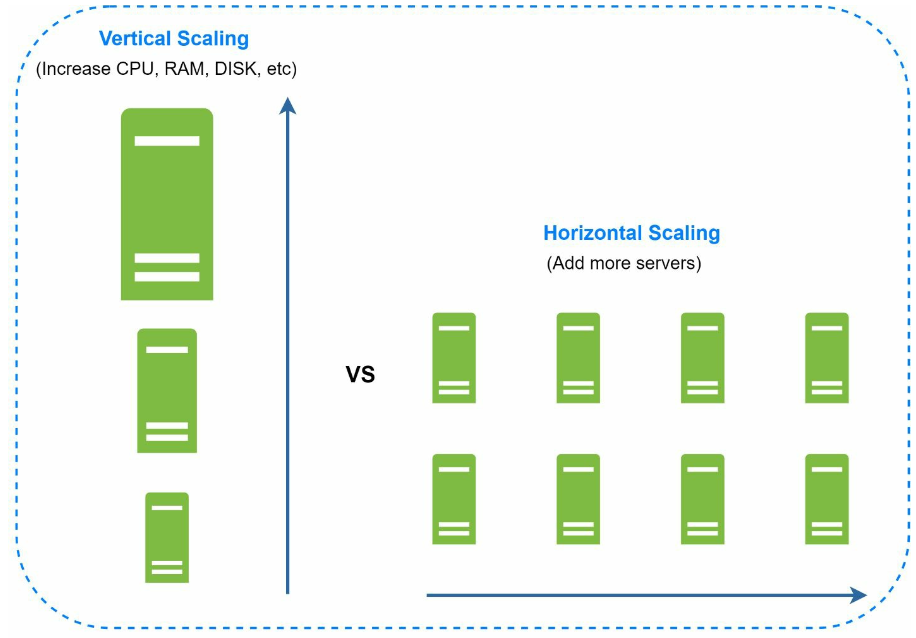

- Divides data across multiple shards using keys (e.g., `user_id`).
   - Sharding separates large databases into smaller, more easily managed parts called shards.
   - Each shard shares the same schema, though the actual data on each shard is unique to the shard.
-  Sharding key is critical when implementing a sharding strategy. When choosing a sharding key it is important to choose a key that can evenly distribute data.

### Sharding strategies

| Strategy | How the shard is chosen | Pros | Cons |
|---|---|---|---|
| **Range** | By key ranges (A–F, G–M…) | Range scans stay on one shard | Hotspots — sequential keys like timestamps all land on the newest shard |
| **Hash** | `hash(key) % N` | Even distribution, trivial to compute | Changing `N` reshuffles nearly all data |
| **Consistent hashing** | Key and nodes placed on a hash ring | Adding or removing a node moves only a small slice of keys | More machinery. See [Chapter 5](../05.%20Consistent%20Hashing/) |
| **Directory / lookup** | An explicit key → shard mapping table | Maximum flexibility; move individual keys at will | The lookup table is a new dependency and potential SPOF |

### Choosing a sharding key
The sharding key determines everything downstream, and it is hard to change later. A good key:
- **Distributes evenly** — no shard holds a disproportionate share of data or traffic.
- **Appears in your common queries**, so most requests reach a single shard. A query without the shard key must fan out to *every* shard and wait for the slowest — which is how a sharded system ends up slower than the single database it replaced.
- **Keeps related data together** — co-locating a user's rows on one shard keeps their transactions and joins local.

#### Challenges 
1. **Resharding data:** Resharding data is needed when:
   - Single shard could no longer hold more data due to rapid growth. 
   - Certain shards might experience shard exhaustion faster than others due to uneven data distribution.
   - Consistent Hashing is used to overcome these problems

   Resharding is a genuinely difficult live migration: data must move while reads and writes continue, usually via dual writes and a backfill, with a careful cutover. A common way to make it cheaper later is to shard into many more **logical** shards than you have physical machines from the start, so growth means relocating whole logical shards rather than rehashing individual rows.

2. **Celebrity problem:**  Excessive access to a specific shard could cause server overload.
   - To solve this problem, we may need to allocate a shard for each celebrity.

   Also called the **hot shard** problem, and it is the usual reason an evenly *sized* sharding scheme still fails — data is balanced but *traffic* is not. Beyond dedicating shards, options are caching those keys hard ([§6](#section-6-caching)) or splitting the hot key's data across shards with a composite key.

3. **Join and de-normalization:** Once a database has been sharded across multiple servers, it is hard to perform join operations across database shards.
   -  A common workaround is to de-normalize the database so that queries can be performed in a single table.

4. **Cross-shard transactions.** ACID guarantees stop at the shard boundary. A transaction spanning shards needs two-phase commit (slow, and it blocks on failures) or a saga of compensating actions. The usual answer is to design so transactions never cross shards — which is itself a sharding-key decision.

5. **Unique IDs.** `AUTO_INCREMENT` is per-shard, so primary keys collide across shards. You need globally unique IDs instead — see [Chapter 7 – Unique ID Generator](../07.%20Unique-Id%20Generator/).

> **Shard last.** Sharding is close to a one-way door: it changes your data model, your queries, and your operations permanently. Exhaust the cheaper options first — add indexes and fix slow queries, cache harder, add replicas, scale the master up, archive cold data to a separate store, and move high-volume non-relational data out to a store built for it. Many systems that "need sharding" actually need one missing index.

> **Interview angle:** the strongest answer names the sharding key *and* what breaks because of it — "shard by `user_id`, so a user's own data is one shard, but 'all orders yesterday across users' now fans out, which is why that query goes to an analytics store instead."

Sharded storage is the subject of [Chapter 6 – Key-Value Store](../06.%20Key-Value%20Store/).

---

## Conclusion
### Key Takeaways
1. Keep the web tier stateless.
2. Build redundancy at every tier.
3. Use caching and CDNs to optimize performance.
4. Scale the data tier with sharding.
5. Decouple components for flexibility.

### The whole chapter in one table

| Bottleneck | Fix | What you pay for it |
|---|---|---|
| App and DB contend for resources | Separate the tiers | An extra network hop; a second system to operate |
| One server's hard ceiling | Scale up, or scale out | Scaling out requires everything below |
| Web tier is a SPOF and saturates | Load balancer + multiple servers | The LB itself; sticky-session temptation |
| Reads saturate the database | Read replicas | Replication lag; stale reads; failover complexity |
| Repeated expensive reads | Cache tier | A consistency window; a cold cache can now cause an outage |
| Distance to users | CDN | Third-party cost; a cache you don't fully control |
| Sessions pinned to servers | Stateless web tier + shared session store | A session store on the critical path; revocation design |
| Regional outages, global latency | Multi-data-center | Write conflicts; much harder deployments; big bill |
| Slow work inside requests | Queue + workers | Eventual completion; duplicates; backpressure |
| No visibility | Logs, metrics, traces | Real spend; alert discipline |
| Writes saturate the database | Sharding | Cross-shard joins and transactions; resharding; a near-irreversible decision |

### Interview self-check
If you can answer these from memory, this chapter has done its job:

1. Why does separating the database come before adding a load balancer?
2. When is vertical scaling the *better* choice?
3. A user updates their profile and immediately sees the old value. What happened, and how would you fix it?
4. Your cache cluster restarts cold at peak traffic. What happens next, and how do you survive it?
5. How do you ship a CSS change when the old file has a one-year CDN TTL?
6. What specifically becomes possible once the web tier is stateless?
7. A worker crashes halfway through processing a message. What stops the job being lost, and what stops it running twice?
8. You shard by `user_id`. Which queries just got expensive?
9. Why can't you simply add more replicas to handle more writes?
10. Your p99 latency doubled but the average is unchanged. What does that tell you?

### Glossary

| Term | Meaning |
|---|---|
| **QPS** | Queries per second. The standard unit of traffic in estimations |
| **SPOF** | Single point of failure — a component whose loss takes the system down |
| **Vertical / horizontal scaling** | A bigger machine / more machines |
| **Stateless** | A server holding no per-user state, so any server can serve any request |
| **Replication lag** | The delay before a write on the primary is visible on a replica |
| **Split-brain** | Two nodes both believing they are the primary, accepting divergent writes |
| **Shard** | One partition of a dataset, holding the same schema but different rows |
| **Hot key / hot shard** | A single key or shard receiving disproportionate traffic |
| **Cache stampede** | Many simultaneous misses on one expired key overwhelming the database |
| **Idempotent** | Safe to execute more than once with the same result |
| **DLQ** | Dead-letter queue — where repeatedly failing messages are parked |
| **Eventual consistency** | Replicas converge on the same value, but not immediately |
| **p95 / p99** | The latency 95% / 99% of requests come in under |

### Where to go next
- [Chapter 2 – Back-of-the-envelope Estimation](../02.%20Back%20Of%20the%20Envelope%20Estimation/) — how to decide *which* of these steps your numbers actually justify.
- [Chapter 3 – A Framework for System Design Interviews](../03.%20System%20Design%20Framework/) — how to deploy this toolbox under time pressure.

This chapter provides a solid foundation for building scalable systems that can handle millions of users.
