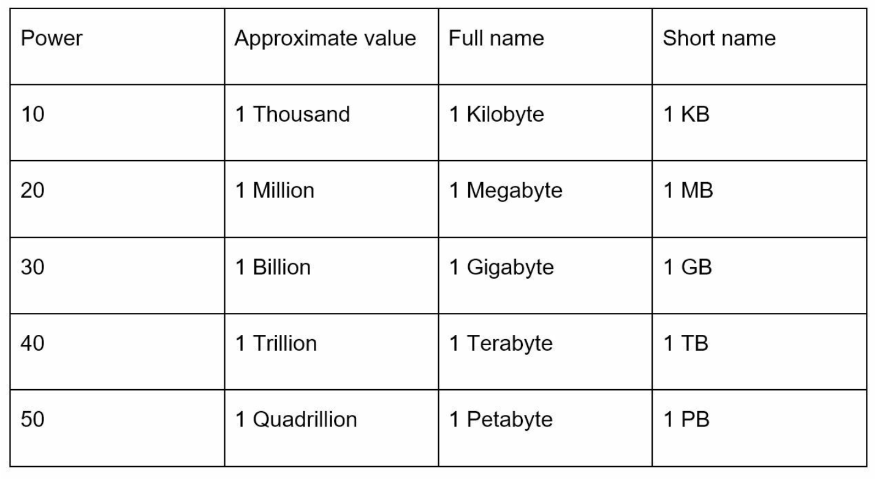
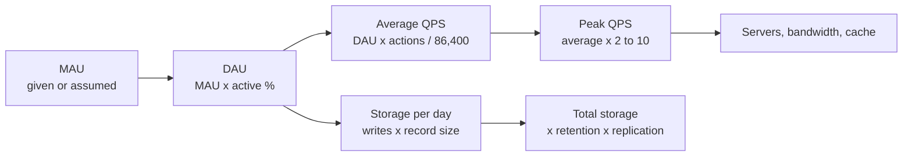

# Chapter 2: Back-of-the-Envelope Estimation

## Introduction
Back-of-the-envelope estimation is a crucial skill in system design interviews. It involves making quick, rough calculations to assess system capacity or performance. According to Jeff Dean, Google Senior Fellow, these estimates help evaluate whether designs meet requirements through thought experiments and common performance benchmarks.

This chapter covers key concepts, methodologies, and examples to build proficiency in scalability and estimation.

**Why this matters more than it looks.** Estimation is not arithmetic for its own sake — it is how you decide *which* parts of [Chapter 1](../01.%20Scaling/) your design actually needs. A system at 50 QPS and 10 GB does not need sharding, a CDN, or multiple regions, and proposing them signals poor judgement. A system at 500,000 QPS and 50 PB needs all of them, and omitting them signals the same thing. The numbers tell you which conversation to have.

The goal is an answer within roughly an order of magnitude, reached in two or three minutes. Nobody is checking your long division.

---

## Section 1: Key Concepts

### Power of Two
Understanding data volume in terms of powers of two is fundamental:



This knowledge helps in performing accurate storage and bandwidth calculations.

| Power | Exact value | Approximate value | Unit | Short |
|---|---|---|---|---|
| 2^10 | 1,024 | 1 thousand | 1 Kilobyte | 1 KB |
| 2^20 | 1,048,576 | 1 million | 1 Megabyte | 1 MB |
| 2^30 | 1,073,741,824 | 1 billion | 1 Gigabyte | 1 GB |
| 2^40 | 1,099,511,627,776 | 1 trillion | 1 Terabyte | 1 TB |
| 2^50 | 1,125,899,906,842,624 | 1 quadrillion | 1 Petabyte | 1 PB |

The practical takeaway is to **treat each step as ×1000, not ×1024**. The 2.4% error is irrelevant next to the fact that your assumptions are guesses, and it makes every calculation doable in your head.

---

### Latency Numbers Every Programmer Should Know
Latency numbers represent the time taken for various operations in computing systems. These provide insights into relative performance:

| Operation                | Latency (2020) | What it means for your design |
|--------------------------|----------------|-------------------------------|
| L1 Cache Access          | 0.5 ns         | Effectively free |
| L2 Cache Access          | 7 ns           | Effectively free |
| Mutex lock/unlock        | 100 ns         | Cheap, but contention is not — a hot lock serialises your whole service |
| Main Memory Access       | 100 ns         | The baseline "fast". Everything below is a different category |
| Compress 1 KB            | ~10 µs         | ~100× a memory read, but ~1000× cheaper than sending the bytes over the internet — so compress before transmitting |
| Read 1 MB from memory    | ~250 µs        | In-memory scans are cheap. This is why a cache tier works |
| SSD Random Read          | 150 µs         | ~1,500× slower than memory. Still fine; random reads on SSD are not disasters |
| Round-Trip in Data Center| 500 µs         | **Your real budget unit.** Every service hop and DB query costs about this much, minimum |
| HDD Random Seek          | 10 ms          | ~100,000× slower than memory. Avoid random disk access; design for sequential |
| Read 1 MB over 1 Gbps    | ~10 ms         | Bandwidth, not latency, dominates large transfers |
| Read 1 MB from disk      | ~30 ms         | Sequential disk is survivable; it is *seeks* that kill you |
| Inter-Region Data Center | 150 ms         | Noticeable to humans. Never do this synchronously per request |

**Key Insights:**
- Memory is fast, disk is slow.
- Avoid disk seeks whenever possible.
- Compress data before transmitting over the internet to save bandwidth.
- **The gaps are what matter, not the digits.** Memory → SSD → disk → cross-region each jump roughly 1000×. Knowing the *order* of these reliably is worth more than memorising any single figure.
- **Count round trips, not CPU.** A request making 20 sequential service calls has spent 10 ms doing nothing but waiting, before any work. Batching and parallelising calls usually beats optimising code.

> **A note on these figures:** this table is the widely circulated "latency numbers every programmer should know" list, useful as *orders of magnitude* rather than current benchmarks. Modern NVMe drives are considerably faster than the SSD row suggests. Nobody will challenge you on the exact values; they will challenge you if you treat a disk read and a memory read as comparable.

---

### Availability Numbers
High availability (HA) ensures minimal downtime. Availability is expressed in **nines**:
- **99% (Two Nines):** ~3.65 days/year of downtime
- **99.9% (Three Nines):** ~8.8 hours/year of downtime
- **99.99% (Four Nines):** ~52 minutes/year of downtime
- **99.999% (Five Nines):** ~5.3 minutes/year of downtime
- **99.9999% (Six Nines):** ~31.56 seconds/year of downtime

| Availability | Downtime per day | Per month | Per year |
|---|---|---|---|
| 99% | 14.4 minutes | ~7.3 hours | ~3.65 days |
| 99.9% | ~1.44 minutes | ~43.8 minutes | ~8.8 hours |
| 99.99% | ~8.6 seconds | ~4.4 minutes | ~52.6 minutes |
| 99.999% | ~0.86 seconds | ~26 seconds | ~5.3 minutes |
| 99.9999% | ~86 milliseconds | ~2.6 seconds | ~31.6 seconds |

Cloud providers like Amazon, Google, and Microsoft aim for SLAs (Service Level Agreements) of **99.9% or higher**.

**The rule people forget: dependencies in series multiply.** If a request passes through a load balancer, an API service, and a database that are each 99.9% available, the combined availability is 0.999³ ≈ **99.7%** — nearly three times the downtime of any single component. Every component you add to the request path makes availability *worse* unless it is made redundant.

This is precisely why [Chapter 1](../01.%20Scaling/) insists on redundancy at every tier: two components in **parallel**, each 99% available, give 1 − 0.01² = **99.99%**. Redundancy is how you buy back the nines that your component count spent.

Two more things worth knowing:
- **Four nines is roughly the ceiling for a design conversation.** Beyond that, downtime budget is measured in minutes per year, which is less than a careless deploy takes — so five nines is an organisational and automation achievement, not an architectural one.
- **Availability is not the same as correctness.** A service returning errors fast is "up" by most health checks.

---

## Section 2: Example Estimation - Twitter QPS and Storage Requirements

### Assumptions
- **300 million monthly active users (MAU).**
- **50% daily active users (DAU).**
- **Average tweets/user/day:** 2.
- **10% of tweets contain media.**
- **Data retention:** 5 years.

State these out loud and write them down. The interviewer will often correct one ("assume 20% have media"), and correcting an assumption is cheap — redoing an estimate whose assumptions were never stated is not.

### Estimations

**1. Daily active users**

```
DAU = 300M MAU x 50% = 150M users/day
```

**2. Write QPS (tweets per second)**

```
Tweets/day     = 150M users x 2 tweets  = 300M tweets/day
Average QPS    = 300M / 86,400 s        = ~3,500 tweets/sec
Peak QPS       = ~3,500 x 2             = ~7,000 tweets/sec
```

A day is 86,400 seconds, which is close enough to 100,000 (10^5) for mental arithmetic — so "300M per day" is about "3,000 per second" before you reach for a calculator.

**3. Storage: one tweet**

| Field | Size |
|---|---|
| `tweet_id` | 64 bytes |
| `text` | 140 bytes |
| `media` (10% of tweets) | 1 MB |

**4. Daily and 5-year storage**

```
Media/day      = 150M x 2 x 10% x 1 MB  = 30M MB   = ~30 TB/day
5-year total   = 30 TB x 365 x 5        = 54,750 TB = ~55 PB
```

For contrast, the text itself is almost free:

```
Text/day       = 300M tweets x 204 bytes = ~61 GB/day
5-year total   = 61 GB x 1,825 days      = ~112 TB
```

**Media is ~500× the text volume.** That single observation reshapes the design: tweet text belongs in a database, but media belongs in blob storage behind a CDN, with only a URL stored in the database. This is the point of estimating — the number told you the architecture.

Finally, remember the 55 PB figure is **before replication**. At the typical replication factor of 3, you are provisioning closer to **165 PB**, which is also why the real design tiers old media to cheaper cold storage.

---

## Section 3: Tips for Effective Estimation

### 1. Rounding and Approximation
Precision is not critical; focus on the process. Simplify complex calculations using round numbers. For example:

```
99,987 / 9.1  ≈  100,000 / 10  =  10,000
```

### 2. Write Down Assumptions
Document assumptions clearly for future reference.

### 3. Label Units
Avoid ambiguity by labeling units (e.g., `5 MB` instead of `5`).

### 4. Common Estimation Scenarios
- **QPS (Queries Per Second):** Measure traffic intensity.
- **Peak QPS:** Account for traffic spikes.
- **Storage Requirements:** Estimate total data needs.
- **Cache Requirements:** Evaluate memory requirements for caching.
- **Number of Servers:** Calculate hardware needs based on workload.

---

### The estimation recipe
Almost every estimate follows the same chain. Learn the chain once and you never have to invent an approach under pressure:



Written out as formulas:

| Step | Formula |
|---|---|
| DAU | `MAU x daily-active %` |
| Average QPS | `DAU x actions per user per day / 86,400` |
| Peak QPS | `average QPS x peak factor` (2–10; use 2 unless the product is bursty) |
| Read QPS | `write QPS x read:write ratio` |
| Storage per day | `writes per day x bytes per record` |
| Total storage | `storage per day x retention days x replication factor` |
| Bandwidth | `QPS x average response size` |
| Cache size | `daily reads x hot fraction (often ~20%) x record size` |
| Server count | `peak QPS / QPS one server handles`, then add headroom |

### Handy constants

| Quantity | Value | Round to |
|---|---|---|
| Seconds in a day | 86,400 | 10^5 |
| Seconds in a month | ~2.6 million | 2.5 x 10^6 |
| Seconds in a year | ~31.5 million | 3 x 10^7 |
| Days in 5 years | 1,825 | ~2,000 |
| One ASCII character | 1 byte | — |
| A UUID as text | 36 bytes | ~40 bytes |
| A typical row with indexes | — | assume 1.5–2× the raw field sizes |
| Replication factor | 3 | always multiply storage by it |

Rough per-server capacity, useful for sanity checks rather than quotation:

| Component | Order of magnitude |
|---|---|
| Web/API server | thousands of QPS for simple work; hundreds for heavy work |
| Relational DB (single node) | thousands of simple reads/sec; far fewer complex writes |
| Redis / in-memory cache | ~100k operations/sec per node |
| Modern server RAM | tens to hundreds of GB — decides whether a cache fits on one box |

---

### A second worked example: URL shortener
The value of a recipe is that the second example is mechanical.

**Assumptions:** 100M new URLs per day, read:write ratio of 10:1, 5-year retention, ~500 bytes per record (short code, long URL, owner, timestamps, indexes).

```
Write QPS       = 100M / 86,400          = ~1,200 writes/sec
Read QPS        = 1,200 x 10             = ~12,000 reads/sec
Peak read QPS   = 12,000 x 2             = ~24,000 reads/sec

Records in 5y   = 100M x 365 x 5         = 182.5 billion records
Raw storage     = 182.5B x 500 bytes     = ~91 TB
With 3x replication                      = ~275 TB

Daily reads     = 12,000 x 86,400        = ~1 billion reads/day
Cache (hot 20%) = 200M x 500 bytes       = ~100 GB
Read bandwidth  = 12,000 x 500 bytes     = ~6 MB/s
```

**What these numbers decided for you:**
- 24,000 peak reads/sec with ~6 MB/s of bandwidth is a **read-heavy, low-bandwidth** workload — ideal for caching, and nowhere near needing a CDN for the redirect itself.
- ~100 GB of hot data **does not fit on one cache node comfortably**, so the cache tier is a cluster, which is what makes [Chapter 5 – Consistent Hashing](../05.%20Consistent%20Hashing/) relevant.
- 275 TB across 182 billion rows **will not fit on one database**, so sharding is justified here — unlike many problems where it is not.
- 12,000 reads vs 1,200 writes means **replicas and caching matter far more than write throughput**.

---

### Common mistakes
- **Dropping the replication factor.** Storage estimates are routinely 3× too low because the ×3 never got applied.
- **Confusing bits and bytes.** Network capacity is quoted in **bits** per second (Gbps), storage in **bytes**. A 1 Gbps link carries ~125 MB/s, not 1 GB/s — a factor of 8.
- **Mbps vs MBps.** Same trap, one capital letter apart. Always write the unit out.
- **Forgetting the peak factor.** Provisioning for average QPS guarantees failure at the daily peak. Products with strong time-of-day or event-driven patterns can peak 10× the average.
- **Ignoring metadata and index overhead.** Indexes, timestamps, and per-row overhead commonly add 50–100% to the raw field sizes.
- **Over-precision.** Reporting "54,750 TB" invites questions about digits that came from a guessed 10% media rate. Say "~55 PB".
- **Estimating and then ignoring the result.** The number exists to drive a decision. Always close with "so this means…".

> **Interview angle:** interviewers care about the *method and the conclusion*, not the digits. Narrate the chain out loud, round aggressively, label every unit, and finish by naming what the numbers rule in or out: "7,000 peak writes/sec is manageable on a sharded cluster, but 55 PB of media means blob storage plus a CDN, not a database." That final sentence is the whole point of the exercise.

### Self-check
1. Convert 1 Gbps to megabytes per second.
2. Your service chains four components, each 99.9% available. What is the end-to-end availability?
3. 50M DAU each perform 10 actions per day. What is the average QPS? The peak?
4. Why does a 1 MB random disk read cost so much more than a 1 MB memory read?
5. You estimate 20 TB of data. What do you actually provision, and why?
6. Which is the more expensive design mistake: 20 sequential service calls, or one unindexed query? What would you need to know to decide?
