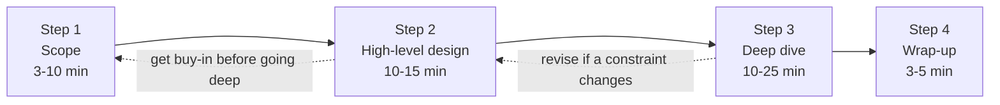
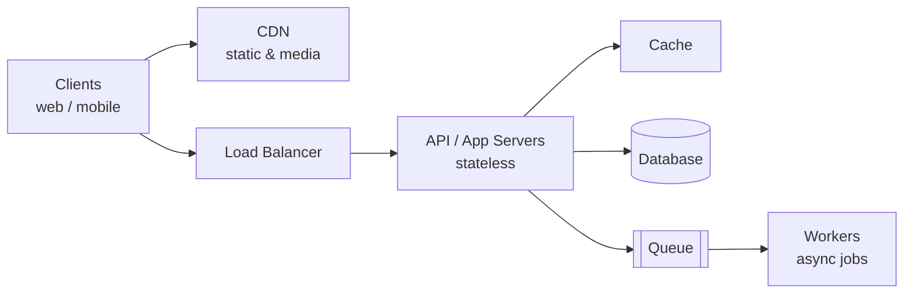

# Chapter 3: A Framework for System Design Interviews

## Introduction
System design interviews are a key part of the hiring process, simulating real-life problem-solving scenarios. These interviews evaluate not just technical skills but also collaboration, communication, and the ability to handle ambiguous requirements.

This chapter introduces a **4-step framework** for navigating system design interviews effectively.

**What is actually being tested.** A system design interview has no correct answer, which makes it confusing until you understand what is being measured. It is not whether you know what a load balancer is — it is whether you can take a deliberately vague prompt, narrow it into something buildable, justify your choices against *that* scope, and change your mind gracefully when a constraint shifts. The question is always "would I want to design a system with this person?"

This chapter is the **process**. [Chapter 1](../01.%20Scaling/) is the toolbox it reaches into, and [Chapter 2](../02.%20Back%20Of%20the%20Envelope%20Estimation/) is how you decide which tools the problem justifies. The framework is what stops you from reciting the toolbox at a problem that doesn't need it.



The dotted arrows matter: this is a loop, not a one-way pipeline. Discovering in Step 3 that your Step 2 design can't meet a requirement and saying so is a *good* outcome, not a failure.

---

## Step 1: Understand the Problem and Establish Design Scope

### Key Objectives
- Clarify requirements and assumptions.
- Avoid jumping into solutions prematurely.
- Showcase critical thinking by asking good questions.

### Approach
- **Ask Clarifying Questions:**
  - What are the most important features?
  - What scale does the system need to handle?
  - Are we building for web, mobile, or both?
  - Are there existing technologies or constraints?

- **Document Assumptions:** Write assumptions on a whiteboard or paper for reference.

### Functional vs non-functional requirements
Separating these two explicitly is the highest-value habit in this step, because they drive completely different parts of the design.

| | **Functional** — what it does | **Non-functional** — how well it does it |
|---|---|---|
| Describes | Features and behaviour | Scale, latency, availability, consistency, durability, cost |
| Examples | "Users post tweets", "users follow others", "feed shows followed users' posts" | "500M DAU", "feed loads in under 200 ms", "99.99% available", "stale feed acceptable" |
| Drives | APIs and the data model | Caching, replication, sharding, queues — the whole of Chapter 1 |

Most candidates gather the functional requirements and stop. **The non-functional ones are what make it a design problem** — a feed for 100 users and a feed for 500 million need the same API and entirely different architectures.

### A reusable question checklist
Pick the handful that matter; do not run the whole list.

**Scope and scale**
- How many daily active users? How much growth is expected?
- What is the read-to-write ratio? (This decides nearly everything about the data tier.)
- How much data per record, and how long must it be retained?

**Behaviour**
- Which 2–3 features are in scope? What is explicitly out of scope?
- Who are the actors — end users, internal services, third parties?

**Quality attributes**
- What latency is acceptable, at p99 rather than on average?
- When something has to give, do we prefer **consistency or availability**? (Showing money needs consistency; showing a like count does not.)
- How stale may data be? Seconds, minutes, or must reads be immediate?
- What is the availability target, and what does an outage cost?

**Context**
- Mobile, web, or both? Does offline support matter?
- Is there an existing stack or team constraint?
- Do we need authentication, multi-tenancy, audit logs, regulatory constraints?

### Turn assumptions into numbers
A vague scope produces a vague design. Convert the answers into a short written list before designing anything:

> 10M DAU · 2 posts/user/day · read:write ≈ 100:1 · p99 under 200 ms for the feed · a few seconds of staleness is fine · 99.9% availability · media supported, 1 MB average

That block makes the rest of the interview concrete. Everything you propose can now be justified against it, and if the interviewer changes one line you know exactly which decisions to revisit.

### Example
**Problem:** Design a news feed system.  
**Questions:**
- Is it a mobile app, web app, or both?
- How many friends can a user have?
- Should the feed include images and videos?
- Is the feed sorted by reverse chronological order?

> **Interview angle:** this step is scored on whether your questions are *consequential*. "How many friends can a user have?" is a strong question because the answer decides fan-out-on-write versus fan-out-on-read. "What colour is the button?" is not. For each question, know what you would do differently with each answer — and if you don't, don't ask it.

---

## Step 2: Propose High-Level Design and Get Buy-In

### Key Objectives
- Develop a high-level architecture.
- Collaborate with the interviewer to refine the design.

### Approach
- **Draft a Blueprint:**
  - Use box diagrams for key components (e.g., clients, APIs, databases, caches, CDNs).
  - Treat the interviewer as a teammate to refine the design.

- **Perform Back-of-the-Envelope Calculations:**
  - Ensure the design can handle the scale constraints.

- **Walk Through Use Cases:** Identify edge cases and validate design assumptions.

### Work in this order: API → data model → boxes
Drawing boxes first is the most common way to lose control of this step, because the boxes have nothing to constrain them. Going API-first keeps the design tied to the requirements:

**1. Sketch the API.** Three or four endpoints is plenty. This forces the functional requirements into something concrete and immediately surfaces questions about pagination, auth, and payload size:

```
POST /v1/posts            { content, media_ids }      -> post_id
GET  /v1/feed?cursor=...&limit=20                     -> posts[]
POST /v1/users/{id}/follow
```

Cursor-based pagination rather than offsets, for instance, is a small detail that shows you have thought about a feed that changes while being read.

**2. Sketch the data model.** The entities, their keys, and the access patterns. This is where the SQL-vs-NoSQL decision is actually made — by access pattern, as [Chapter 1 §2](../01.%20Scaling/#section-2-database-separation) describes, not by preference.

**3. Then draw the boxes**, and only the ones your requirements justify.

### A starting canvas
Most designs are a specialisation of this shape. Starting here saves time, as long as you **delete what the problem doesn't need** rather than keeping it for decoration:



Then run your estimates from [Chapter 2](../02.%20Back%20Of%20the%20Envelope%20Estimation/) against it, and say what they rule in or out: "at 100:1 reads, the cache and replicas do the real work here; writes are low enough that one primary is fine, so I won't shard yet."

### Walk a request through it
Before going deeper, trace one or two concrete flows end to end — it validates the diagram and almost always exposes a missing box.

### Example
For a news feed system, divide the design into:
1. **Feed Publishing Flow:** Writing posts into databases and populating friends' feeds.
2. **Feed Retrieval Flow:** Aggregating and displaying friends' posts in reverse chronological order.

> **Interview angle:** "get buy-in" is a literal instruction. Pause and ask "does this high-level shape look reasonable before I go deeper?" If the interviewer wants you somewhere else, this is when it costs you nothing to move. Candidates who deep-dive for fifteen minutes on a component the interviewer didn't care about lose the interview in this step, not Step 3.

---

## Step 3: Design Deep Dive

### Key Objectives
- Dive into critical components.
- Showcase depth of understanding and adaptability.

### Approach
- **Prioritize Key Components:** Focus on areas most relevant to the problem.
- **Discuss Bottlenecks:** Identify potential performance issues and propose solutions.
- **Balance Detail:** Avoid over-engineering or unnecessary deep dives.

### Choosing what to dive into
Ask the interviewer first — they usually have a component in mind. If they leave it to you, pick the part where the problem's *distinctive difficulty* lives:

| Problem type | Where the real difficulty is | Likely deep dives |
|---|---|---|
| Feed / timeline | Fan-out to many followers | Fan-out on write vs read, the celebrity problem, feed caching |
| Chat / messaging | Real-time delivery and presence | WebSockets vs long polling, message ordering, delivery receipts, offline queueing |
| URL shortener / ID generation | Generating unique short keys at scale | Hashing vs counters, collisions, [unique IDs](../07.%20Unique-Id%20Generator/) |
| Video / media | Enormous files and processing cost | Chunked upload, transcoding pipeline, CDN strategy, adaptive bitrate |
| Search / autocomplete | Query latency over huge corpora | Index structure, tries, ranking, cache warming |
| Rate limiter | Accurate counting in a distributed system | Algorithm choice, shared counters, race conditions |
| Payments / wallet | Correctness, not throughput | Idempotency, exactly-once semantics, reconciliation, audit trail |
| Proximity / maps | Indexing two dimensions | Geohashing, quadtrees, shard-by-region |
| Metrics / analytics | Write volume and aggregation | Time-series storage, pre-aggregation, stream processing, downsampling |

### A bottleneck checklist
Walk the request path and ask what saturates first:
- **Web tier** — is it stateless, so it can auto-scale? ([§8](../01.%20Scaling/#section-8-stateless-web-tier))
- **Reads** — cache hit rate, replica lag, hot keys ([§5](../01.%20Scaling/#section-5-database-replication), [§6](../01.%20Scaling/#section-6-caching))
- **Writes** — single primary, lock contention, sharding key ([§12](../01.%20Scaling/#section-12-database-scaling))
- **Slow work in the request path** — move it to a queue ([§10](../01.%20Scaling/#section-10-message-queue))
- **Fan-out** — one write causing thousands of writes, or one read fanning out to every shard
- **Hot spots** — celebrities, trending items, sequential keys
- **Failure** — what happens when each component dies, and what the user sees

### Trade-off vocabulary
Naming trade-offs explicitly is what "depth" sounds like:
- **CAP** — under a network *partition*, choose consistency or availability. Worth stating precisely: CAP is about behaviour during partitions, not a general "pick two of three".
- **Consistency models** — strong, read-your-own-writes, monotonic reads, eventual. Be specific about which one a feature needs rather than saying "consistent".
- **Push vs pull** — precompute on write (fast reads, expensive fan-out) or assemble on read (cheap writes, slow reads). Hybrids — push for most users, pull for celebrities — are usually the real answer.
- **Normalise vs denormalise** — join cost against duplication and update cost.
- **Latency vs durability** — acknowledge the write before or after it is safely replicated.
- **Freshness vs cost** — TTLs are this trade-off made numeric.

### Example Topics
- **URL Shortener:** Focus on hash function design.
- **Chat System:** Explore latency reduction and online/offline status handling.
- **News Feed System:** Examine feed publishing and retrieval processes.

> **Interview angle:** depth means naming what your choice *costs*. "I'd fan out on write so reads are a single cache lookup — but a user with 50M followers makes that write enormous, so for accounts above a threshold I'd fall back to fan-out on read." That sentence demonstrates more than ten minutes of diagramming.

---

## Step 4: Wrap-Up

### Key Objectives
- Highlight areas for improvement.
- Recap the design and discuss follow-ups.

### Approach
- **Identify Bottlenecks:** Discuss potential limitations and scaling strategies.
- **Summarize Design:** Recap major design decisions and trade-offs.
- **Propose Enhancements:**
  - How to scale from 1 million to 10 million users.
  - Error handling for server failures or network issues.

### A wrap-up that lands
Three or four minutes, roughly in this order:

1. **Recap in three sentences** — the shape of the system and the two or three decisions that defined it, tied back to the requirements from Step 1.
2. **Name the weakest point honestly.** "The feed cache is the thing I'd watch — a cold cache at peak would put full load on the database." Volunteering a limitation reads as confidence, not doubt; interviewers are specifically listening for whether you know where your own design is fragile.
3. **Say how it is operated** — what you'd monitor, how you'd roll it out behind a flag, and how it degrades rather than fails (serve a stale feed instead of an error).
4. **Say what you'd do with more time** — the deep dive you didn't get to, or the next scaling step and its trigger.

### The operational story
This is the most commonly skipped part, and it differentiates people who have run systems from people who have only drawn them:
- **Monitoring** — which metrics, which alerts, at which percentiles ([§11](../01.%20Scaling/#section-11-logging-metrics-and-automation))
- **Rollout** — feature flags, canary, the rollback plan
- **Graceful degradation** — what you shed first under load
- **Backups and recovery** — and whether a restore has ever been tested

---

## Best Practices

### Dos
- **Ask Questions:** Clarify ambiguities before diving into solutions.
- **Communicate:** Share your thought process with the interviewer.
- **Iterate with the Interviewer:** Treat them as a collaborator.
- **Show Flexibility:** Suggest alternative approaches and refine your design.
- **Focus on Critical Components:** Prioritize key parts of the system.
- **Start simple, then scale** — present the simplest design that meets the requirements, then evolve it when a bottleneck justifies it.
- **Name your trade-offs out loud** — every choice should come with what it costs.

### Don’ts
- **Avoid Premature Solutions:** Don’t design before understanding the requirements.
- **Don’t Go Silent:** Communicate regularly during the process.
- **Avoid Over-Engineering:** Focus on practical, scalable solutions.
- **Don’t bluff.** "I’m not sure, here’s how I’d reason about it" beats a confident wrong answer, which invites exactly the follow-up questions you can’t answer.
- **Don’t defend a design past the point of evidence.** Changing your mind when given a new constraint is a scored positive.
- **Don’t name technologies as answers.** "I’d use Kafka" is not a design; "I need durable, ordered, replayable events, so a log-based queue such as Kafka" is.

### Signals the interviewer is scoring

| Signal | What it looks like |
|---|---|
| Requirements first | Scope established before any component is named |
| Justified choices | Every decision traced back to a requirement or a number |
| Trade-off awareness | Costs named without being asked |
| Appropriate scale | No sharding at 1,000 QPS; no single database at 1M QPS |
| Collaboration | Checks in, incorporates hints, adjusts course |
| Knows the weak spots | Volunteers the design's limitations |
| Communication | Thinking is audible; the diagram stays readable |

---

## Time Management

### Suggested Time Allocation (for 45-Minute Interviews):
1. **Understand Problem and Scope:** 3–10 minutes
2. **High-Level Design and Buy-In:** 10–15 minutes
3. **Deep Dive:** 10–25 minutes
4. **Wrap-Up:** 3–5 minutes

The deep dive has the widest range because it absorbs whatever the earlier steps leave behind — which cuts both ways. Spending twenty minutes on requirements leaves no time to show depth, and that is where candidates most often run out of clock.

Two practical habits:
- **Glance at the time after Step 2.** If more than twenty minutes are gone, compress the deep dive to one component and do it well.
- **Reserve the last three minutes for the wrap-up** even if the deep dive is unfinished. An unfinished deep dive with a clear wrap-up reads far better than a design that simply stops mid-sentence.

---

## One-page cheat sheet

| Step | Time | Do | Output |
|---|---|---|---|
| **1. Scope** | 3–10 min | Separate functional from non-functional requirements; ask consequential questions; write assumptions as numbers | A short written list of requirements and numbers |
| **2. High-level** | 10–15 min | API → data model → boxes; run the estimates; trace one request; **get buy-in** | An agreed architecture diagram |
| **3. Deep dive** | 10–25 min | Pick where the real difficulty is; find the bottleneck; name trade-offs and their costs | Detail on 1–3 components |
| **4. Wrap-up** | 3–5 min | Recap, weakest point, operations, what's next | A closed, coherent answer |

**The one-line version:** scope it, size it, design the simple version, break it on purpose, fix what broke, and say what the fix cost.

### Where to go next
- [Chapter 1 – Scale From Zero To Millions Of Users](../01.%20Scaling/) — the toolbox Steps 2 and 3 draw on.
- [Chapter 2 – Back-of-the-envelope Estimation](../02.%20Back%20Of%20the%20Envelope%20Estimation/) — how to decide which tools the problem justifies.
- Chapters 4 onward apply this framework to one problem each.
