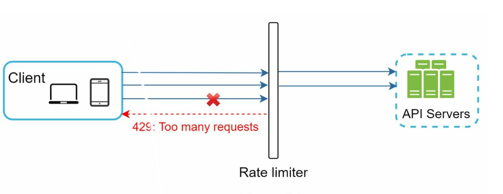
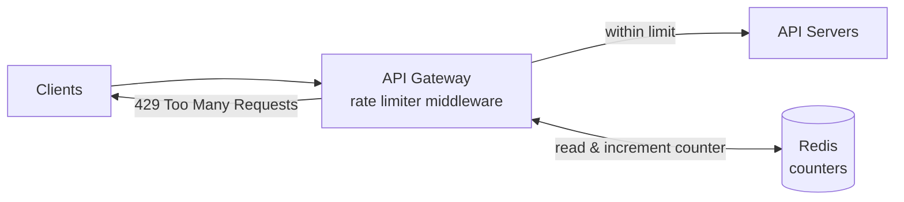
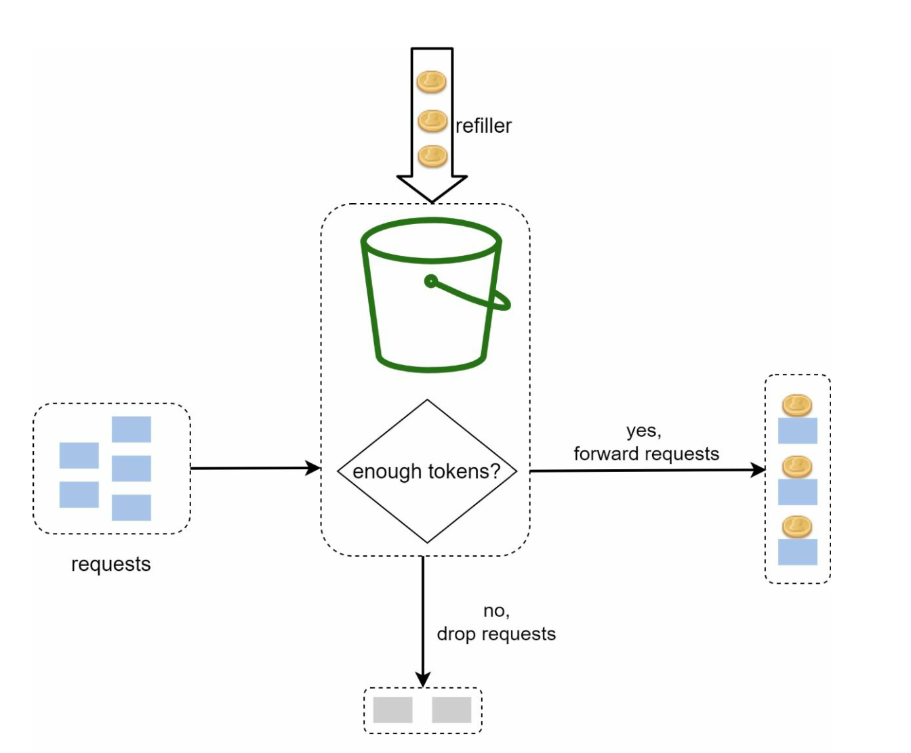
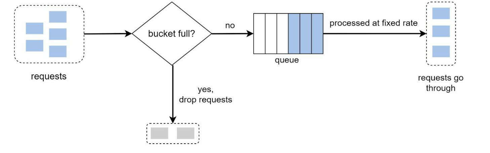
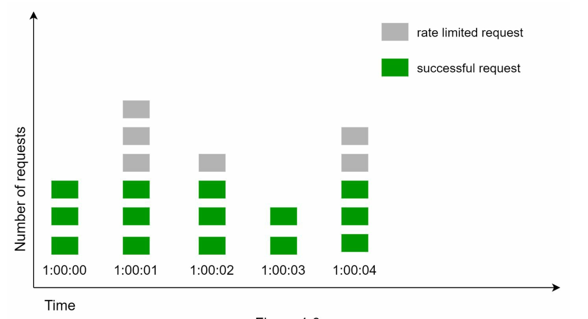
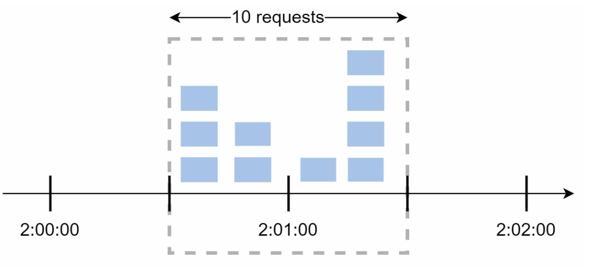
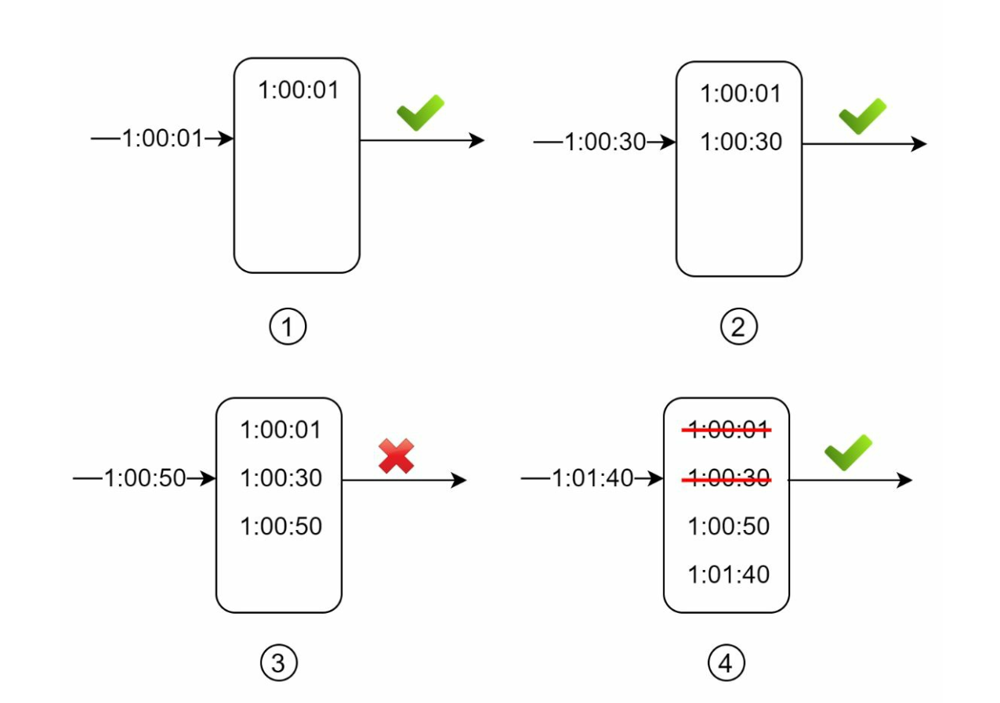
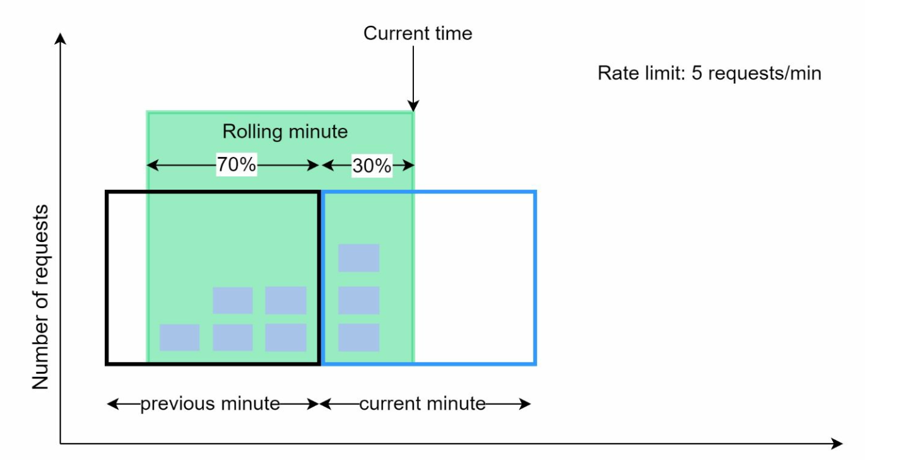
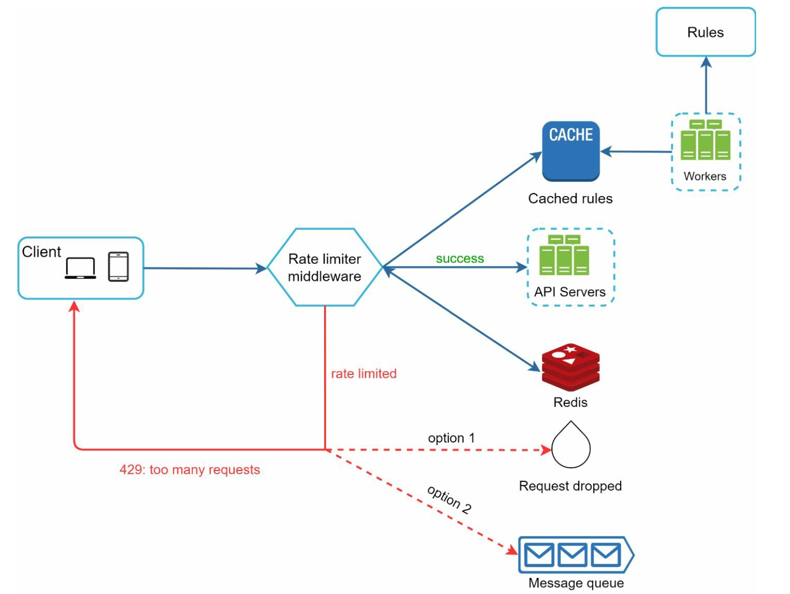
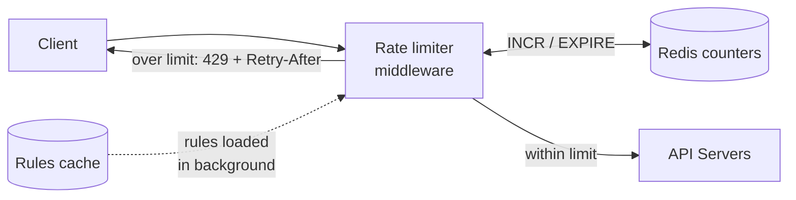

# Chapter 4: Design a Rate Limiter

## Introduction
This chapter explores the design and implementation of a rate limiter—a system component used to control traffic rates sent by clients or services. Rate limiters are crucial for preventing abuse, reducing costs, and ensuring the stability of server resources. Examples of their use include limiting posts, account creations, and reward claims.

The mechanic is simple: count how many requests an identified client has made in a time window, and if the count exceeds a threshold, reject the excess — conventionally with **HTTP 429 Too Many Requests**. Almost all of the design work is in the three decisions underneath that sentence:

1. **Who is "the client"?** An IP, a user ID, an API key, a tenant — this choice decides whether the limiter is fair or useless.
2. **How do you count?** Five standard algorithms, trading accuracy against memory and burst tolerance.
3. **Where does the count live?** The moment you have more than one limiter instance, counting becomes a distributed-systems problem.

> **Interview angle:** this is a deceptively small problem that goes deep fast. Interviewers use it because the naive answer ("a counter in Redis") is reachable in two minutes, leaving twenty minutes to probe race conditions, accuracy trade-offs, and what happens when Redis is down. Expect the whole interview to live in [Step 3](#step-3-rate-limiting-algorithms) and [Advanced Considerations](#advanced-considerations).

## Benefits of Rate Limiting
- **Preventing DoS Attacks:** Blocking excess calls to avoid resource starvation.
- **Cost Reduction:** Limiting unnecessary requests to reduce server expenses.
- **Preventing Overloads:** Filtering out excessive requests to stabilize server performance.
- **Protecting a fragile downstream dependency.** Often the thing you are really protecting is not your own service but a slow database, a third-party API with its own quota, or an expensive ML model behind it.
- **Fairness between tenants.** On a shared platform, one customer's runaway script should degrade their own experience, not everyone's. This is frequently the *primary* motivation, not abuse prevention.
- **Enforcing a commercial tier.** Free tier 100 requests/day, paid tier 100,000 — the rate limiter is how the pricing page becomes real.

## Step 1: Understanding the Problem
### Key Features
- Server-side API rate limiter.
- Support for multiple throttle rules.
- Handle large-scale systems in distributed environments.
- Option for a standalone service or application-level code.
- Inform users when throttled.

### Requirements
- Accurate request throttling.
- Minimal latency.
- Low memory usage.
- Distributed capability.
- Clear exception handling.
- High fault tolerance.

### Questions worth asking
Following the framework from [Chapter 3](../03.%20System%20Design%20Framework/), the answers here change the design materially:

| Question | Why it changes the design |
|---|---|
| **What identifies a client?** IP, user ID, API key? | IP-based limiting breaks behind corporate NAT and mobile carrier gateways — thousands of real users share one address. Authenticated user IDs are far more accurate but unavailable for login and signup endpoints, which are exactly the ones most needing protection |
| **How strict must it be?** | "Never exceed the limit" forces an expensive exact algorithm; "roughly right" allows a cheap approximate one |
| **One limit, or many?** | Per-endpoint, per-tenant, and global limits compose, and a request may need several checks |
| **Throttle or queue?** | Rejecting is simple; delaying excess requests is traffic *shaping*, a different design |
| **Scale?** | At a few thousand QPS a single Redis is fine. At a million, the counter itself must be partitioned |
| **What happens if the limiter fails?** | The fail-open vs fail-closed decision — see [Gotchas](#gotchas--failure-modes) |

## Step 2: High-Level Design
### Placement Options
<div style="margin-left:2rem">
    
</div>

1. **Client-Side Implementation:** Unreliable due to potential misuse.
2. **Server-Side Implementation:** Preferred for control and reliability.
3. **Middleware (API Gateway):** A flexible option for integrated rate limiting.

| Placement | Pros | Cons |
|---|---|---|
| **Client-side** | No server cost; avoids the request entirely | **Not a security control** — a client you don't run can simply not implement it. Useful only as a politeness measure |
| **Server-side** (in your app) | Full control; can use application context like user tier | Every service reimplements it; the request already consumed a connection and a thread before being rejected |
| **Middleware / API gateway** | One implementation for all services; rejects traffic before it reaches your app | Another hop; limited application context; may be a managed product with its own constraints |



The important property of this shape is that **rejected traffic never reaches your application servers**, which is the whole point when the limiter exists to survive a traffic flood.

### Guidelines for Placement
- Evaluate current tech stack and choose efficient options.
- Select appropriate algorithms based on business needs.
- Use an API gateway if microservices are employed.
- Opt for commercial solutions if resources are limited.

## Step 3: Rate Limiting Algorithms
All five answer the same question — "has this client exceeded its allowance?" — and differ in how precisely they measure the window and how much memory they spend doing it.

### 1. Token Bucket
<div style="margin-left:2rem">
  
</div>

- **Description:** Tokens are added to a bucket at a fixed rate; each request consumes a token.
- **Parameters:** Bucket size and refill rate.
- **Pros:** Easy to implement, memory-efficient, supports traffic bursts.
- **Cons:** Requires careful parameter tuning.

**Worked example.** Bucket size 4, refill rate 4 tokens/minute. A client idle for a minute has 4 tokens saved up, so it may fire 4 requests instantly — then it is throttled to one request every 15 seconds until it builds up credit again.

The two parameters do genuinely different jobs, and conflating them is the usual tuning mistake:
- **Refill rate** sets the sustained throughput you are willing to serve.
- **Bucket size** sets how large a burst you tolerate, by deciding how much unused allowance can accumulate.

Implementation is cheap because you don't store a token count ticking down in real time — you store `(tokens_remaining, last_refill_timestamp)` per client, **two values**, and compute the refill lazily on each request from elapsed time.

This is the most widely used algorithm in practice (Stripe, Amazon API Gateway, and most API products behave this way), because allowing short bursts while capping sustained rate matches how real clients actually behave.

### 2. Leaking Bucket
<div style="margin-left:2rem">
  
</div>

- **Description:** Processes requests at a fixed rate using a FIFO queue.
- **Pros:** Memory-efficient, stable outflow rate.
- **Cons:** Traffic bursts may delay recent requests.
  

  Example: https://github.com/uber-go/ratelimit

**The distinction that matters:** token bucket is a *policing* algorithm — it rejects excess immediately. Leaking bucket is a *shaping* algorithm — it queues excess and releases it at a constant rate. That makes leaking bucket the right choice when the downstream system needs a perfectly smooth input (a legacy service that falls over above 100 QPS, a third-party API with a hard quota), and the wrong choice for a user-facing API, where a request queued for 30 seconds is worse for the user than a fast rejection they can retry.

If the queue fills, requests are dropped — so the queue length is a latency budget, not a safety net.

### 3. Fixed Window Counter
<div style="margin-left:2rem">
  
</div>

- **Description:** Divides time into fixed intervals and uses counters to limit requests.
- **Pros:** Simple, efficient for specific use cases.
- **Cons:** Traffic spikes at window edges can exceed limits.

- Sudden burst of traffic at the edges of time windows
could cause more requests than allowed quota to go through.

  

**The edge problem, concretely.** With a limit of 5 requests per minute, a client sends 5 requests between 00:30 and 01:00, then 5 more between 01:00 and 01:30. Both windows are within limit, yet **10 requests landed inside a single 60-second span** — double the intended rate. In the worst case this algorithm permits 2× the configured limit.

It is nonetheless extremely common, because it is one Redis operation (`INCR` with a TTL) and the 2× worst case is often acceptable. It is a poor choice when the limit protects something with a hard ceiling.

### 4. Sliding Window Log
<div style="margin-left:2rem">
  
</div>

- **Description:** Tracks timestamps to allow a rolling time window.
- **Pros:** Accurate rate limiting.
- **Cons:** High memory consumption.

This is the **exact** algorithm: keep a timestamp for every accepted request, drop timestamps older than the window, and compare the remaining count to the limit. It has no edge-case inaccuracy at all.

The cost is memory proportional to the *limit* multiplied by the *number of clients*. With a 1,000 requests/minute limit and 1 million active clients, that is 1 billion timestamps — at 8 bytes each, 8 GB of raw data, and considerably more once you account for the per-entry overhead of a Redis sorted set. Note that it also stores timestamps for **rejected** requests in some implementations, which means an attacker can inflate your memory usage by sending traffic you are already refusing.

Use it when exactness is genuinely required and the client count is modest.

### 5. Sliding Window Counter
<div style="margin-left:2rem">
  
</div>

- **Description:** Combines fixed window and sliding log methods for smoothing spikes.
- **Pros:** Memory-efficient, handles traffic bursts.
- **Cons:** Approximation may not be perfectly strict.

It keeps only two counters — current window and previous window — and estimates the rolling count by weighting the previous window by how much of it still overlaps:

```
count = requests_in_current_window
      + requests_in_previous_window x (overlap % of previous window)
```

**Worked example.** Limit 7 requests/minute. The previous minute saw 5 requests, the current minute has seen 3, and we are 30% into the current minute:

```
count = 3 + 5 x (100% - 30%)
      = 3 + 3.5
      = 6.5  ->  6 requests
6 < 7, so the request is allowed.
```

The approximation assumes requests were spread evenly across the previous window, which is not always true — so it can occasionally admit slightly more or fewer than the exact limit. In practice the error is small (Cloudflare reported well under 1% of requests being wrongly handled), which is why this is the usual choice when fixed-window's 2× burst is unacceptable but a timestamp log is too expensive.

### Choosing between them

| Algorithm | Accuracy | Memory per client | Allows bursts? | Complexity | Reach for it when |
|---|---|---|---|---|---|
| **Token bucket** | Good | 2 values | **Yes, deliberately** | Low | The default for user-facing APIs |
| **Leaking bucket** | Good | Queue size | No — smooths instead | Medium | A downstream system needs a constant rate |
| **Fixed window** | Poor (up to 2× overshoot) | 1 counter | At window edges, accidentally | **Lowest** | Simplicity matters more than precision |
| **Sliding window log** | **Exact** | 1 timestamp per request | No | Medium | Hard limits, modest client counts |
| **Sliding window counter** | Very good (approximate) | 2 counters | Slightly | Medium | Best general accuracy-to-cost ratio |

> **Interview angle:** do not just list all five. Pick one, justify it against the requirements you established, and name its weakness. "Token bucket, because API clients legitimately burst and I want to allow that — the tuning risk is that an over-large bucket lets a client dump its whole daily allowance in one second."

## High-Level Architecture
<div style="margin-left:2rem">
  
</div>

- **Data Storage:** Use in-memory caching (e.g., Redis) for fast counter operations.
- **Steps:**
  1. Client sends request to middleware.
  2. Middleware checks counters in Redis.
  3. Request is processed or rejected based on limits.

Redis is the standard choice here for three specific reasons, worth being able to state: it is in-memory so the check costs well under a millisecond; `INCR` and `EXPIRE` give atomic counting and automatic cleanup without a sweeper job; and it is shared, so every limiter instance sees the same count.



### Rate limiting rules
Rules are configuration, not code — typically written as files, held on disk, and loaded into an in-memory cache by a background worker so the hot path never reads from disk:

```yaml
domain: auth
descriptors:
  - key: auth_type
    value: login
    rate_limit:
      unit: minute
      requests_per_unit: 5
```

```yaml
domain: messaging
descriptors:
  - key: message_type
    value: marketing
    rate_limit:
      unit: day
      requests_per_unit: 5
```

### What the client sees when throttled
Rejecting correctly is part of the design, and it is commonly overlooked:

- **`429 Too Many Requests`** is the status code.
- **`Retry-After`** tells the client how long to wait. Without it, clients retry immediately and make the overload worse.
- Informational headers let a well-behaved client self-regulate *before* being rejected:

| Header | Meaning |
|---|---|
| `X-Ratelimit-Limit` | How many requests the client may make per window |
| `X-Ratelimit-Remaining` | How many remain in the current window |
| `X-Ratelimit-Retry-After` | Seconds to wait before retrying |

Rejected requests can also be dropped silently or pushed to a queue for later processing, depending on how important they are — a dropped analytics event is fine; a dropped payment webhook is not.

## Advanced Considerations
### Distributed Environments
- **Challenges:** Race conditions, synchronization issues.
- **Solutions:** Use locks, Lua scripts, or sorted sets in Redis. Employ centralized data stores for synchronization.

**The race condition, concretely.** Two requests from the same client arrive at two limiter instances simultaneously. Both read `counter = 3`, both add one, both write `4`. The true count should be 5, and under sustained concurrency a client can substantially exceed its limit.

The fix is to make read-modify-write **atomic**, and the options are not equal:

| Approach | Verdict |
|---|---|
| **Locks** | Technically correct, but a lock per request adds a round trip and serialises your hottest path. Usually the wrong answer despite being the first one people reach for |
| **Redis `INCR`** | Already atomic server-side, and returns the new value. Sufficient for fixed-window counters |
| **Lua script** | Runs atomically inside Redis, so multi-step logic (token bucket refill, sliding window counter) stays race-free in one round trip. The general answer |
| **Sorted sets** (`ZADD` + `ZREMRANGEBYSCORE` + `ZCARD`) | The natural fit for sliding window log, ideally wrapped in a Lua script or pipeline |

**Synchronization** is the other half. Sticky sessions — pinning a client to one limiter instance so its counter stays local — appear to solve the problem and reintroduce every drawback from [Chapter 1 §8](../01.%20Scaling/#section-8-stateless-web-tier): you can no longer scale or redeploy the limiter freely. A centralized store keeps the limiter tier stateless, which is what you want.

### Performance Optimizations
- Multi-data center setups for reduced latency.
- Eventual consistency models for synchronization.

Cross-region latency (~100 ms, see [Chapter 2](../02.%20Back%20Of%20the%20Envelope%20Estimation/)) makes a synchronous global counter impossible to put on the request path. The usual compromise is **per-region counters with eventual reconciliation**: a client is allowed up to its limit in each region, so a globally distributed attacker can exceed the global limit by roughly the number of regions. That is normally an acceptable trade for keeping the check fast — but say so explicitly rather than claiming a global limit you cannot enforce.

### Monitoring
- Regular analytics to ensure algorithm effectiveness and adjust rules as needed.

Specifically, watch for the two failure directions: **too strict** (legitimate users getting 429s — check the rejection rate per endpoint and per tier) and **too loose** (the limit never triggers during real traffic surges, so it isn't protecting anything).

### Gotchas & failure modes

- **Fail-open or fail-closed?** If Redis is unreachable, do you let every request through or reject every request? **Fail-open** is usually right for a limiter protecting against abuse — a brief period of unlimited traffic beats a total outage — but **fail-closed** is right when the limiter protects something that will be damaged by overload. Decide deliberately; an unhandled exception in the limiter decides it for you, badly.
- **The limiter is now on the critical path.** Every request pays its latency and depends on its availability. This is the argument for a local in-process cache in front of the shared counter, accepting slight inaccuracy for resilience.
- **Identifying the client is the weakest link.** IP limiting punishes everyone behind a corporate NAT or a mobile carrier gateway, while IPv6 gives an attacker effectively unlimited addresses. User-ID limiting is accurate but unavailable precisely on login and signup. The practical answer is layered limits — a loose IP limit plus a tight per-account limit — and a separate, much stricter limit on authentication endpoints.
- **Synchronised retries after a reset.** With fixed windows, every throttled client retries the instant the window rolls over, producing a spike at each boundary. Jitter the `Retry-After` value, and prefer clients that back off exponentially.
- **Retry storms.** A client that retries immediately on 429 turns one rejection into a flood. `Retry-After` plus documented exponential backoff is the mitigation — and the reason the headers above are worth implementing.
- **Clock skew.** Time-window algorithms depend on consistent time across instances. Compute the window from the Redis server's clock rather than each limiter's local clock.
- **Rate limiting the wrong unit.** Limiting *requests* when the real constraint is work done means one expensive query can still exhaust the backend while staying within limit. For such APIs, charge a variable number of tokens per request by cost.
- **Limits that aren't communicated are a support burden.** Publish them in the docs and surface them in headers; silent throttling makes clients think your API is broken.

> **Interview angle:** "what happens when Redis goes down?" is the most common follow-up in this chapter, and the expected answer is an explicit fail-open/fail-closed decision tied to *why* the limiter exists. The second most common is the race condition — make sure you can describe the interleaving and why a Lua script beats a lock.

## Self-check
1. Why is a client-side rate limiter not a security control?
2. A limit of 100 requests/minute uses a fixed window. What is the largest number of requests a client can make in any 60-second span, and why?
3. Which algorithm would you pick for an API whose clients legitimately burst, and what is its tuning risk?
4. Two limiter instances both read a counter of 3 at the same moment. What goes wrong, and what are three ways to fix it?
5. Your rate limiter's Redis cluster becomes unreachable. What should happen to incoming traffic, and what does the answer depend on?
6. Why is IP-based limiting a poor fit for a mobile app, and what would you use instead on a login endpoint?
7. You run in three regions and cannot afford a synchronous global counter. What is the actual limit a determined client can achieve?

## Glossary

| Term | Meaning |
|---|---|
| **Throttling** | Rejecting or delaying requests that exceed an allowance |
| **Policing vs shaping** | Rejecting excess traffic (token bucket) vs queueing and smoothing it (leaking bucket) |
| **Burst** | A short spike of requests above the sustained rate, which token bucket permits by design |
| **429** | `Too Many Requests` — the HTTP status for a throttled request |
| **`Retry-After`** | Response header telling the client how long to wait |
| **Fail-open / fail-closed** | On limiter failure, allowing all traffic through vs rejecting all of it |
| **Atomic increment** | A read-modify-write that cannot interleave with another, e.g. Redis `INCR` |
| **Sticky session** | Pinning a client to one server instance — convenient here, but it makes the tier stateful |

## Where to go next
- [Chapter 1 – Scale From Zero To Millions Of Users](../01.%20Scaling/) — the caching and stateless-tier ideas this chapter depends on.
- [Chapter 5 – Design Consistent Hashing](../05.%20Consistent%20Hashing/) — how to partition the counter store once one Redis is not enough.
- [Circuit Breaker](https://martinfowler.com/bliki/CircuitBreaker.html) — the complementary pattern: rate limiting protects you from your callers, circuit breaking protects you from your dependencies.
