# Chapter 5: Design Consistent Hashing

## Introduction
This chapter explores consistent hashing, a technique essential for achieving horizontal scaling by efficiently distributing requests and data across servers. It minimizes data redistribution when servers are added or removed and ensures an even distribution of data to mitigate issues like server hotspots.

**The one-sentence version:** with ordinary `hash(key) % N`, changing the number of servers remaps almost every key; with consistent hashing, it remaps roughly `1/N` of them. That difference is what makes it possible to add a cache node at peak traffic without taking the database down with you.

This is a *technique* chapter rather than a system-design chapter — it is the mechanism behind the sharding in [Chapter 1 §12](../01.%20Scaling/#section-12-database-scaling) and the partitioning in [Chapter 6](../06.%20Key-Value%20Store/), and it turns up constantly as a follow-up question elsewhere.

## The Rehashing Problem
### Explanation
In traditional hashing methods, such as `serverIndex = hash(key) % N`, data redistribution becomes problematic when the number of servers changes. For example:
- Removing a server causes most keys to be reassigned, leading to cache misses.
- Adding a server results in unnecessary key redistributions.

  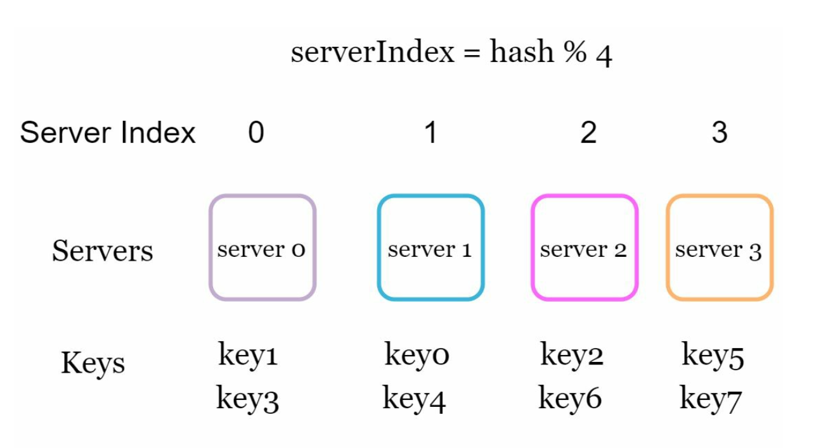

- This approach works well when the size of the server pool is fixed. However, problems arise when new servers are added, or existing servers are removed.

  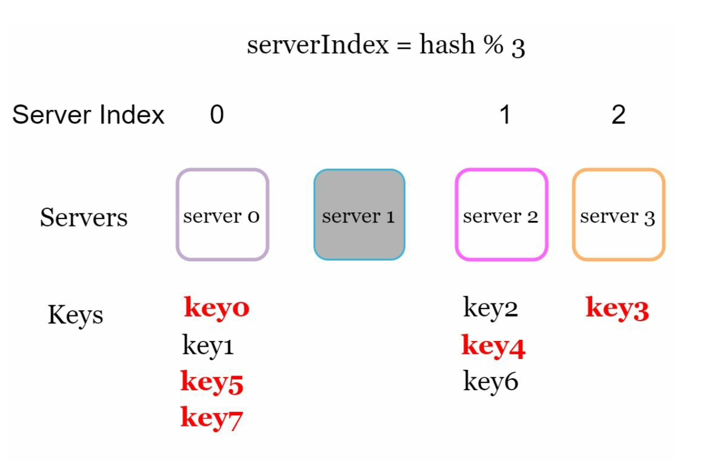

### Key Issue
Redistribution of most keys when server count changes causes inefficiency and overload.

### How bad is it, exactly?
Take four servers and six keys. The assignment is `hash(key) % 4`:

| Key | hash | `% 4` | `% 3` after server 1 dies | Moved? |
|---|---|---|---|---|
| key0 | 18358617 | 1 | 0 | **yes** |
| key1 | 26143584 | 0 | 0 | no |
| key2 | 18131146 | 2 | 1 | **yes** |
| key3 | 35863496 | 0 | 2 | **yes** |
| key4 | 34085809 | 1 | 1 | no |
| key5 | 27581703 | 3 | 0 | **yes** |

Losing one server out of four moved **two-thirds of the keys**, even though only a quarter of the capacity disappeared. In general, going from `N` to `N-1` servers leaves only about `1/N` of keys in place — the modulus changed, so almost every key computes a different answer.

**Why this is a production emergency, not an inconvenience.** If these servers are a cache, nearly every key is now on the wrong node, so nearly every request is a cache miss, and the full read load lands on the database at the exact moment you are already one server short. This is the cold-cache outage pattern from [Chapter 1 §6](../01.%20Scaling/#section-6-caching), triggered by a routine scaling event.

> **Interview angle:** being able to state "mod-N remaps roughly `(N-1)/N` of keys, consistent hashing remaps roughly `1/N`" with the reasoning behind it is the core of this chapter. Everything else is detail.

## Consistent Hashing
### Definition
Consistent hashing ensures that only a fraction of keys are remapped when servers are added or removed. This minimizes disruptions and enhances scalability.

The trick is to stop computing a server *index* — which depends on `N` and therefore changes when `N` changes — and instead give keys and servers **fixed positions** in a shared space, then assign each key to whichever server is nearest. A server's position does not move when another server joins or leaves, so only the keys in the immediate neighbourhood of the change are affected.

### Key Concepts
1. **Hash Space and Ring:** The hash space forms a continuous ring, with hash values distributed from `0` to `2^160-1` (e.g., using hash function like SHA-1). By connecting both ends we get a ring.
    

    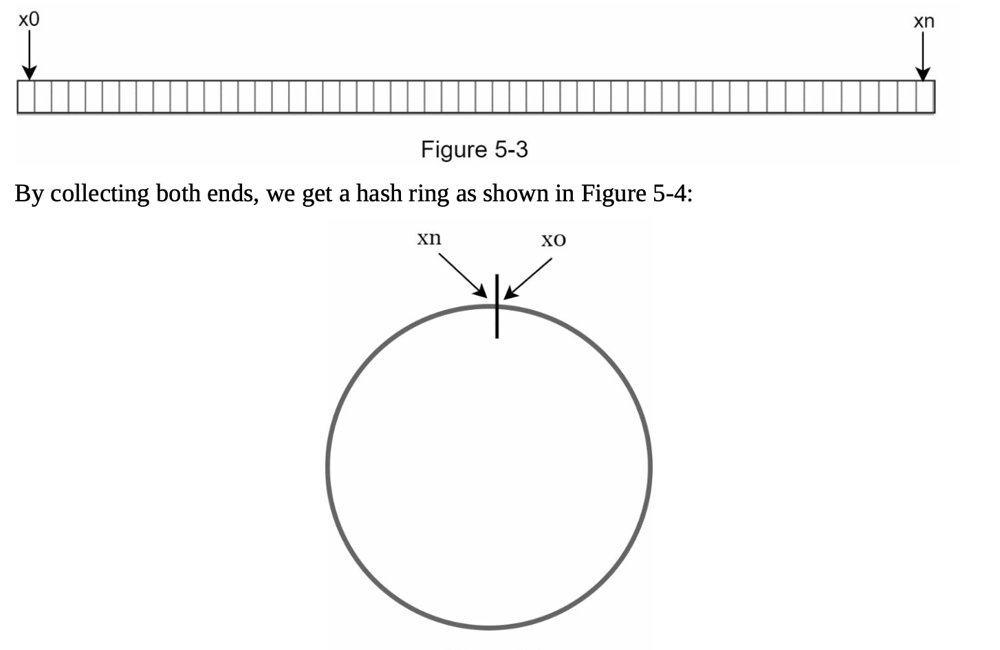
    

- Using the same hash function f, we map servers based on server IP or name onto the ring.  

    

    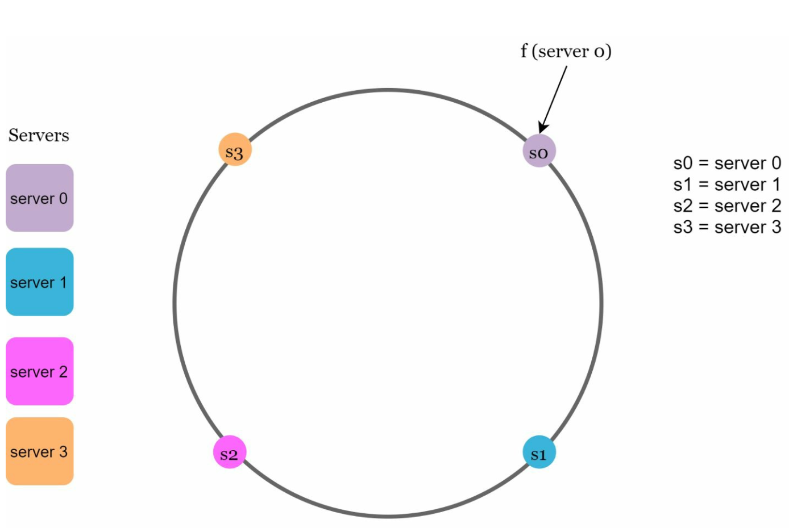
    

2. **Server Lookup**
- A key's server is determined by traversing clockwise on the ring until a server is found.

  

  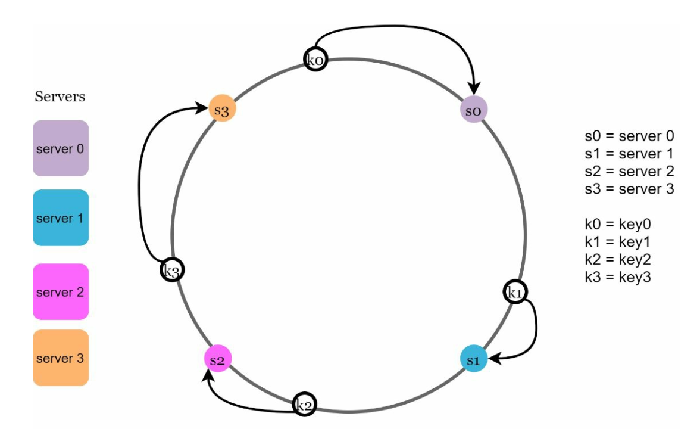
  

3. **Adding and Removing Servers**
- Adding a server redistributes only nearby keys. Only a fraction of keys are redistributed to the new server.
  
  

  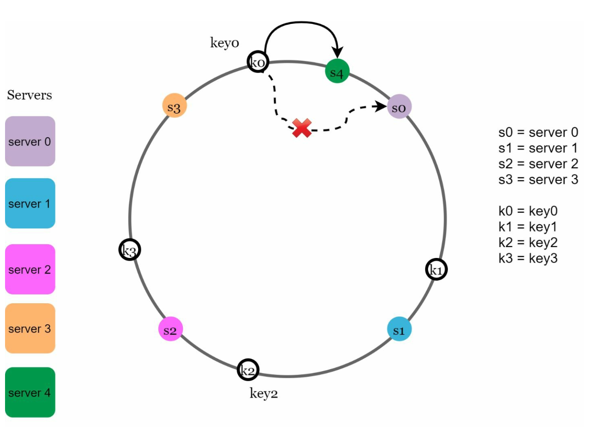
  

- Removing a server affects only the keys in its range. Only keys from the removed server are reassigned to the next server clockwise.

  

  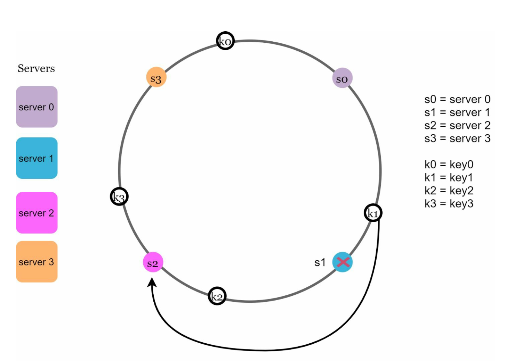
  

### The lookup, step by step

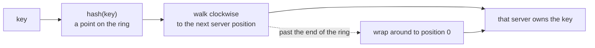

The wrap-around is not a special case to be apologised for — it is what makes the space a *ring* rather than a line, and it means every point has an owner.

**Implementation note.** The ring is not a literal circular structure. It is a **sorted array of server positions**, and the clockwise walk is a **binary search** for the first position greater than `hash(key)`, wrapping to index 0 if there is none. That makes lookup `O(log n)` in the number of positions, and `n` is small — this is why the whole thing is cheap enough to run on every request.

## Challenges and Solutions
### Two Issues in Basic Approach
1. **Uneven Partition Sizes:** Servers may have unequal data partitions.
2. **Non-uniform Key Distribution:** Some servers may receive significantly more keys than others.

Both stem from the same cause: with only a handful of servers hashed onto a huge ring, their positions land wherever the hash function puts them, which is **random, not evenly spaced**. Three servers might sit close together on one arc, leaving one server responsible for most of the ring. Removing a server makes it worse — its entire range is inherited by a single successor, which now owns a double-sized partition.

### Solution: Virtual Nodes
- Each server is represented by multiple virtual nodes on the ring uniformly distributed on the ring.
- Virtual nodes improve key distribution and balance load. As the number of virtual nodes increases, the distribution of keys       becomes more balanced. This is because the standard deviation gets smaller with more virtual nodes, leading to balanced data distribution.
   
  

  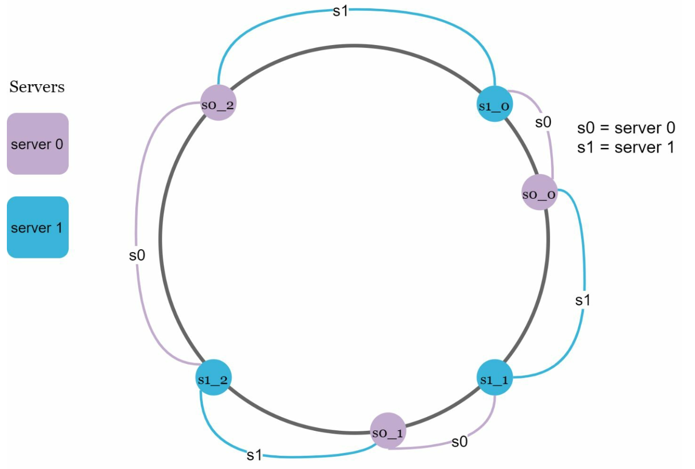
  

Instead of hashing `server1` once, hash `server1#0`, `server1#1`, … `server1#199` and place all 200 points on the ring. Each server now owns 200 small scattered arcs instead of one large contiguous one, and the law of large numbers does the balancing for you.

| Virtual nodes per server | Approximate standard deviation of load |
|---|---|
| 1 | Very large — individual servers can own multiples of their fair share |
| 100 | ~10% of the mean |
| 200 | ~5% of the mean |
| 512 / 1024 | Smaller still, with diminishing returns |

**The trade-off:** more virtual nodes means better balance but a larger ring to store, search, and distribute to every client. Several hundred per server is the usual range (Cassandra historically defaulted to 256), and the right number depends on how much imbalance you can tolerate.

Virtual nodes also unlock **heterogeneous hardware**: give a server twice the capacity twice as many virtual nodes and it receives roughly twice the keys — proportional weighting that plain consistent hashing cannot express.

**A second benefit that is easy to miss:** when a server fails, its virtual nodes are scattered around the ring, so its load is inherited by *many* successors in small pieces rather than dumped wholesale onto one neighbour. Failure spreads out instead of cascading.

## Affected Keys
When servers are added or removed:
- **Added Server:** Affected keys are those between the new server and its predecessor.
  In the following example server 4 is added onto the ring. The affected range starts from s4 (newly
  added node) and moves anticlockwise around the ring until a server is found (s3). Thus, keys
  located between s3 and s4 need to be redistributed to s4.

  

  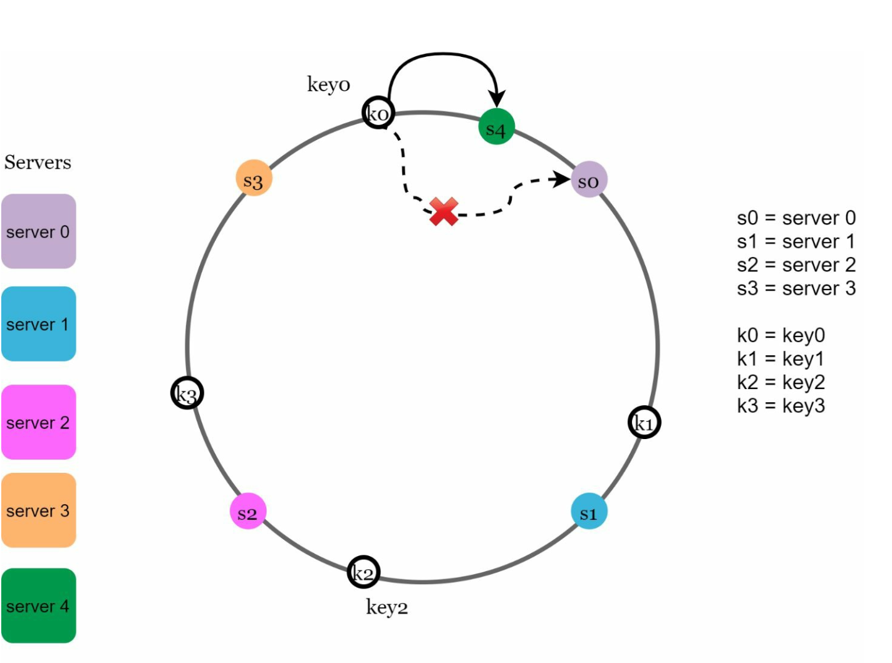
  

- **Removed Server:** Affected keys are those between the removed server and its predecessor. In the following example when a server (s1) is removed, the affected range starts from s1
(removed node) and moves anticlockwise around the ring until a server is found (s0). Thus, keys located between s0 and s1 must be redistributed to s2.

  

  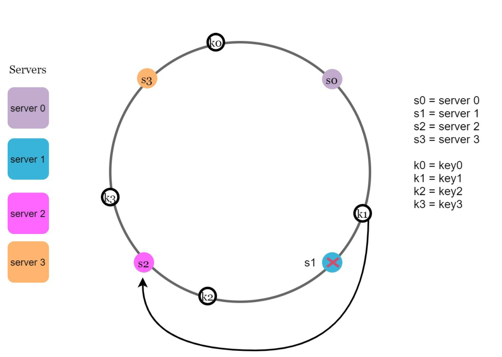
  

The rule in one line: **a change affects only the arc between the changed node and its anticlockwise predecessor.** Every other key keeps the same owner, which is precisely the property the mod-N scheme lacks.

## Benefits of Consistent Hashing
- **Minimized Redistribution:** Only a fraction of keys are reassigned.
- **Scalability:** Enables horizontal scaling.
- **Mitigates Hotspots:** Balances data distribution to avoid server overload.

### Compared with the alternatives

| Scheme | Keys moved when a node changes | Lookup cost | Weighted nodes | Notes |
|---|---|---|---|---|
| **`hash(key) % N`** | ~all of them | O(1) | No | Fine only for a genuinely fixed pool |
| **Consistent hashing** | ~`1/N` | O(log n) | Yes, via virtual nodes | The general answer; needs virtual nodes to balance |
| **Rendezvous (HRW) hashing** | ~`1/N` | O(n) — hash against every node | Yes, natively | Simpler, no ring to maintain; fine for small `n` |
| **Jump consistent hash** | ~`1/N` | O(log n) | No | Very fast and compact, but nodes must be numbered `0..n-1`, so arbitrary removal is awkward |
| **Maglev hashing** | Small | O(1) via a lookup table | Yes | Google's load-balancer scheme; optimised for fast lookup and connection stability |

### Gotchas & failure modes

- **It balances keys, not traffic.** Consistent hashing distributes the *key space* evenly; it says nothing about how often each key is requested. One viral key still saturates one node — the hot-key problem from [Chapter 1 §6](../01.%20Scaling/#section-6-caching), which needs replication or a local cache instead. **Consistent hashing is not a solution to hot keys**, and claiming otherwise is a common misstep.
- **Adding a node still causes a miss burst.** `1/N` of keys move, so `1/N` of cache reads miss and fall through to the database. Much better than mod-N, but not free — add nodes gradually rather than doubling the cluster at peak.
- **Every client must agree on the ring.** The ring is shared state. If two clients disagree about which nodes exist, they will route the same key to different servers and silently split the data. Ring membership therefore needs a distribution mechanism — a config service, or a gossip protocol as in [Chapter 6](../06.%20Key-Value%20Store/#5-handling-failures).
- **The hash function must distribute uniformly.** MD5 and SHA-1 are fine, and faster non-cryptographic hashes like MurmurHash are common. Language-provided `hashCode`-style functions often are not uniform enough, and a clustered hash reintroduces the imbalance virtual nodes exist to remove.
- **Cryptographic strength is irrelevant here.** SHA-1 is used for its distribution, not its security; its collision weaknesses do not matter for partitioning.
- **Replication needs care with virtual nodes.** "Store copies on the next N nodes clockwise" can land several replicas on the *same physical server*, because consecutive virtual nodes may belong to one machine — which silently destroys your redundancy. Skip virtual nodes belonging to a server you have already chosen. See [Chapter 6 §2](../06.%20Key-Value%20Store/#2-data-replication).
- **Imbalance is bounded only on average.** Even with virtual nodes, load varies. The *consistent hashing with bounded loads* variant caps how much any node may exceed the mean by overflowing to the next node, trading strict placement for a hard fairness guarantee.

> **Interview angle:** the follow-ups that separate depth from recall are "how do you actually find the right node — surely you don't walk a circle?" (sorted array plus binary search) and "doesn't this fix the celebrity problem?" (no — it balances keys, not requests).

## Real-World Applications
- Amazon Dynamo DB
- Apache Cassandra
- Discord
- Akamai CDN
- Maglev Load Balancer

Broadly, it shows up wherever a *changing* set of nodes must agree on who owns what without coordination:

| Use | What the "key" is | Why it matters here |
|---|---|---|
| Distributed caches (Memcached, Redis clusters) | Cache key | Avoids mass misses when a node is added or lost |
| Partitioned databases (Cassandra, DynamoDB) | Partition key | Enables adding capacity without a full reshard |
| Load balancers (Maglev) | Connection 5-tuple | Keeps a connection pinned to one backend across pool changes |
| CDNs (Akamai) | Content URL | Keeps a given object on the same edge node, so it stays cached |
| Chat and presence sharding (Discord) | Guild / room ID | Routes all traffic for a room to the node holding its state |

## Self-check
1. With 10 servers and `hash(key) % N`, roughly what fraction of keys move when one server is removed? And with consistent hashing?
2. Why does adding a server to a mod-N cache cluster risk taking down the database?
3. How is the "walk clockwise" step actually implemented, and what is its complexity?
4. Three servers hash to nearby positions on the ring. What goes wrong, and what fixes it?
5. You give one server 400 virtual nodes and the others 200. What have you expressed?
6. A single key receives 40% of all traffic. Does consistent hashing help? What does?
7. Why can "replicate to the next 3 nodes clockwise" be unsafe when virtual nodes are in use?

## Glossary

| Term | Meaning |
|---|---|
| **Hash ring** | The hash output space `0 .. 2^160-1` treated as a circle, with both ends joined |
| **Rehashing problem** | Mass key remapping when `N` changes under `hash(key) % N` |
| **Virtual node (vnode)** | One of many ring positions representing a single physical server |
| **Successor** | The first server found walking clockwise from a position — the owner of that key |
| **Affected range** | The arc between a changed node and its anticlockwise predecessor; the only keys that move |
| **Rendezvous hashing** | An alternative that scores every node per key and picks the highest |
| **Bounded loads** | A variant capping how far any node's load may exceed the average |

## Where to go next
- [Chapter 1 §12 – Database Scaling](../01.%20Scaling/#section-12-database-scaling) — the sharding problem this technique solves.
- [Chapter 6 – Design A Key-Value Store](../06.%20Key-Value%20Store/) — consistent hashing used in anger, with replication on top.
- [Chapter 7 – Unique ID Generator](../07.%20Unique-Id%20Generator/) — the other thing sharding breaks.
