# Chapter 6: Design a Key-Value Store

## Introduction
A **key-value store** is a type of non-relational database where data is stored as key-value pairs. Each key is unique, and values are accessed using these keys. This chapter details how to design a scalable, high-availability distributed key-value store that supports operations like:
- `put(key, value)` for inserting data.
- `get(key)` for retrieving data.

The API is two functions, which is exactly why this problem is a favourite: **nothing is hidden behind the interface.** Every hard part of distributed systems — partitioning, replication, consistency, failure detection, conflict resolution, storage engines — has to be solved explicitly, and none of it can be delegated to a query planner.

This chapter is essentially a walk through the design of Amazon Dynamo and Apache Cassandra. It builds directly on [Chapter 5](../05.%20Consistent%20Hashing/), which supplies the partitioning scheme.

### Characteristics of the Design
- Small key-value pairs (<10 KB).
- Supports big data with high availability and scalability.
- Automatic scaling and tunable consistency.
- Low latency.

> **Interview angle:** the structure of this chapter *is* the structure of a good answer. Partition → replicate → make consistency tunable → handle failures → describe the storage engine. If you can recite that spine and justify each step, you can rebuild the whole design under pressure.

---

## Single Server Key-Value Store
### Implementation
- Use a **hash table** to store key-value pairs in memory.
- Optimizations:
  - Data compression.
  - Storing less frequently accessed data on disk.

### Limitation
A single server's memory is limited, requiring a **distributed approach** for scalability.

Start here in an interview anyway — it takes thirty seconds, it is genuinely correct for small data, and it establishes the constraint that motivates everything after it. A machine with a few hundred GB of RAM holds a lot of 10 KB values; it is when the dataset exceeds what one machine can hold, or when one machine's failure is unacceptable, that you must distribute.

---

## Distributed Key-Value Store
A **distributed key-value store** partitions data across multiple servers and must address trade-offs outlined by the **CAP theorem**.

### CAP Theorem
1. **Consistency:** All clients see the same data simultaneously.
2. **Availability:** The system responds to every request, even if some nodes are down.
3. **Partition Tolerance:** The system continues to operate despite network partitions.

**Trade-off:** According to CAP theorem only two of the three guarantees can be achieved.

<p align="center">
  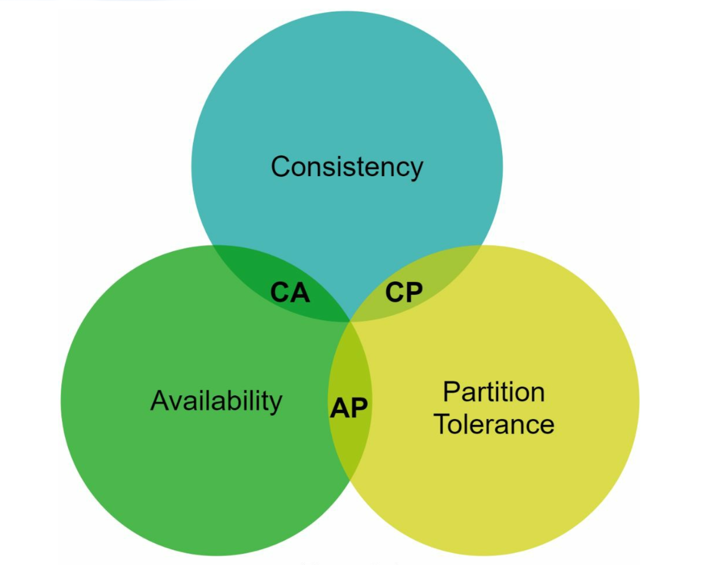
</p>

#### System Types:
- **CP Systems:** Consistency and partition tolerance while sacrificing availability (e.g., banking systems).
- **AP Systems:** Availability and partition tolerance while sacrificing consistency (e.g., eventual consistency).
- **CA Systems:** Consistency and Availability while sacrificing partition tolerance.

    **Since network failure is unavoidable, a distributed system must tolerate network partition. Thus, a CA system cannot exist in real-world applications.**

    In a distributed system, partitions are inevitable. When a partition occurs, we must choose between consistency and availability. For example, if node n3 goes down, 
    any data written to nodes n1 or n2 cannot be propagated to n3. Conversely, if data is written to n3 but not yet propagated to n1 and n2, nodes n1 and n2 will have stale data.

    <p align="center">
    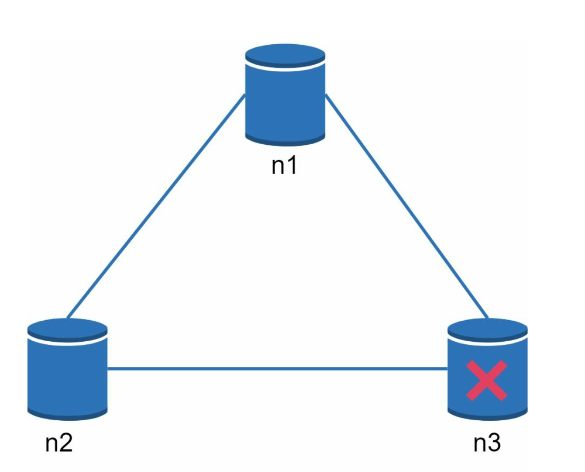
    </p>
    
- If we choose CP system, we must block all write operations to n1 and n2 to avoid data inconsistency.
- If we choose AP system, the system keeps accepting reads, even though it might return stale data. 
For writes, n1 and n2 keep accepting writes,
and data will be synced to n3 when the network partition is resolved.

#### Stating CAP precisely
"Pick two of three" is the popular phrasing and it is slightly misleading. The accurate statement is narrower and more useful:

> **When a network partition occurs, you must choose between consistency and availability.** When there is no partition, you can have both.

That is why CA "doesn't exist" — partitions are not a design choice, they are a fact about networks, so P is always required and the real choice is binary: CP or AP, *during a partition*.

| | **CP** — choose consistency | **AP** — choose availability |
|---|---|---|
| During a partition | Refuse requests it cannot serve correctly | Keep serving, possibly with stale data |
| The user sees | An error or a timeout | An answer that may be out of date |
| Right for | Balances, inventory, bookings, anything where a wrong answer costs money | Feeds, carts, session data, metrics, likes |
| Examples | HBase, ZooKeeper, etcd, Spanner | Dynamo, Cassandra, Riak |

**The extension worth knowing: PACELC.** CAP only describes behaviour during a partition, which is rare. PACELC adds the common case: *if there is a **P**artition, choose **A** or **C**; **E**lse, choose **L**atency or **C**onsistency.* Even when the network is perfectly healthy, waiting for more replicas to acknowledge a write buys consistency at the cost of latency. This is the trade-off you actually make every day, and it is exactly what the quorum settings below expose as a dial.

This chapter designs an **AP system** with tunable consistency — the Dynamo model.

---

## System Components
### 1. Data Partitioning
- **Technique:** Consistent Hashing is used to distribute data across multiple servers evenly.
- **Advantages:**
  - Automatic scaling with server addition/removal.
  - Heterogeneity through virtual nodes. The number of virtual nodes for a server is proportional to the server capacity.

This is [Chapter 5](../05.%20Consistent%20Hashing/) applied directly. The two properties being bought are that adding or removing a node moves only about `1/N` of the data, and that virtual nodes let servers of different sizes carry proportional shares.

### 2. Data Replication
- Replicate data across `N` servers for high availability.
- The N servers are chosen by walking clockwise from the server position and choose the first N servers on the ring to store data copies.

    <p align="center">
    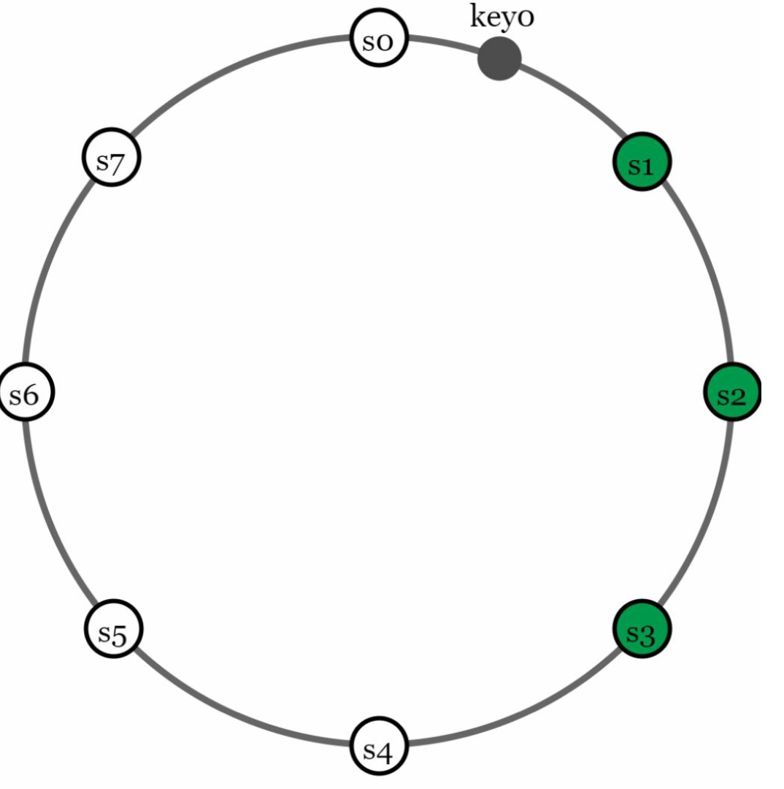
    </p>

**The virtual-node subtlety.** Because each physical server owns many virtual nodes, "the first N nodes clockwise" can easily select several virtual nodes that belong to the **same physical machine** — leaving you with three replicas on one box and no redundancy at all. The fix is to **skip virtual nodes whose physical server you have already chosen**, continuing clockwise until N *distinct* physical servers are found.

For the same reason, replicas are placed in **distinct data centers** where possible, connected by high-speed links, so that losing a rack or a region does not take every copy with it.

### 3. Consistency
Since data is replicated at multiple nodes, it must be synchronized across replicas.
- **Quorum Consensus:**
  - `N`: Total replicas.
  - `W`: Write quorum size. For a write to be considered successful, write must be acknowledged from W replicas.
  - `R`: Read quorum size. For a read to be considered as successful, read must wait for responses from at least R replicas.
  - **Rule:** `W + R > N` ensures strong consistency.
  - The configuration of W, R and N is a typical tradeoff between latency and consistency. 

    <p align="center">
    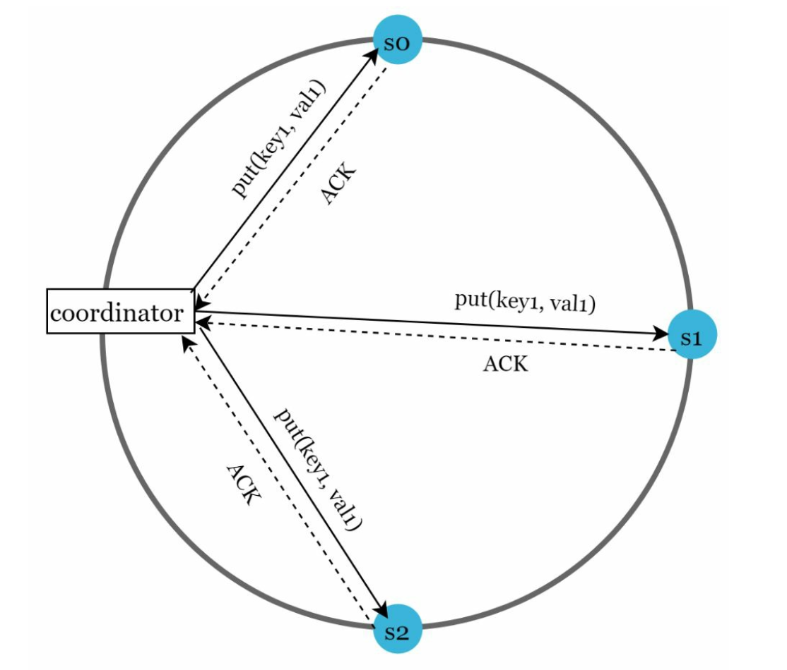
    </p>
    
    - If R = 1 and W = N, the system is optimized for a fast read.
    - If W = 1 and R = N, the system is optimized for fast write.
    - If W + R > N, strong consistency is guaranteed (Usually N = 3, W = R = 2).
    - If W + R <= N, strong consistency is not guaranteed.

**Why `W + R > N` works** — and this is a one-line proof worth being able to give: if the write touched `W` replicas and the read consults `R` replicas out of `N`, then `W + R > N` forces the two sets to **overlap in at least one replica**. That replica has the latest write, so the read is guaranteed to see it. Versioning then decides which of the returned values is newest.

| N | W | R | `W+R>N` | Behaviour |
|---|---|---|---|---|
| 3 | 1 | 1 | No | Fastest reads and writes; eventual consistency only |
| 3 | 3 | 1 | Yes | Fast reads, slow and fragile writes — one node down blocks all writes |
| 3 | 1 | 3 | Yes | Fast writes, slow reads; any node down blocks all reads |
| 3 | 2 | 2 | Yes | **The usual default.** Tolerates one node failure for both reads and writes |

`N=3, W=2, R=2` is standard because it is the smallest configuration that is both strongly consistent *and* survives a single node failure — with `W=3` a single dead replica makes the system unwritable.

- **Models**:
  - **Strong Consistency:** A read operation returns a value corresponding to the result of the most updated write data item.
  - **Weak Consistency:** Subsequent read operations may not see the most updated value.
  - **Eventual Consistency:** Given enough time, all updates are propagated, and all replicas are consistent.

"Eventual consistency" is a family, not a single guarantee, and being specific about which member you need is what makes it a usable answer:

| Model | Guarantee |
|---|---|
| **Read-your-own-writes** | A client always sees its own writes, though maybe not others' |
| **Monotonic reads** | A client never sees data move *backwards* in time |
| **Consistent prefix** | Writes are seen in the order they happened, possibly delayed |
| **Eventual** | Only that replicas converge, given no new writes |

The read-your-own-writes problem is the same one that replication lag creates in [Chapter 1 §5](../01.%20Scaling/#section-5-database-replication) — here it is tunable rather than accidental.


### 4. Inconsistency Resolution
Replication gives high availability but causes inconsistencies among replicas. Versioning and
vector clocks are used to solve inconsistency problems.
- **Versioning:** 
    - Use **vector clocks** to track data versions and resolve conflicts.
    - Versioning means treating each data modification as a new immutable version of data.
        <p align="left">
        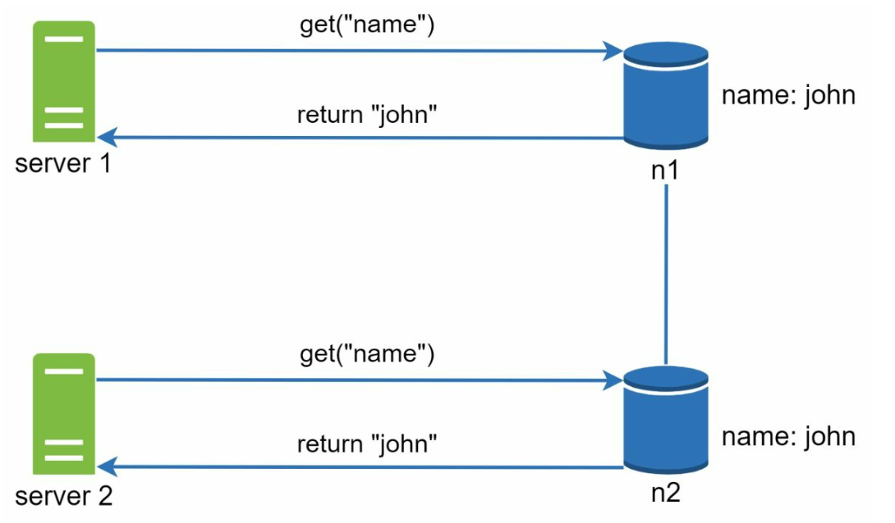
        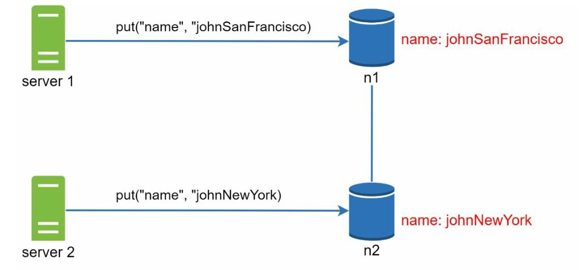
        </p>
    
    - Server 1 changes the name , and server 2 also changes the name. These two changes are performed simultaneously. Now, we have conflicting values, called versions v1 and v2.


- **Vector Clock**
    1. **Setup**: A vector clock is a [server, version] pair associated with a data item. It can be used to check
        if one version precedes, succeeds, or in conflict with others.
        - Assume a vector clock represented by D([S1, v1], [S2, v2], …, [Sn, vn]), If data item D is written to server
        Si, the system must perform one of the following tasks.
        - Where: `D` is the data item.`Si` is the server identifier.`vi` is the version counter for the data at server `Si`.

    2. **Updating the Vector Clock:**  When a data item is modified at a server:
        - If the server exists in the vector clock, its version counter is incremented.
        - Otherwise, a new entry is added to the vector clock.

    3. **Conflict Detection:**
        - **No Conflict:** A version X is an ancestor of version Y if all counters in X are less than or equal to those in Y.
        - **Conflict Exists:** Two versions are siblings if there is at least one counter in Y that is less than its counterpart in X.

    4. **Conflict Resolution:** When conflicts are detected (sibling versions), the system relies on application-specific logic or client intervention to   reconcile the data.

        <p align="center">
        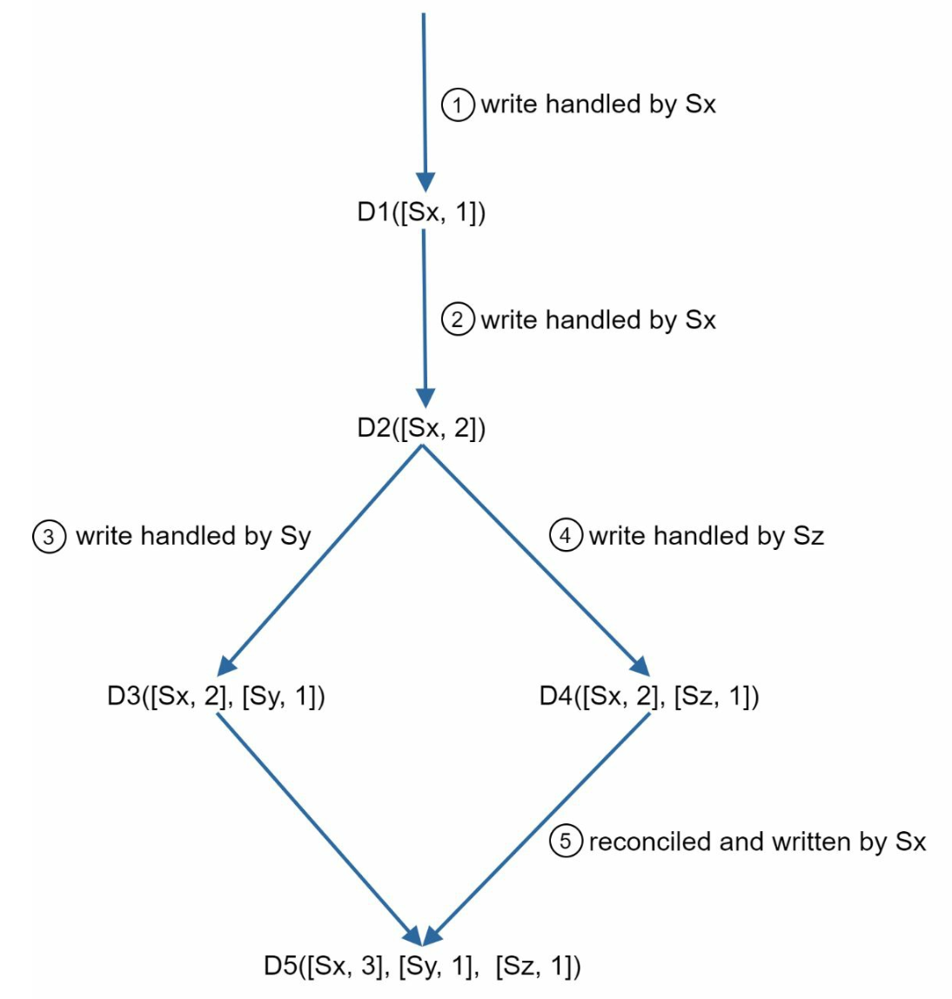
        </p>

**A worked trace.** Follow the counters and the conflict becomes obvious:

```
1. Client writes D1, handled by Sx   ->  D1([Sx,1])
2. Client updates it, handled by Sx  ->  D2([Sx,2])
3. Client updates D2, handled by Sy  ->  D3([Sx,2], [Sy,1])
4. A DIFFERENT client reads D2 and
   updates it, handled by Sz         ->  D4([Sx,2], [Sz,1])

   D3 has [Sy,1] which D4 lacks.
   D4 has [Sz,1] which D3 lacks.
   Neither descends from the other  ->  CONFLICT (siblings)

5. A client reads, receives both D3 and D4, reconciles them,
   and writes the result            ->  D5([Sx,3], [Sy,1], [Sz,1])
```

The rule in words: **if every counter in X is ≤ the corresponding counter in Y, then X happened before Y and can be discarded. If each has a counter the other lacks, they are concurrent and the system cannot decide** — so it returns both and asks the application to merge.

Amazon's canonical example is a shopping cart: when two versions conflict, the system returns both and the application takes the **union** of the items. The visible symptom — a deleted item reappearing in your cart — is the price paid for a cart that is always writable.

**The cheaper alternative: last-write-wins (LWW).** Attach a timestamp and keep the newer value. It is trivial to implement and is what Cassandra does by default — but it **silently discards one of the two concurrent writes**, and it depends on clocks agreeing across machines, which they do not. Choose it when losing an occasional concurrent update is acceptable, and know that you have chosen it.

- **Challenges:**
  - Increased complexity for clients.
  - Vector clock size may grow with many updates, requiring trimming strategies to limit its size.

Trimming has a real cost: dropping the oldest `[server, version]` entries can make two versions *look* like ancestors when they are actually siblings, so a genuine conflict is missed and a write is lost. Dynamo capped the list length and accepted this as a rare, tolerable inefficiency.


### 5. Handling Failures

#### a. Failure Detection
It is insufficient to believe that a server is down because another server says so.Usually, it requires at least two independent sources of information to mark a server down.
- **Gossip Protocol:**
    <p align="left">
        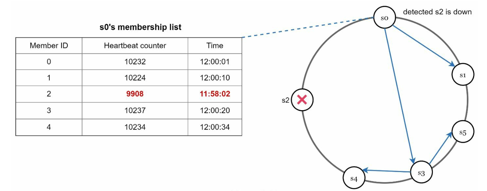
    </p>

    - Each node maintains member IDs and heartbeat counters.
    - Each node periodically increments its heartbeat counter.
    - Each node periodically sends heartbeats to a set of random nodes.
    - If the heartbeat has not increased for more than predefined periods, the member is
    considered as offline

**Why gossip rather than everyone pinging everyone?** All-to-all heartbeating costs `O(n²)` messages, which stops being viable at a few hundred nodes. Gossip spreads membership information in `O(log n)` rounds at constant cost per node — each node talks to a few random peers and the news propagates epidemically. It is also decentralised, so there is no monitoring node to become a single point of failure.

The requirement for **two independent sources** before marking a node down exists because one node's inability to reach another may mean the *reporter* is partitioned, not the target. Marking a healthy node dead triggers unnecessary data movement, and in the worst case a cascade.

#### b. Temporary Failures
- **Sloppy Quorum:** Use healthy nodes to maintain operations temporarily.
        <p align="center">
        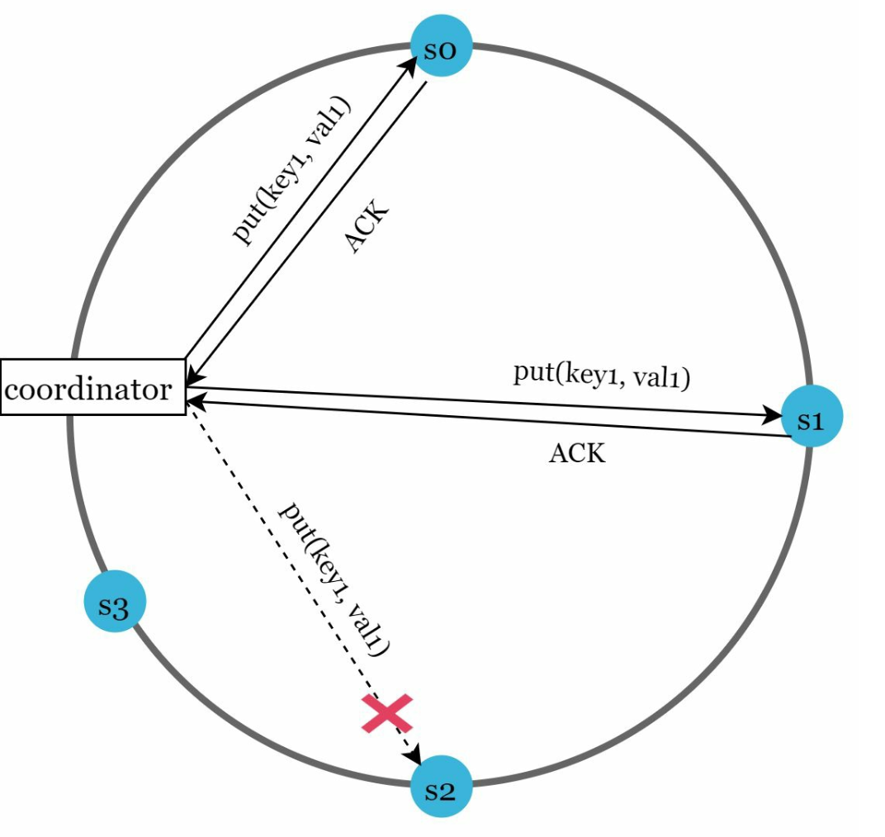
        </p>

    - After detecting failures, the system needs to deploy certain mechanisms to ensure availability
    - Instead of enforcing the quorum requirement, the system chooses the first W healthy servers for writes and first R
    healthy servers for reads on the hash ring. 
    - Offline servers are ignored. If a server is unavailable, another server will process requests temporarily


- **Hinted Handoff:** Offline servers catch up with changes upon recovery.
    - When the down server is up, changes will be pushed back to achieve data consistency

The pair works like this: a **sloppy quorum** keeps writes succeeding by accepting them on whichever `W` nodes are reachable — *not necessarily the N nodes that own the key*. The substitute node stores the data with a **hint** recording where it really belongs, and hands it back when the rightful owner returns.

The cost is honest to state: during a sloppy quorum, `W + R > N` **no longer guarantees an overlap**, because the write may have landed entirely outside the key's home replicas. Availability is preserved by weakening the consistency guarantee for the duration — which is the AP choice from CAP, made concrete.

#### c. Permanent Failures
- Use **Merkle Trees** for efficient synchronization between replicas.
    A **Merkle Tree** (or hash tree) is a data structure to efficiently detect and resolve inconsistencies between replicas during permanent failures. 

- Working
    1. **Structure:**
        - **Leaf Nodes** store the hash of individual data blocks.
        - **Non-Leaf Nodes** store the hash of their child nodes.
        - The **root hash** represents the combined state of all data in the tree.

    2. **Building a Merkle Tree:**
        - **Step 1:** Divide the key space into buckets.
            
            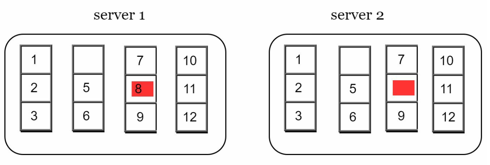

        - **Step 2:** Hash each key in a bucket using uniform hashing.

            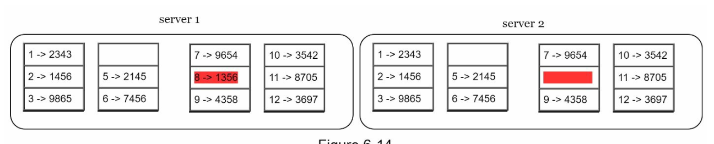

        - **Step 3:** Create a single hash for each bucket.
        
            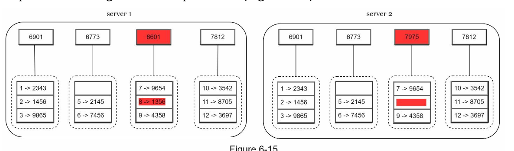

        - **Step 4:** Combine hashes of buckets to compute higher-level hashes, culminating in the root hash.

            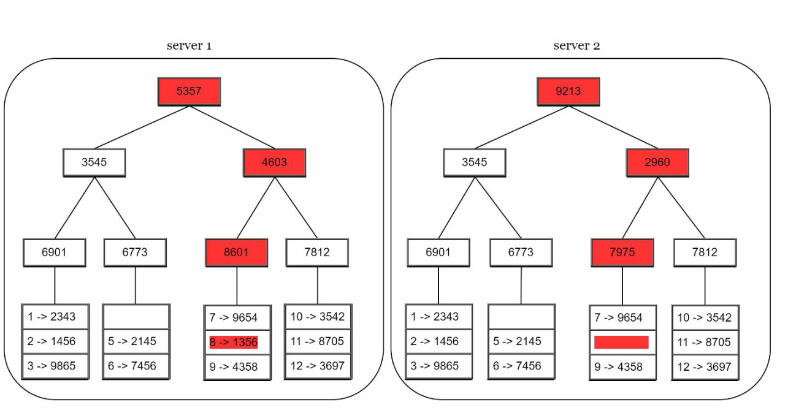


    3. **Synchronization:**
        - To synchronize two replicas:
            - Compare their root hashes.
            - If the root hashes match, the replicas are consistent.
            - If the root hashes differ, compare child hashes recursively to identify inconsistent buckets.
        - Only the inconsistent data is synchronized.

- Advantages
    - **Efficiency:** Only inconsistent data is synchronized, reducing data transfer.
    - **Scalability:** Effective for large datasets with minimal synchronization overhead.
    - **Reliability:** Ensures data consistency across replicas.

**The point in one sentence:** comparing two replicas naively means transferring and comparing every key, but a Merkle tree finds the differing buckets in roughly `O(log n)` comparisons and transfers **only the data that actually differs** — so two replicas holding a terabyte of identical data confirm agreement by exchanging a single root hash.

This background repair process is called **anti-entropy**, and it is what eventual consistency relies on to be *eventual* rather than merely hopeful. The usual complement is **read repair**: when a read discovers replicas disagreeing, the newest value is written back immediately, so frequently read keys heal without waiting for the next anti-entropy pass.

### 6. Handling Data Center Outages
- Replicate data across multiple data centers to ensure availability during outages.

---

## Write and Read Paths
### 1. Write Path (Based on Cassandra architecture)

<p align="left">
    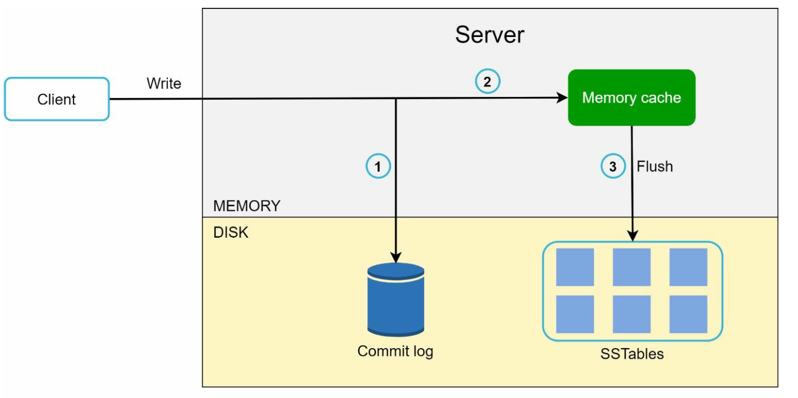
</p>

- Persist the write in a **commit log**.
- Save data to a **memory cache**.
- Flush data to **SSTable** (Sorted String Table) on disk when cache is full.

This is an **LSM tree** (log-structured merge tree), and the reason it is used rather than the B-tree in a relational database is worth understanding, because it explains the whole shape of the storage engine.

The insight: **random disk writes are slow, sequential writes are fast** — the 10 ms seek versus 30 ms-per-MB sequential figures from [Chapter 2](../02.%20Back%20Of%20the%20Envelope%20Estimation/). So instead of updating data in place where it belongs, never update anything:

1. **Commit log (write-ahead log).** Append the write to a sequential file. This is the durability guarantee — if the process dies, the log is replayed on restart.
2. **Memtable.** Apply the write to a sorted in-memory structure. The write is now acknowledged; it has touched no random disk location at all.
3. **Flush to SSTable.** When the memtable is full, write it to disk **once, sequentially**, as an immutable sorted file.
4. **Compaction.** A background process merges SSTables, discarding superseded values and tombstones (deletion markers) to stop files multiplying forever.

Note that a **delete is also a write** — a tombstone — because files are immutable. Space is only reclaimed at compaction, which is why deletions in these systems do not immediately free disk.

### 2. Read Path
<p align="left">
    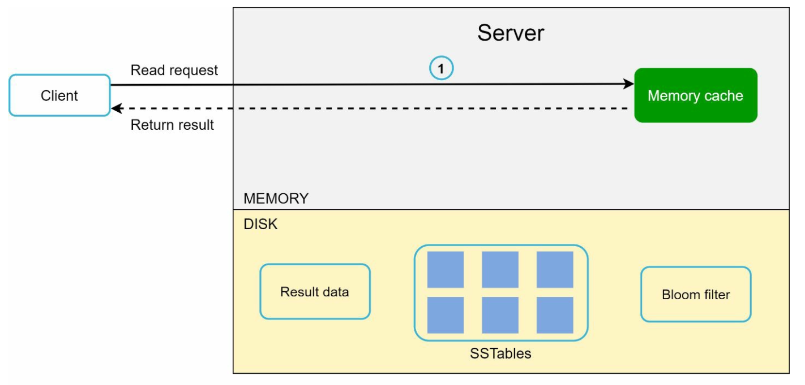
    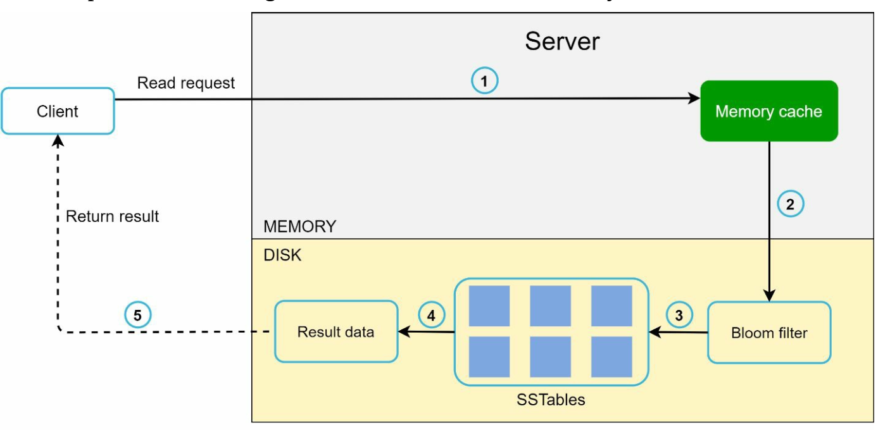
</p>

- Check **memory cache** for the data.
- If absent, use a **Bloom Filter** to locate the data in SSTables.
- Retrieve and return the data.

The read is harder than the write, because a key may live in the memtable or in any of several SSTables. Checking each one on disk would be ruinous — hence the **Bloom filter**, a compact probabilistic structure answering "is this key *possibly* in this SSTable?":

- **No false negatives.** A "no" is definitive, so the SSTable can be skipped without touching the disk.
- **Tunable false positives.** A "yes" may be wrong, costing one wasted disk read. Around 10 bits per key gives roughly a 1% false-positive rate.

So the read checks the memtable, consults each SSTable's Bloom filter, and reads only the files that might contain the key — newest first.

| | **LSM tree** (Cassandra, RocksDB, HBase) | **B-tree** (PostgreSQL, InnoDB) |
|---|---|---|
| Writes | Sequential appends — very fast | Update in place — random I/O |
| Reads | May consult several SSTables | One tree traversal, predictable |
| Background work | Compaction, which competes for I/O | Comparatively little |
| Space | Temporarily holds superseded values and tombstones | Compact, with some page fragmentation |
| Best for | **Write-heavy** workloads | **Read-heavy** and transactional workloads |

> **Interview angle:** "why is a write fast if it still has to be durable?" is the question this section answers, and the answer is that the only synchronous disk operation is a **sequential append** to the commit log. If you can explain that plus the Bloom filter's role, you have covered most of what interviewers probe here.

---

## Final Architecture

<p align="center">
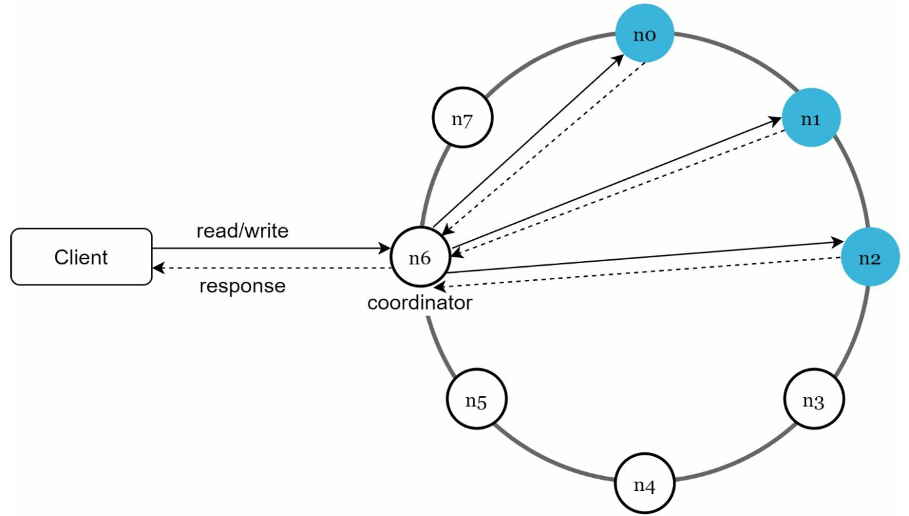
</p>


-  Clients communicate with the key-value store through simple APIs: get(key) and put(key,
value).
- A coordinator is a node that acts as a proxy between the client and the key-value store.
- Nodes are distributed on a ring using consistent hashing.
- The system is completely decentralized so adding and moving nodes can be automatic.
- Data is replicated at multiple nodes.
- There is no single point of failure as every node has the same set of responsibilities.

The **coordinator** is any node the client happens to contact — it is a role, not a dedicated server. It hashes the key, finds the N replicas on the ring, forwards the request, waits for `W` or `R` acknowledgements, resolves versions, and replies. Because every node can coordinate and every node holds the same responsibilities, there is no master to lose and no special node to fail.

### The design, as problem and technique

| Goal / problem | Technique |
|---|---|
| Store big data | Consistent hashing to spread load across servers |
| High availability reads | Data replication; multi-data-center setup |
| Highly available writes | Versioning and conflict resolution with vector clocks |
| Incremental scalability | Consistent hashing |
| Heterogeneity (servers of different sizes) | Virtual nodes proportional to capacity |
| Tunable consistency | Quorum consensus (`N`, `W`, `R`) |
| Detecting failures | Gossip protocol |
| Temporary failures | Sloppy quorum and hinted handoff |
| Permanent failures | Merkle tree anti-entropy, plus read repair |
| Data center outage | Cross-data-center replication |

### Gotchas & failure modes

- **Quorum does not make it linearizable.** `W + R > N` guarantees a read sees *a* value at least as new as the last completed write, but concurrent operations can still interleave surprisingly, and a sloppy quorum voids the guarantee entirely. If you need true linearizability, you need consensus (Paxos, Raft) and a CP system, not a quorum.
- **Last-write-wins loses data silently.** It is the default in several real systems and depends on synchronised clocks. With clock skew, an *older* write can win.
- **Hot keys are not solved here.** Consistent hashing balances the key space, not request volume — one popular key still saturates its N replicas. See [Chapter 5](../05.%20Consistent%20Hashing/#gotchas--failure-modes).
- **Tombstones and the delete problem.** Deletions consume space until compaction, and a tombstone must outlive any replica that might still hold the old value — delete it too early and the old value is resurrected by anti-entropy. This is why these systems have a tunable grace period, and why a node offline longer than it must be re-bootstrapped rather than simply restarted.
- **Compaction is an I/O tax.** It runs in the background and competes with live traffic, so latency spikes during heavy compaction are a well-known operational reality.
- **Range queries are awkward.** Hash partitioning scatters adjacent keys across the ring deliberately, so "all keys between X and Y" means querying every partition. If range scans matter, you need an ordered partitioner — and the hotspots it brings back.
- **Values must stay small.** The <10 KB assumption is load-bearing. Large values make replication, compaction, and repair expensive; store blobs elsewhere and keep a pointer, exactly as with the media in [Chapter 2's Twitter estimate](../02.%20Back%20Of%20the%20Envelope%20Estimation/).

## Self-check
1. Why can a CA system not exist in practice, and what does CAP actually constrain?
2. `N=3, W=2, R=2`. Prove that a read sees the latest write. Now explain why `W=3, R=1` is a worse choice.
3. Two vector clocks are `([Sx,2],[Sy,1])` and `([Sx,2],[Sz,1])`. Is one an ancestor of the other? What must the system do?
4. What does last-write-wins cost you, and when is that acceptable?
5. Why is all-to-all heartbeating replaced by gossip, and why must two nodes agree before marking a peer down?
6. During a sloppy quorum, which guarantee stops holding, and why?
7. Two replicas hold 1 TB of identical data. How many bytes must they exchange to confirm agreement?
8. Why is an LSM-tree write fast even though it is durable before acknowledgement?
9. A Bloom filter says a key is present but it isn't. What is the cost? What if it said absent when the key was present?
10. Why does deleting data in this system not immediately free disk space?

## Glossary

| Term | Meaning |
|---|---|
| **N / W / R** | Replica count, write quorum, read quorum |
| **Quorum overlap** | `W + R > N`, forcing read and write sets to share a replica |
| **Vector clock** | A list of `[server, counter]` pairs used to detect concurrent versions |
| **Sibling versions** | Two concurrent versions, neither descending from the other |
| **LWW** | Last-write-wins — timestamp-based conflict resolution that discards a version |
| **Gossip protocol** | Epidemic membership and failure detection by random peer exchange |
| **Sloppy quorum** | Accepting writes on any `W` healthy nodes, not only the key's owners |
| **Hinted handoff** | Holding a write for an absent node and delivering it on recovery |
| **Merkle tree** | Hash tree enabling cheap detection of differing data ranges |
| **Anti-entropy / read repair** | Background / on-read reconciliation of diverging replicas |
| **LSM tree** | Log-structured merge tree — the write-optimised storage engine described above |
| **SSTable** | Sorted String Table — an immutable sorted file of key-value pairs |
| **Memtable** | The in-memory sorted buffer writes land in before being flushed |
| **Tombstone** | A marker recording a deletion, since files are immutable |
| **Compaction** | Background merging of SSTables to reclaim space |
| **Bloom filter** | Probabilistic set membership with no false negatives |

## Where to go next
- [Chapter 5 – Design Consistent Hashing](../05.%20Consistent%20Hashing/) — the partitioning scheme this design assumes.
- [Chapter 1 §12 – Database Scaling](../01.%20Scaling/#section-12-database-scaling) — the same problem from the relational side.
- [Amazon Dynamo paper](https://www.allthingsdistributed.com/files/amazon-dynamo-sosp2007.pdf) — the original source for most of this chapter.
