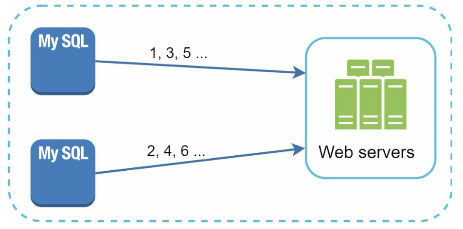
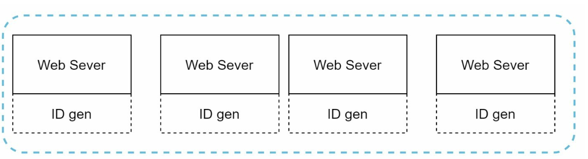
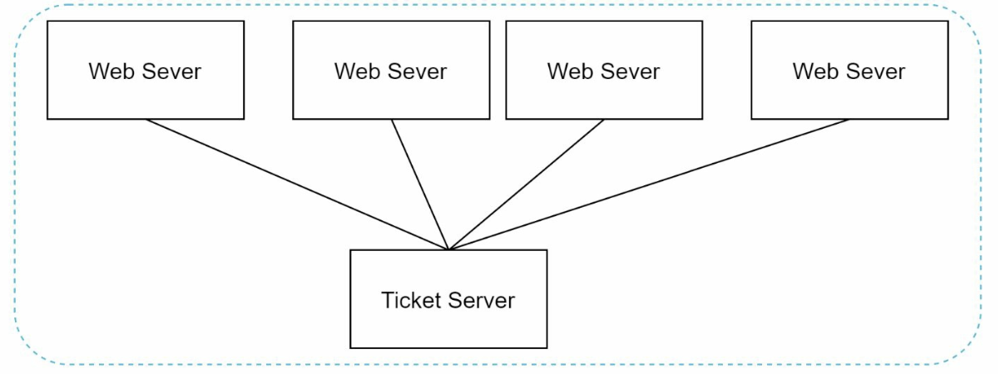
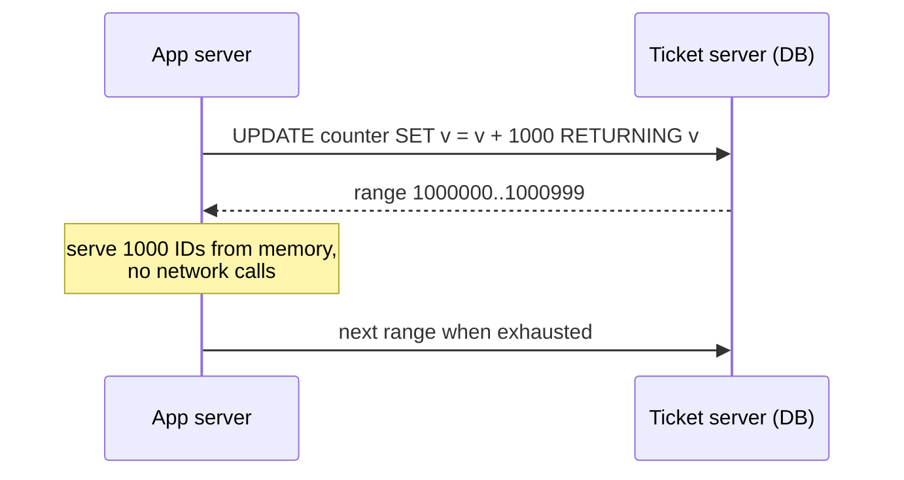
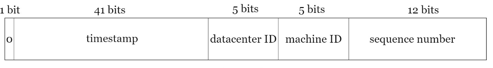
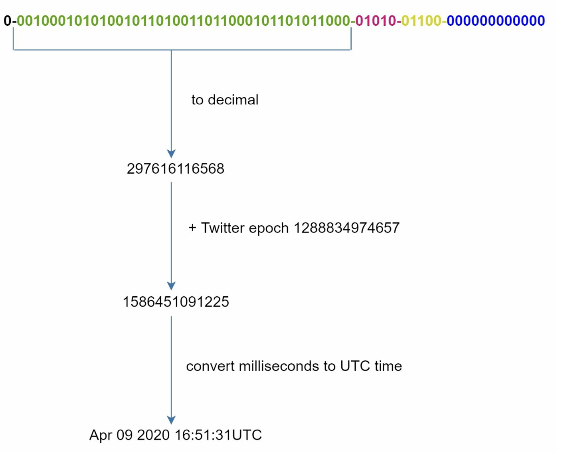
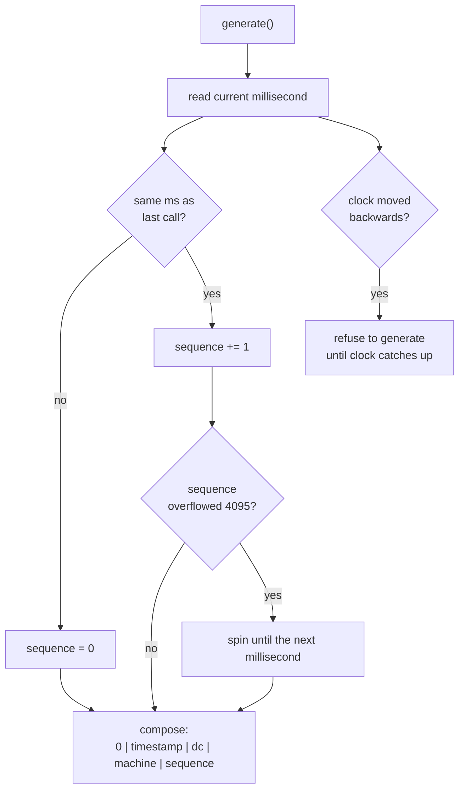

# Chapter 7: Design a Unique ID Generator in Distributed Systems

## Introduction
This chapter addresses the challenge of designing a **unique ID generator** for distributed systems. Traditional auto-increment keys are unsuitable in distributed environments due to scalability and synchronization challenges. The focus is on creating unique, sortable, 64-bit numerical IDs that meet the following requirements:
- IDs must be **unique** and **ordered by date**.
- IDs must fit within **64 bits**.
- The system should generate **over 10,000 IDs per second**.

**The one-sentence version:** a single database's `auto_increment` is unique only because every writer asks the *same* server, so the moment you have many writers the counter becomes either a bottleneck or a correctness problem — and the fix is to stop coordinating and instead **partition the ID space** so each generator can issue IDs alone, forever, without asking anyone.

This is a short chapter with a large blast radius. Sharding a database ([Chapter 1 §12](../01.%20Scaling/#section-12-database-scaling)) breaks auto-increment, so every sharded system needs this; and because the ID carries a timestamp, it quietly becomes the sort key, the cursor for pagination, and the thing your API leaks to the outside world.

---

## Step 1: Understanding the Problem
### Basic Requirements
- IDs must be unique and numerical and should fit in 64 bits.
- IDs increment with time but not strictly by `+1`.
- IDs should be sortable by date.
- System must handle high throughput (10,000 IDs/sec).

### What each requirement is actually ruling out

| Requirement | What it rules out | Why the constraint exists |
|---|---|---|
| **Unique** | Random IDs with a non-negligible collision rate | Duplicate primary keys corrupt data silently |
| **Numerical, 64 bits** | UUIDs (128 bits), strings | Fits a `BIGINT` / Java `long`; half the index size of a 128-bit key |
| **Sortable by date** | UUIDv4, hash-based IDs | Lets `ORDER BY id` replace `ORDER BY created_at`, and makes range-paginating by ID possible |
| **Increments with time, not by `+1`** | A single global counter | This is the key concession — it is what permits a decentralised design |
| **10,000 IDs/sec** | Nothing, in practice | Deliberately modest; it tells you throughput is *not* the hard part here |

The fourth row is the one to notice in an interview. "Increments with time but not strictly by `+1`" is not a detail — it is permission to abandon a global counter. Insisting on a gapless `+1` sequence forces every generator to agree on the previous value, which means consensus on the critical path of every insert.

> **Interview angle:** the requirement-gathering step is doing real work here. Ask whether IDs must be *strictly* monotonic or merely time-ordered, and whether they are publicly visible. Those two answers eliminate most of the design space before you draw anything.

---

## Step 2: High-Level Design Options
### 1. Multi-Master Replication
- **Approach:** Use database `auto_increment` with step increments (e.g., `+k` for k servers).

    

    
    

- **Drawbacks:**
  - Hard to scale across data centers.
  - IDs do not always increase with time.
  - Scaling issues when servers are added/removed.

**What broke:** one database issuing IDs is a single point of failure and a write bottleneck. Multi-master fixes availability by partitioning the counter by *residue* — server 1 issues 1, 3, 5…, server 2 issues 2, 4, 6…

**What it now costs you:** the step size `k` is baked into every server's configuration, so adding the third server means changing `k` on all of them — and any server still running with the old step will start minting IDs another server has already used. Time-ordering is also lost: server 1 might be at 1,000,001 while server 2 is at 57, so an older ID can be numerically larger. You have traded a bottleneck for a configuration hazard.

### 2. UUID (Universally Unique Identifier)
- **Approach:** 
    - Generate 128-bit unique identifiers independently on each server using UUID.
    - UUIDs can be generated independently without coordination between servers

        

        
        

- **Advantages:**
  - No coordination needed between servers.
  - Scales easily with web servers.
- **Drawbacks:**
  - Exceeds 64-bit requirement.
  - IDs are not sortable by time and may be non-numeric.

**Why collisions are genuinely not a concern.** A UUIDv4 has 122 random bits. Reaching a 50% chance of a single collision takes roughly 2.7 × 10^18 IDs — generating a billion per second, that is about 85 years. Uniqueness is achieved by making the space so large that coordination is unnecessary, which is a completely different strategy from Snowflake's (partition the space so coordination is unnecessary).

**What it costs you — and it is not mainly the 128 bits.** Random IDs are hostile to B-tree indexes. Each insert lands at a random point in the index, so the pages you need are rarely in the buffer pool, every insert risks a page split, and the index fragments. A time-ordered ID appends at the right-hand edge of the tree, where the pages are already hot. On a large table this is the difference between an index that fits its working set in memory and one that does not.

**Worth knowing:** `UUIDv7` (standardised in RFC 9562, 2024) prefixes a 48-bit Unix millisecond timestamp to random bits, making UUIDs time-sortable and index-friendly while keeping zero coordination. It is the right answer to "I want UUID's operational simplicity without the index pathology" — it just still costs 128 bits.

### 3. Ticket Server
- **Approach:** Use a centralized database server to increment and assign IDs.

    

    
    

- **Advantages:**
  - Simple to implement for small-scale systems.
  - Generates numeric IDs.
- **Drawbacks:**
  - Single point of failure.
  - Synchronization challenges in multi-server setups.

**The variant that makes this practical: batch allocation.** A naive ticket server is consulted once per ID, so it sees your entire write traffic. Instead, let each application server claim a **range** — "you own 1,000,000–1,000,999" — and serve IDs from memory until the range is exhausted. This reduces ticket-server traffic by the batch size (1000× here) and, crucially, means a brief ticket-server outage is survivable: everyone keeps issuing from their current range. Instagram and Flickr both shipped variations of this.

**What it costs you:** IDs are no longer globally time-ordered — one server may be handing out 1,000,500 while another, which claimed its range earlier, is still on 1,000,100. Gaps also appear whenever a server restarts and abandons the unused tail of its range. And Flickr's answer to the single point of failure — two ticket servers, one issuing odd numbers and one even — reintroduces exactly the multi-master coupling from option 1, just with only two values of `k`.

### 4. Twitter Snowflake Approach
- **Approach:** 

    

      
    

    

      
    

    - Divide IDs into sections to ensure uniqueness and scalability.
    - **Sign Bit (1 bit):** Always `0`, potentially distinguishing signed and unsigned numbers.
    - **Timestamp (41 bits):** Milliseconds since a custom epoch (Twitter's default is `1288834974657`, equivalent to Nov 04, 2010, 01:42:54 UTC). Ensures IDs are time-ordered.
    - **Datacenter ID (5 bits):** Identifies up to `2^5 = 32` datacenters.
    - **Machine ID (5 bits):** Identifies up to `2^5 = 32` machines within each datacenter.
    - **Sequence Number (12 bits):** Tracks IDs generated on a machine within the same millisecond, supporting up to `2^12 = 4096` IDs per millisecond. The sequence resets to `0` every millisecond.

- **Advantages:**
    - **Scalability:** Handles 10,000+ IDs per second across multiple servers.
    - **Time-Order:** Ensures IDs are sortable by time.
    - **Decentralization:** No single point of failure.

**The idea in one line:** uniqueness comes from the fact that no two generators share a `(timestamp, datacenter, machine, sequence)` tuple. Two generators cannot collide because their machine bits differ; one generator cannot collide with itself because within a millisecond its sequence differs, and across milliseconds its timestamp differs. No coordination is required at generation time — all the coordination happened once, when machine IDs were assigned.

---

## Step 3: Design Deep Dive — Spending the 64 Bits

Every design decision in this chapter is a decision about how to spend 64 bits. The bits are a fixed budget, and each field buys one property at the expense of another.

| Field | Bits | What it buys | What it costs |
|---|---|---|---|
| Sign | 1 | The ID is always positive, so it round-trips through languages with no unsigned 64-bit integer (Java, older JS) | A wasted bit — half the usable space |
| Timestamp | 41 | Time-ordering, and `2^41` ms ≈ **69.7 years** of lifetime from your epoch | Lifetime is finite; the clock becomes a correctness dependency |
| Datacenter + machine | 5 + 5 | `1024` concurrently running generators with no coordination | A hard ceiling on generator count, and a machine-ID assignment problem |
| Sequence | 12 | `4096` IDs per millisecond per machine = **4.096 M/s per machine** | Bursts above that stall until the next millisecond |

**Sanity-check the headroom.** The requirement is 10,000 IDs/sec. A *single* Snowflake node sustains 4.096 million IDs/sec — about 400× the requirement — and 1024 nodes give a theoretical 4.19 billion/sec. The timestamp, not throughput, is the scarce resource.

**Why a custom epoch matters.** The 69.7 years is counted from whatever epoch you choose, not from 1970. Using the Unix epoch burns 40 of those years before you start; Twitter's epoch of Nov 2010 means its IDs run out around 2080. Pick an epoch near your launch date, write it down somewhere permanent, and understand that it can never be changed — every existing ID is interpreted relative to it.

## Step 4: Additional Considerations
### 1. Clock Synchronization
- **Challenge:** ID generation assumes synchronized clocks across servers.
- **Solution:** Use **Network Time Protocol (NTP)** to minimize drift.

The dangerous case is not drift but a clock that moves **backwards** — which NTP itself causes when it *steps* a clock rather than slewing it. If the clock jumps back 50 ms, the generator will re-issue timestamps it has already used, and with the same machine ID and sequence it will mint **duplicate IDs**. The standard response is to refuse: detect `now < last_timestamp` and block (or throw) until the clock catches up, choosing a short availability outage over silent data corruption. Configure NTP to slew rather than step, and prefer a monotonic clock source for the comparison.

Leap seconds are the same hazard with a schedule. Platforms that "smear" a leap second across hours are safe; platforms that repeat a second are not.

### 2. Section Length Tuning
- Adjust section sizes (e.g., fewer sequence bits, more timestamp bits) based on use case.

The 41/5/5/12 split is Twitter's answer to Twitter's problem, not a law. Reallocate deliberately:

| If you have… | Do this | Result |
|---|---|---|
| Few machines, huge per-machine bursts | Move bits from machine to sequence | 8 bits machine (256 nodes), 14 bits sequence (16,384/ms) |
| Thousands of ephemeral containers | Move bits from sequence to machine | 14 bits machine (16,384 nodes), 6 bits sequence (64/ms) |
| A need to outlive 69 years | Move bits to the timestamp, or coarsen its unit | 42 bits ms ≈ 139 years; or use 10 ms units for 10× the span at 10× coarser ordering |
| One logical shard per ID | Steal bits for a shard ID | Instagram embeds the shard in the ID, so the ID itself says where the row lives |

That last row is a genuinely useful trick: if the ID encodes its shard, a lookup by ID needs no routing table — you decode the shard from the ID and go straight to the right database.

### 3. High Availability
- ID generators are mission-critical and must be fault-tolerant.
- Consider redundancy and failover mechanisms.

The honest reason to prefer Snowflake is that it has **no shared runtime dependency**: the generator is a library linked into each service, so there is no ID service to be down. Run it as a separate service only if non-JVM clients need it or you want central control of machine IDs — and accept that you have then reintroduced a network hop and a thing that can fail.

### 4. Machine ID Assignment

With 10 bits of machine ID, uniqueness rests entirely on no two live generators holding the same value — the one piece of coordination the design cannot avoid.

| Approach | How it works | Risk |
|---|---|---|
| Static configuration | Each host is given an ID in its config | A cloned VM or copy-pasted config silently duplicates IDs |
| ZooKeeper / etcd sequential node | Each generator claims an ephemeral sequential znode at startup | Adds a startup dependency, but the claim is exclusive and auto-released |
| Derived from the environment | Hash the hostname, pod ordinal, or private IP | Works well with `StatefulSet` ordinals; hashing an IP can collide |

In an autoscaling or container environment, static assignment is the thing that goes wrong. A `StatefulSet` ordinal or a lease from a coordination service is worth the extra moving part.

> **Interview angle:** this is where the chapter is won. The bit-budget arithmetic (41 bits ≈ 69 years, 12 bits = 4096/ms), the clock-moves-backwards failure, and the machine-ID assignment problem are the three follow-ups almost guaranteed to come up. "Use Snowflake" is the start of the answer, not the answer.

---

## Comparing the options

| Scheme | Bits | Coordination needed | Time-sortable | Index-friendly | Main weakness |
|---|---|---|---|---|---|
| **DB auto-increment** | 64 | Every ID | Yes, strictly | Yes | Single point of failure; bottleneck |
| **Multi-master (`+k`)** | 64 | Config change per scale event | No | Yes | Reconfiguration can duplicate IDs |
| **UUIDv4** | 128 | None | No | **No** — random inserts | Size; index fragmentation |
| **UUIDv7 / ULID** | 128 | None | Yes (ms) | Yes | Still 128 bits |
| **Ticket server** | 64 | Once per batch | Roughly | Yes | Central dependency; gaps |
| **Snowflake** | 64 | Once, at machine-ID assignment | Yes (ms) | Yes | Clock dependency; leaks timestamp |
| **Mongo ObjectId** | 96 | None | Yes (s) | Yes | Second-granularity ordering |
| **KSUID** | 160 | None | Yes (s) | Yes | Large |

The pattern across the table: **uniqueness without coordination is bought either with space (UUID) or with a partitioned key space plus a clock (Snowflake)**. There is no third option, and that framing is more useful than memorising the rows.

### Gotchas & failure modes

- **The clock going backwards mints duplicates.** The single worst failure in this design, and it is caused by routine operations: an NTP step, a VM migration, a manual `date` command. Compare against the last issued timestamp and refuse to generate rather than risk it.
- **A duplicated machine ID is invisible until it isn't.** Two hosts sharing a machine ID produce identical IDs whenever they generate in the same millisecond at the same sequence value. There is no error — just a primary key violation much later, or a silently overwritten row.
- **64-bit IDs break JavaScript.** JSON numbers are IEEE-754 doubles, exact only to 2^53. A Snowflake ID exceeds that, so a browser parsing `{"id": 1234567890123456789}` gets a *different* number back, silently. Twitter's fix was to return `id_str` alongside `id`; the general fix is to serialise large IDs as strings. This bites almost everyone once.
- **"Sortable" means k-sortable, not totally ordered.** Within one millisecond, IDs from different machines interleave by machine ID, not by actual creation order. `ORDER BY id` is correct to the millisecond and arbitrary below it — fine for feeds, wrong for anything claiming a precise sequence of events.
- **Sequence exhaustion stalls, it does not fail.** Exceeding 4096 IDs in a millisecond makes the generator spin-wait for the next millisecond. Correct, but it converts a throughput problem into a latency spike, and under sustained overload the waiting is continuous.
- **Time-ordered IDs create a hot shard.** The property that makes them index-friendly also means all new rows share a timestamp prefix. Sharding *by ID range* therefore sends every insert to the newest shard. Shard by a hash of the ID, or by a field like user ID, and keep the ID for ordering. The same tension appears in [Chapter 1 §12](../01.%20Scaling/#section-12-database-scaling).
- **The ID leaks business data.** A Snowflake ID decodes to a precise creation timestamp and the machine that issued it; a base-62 auto-increment leaks your total volume and lets anyone enumerate your objects by counting. If IDs are public, either accept the leak knowingly or expose a separate opaque identifier.
- **Gaps are normal and must not be treated as errors.** Restarts abandon batch ranges, failed transactions consume IDs, and sequence resets skip values. Any logic that assumes `id + 1` exists is broken.

---

## The design, as problem and technique

| Goal / problem | Technique |
|---|---|
| Uniqueness without a central counter | Partition the ID space by machine ID |
| Time-ordering | High-order timestamp bits, so numeric order ≈ chronological order |
| Multiple IDs within one millisecond | Per-machine sequence counter, reset each millisecond |
| Fit a `BIGINT` / `long` | 64-bit layout, with the sign bit sacrificed for portability |
| Survive a generator failing | Generate in-process; no shared ID service to lose |
| Avoid index fragmentation | Time-prefixed IDs, so inserts append rather than scatter |
| Assign machine IDs safely | Coordination service lease or pod ordinal, not static config |
| Protect against clock skew | NTP slewing, plus refuse-to-generate on backwards movement |
| Reduce central-server traffic (ticket design) | Batch range allocation served from memory |

## Self-check
1. Why does "IDs increment with time but not strictly by `+1`" change the entire design space?
2. 41 bits of millisecond timestamp gives how many years, and years from *when*?
3. What is the maximum sustained rate of one Snowflake node, and how does it compare with the stated requirement?
4. A UUIDv4 has a vanishing collision probability. So why is it the wrong choice for a primary key on a large table?
5. NTP steps a server's clock back 100 ms. What exactly goes wrong, and what should the generator do?
6. Two hosts are accidentally configured with the same machine ID. When does this become visible, and how?
7. A browser receives an ID of 1234567890123456789 in JSON and sends it back. Why might it not match?
8. You need 139 years of lifetime instead of 69. Which field do you take bits from, and what do you lose?
9. Why does sharding by ID range undo the benefit of a time-ordered ID?
10. What can an outsider learn from a Snowflake ID, and from a base-62 encoded auto-increment ID?

## Glossary

| Term | Meaning |
|---|---|
| **Snowflake ID** | A 64-bit ID composed of sign, timestamp, machine and sequence fields |
| **Custom epoch** | The fixed start time the timestamp field counts from; sets the ID scheme's lifetime |
| **Sequence number** | Per-machine, per-millisecond counter distinguishing IDs issued in the same millisecond |
| **Machine / worker ID** | The bits that make one generator's IDs disjoint from every other generator's |
| **k-sortable** | Sortable to within a time window (here, one millisecond), not totally ordered |
| **Ticket server** | A central counter consulted for IDs, typically in batches |
| **Batch / segment allocation** | Claiming a range of IDs at once and serving them from memory |
| **Clock skew** | Divergence between machine clocks; a correctness hazard when it runs backwards |
| **Slew vs step** | NTP adjusting a clock gradually vs jumping it; only slewing is safe here |
| **UUIDv4 / UUIDv7** | 128-bit random ID / 128-bit timestamp-prefixed, sortable ID (RFC 9562) |
| **ULID, KSUID, ObjectId** | Other time-prefixed ID schemes, at 128, 160 and 96 bits respectively |
| **Index locality** | Whether successive inserts touch nearby index pages; poor locality causes page splits |
| **ID enumeration** | Inferring volume or scraping records because IDs are guessable |

## Where to go next
- [Chapter 1 §12 – Database Scaling](../01.%20Scaling/#section-12-database-scaling) — sharding, the thing that breaks auto-increment and creates the need for this chapter.
- [Chapter 5 – Design Consistent Hashing](../05.%20Consistent%20Hashing/) — the other half of partitioning: deciding *where* a key lives rather than what it is called.
- [Chapter 8 – Design A URL Shortener](../08.%20URL%20Shortener/) — a unique ID generator put straight to work, with the enumeration leak as a real concern.
- [Chapter 12 – Design A Chat System](../12.%20Chat%20System/) — message IDs must be sortable for ordering and sync, which is this chapter's requirement restated.
- [Announcing Snowflake](https://blog.twitter.com/engineering/en_us/a/2010/announcing-snowflake.html) and [Flickr's ticket servers](https://code.flickr.net/2010/02/08/ticket-servers-distributed-unique-primary-keys-on-the-cheap) — the primary sources.
