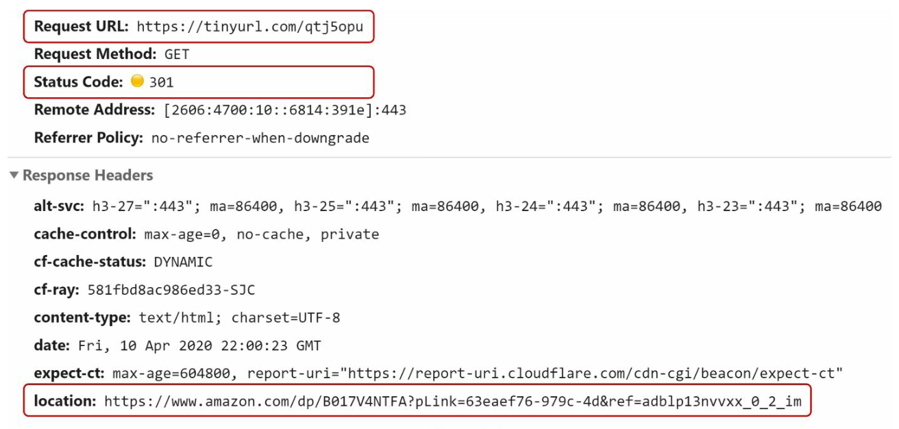
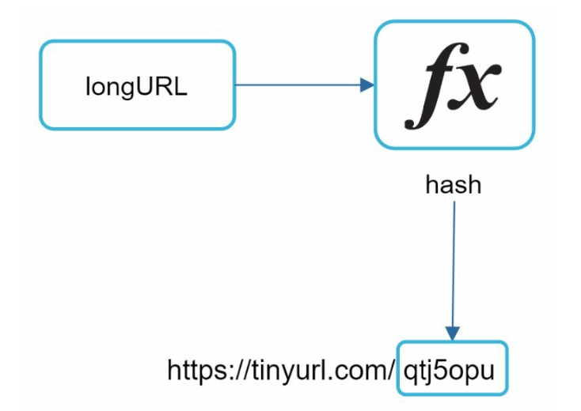
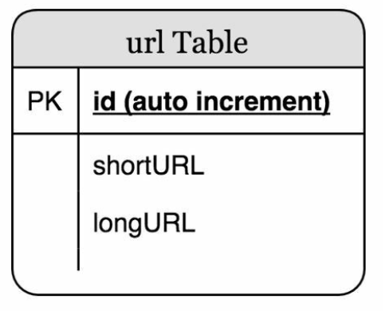
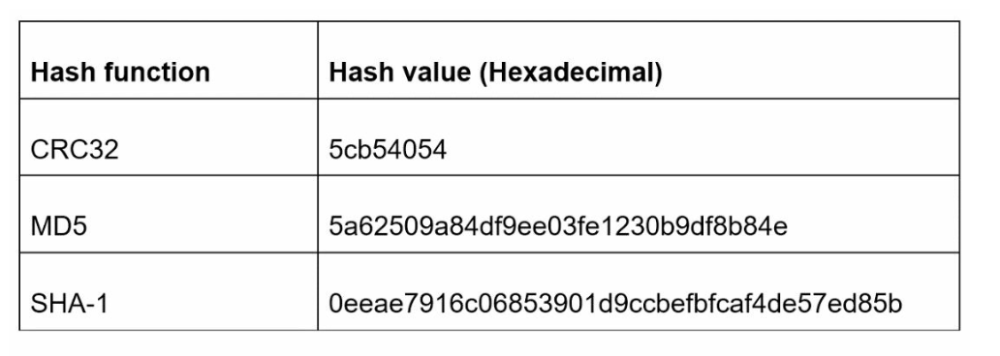
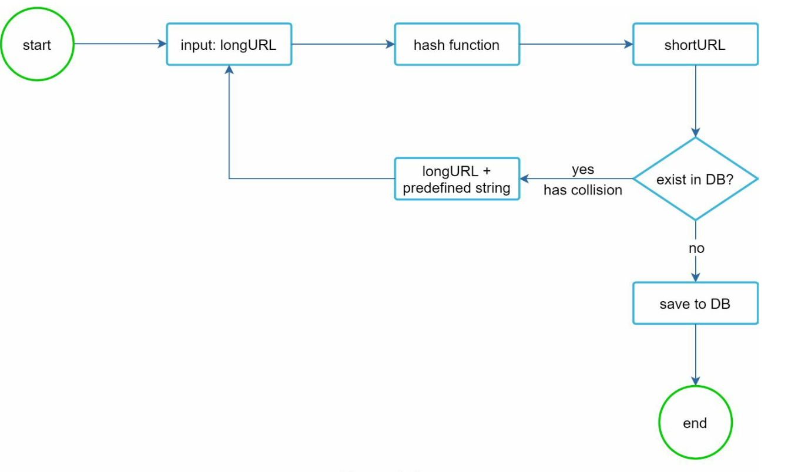
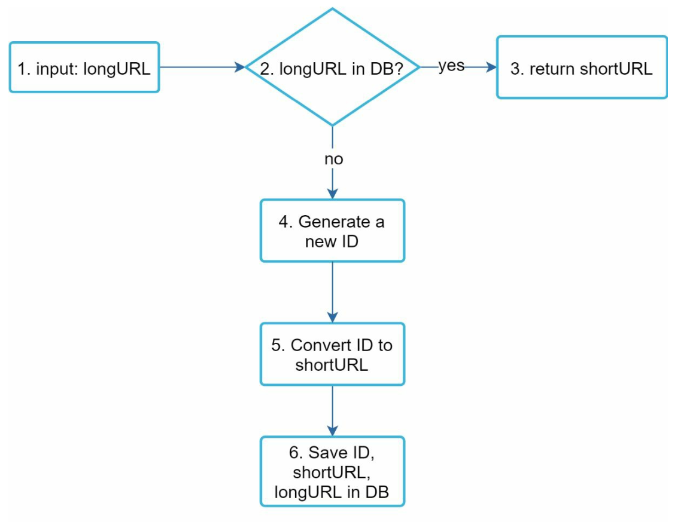
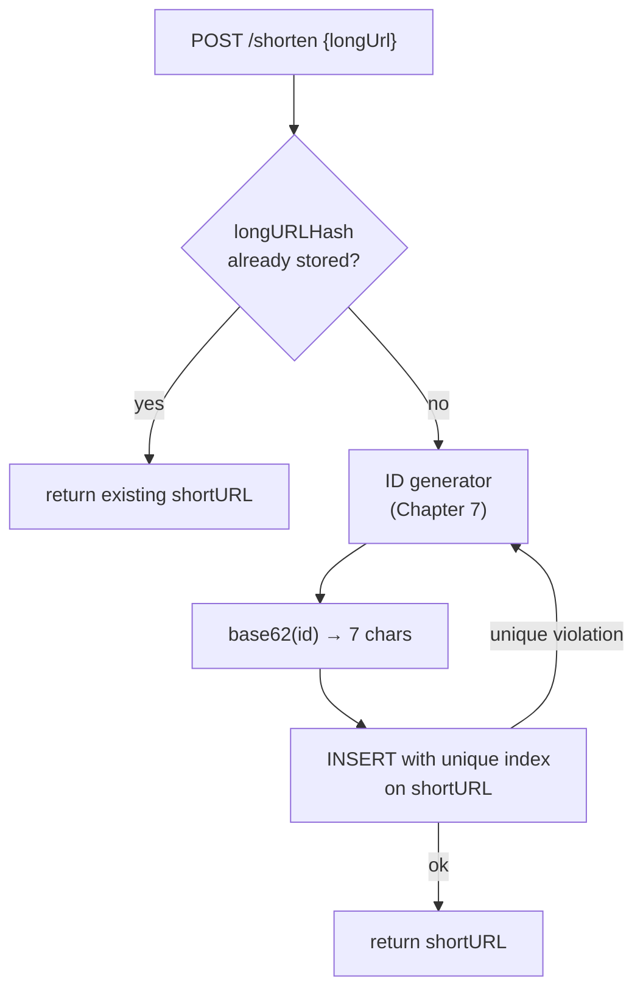
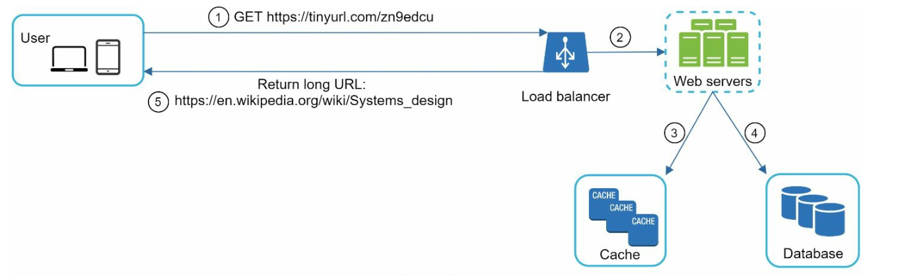
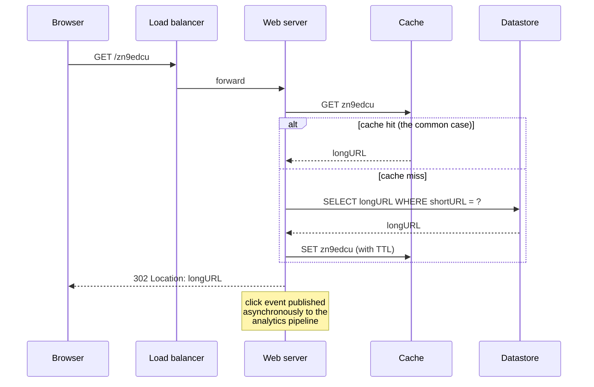

# Chapter 8: Design a URL Shortener

## Introduction
This chapter discusses the design of a URL shortening service like TinyURL. The system's main goals include **URL shortening**, **redirecting**, and **high scalability** to handle large traffic volumes.

**The one-sentence version:** a URL shortener is a very large, very read-heavy **key-value store** with one interesting question in front of it — how to mint a short, unique key — and one interesting question behind it: how to serve a redirect fast enough that nobody notices the extra hop.

Almost nothing here is novel; that is the point. The chapter is a good one precisely because it forces you to assemble pieces from earlier chapters — the ID generator from [Chapter 7](../07.%20Unique-Id%20Generator/), the cache and CDN from [Chapter 1](../01.%20Scaling/#section-6-caching), the key-value store from [Chapter 6](../06.%20Key-Value%20Store/) — and the interesting parts are the trade-offs between them.

### Requirements
- Shortened URLs must be **unique** and as **short as possible**.
- Handle **100 million URL generations per day** with a 10-year support capacity.
- Support **efficient read operations** with a 10:1 read-to-write ratio.
- Store 365 billion records, requiring approximately **365 TB** of storage over 10 years.

### Where those numbers come from

| Quantity | Derivation | Result |
|---|---|---|
| Write QPS | 100 M / 86,400 s | **~1,160 writes/sec** |
| Read QPS | 10 × write QPS | **~11,600 reads/sec** |
| Records in 10 years | 100 M/day × 365 × 10 | **365 billion** |
| Storage | 365 B × ~500 bytes per record | **~365 TB** |
| Short key length | smallest `n` with `62^n ≥ 365 B` | **7 characters** |

Two conclusions fall straight out of this table and should shape everything that follows.

First, **1,160 writes/sec is not a hard problem** — a single well-provisioned database can do that. 365 TB *is* a hard problem, so the pressure is on storage volume, not write throughput.

Second, **the read path is the product**. A redirect sits between a user's click and the page they wanted, so its latency is pure added cost. Everything on that path should be cache-shaped.

> **Interview angle:** doing this estimation out loud buys you the rest of the interview. It tells you to shard for capacity rather than for write throughput, to put a cache in front of reads, and that 7 characters is the answer to "how short can it be?" — all before drawing a box.

---

## Step 1: High-Level Design

### API Endpoints
1. **URL Shortening:**  
   - Endpoint: `POST api/v1/data/shorten`  
   - Parameters: `{longUrl: longURLString}`  
   - Returns: `shortURL`

2. **URL Redirecting:**  
   - Endpoint: `GET api/v1/shortUrl`  
   - Returns: `longURL` for redirection.

    

    
    

### URL Redirection
- **301 Redirect:**  A 301 redirect shows that the requested URL is “permanently” moved to the long URL. The browser caches the response, and
subsequent requests for the same URL will not be sent to the URL shortening service.
- **302 Redirect:** Temporary; useful for analytics like tracking clicks.

This is the first real trade-off in the chapter, and it is a trade between **your server load** and **your control over the link**:

| | 301 Moved Permanently | 302 Found |
|---|---|---|
| Browser caches the mapping | Yes, often indefinitely | No (or only per `Cache-Control`) |
| Load on your servers | Much lower — repeat clicks never reach you | Full — every click is a request |
| Click analytics | Lost after the first click per browser | Complete |
| Can you change the destination later? | **Effectively no** for anyone who has the cached copy | Yes, immediately |
| Can you revoke a malicious link? | **No** — the browser never asks again | Yes |
| SEO link equity | Passed to the target | Not reliably passed |

In practice commercial shorteners choose **302**, because analytics is the business model and revocation is a legal necessity. A 301 is the right choice only when the link is a permanent alias you will never need to retarget or take down — and "never" is a strong claim. Note that the choice is not binary: a 302 with a modest `Cache-Control: max-age` recovers some of the load reduction while keeping the ability to change course within the TTL.

### URL Shortening

    

- Use a **hash function** to generate a short URL, mapping long URLs to unique shortened versions.
- The hash function must satisfy the following requirements:
    - Each longURL must be hashed to one hashValue.
    - Each hashValue can be mapped back to the longURL.
    

The second requirement is worth reading carefully: "each hashValue can be mapped back to the longURL" does **not** mean the function is mathematically invertible. It means you store the mapping. The short key is a *name* for a database row, not a compressed form of the URL — 7 characters cannot possibly encode an arbitrary 200-character URL, so the only mechanism available is a lookup table.

---

## Step 2: Deep Dive into Design

### Data Model
Store `<shortURL, longURL>` mappings in a relational database to optimize memory usage. The table schema includes:
- `id` (primary key),
- `shortURL`,
- `longURL`.

    

In practice the row grows a few more columns, and each one exists for a reason established above:

| Column | Why it is there |
|---|---|
| `shortURL` (unique) | The lookup key for the read path; must be indexed, and it is the real primary key of the workload |
| `longURL` | The redirect target |
| `createdAt` | Expiry, auditing, and abuse investigation |
| `expiresAt` | Link rot and storage reclamation — see the gotchas |
| `userId` | Ownership, so a link can be revoked, rate-limited, or reported on |
| `longURLHash` (indexed) | Deduplication without indexing a long, variable-length string |

The relational model is chosen here for simplicity, but nothing about the workload needs it: there are no joins, no transactions spanning rows, and the access pattern is a single-key lookup. This is the canonical shape for the key-value store of [Chapter 6](../06.%20Key-Value%20Store/), and at 365 TB that is the more honest answer.

### Hash Function
#### 1. Base 62 Conversion:
- Encodes numbers using characters `[0-9, a-z, A-Z]`, providing **62 possible characters**.
- Base conversion is another approach commonly used for URL shorteners. 
- A unique id can be assigned to the short url and ID can be base 62 converted to get the short URL.
- A 7-character hash supports up to **3.5 trillion unique URLs**, enough for 365 billion URLs.

**Example:**  
Convert ID `2009215674938` to Base 62:
- `2009215674938` → `zn9edcu`.

**Why exactly 7.** The length is not a guess; it is the smallest `n` that covers the 365 billion from the estimation:

| Length | `62^n` | Enough for 365 B? |
|---|---|---|
| 5 | 916 million | No |
| 6 | 56.8 billion | No |
| 7 | **3.52 trillion** | **Yes, ~10× headroom** |
| 8 | 218 trillion | Yes, but a wasted character |

62 is itself a choice: it is the alphanumeric characters, which survive being typed, printed, read aloud, and embedded in a URL without encoding. Base 64 would need `+` and `/`, which require percent-encoding in a path and defeat the purpose.

#### 2. Hash + Collision Resolution:
- Use hash functions like CRC32, MD5, or SHA-1.

    

- One approach is to collect the first 7 characters of a hash value; however, this method can lead to hash collisions.
- To resolve collisions,recursively append a new predefined string until no more collision but this can be expensive.
- Resolve collisions with **Bloom Filters** for efficient lookup.

    

    
    

**How often do collisions actually happen?** Seven base-62 characters is about 41.7 bits of space. By the birthday bound, a 50% chance of *some* collision arrives after roughly `sqrt(2^41.7) ≈ 1.9 million` URLs — which this system generates in under half an hour. Collisions are therefore not an edge case to be handled defensively; they are a **routine, continuous event**, and every insert must check.

That check is the expensive part: a lookup against a 365-billion-row table on the write path. The Bloom filter is what makes it affordable — it answers "is this key definitely free?" from memory, with no false negatives, so the overwhelming majority of inserts skip the database read entirely and only the rare "possibly taken" answer pays for a real lookup. This is the same Bloom filter as the read path in [Chapter 6](../06.%20Key-Value%20Store/), used for the same reason: avoid a disk access to prove a negative.

### Comparison

-  **Hash + Collision Resolution:**
    - Fixed short URL length
    - Does not need a unique ID generator
    - Collision is possbile and needs resolution
    - Not possible to find the next available short URL because it does not depend on ID

- **Base 62 Conversion**
    - The length is not fixed and goes up with ID
    - It needs a unique ID generator
    - Collision is not possbile
    - Easy to find the next short URL if ID increments by 1 (Can be a security concern)

The last bullet deserves more than a parenthesis. If `shortURL = base62(auto_increment_id)`, then anyone holding one of your links can **enumerate every link in your system** by decrementing, and can measure your total volume by decoding their own key. For a public shortener that is both a privacy breach — short links are routinely used for private documents — and a competitive intelligence leak. It is the ID-enumeration problem from [Chapter 7](../07.%20Unique-Id%20Generator/#gotchas--failure-modes), arriving with real consequences.

Two fixes, neither exotic:
- **Obfuscate the ID** before encoding — multiply by a constant coprime to `62^7` modulo `62^7`, or run a small Feistel permutation. The mapping stays bijective (so still no collisions) but the sequence looks random.
- **Pick the key at random** and rely on the collision check. This spends a Bloom-filter lookup per insert to buy unguessable keys.

**Choosing between the two approaches, in one line:** base-62 of a generated ID if you control the namespace and can obfuscate it; random-key-with-collision-check if keys are public and guessability matters. The truncated-hash variant is the weakest of the three — it has the collision cost of random keys without their uniform distribution.

---

### URL Shortening Flow

    

1. Check if `longURL` exists in the database.
2. If found, return the existing `shortURL`.
3. Otherwise:
   - Generate a unique ID using a **distributed ID generator**.
   - Convert the ID to `shortURL` using Base 62.
   - Store the `<id, shortURL, longURL>` mapping in the database.

**Step 1 is not free, and it is not obviously correct.** Deduplicating by long URL means an indexed lookup on a variable-length string in a 365 TB table — hence the `longURLHash` column, which turns it into a fixed-width index probe. But the deeper question is whether to dedupe at all:

| | Dedupe (one short URL per long URL) | Always mint a new key |
|---|---|---|
| Storage | Lower | Higher, by the duplicate rate |
| Per-campaign analytics | **Impossible** — two marketers sharing a destination share a counter | Clean separation |
| Per-link expiry or revocation | Impossible — one link, two owners | Independent |
| Write path | Extra index lookup | Straight insert |

Commercial shorteners mint a new key every time, because distinguishing *who shared what* is the entire value of the product. The book's dedupe step is the simpler design, not the better one.

**The race nobody mentions.** Two concurrent requests for the same long URL both miss the check in step 1 and both insert — producing two short URLs for one destination. If dedupe actually matters, it has to be enforced by a **unique index on `longURLHash`**, not by a read-then-write. The same applies to the short key itself: the unique index on `shortURL` is the real guarantee, and the Bloom filter is only an optimisation that keeps you from hitting it.

---

### URL Redirecting Flow

    

1. User clicks a `shortURL`.
2. Query `<shortURL, longURL>` mapping:
   - Check the **cache** first for faster access.
   - If not in the cache, query the database.
3. Redirect the user to `longURL`.

**Why the cache works so well here.** Link popularity is extremely skewed — a small number of links take the great majority of clicks, and a link's traffic is concentrated in the hours after it is shared. That makes the working set small and recency-biased, which is exactly the profile LRU handles well. A cache sized to a few per cent of the key space can serve well over 90% of reads, so the 365 TB datastore only sees the long tail.

**The click event must not be on the critical path.** At 11,600 reads/sec, logging each click synchronously would add a write to every redirect — and the analytics write load (one per click) is an order of magnitude larger than the link-creation write load (one per shorten). Publish the event to a queue and let the redirect return immediately; this is the decoupling argument from [Chapter 1 §10](../01.%20Scaling/#section-10-message-queue), and the pipeline behind it is [Chapter 21](../21.%20Ad%20Click%20Event%20Aggregation/).

---

## Additional Considerations
### Rate Limiter
- Prevent abuse by setting limits on requests per IP.

IP-based limiting is the weakest version of this. Shorteners are a favourite tool for phishing and malware distribution because they hide the destination, so the write path attracts automated abuse from distributed sources. Limit per authenticated account as well as per IP ([Chapter 4](../04.%20Rate%20Limiter/)), and treat the limiter as one layer among several — domain blocklists, reputation scoring, and scanning the destination at creation time.

### Scalability
1. **Web Tier:** Stateless, scalable by adding/removing web servers.
2. **Database Tier:** Use replication and sharding.

Sharding is unusually easy here, and for a reason worth stating: the short key is **already uniformly distributed** (it is either random or an obfuscated counter), so hashing it spreads data and traffic evenly with no hot shards from the key distribution itself. Contrast with [Chapter 7](../07.%20Unique-Id%20Generator/#gotchas--failure-modes), where time-ordered IDs make range sharding send every write to one shard. Shard on `shortURL`, never on `id`.

Replication serves a second purpose beyond availability: redirects are read-only, so read replicas (or geographically distributed caches) let a click be served near the user, which is where the latency actually lives.

### Analytics
- Collect data like click rates, source, and timestamps for business insights.

### High Availability and Reliability
- Ensure consistent and reliable services using database replication and fault-tolerant design.

The asymmetry is worth making explicit: **a failed shorten is an inconvenience; a failed redirect is a broken link in someone else's published content.** Every link ever created is a permanent promise, embedded in emails, printed material, and other people's databases. That argues for prioritising read-path availability above everything else — serve stale cache entries rather than erroring, and prefer an AP design for reads ([Chapter 6](../06.%20Key-Value%20Store/#cap-theorem)), because a slightly out-of-date destination beats a dead link.

> **Interview angle:** the three follow-ups that separate a real answer from a recited one are "301 or 302, and why?", "how often do collisions happen and what does that cost you?", and "what stops me enumerating all your links?". Each has a concrete, quantitative answer in this chapter.

---

### Gotchas & failure modes

- **A 301 is permanent in a way you will regret.** Once browsers cache it, you cannot retarget the link, cannot revoke it when it turns out to point at malware, and cannot count clicks. There is no cache invalidation protocol for "the whole internet's browsers". Default to 302.
- **Collisions are continuous, not rare.** 7 base-62 characters collide with 50% probability within about 1.9 million keys. The write path *must* enforce uniqueness with a constraint; the Bloom filter only makes checking cheap.
- **Sequential keys leak everything.** `base62(auto_increment)` lets anyone enumerate every link and measure your volume. Obfuscate the ID or use random keys.
- **Deduplicating by long URL destroys per-link analytics.** Two unrelated users sharing a destination end up sharing a counter, an owner, and an expiry. Decide deliberately rather than inheriting it from the diagram.
- **The read-then-write dedupe check races.** Two concurrent shortens of the same URL both miss and both insert. Only a unique index actually prevents it.
- **Custom aliases collide with generated keys.** If users can claim `/launch`, the generator must never mint `launch`. Keep the namespaces separate (a reserved prefix, a separate table, or a blocklist checked at generation), and expect squatting of valuable short names.
- **Generated keys can spell words you do not want on your domain.** With 3.5 trillion keys, some will be slurs or obscenities. Filter the generated key against a wordlist before issuing it — this is a known embarrassment for every shortener.
- **Hand-typed links hit character ambiguity.** `0`/`O` and `1`/`l` are indistinguishable in many fonts. If links are meant to be read off a poster or spoken aloud, use a reduced alphabet (losing some key space) rather than the full 62.
- **Open redirect is a security feature request, not a bug report.** Your service exists to redirect to arbitrary destinations, so it will be used in phishing, and your domain's reputation is the collateral. Scan destinations, honour blocklists, support takedown, and consider an interstitial warning page for untrusted targets.
- **Viral links are hot keys.** One link taking a large share of traffic saturates whichever cache node owns it. Consistent hashing does not help — it balances keys, not requests ([Chapter 5](../05.%20Consistent%20Hashing/#gotchas--failure-modes)). Replicate hot entries, or cache them locally on each web server.
- **Storage grows forever unless links expire.** 365 TB assumes nothing is ever deleted. Most links are clicked within days and never again, so a TTL plus background reclamation is the difference between bounded and unbounded cost — but deleting a link breaks it permanently for anyone who still has it, and any 301 you issued makes the deletion invisible to them.
- **Analytics writes dwarf link-creation writes.** 11,600 clicks/sec against 1,160 creations/sec means the analytics pipeline, not the mapping store, is the larger write system. Size it accordingly and keep it off the redirect's critical path.

---

## The design, as problem and technique

| Goal / problem | Technique |
|---|---|
| Keys as short as possible | Base-62 alphabet; 7 characters covers 3.5 trillion |
| Unique keys without coordination | Distributed ID generator ([Chapter 7](../07.%20Unique-Id%20Generator/)) plus base-62 encoding |
| Unique keys that are unguessable | Random keys, or an obfuscating permutation of the ID |
| Detecting collisions cheaply | Bloom filter on the write path, unique index as the guarantee |
| Serving 11,600 redirects/sec | Cache in front of the datastore; skewed popularity makes hit rates high |
| 365 TB of mappings | Hash-shard on the short key, which is already uniformly distributed |
| Click analytics without slowing redirects | Publish events to a queue; aggregate asynchronously |
| Keeping control of a published link | 302 rather than 301, so the destination stays changeable and revocable |
| Abuse and phishing | Rate limiting, destination scanning, blocklists, takedown path |
| Bounded storage growth | Expiry with background reclamation |

## Self-check
1. Derive the write and read QPS from 100 M shortens/day at a 10:1 read ratio. Which one is the hard problem, and which is storage?
2. Why 7 characters and not 6? Why base 62 and not base 64?
3. Give two reasons a commercial shortener uses 302 even though 301 would cut its server load dramatically.
4. Roughly how many URLs can you mint before a 7-character collision becomes likely? What does that imply for the write path?
5. What does the Bloom filter actually save you, and what still guarantees uniqueness?
6. `shortURL = base62(id)` with an auto-increment `id`. What can a stranger learn, and how do you fix it while keeping zero collisions?
7. What breaks if you return an existing short URL for a long URL that has been shortened before?
8. Two requests shorten the same URL simultaneously. What happens, and what prevents it?
9. Why is this system unusually easy to shard, and what would you shard on?
10. A single link goes viral and takes 30% of all clicks. Which component suffers, and why does consistent hashing not help?

## Glossary

| Term | Meaning |
|---|---|
| **Short key / short code** | The 7-character identifier that names a stored mapping |
| **Base 62** | Encoding in `[0-9a-zA-Z]` — URL-safe without percent-encoding |
| **301 vs 302** | Permanent (browser-cached) vs temporary (always re-requested) redirect |
| **Birthday bound** | The `sqrt` rule that makes collisions likely far sooner than exhausting the space |
| **Bloom filter** | Probabilistic set membership with no false negatives; used to skip existence lookups |
| **Collision resolution** | Minting a different key when the chosen one is already taken |
| **ID obfuscation** | A bijective scramble of a counter, giving unguessable keys with no collisions |
| **Deduplication** | Returning an existing short key for a previously shortened long URL |
| **Custom alias / vanity link** | A user-chosen short key, which must not collide with generated ones |
| **Link rot** | Links outliving their usefulness, or their destinations disappearing |
| **Open redirect** | Being used to disguise a hostile destination behind a trusted domain |
| **Hot key** | One key taking a disproportionate share of traffic, saturating a single node |

## Where to go next
- [Chapter 7 – Design A Unique ID Generator](../07.%20Unique-Id%20Generator/) — where the IDs behind the short keys come from, and why sequential ones leak.
- [Chapter 6 – Design A Key-Value Store](../06.%20Key-Value%20Store/) — the datastore this system really wants, including the same Bloom filter trick.
- [Chapter 1 §6 – Caching](../01.%20Scaling/#section-6-caching) — the read path, and the cache failure modes that apply directly here.
- [Chapter 21 – Ad Click Event Aggregation](../21.%20Ad%20Click%20Event%20Aggregation/) — the click analytics pipeline, done properly.
