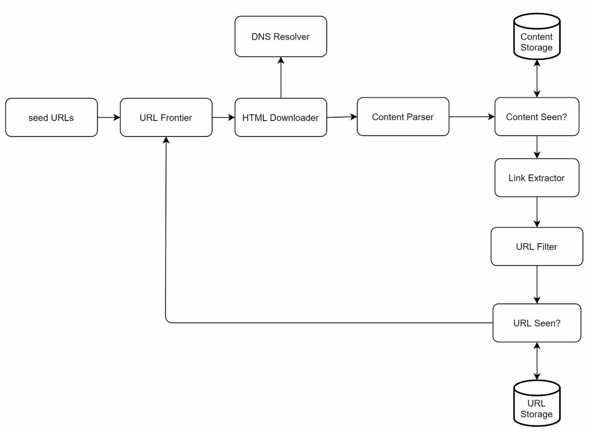
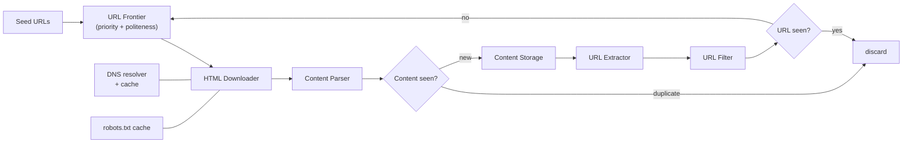
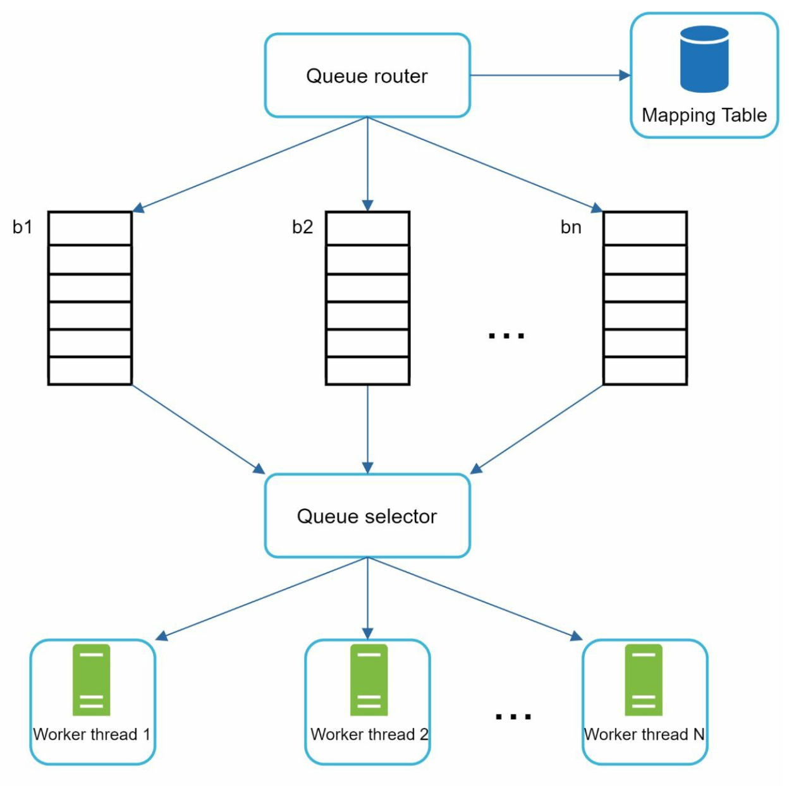
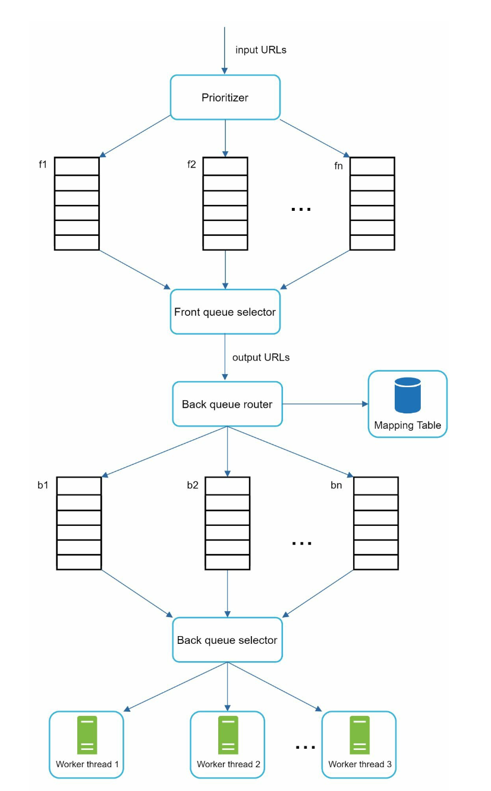
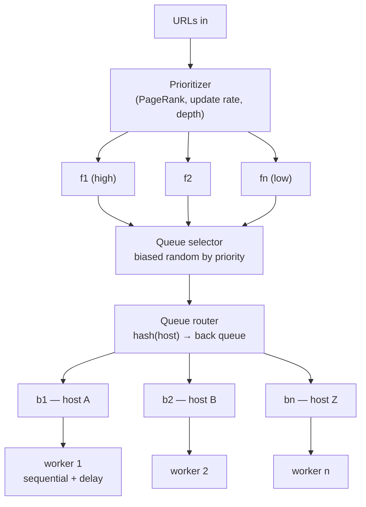
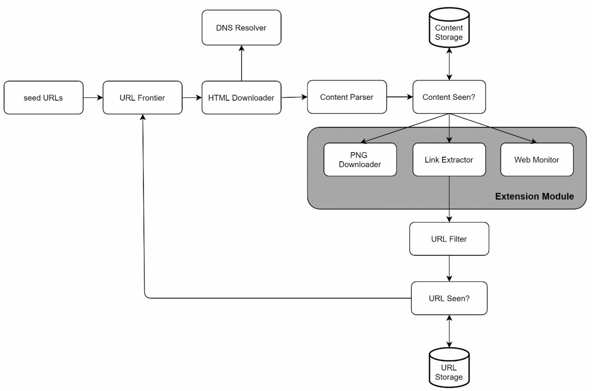

# Chapter 9: Design a Web Crawler

## Introduction
A **web crawler**, also known as a spider or robot, is used to discover and collect web content, such as web pages, images, and videos. This chapter focuses on designing a scalable web crawler for **search engine indexing**.

**The one-sentence version:** a crawler is a distributed breadth-first traversal of a graph you do not own, and its throughput is limited not by bandwidth, CPU, or storage but by **politeness** — you may only hit any single host slowly, so the only way to go fast is to crawl a great many hosts at once.

That constraint is what makes the design non-obvious. Nearly every component in this chapter exists either to keep track of an enormous frontier of pending work, or to defend the crawler against a web that is full of duplicates, loops, and traps.

### Applications of Web Crawlers
1. **Search Engine Indexing:** Collect web pages to create searchable indexes (e.g., Googlebot).
2. **Web Archiving:** Preserve web data for future use (e.g., US Library of Congress).
3. **Web Mining:** Extract knowledge from web data (e.g., financial analysis of shareholder reports).
4. **Web Monitoring:** Detect copyright or trademark infringements.

### Design Challenges
A good web crawler must address:
- **Scalability:** Handle billions of pages using parallelization.
- **Robustness:** Manage bad HTML, crashes, and malicious links.
- **Politeness:** Avoid overwhelming servers with too many requests.
- **Extensibility:** Support new content types with minimal changes.

These four are not equal. **Politeness is the binding constraint, and the other three are consequences of working around it.** If you could hammer one host at 400 requests/second, a crawler would be a `for` loop. Because you cannot, you need thousands of hosts in flight simultaneously, which forces distribution (scalability), exposes you to every broken server on the internet (robustness), and demands a frontier large enough to hold work for all of them.

---

## Step 1: Understanding the Problem

### Requirements
1. Crawl **1 billion web pages per month** (400 pages/second, peak 800 QPS).
2. Collect **HTML-only content**.
3. Track new and updated pages.
4. Ignore duplicate content.
5. Store crawled data for **5 years**, requiring ~30 PB of storage.

### Where those numbers come from

| Quantity | Derivation | Result |
|---|---|---|
| Average crawl rate | 1 B pages / 30 days / 86,400 s | **~400 pages/sec** |
| Peak rate | 2 × average | **~800 pages/sec** |
| Average page size | Given | **~500 KB** |
| Bandwidth | 400 × 500 KB | **~200 MB/sec sustained** |
| Monthly storage | 1 B × 500 KB | **500 TB/month** |
| 5-year storage | 500 TB × 60 months | **~30 PB** |

### The arithmetic that actually shapes the design

Politeness convention is roughly **one request per host at a time, with a delay between requests** — call it one page per second per host. To sustain 400 pages/second you therefore need **at least 400 hosts being crawled concurrently**, and in practice thousands, because most hosts have only a handful of pages and go idle immediately.

This single calculation explains the entire frontier design. The crawler is not a queue of URLs; it is a scheduler that keeps thousands of per-host queues active while never letting any one of them run hot.

> **Interview angle:** stating "politeness caps me at ~1 page/sec/host, so 400 pages/sec means 400+ hosts in parallel, so my frontier must be organised *by host*" is the single highest-value sentence in this chapter. It derives the architecture instead of recalling it.

---

## Step 2: High-Level Design

### Components
<p align="center">

</p>

1. **Seed URLs:** Starting points for the crawler.
    - Need to selective as a good starting point that a crawler can utilize to traverse as many links as possible.
    - Can be based on locality based on different popular website or based on topics.
    - Strategies: Categorize by locality or topic (e.g., sports, healthcare).

2. **URL Frontier:** Stores URLs to be downloaded.
   - Implemented as a **FIFO queue**.

3. **HTML Downloader:** Downloads web pages from URLs provided by the URL Frontier.

4. **DNS Resolver:** Converts URLs to IP addresses.

5. **Content Parser:** Validates and parses web pages.
   - Discards malformed pages.

6. **Content Seen?:** Checks for duplicate content using hash comparisons (compare the hash values of the two web pages).

7. **Content Storage:** Stores HTML pages on disk (popular content in memory to reduce latency).

8. **URL Extractor:** Extracts new links from parsed pages.

9. **URL Filter:** Excludes blacklisted or erroneous URLs.

10. **URL Seen?** Tracks visited URLs to avoid duplication.

11. **URL Storage:** Stores already visited URLs.

### Which of these are actually hard

Most of the eleven boxes are small. Three of them are the engineering:

| Component | Why it is hard | What it needs |
|---|---|---|
| **URL Frontier** | Holds hundreds of millions of pending URLs while enforcing both priority and politeness — two requirements that pull in opposite directions | Disk-backed storage, a two-tier queue design, host-partitioned state |
| **URL Seen?** | A membership test against billions of URLs, consulted several times per crawled page | A Bloom filter in memory, not a hash set |
| **Content Seen?** | Exact hashes miss near-duplicates, which are the overwhelming majority of web redundancy | Shingling plus SimHash/MinHash, not just a digest |

The rest — downloader, parser, extractor, filter — are ordinary code that must simply never crash on malformed input.

---

### Workflow
1. Add **Seed URLs** to the URL Frontier.
2. **HTML Downloader** fetches URLs and resolves their IPs via the DNS Resolver.
3. **Content Parser** validates and passes content to the "Content Seen?" component.
4. If the content is new, extract links via the **URL Extractor**.
5. Filter and add unique links to the URL Frontier.



The loop is the whole system, and it is worth noticing that **two different deduplication checks** sit in it. "Content seen?" stops you from *storing* the same page twice; "URL seen?" stops you from *fetching* the same page twice. They are not redundant: the second saves a network request, the first catches the same content served under several different URLs — which is extremely common, and which URL-level checks cannot detect.

---

## Step 3: Deep Dive into Key Components
### DFS/BFS
-  The web can be though of as a directed graph where web pages are nodes and hyperlinks (URLs) as edges.
-  BFS is usually used for graph traversal as the depth can be be very deep thus DFS is not ideal.
-  Standard BFS does not take the priority of a URL into consideration, not every page has the same level of quality and importance.

There is a second, less obvious problem with standard BFS: **a page's links point overwhelmingly at its own host.** A naive BFS queue therefore fills up with URLs from one site and the crawler, processing the queue in order, hammers that site — the politeness violation arrives automatically, not through carelessness. Plain BFS is not just unprioritised; it is actively impolite.

| | DFS | BFS | What the crawler actually does |
|---|---|---|---|
| Traversal depth | Unbounded — the web has no natural bottom | Level by level | BFS, bounded by a depth cap |
| Host locality | Dives into one host | Still clusters by host | BFS **de-clustered by host** across many queues |
| Priority awareness | None | None | Priority-weighted queue selection |
| Memory | Small stack | Large frontier | Disk-backed frontier, memory buffer |

### URL Frontier
- **Politeness:** 
    - Ensure only one request per host at a time. Add a dealy b/w two download tasks.
    - Use a mapping from hostnames to queues and worker (download) threads.
    - Each downloader thread has a separate FIFO queue and only downloads URLs from that queue.

        

    - **Queue router:** Ensures that each queue (b1, b2, … bn) only contains URLs from the same host.
    - **Mapping table:** It maps each host to a queue.
    - **Queue selector:** Each worker thread is mapped to a FIFO queue, and it only downloads URLs from that queue. The queue selection logic is done by the Queue selector.
    - **Worker thread 1 to N.** A worker thread downloads web pages sequentially from the same host. A delay can be added between two download tasks.

    The mapping table is what makes this work, and it must be **stable**: a host must always route to the same queue, or two threads could crawl it concurrently and the politeness guarantee evaporates. In a distributed crawler the same requirement applies one level up — **partition the frontier by host across machines** (consistent hashing, [Chapter 5](../05.%20Consistent%20Hashing/)), so all state and all rate limiting for a host live on exactly one node. Partitioning by URL instead would scatter one host's URLs across every machine, and no machine would be able to tell it was collectively overwhelming the server.

- **Priority:** 
    - Assign higher priority to important pages (e.g., by PageRank or update frequency).

        
    
    - **Prioritizer:** It takes URLs as input and computes the priorities.
    - **Queue f1 to fn:** Each queue has an assigned priority. Queues with high priority are selected with higher probability.
    - **Queue selector:** Randomly choose a queue with a bias towards queues with higher priority.
    - **Front queues:** manage prioritization
    - **Back queues:** manage politeness

**Why two tiers rather than one queue.** The two requirements are genuinely incompatible in a single structure:

- A pure **priority** queue would pop the highest-priority URLs back to back — and because links cluster by host, those are frequently from the same host. Politeness broken.
- A pure **politeness** arrangement (one queue per host, round-robin) treats a link-farm host and Wikipedia as equals. Priority ignored.

The two-tier design resolves this by separating *what to crawl next* from *when it is allowed to be crawled*. Front queues decide importance; a URL then drains into a back queue keyed by host, which decides timing. Each tier is simple; only the composition is clever.



- **Freshness:** Recrawl based on update history or importance.

Recrawling is where a crawler spends most of its life — after the first pass, nearly all work is revisiting pages you already have. Two mechanisms make it affordable:

- **Adaptive scheduling.** Track how often each page actually changed and recrawl at a rate that matches. A news front page earns minutes; an archived PDF earns months. Crawling everything on one fixed schedule wastes the great majority of requests.
- **Conditional GET.** Send `If-Modified-Since` or `If-None-Match` with the stored `ETag`. An unchanged page answers `304 Not Modified` with no body — the request still costs politeness budget and a round trip, but not the 500 KB. Sitemaps and `lastmod` hints help further, when the site is honest about them.


### HTML Downloader
- **Robots.txt Compliance:** Respect rules in robots.txt files.
- **Performance Optimizations:**
  1. Distributed crawling using multiple servers.
  2. Use a **DNS cache** to avoid repeated lookups.
  3. Geographically distribute crawl servers for faster downloads.
  4. Use a short timeout to avoid slow or unresponsive servers.

**robots.txt is a per-host fetch that must happen first**, so a cold host costs an extra round trip before its first page. Cache the parsed result per host with a TTL (a day is typical) and re-fetch on expiry — a site that adds a `Disallow` expects it to take effect. The file may also carry `Crawl-delay`, which overrides your default politeness interval, and a `Sitemap:` pointer, which is free frontier seeding. Treat a 5xx on robots.txt as "disallow for now" rather than "allow": failing open against a struggling server is how a crawler turns a bad day into an outage.

**DNS is the bottleneck people do not predict.** A resolution takes tens to hundreds of milliseconds, and the standard library resolver is synchronous — one blocked lookup stalls a thread that should be downloading. At 400 pages/second across thousands of hosts, this dominates. The fixes are an **asynchronous resolver** and an aggressive cache; the subtlety is that caching DNS past its TTL will eventually send you to a decommissioned IP, so respect the TTL even when it is inconveniently short.

**Short timeouts are a correctness mechanism, not just an optimisation.** Some servers accept a connection and then never respond. Without a hard timeout, each one permanently consumes a worker, and the crawler bleeds capacity until it stops. Cap connect time, read time, total time, *and* response size — an unbounded download or a decompression bomb is the same failure in a different costume.

### Robustness
1. **Consistent Hashing:** Distribute load among servers effectively.
2. **Error Handling:** Prevent system crashes from exceptions.
3. **Data Validation:** Ensure content integrity.

Add two more that matter at this scale:

4. **Checkpointing.** A frontier of hundreds of millions of URLs cannot be rebuilt from seeds after a crash — that would mean recrawling the web. Persist the frontier and the seen-sets to disk and snapshot them periodically, so a restart resumes rather than restarts.
5. **Treating all remote input as hostile.** Malformed HTML, invalid encodings, mislabelled content types, redirect loops, and 200-responses-containing-error-pages ("soft 404s") are the normal case, not the exception. Every parser must fail on one page without taking down the worker.

### Extensibility
- Add modules for new content types (e.g., PNG downloader, web monitor).
- Example: Plug in a module to monitor web content for copyright violations.

    
---

### Avoiding Problematic Content
1. **Duplicate Content:** Detect using hash comparisons.
2. **Spider Traps:** Avoid infinite loops with techniques like URL length limits.
3. **Data Noise:** Filter irrelevant content like ads or spam.

#### Duplicate content: why an exact hash is not enough
Roughly a third of the web is duplicated. Exact hashing catches only the easy cases — the same bytes served twice. It misses the dominant form of redundancy: pages that are *nearly* identical, differing by a rotating advertisement, a session ID in a footer, or a "last updated" timestamp. One changed character gives a completely different hash.

| Technique | Catches | Cost |
|---|---|---|
| MD5/SHA of the body | Byte-identical pages only | Trivial |
| Hash after boilerplate stripping | Same article under different templates | Cheap, fragile |
| **Shingling + SimHash / MinHash** | Near-duplicates, by similarity threshold | A fingerprint per page, comparable in near-constant time |

SimHash is the practical answer: hash overlapping word *shingles* into a single fixed-width fingerprint whose **Hamming distance** approximates document similarity, so "is this within 3 bits of anything I have seen?" becomes a cheap lookup rather than an all-pairs comparison.

#### URL canonicalization: the step that makes "URL seen?" work
These are all the same page, and a crawler that does not normalise them will fetch it five times and count it as five pages:

```
http://Example.com/a/           https://example.com/a/
http://example.com:80/a/        http://example.com/a/index.html
http://example.com/a/#section   http://example.com/a/?utm_source=twitter
```

Canonicalization lowercases the host, drops the default port, removes the fragment, strips known tracking parameters, sorts the remaining query parameters, and resolves `.`/`..`. It is unglamorous string handling that directly determines whether your dedup works at all.

#### Spider traps, concretely
A trap is any part of the web that generates infinite distinct URLs:

- **Infinite calendars** — `/calendar?month=2847` is always a valid, linkable, never-before-seen page.
- **Session IDs in paths** — every visit mints a new URL for identical content.
- **Parameter permutations** — faceted search with six filters produces a combinatorial explosion of URLs.
- **Deep recursion** — `/a/b/a/b/a/b/…` from a broken relative link.

No single defence covers all of them, so crawlers stack several: a **URL length cap**, a **depth cap**, a **per-host page budget**, canonicalization, and near-duplicate detection to notice that the content is not actually new. The per-host budget is the most important of the five, because it bounds the damage from a trap you failed to recognise.

---

## Step 4: Wrap Up
### Key Takeaways
1. Web crawlers must balance scalability, robustness, politeness, and extensibility.
2. **Politeness** prevents overloading servers, while **priority** ensures important pages are crawled first.
3. Efficient storage and error handling are crucial for handling large-scale crawling.

### Additional Considerations
- **Server-Side Rendering:** Handle dynamic content generated by JavaScript or AJAX.
- **Anti-Spam Measures:** Exclude low-quality or irrelevant pages.
- **Database Sharding:** Scale the data layer using replication and sharding.
- **Horizontal Scaling:** Use stateless servers to scale crawl jobs efficiently.
- **Analytics:** Collect and analyze data for insights.

**Rendering is the expensive one.** Fetching HTML costs a request; rendering a page in a headless browser to see what JavaScript produces costs a browser process, seconds of CPU, and all the subresource requests. That is one to two orders of magnitude more per page, which is why real crawlers maintain two pipelines: cheap HTML fetching for everything, and a rendering pipeline for the subset of pages judged worth it. Note that "horizontal scaling with stateless servers" does **not** apply to the frontier — politeness state is inherently stateful and host-partitioned, which is the one place this crawler cannot be stateless.

> **Interview angle:** the deep-dive follow-ups worth rehearsing are "how do you know you have already seen a URL, given billions of them?" (Bloom filter, and what its false positive costs you), "two URLs serve the same article — how do you notice?" (canonicalization, then SimHash), and "what stops an infinite calendar consuming your whole crawl?" (per-host budget plus depth and length caps).

---

### Gotchas & failure modes

- **Politeness and throughput trade directly against each other.** The only lever that raises throughput without being rude is *breadth* — more hosts in flight. Lowering the per-host delay is how a crawler gets its IP range blocked.
- **The frontier does not fit in memory.** Hundreds of millions of pending URLs must be disk-backed with an in-memory buffer, and must survive a restart. A crawler that loses its frontier has lost weeks of work.
- **A Bloom filter false positive silently drops a page.** "URL seen?" answering yes when it has not been seen means that page is never crawled, and nothing logs an error. There are no false negatives, so you never double-crawl — the error is always in the direction of missing content. Size the filter so that rate is acceptable, and know the number.
- **Exact-hash dedup misses most duplicates.** One rotating ad defeats it. Without near-duplicate detection you store the same content many times and feed the index redundant results.
- **Without canonicalization, dedup does not work at all.** Case, trailing slashes, default ports, fragments, and tracking parameters each multiply your crawl of the same page.
- **Partitioning the frontier by URL breaks politeness.** Every node then holds some of a host's URLs, and each stays under its own limit while the host is collectively overwhelmed. Partition by **host**.
- **DNS resolution stalls workers.** Synchronous lookups at thousands of hosts per second dominate latency; a stale DNS cache that ignores TTL eventually crawls decommissioned IPs.
- **Slow and hostile servers consume workers permanently.** Connections that open and never respond need hard timeouts on connect, read, total duration, and response size. Decompression bombs and multi-gigabyte "HTML" files belong in the same category.
- **Soft 404s and redirect loops poison the data.** A 200 response containing "page not found" gets indexed as content; redirect chains must be followed with a hop limit and the final URL canonicalized, or you will record the alias rather than the page.
- **robots.txt failing open turns a struggling site into a downed site.** If you cannot fetch it, do not crawl; and re-fetch on TTL expiry so newly added restrictions take effect.
- **One huge site can consume the entire crawl.** A site with a hundred million pages will happily supply a hundred million URLs. Per-host and per-domain budgets are what keep the crawl representative rather than dominated.
- **Trap detection is never complete.** New traps are generated faster than you can enumerate patterns, so the defences must be generic (budgets, caps, content-similarity) rather than a blocklist of known shapes.
- **Identify yourself.** A descriptive `User-Agent` with a contact URL is how site operators tell your crawler from an attack, and how they reach you instead of blocking you.

---

## The design, as problem and technique

| Goal / problem | Technique |
|---|---|
| 400 pages/sec without overloading any host | Thousands of hosts in flight; one connection per host plus a delay |
| Priority and politeness at the same time | Two-tier frontier: front queues prioritise, back queues enforce per-host timing |
| Keeping a host's rate limit correct across machines | Partition the frontier by host with consistent hashing |
| Remembering billions of visited URLs | Bloom filter rather than an exact set, accepting a known miss rate |
| Not storing the same content repeatedly | Shingling plus SimHash fingerprints, compared by Hamming distance |
| Not fetching the same page under different names | URL canonicalization before the seen-check |
| Surviving infinite URL spaces | URL length cap, depth cap, per-host page budget |
| Not re-downloading unchanged pages | Conditional GET with `ETag` / `If-Modified-Since`; adaptive recrawl intervals |
| DNS not becoming the bottleneck | Asynchronous resolver plus a TTL-respecting cache |
| Surviving a crash without recrawling the web | Periodic checkpointing of frontier and seen-sets |
| Supporting new content types | Pluggable downloader/parser modules behind the same frontier |
| Handling JavaScript-rendered pages | A separate, far more expensive headless-rendering pipeline for selected pages |

## Self-check
1. Politeness allows about one page per second per host. What does that imply about the number of hosts you must crawl concurrently to reach 400 pages/sec?
2. Why is plain BFS not merely unprioritised but actively impolite?
3. What exactly would break if you merged the front and back queues into a single priority queue?
4. Why must the frontier be partitioned by host rather than by URL in a multi-machine crawler?
5. A Bloom filter reports a URL as seen when it has not been. What is the consequence, and why is the opposite error impossible?
6. Two URLs serve the same article with one rotating advertisement. Which dedup check catches it, and which does not?
7. List four URL variations that are the same page, and what canonicalization does to each.
8. Describe a spider trap and the two independent defences that limit its damage.
9. Why is DNS a bottleneck at this scale, and what breaks if you cache resolutions past their TTL?
10. Which part of this system cannot be made stateless, and why?
11. You have already crawled a billion pages. What is most of your traffic now, and which HTTP feature makes it cheap?

## Glossary

| Term | Meaning |
|---|---|
| **URL frontier** | The prioritised, politeness-aware store of URLs still to be fetched |
| **Politeness** | Limiting request rate per host; the crawler's primary throughput constraint |
| **Front / back queues** | The two frontier tiers: priority selection, then per-host timing |
| **Queue router / mapping table** | The stable host → back-queue assignment that guarantees one worker per host |
| **Seed URLs** | The starting set from which the traversal reaches everything else |
| **URL seen? / content seen?** | Dedup checks that avoid refetching a URL and restoring identical content |
| **Canonicalization** | Normalising URL variants to one form before the seen-check |
| **Shingling** | Splitting a document into overlapping token sequences for similarity comparison |
| **SimHash / MinHash** | Fingerprints whose distance approximates document similarity |
| **Spider trap** | A region of the web generating unbounded distinct URLs |
| **Soft 404** | An error page returned with a 200 status, indistinguishable from content by status alone |
| **Conditional GET** | `If-Modified-Since` / `If-None-Match`, answered with `304` when unchanged |
| **Crawl-delay** | A `robots.txt` directive overriding the crawler's default per-host interval |
| **Crawl budget** | A cap on pages fetched per host or domain, keeping one site from dominating |
| **Checkpointing** | Persisting frontier and seen-state so a restart resumes rather than begins again |

## Where to go next
- [Chapter 6 – Design A Key-Value Store](../06.%20Key-Value%20Store/) — Bloom filters in their other home, used for exactly the same reason: proving a negative without touching disk.
- [Chapter 5 – Design Consistent Hashing](../05.%20Consistent%20Hashing/) — how the frontier is partitioned by host across machines.
- [Chapter 1 §10 – Message Queue](../01.%20Scaling/#section-10-message-queue) — the decoupling that lets downloaders, parsers and extractors scale independently.
- [Chapter 13 – Design A Search Autocomplete System](../13.%20Search%20Autocomplete/) — what happens to the crawled corpus once it is indexed.
- [Web Crawling (Olston & Najork)](http://infolab.stanford.edu/~olston/publications/crawling_survey.pdf) — the survey this chapter compresses.

