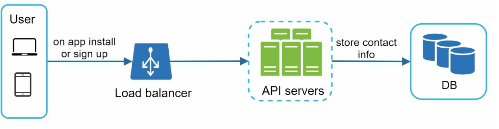
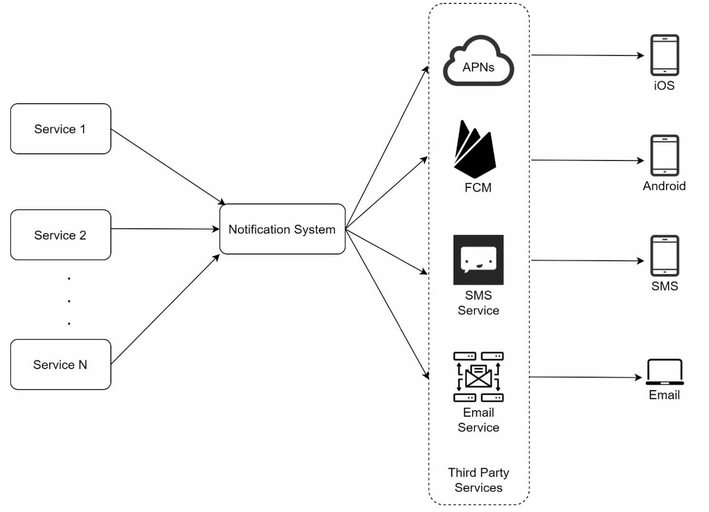
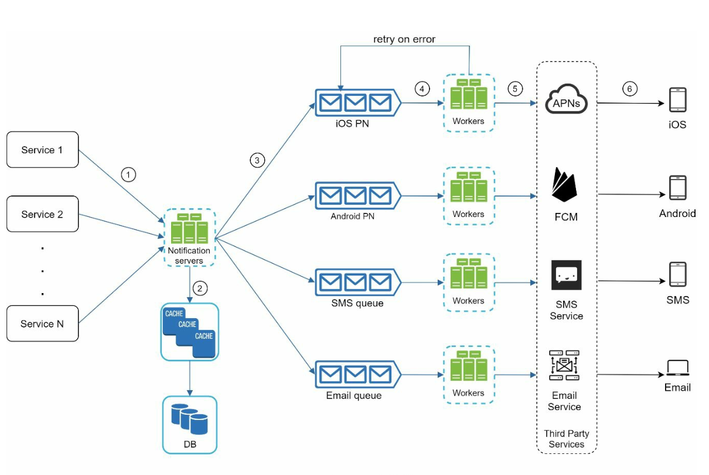
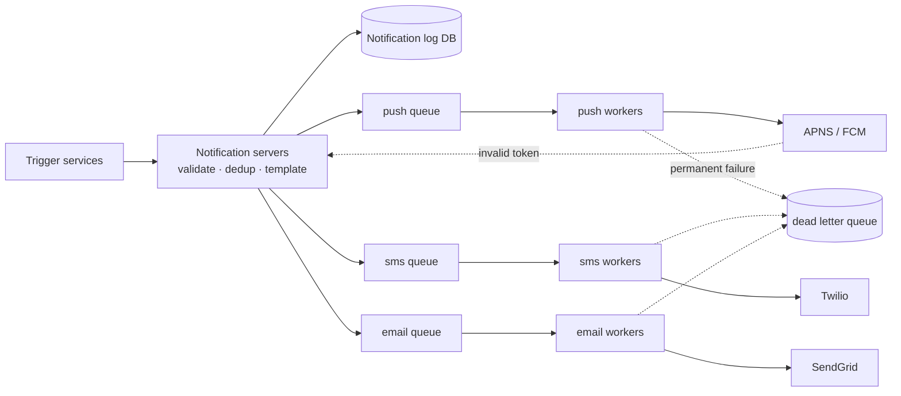
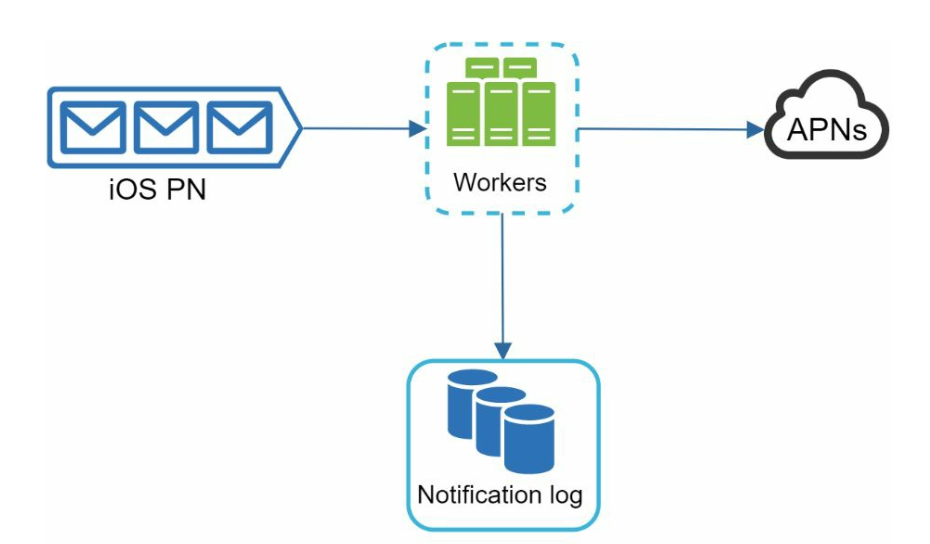
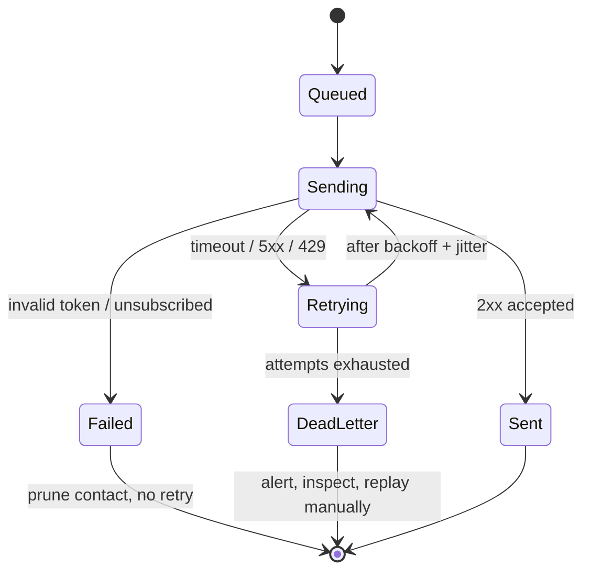
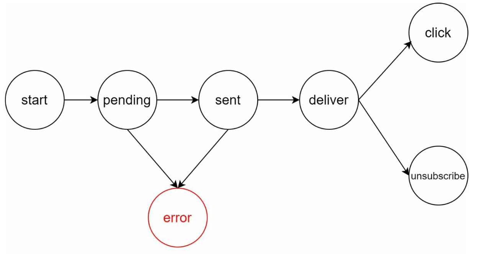
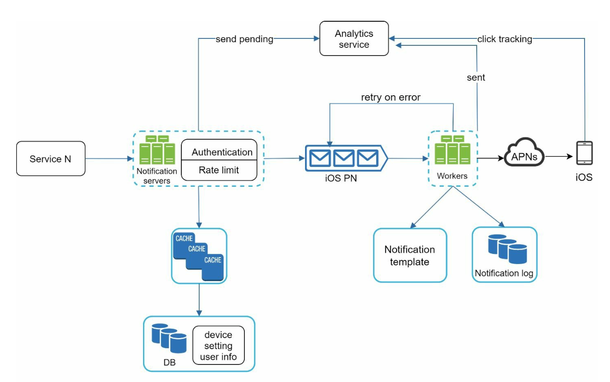

# Chapter 10: Design a Notification System

## Introduction
A **notification system** is essential for modern applications, providing timely updates like product notifications, events, offers, and alerts. Notifications can be sent through:
1. **Push notifications** (mobile or desktop),
2. **SMS messages**, and
3. **Emails**.

The chapter focuses on designing a scalable system capable of sending millions of notifications daily.

**The one-sentence version:** a notification system owns almost none of the delivery — APNS, Twilio and SendGrid do the actual sending — so the design is not about transport but about everything around an unreliable, rate-limited, third-party boundary: **queue the work, retry it correctly, never send it twice, and never send so much that the user turns you off.**

The two failure modes worth fearing are opposite in character. Losing a password-reset email is a support ticket; sending the same push notification four million times is an incident, a flood of uninstalls, and possibly a regulatory problem. A good design is defensive in both directions at once.

---

## Step 1: Understanding the Problem
### Requirements
- **Notification Types:** Push notifications, SMS, and Emails.
- **Delivery:** Soft real-time system with minimal delays.
- **Platforms:** iOS, Android, and desktop.
- **Triggers:** Notifications can be triggered by client applications or scheduled on servers.
- **Scale:**
  - **Push Notifications:** 10 million/day,
  - **SMS:** 1 million/day,
  - **Emails:** 5 million/day.
- **Opt-out Support:** Users can disable specific notification types.

### What the scale numbers really say

| Channel | Volume/day | Average rate | Approximate unit cost | Daily cost |
|---|---|---|---|---|
| Push | 10 M | ~116/sec | ~free | ~0 |
| Email | 5 M | ~58/sec | ~$0.0005 | ~$2,500 |
| SMS | 1 M | ~12/sec | ~$0.0075 | **~$7,500** |
| **Total** | **16 M** | **~185/sec** | | **~$10,000/day** |

Two observations that change the design:

**185 notifications/second is trivially small — and completely misleading.** Notifications are not uniform; they arrive in blasts. A single marketing campaign pushing 10 million notifications over ten minutes is **~16,600/sec**, roughly 90× the average. The system is therefore sized for a burst it experiences occasionally, which is exactly the case a queue exists to absorb: workers drain at a sustainable rate while the queue holds the spike.

**The lowest-volume channel is the most expensive.** SMS is 6% of the volume and roughly 75% of the cost — about $2.7 M/year at this rate. That makes per-channel rate limiting, deduplication, and retry policy a *financial* control, not just a technical one. A retry bug that doubles SMS sends costs real money the same day.

### The three channels are not interchangeable

| | Push | SMS | Email |
|---|---|---|---|
| Requires | App installed, token granted | Phone number | Address |
| Cost | Effectively free | Highest | Low |
| Latency | Seconds | Seconds | Seconds to minutes |
| Payload | Small (APNS ~4 KB) | 160 chars/segment | Unbounded, rich |
| Delivery confirmation | Accepted by APNS/FCM ≠ shown to user | Carrier receipt, sometimes | Accepted ≠ inbox ≠ read |
| User can silence it | OS settings, instantly | Carrier/`STOP` | Spam folder |
| Regulated by | Platform policy | TCPA and equivalents — consent is mandatory | CAN-SPAM, GDPR — unsubscribe is mandatory |

The row that matters most is **delivery confirmation**: for every channel, the provider confirms it *accepted* the message, not that it reached a human. A notification system can never truthfully report delivery, only acceptance — which is why engagement tracking exists further down the chapter.

> **Interview angle:** derive the burst rate (a 10-minute campaign is ~90× the average) and name SMS as the cost centre. Both show you are reasoning about the system rather than reciting its diagram, and both lead naturally into the queue and the rate limiter.

---

## Step 2: High-Level Design

### Components

1. **Notification Types:**
   - **iOS Push Notifications:** Use **Apple Push Notification Service (APNS)**.
   - **Android Push Notifications:** Use **Firebase Cloud Messaging (FCM)**.
   - **SMS Messages:** Third-party services like Twilio or Nexmo.
   - **Emails:** Commercial email services like SendGrid or Mailchimp.

2. **Contact Info Gathering:**
   

      
   

   - Collect device tokens, phone numbers, or email addresses during app installation or signup.
   - Store contact info in the database:
     - **Device Tokens Table:** For push notifications.
     - **User Table:** For emails and phone numbers.

   A device token is a **per-device, per-install** credential, so the tables are one-to-many: one user, several devices, several tokens. Tokens also **expire and get revoked** — an app uninstall, a device reset, or a platform rotation invalidates one. APNS and FCM report this back as a per-token error, and that feedback must be acted on: prune the dead token. A system that ignores it accumulates an ever-growing set of tokens that can never succeed, wastes a slot in every fan-out, and eventually gets throttled by the provider for persistently sending to invalid destinations.

3. **Notification Sending Flow:**

   

      
   

   - **Trigger Services:**
      - Generate events to initiate notifications (e.g., billing reminders, shipping updates).
      - A service can be a micro-service, a cron job, or a distributed system that triggers notification sending events.
   - **Notification Server:** 
      - Provide APIs for services to send notifications. 
      - Carry out basic validations to verify emails, phone numbers.
      - Query the database or cache to fetch data needed to render a notification.
   - **Third-Party Services:** Deliver notifications to users.

**The boundary to keep in view.** Everything to the left of the third-party services is yours and can be made as reliable as you like. Everything to the right is a network call to a system that will, routinely: time out, return 429, go down for an hour, accept a message and never deliver it, and change its rate limits without warning. The architecture that follows is almost entirely a response to that fact.

### Challenges in Initial Design
- **Single Point of Failure (SPOF):** One notification server can crash the entire system.
- **Scalability Issues:** Hard to scale databases, caches, and processing components independently.
- **Performance Bottlenecks:** High resource demands for sending notifications.

### Improved Design

   

      
   

- Move databases and caches out of the notification server.
- Introduce **horizontal scaling** with multiple notification servers.
- Use **message queues** to decouple system components.
   -  Message queues serve as buffers when high volumes of notifications are to be sent out.
- Add workers that pull notification events from message queues and send them to corresponding third party services.

**What broke:** a synchronous notification server calls the third party inline, so its latency is the provider's latency and its availability is the product of every provider's availability. When APNS slows down, requests pile up, threads are consumed, and the trigger services calling your API start timing out — a provider's bad day becomes your outage.

**The fix, and why it is specifically a queue.** Accepting the request, persisting it, and returning immediately converts a synchronous dependency into an asynchronous one. The queue then does three distinct jobs that are easy to conflate:

| Job | What it means here |
|---|---|
| **Buffering** | Absorbs the 16,600/sec campaign burst while workers drain at a sustainable rate |
| **Isolation** | Separate queues per channel mean an SMS provider outage cannot block push notifications |
| **Retry substrate** | A message stays in the queue (or returns to it) until acknowledged, which is what makes retries possible at all |

**Why one queue per channel, not one queue.** With a single shared queue, a stalled provider's messages sit at the head and block everything behind them — **head-of-line blocking**. Per-channel queues confine the damage to that channel. The same argument then applies one level further: transactional notifications (one-time passcodes, password resets) must not queue behind a marketing campaign, so they need their own high-priority path with its own workers. A user waiting on an OTP experiences queue depth as a broken login.

**What it now costs you:** the API can no longer tell the caller whether delivery succeeded, only that the request was accepted. Delivery outcome becomes an asynchronous fact, which is why the notification log and event tracking below are not optional extras — they are the only way anyone can answer "did it go out?".

---

## Step 3: Design Deep Dive

### Reliability
1. **Prevent Data Loss:** 
   

   
   

   - Persist notification data in a database and implement a retry mechanism. 
   - The Notification log database is included for data persistence.

2. **Deduplication:** 
   - Check event IDs to avoid sending duplicate notifications.
   - When a notification event first arrives, check if it is seen before by checking the event ID.
If seen before discard it, otherwise send out the notification. 

**Why duplicates are guaranteed, not hypothetical.** Message queues deliver **at least once**. A worker that sends a notification and then crashes before acknowledging the message will see that message again — the send already happened, and nothing in the queue knows it. Add client retries on the ingest API and provider-level retries, and duplicates arrive from three independent directions.

**Exactly-once delivery is not available**, and claiming it is a red flag. What is achievable is *at-least-once delivery plus idempotent processing*, which produces exactly-once **effects** most of the time:

| Mechanism | What it gives you |
|---|---|
| Event ID supplied by the caller | Lets the *caller's* retry be recognised as the same logical notification |
| Dedup store (`seen event IDs`, with TTL) | Rejects a repeat within the window |
| Atomic check-and-set | Prevents two workers from both passing the check concurrently |
| Provider idempotency key | Lets the provider reject the duplicate even if yours slipped through |

The dedup store cannot grow forever, so it holds a **window** — hours or days. That makes deduplication best-effort by construction: a duplicate arriving after the window expires will be sent. The honest statement is "duplicates are suppressed within a bounded window", and the window is a deliberate choice between memory and safety.

**The check must be atomic.** A read-then-write ("have I seen this? no — record it, then send") lets two workers processing the same message both read "no". Use a single conditional write — `SETNX` in Redis, an insert against a unique constraint — so exactly one worker wins and the loser discards.

### Retries: the part that is usually wrong

Retrying is easy; retrying *correctly* requires classifying the failure first.

| Provider response | Class | Correct action |
|---|---|---|
| Timeout, connection reset, 5xx | Transient | Retry with exponential backoff and jitter |
| 429 / rate limited | Transient, self-inflicted | Back off, and lower the send rate — not just this message |
| Invalid device token, unsubscribed, invalid number | **Permanent** | Do not retry. Prune the contact and stop |
| 4xx malformed request | **Permanent** | Do not retry. This is a bug; alert on it |
| Accepted (2xx) | Success, provisionally | Record acceptance — not delivery |

Three details carry most of the value:

- **Jitter, not just backoff.** Without randomisation, every worker that failed during a provider blip retries at the same instant, reproducing the spike that caused the failure. This is the thundering herd, and jitter is the one-line fix.
- **A bounded attempt count plus a dead letter queue.** Infinite retries turn one broken message into permanent worker consumption. After N attempts, park it, alert, and move on — DLQ depth is one of the most useful alarms in the whole system.
- **Retrying a permanent failure is the classic bug.** An invalid token will never become valid. Retrying it burns quota, pollutes metrics, and on paid channels costs money per attempt.

A **circuit breaker** sits above all of this: once a provider's failure rate crosses a threshold, stop calling it, let the queue hold the backlog, and probe periodically. That converts "hammer a dying provider with retries" into "wait for it to come back", which is both faster to recover and less likely to prolong the outage.

### Additional Components
   

   
   

1. **Notification Templates:** Preformatted templates for consistent and efficient notifications.
2. **Notification Settings:**
   - Users can opt-in or opt-out for specific channels (push, SMS, or email).
   - Stored in a dedicated notification settings table.
3. **Rate Limiting:** Cap the frequency of notifications sent to users.
4. **Retry Mechanism:** Retry sending notifications if third-party services fail.
5. **Monitoring Queues:** Track queued notifications to scale workers dynamically.
6. **Event Tracking:** Collect metrics like open rate, click rate, and engagement.

Each of these is doing more work than its one line suggests:

**Templates** exist for consistency, but their real value is that the *content* and the *trigger* evolve separately. A template is also the natural place for localisation — language, date and currency formats, and right-to-left layout — and for enforcing per-channel limits (an APNS payload has roughly 4 KB; an SMS segments at 160 characters and each segment is billed).

**Settings are a hard gate, not a preference.** The opt-out check must be enforced on the send path, immediately before dispatch, not at the moment the event was created — a user who unsubscribes while a campaign is draining from the queue must not receive the rest of it. For SMS and email this is a legal requirement in most jurisdictions (TCPA, CAN-SPAM, GDPR), with per-message penalties, which makes it the one check that should fail closed.

**Rate limiting operates at three distinct levels**, and conflating them is a common design error:

| Level | Purpose | Consequence of omitting it |
|---|---|---|
| Per user, per channel | Protect attention — nobody wants 40 pushes an hour | Uninstalls and OS-level muting, which silence you permanently |
| Per provider | Stay inside the provider's quota | 429s, throttling, possible account suspension |
| Global | Cap total spend and blast radius | A runaway loop bills you for millions of SMS before anyone notices |

The global limit doubles as a **kill switch**, and that is its most important role. Alongside it, an anomaly alarm on send volume ("push sends are 20× the trailing hour") is what turns a catastrophe into an inconvenience.

**Scheduling is part of the product.** Notification time must be computed in the *recipient's* timezone, with quiet hours respected, or you will wake a continent at 3 a.m. Low-urgency notifications should be **batched into a digest** rather than sent individually — which is a throughput optimisation and an attention optimisation at the same time.

**Queue depth is the system's primary health signal.** It is the one metric that distinguishes "working fine" from "workers are dying" long before users notice, and it is the input to autoscaling the worker pool.

**Event tracking is how delivery is observed at all.** Since providers only confirm acceptance, open and click rates are the only evidence that notifications are reaching humans. The volume is high — one event per open and per click, well above the send volume — so it belongs in an asynchronous analytics pipeline ([Chapter 21](../21.%20Ad%20Click%20Event%20Aggregation/)), not in the notification database.

### Security
- Use **AppKey** and **AppSecret** to authenticate and secure APIs for push notifications.

Two more that matter in review:

- **Only verified clients may call the send API.** An internal notification API reachable without authentication is a spam cannon pointed at your own users, and it damages the sending reputation that email and SMS deliverability depend on.
- **Push payloads are not private.** They render on a locked screen and pass through APNS or FCM. Never put a passcode, balance, medical detail, or full message body in one — send a neutral prompt and let the app fetch the content after the user authenticates.

### Notification Flow

   

   
   

1. Trigger services call APIs to send notifications.
2. Notification servers validate requests and fetch metadata from caches or databases.
3. Notification events are sent to message queues.
4. Workers process events and interact with third-party services.
5. Third-party services deliver notifications to users.

---

## Key Optimizations
1. **Horizontal Scaling:** Add more notification servers for load distribution.
2. **Message Queues:** Decouple processing to handle high volumes.
3. **Caching:** Reduce latency by caching frequently accessed data.
4. **Geographic Distribution:** Optimize message delivery geographically for better performance.

> **Interview angle:** the three follow-ups that matter are "how do you avoid sending the same notification twice?" (at-least-once delivery plus an atomic, windowed idempotency check — *not* exactly-once), "a provider starts returning 500s, what happens?" (classify, backoff with jitter, circuit breaker, DLQ), and "how do you stop a bug from sending four million duplicate pushes?" (per-user and global rate limits, volume anomaly alarm, kill switch). Each answer is about the third-party boundary, which is where this system actually lives.

---

### Gotchas & failure modes

- **Exactly-once delivery does not exist.** The queue is at-least-once, so duplicates are inevitable. You get exactly-once *effects* only by making processing idempotent, and only within the dedup window.
- **A read-then-write dedup check races.** Two workers handling the same message both see "not seen". Only an atomic conditional write (`SETNX`, unique-constraint insert) actually deduplicates.
- **Retrying a permanent failure forever.** Invalid tokens and unsubscribed addresses never recover. Classify responses before retrying, or waste quota and money on guaranteed failures.
- **Retry without jitter recreates the outage.** Synchronised retries after a provider blip arrive as one spike, which trips the provider again. Exponential backoff *with* randomisation.
- **Unbounded retries consume the workers.** A bounded attempt count plus a dead letter queue keeps one poisonous message from degrading the whole channel. Alert on DLQ depth.
- **A single shared queue causes head-of-line blocking.** One stalled provider stops every channel. Separate queues per channel, and a separate priority path for transactional notifications — an OTP stuck behind a marketing blast is a broken login.
- **Dead tokens accumulate silently.** Uninstalls invalidate tokens, and providers report it per message. Ignoring that feedback inflates your fan-out and eventually gets you throttled.
- **The notification storm is the worst-case incident.** A retry loop or a bad campaign query can send millions of unwanted messages in minutes. The damage is irreversible — you cannot unsend — so the controls must be preventive: global rate limit, volume anomaly alarm, and a kill switch somebody can actually find at 2 a.m.
- **Opt-out checked at the wrong time.** Filtering at event-creation time lets a long-draining campaign keep sending to users who unsubscribed ten minutes ago. Check immediately before dispatch.
- **"Delivered" is a lie.** Providers confirm acceptance. Reporting acceptance as delivery hides real failures — silent discards, spam folders, OS-level muting.
- **Sensitive data in push payloads.** Lock-screen previews and third-party relays make the payload semi-public. Send a prompt, not the content.
- **Timezone-naive scheduling.** Sending on server time wakes people up, and the resulting notification-permission revocation cannot be undone by an apology.
- **Cost is a failure mode.** SMS at roughly $0.0075 per message means a duplicate-send bug has an immediate, five-figure daily price. Rate limits are a financial control.
- **Fan-out multiplies everything.** One logical notification to a user with four devices is four provider calls. Scale, cost, and rate-limit arithmetic are per *destination*, not per notification.

---

## The design, as problem and technique

| Goal / problem | Technique |
|---|---|
| Provider latency and outages leaking into your API | Accept, persist, enqueue, return immediately |
| A 90× campaign burst | Queue as a buffer; workers drain at a sustainable rate |
| One provider's outage stopping all channels | A separate queue and worker pool per channel |
| Transactional notifications stuck behind marketing | Priority queue with dedicated workers |
| Duplicate sends from at-least-once delivery | Caller-supplied event ID plus an atomic, windowed dedup check |
| Transient provider failures | Exponential backoff with jitter, bounded attempts |
| Permanent failures | Classify responses; prune the contact; never retry |
| A provider failing persistently | Circuit breaker, plus a dead letter queue with alarms |
| Losing notifications on a crash | Notification log database written before enqueue |
| Notification fatigue | Per-user, per-channel rate limits; digests; quiet hours |
| Runaway spend or a storm | Global rate limit, volume anomaly alarm, kill switch |
| Legal opt-out compliance | Settings checked at dispatch time, failing closed |
| Knowing whether anything arrived | Open/click event tracking in an async analytics pipeline |
| Invalid device tokens | Act on per-message provider feedback; prune tokens |
| Consistent, localised content | Templates with per-channel payload limits |

## Self-check
1. The average rate is ~185 notifications/sec. Why is sizing the system for that wrong, and what number should you use instead?
2. Which channel is 6% of the volume and most of the cost, and what does that imply about retry policy?
3. Why can this system never honestly report "delivered"?
4. Name the three independent sources of duplicate notifications.
5. Why is "exactly-once delivery" the wrong thing to promise, and what is the right formulation?
6. What goes wrong with a dedup check implemented as "read, then write, then send"?
7. Classify these and give the correct action: HTTP 429, invalid device token, connection timeout, HTTP 400.
8. Why does exponential backoff need jitter?
9. All channels share one queue and Twilio stops responding. What happens to push notifications, and why?
10. A one-time passcode takes 90 seconds to arrive during a marketing campaign. What is the design flaw?
11. A bug sends four million duplicate pushes. Which three controls would have limited the damage, and why can't you fix it afterwards?
12. At what point in the pipeline must the opt-out check run, and why not earlier?

## Glossary

| Term | Meaning |
|---|---|
| **APNS / FCM** | Apple's and Google's push services; the only route to a mobile device's notification tray |
| **Device token** | A per-device, per-install credential for push; expires and can be revoked |
| **Trigger service** | Any service, cron job or pipeline that asks for a notification to be sent |
| **At-least-once delivery** | The queue's guarantee: a message may be processed more than once, never zero times |
| **Idempotent processing** | Handling the same message twice with the same net effect — how duplicates are neutralised |
| **Dedup window** | The bounded period over which repeated event IDs are remembered and suppressed |
| **Exponential backoff + jitter** | Growing, randomised retry delays that avoid synchronised retry spikes |
| **Dead letter queue (DLQ)** | Where messages go after exhausting retries; its depth is a primary alarm |
| **Circuit breaker** | Stopping calls to a failing provider until a probe shows recovery |
| **Head-of-line blocking** | A stalled message at a queue's head delaying everything behind it |
| **Fan-out** | Expanding one logical notification into one message per device, address or number |
| **Notification log** | The durable record written before enqueue, enabling replay and auditing |
| **Quiet hours** | Recipient-timezone windows in which notifications are withheld |
| **Kill switch** | An operator control that halts all sending immediately |
| **Transactional vs marketing** | Latency-critical, user-awaited notifications vs bulk campaigns; different queues and priorities |

## Where to go next
- [Chapter 1 §10 – Message Queue](../01.%20Scaling/#section-10-message-queue) — the decoupling argument this whole chapter rests on.
- [Chapter 4 – Design A Rate Limiter](../04.%20Rate%20Limiter/) — the algorithms behind the per-user, per-provider and global limits.
- [Chapter 19 – Distributed Message Queue](../19.%20Distributed%20Message%20Queue/) — how the queue itself provides at-least-once delivery, and why exactly-once is so hard.
- [Chapter 21 – Ad Click Event Aggregation](../21.%20Ad%20Click%20Event%20Aggregation/) — the pipeline that open and click events feed into.
- [Chapter 11 – Design A News Feed System](../11.%20News%20Feed%20System/) — fan-out at a larger scale, where the same push-vs-pull question dominates.

