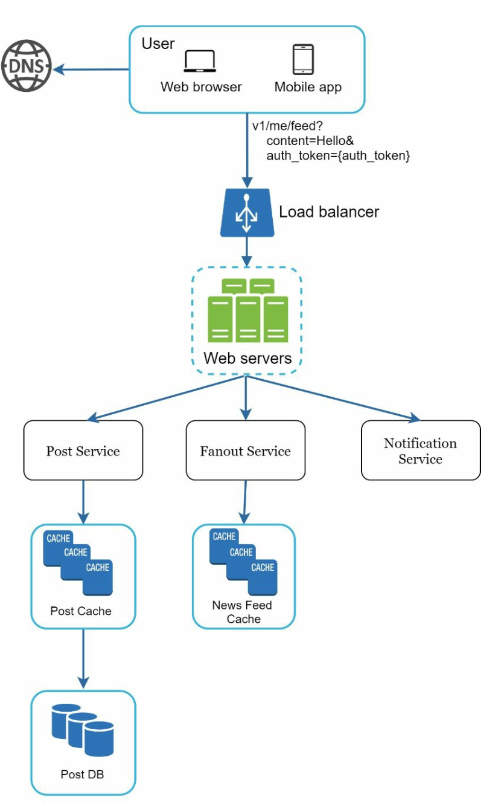
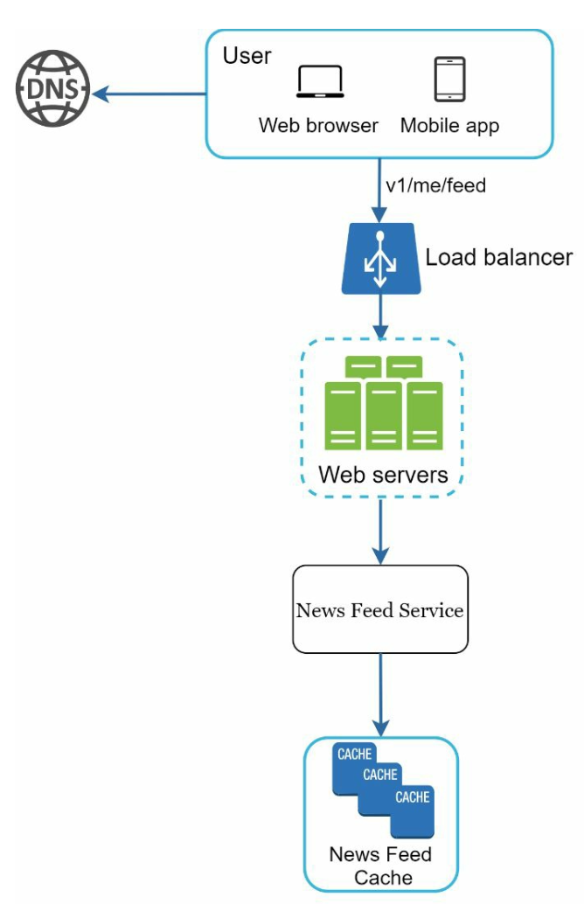
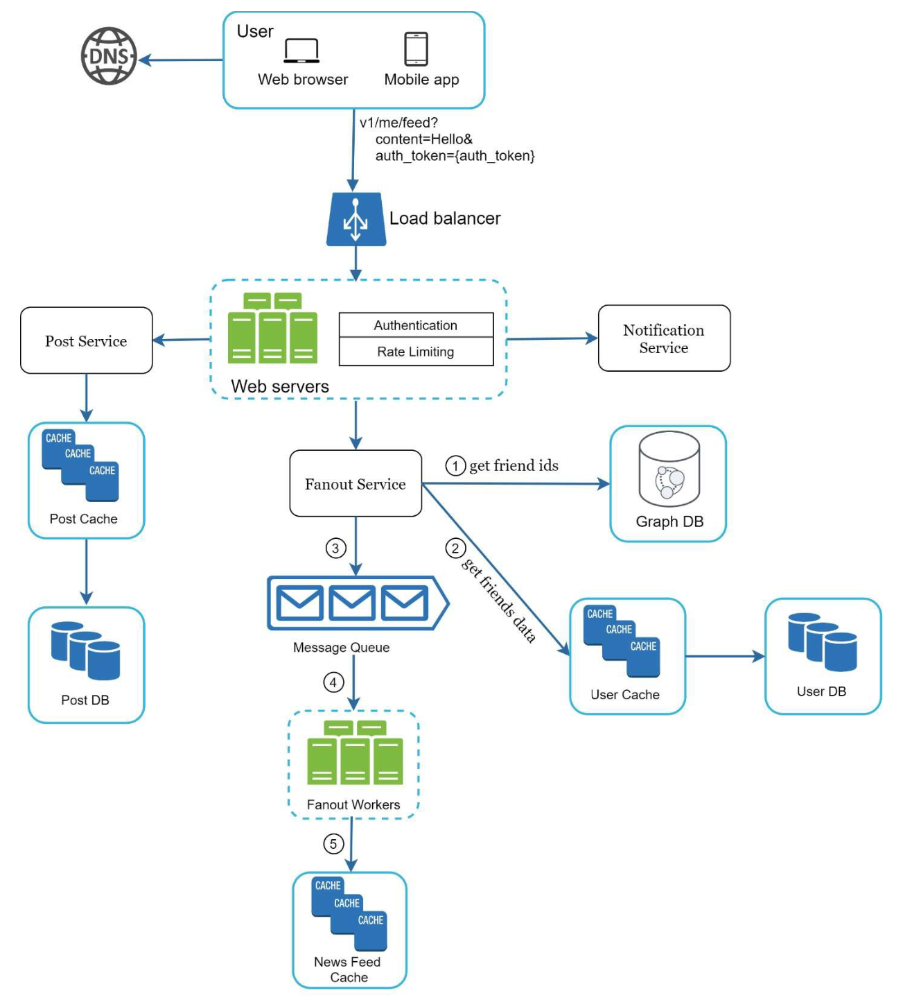
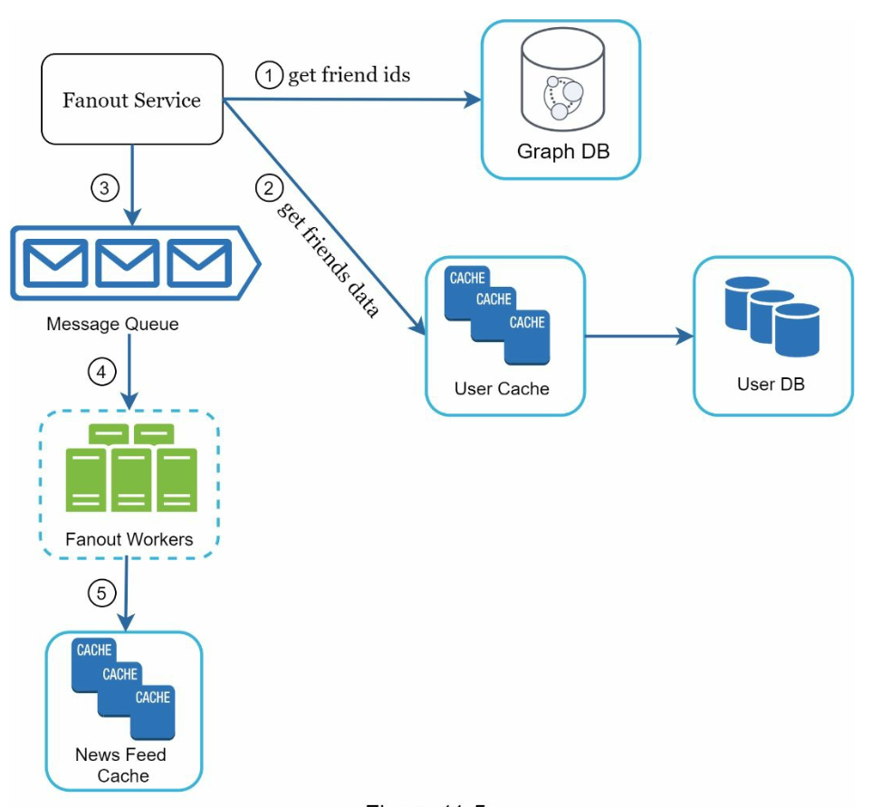
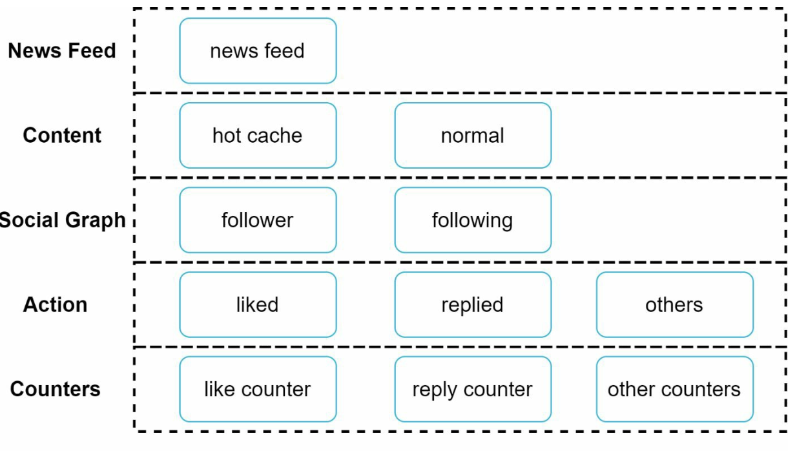
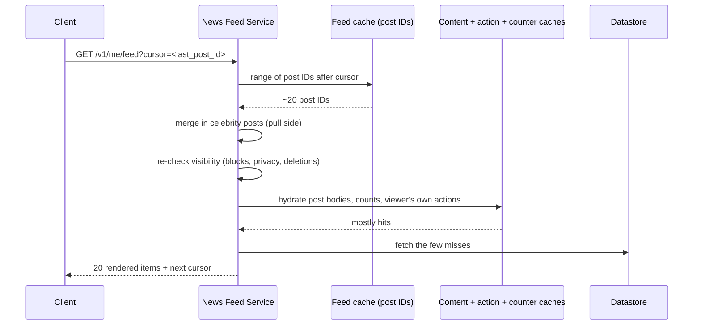

# Chapter 11: Design a News Feed System

## Introduction
A **news feed system** displays a constantly updating list of posts (status updates, photos, videos, and links) from a user’s connections. Examples include Facebook’s news feed, Instagram’s feed, and Twitter’s timeline. This chapter explores the design of a scalable news feed system.

**The one-sentence version:** a feed is a **fan-out** problem, and the only real question is *when you pay for it* — at write time, by pushing each post into every follower's precomputed feed, or at read time, by gathering posts from everyone a user follows. Neither works alone, because follower counts are so extremely skewed that the two strategies fail at opposite ends of the distribution.

Everything else in the chapter — the cache layers, the message queue, the fanout workers — is machinery in service of that one decision.

---

## Step 1: Understanding the Problem

### Requirements
1. **Platform:** The system supports both web and mobile apps.
2. **Features:**
   - Users can publish posts.
   - Users can view posts from friends in their news feed.
3. **Sorting:** Feeds are sorted in **reverse chronological order** for simplicity.
4. **Scale:**
   - Users can have up to 5,000 friends.
   - 10 million daily active users (DAU).
   - Feeds may include text, images, and videos.

### The arithmetic that decides the architecture

Assume each DAU publishes ~2 posts/day and opens the feed ~10 times/day, with an average of ~200 friends:

| Quantity | Derivation | Result |
|---|---|---|
| Posts/day | 10 M × 2 | 20 M (**~230 posts/sec**) |
| Feed reads/day | 10 M × 10 | 100 M (**~1,160 reads/sec**) |
| **Fanout-on-write cost** | 20 M posts × 200 friends | **4 B feed writes/day ≈ 46,000/sec** |
| One post by a 5,000-friend user | | **5,000 cache writes** |
| One post by a 10 M-follower account | | **10 M cache writes** |

Read that table twice. The feed system's write volume is **two orders of magnitude larger than its post volume** — the posts themselves are negligible, and the fanout is the system.

And the last row is the whole reason this chapter is interesting. At a sustainable 10,000 feed-writes/sec, a single post from a 10-million-follower account takes **about 17 minutes** to finish fanning out. Followers at the front of that list see it immediately; followers at the back see it after the post is already stale. Push alone cannot serve the head of the follower-count distribution, no matter how many workers you add.

### Write amplification versus read amplification

| | Fanout on write (push) | Fanout on read (pull) |
|---|---|---|
| Work per **post** | O(followers) — thousands to millions | O(1) — one row |
| Work per **feed read** | O(1) — read a precomputed list | O(followees) — gather and merge ~200 lists |
| Feed read latency | Milliseconds | Hundreds of milliseconds |
| Cost driver | Users with many *followers* | Users who follow many *accounts* |
| Wasted work | Fanning out to users who never log in | Recomputing the same feed on every open |
| Breaks down when | Someone has millions of followers | Everyone has hundreds of followees and reads often |
| Deletes, blocks, privacy changes | Already-pushed copies are stale | Naturally correct, filtered at read |

Both columns are defensible for *some* user. That is precisely why the answer is hybrid: **the right strategy depends on the follower count of the author, not on a global design preference.**

> **Interview angle:** this is the chapter where the quantitative argument *is* the answer. Compute the fanout cost for an ordinary user and for a celebrity, show that push breaks at the top of the distribution and pull breaks at the bottom, and the hybrid design follows as a conclusion rather than as a recalled fact.

---

## Step 2: High-Level Design

### Overview
The design includes two main flows:
1. **Feed Publishing:** A user publishes a post, which is written to the database and propagated to their friends’ feeds.
2. **News Feed Building:** A user retrieves their news feed by aggregating posts from friends in reverse chronological order.

---

### News Feed APIs
1. **Feed Publishing API:**
   - **Endpoint:** `POST /v1/me/feed`
   - **Params:** `content` (post text) and `auth_token` (authentication).

2. **News Feed Retrieval API:**
   - **Endpoint:** `GET /v1/me/feed`
   - **Params:** `auth_token` (authentication).

---

### Feed Publishing

   <p align="left">
      
   </p>

1. **User Interaction:** The user publishes a post via the feed publishing API.
2. **Load Balancer:** Distributes traffic to web servers.
3. **Web Servers:** Authenticate requests and redirect to services.
4. **Post Service:** Stores the post in the database and cache.
5. **Fanout Service:** Propagates the post to friends’ news feeds in the cache.
6. **Notification Service:** Sends notifications to friends.

---

### News Feed Building

   <p align="left">
      
   </p>

1. **User Interaction:** The user requests their news feed via the retrieval API.
2. **Load Balancer:** Distributes traffic to web servers.
3. **Web Servers:** Forward requests to the news feed service.
4. **News Feed Service:** Fetches post IDs from the news feed cache and retrieves complete post details from the database or cache.

   
---

## Step 3: Design Deep Dive

### Feed Publishing Deep Dive
1. **Web Servers:**
   - Authenticate users using `auth_token`.
   - Enforce rate limits to prevent spam.

2. **Fanout Service:**
   - **Fanout on Write:** Push posts to friends’ feeds at write time.
     - **Pros:** Real-time updates, fast feed retrieval.
     - **Cons:** Resource-intensive for users with many friends.
   - **Fanout on Read:** Pull posts at read time.
     - **Pros:** Efficient for inactive users.
     - **Cons:** Slower feed retrieval.
   - **Hybrid Approach:** Use a push model for most users and a pull model for high-connection users (e.g., celebrities).

        

    **How the hybrid actually works.** Authors are classified by follower count against a threshold (tens of thousands is a typical cut-off). Below it, a post is pushed into every follower's feed cache. Above it, the post is *not* pushed at all; instead, each reader pulls the recent posts of the celebrities they follow and **merges** them with their precomputed feed at read time.

    ```mermaid
    flowchart TD
        P["new post"] --> C{"author's<br/>follower count"}
        C -->|"below threshold"| Q["message queue"]
        Q --> W["fanout workers"]
        W --> FC[("per-follower<br/>feed cache")]
        C -->|"above threshold"| AUT[("author's own<br/>recent-posts list")]
        R["feed read"] --> FC
        R --> AUT
        FC --> M["merge by post ID<br/>(time-sortable)"]
        AUT --> M
        M --> F["rendered feed"]
    ```

    The merge is cheap because a reader follows only a handful of celebrities, so it is a few extra list reads rather than the hundreds that full pull would require. It does, however, require that **post IDs sort chronologically** across both sources — a direct dependency on the time-ordered ID scheme from [Chapter 7](../07.%20Unique-Id%20Generator/). Merging two lists that cannot be compared is not possible, so the ID design and the feed design are coupled.

    **Two optimisations that remove most of the remaining waste:**

    - **Skip inactive users.** Most of a large service's registered accounts do not log in on any given day. Fanning out to someone who has not opened the app in a month is work that will never be read. Restricting fanout to recently active followers eliminates a large fraction of all feed writes at no cost to anyone who is actually looking.
    - **Cap the stored feed.** Nobody scrolls past a few hundred items, so the cache keeps only the most recent N post IDs per user and discards the tail. This turns an unbounded structure into a fixed-size one.

    The **fanout service** works as following:

    1. **Fetch Friend IDs:** Retrieve the friend list from a graph database.
    2. **Filter Friends from Cache:** Access user settings in the cache to exclude certain friends (e.g., muted friends or selective sharing preferences).
    3. **Send to Message Queue:** Send the filtered friend list along with the new post ID to a message queue for processing.
    4. **Fanout Workers:** Workers retrieve data from the message queue and update the news feed cache. The cache stores `<post_id, user_id>` mappings instead of full user and post objects to save memory.
    5. **Store in News Feed Cache:** Append new post IDs to the friends’ news feed cache. A configurable limit ensures that only recent posts are stored, as most users focus on the latest content, keeping cache memory consumption manageable.

        

    **Why storing `<post_id, user_id>` instead of post objects is not a micro-optimisation.** A post ID and author ID are about 16 bytes; a rendered post with text, media URLs and metadata is kilobytes. For 10 M users each holding 500 recent entries:

    | Stored per entry | Total feed cache |
    |---|---|
    | 16 bytes (IDs only) | **~80 GB** — fits in a modest Redis cluster |
    | ~2 KB (full post) | **~10 TB** — and every edit must be written 200 times |

    The second row is not just expensive, it is *wrong*: duplicating post content into every follower's feed means an edit, a deletion, or a changed privacy setting has to be chased across thousands of copies. Storing IDs keeps exactly one copy of the truth, and hydration at read time picks up the current version for free. This is the same normalisation argument that makes the content cache a separate layer below.

    **Step 2 is also a correctness step, not only a filter.** Blocks, mutes, and per-post audience settings are evaluated here — but the fanout happens once, at write time, and those settings can change afterwards. A feed entry is therefore a *cached decision about visibility*, and cached decisions go stale. The consequence is covered in the gotchas: even with a push model, visibility must be re-checked on read.

    **Why the message queue is load-bearing.** Fanout is bursty and slow; the publish request must not wait for it. Enqueueing the `(post_id, follower_batch)` work lets the author's `POST` return in milliseconds while workers grind through 46,000 cache writes per second in the background. The queue also absorbs event-driven spikes — a World Cup goal produces a fanout surge that would otherwise time out every publish request on the platform. The cost is that the feed is **eventually consistent**: two friends refreshing at the same moment can legitimately see different feeds.

## News Feed Retrieval Deep Dive

### Cache Architecture
The cache is divided into five layers:
1. **News Feed Cache:** Stores post IDs for quick retrieval.
2. **Content Cache:** Stores post details (popular posts in hot cache).
3. **Social Graph Cache:** Stores user relationship data.
4. **Action Cache:** Tracks user actions (likes, replies, shares).
5. **Counter Cache:** Maintains counts for likes, replies, followers, etc.

    

The five layers exist because they have genuinely different shapes — size, churn rate, and the cost of a miss are all different, so a single cache would be tuned correctly for none of them:

| Layer | Holds | Churn | Why it is separate |
|---|---|---|---|
| News feed | Ordered post IDs per user | Written on every fanout | Huge in count, tiny per entry; append-and-truncate access |
| Content | Post bodies and media URLs | Written once, read enormously | One copy serves all followers; popular posts justify a hot tier |
| Social graph | Follower/followee lists | Rarely changes | Read on every fanout — a miss here is catastrophic for write throughput |
| Action | Whether *this* user liked/shared *that* post | High churn, per-viewer | Cannot be shared between viewers, unlike content |
| Counter | Aggregate like/reply/follower counts | Extremely high write rate | Needs atomic increment, not read-modify-write; tolerates approximation |

The counter cache is the one worth dwelling on. Like counts on a popular post are updated thousands of times per second, which is a write pattern no relational row survives. Atomic in-memory increments with periodic persistence are the standard answer, and the accepted trade-off is that the number displayed may lag reality slightly — a feed that shows "1,203 likes" instead of "1,207" is fine, whereas a feed that takes two seconds to load is not.

### Reading the feed, end to end



**Paginate by cursor, never by offset.** `LIMIT 20 OFFSET 40` assumes the list is stable, and a feed is the least stable list in the product — new posts arrive at the head constantly. Between page 1 and page 2, items shift down, so offset pagination shows the user duplicates and silently skips posts. A cursor ("give me what comes after post ID X") is immune, because it names a position in the data rather than a count from the top. This only works if post IDs are monotonic, which is the [Chapter 7](../07.%20Unique-Id%20Generator/) dependency again.

> **Interview angle:** two follow-ups reliably appear here. "Why store IDs rather than posts?" — one copy of the truth, 80 GB versus 10 TB, and edits/deletes work. "How do you paginate?" — cursor, because offsets break on an actively growing list. Both are small answers that show you have thought about the read path rather than only the fanout.

---

## Key Optimizations

### Scaling
1. **Database Scaling:**
   - Horizontal scaling and sharding.
   - Use of read replicas for high-traffic queries.
2. **Stateless Web Tier:** Keep web servers stateless to enable horizontal scaling.

### Caching
1. Store frequently accessed data in memory.
2. Use cache layers to reduce latency and database load.

### Reliability
1. **Consistent Hashing:** Distribute requests evenly across servers.
2. **Message Queues:** Decouple system components and buffer traffic.

### Monitoring
1. Track key metrics like QPS (queries per second) and latency.
2. Monitor cache hit rates and adjust configurations accordingly.

The metric specific to this system is **fanout lag** — the delay between a post being accepted and its last follower's feed being updated. Feed-read latency and cache hit rate will look perfectly healthy while fanout falls hours behind, because the reads are still fast; they are just returning an old feed. Queue depth and fanout lag are the only signals that catch it.

---

### What reverse-chronological is hiding

The requirements choose reverse chronological order "for simplicity", and it is worth being explicit about what that buys, because real feeds are ranked and the difference is structural:

| | Reverse chronological | Ranked |
|---|---|---|
| The feed cache is… | **The answer** — read it and render | A **candidate set** — scored before rendering |
| Read-time work | Hydrate and return | Score every candidate against a model, then sort |
| Can you paginate by cursor? | Yes, IDs are the order | Not straightforwardly — rank can change between pages |
| New-post visibility | Guaranteed, at the top | Not guaranteed to appear at all |
| Fanout can be… | A simple append | Still an append, but of candidates, not of output |

Ranking does not change the fan-out decision at all — that arithmetic is identical. What it changes is the meaning of the stored list, and with it pagination, caching of rendered output, and the possibility of a post never being seen. Saying "chronological keeps the cached list *as* the answer; ranking makes it a candidate set" is the compact way to show you know what the simplification costs.

---

### Gotchas & failure modes

- **Celebrity fanout is the defining failure.** One post to 10 M followers is 10 M cache writes; at a sustainable rate that is minutes to hours of lag, during which followers see an inconsistent world. The hybrid model exists specifically because no amount of worker scaling fixes this.
- **A viral post is a hot key.** Every follower hydrates the same post from the content cache, concentrating reads on one entry and saturating whichever node owns it. Consistent hashing does not help — it balances keys, not request volume ([Chapter 5](../05.%20Consistent%20Hashing/#gotchas--failure-modes)). Replicate hot posts or cache them locally on each feed server.
- **Push caches a visibility decision that can be revoked.** Unfriending, blocking, deleting a post, or tightening its audience happens *after* fanout. If the read path trusts the precomputed list, deleted and newly-private posts keep appearing. Visibility must be re-checked at read time even in a push design — which quietly removes some of push's claimed advantage.
- **Offset pagination duplicates and skips.** On a list that grows at the head, `OFFSET` shifts underneath the reader. Use a cursor based on a monotonic post ID.
- **The merge needs globally comparable IDs.** Pushed posts and pulled celebrity posts must interleave correctly, which requires time-sortable IDs across the whole system. Random UUIDs make the hybrid model impossible to order.
- **Fanout to inactive users wastes most of the write budget.** Without an activity filter, the majority of feed writes are for feeds nobody will open.
- **An uncapped feed cache grows without bound.** Truncate to a few hundred entries; the tail is never read, and keeping it turns a fixed cost into a growing one.
- **A cold feed is slow in a way the design does not anticipate.** A new user, a returning dormant user, or a cache eviction leaves no precomputed feed, so that request must fall back to a full pull — the expensive path, triggered exactly when a user is forming their first impression. Have the fallback, and expect it to be hit.
- **At-least-once queue delivery duplicates feed entries.** A retried fanout job appends the same post ID again. Dedupe on insert (a set rather than a list, or an idempotency check) instead of discovering it in the UI.
- **Counters cannot be read-modify-write.** Thousands of likes per second on one post means atomic increments and accepted approximation; a transactional `UPDATE … SET count = count + 1` on a single row serialises the whole platform's traffic onto one lock.
- **The social graph cache is a write-path dependency.** Every fanout starts by reading a follower list. A miss storm there does not slow reads — it stalls publishing for everyone.
- **Media must never travel through the feed.** Store images and video in object storage behind a CDN and keep only URLs in the post. Otherwise feed payloads balloon and the cache stops being a cache.
- **Eventual consistency is user-visible and must be designed for, not apologised for.** Two friends refreshing simultaneously will see different feeds. The usual mitigation is to show the author their own post immediately from the write path, so at minimum publishing feels instant to the person who did it.

---

## The design, as problem and technique

| Goal / problem | Technique |
|---|---|
| Feed reads in milliseconds | Precompute each user's feed at write time (fanout on write) |
| A post from an account with millions of followers | Do not push it; pull and merge it at read time (hybrid) |
| Interleaving pushed and pulled posts correctly | Time-sortable post IDs ([Chapter 7](../07.%20Unique-Id%20Generator/)) |
| Publishing not blocked by fanout | Message queue plus fanout workers |
| 46,000 feed writes/sec of fanout | Horizontally scaled workers; skip inactive followers |
| Feed cache memory | Store `<post_id, user_id>`, not post bodies; truncate to N recent |
| One copy of mutable post content | Separate content cache, hydrated at read time |
| Like counts at thousands of writes/sec | Counter cache with atomic increments, approximate reads |
| Follower lists read on every publish | Social graph cache in front of the graph database |
| Stable pagination on a growing list | Cursor based on post ID, never offset |
| Deletes, blocks and privacy changes after fanout | Re-check visibility at read time |
| Cold or evicted feeds | Fallback to on-demand pull |
| Media in posts | Object storage plus CDN; feed carries URLs only |

## Self-check
1. With 10 M DAU posting twice a day and ~200 friends each, how many feed writes per day does pure push require? Compare that with the post volume.
2. A user with 10 M followers posts. Why can't you solve this by adding fanout workers?
3. State the cost of push and pull in terms of what each is proportional to. Which user property drives each?
4. Why does the hybrid model require time-sortable post IDs?
5. Why store post IDs in the feed cache rather than post content? Give both the memory reason and the correctness reason.
6. A user deletes a post, or blocks someone, after fanout has completed. What does a naive push design show, and what is the fix?
7. Why does `LIMIT 20 OFFSET 40` misbehave on a feed, and what replaces it?
8. Which cache layer is on the *write* path, and what happens when it misses heavily?
9. Why can't like counts be maintained with `UPDATE … SET count = count + 1`?
10. A dormant user logs in after six months. What is slow, and why?
11. Feed-read latency and cache hit rate both look healthy, but users complain about missing posts. What should you be measuring?
12. What changes, and what does *not* change, if the feed becomes ranked rather than chronological?

## Glossary

| Term | Meaning |
|---|---|
| **Fanout** | Propagating one post to many followers' feeds |
| **Fanout on write / push** | Precomputing each follower's feed when the post is published |
| **Fanout on read / pull** | Gathering and merging followees' posts when the feed is requested |
| **Hybrid fanout** | Push for ordinary authors, pull for high-follower authors, merged at read time |
| **Write amplification** | One post becoming O(followers) writes |
| **Read amplification** | One feed read becoming O(followees) queries |
| **Fanout lag** | Delay between accepting a post and finishing its propagation |
| **Feed cache** | Per-user ordered list of recent post IDs |
| **Hydration** | Replacing IDs with current post content, counts and viewer actions at read time |
| **Cursor pagination** | Paging by "after this ID" rather than by offset |
| **Celebrity problem** | A single author whose follower count makes push infeasible |
| **Hot key** | One post or entry absorbing a disproportionate share of reads |
| **Counter cache** | Atomic in-memory aggregates for likes, replies and followers |
| **Candidate set** | What the stored feed becomes once ranking is introduced |

## Where to go next
- [Chapter 7 – Design A Unique ID Generator](../07.%20Unique-Id%20Generator/) — why post IDs must be time-sortable for the merge and the cursor to work.
- [Chapter 5 – Design Consistent Hashing](../05.%20Consistent%20Hashing/#gotchas--failure-modes) — and why it does not rescue you from a viral post.
- [Chapter 10 – Design A Notification System](../10.%20Notification%20System/) — the same fan-out shape, with a third-party boundary instead of a cache.
- [Chapter 1 §6 – Caching](../01.%20Scaling/#section-6-caching) — the cache-aside pattern and failure modes underneath all five layers here.
- [Chapter 12 – Design A Chat System](../12.%20Chat%20System/) — fan-out again, but where delivery must be immediate and ordered rather than eventually consistent.
