# Chapter 12: Design a Chat System

## Introduction
A **chat system** supports real-time messaging between users. This chapter focuses on designing a chat app that includes:
- **One-on-One Chat**
- **Group Chat (max 100 users)**
- **Online Presence Indicators**
- **Multiple Device Support**
- **Push Notifications**

The system targets **50 million daily active users (DAU)** and stores chat history permanently.

**The one-sentence version:** every other system in these notes can be made stateless and scaled by adding servers; a chat system cannot, because the server must **hold a live connection** for each online user. That single fact generates almost every hard problem here — finding which server holds the recipient, surviving a server's death with millions of sockets on it, and tracking who is online at all.

The second theme is that **messaging is not the expensive part.** Presence updates and typing indicators generate an order of magnitude more traffic than the messages themselves, and that is the result most people do not expect.

---

## Step 1: Understanding the Problem

### Requirements
1. **Features:**
   - One-on-one and group chat (max 100 members).
   - Text-based messages (up to 100,000 characters).
   - Online/offline indicators.
   - Support for multiple devices.
   - Push notifications.
2. **Scale:** Design for 50 million DAU.
3. **Storage:** Permanent chat history.

### What 50 million DAU costs

Assume ~10% of daily actives are connected at any moment, ~40 messages sent per user per day, and ~500 contacts each:

| Quantity | Derivation | Result |
|---|---|---|
| Concurrent connections | 50 M × 10% | **~5 M live WebSockets** |
| Chat servers needed | 5 M / ~100 K connections per tuned server | **~50–100 servers** |
| Connection memory | 5 M × ~30 KB of socket + buffers | **~150 GB fleet-wide** |
| Messages/day | 50 M × 40 | 2 B (**~23,000 messages/sec**) |
| Message storage/day | 2 B × ~100 bytes | ~200 GB/day → **~73 TB/year, forever** |
| Presence changes/day | 5 M users flapping ~10× | 50 M status changes |
| **Presence fan-out** | 50 M changes × 500 contacts | **25 B updates/day ≈ 290,000/sec** |

The last two rows are the point. **Presence fan-out is more than ten times the message traffic**, and it is generated by mobile phones switching between cellular and Wi-Fi rather than by anyone doing anything. A design that treats presence as a minor feature alongside messaging has mis-sized its largest workload.

The storage row deserves a note too: "permanent chat history" means the datastore grows without bound and is never truncated. After a decade this is petabytes of data that is written once, read heavily for about a day, and then almost never — which is precisely the access pattern that motivates the key-value store choice later in the chapter.

> **Interview angle:** compute the concurrent connection count (not the DAU), then compute presence fan-out and compare it with message volume. Those two numbers reframe the problem from "deliver messages" to "manage millions of stateful connections and a presence firehose", which is the design conversation the interviewer wants.

---

## Step 2: High-Level Design

### Communication Protocols
1. **Sender Side:** HTTP for sending messages, leveraging persistent connections for efficiency.

      

      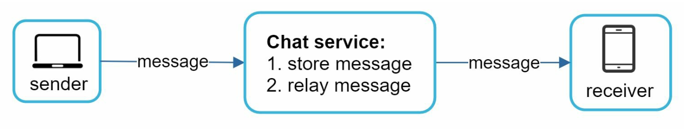
      

2. **Receiver Side:**
   - **Polling:**
      - Client periodically asks the server if there are messages available.
      - Inefficient due to frequent, redundant requests.

         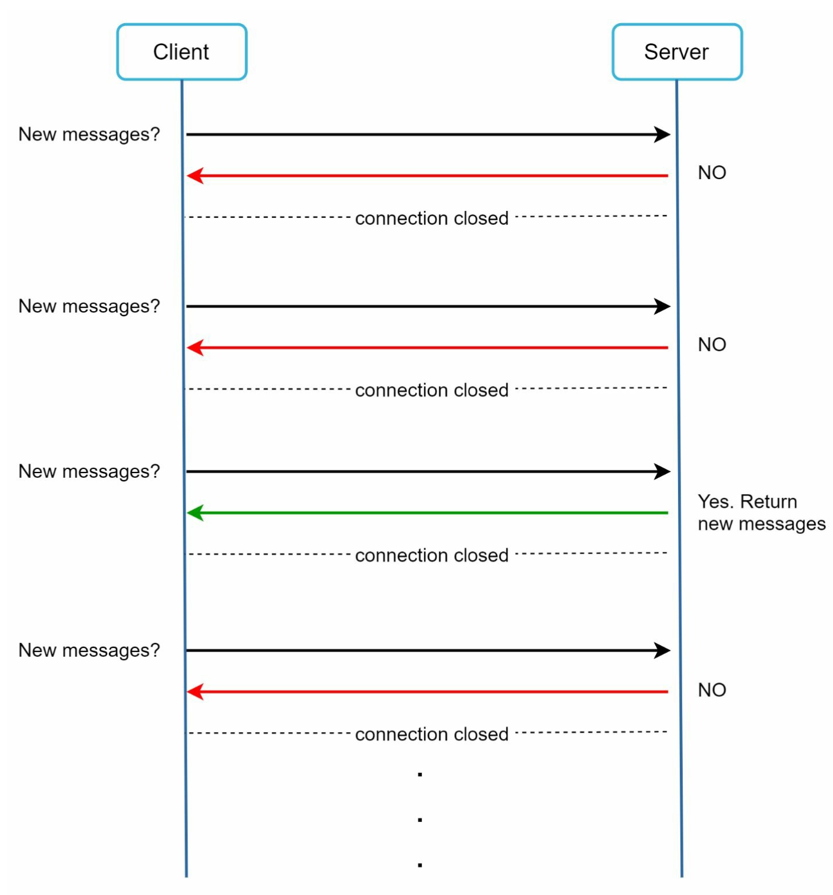    

   - **Long Polling:** 
      - Keeps the connection open until messages arrive. 
      - Inefficient for inactive users.

         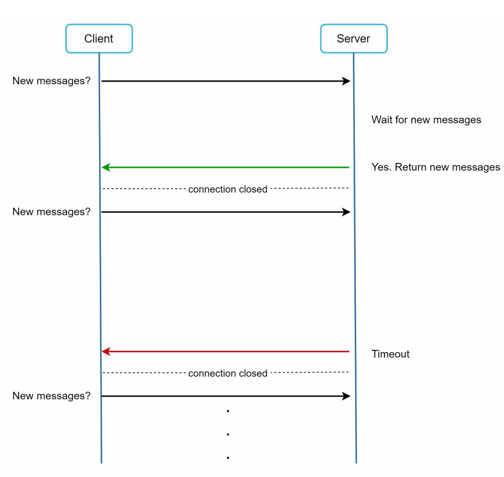

   - **WebSocket:** 
      - A bi-directional, persistent connection for real-time communication, chosen for both sending and receiving messages.
      - Uses WebSockets (ws) protocol for sending and recieving messages.

         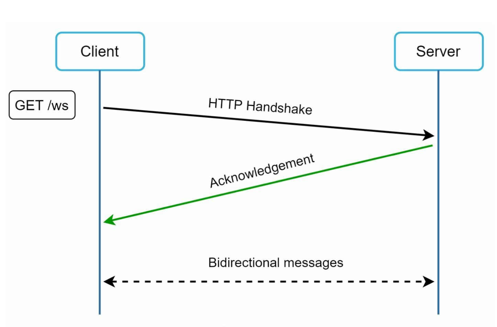    

### Choosing the receive channel

| | Short polling | Long polling | Server-Sent Events | WebSocket |
|---|---|---|---|---|
| Direction | Client pulls | Client pulls, server holds | Server → client | **Bi-directional** |
| Latency | Half the poll interval | Near real-time | Near real-time | Near real-time |
| Overhead when idle | A full request per interval, mostly empty | One held connection, re-established per message | One held connection | One held connection |
| Server state | None | One blocked connection per client | One per client | One per client |
| Works through old proxies | Yes | Yes | Mostly | Needs `Upgrade` support |
| Reconnect handling | Trivial | Built in (each response ends it) | Automatic, with `Last-Event-ID` | You implement it |
| Binary frames | No | No | No (text only) | Yes |
| Good for | Nothing at this scale | A fallback | Feeds, notifications, dashboards | **Chat** |

WebSocket wins here because chat is the one case that genuinely needs the *bi-directional* column: the client both sends and receives continuously, over one connection, with low per-message overhead. SSE would serve receiving perfectly well but needs a second channel for sending; long polling pays a connection setup per message delivered.

Note the row that is a cost, not a benefit: **"Reconnect handling — you implement it."** HTTP's statelessness is what makes everything else in these notes easy to scale, and adopting WebSocket is a deliberate decision to give that up for the chat tier specifically. The design above sends messages over HTTP; in practice most systems send over the same socket, since it is already open and already authenticated.

---

### Components

   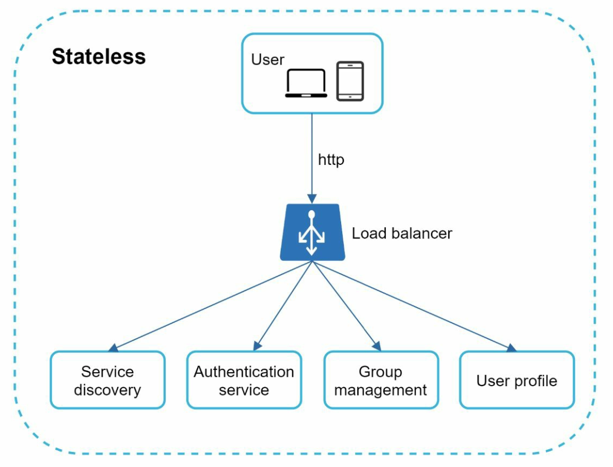    
   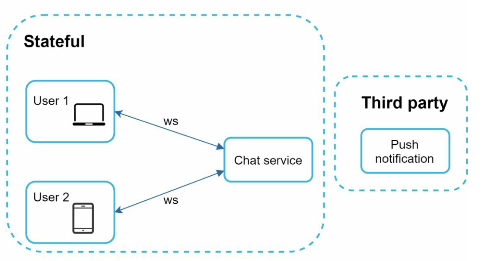

1. **Stateless Services:**
   - Handle signup, login, and user profile management.
   - Integrated with service discovery to recommend the best chat server.
2. **Stateful Services:**
   - Chat servers maintain persistent WebSocket connections.
   - Responsible for message delivery and synchronization.
3. **Third-Party Integration:**
   - Push notification services notify users about new messages.
   - Refer Notification System chapter for notifications implementation.

**The stateless/stateful split is the most important line in the architecture.** Everything that can be stateless — signup, login, profile, contact lists — is, and scales the ordinary way. The chat servers cannot be, and that difference has consequences the diagram does not show:

| | Stateless tier (API servers) | Stateful tier (chat servers) |
|---|---|---|
| Load balancing | Any request to any server | Client must reach *its* server, or the one holding the recipient's socket |
| Adding capacity | Immediate — new server takes traffic | New server takes only *new* connections; existing ones stay put |
| Removing a server | Drain in-flight requests, seconds | Disconnects every one of its ~100 K clients, who all reconnect at once |
| Deploying a new version | Rolling restart, invisible | Every restart is a mass reconnection event |
| Failure impact | One request retried | ~100 K clients dropped, presence wrong until they return |

This is why **service discovery** exists in the design at all, and why restarts and deploys are operationally interesting in a chat system in a way they are not elsewhere.

---
### Design

The client maintains a persistent WebSocket connection to a chat server for real-time messaging.

      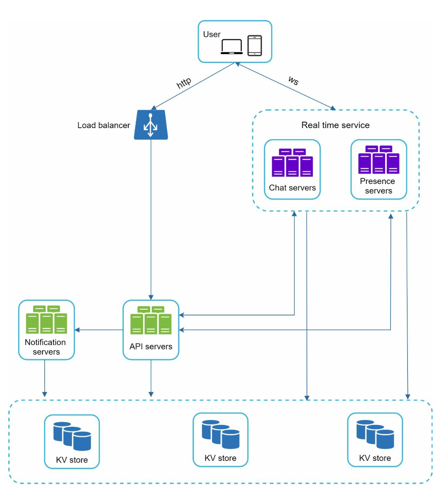 

- Chat servers facilitate message sending/receiving.
- Presence servers manage online/offline status.
- API servers handle everything including user login, signup, change profile, etc.
- Notification servers send push notifications.
- Finally, the key-value store is used to store chat history.Key-value stores for the database of the chat history data for following reasons:
   - It allows easy horizontal scaling.
   - KV stores provide very low latency to access data.
   - Relational databases do not handle long tail of data well. When the indexes grow
   large, random access is expensive.
   - KV stores are adopted by other proven reliable chat applications. For example,
   both Facebook messenger and Discord.

Following are the data models for one-to-one chat and group chat.
   - The primary key is message id, which helps to decide message sequence.
   - For the group chat the composite primary key is (channel_id, message_id). 
      - IDs can be generated using a global 64-bit sequence number generator like Snowflake.
      - A better approach is to use local sequence number generator. Local means IDs are only unique within a group.
      - The reason why local IDs work is that maintaining message sequence within one-on-one channel or a group channel is sufficient. 
      
      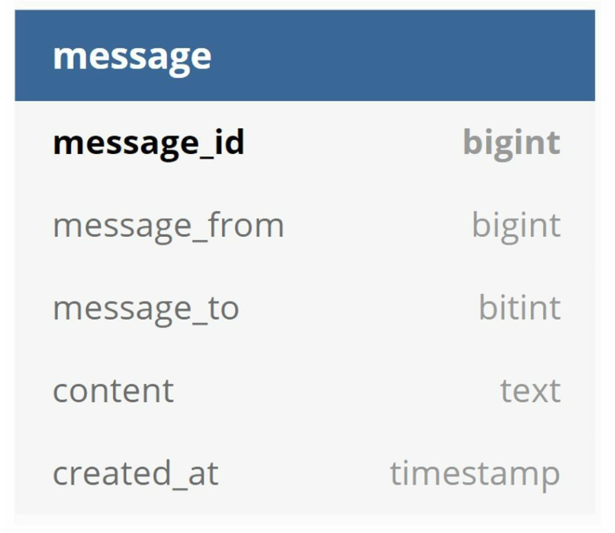   
      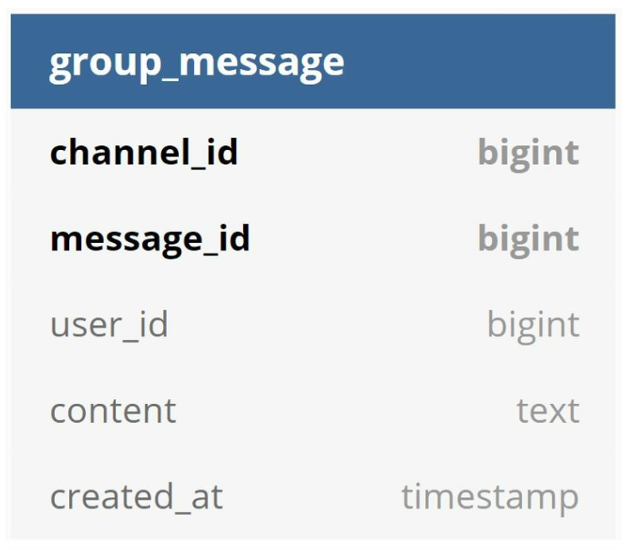   

**Why a *local* sequence number beats a global Snowflake ID here**, which is the opposite of the conclusion in [Chapter 7](../07.%20Unique-Id%20Generator/):

| | Global (Snowflake) | Local per-channel sequence |
|---|---|---|
| Uniqueness scope | Entire system | Within one channel |
| Ordering guarantee | k-sortable — **arbitrary within a millisecond** | Strictly `+1`, totally ordered |
| Depends on clocks | Yes — skew is a correctness risk | No |
| Coordination needed | Once, at machine-ID assignment | A single owner per channel, every message |
| Size | 64 bits | Small integer |

The requirement is only that participants in a conversation agree on the order of *that conversation's* messages. Nobody needs to know whether a message in your chat preceded one in a stranger's. A per-channel counter delivers strict ordering with no clock dependency, which is strictly stronger than what Snowflake gives *for this purpose* — Snowflake's k-sortability means two messages sent in the same millisecond could display in either order, which in a chat is a visible bug.

The cost is the coordination: a channel's counter must have exactly **one owner** at a time, or two servers will issue the same sequence number. That is the same single-writer requirement that will reappear in [Chapter 28](../28.%20Stock%20Exchange/) as the sequencer, and it is the reason the chat server handling a channel matters.

**Why a key-value store rather than a relational database** — the chapter lists four reasons, and the second-to-last is the real one. Chat history is enormous, append-only, read intensely for about a day, and then effectively never read again. A B-tree index over petabytes of that shape degenerates into random disk access for the long tail, while a log-structured store ([Chapter 6](../06.%20Key-Value%20Store/)) is built for exactly this: sequential writes, recent data in memory, old data cheap to keep and slow to reach. The access pattern — fetch by `(channel_id, message_id)` range — needs no joins and no transactions across rows.

## Step 3: Design Deep Dive

### Service Discovery

   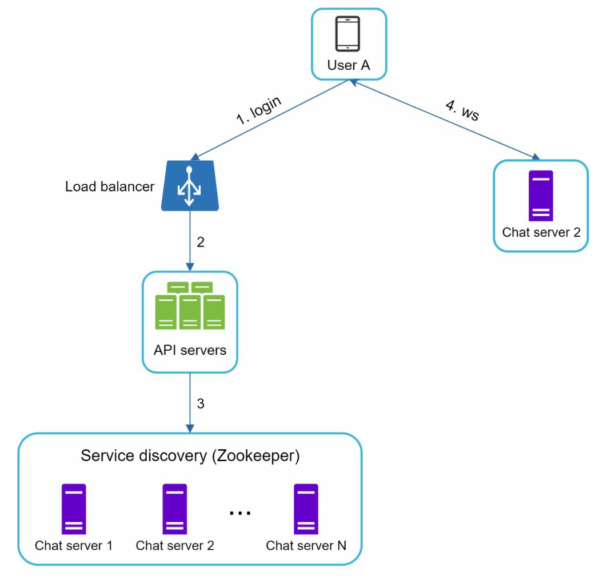   

- The primary role of service discovery is to recommend the best chat server for a client based
on the criteria like geographical location, server capacity. 
- Uses **Apache Zookeeper** to allocate chat servers based on criteria like geographic location and server capacity.
- Ensures efficient load distribution and minimizes latency.

**There are two different lookup problems here, and conflating them is a common mistake:**

1. **"Which server should *I* connect to?"** — asked once, at login. This is what service discovery answers, using location and spare capacity.
2. **"Which server holds the socket for the person I am messaging?"** — asked on every single message. Service discovery does not answer this.

The second problem needs a **session registry**: a mapping from `user_id` → `chat_server_id`, written when a client connects and removed when it disconnects. The alternatives are worth knowing:

| Approach | How a message finds the recipient | Trade-off |
|---|---|---|
| Session registry (Redis) | Look up `user_id`, send directly to that server | One extra lookup per message; registry is a hot dependency |
| Pub/sub on a shared bus | Publish to a channel every chat server subscribes to | No lookup, but every server sees every message — does not scale |
| Consistent hashing on user ID | Compute the owning server from the ID | No registry at all, but a client cannot choose its server, and rebalancing moves live connections |

Most real systems use the registry, because it decouples *where a client happens to be connected* from *who they are* — which is what multi-device support requires, since one user has several sockets on several servers simultaneously.

### Messaging Flows
#### One-on-One Chat

1. User A sends a message to Chat Server 1.
2. Chat Server 1 assigns a unique message ID and stores the message in a key-value store.
3. If User B is online, the message is forwarded to Chat Server 2, maintaining a persistent WebSocket connection.
4. If User B is offline, a push notification is sent.

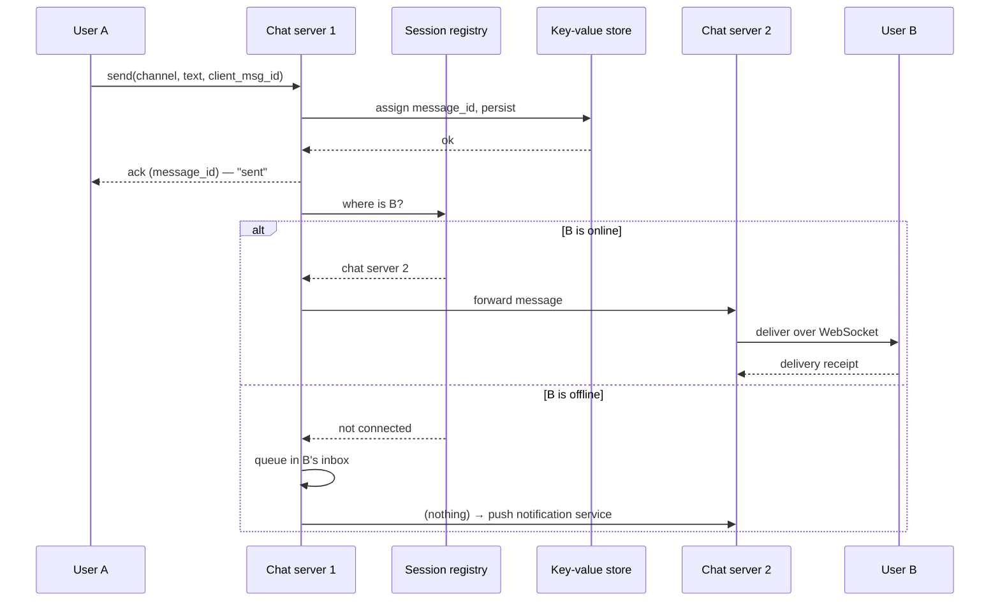
```mermaid
sequenceDiagram
    participant A as User A
    participant C1 as Chat server 1
    participant SR as Session registry
    participant KV as Key-value store
    participant C2 as Chat server 2
    participant B as User B
    A->>C1: send(channel, text, client_msg_id)
    C1->>KV: assign message_id, persist
    KV-->>C1: ok
    C1-->>A: ack (message_id) — "sent"
    C1->>SR: where is B?
    alt B is online
        SR-->>C1: chat server 2
        C1->>C2: forward message
        C2->>B: deliver over WebSocket
        B-->>C2: delivery receipt
    else B is offline
        SR-->>C1: not connected
        C1->>C1: queue in B's inbox
        C1->>C2: (nothing) → push notification service
    end
```

**Note the order of operations: persist, then acknowledge, then deliver.** The sender's "sent" tick is earned by the write to the datastore, not by delivery to the recipient — otherwise an offline recipient would leave the sender waiting indefinitely. This is also what makes the message recoverable: if chat server 1 dies immediately after acknowledging, the message is already durable and the recipient will collect it on sync.

**The sender's own other devices also need the message.** A user messaging from their phone expects it to appear on their laptop, so the fan-out set is *all participants' devices including the sender's own* — which is why the inbox model below is per-user rather than per-recipient.

#### Group Chat

   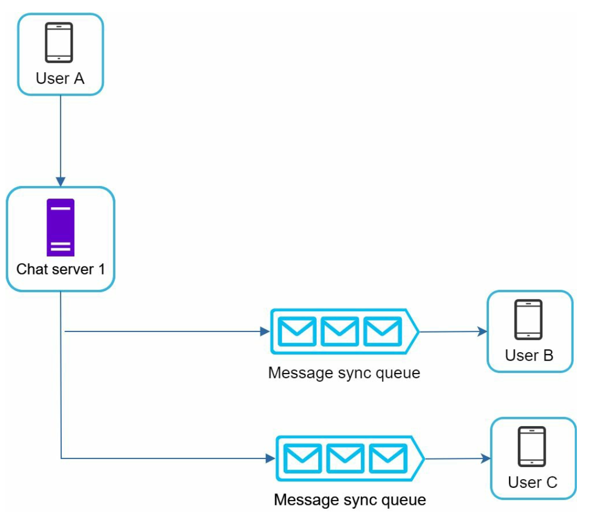  

- Messages are copied to individual inboxes for each recipient in the group.
- Simplifies synchronization but becomes expensive for larger groups.
- On the recipient side, a recipient can receive messages from multiple users. Each recipient
has an inbox (message sync queue) which contains messages from different senders.

**This is the push-versus-pull decision from [Chapter 11](../11.%20News%20Feed%20System/), and the 100-member cap is what settles it.** Copying a message into every member's inbox is fan-out on write: one message becomes up to 100 writes. At 23,000 messages/sec that is a worst case of 2.3 M inbox writes/sec, which is large but bounded — and in exchange, reading is a single ordered scan of one inbox, and multi-device sync becomes trivial.

| Group size | Fan-out on write | What real systems do |
|---|---|---|
| 2–100 (this design) | ≤ 100 writes per message | Push — the design above |
| Thousands | Thousands of writes per message, most to idle members | Push only to active members |
| 100,000+ (Discord-style servers) | **Infeasible** | Pull: store once per channel, readers fetch the channel |

So the requirement "max 100 users" is not a simplification for the reader's benefit; it is the assumption that makes the entire inbox model viable. Remove it and the design changes shape, in exactly the way the celebrity problem changes a news feed. Being able to say that is more valuable than reciting the inbox design.

---

#### Message Synchronization

Many users have multiple devices. We need to synchronize the message across the devices.
Each device maintains a variable called cur_max_message_id, which keeps track of the latest
message ID on the device. Messages that satisfy the following two conditions are considered
as news messages:

   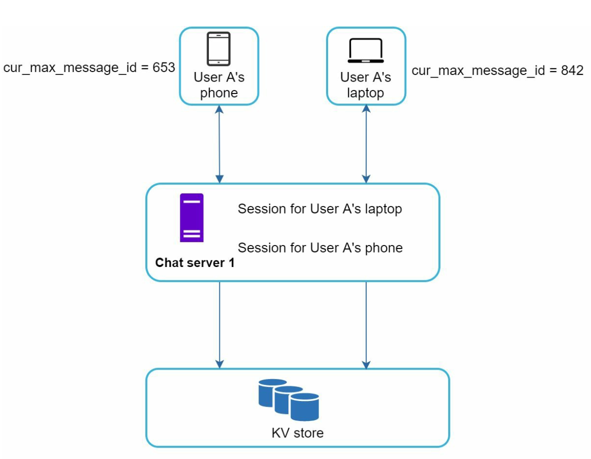  

- The recipient ID is equal to the currently logged-in user ID.
- Message ID in the key-value store is larger than cur_max_message_id

**`cur_max_message_id` is a cursor, and it is the same mechanism as feed pagination** in [Chapter 11](../11.%20News%20Feed%20System/) — "give me everything after this point". It is remarkably economical: one integer per device per channel replaces any need for the server to track delivery state per device.

It works only because message IDs are **monotonic within the channel**, which is why the local sequence number above is not a detail. With non-monotonic IDs there is no "larger than", and the whole sync protocol collapses.

Three consequences worth stating:

- **Each device keeps its own cursor.** A phone that has been offline for a week reconnects and asks for everything after its cursor; the laptop that was online asks for nothing. No server-side per-device bookkeeping is required.
- **Reconnection is a pull, not a replay.** The server does not need to remember what it failed to deliver — the client declares what it already has. That makes the stateful chat server's state *recoverable*, which is the only reason losing one is survivable.
- **A long-absent device can request an enormous backlog.** Paginate the sync response rather than returning a week of group chat in one frame.

---

### Online Presence
1. **Heartbeat Mechanism:** 
   

      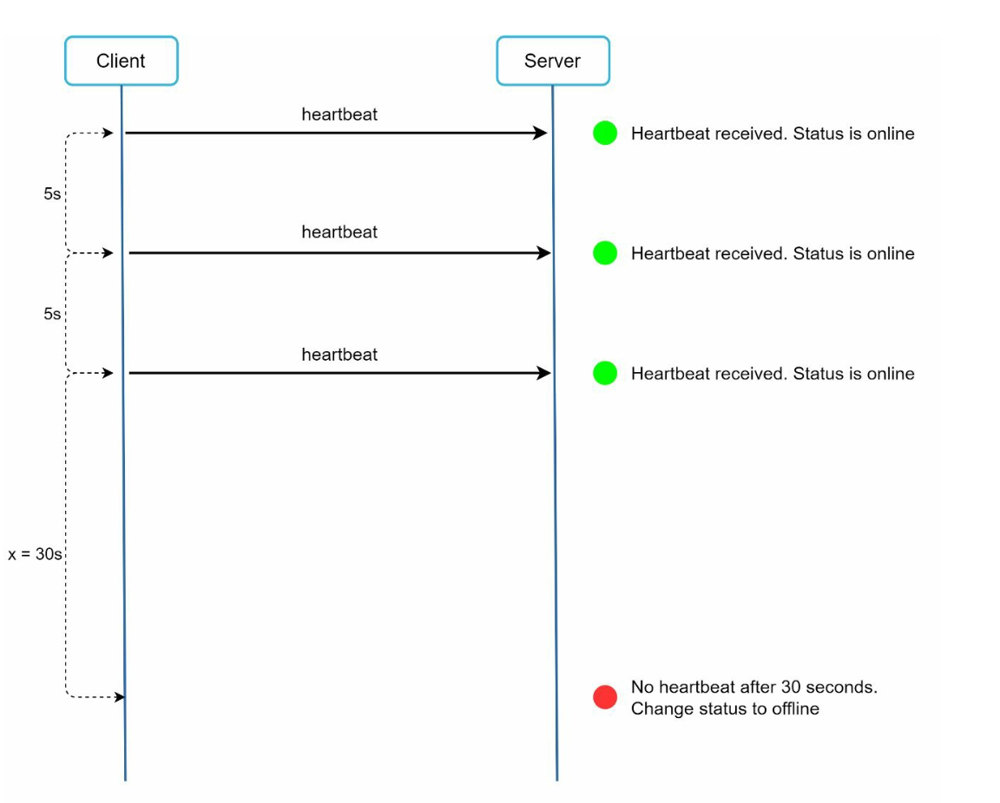 
   

   
   - Clients send periodic heartbeats to presence servers to indicate they are online. 
   - If no heartbeat is received within a threshold (for eg x = 30), the user is marked offline.

   **Why a heartbeat rather than relying on the socket closing.** A graceful disconnect sends a close frame and presence updates instantly. The cases that matter are the ungraceful ones — a phone entering a tunnel, a battery dying, a Wi-Fi handoff — where the socket stays open from the server's point of view for minutes. The heartbeat is what distinguishes "connected" from "the TCP connection has not noticed yet".

   The interval is a direct trade between detection speed and load:

   | Heartbeat interval | Heartbeats/sec at 5 M clients | Worst-case staleness |
   |---|---|---|
   | 5 s | **1,000,000/sec** | ~5–15 s |
   | 30 s | **~167,000/sec** | ~30–90 s |
   | 60 s | ~83,000/sec | ~1–3 min |

   A threshold of a few missed beats (rather than one) is standard, because a single dropped heartbeat on a mobile network is normal and flapping a user offline-then-online is worse than being slightly stale.

2. **Fanout Model:** 

   

      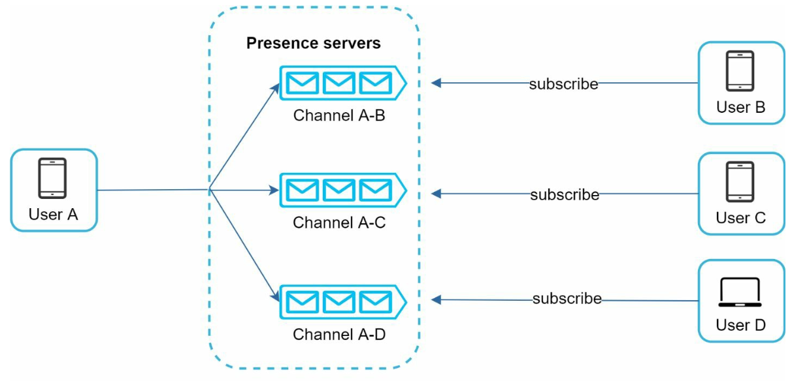 
   

   - Presence updates are pushed to friends using a publish-subscribe model in which each friend pair maintains a channel.
   - When User A’s online status changes, it publishes the event to three channels, channel A-B, A-C, and A-D. 
   - Those three channels are subscribed by User B, C, and D, respectively which get the online status updates.
   - The above design is effective for a small user groups.

   **And it is the design's weakest point at scale**, which the last bullet concedes without quantifying. From the estimate at the top of the chapter: 50 M status changes/day × ~500 contacts ≈ **290,000 presence updates/sec**, more than ten times the message traffic. A user on a train, flipping between cell towers, personally generates thousands of notifications to people who are not looking at their contact list.

   How real systems cut this down:

   | Technique | Effect |
   |---|---|
   | **Fetch on demand** | Don't push presence at all; resolve it when a client actually renders a contact list or opens a chat |
   | **Subscribe to the visible set** | Push only for the contacts currently on screen, and unsubscribe on scroll |
   | **Debounce flapping** | Wait out brief disconnections before publishing "offline" |
   | **Coarsen the status** | "Active today" instead of a live dot removes the need for real-time updates entirely |

   Fetch-on-demand is the big win: nobody can look at 500 contacts at once, so pushing updates for all of them is work that is discarded by definition. Note the direct parallel with [Chapter 11](../11.%20News%20Feed%20System/) — this is fan-out on write versus fan-out on read, reappearing for presence instead of posts, and here read-time resolution is clearly correct.

   > **Interview angle:** presence is where this chapter is usually won or lost. Interviewers expect "heartbeat plus pub/sub" and are looking for whoever notices that presence fan-out dwarfs messaging and proposes resolving it at read time for the visible contacts only.

---

## Additional Considerations
### Scalability
- **Horizontal Scaling:** Add servers as user count increases.
- **Load Balancing:** Distribute traffic evenly across servers.
- **Caching:** Reduce database load and improve latency.

### Error Handling
- **Retry Mechanisms:** Handle message delivery failures with retries and queuing.
- **Server Failures:** Use service discovery to allocate new servers in case of failures.

### Future Extensions
1. **Media Support:** Add handling for photos and videos, including compression and cloud storage.
2. **End-to-End Encryption:** Ensure message privacy.
3. **Client-Side Caching:** Reduce data transfer for better performance.
4. **Improved Load Times:** Use geographically distributed caching networks.

**End-to-end encryption is not an add-on; it removes capabilities.** Once the server holds only ciphertext it cannot: search message history, generate a useful push-notification preview, scan for abuse, or let a new device read old messages without a key-transfer protocol. Group membership changes become key-rotation events. These are product decisions disguised as a checkbox, and noticing that is the valuable observation.

**Media follows the same rule as everywhere else in these notes:** upload to object storage, put the URL in the message, and never move bytes through the chat tier. A 20 MB video travelling over a WebSocket occupies a connection that is supposed to be serving thousands of small frames.

---

### Gotchas & failure modes

- **Losing a chat server disconnects ~100,000 clients at once, and they all reconnect simultaneously.** That reconnection storm hits service discovery, the session registry, and the remaining servers together — potentially toppling the next server and cascading. Clients must reconnect with **randomised exponential backoff**; without jitter, a single restart becomes a platform outage.
- **Deploys are reconnection storms you schedule yourself.** Every rolling restart drops and re-establishes every connection on that server. Drain gradually rather than restarting all at once.
- **Load balancers and proxies kill idle WebSockets.** Default idle timeouts of 60 seconds will silently close a connection with no traffic. Application-level ping/pong keepalives are mandatory, and conveniently double as the heartbeat.
- **A dropped connection is invisible to the server for minutes.** TCP does not notice a phone entering a tunnel. Only the heartbeat does, which is why presence must never be derived from socket state alone.
- **The session registry is on the critical path of every message.** If it is unavailable, messages can still be persisted but not routed. Treat it as a tier-one dependency, and consider caching recent lookups on each chat server.
- **Client retries duplicate messages.** A client that sends, loses the connection before the ack, and resends has sent the message twice. The fix is a **client-generated idempotency key** (`client_msg_id`) that the server deduplicates on, which also lets the UI reconcile its optimistic local copy with the server's assigned ID.
- **Global IDs give you the wrong ordering.** Snowflake IDs are only k-sortable, so two messages in the same millisecond can display in either order — visible and wrong in a conversation. Per-channel sequence numbers are strictly ordered.
- **A per-channel sequence needs exactly one writer.** Two servers assigning numbers for the same channel will collide. Channel ownership must be unambiguous, and handing it over on failover must not overlap.
- **Presence fan-out is the largest workload and is nearly all waste.** Mobile network flapping generates hundreds of thousands of updates per second for contact lists nobody is looking at. Resolve on demand, debounce, and limit to the visible set.
- **Flapping presence is worse than stale presence.** A threshold of one missed heartbeat will show users blinking offline and online. Require several.
- **Typing indicators are a firehose of ephemeral traffic.** They can exceed message volume, must never be persisted, and should be rate-limited per user and dropped under load rather than queued.
- **Delivery and read receipts multiply traffic.** Each message potentially generates "delivered" and "read" events per recipient per device — in a 100-member group, one message can produce hundreds of receipt events. Batch them.
- **Permanent history has no natural bound.** ~73 TB/year that is almost never read after a day. Plan tiering to cold storage from the start; retrofitting it onto a hot store is painful.
- **A long-offline device's sync can be enormous.** Paginate the backlog; do not attempt to deliver a week of group chat in one response.
- **Multi-device means fan-out per device, not per user.** All scale arithmetic — connections, receipts, pushes — multiplies by devices per user, not users.
- **Push notifications must not contain message content.** Lock-screen previews and third-party relays make the payload semi-public, and under E2E encryption the server does not have the plaintext anyway ([Chapter 10](../10.%20Notification%20System/#security)).

---

## The design, as problem and technique

| Goal / problem | Technique |
|---|---|
| Real-time bidirectional messaging | WebSocket, one persistent connection per device |
| Picking a chat server at login | Service discovery (ZooKeeper) by location and capacity |
| Finding the recipient's server per message | Session registry mapping `user_id` → chat server |
| Strict ordering within a conversation | Per-channel monotonic sequence number, single owner |
| Multi-device sync | Per-device `cur_max_message_id` cursor; client declares what it has |
| Group delivery (≤100 members) | Fan-out on write into each member's inbox |
| Offline recipients | Persist to inbox, then push notification |
| Durability before delivery | Persist, acknowledge, then route |
| Duplicate sends from client retries | Client-generated idempotency key, deduplicated server-side |
| Detecting ungraceful disconnects | Heartbeat with a multi-miss threshold |
| Presence at 290,000 updates/sec | Resolve on demand for the visible contact set; debounce flapping |
| Petabytes of append-only history | Key-value / log-structured store, tiered to cold storage |
| Surviving a chat server's death | Recoverable state (cursors) plus jittered client reconnection |
| Media in messages | Object storage plus CDN; messages carry URLs |

## Self-check
1. Which number sizes the chat tier — 50 M DAU, or something else? Compute it.
2. Compare presence fan-out with message throughput. Which is larger, and by roughly how much?
3. Why is WebSocket chosen over SSE, given that SSE also delivers in real time?
4. Name the two distinct "which server?" questions in this design, and which component answers each.
5. Why is a per-channel local sequence number *better* than a global Snowflake ID here, when Chapter 7 argued the opposite?
6. What does `cur_max_message_id` make unnecessary on the server, and what property must message IDs have for it to work?
7. The requirement caps groups at 100 members. What does that assumption buy, and how would the design change at 100,000?
8. Why is the sender acknowledged before the recipient receives anything?
9. A chat server crashes with 100,000 connections. Describe what happens in the next 10 seconds, and what prevents it cascading.
10. A load balancer closes connections after 60 idle seconds. What breaks, and what fixes it?
11. A client sends a message, the connection drops before the ack, and the client resends. What stops the recipient seeing it twice?
12. Why is a heartbeat threshold of one missed beat a bad idea?
13. List three things end-to-end encryption takes away from the server.

## Glossary

| Term | Meaning |
|---|---|
| **WebSocket** | A persistent, bi-directional connection established by upgrading an HTTP request |
| **Stateful tier** | The chat servers, which hold live sockets and therefore cannot be freely rescheduled |
| **Service discovery** | Choosing which chat server a client should connect to at login |
| **Session registry** | The `user_id` → chat server mapping consulted to route each message |
| **Channel** | A conversation — one-on-one or group — and the unit of message ordering |
| **Local sequence number** | A per-channel counter giving strict ordering without clock dependence |
| **Inbox / message sync queue** | A per-user ordered list of messages, written by fan-out |
| **`cur_max_message_id`** | A device's cursor: the highest message ID it already holds |
| **Heartbeat** | Periodic client ping proving liveness, since TCP will not notice a dead phone |
| **Presence fan-out** | Propagating a status change to every contact — the system's largest workload |
| **Debouncing** | Suppressing brief status flaps before publishing them |
| **Idempotency key (`client_msg_id`)** | Client-generated ID letting the server discard a resent message |
| **Reconnection storm** | Mass simultaneous reconnection after a server loss or deploy |
| **Delivery / read receipt** | Per-recipient, per-device acknowledgements that multiply traffic |

## Where to go next
- [Chapter 11 – Design A News Feed System](../11.%20News%20Feed%20System/) — the push-versus-pull fan-out decision that the 100-member cap settles here and the celebrity problem settles there.
- [Chapter 10 – Design A Notification System](../10.%20Notification%20System/) — where offline delivery goes, including why payloads must stay content-free.
- [Chapter 7 – Design A Unique ID Generator](../07.%20Unique-Id%20Generator/) — and why its k-sortable IDs are not good enough for message ordering.
- [Chapter 6 – Design A Key-Value Store](../06.%20Key-Value%20Store/) — the log-structured storage that makes petabytes of append-only history affordable.
- [Chapter 17 – Nearby Friends](../17.%20Nearby%20Friends/) — the same persistent-connection and presence machinery, applied to location.
- [How Discord stores billions of messages](https://discord.com/blog/how-discord-stores-billions-of-messages) and [Flannel, Slack's edge cache](https://slack.engineering/flannel-an-application-level-edge-cache-to-make-slack-scale/) — both chapters' problems at real scale.

