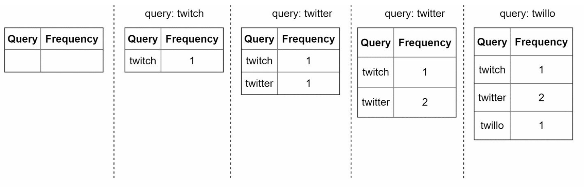
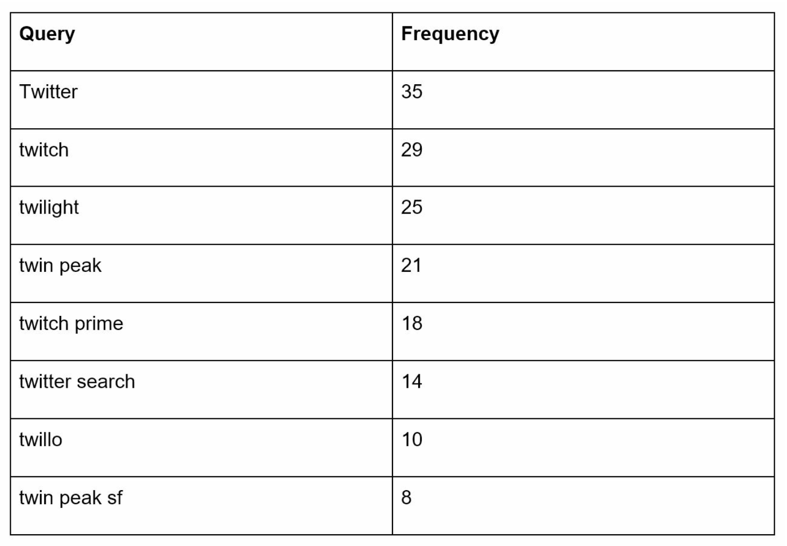
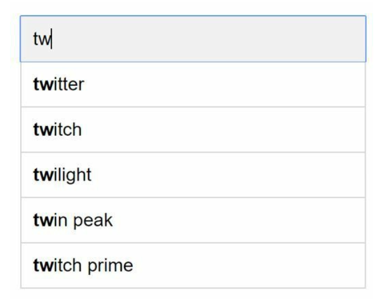
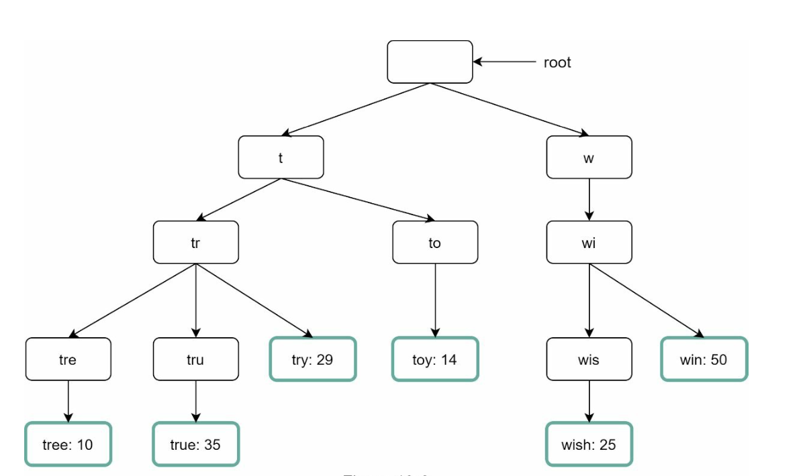
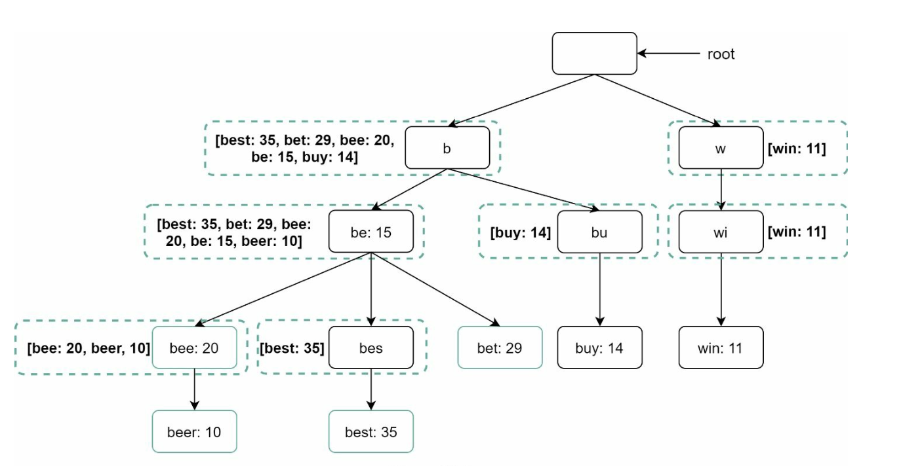
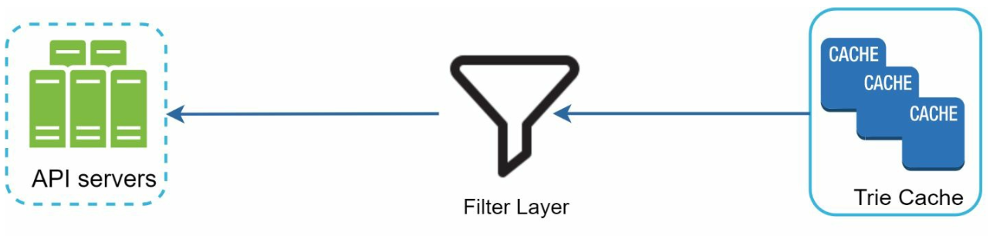
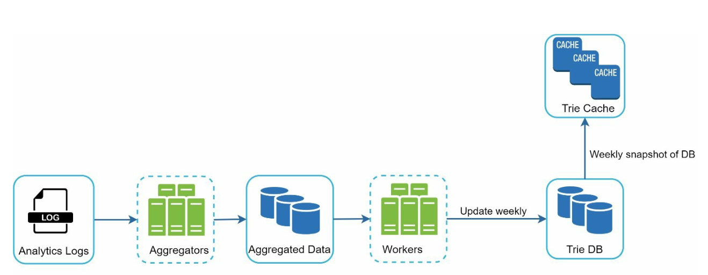
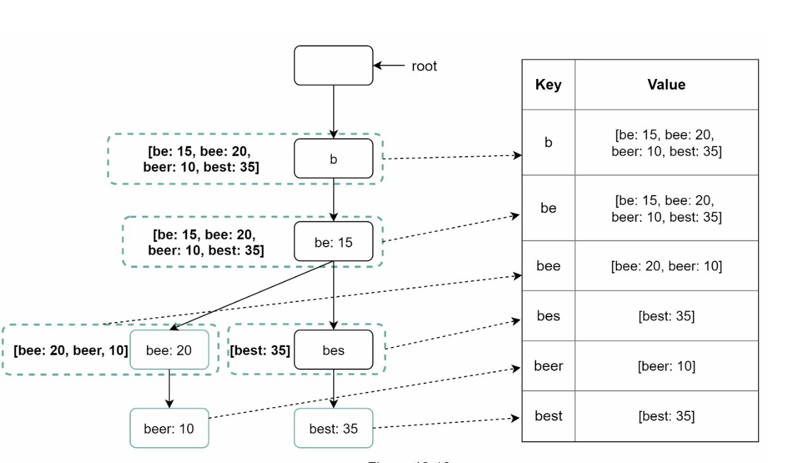
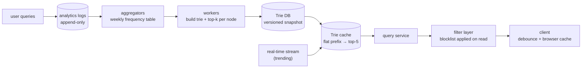
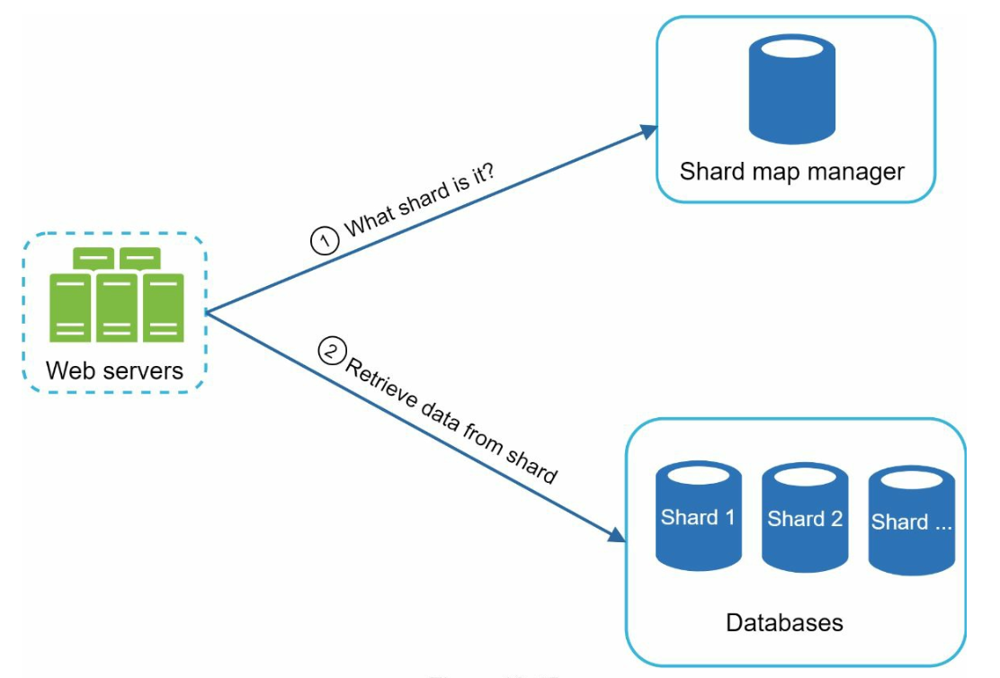

# Chapter 13: Design a Search Autocomplete System

## Introduction
Autocomplete, also known as typeahead or incremental search, provides real-time suggestions to users as they type in search boxes. The system must efficiently deliver top-k relevant and popular suggestions based on historical query data.

**The one-sentence version:** the obvious design — walk a trie to the prefix, gather its subtree, sort by frequency — is **unusable at request time**, because the subtree under a prefix like `"a"` contains nearly every query you have ever seen. The entire chapter is the consequence of precomputing the answer for every prefix instead, at which point the trie stops being a serving structure and becomes a **build-time** one, and serving is just a hash map lookup.

The second thing to notice early: autocomplete is the **highest-QPS service in a search company**, because every keystroke is a request. It handles roughly twenty times the traffic of search itself while serving results nobody explicitly asked for.

### Key Features
- Suggest up to **5 autocomplete results**.
- Based on **query popularity** (frequency).
- Support only **lowercase English characters**.
- Fast response time (<100 ms) and scalable.

---

## Step 1: Understanding the Problem

### Requirements
1. **Real-Time Suggestions:** Display relevant matches as the user types.
2. **Top-k Results:** Return up to 5 results sorted by popularity.
3. **Scalability:** Handle **10 million DAU** with a peak QPS of **48,000**.
4. **High Availability:** Handle failures without system downtime.
5. **Data Growth:** Support daily storage growth of **0.4 GB** for new query data.

### Where 48,000 QPS comes from — and why it is the real constraint

| Quantity | Derivation | Result |
|---|---|---|
| Searches/day | 10 M DAU × ~10 searches | 100 M |
| Keystrokes per search | ~20 characters typed | 20 requests per search |
| Autocomplete requests/day | 100 M × 20 | **2 B (~24,000 QPS average)** |
| Peak QPS | ~2 × average | **~48,000 QPS** |

**One search produces twenty autocomplete requests.** That 20× amplification is the defining property of the workload, and it has two immediate consequences: the service must be absurdly cheap per request, and *reducing the amplification* is the highest-leverage optimisation available — which is exactly what client-side debouncing and browser caching do, further down.

### The latency budget is set by typing speed, not by the SLA

A competent typist produces a character every 150–200 ms. That gives a hard bound tighter than the stated 100 ms:

- **Under ~50 ms server time**, suggestions appear to update as the user types.
- **Over ~200 ms**, the user has already typed the next character, so your response is answering a prefix that no longer exists.

The second case is not merely slow — it is a **correctness problem on the client**. Responses for `"tw"` and `"twi"` are separate in-flight requests that can return out of order, so the UI must discard any response that does not match the current input. A client that simply renders whatever arrives last will flicker between suggestion sets, which users read as the feature being broken.

> **Interview angle:** deriving 48,000 QPS from keystrokes rather than searches shows you understand the workload, and noting that the latency bound comes from human typing speed (with out-of-order responses as the consequence) is the kind of detail that distinguishes a considered answer.

---

## Step 2: High-Level Design
At the high-level, the system is broken down into two services:
1. **Data Gathering Service:** 
    - Collects user queries and aggregates them for frequency analysis in real-time.
    - Real-time processing is not practical for large data sets; however, it is a good starting point

2. **Query Service:** Provides the top-k suggestions based on the user’s input.

---

### Data Gathering Service

    

- Aggregates query data from analytics logs and updates the frequency table.
- Processes historical data weekly to build a **trie** (prefix tree).

### Query Service

    
    

- Uses the frequency table from data gathering service.
- Processes user input and retrieves top-k suggestions from the frequency table using a Trie.
- Optimized for fast lookups using caching and efficient data structures.
- For example when a user types “tw” in the search box, the following top 5 searched queries are displayed.

**Why a frequency table alone is not enough.** `SELECT query, freq FROM frequency_table WHERE query LIKE 'tw%' ORDER BY freq DESC LIMIT 5` is correct and completely impractical: it is a scan over every row matching the prefix, executed 48,000 times a second, against a table where the prefix `"a"` matches hundreds of millions of rows. The trie exists to make *finding* the matching set O(prefix length) instead of a scan — and the top-k cache below exists because even then, *ranking* the matching set is the expensive half.

---

## Step 3: Design Deep Dive

### Trie Data Structure
The **trie** is a tree-like data structure used to store and retrieve query strings efficiently.

#### Key Features
1. **Compact Storage:** Represents prefixes hierarchically to minimize redundancy.
2. **Frequency Information:** Stores the popularity of queries at each node.

3. **Steps to get top k most searched queries**
   

      
   

    - Find the prefix
    - Traverse the subtree from prefix node to get all valid children
    - Sort the children and get top k 

    **Count the cost of step 2 and 3 honestly.** Finding the prefix node is O(length of prefix) — trivially fast. Gathering and sorting the subtree is where it falls apart:

    | Prefix typed | Queries beneath it | Work per request |
    |---|---|---|
    | `"a"` | Potentially **hundreds of millions** | Visit them all, then sort |
    | `"ap"` | Millions | Still hopeless |
    | `"apple pie recipe"` | A handful | Fine |

    The expensive case is the *first keystroke*, which every single search performs. So the naive algorithm is slowest exactly where it is called most. At 48,000 QPS it is not a matter of optimisation — it cannot work at all, which is what makes the next section the heart of the chapter.

4. **Optimizations:**
   - Cache top-k queries at each node to speed up retrieval and avoid traversing the whole trie.

        

   - Limit prefix length to reduce search space as users rarely type a loong search query (say 50).

**Caching top-k at each node changes the algorithm's complexity class, not just its constant.** With the answer stored on the node itself, serving a request is: walk `p` characters down the trie, return the stored list. That is **O(length of prefix)** with no subtree traversal and no sorting — and since prefixes are capped at ~50 characters, it is effectively O(1).

The trade is memory, and it is substantial:

| | Traverse at query time | Top-k cached at each node |
|---|---|---|
| Query cost | O(subtree size + sort) — up to hundreds of millions | **O(prefix length)** ≈ constant |
| Memory | Frequencies only | Plus ~5 strings per node (~100 bytes) |
| Build cost | None | Full bottom-up pass over the trie |
| Updating one query's frequency | Touch one node | Touch **every ancestor** whose top-5 might change |

The last row is the one that shapes the rest of the chapter. Once answers are precomputed, an update is no longer local — bumping `"twitter"` can change the cached list at `"t"`, `"tw"`, `"twi"` and so on. **That is why the trie is rebuilt in batch rather than updated live**, and the "weekly rebuild" that looks like laziness is actually a direct consequence of the top-k cache.

**The realisation this leads to:** if every node stores its own answer and lookup never descends past the prefix, the tree structure is not being used at serving time at all. A map from `prefix → [top 5 queries]` serves requests identically, in one hash lookup instead of 50 pointer dereferences, and shards trivially. The trie is how you *compute* those entries; it is not how you serve them — which is precisely the key-value representation described under Storage Options below.

Sizing it: roughly 100 M distinct prefixes worth keeping × ~100 bytes of cached suggestions ≈ **~10 GB**, which fits in a distributed cache and explains why the serving tier is memory-resident.

#### Trie Operations
1. **Create:** 
    - Built weekly using aggregated query data.
    - The source of data is from Analytics Log/DB.
2. **Update:** Rarely updated in real-time; weekly updates replace old data.
3. **Delete:** 
      

         
      

    - Filters remove unwanted or harmful suggestions (e.g., hate speech).
    - Having a filter layer gives us the flexibility of removing results based on different filter rules.
    - Unwanted suggestions are removed physically from the database asynchronically.

    **The filter must sit on the read path, and the reason is structural.** Suggestions are precomputed and the trie is rebuilt weekly, so a suggestion banned on Tuesday remains baked into every cached node until the next build. Physical deletion being asynchronous is therefore not a performance choice — it is unavoidable, and the filter layer is what makes the system correct in the meantime.

    This is also the system's highest-risk surface for reasons unrelated to engineering: autocomplete puts words in users' mouths and attributes them to your product, and the suggestions are derived from whatever the public typed. Defamatory completions on a person's name, and suggestions that reveal what a small group searched for, are both well-documented incidents. A read-path filter with an operator-editable blocklist is the mechanism that lets you respond in minutes rather than at the next rebuild.

---

### Query Processing Flow
1. **Prefix Search:**
   - Identify the prefix node corresponding to the user’s input.
   - Traverse the subtree to collect valid suggestions.
2. **Top-k Sorting:**
   - Cache top-k suggestions at each node to minimize sorting overhead.
3. **Response Construction:**
   - Construct results using cached data for fast response times.

---

### Optimizations
1. **Cache at Each Node:**
   - Store the top-k queries to avoid redundant traversals.
2. **Limit Prefix Length:**
   - Cap prefix length to a small value (e.g., 50 characters) for faster lookups.
3. **AJAX Requests:**
   - Use lightweight asynchronous requests for real-time responses.
4. **Browser Caching:**
   - Save autocomplete results in the browser cache for frequently searched terms.

---

### Data Gathering Pipeline
In the high-level design, whenever a user types a search query, data is updated in real-time. This appraoch is not practical.
- Users may enter billions of queries per day. Updating the trie on every query is not feasible.
- Top suggestions may not change much one the trie is built.

Both bullets are true, and the second is the justification for the first. Query popularity is dominated by a stable head — the most-searched terms are much the same this week as last — so the *marginal value* of a real-time update is near zero for almost every prefix. Spending 48,000 QPS worth of write amplification to capture it would be a poor trade.

The exception is real-time events, and it is handled by exception rather than by making the whole pipeline real-time. See **Trending Queries** below.

#### Updated Design

   

1. **Analytics Logs:**
   - Stores raw query data as logs for weekly aggregation.
   - Logs are append-only and are not indexed
2. **Aggregators:**
   - Process logs into frequency tables, suitable for trie construction.
   - For real-time applications such as Twitter, aggregate data in a shorter time interval.
   - For other cases, aggregating data less frequently, say once per week is good enough.
3. **Workers:**
   - Asynchronous servers rebuild the trie and store it in persistent storage.
4. **Storage Options:**
    - **Trie Cache**: Trie Cache is a distributed cache system that keeps trie in memory for fast read.
    - **Trie DB** 
        1. **Document Store (e.g., MongoDB)**: Since a new trie is built weekly, we can periodically take a snapshot of it, serialize it, and store the serialized data in the database like MongoDB
        2. **Key-Value Store:** 
            - Maps prefixes to node data for fast access.
            - Every prefix in the trie is mapped to a key in a hash table.
            - Data on each trie node is mapped to a value in a hash table.

                

This is the flattened form predicted above: **prefix as key, cached top-k as value.** It is worth being explicit about why this is the better of the two storage options for serving. The document-store snapshot preserves the tree, which is what you want for rebuilding and for shipping a new version atomically; the key-value form abandons the tree and is what you want for reads, because a hash lookup beats a traversal and because keys shard independently with no parent-child locality to preserve.

In practice both exist: build a trie, serialise a snapshot for versioning and rollback, and *expand* it into flat prefix keys in the serving cache.

The shape is a **batch layer plus a speed layer**: a slow, complete, correct rebuild, with a fast, partial, approximate overlay merged on top at serving time. The same pattern appears in [Chapter 21](../21.%20Ad%20Click%20Event%20Aggregation/), where the batch path exists to correct the streaming path.

---

### Scalability
1. **Sharding:**
   - Distribute trie nodes across servers based on prefix ranges (e.g., `a-m`, `n-z`).
   - Further shard within prefixes to balance uneven distributions (e.g., `aa-ag`, `ah-an`).
2. **Load Balancing:**
   

      
   

   - Use a shard map manager to route requests to the appropriate server.

**Alphabetical ranges are the wrong shard boundaries, and the chapter's own second bullet is the admission.** Query volume by first letter is nowhere near uniform — prefixes beginning with `s`, `t`, `a` and `c` carry far more traffic and far more distinct queries than `q`, `x` or `z`. Splitting `a-m` / `n-z` produces two shards with very different load.

The fix is to derive boundaries from the **measured distribution** rather than from the alphabet: build the shard map from the historical frequency table so each shard holds a comparable share of *traffic*, and split hot ranges further (`sa-sg`, `sh-sn`, …) until they balance. That map must then be versioned and distributed to every client of the service — which is why a shard map manager is a named component rather than a configuration file, and the same ring-distribution problem as [Chapter 5](../05.%20Consistent%20Hashing/#gotchas--failure-modes).

Two things make this easier here than in most sharded systems: the data is **read-only between rebuilds**, so rebalancing can happen at build time with no live migration, and it is small enough (~10 GB) to **replicate every shard** rather than partition at all, trading memory for the elimination of the whole problem. For a service this read-heavy, full replication is often the right answer.

---

## Step 4: Advanced Features

### Multi-Language Support
1. **Unicode Characters:** Use Unicode to support non-English languages.
2. **Country-Specific Tries:** Build separate tries for different countries or regions.

### Trending Queries
- Handle real-time events by dynamically updating trie nodes or weighting recent queries more heavily.

This is the speed layer. A weekly rebuild cannot know that a name became significant an hour ago, and for a news-driven product that gap is the most visible failure the system has. The standard approach is to keep the batch pipeline exactly as it is and **overlay** a small real-time index — computed from a streaming aggregation over the last minutes — merged with the batch answer at serve time. Keeping it separate matters: the overlay is small, approximate and disposable, and it never puts write pressure on the 10 GB precomputed structure.

### Multi-language and personalization: the cache-key problem

Both of the "advanced features" have the same hidden cost, and it is worth naming because it is the one that bites in production.

The precomputed answer's key is currently just the prefix, which is why 48,000 QPS is servable from ~10 GB and why browser and CDN caching work at all — **every user asking for `"tw"` gets the same five strings.** Each dimension added to the key multiplies the number of entries and dilutes every cache:

| Key | Entries | Shared across users? |
|---|---|---|
| `prefix` | ~100 M | Fully — ideal |
| `prefix + locale` | × number of locales | Within a locale |
| `prefix + locale + region` | × regions | Within a region |
| `prefix + user` | **× users** | **Not at all** — precomputation is impossible |

Per-locale tries are fine: a bounded multiplier, still shared, still precomputable. **Per-user personalization breaks the model entirely** — you cannot precompute an answer per user per prefix. The practical resolution is to keep the shared precomputed list and blend a handful of personal items (recent searches, held on the client) into it at render time, which preserves the cacheable core.

Non-Latin input adds a different problem: with CJK languages and IME input, what the user has "typed" is not the prefix of the final query, so prefix matching against a trie of completed queries does not work without transliteration or phonetic indexing.

> **Interview angle:** three follow-ups carry this chapter. "Why not just traverse the trie?" — the `"a"` subtree, on the most common keystroke. "Why rebuild weekly instead of updating live?" — the top-k cache makes an update touch every ancestor. "Why not personalize?" — it destroys the shared cache key that makes 48,000 QPS affordable.

---

### Gotchas & failure modes

- **Traversing at query time fails on the first keystroke.** The prefix with the largest subtree is the one every search starts with. Precompute, or the service does not work.
- **Precomputation makes updates non-local.** One query's frequency change can alter the cached top-k of every ancestor prefix, which is why the structure is rebuilt rather than mutated.
- **Out-of-order responses flicker the UI.** `"tw"` and `"twi"` are concurrent requests; responses can arrive in either order. The client must discard anything that does not match the current input.
- **Not debouncing wastes most of the traffic.** A request per keystroke is the 20× amplification. Waiting ~50 ms of keyboard idle before firing removes much of it, and is the cheapest capacity win available.
- **Personalization destroys the cache key.** Adding `user` to the key makes the answer unshareable and unprecomputable, and collapses browser, CDN and server cache hit rates together.
- **Alphabetical shard ranges are unbalanced.** Letter frequency is far from uniform. Derive shard boundaries from measured traffic, or replicate the whole 10 GB and avoid the problem.
- **A banned suggestion survives until the next rebuild.** Filtering must happen on the read path; relying on asynchronous physical deletion leaves harmful suggestions live for days.
- **Autocomplete attributes words to your product.** Suggestions derived from public query logs can be defamatory on a person's name, or can reveal what a small population searched for. An operator-editable read-path blocklist is a requirement, not a nicety.
- **A trie supports prefixes, not typos.** `"twiter"` matches nothing. Fuzzy matching needs edit distance, n-grams, or a separate spelling-correction stage — a plain trie cannot do it.
- **IME and CJK input break prefix matching.** What has been typed is not a prefix of what is meant. Needs transliteration or phonetic keys.
- **A weekly batch is blind to today.** Breaking news is invisible until the next rebuild unless a real-time overlay exists; keep it separate from the batch structure rather than making the batch structure writable.
- **Rebuilds are a memory and deployment event.** Building a new trie while serving from the old one means holding both. Version the snapshot, swap atomically, and keep the previous version for rollback.
- **Rare prefixes return nothing.** Long or unusual prefixes legitimately have no suggestions; the client needs a graceful empty state rather than a spinner.
- **Query logs are sensitive data.** The input to this pipeline is everything everyone searched for. Aggregation thresholds (never surface a query seen fewer than N times, from fewer than N users) are a privacy control, not a quality filter.

---

## The design, as problem and technique

| Goal / problem | Technique |
|---|---|
| Ranking the subtree under a common prefix | Precompute top-k at every node; never traverse at request time |
| O(1) serving | Flatten to `prefix → top-5` keys in an in-memory cache |
| Updates touching every ancestor | Batch rebuild on a schedule instead of live mutation |
| 48,000 QPS of keystroke traffic | Client debouncing, browser caching, shared (non-personalized) answers |
| Human-perceptible latency | Under ~50 ms server time; client discards stale responses |
| Billions of raw queries | Append-only analytics logs, aggregated into a frequency table |
| Shipping a new trie safely | Versioned snapshot in a document store, atomic swap, rollback |
| Breaking news invisible to a weekly build | Small real-time overlay merged at serve time (speed layer) |
| Harmful or defamatory suggestions | Read-path filter with an operator-editable blocklist |
| Unbalanced shards | Shard boundaries from measured traffic, or replicate the whole dataset |
| Multiple languages | Per-locale tries — a bounded multiplier that stays shareable |
| Personalization | Blend client-held recent searches into the shared list at render time |
| Privacy of query logs | Minimum-frequency and minimum-user thresholds before a query can be suggested |

## Self-check
1. Derive 48,000 QPS from 10 M DAU. Which multiplier dominates, and what reduces it?
2. What sets the latency budget, and what client-side bug does exceeding it cause?
3. Which single keystroke is the worst case for subtree traversal, and why is that fatal rather than merely slow?
4. Caching top-k at each node makes reads O(prefix length). What does it make *writes*?
5. Given that, explain why the trie is rebuilt weekly rather than updated continuously.
6. If every lookup stops at the prefix node, what does the serving tier actually need to be?
7. Why must the safety filter run on the read path rather than at build time?
8. What is wrong with sharding `a-m` / `n-z`, and what are the two ways out?
9. What happens to cache hit rates when you add per-user personalization, and what is the practical compromise?
10. A user types `"twiter"`. Why does a trie return nothing, and what would be needed?
11. How do you serve a query that became popular an hour ago without making the batch structure writable?
12. Why are minimum-frequency thresholds a privacy mechanism?

## Glossary

| Term | Meaning |
|---|---|
| **Typeahead / incremental search** | Suggesting completions as the user types |
| **Trie (prefix tree)** | Tree keyed by character, giving O(prefix) prefix location — here a build-time structure |
| **Top-k cache** | The precomputed best suggestions stored at each node, which makes serving constant-time |
| **Flattened trie** | The `prefix → top-k` key-value form actually used for serving |
| **Keystroke amplification** | One search producing ~20 autocomplete requests |
| **Debouncing** | Waiting for a typing pause before issuing a request |
| **Out-of-order responses** | Concurrent prefix requests returning in the wrong sequence; the client must discard stale ones |
| **Frequency table** | Aggregated query → count, the input to a trie build |
| **Batch layer / speed layer** | The scheduled complete rebuild, and the real-time overlay merged on top |
| **Trending overlay** | Small short-window index covering queries the batch build cannot know about |
| **Filter layer** | Read-path suppression of blocked suggestions, independent of the rebuild cycle |
| **Shard map manager** | The versioned, distributed mapping from prefix range to serving shard |
| **Cache key dimensionality** | How many attributes an answer depends on; each one divides cache effectiveness |

## Where to go next
- [Chapter 9 – Design A Web Crawler](../09.%20Web%20Crawler/) — where the corpus behind a search engine comes from.
- [Chapter 21 – Ad Click Event Aggregation](../21.%20Ad%20Click%20Event%20Aggregation/) — the batch-plus-speed-layer pattern treated properly, with watermarks and reconciliation.
- [Chapter 5 – Design Consistent Hashing](../05.%20Consistent%20Hashing/#gotchas--failure-modes) — the shard-balancing problem the shard map manager is solving.
- [Chapter 1 §6 – Caching](../01.%20Scaling/#section-6-caching) — why the shared, user-independent cache key is this system's most valuable property.
- [How We Built Prefixy](https://medium.com/@prefixyteam/how-we-built-prefixy-a-scalable-prefix-search-service-for-powering-autocomplete-c20f98e2eff1) — a real implementation of this exact design.

