# Chapter 14: Design YouTube

## Introduction
YouTube is a massive video streaming platform supporting video uploads, playback, and various interactions. This chapter focuses on designing a scalable video streaming system with the following core features:
- **Fast video uploads**
- **Smooth video streaming**
- **Ability to change video quality**
- **Low infrastructure cost**
- **High availability and reliability**

**The one-sentence version:** storing and streaming video is a solved problem — object storage holds the bytes, a CDN serves them — so the design pressure in this system is almost entirely **cost**. At the stated scale the bandwidth bill is roughly $55 M/year, which is why half of the chapter's optimisations are about *not* serving bytes, and why the other half is a batch compute pipeline for transcoding, which exists to make each byte served as small as possible.

Read "Low infrastructure cost" in the feature list above as the primary requirement, not the fourth one.

### Key Statistics (2020)
- **2 billion monthly active users**
- **5 billion videos watched per day**
- **37% of mobile internet traffic comes from YouTube**
- Available in **80 languages**
- **$15.1 billion ad revenue** in 2019

---

## Step 1: Understand the Problem and Scope

### Core Functionalities
1. Upload videos
2. Watch videos

### Supported Platforms
- Mobile apps, web browsers, and smart TVs

### Assumptions
- **Daily Active Users (DAU):** 5 million
- **Average Video Size:** 300 MB
- **Upload Limits:** Max 1 GB per video
- **Daily Storage Need:** 150 TB
- **CDN Costs:** 5 million * 5 videos * 0.3GB * $0.02 =  $150,000/day (using Amazon CloudFront)

### Bandwidth, not disk, is the bill

| Quantity | Derivation | Result |
|---|---|---|
| Daily egress | 5 M × 5 videos × 300 MB | **7.5 PB/day** |
| Daily CDN cost | 7.5 M GB × $0.02 | **$150,000/day ≈ $55 M/year** |
| Daily upload volume | Given | 150 TB/day |
| Cost to *store* one day's uploads | 150 TB × ~$0.023/GB-month | **~$3,500/month** |

One day of serving costs roughly **forty times** what it costs to store a whole day's uploads for a month. That ratio is the single most important number in the chapter, and it explains design choices that otherwise look like premature optimisation:

- **Tier by popularity.** View counts follow a steep power law — a small fraction of videos account for most watch time. Serving only the popular tail from the CDN and the long tail from cheaper origin servers removes most of the bill while affecting almost no viewers.
- **Transcode on demand for cold videos.** A video watched twice a year does not justify storing ten pre-made renditions. Generating them on request trades cheap storage against rare compute.
- **Build your own CDN and peer with ISPs.** At $55 M/year, owning edge infrastructure and settling traffic directly with access networks stops being exotic and becomes straightforward arithmetic. This is why every large video platform eventually runs its own CDN.

Note also what the storage number hides: one uploaded video becomes an entire **rendition ladder** (several resolutions × codecs), so transcoded output is typically 2–5× the source. The 150 TB/day of uploads lands as something closer to half a petabyte per day of stored, servable video.

> **Interview angle:** leading with the cost comparison — daily egress versus monthly storage of the same content — reframes the whole problem and makes every later optimisation follow naturally. An answer that treats this as "upload to S3, serve from CloudFront, done" has missed what makes the system hard.

---

## Step 2: High-Level Design

### Components

    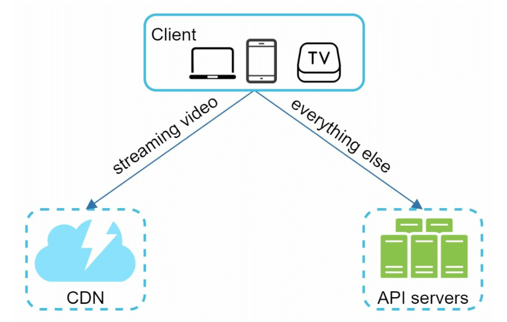

1. **Client:** Devices like smartphones, computers, and TVs.
2. **CDN (Content Delivery Network):** Stores and streams videos.
3. **API Servers:** Handles all user interactions except video streaming (e.g., uploads, metadata updates).
4. **Metadata Database:** Stores video metadata (e.g., title, description, size).
5. **Original Storage:** Blob storage for uploaded videos.
6. **Transcoding Servers:** Convert videos into multiple resolutions and formats.
7. **Transcoded Storage:** Blob storage for transcoded videos.

---

### Core Workflows
#### 1. Video Uploading Flow
- **Parallel Processes:**
  1. Upload video to original storage.
  2. Update video metadata in the database.

- **Video Upload (Steps):**

    

        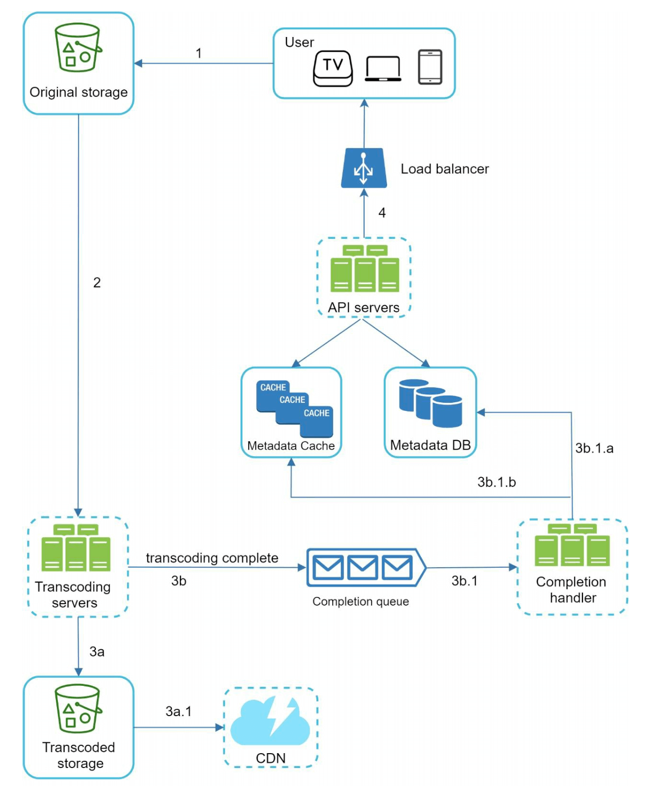
    

    - [1] Videos are uploaded to blob storage. 
    - [2] Transcoding servers convert videos to multiple formats.
    - [3] One trasncoding is complete, following two steps are exectued in parallel.
        - [3a] Transcoded videos are sent to transcoded storage.
        - [3b] Transcoding completion events are queued in the completion queue. 
    - [3a.1] Videos are distributed to the CDN. 
    - [3b.1] Completion handlers update metadata and inform users. 

    **The structural point in this flow is that the video bytes never touch the API servers.** The client uploads directly to blob storage; the API tier only handles metadata and coordination. If 150 TB/day flowed through the API servers, they would need to be sized for petabyte-scale throughput to perform what is essentially bookkeeping. The pre-signed URL mechanism further down is what makes this safe — it lets an untrusted client write to your storage bucket, once, to a specific key, for a limited time.

    **And the completion queue is what makes the pipeline durable.** Transcoding a 300 MB video takes minutes to hours of compute across many tasks. Nothing in that chain can be synchronous with the user's upload request, and anything that long-running will be interrupted — so progress is recorded as events, and failed stages are retried from persisted intermediate data rather than from the beginning.

- **Metadata Upload (Steps):**

    

        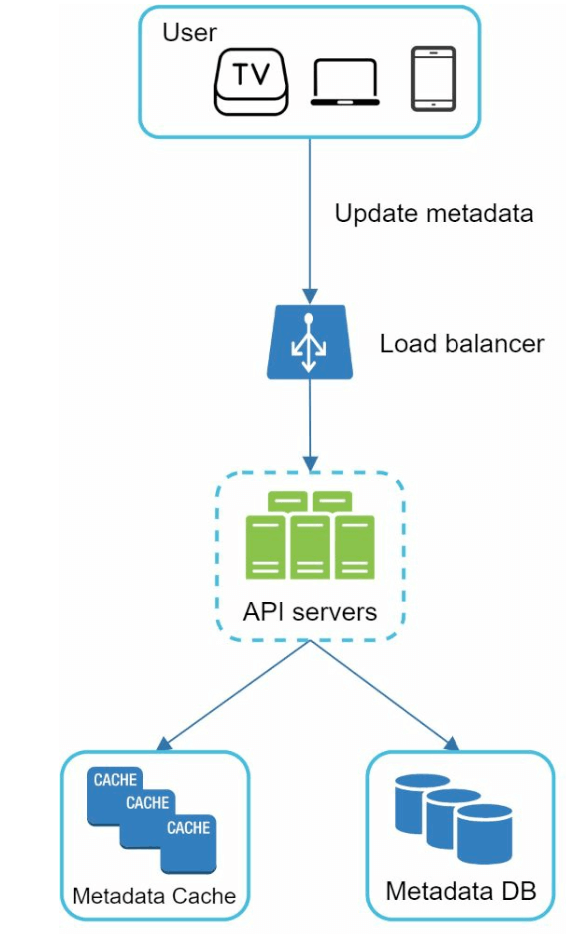
    

    - The client in parallel sends a request to update the video metadata 
    - The request contains video metadata, including file name, size, format, etc.
    
       

#### 2. Video Streaming Flow

  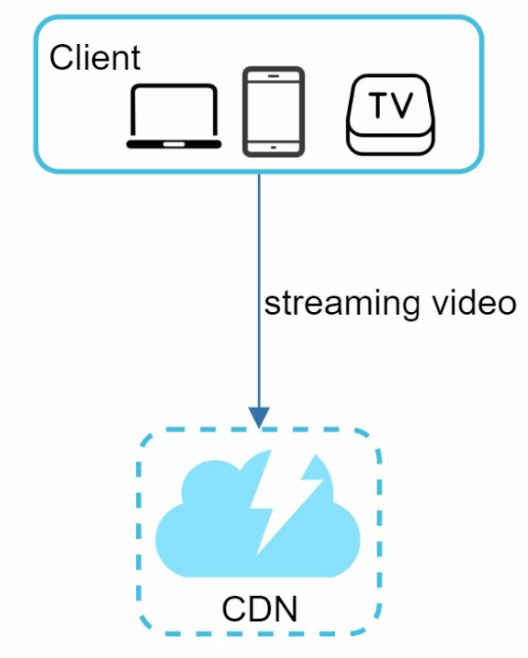

- Videos are streamed directly from the CDN using edge servers to minimize latency.
- Some of te popular streaming protocols are MPEG_DASH, Apple HLS, Adobe HDS.
-  *Different streaming protocols support different video encodings and playback players.*

**What these protocols actually do, and why it matters for the rest of the design.** HLS and DASH are both **adaptive bitrate** (ABR) protocols, and they work the same way:

1. The video is cut into short **segments** (typically 2–10 seconds), encoded at several quality levels.
2. A **manifest** file lists every available rendition and its segments.
3. The *client* measures its own throughput and chooses which rendition to fetch — **for each segment independently**.

Three consequences worth stating explicitly:

- **"Ability to change video quality" is not a server feature.** The server offers a menu; the player decides. That is why quality can change mid-playback without re-requesting the video.
- **This is why transcoding produces a ladder, not a file.** The rendition ladder exists to give the player options, which is the direct cause of the 2–5× storage multiplication.
- **Everything is plain HTTP GETs of small files.** No streaming protocol state lives on the server, which is exactly why a CDN — a machine that caches small files over HTTP — can serve video at all. Had video required stateful connections, the CDN strategy would be unavailable and the cost problem unsolvable.

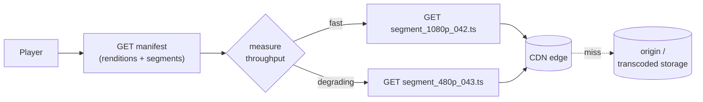

---

---

## Step 3: Design Deep Dive

### Video Transcoding
#### Importance
1. Raw video consumes large amounts of storage space. It Reduces storage space.
2. Ensures compatibility across devices and browsers.
3. Adapts video quality to network conditions.

#### Components
- **Container:** Encapsulates video, audio, and metadata (e.g., MP4, AVI).
- **Codecs:** Compression and Decompression algorithms (e.g., H.264, VP9).

#### Directed Acyclic Graph (DAG) Model

    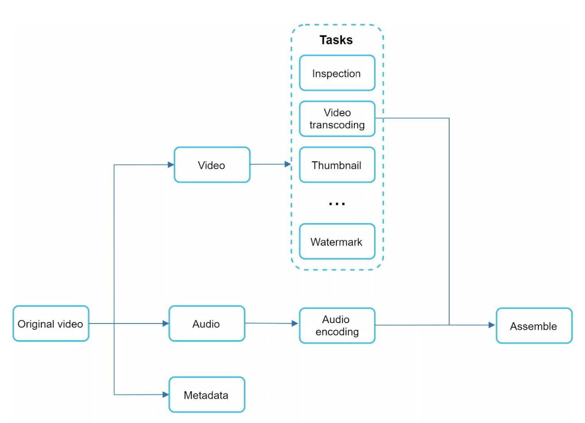

- Transcoding a video is computationally expensive and time-consuming.
- DAG Model defines tasks like encoding, thumbnail generation, and watermarking.
- Allows high parallelism in video processing.

**Why a DAG rather than a pipeline.** Transcoding is not one job but a set of jobs with a partial order: audio extraction and video encoding are independent of each other; thumbnail generation depends on having decoded video but not on the finished encode; a watermark must be applied before encoding, not after. A DAG expresses exactly those dependencies and nothing more, which lets the scheduler run everything that is currently unblocked in parallel.

It also makes the work **configurable per customer**: the same engine produces a different graph for a video that needs a watermark and six renditions than for one that needs two renditions and no thumbnail. The chapter's note that the DAG comes from a configuration file written by client programmers is the point — the pipeline is a product surface, not a fixed sequence.

- The original video is split into video, audio, and metadata. 
    - Video encodings: Videos are converted to support different resolutions, codec, bitrates.
    - Thumbnail: It can either be uploaded by a user or automatically generated bythe system.
    - Watermark: Image overlay on top of your video contains identifying information about the video.

---

### Video Transcoding Architecture

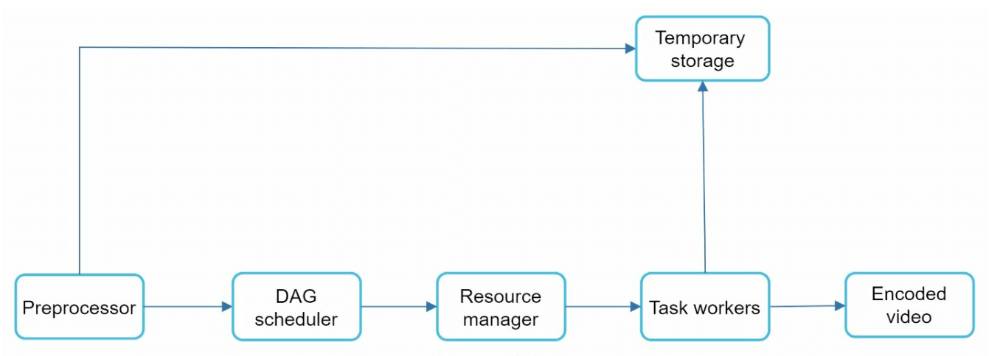

1. **Preprocessor:** Splits videos into smaller chunks (GOP alignment). It has 4 responsibilities.

    

        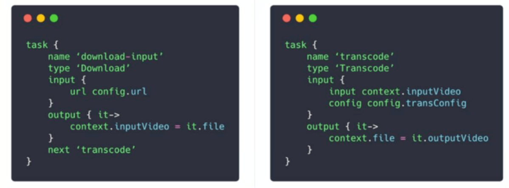
    

    - Video splitting: Video stream is split or further split into smaller Group of Pictures (GOP) alignment.
    - It split videos by GOP alignment for old clients.

    **GOP alignment is the mechanism that makes parallel transcoding possible, and it is worth understanding rather than memorising.** Compressed video does not store every frame in full. A **Group of Pictures** begins with an **I-frame** (a complete, independently decodable image) and is followed by **P- and B-frames**, which encode only the *differences* from other frames.

    That means a GOP boundary is the only place a video can be cut. Split in the middle of a GOP and the resulting fragment contains difference-frames whose reference image is in the other fragment — it cannot be decoded at all. Split on GOP boundaries and every chunk is self-contained.

    Once chunks are independent, transcoding becomes **embarrassingly parallel**: a two-hour video is hundreds of chunks that can be encoded simultaneously on hundreds of workers and concatenated afterwards. A one-hour video need not take an hour to process. This is the entire reason the preprocessor exists, and the same segment boundaries are later reused as the ABR segments the player fetches.
    - It generates DAG based on configuration files client programmers write. 
    - It stores GOPs and metadata in temporary storage in case the encoding fails, the system could use persisted data for retry operations.

2. **DAG Scheduler:** Organizes tasks into sequential or parallel stages.
    

        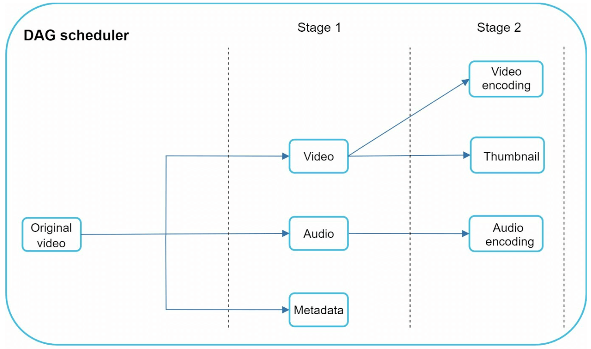
    

    - It splits a DAG graph into stages of tasks and puts them in the task queue in the resource manager. 
    - Stage 1: video, audio, and metadata.
    - The video file is further split into two tasks in stage 2: video encoding and thumbnail. 

3. **Resource Manager:** Responsible for managing the efficiency of resource allocation.It
contains 3 queues and a task scheduler.
    

        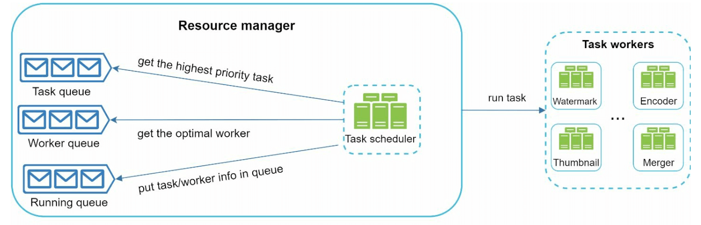
    

    - Task queue: priority queue that contains tasks to be executed.
    - Worker queue: priority queue that contains worker utilization info.
    - Running queue: contains  currently running tasks and workers running the tasks.
    - Task scheduler: picks the optimal task/worker, and instructs the chosen task worker to execute the job.

4. **Task Workers:** Perform transcoding and other operations.
    

        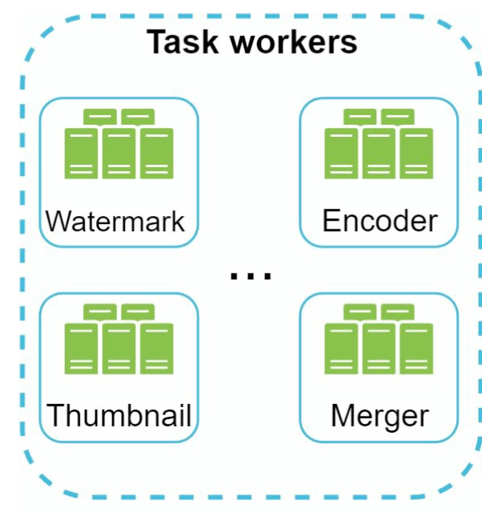
   

    - Different task workers may run different tasks 

5. **Temporary Storage:** Stores intermediate data for retries.
    - The choice of storage system depends on factors like data type, data size, access frequency, data life span, etc. 
6. **Output:** Transcoded videos ready for distribution.

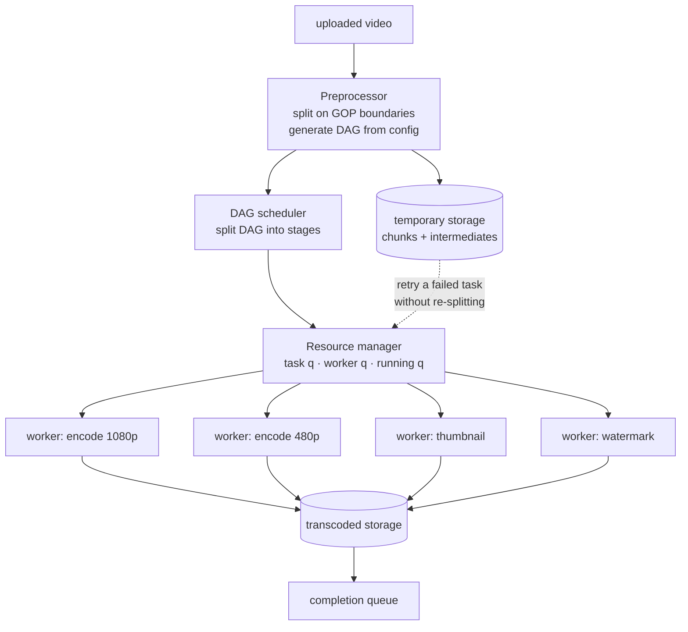

**Why temporary storage is not an implementation detail.** It is what makes retries cheap. A task that fails can be re-run from its persisted input chunk; without it, any failure in a hundreds-of-tasks graph would mean re-splitting and re-encoding the whole video. The cost is that intermediates are large and must be garbage-collected on a short lifetime — which is exactly the "data life span" consideration the bullet alludes to.

**Tasks must be idempotent.** Retries and duplicate dispatches are normal in a system with this many moving parts, so encoding chunk 42 twice must produce the same output in the same place rather than two half-written files. Writing to a content-addressed or deterministic key makes this automatic.

> **Interview angle:** the transcoding section is where depth shows. Being able to explain *why* GOP boundaries determine the split points — I-frames are self-contained, P/B frames are not — and that this is what makes transcoding parallel, is worth more than reciting the four components of the architecture.

---

## System Optimizations

### Speed Optimizations
1. **Parallel Video Uploads:** Split videos into smaller chunks for faster, resumable uploads.

    

    **Resumability is the real benefit; parallelism is secondary.** A 1 GB upload over a mobile connection will be interrupted — by a tunnel, a network handoff, a backgrounded app. As a single request, any failure loses all progress and the user retries from zero, which on a flaky connection may never succeed. Split into chunks, each acknowledged independently, a resumed upload only re-sends the chunks that did not land.

    This requires an **upload session**: a server-side record of which chunks of which video have arrived, created when the upload begins and expiring after some period. The session ID, not the file, is what the client resumes against.

2. **Distributed Upload Centers:** Use CDNs as upload hubs close to users.

    Upload throughput is limited by round-trip time as much as by bandwidth, so terminating the connection at a nearby edge rather than a distant region materially speeds up large uploads. The edge then moves the bytes to central storage over well-provisioned backbone links instead of the user's last mile.

3. **Parallel Processing:** Decouple modules using message queues for high parallelism.

    The queues also decouple *rate*. Uploads are bursty and follow daily cycles; transcoding capacity is expensive and sized for sustained throughput. A queue lets uploads be accepted instantly during a peak while transcoding drains over the following hours — the user sees "processing", which is an acceptable experience, instead of a rejected upload, which is not. The visible cost is **transcoding lag**, and queue depth is the metric that predicts it.

    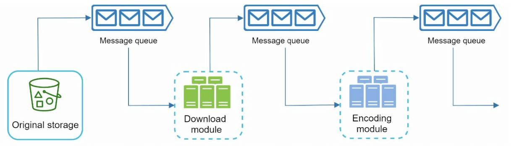
    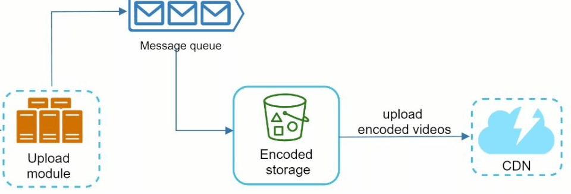

### Safety Optimizations
1. **Pre-Signed URLs:** Restrict video uploads to authorized users.

    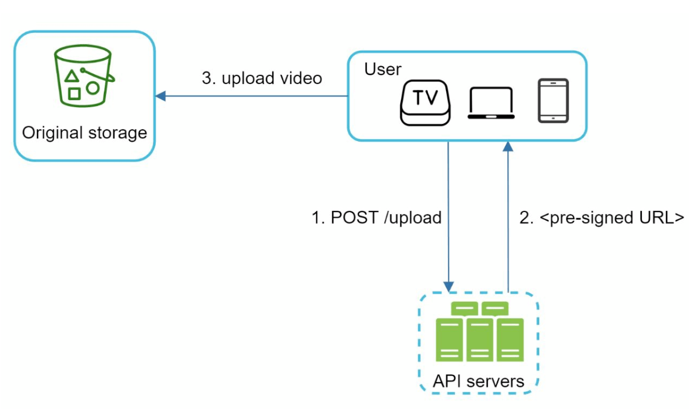

    A pre-signed URL is a storage-layer capability: the API server, which *is* authenticated, asks blob storage for a time-limited token authorising a write to one specific key. The client then uploads directly to storage with no credentials of its own. This is what allows the "bytes never touch the API tier" property above to coexist with access control — without it you would either proxy 150 TB/day through your own servers or hand out bucket credentials.

    The limits are what make it safe and must be set deliberately: a **short expiry**, a **single key**, a **content-length cap**, and ideally a content-type restriction. A pre-signed URL with a generous expiry and no size limit is an open write endpoint to your storage bill.

2. **Protect Videos:**
   - **DRM Systems** (e.g., Apple FairPlay, Google Widevine).
   - **AES Encryption.**
   - **Watermarking.**

### Cost-Saving Optimizations
1. Serve only popular videos via CDN; less popular ones from high-capacity servers.
2. Encode on-demand for rarely accessed videos.
3. Regionalize video distribution based on popularity.
4. Build custom CDNs and partner with ISPs to reduce bandwidth costs.

All four are the same idea applied in different places: **match the cost of the infrastructure to the value of the content.** Views are distributed as a steep power law, so a uniform policy is necessarily wrong — it either overspends on the long tail or underserves the head.

| Tier | Share of content | Share of views | Where it lives | Rendition strategy |
|---|---|---|---|---|
| Hot | Tiny | Most watch time | CDN edge, widely replicated | Full ladder, pre-encoded |
| Warm | Moderate | Meaningful | Regional origin, CDN on demand | Common renditions pre-encoded |
| Cold | The vast majority | Negligible | Cheap object storage | Transcode on request, cache briefly |

Regionalisation is the same logic in space rather than popularity: a video watched almost exclusively in one country does not need to occupy edge capacity on other continents.

---

## Error Handling
### Recoverable Errors
- Retry failed uploads, transcoding, or resource allocation tasks.

### Non-Recoverable Errors
- Stop malformed video processing and return error codes.

The distinction matters most inside the transcoding DAG, where a single video is hundreds of tasks. A worker crash, a timeout, or a transient storage error should re-run one task from temporary storage. A corrupt source file, an unsupported codec, or a video that crashes the encoder is **permanent** — retrying it consumes a worker indefinitely and, in a shared pool, degrades everyone's transcoding latency. Bounded attempts, then fail the video and tell the uploader, is the correct behaviour; this is the same classification problem as [Chapter 10](../10.%20Notification%20System/#retries-the-part-that-is-usually-wrong).

---

### Gotchas & failure modes

- **Egress cost dominates everything.** At ~$150,000/day, a 10% improvement in bytes served is worth more than most engineering projects. Popularity tiering, ABR efficiency, and codec choice are financial decisions.
- **A newly uploaded video is not in the CDN yet.** The first viewers of every video are origin misses, and that is exactly when a video is most likely to go viral. Without **origin shielding** (a mid-tier cache absorbing edge misses), a popular new release produces a stampede of identical origin requests — the cache stampede from [Chapter 1 §6](../01.%20Scaling/#section-6-caching), at petabyte scale.
- **Transcoding backlogs silently delay publication.** When upload rate exceeds transcoding capacity, nothing errors — videos just stay in "processing" for hours. Queue depth and oldest-pending-task age are the alarms; the user-visible symptom appears long after the cause.
- **The rendition ladder multiplies storage 2–5×.** Every added resolution or codec is a permanent, recurring cost across the whole library. Adding a codec is cheap to decide and expensive forever.
- **Long videos break assumptions everywhere.** A ten-hour upload exceeds request timeouts, session expiries, worker lifetimes, and memory limits chosen with a five-minute video in mind.
- **A poison video can consume the worker pool.** A file that reliably crashes the encoder will be retried forever unless attempts are bounded, and in a shared pool it degrades transcoding for every other customer.
- **Chunked uploads need session expiry and garbage collection.** Abandoned uploads leave orphaned chunks that nobody will ever complete and nobody is billing for deliberately.
- **Pre-signed URLs are write capabilities.** Long expiries, missing size caps, or reusable keys turn them into an open upload endpoint. Scope them to one key, one size, one short window.
- **Deleting a video does not delete it from the CDN.** Copies persist at edges until TTLs expire or an invalidation propagates, and invalidation is slow and only partially reliable. For takedowns driven by law or safety, that gap is the problem — which is why DRM key revocation is sometimes the faster lever than purging bytes.
- **Client-side ABR can choose badly.** A player that over-estimates throughput requests a rendition it cannot sustain, then rebuffers; one that under-estimates serves needlessly poor quality. The quality of the viewing experience depends on client logic the server cannot control.
- **Metadata and blobs scale differently and must be separated.** Titles, descriptions and view counts are small, queryable, frequently updated rows; video files are enormous and immutable. Putting them in one store makes both worse.
- **Moderation and copyright matching are pipelines, not checks.** Fingerprint-matching every upload against a reference library is comparable in cost to transcoding it, and it sits between upload and publication — so its latency is the user's publication latency.
- **Live streaming is a different system.** It cannot batch-transcode, cannot buffer for minutes, and has no complete file to split. Do not assume this design extends to it.
- **Thumbnails are small, numerous and hot.** They are requested far more often than videos — every search result and recommendation shows one — so they are a high-QPS small-object workload with very different caching needs from the video itself.

---

## The design, as problem and technique

| Goal / problem | Technique |
|---|---|
| $55 M/year of bandwidth | Popularity tiering, regional distribution, custom CDN and ISP peering |
| Rarely watched videos not worth pre-encoding | Transcode on demand, cache the result briefly |
| Adapting to the viewer's network | ABR (HLS/DASH): segment ladder plus manifest, client chooses per segment |
| Video bytes overwhelming the API tier | Direct-to-storage upload via pre-signed URLs |
| Uploads failing on mobile networks | Chunked, resumable upload against a server-side upload session |
| Slow uploads over long distances | Terminate at a nearby edge, move to origin over the backbone |
| Transcoding being slow and expensive | Split on GOP boundaries into independent chunks, encode in parallel |
| Expressing per-video processing needs | Configurable DAG of tasks (encode, thumbnail, watermark) |
| Scheduling hundreds of tasks across workers | Resource manager with task, worker and running queues |
| Retrying one failed task cheaply | Persist chunks and intermediates in temporary storage; idempotent tasks |
| Upload bursts exceeding transcoding capacity | Message queues absorb the burst; "processing" state for the user |
| Stampede on a newly viral video | Origin shielding / tiered CDN caching |
| Unauthorised uploads | Pre-signed URLs scoped to one key, size and short expiry |
| Protecting content | DRM (FairPlay, Widevine), AES encryption, watermarking |
| Corrupt or malicious source files | Classify as non-recoverable, bound attempts, fail the video |

## Self-check
1. Compare one day's CDN egress cost with the cost of storing one day's uploads for a month. What does the ratio imply about where engineering effort should go?
2. Why does one uploaded video occupy several times its own size in storage?
3. Who decides which video quality is played, and what does that tell you about where ABR logic lives?
4. Why can a CDN serve video at all, given that CDNs cache small static files?
5. Why must video be split on GOP boundaries, and what does that enable?
6. A one-hour video finishes transcoding in four minutes. Explain how.
7. What does temporary storage buy you in the transcoding pipeline, and what does it cost?
8. Why do video bytes bypass the API servers, and what makes that safe?
9. A user's 1 GB upload fails at 80%. What determines whether they have to start again?
10. A video goes viral an hour after upload. Which cache layer is cold, and what prevents a stampede on the origin?
11. Upload volume exceeds transcoding capacity for six hours. What do users see, and which metric would have warned you?
12. A video must be removed for legal reasons. Why is deleting it from storage not sufficient?
13. Which parts of this design do *not* transfer to live streaming?

## Glossary

| Term | Meaning |
|---|---|
| **Transcoding** | Re-encoding a source video into other formats, resolutions and bitrates |
| **Container / codec** | The file format wrapping streams (MP4) vs the compression algorithm (H.264, VP9) |
| **GOP (Group of Pictures)** | A self-contained run of frames beginning with an I-frame; the only legal split point |
| **I-frame / P-frame / B-frame** | A complete image vs frames encoded as differences from other frames |
| **Rendition ladder** | The set of quality levels produced for one video |
| **ABR (adaptive bitrate)** | Client-driven per-segment quality selection, as in HLS and DASH |
| **Manifest** | The playlist describing available renditions and segments |
| **DAG** | The dependency graph of transcoding tasks for one video |
| **Preprocessor** | Splits the video on GOP boundaries and builds the DAG from configuration |
| **Resource manager** | Matches ready tasks to available workers via task/worker/running queues |
| **Temporary storage** | Persisted chunks and intermediates enabling per-task retry |
| **Pre-signed URL** | A time- and key-scoped storage credential letting a client upload directly |
| **Upload session** | Server-side record of which chunks have arrived, enabling resumable uploads |
| **Origin shielding** | A mid-tier cache absorbing edge misses so the origin sees one request, not thousands |
| **Popularity tiering** | Matching storage and delivery cost to a video's view volume |
| **DRM** | Encryption plus licence-based key delivery (FairPlay, Widevine) controlling playback |

## Where to go next
- [Chapter 1 §7 – Content Delivery Network](../01.%20Scaling/#section-7-content-delivery-network-cdn) — the push/pull and invalidation mechanics this chapter depends on entirely.
- [Chapter 24 – S3-like Object Storage](../24.%20S3-like%20Object%20Storage/) — what the blob storage underneath this design actually is.
- [Chapter 19 – Distributed Message Queue](../19.%20Distributed%20Message%20Queue/) — the queues decoupling upload rate from transcoding capacity.
- [Chapter 15 – Design Google Drive](../15.%20Google%20Drive/) — the same chunked-upload and metadata/blob-split problems, with synchronisation instead of transcoding.
- [Netflix: high quality video encoding at scale](https://netflixtechblog.com/high-quality-video-encoding-at-scale-d159db052746) and [per-shot encoding](https://netflixtechblog.com/optimized-shot-based-encodes-now-streaming-4b9464204830) — the rendition-ladder problem taken much further.

