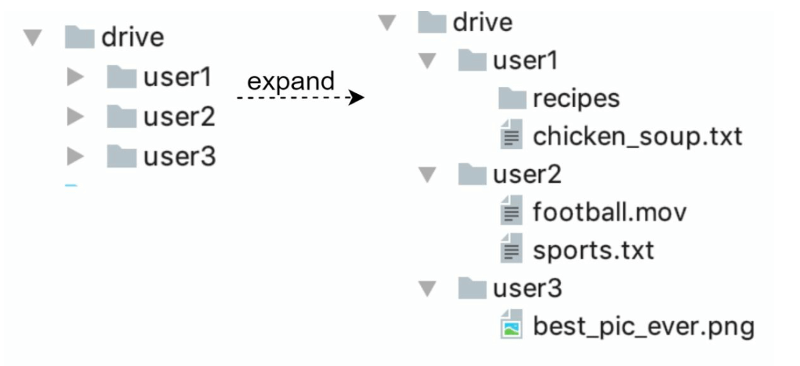
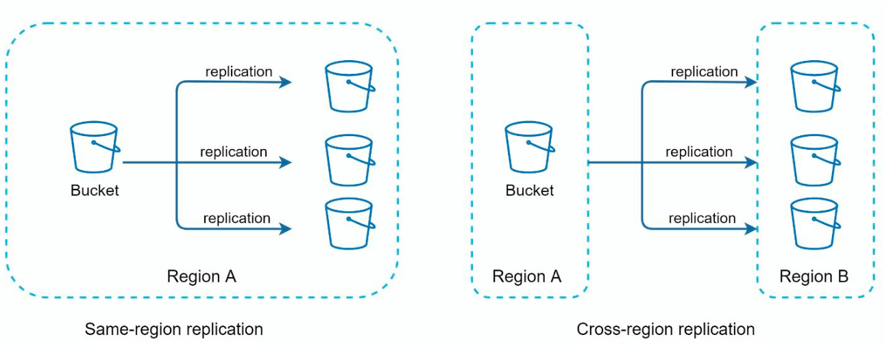
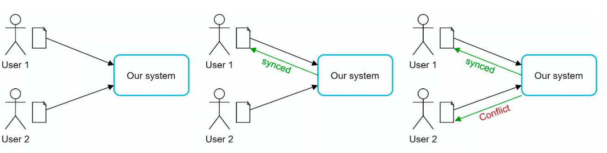
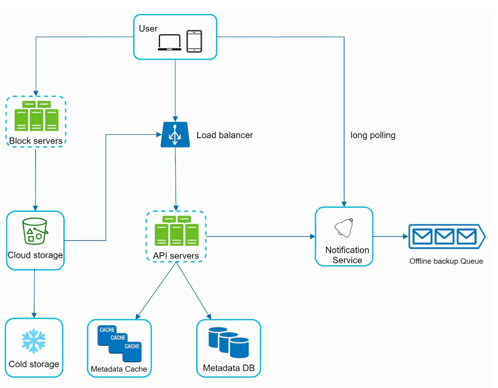
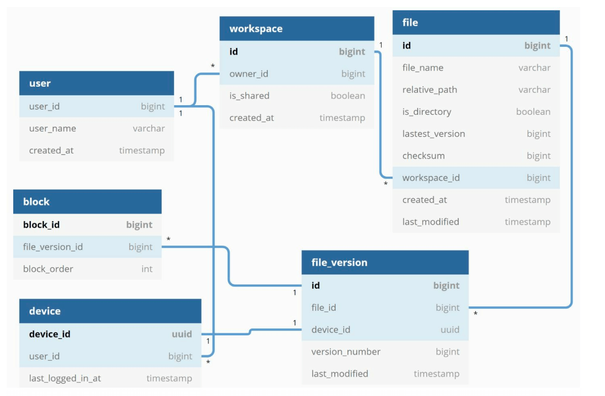
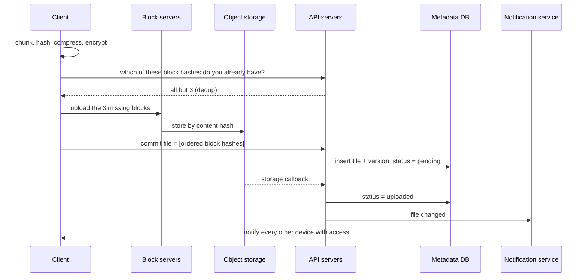
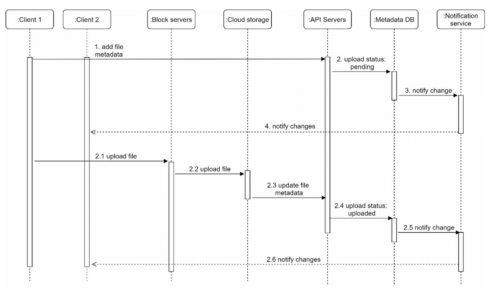
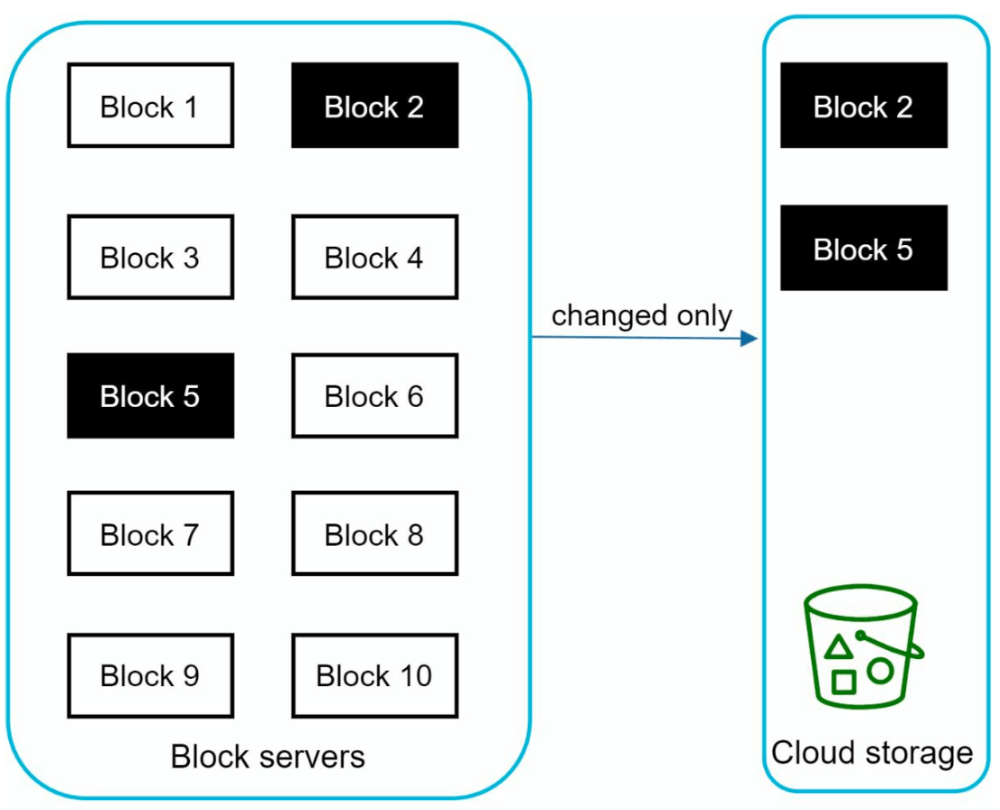
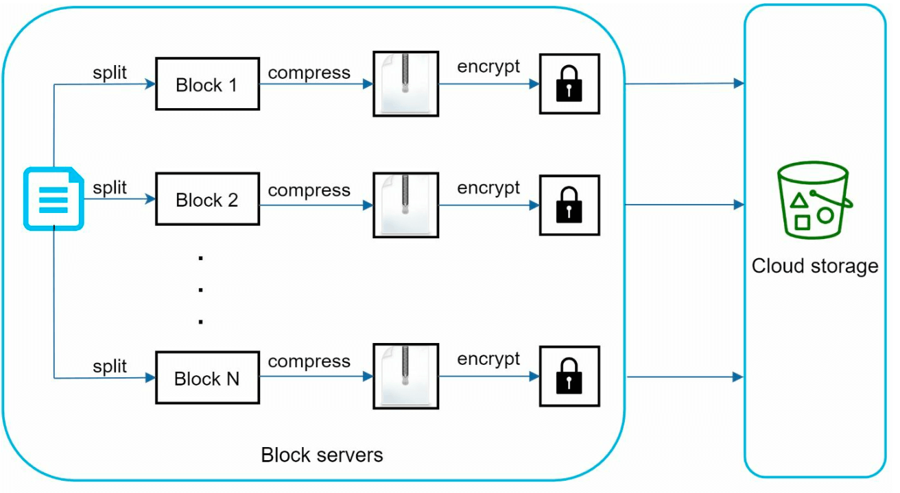
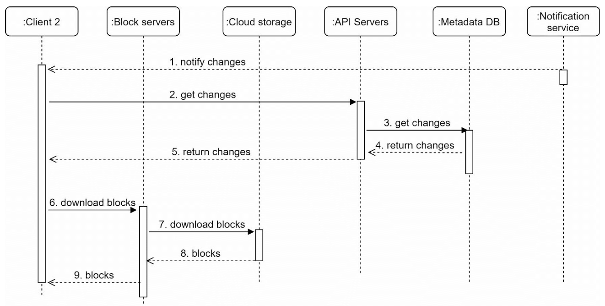

# Chapter 15: Design Google Drive

## Introduction
Google Drive is a cloud-based file storage and synchronization service that allows users to store, access, and share files from various devices. This chapter discusses designing a scalable system with the following features:
- **File Upload and Download**
- **File Sync Across Devices**
- **File Sharing**
- **File Revision History**
- **Notifications for Edits, Deletes, and Shares**

**The one-sentence version:** this looks like a storage problem and is actually a **synchronization** problem. Storing the bytes is a solved exercise — put them in object storage ([Chapter 24](../24.%20S3-like%20Object%20Storage/)) — but keeping many devices' views of a mutable file tree agreeing with each other, over networks that drop, while transferring as few bytes as possible, is not.

Nearly every design decision here follows from one choice: **split files into content-addressed blocks.** That single decision is what makes delta sync, deduplication, resumable upload and parallel transfer possible, and it is also the source of most of the chapter's subtleties.

---

## Step 1: Understanding the Problem

### Key Requirements
#### Functional Requirements:
- Upload and download files.
- Sync files across multiple devices.
- Maintain file revisions.
- Enable file sharing with permissions.
- Send notifications on file edits, deletions, and shares.

#### Non-Functional Requirements:
- **Reliability:** Data loss is unacceptable.
- **Fast Sync Speed:** Avoid user impatience with delayed syncing.
- **Bandwidth Efficiency:** Minimize unnecessary data usage.
- **Scalability:** Handle 10 million daily active users (DAU).
- **High Availability:** Operate seamlessly during server failures or network issues.

### Constraints and Assumptions
- Users get **10 GB free space**.
- Maximum file size: **10 GB**.
- Average file upload size: **500 KB**.
- Upload frequency: **2 files per day per user**.
- Total storage required: **500 PB**.

### What is actually under pressure

| Quantity | Derivation | Result |
|---|---|---|
| Uploads/day | 10 M × 2 files | 20 M (**~232 uploads/sec**) |
| Bytes uploaded/day | 20 M × 500 KB | **~10 TB/day** |
| Total stored | Given | **500 PB** |
| Long-lived client connections | 10 M DAU × ~2 devices | **~20 M sync connections** |

232 uploads/sec is not a hard problem. 500 PB is a procurement problem, not a design problem — it is what object storage is for. **The interesting number is the last row.**

Every connected device must learn about every change to every file it can see, promptly, or the product's core promise fails. That means tens of millions of long-lived connections whose only job is to wait for a change that usually never comes — the same stateful-connection problem as [Chapter 12](../12.%20Chat%20System/), arriving in a system nobody would describe as a messaging system. The notification service, not the storage tier, is where this design's scaling difficulty lives.

**Bandwidth efficiency is also a listed requirement, which is unusual.** It is there because the naive implementation is catastrophically wasteful: changing one character in a 10 MB document and re-uploading the whole file, on every device, on every keystroke-triggered save. Delta sync exists to turn that 10 MB into a few kilobytes.

> **Interview angle:** say early that storage is the easy part and sync is the hard part, then count the connections rather than the uploads. It redirects the conversation to notification, delta sync and conflict resolution, which is where the substance is.

---

## Step 2: High-Level Design
### Single-Server Setup
A basic setup includes:
1. **Web Server:** Handles uploads and downloads.
2. **Metadata Database:**  to keep track of metadata like user data, login info, files info/
3. **Storage Directory:** Holds files organized by namespaces.


<p align="left">
    
</p>

- A web server and a directory called drive/ is set up as the root directory to store uploaded files. 
- Under drive/ directory, there is a list of directories called namespaces. 
- Each namespace contains all the uploaded files for that user. 
- Each file or folder can be uniquely identified by joining the namespace and the relative path.


This design serves as a starting point but is inadequate for scaling.

#### APIs
1. **Upload a file to Google Drive:** Two types of uploads are supported
    - Simple upload: Used when file size is small.
    - Resumable upload: 
        - Endpoint: https://api.example.com/files/upload?uploadType=resumable
        - Send the initial request to retrieve the resumable URL.
        - Upload the data and monitor upload state
        - If upload is disturbed, resume the upload.
2. **Download a file from Google Drive:** To download a file
    -  Endpoint: https://api.example.com/files/download
3. **Get file revisions:**
    - Endpoint: https://api.example.com/files/list_revisions

### Moving to Distributed Systems

#### Improvements:
1. **Sharding:** Split storage across servers based on `user_id`.
2. **Amazon S3:** Use S3 for scalable and redundant file storage with cross-region replication.

    
     
3. **Load Balancer:** Distribute traffic across multiple web servers.
4. **Metadata Database Replication:** Ensure availability through database sharding and replication.


#### Sync Conflicts:
For a large storage system like Google Drive, sync conflicts happen from time to time.
When two users modify the same file or folder at the same time, a conflict happens.

<p align="left">

</p>

- In the example user 1 and user 2 tries to update the same file at the same time, but user 1’s file is processed by our system first.
- User 1’s update operation goes through, but, user 2 gets a sync conflict. 
- The system presents both copies of the same file: user 2’s local copy and the latest version from the server.
- User 2 has the option to merge both files or override one version with the other.

**Why the system does not resolve the conflict itself.** A merge requires understanding the file's internal structure, and the storage layer sees an opaque sequence of blocks. It cannot merge a spreadsheet, and attempting to merge a binary file would corrupt it. So the only safe policies are *first write wins, preserve the loser* — which is what this design does — or *refuse the second write*, which loses work.

This is worth contrasting with a collaborative editor, because the distinction is often blurred:

| | File sync (this chapter) | Collaborative editor (Google Docs) |
|---|---|---|
| Unit of change | Whole file, as blocks | Individual operations on a known document model |
| Server understands content? | No — opaque bytes | Yes — it is a structured document |
| Concurrent edits | Conflict; both copies kept | **Merged automatically** via OT or CRDTs |
| Offline edits | Conflict on reconnect | Replayed and merged |

They are different products with different data models, not two quality levels of the same feature. "Use CRDTs" is not an available answer to the sync-conflict problem here, because there is no document model to apply them to.

### Improved design
<p align="left">

</p>

1. **User Interaction:**: Users access the application via browser or mobile app.

2. **Block Servers:**
   - Files are split into **4 MB blocks** (maximum size) and assigned unique hash values.
   - Blocks are stored independently in cloud storage (e.g., Amazon S3).
   - File reconstruction involves joining blocks in a specific order.

   **Blocking the file is the pivotal design decision, and it buys four things at once:**

   | Benefit | Mechanism |
   |---|---|
   | **Delta sync** | Only changed blocks are transferred; an edit costs one block, not one file |
   | **Deduplication** | Identical blocks hash identically, so they are stored once |
   | **Parallel transfer** | Blocks are independent, so they upload and download concurrently |
   | **Cheap retries** | A failed block is re-sent alone; a 10 GB upload never restarts from zero |

   Blocks are **content-addressed** — the hash of the content *is* the identifier. That makes them immutable (changing content produces a different block, never a modified one), trivially verifiable (re-hash to detect corruption), and safely shareable between files and users. A 10 GB file is ~2,500 such blocks.

   **The block size is a real trade-off, not a constant:**

   | | Smaller blocks (e.g. 256 KB) | Larger blocks (e.g. 4 MB) |
   |---|---|---|
   | Delta sync granularity | Fine — a small edit moves little data | Coarse — a 1-byte edit moves 4 MB |
   | Dedup hit rate | Higher — more chance of matching | Lower |
   | Metadata rows per file | **Many** — 10 GB = 40,000 rows | Few — 10 GB = 2,500 rows |
   | Requests per transfer | Many small requests, more overhead | Fewer, better throughput |

   4 MB is a compromise weighted toward keeping the metadata database small, which matters because metadata, not block storage, is the component that is hard to scale.

3. **Cloud Storage:** Blocks are stored in cloud storage for scalability and redundancy.

4. **Cold Storage:** Inactive files are moved to cold storage to reduce costs.

5. **Load Balancer:** Distributes requests evenly among API servers to ensure efficient operation.

6. **API Servers:**
   - Handle user authentication, profile management, and file metadata updates.
   - Manage all non-uploading workflows.

7. **Metadata Database and Cache:**
   - Stores metadata for users, files, blocks, and versions.
   - Frequently accessed metadata is cached for faster retrieval.

8. **Notification Service:**
   - A **publisher/subscriber system** that notifies clients about file changes (add, edit, delete).
   - Ensures clients can pull the latest updates.

9. **Offline Backup Queue:** Temporarily stores file change information for offline clients to sync when back online.

---

## Step 3: Design Deep Dive

### Metadata Database
A highly simplified is shown below version as it only includes the most important tables and fields.
#### Schema Design:
- **User Table:** Stores user profiles and preferences.
- **File Table:** Maintains file metadata (e.g., size, name, path).
- **Block Table:** Tracks file blocks for reconstructing files.
- **File Version Table:** Stores file revision history.

**The metadata database is the source of truth, and the blocks are just content.** A file *is* its ordered list of block hashes; the bytes in object storage are interchangeable copies of content that the metadata points at. This inversion explains several things that otherwise look arbitrary:

- **Upload order is blocks first, metadata last.** The metadata commit is what makes a file exist. Reversing it would briefly publish a file whose content cannot be fetched.
- **The `pending` → `uploaded` status is a two-phase commit** in miniature, with the storage callback as the second phase.
- **Metadata is the hard thing to scale,** because it is relational, transactional, and queried by path. Blocks scale by adding storage; metadata scales by sharding, and sharding it is awkward — see the gotchas.

<p align="left">

</p>

---

### File Upload Flow

1. **File Upload:**
   - File is split into blocks, compressed, and encrypted by the block server.
   - Blocks are uploaded to block servers and stored in S3.
2. **Metadata Upload:**
   - Client sends metadata to the API server.
   - Metadata is stored in the database with status `pending`.
3. **Completion:**
   - S3 triggers a callback to update the file status to `uploaded`.
   - Notification service informs relevant users.



**Note the first exchange.** Asking which block hashes the server already holds, before sending anything, is what makes deduplication save *bandwidth* rather than only disk. It is also the step that creates a privacy side channel, covered in the gotchas — the saving and the leak are the same mechanism.


<p align="left">

</p>


---

### File Sync
1. **Delta Sync:** Transfer only modified blocks instead of the entire file.

    <p align="left">
    
    </p>

    **The failure mode fixed-size blocks have, which the diagram hides.** Delta sync works beautifully when a change is *in place*: edit a byte in block 3, re-upload block 3. But insert or delete bytes near the *start* of a file, and every subsequent block boundary shifts by that amount. Every block hash changes. Delta sync transfers the entire file and has saved nothing.

    ```mermaid
    flowchart TD
        subgraph FX["Fixed-size blocks — insert 1 byte at the front"]
            A1["blk1 ✗"] --> A2["blk2 ✗"] --> A3["blk3 ✗"] --> A4["blk4 ✗ — all shifted, all re-uploaded"]
        end
        subgraph CD["Content-defined chunking — same insert"]
            B1["chunk1 ✗"] --> B2["chunk2 ✓"] --> B3["chunk3 ✓"] --> B4["chunk4 ✓ — boundaries re-align"]
        end
    ```

    The fix is **content-defined chunking**: choose boundaries from the data itself — advance a rolling hash (Rabin fingerprint) over the bytes and cut wherever it hits a pattern — rather than every 4 MB. Because boundaries are determined by content, an insertion shifts only the chunk containing it; the following boundaries fall in the same places as before and their chunks still match. This is the mechanism behind `rsync`, and behind real dedup-oriented storage systems.

    It is also why block *sizes* become variable, which is why the schema stores a block list per version rather than assuming an index can be computed from an offset.

2. **Compression:** Blocks are compressed using compression algorithms depending on file types. 

    Per-type compression matters because the default would waste effort: text and documents compress enormously, while JPEG, MP4 and ZIP are already compressed and attempting it again burns CPU to make the file slightly *larger*. Detect and skip.

3. **Conflict Resolution:**
   - First processed version wins.
   - Conflicting versions are saved separately for user resolution.

    "First processed" means first to commit metadata, not first to be edited — the ordering is decided by arrival at the server, so the winner is partly a function of network luck. That is acceptable only because the loser's work is preserved rather than discarded, which makes "preserve the loser" the load-bearing half of the policy.

<p align="left">

</p>

---

### File Download Flow
Download flow is triggered when a file is added or edited elsewhere. There are two ways a client can know:
- If client A is online while a file is changed by another client, notification service will inform client A.
- If client A is offline while a file is changed by another client, data will be saved to the cache. When the offline client is online again, it pulls the latest changes.

Once a client knows a file is changed, it first requests metadata via API servers, then
downloads blocks to construct the file.

1. **Trigger:** Notification service informs the client of file updates.
2. **Metadata Fetch:** Client retrieves updated metadata via API.
3. **Block Download:** Client downloads updated blocks from block servers and reconstructs the file.


<p align="left">

</p>


---

### Notification Service
1. **Purpose:** Keeps clients updated about file changes.
2. **Mechanism:** Implements **long polling** for asynchronous notifications.
3. **Example:** When a file is added, edited, or deleted, notifications are pushed to all relevant clients.

**Why long polling here, when [Chapter 12](../12.%20Chat%20System/#choosing-the-receive-channel) chose WebSocket for chat.** The traffic profiles are opposite:

| | Chat | File sync |
|---|---|---|
| Direction of traffic | Both ways, continuously | Server → client, rarely |
| Events per connection per hour | Hundreds | Often zero |
| Needs to send upstream on the same channel | Yes | No — uploads are separate HTTP requests |
| Best fit | WebSocket | **Long polling** (or SSE) |

A file-sync client has nothing to say over the notification channel; it only needs to be told "something changed, come and ask what". Long polling delivers that with ordinary HTTP, no protocol upgrade, no proxy incompatibility, and a natural reconnection point after every event. The notification itself should be a **cheap signal rather than the data** — "your tree changed, fetch metadata since cursor X" — which keeps the notification service stateless about content and lets the client coalesce a burst of changes into one metadata fetch.


---

### Storage Optimization
1. **De-duplication:** Remove duplicate blocks at the account level using hash-based comparisons.
2. **Versioning Strategy:**
   - Limit the number of saved revisions.
   - Prioritize recent versions for frequently edited files.
3. **Cold Storage:** Move rarely accessed files to cheaper storage solutions (e.g., Amazon S3 Glacier).

**"At the account level" is a deliberate restriction, and the reason is privacy.** Global deduplication — one copy of a block across all users — saves far more, because popular files are stored by millions of people. It also creates an **oracle**: upload a file you suspect someone else has, and if the server replies "I already have those blocks" the upload completes instantly. You have just confirmed the existence of that exact file somewhere in the system without having access to it. This was a real, demonstrated attack against cloud storage providers, and restricting dedup to within one account closes it at the cost of most of the savings.

The same tension governs encryption. Client-side encryption with a per-user key makes identical plaintext produce different ciphertext, so dedup stops working entirely. **Convergent encryption** — deriving the key from the content's own hash — restores dedup, and simultaneously restores the oracle, because identical plaintext again produces identical ciphertext. There is no configuration that gives you global dedup, client-side encryption, and no side channel at once; pick two.

**Versioning is unbounded growth unless it is capped.** A document saved every few minutes for a year accumulates thousands of versions, each with its own block list. Because blocks are content-addressed and shared between versions, the *bytes* mostly do not duplicate — but the metadata rows do, which is the scarcer resource. Cap by count, by age, or by thinning older versions (keep every version for a day, daily for a month, monthly thereafter).

**Deleting is harder than it looks** when blocks are shared. A block referenced by three versions of two files cannot be removed when one of them is deleted, so blocks need **reference counting** and a garbage collector, and deletion becomes "unlink, then collect later". Combined with a trash retention period, the practical consequence is that freeing space is asynchronous and quota accounting has to be a deliberate decision rather than a sum of block sizes.

---

### Failure Handling
1. **Load Balancer Failure:** Secondary load balancer becomes active.
2. **Block Server Failure:** Pending tasks are reassigned to other servers.
3. **Metadata Database Failure:**
   - Promote a slave node to master.
   - Redirect traffic to remaining replicas.
4. **Cloud Storage Failure:** Use cross-region replication to fetch unavailable files.
5. **Notification Service Failure:** Clients reconnect to alternative servers.

The fifth item carries a hazard worth naming: when a notification server dies, every one of its long-polling clients reconnects at once — the reconnection storm from [Chapter 12](../12.%20Chat%20System/#gotchas--failure-modes). With tens of millions of connections, that needs randomised backoff on the client, or recovering from one server loss will take down the next.

The reason the system survives losing the notification service at all is that **notifications are an optimisation, not the mechanism**. A client that misses them can still reconcile by asking for changes since its cursor. Keeping a periodic fallback poll means notification failure degrades sync latency rather than breaking sync.

> **Interview angle:** the two follow-ups that separate depth from recall are "a user inserts a line at the top of a 100 MB file — how much do you transfer?" (fixed blocks: all of it; content-defined chunking: almost nothing) and "why only account-level dedup?" (the existence oracle). Both are places where the obvious design is subtly wrong.

---

### Gotchas & failure modes

- **Fixed-size blocks defeat delta sync on insertion.** Inserting bytes near the start of a file shifts every later boundary, changing every hash. Content-defined chunking with a rolling hash is what makes delta sync robust to insertions, not just in-place edits.
- **Global dedup is an existence oracle.** "I already have that block" confirms someone else stored that exact file. Account-level dedup is the mitigation, and it forfeits most of the savings.
- **Client-side encryption and dedup are mutually exclusive** unless you use convergent encryption, which reinstates the oracle. There is no free configuration.
- **Sharding metadata by `user_id` breaks on sharing.** A file shared between users on different shards has no single home: permission checks, listings and change feeds now span shards, and a transaction over both is exactly what sharding was meant to avoid. Sharing is the feature that makes the metadata database genuinely hard.
- **Renaming or moving a folder is a metadata storm.** If paths are stored per file, moving a folder containing a million files rewrites a million rows. Storing parent pointers instead makes the move O(1) and makes "list everything under this path" recursive — pick which operation you want to be cheap.
- **Committing metadata before blocks publishes a file that cannot be read.** Blocks first, metadata last, with a pending status in between.
- **Shared blocks make deletion asynchronous.** Reference counting plus garbage collection, so "deleted" does not mean "space reclaimed" — and quota accounting must decide whose bytes a shared block is.
- **Versions grow without bound.** Thousands of revisions of an actively edited document multiply metadata rows even when blocks are shared. Cap or thin them.
- **Cold storage has retrieval latency and retrieval cost.** A file moved to archival storage may take minutes to hours to fetch and may be billed per retrieval. Choosing what to demote by access recency is easy; the surprise is that someone will eventually open a five-year-old file and wait.
- **Losing the notification service causes a reconnection storm.** Tens of millions of long-polling clients returning at once. Jittered backoff, and treat notifications as an accelerator over a periodic reconciliation poll.
- **"Last modified" cannot come from client clocks.** Device clocks disagree, so ordering by client timestamp will pick the wrong winner in a conflict. Order by server commit.
- **A 10 GB file is ~2,500 blocks.** Any per-block overhead — a request, a metadata row, a round trip — is multiplied by that. Upload sessions must outlive slow connections, and progress must be resumable per block.
- **Conflicts cannot be merged by the storage layer.** It sees opaque bytes. Preserving both copies is the only safe outcome; automatic merge belongs to a product with a document model.
- **Mass deletion propagates faithfully.** A user who deletes a folder by accident, or a client bug that reports local files as removed, syncs that destruction to every device. Trash with a retention window and server-side version history is what makes this recoverable — "data loss is unacceptable" includes loss the user caused.
- **Re-compressing already-compressed files wastes CPU and can grow them.** Detect type and skip.

---

## The design, as problem and technique

| Goal / problem | Technique |
|---|---|
| Transferring as few bytes as possible | Delta sync over content-addressed blocks |
| Delta sync surviving insertions | Content-defined chunking with a rolling hash |
| Storing the same content once | Block-level dedup, scoped to an account for privacy |
| Resumable 10 GB uploads | Independent blocks, acknowledged individually, with an upload session |
| Parallel transfer | Blocks are independent of each other |
| Files never visible without content | Upload blocks first, commit metadata last, `pending` → `uploaded` |
| Telling 20 M devices about changes | Long polling with a cheap "changed, fetch since cursor" signal |
| Offline devices | Offline backup queue, drained on reconnect |
| Concurrent edits to one file | First commit wins; the loser's version is preserved, not merged |
| Unbounded revision history | Cap or thin versions; blocks are shared across them |
| Cost of cold data | Tier to archival storage by access recency |
| Reclaiming space for shared blocks | Reference counting plus asynchronous garbage collection |
| Surviving notification-service loss | Periodic reconciliation poll as the fallback; jittered reconnects |
| Storage durability | Object storage with cross-region replication |

## Self-check
1. Which number in the requirements is the actual scaling challenge, and why is 232 uploads/sec not it?
2. Name the four separate benefits that follow from splitting files into blocks.
3. What does a smaller block size improve, and what does it cost?
4. A user inserts one line at the top of a 100 MB file. How much is transferred with 4 MB fixed blocks, and how much with content-defined chunking? Why?
5. Why is deduplication restricted to a single account?
6. Why can't you have global dedup *and* client-side encryption *and* no information leak?
7. Why must blocks be uploaded before the metadata is committed?
8. Why is long polling the right choice here when Chapter 12 chose WebSocket?
9. Sharding metadata by `user_id` is natural. Which feature breaks it, and how?
10. Storing a full path on every file makes listing cheap. What does it make expensive?
11. A user deletes one of three files sharing a block. Can the block be removed? What is needed?
12. Why can't a conflict be resolved by merging, and what does Google Docs have that this system does not?
13. A notification server with 2 M connections dies. What happens next, and what keeps sync working meanwhile?

## Glossary

| Term | Meaning |
|---|---|
| **Block** | A fixed- or variable-size piece of a file, identified by the hash of its content |
| **Content addressing** | Using the content's hash as its identifier, making blocks immutable and verifiable |
| **Delta sync** | Transferring only the blocks that changed |
| **Content-defined chunking** | Choosing block boundaries from the data via a rolling hash, so insertions shift only one chunk |
| **Rolling hash / Rabin fingerprint** | The hash advanced byte-by-byte to find chunk boundaries |
| **Deduplication** | Storing identical blocks once; scoped per account to avoid an existence oracle |
| **Convergent encryption** | Deriving the encryption key from the content hash, preserving dedup — and the oracle |
| **Metadata database** | The source of truth: users, files, versions, and each version's ordered block list |
| **`pending` → `uploaded`** | The two-phase commit making a file visible only once its blocks exist |
| **Notification service** | Long-polling channel telling clients that their tree changed |
| **Offline backup queue** | Buffered change notifications for devices that are not connected |
| **Sync conflict** | Concurrent commits to one file; first wins, loser preserved as a separate copy |
| **Reference counting** | Tracking how many versions point at a block, so deletion can be garbage collected |
| **Cold storage** | Cheap archival tier with higher retrieval latency and per-retrieval cost |

## Where to go next
- [Chapter 24 – S3-like Object Storage](../24.%20S3-like%20Object%20Storage/) — the block store underneath this design, including the metadata/data split at a lower level.
- [Chapter 12 – Design A Chat System](../12.%20Chat%20System/#choosing-the-receive-channel) — the persistent-connection problem and the protocol comparison this chapter reuses.
- [Chapter 14 – Design YouTube](../14.%20Youtube/) — chunked resumable uploads and pre-signed direct-to-storage transfer, solving the same upload problems.
- [Chapter 10 – Design A Notification System](../10.%20Notification%20System/) — where the "file was shared with you" notifications go.
- [Differential Synchronization](https://neil.fraser.name/writing/sync/) and [How we've scaled Dropbox](https://www.youtube.com/watch?v=PE4gwstWhmc) — the sync problem treated at length by people who shipped it.

