# Chapter 16: Proximity Service

## Introduction
A **proximity service** is designed to find nearby locations, such as restaurants, hotels, gas stations, and other businesses. This functionality is used in applications like **Google Maps** and **Yelp** to help users discover places within a defined radius.

**The one-sentence version:** a database index is **one-dimensional** — it orders rows along a single key — but proximity is **two-dimensional**, and no amount of indexing latitude and longitude separately fixes that. The entire chapter is therefore one question asked five ways: *how do you map 2D coordinates onto a 1D key such that points close in space end up close in the key?* Geohash, quadtree and S2 are three different answers.

Notice also what this chapter does **not** have to deal with: the data is small, almost entirely static, and read-only in the hot path. That is why the design converges on "put the index in memory and add replicas" rather than on sharding — and it is a useful contrast with [Chapter 17](../17.%20Nearby%20Friends/), which is the same spatial problem with a write-heavy workload and gets a completely different answer.


## Step 1: Understanding the Problem and Establishing Scope

### **Functional Requirements**
1. **Search for businesses** based on user location (latitude, longitude) and search radius.
2. **Allow business owners** to add, update, or delete businesses (not real-time).
3. **Provide detailed business information** when requested.

### **Non-Functional Requirements**
- **Low latency**: Users should get quick responses.
- **Data privacy**: Compliance with GDPR and CCPA regulations.
- **High availability**: Handle peak-hour spikes in busy locations.

### **Back-of-the-Envelope Estimation**
- **100 million daily active users**.
- **200 million businesses** in the system.
- **Search QPS Calculation**:
  - Users make **5 searches per day**.
  - **Search QPS** = (100M × 5) / 86,400 ≈ **5,000 QPS**.

### How big is the index, really?

| Quantity | Derivation | Result |
|---|---|---|
| Search QPS | 100 M × 5 / 86,400 | **~5,000 QPS** (peak perhaps 2–3×) |
| Spatial index entries | 200 M businesses × ~24 bytes (`geohash`, `business_id`) | **~5 GB** |
| Full business records | 200 M × ~1 KB | ~200 GB |
| Writes | Business owners editing listings; batch-processed daily | **Effectively zero in the hot path** |

The spatial index is a few gigabytes. **It fits in memory on one machine.** That single fact is why the chapter can say there is no technical reason to shard the geohash table, why a quadtree can live in-process on every LBS server, and why the scaling strategy is read replicas rather than partitioning.

It also means the engineering problem is narrow: this is not a storage, consistency or throughput challenge. It is an **algorithms and data-structure** challenge — choose the right spatial index — wrapped in a read-replica deployment.

> **Interview angle:** establishing that the index is small and static early on is what earns you the time to discuss geohash versus quadtree versus S2 properly. Candidates who begin by sharding the business table are solving the part that is not hard.

---

## Step 2: High-Level Design

### **API Design**
#### **Search Nearby Businesses**
GET /v1/search/nearby

- **Request Parameters**:
  - `latitude`: User’s location latitude.
  - `longitude`: User’s location longitude.
  - `radius`: Search radius (default: 5000m).

#### **Business APIs**
| API Endpoint                     | Description                                      |
|-----------------------------------|--------------------------------------------------|
| `GET /v1/businesses/{id}`         | Fetch detailed business info                    |
| `POST /v1/businesses`             | Add a new business                              |
| `PUT /v1/businesses/{id}`         | Update business details                         |
| `DELETE /v1/businesses/{id}`      | Remove a business from the system               |


### **Data Model**
- Since the read volume is high because two features are very commonly used, a relational database such as MySQL is a good fit.
  - Search for nearby businesses
  - View the detailed information of a business

### **Data Schema**
- Key Database tables are the business table and the geospatial index table
- The business table consists the detailed information about a business.

### **High-Level System Architecture**
The system comprises of two parts: Location based service (LBS) and business related service.

<p align="left">
    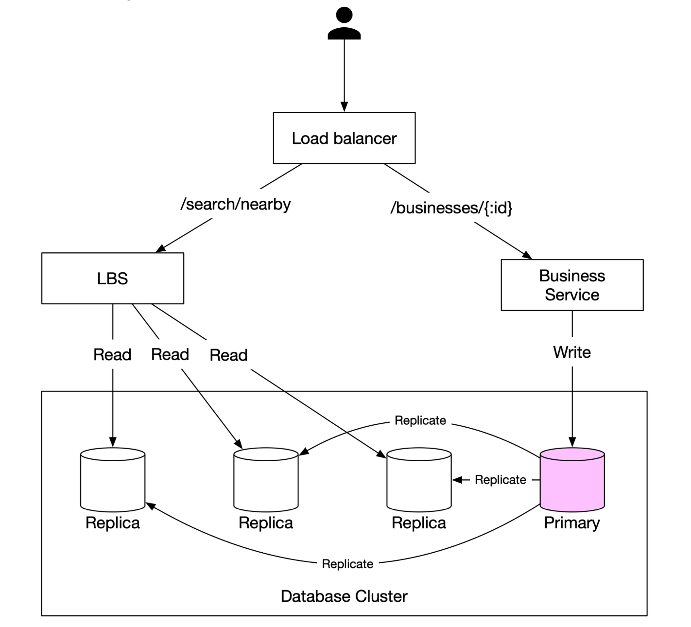
</p>

- **Location-Based Service (LBS)**: 
  - Processes location-based search queries.
  - Read-heavy service with no write requests.
  - QPS is high especially during peak hours in dense areas and the system is stateless.
- **Business Service**: Deals with two types of requests.
  - Business owners create, update or delete businesses.
  - Customers view detailed information about a business.
- **Load Balancer**: Routes traffic to LBS and Business service.
- **Database Cluster**: 
  - Uses **primary-replica architecture** for read-heavy workloads.
  - There might be some discrepancy between the data read by LBS and the data written to the primary database.
  - This inconsistency is not an issue because the business information is not updated in real-time.


---

## Step 3: Algorithms for Fetching Nearby Businesses

### **Option 1: Two-Dimensional Search (Naive Approach)**

<p align="left">
    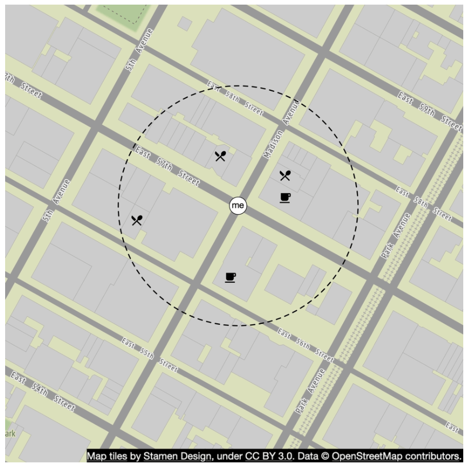
</p>

The most intuitive way is to draw a circle with pre-defined radius and find all the businesses within the circle.

**SQL Query:**
```
SELECT business_id, latitude, longitude
FROM business
WHERE (latitude BETWEEN :lat - radius AND :lat + radius)
AND (longitude BETWEEN :long - radius AND :long + radius);
```
**Problems:**
- **Inefficient**: Requires scanning the entire database.
- **Limited by one-dimensional indexes** (latitude/longitude).

**Why indexing both columns does not rescue this.** A B-tree index orders rows by one key. Given two independent indexes on `latitude` and `longitude`, the planner picks *one* of them, retrieves every row in that band, and filters the rest in memory. A 5 km latitude band is a strip **wrapping the entire planet** — it contains businesses in every country at that latitude. You have narrowed 200 million rows to a few million, not to a few hundred.

A composite index on `(latitude, longitude)` is no better: it sorts by latitude first, so the longitude component only helps *within* a single exact latitude value, which continuous coordinates never share.

Two further problems with this query that are easy to miss:

- **It returns a square, not a circle.** The corners of the bounding box are up to √2 ≈ 1.41× the radius away, so results must be post-filtered by true (haversine) distance regardless of which index you use. Every design in this chapter keeps that final distance filter.
- **Degrees are not a unit of distance.** One degree of latitude is ~111 km everywhere, but one degree of longitude is `111 km × cos(latitude)` — about 111 km at the equator, 78 km in Madrid, and 0 at the poles. So `:lat ± radius` and `:long ± radius` with the same numeric radius describe boxes of wildly different real-world sizes depending on where the user is. This is also why geohash cells are not square, and why cell-size tables are approximations.

A potential improvement is to build an index on the longitude and latitude columns; although this is slightly better, it is still very slow.

### Better Approach
- The problem with last approach is that the database index can only increase search speed in one dimension.
- An optimal apporach is to reprsent the two-dimensional data into one dimension using geospatial indexing.
  - Hash: Even grid, Geo Hash
  - Tree: Quadtree, Google S2, RTree

  <p align="left">
    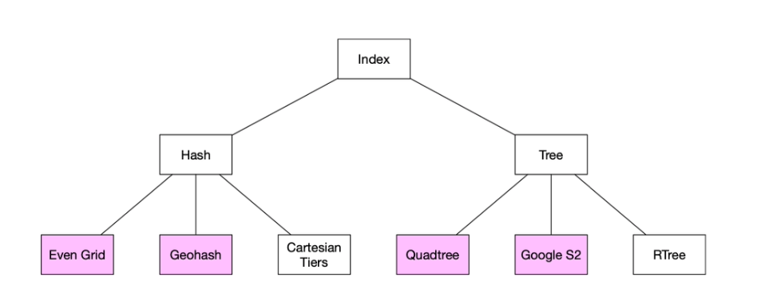
  </p>


### **Option 2: Evenly Divided Grid**

  <p align="left">
    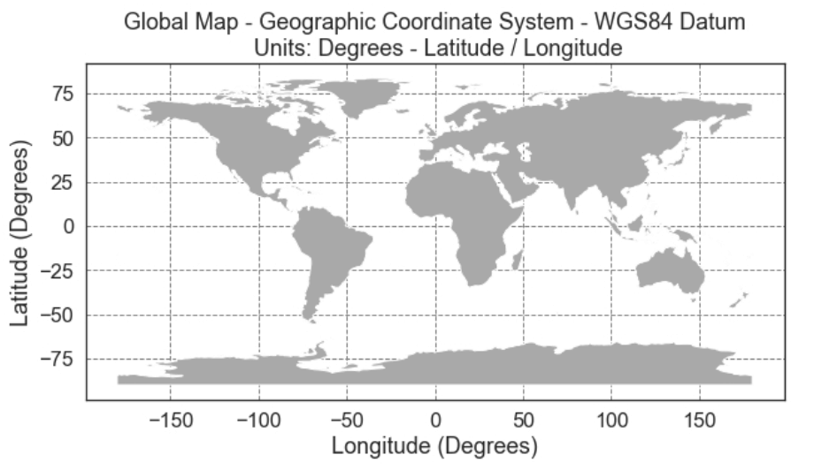
  </p>

- **Divides the world into fixed-size grids**.
- **Issue**: Uneven business distribution (high density in cities, sparse in rural areas).

### **Option 3: Geohash**
- Divide the planet into four quadrants along with the prime meridian and equator. And then divide each grid into four smaller grids. 
- Each grids can be represented by altering b/w longitude and latitude bit.
- Repeat this subdivision

  <p align="left">
    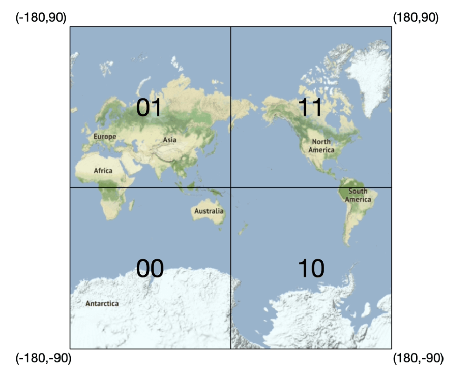
    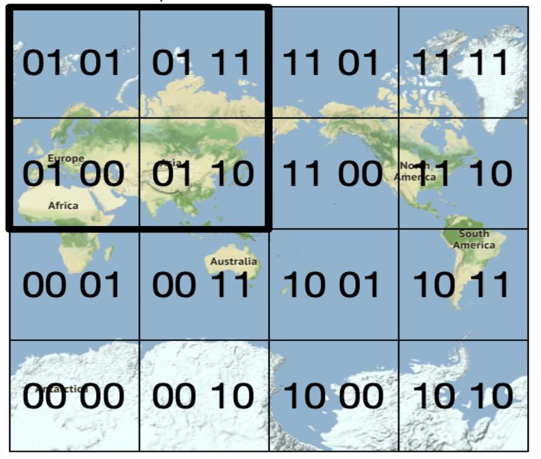
  </p>


- **Encodes latitude and longitude into a single alphanumeric string**. It has 12 precisions (levels)
- **Hierarchical grid structure** allows for efficient searching.
- The right precision is chosen by using the minimal geohash length according to the table.
  <p align="left">
    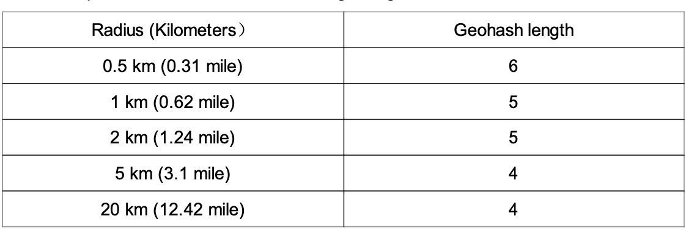
  </p>
- Geohash guarantees that the longer a shared prefix is between two geohashes, the closer they are.

**This prefix property is the whole trick, and it is what makes an ordinary database index work again.** Because nearby points share a leading string, "find everything in this cell" becomes a **prefix match**, and a prefix match on a sorted key is a **range scan** — precisely the operation a B-tree or a Redis sorted set is built for:

```sql
SELECT business_id FROM geohash_index
WHERE geohash LIKE '9q9hvu%';     -- one contiguous range scan
```

The 2D → 1D mapping has turned an unindexable two-dimensional query into a one-dimensional range lookup. Every scheme in this chapter achieves the same thing by a different curve.

**Precision maps to radius, approximately:**

| Geohash length | Approximate cell size | Suitable search radius |
|---|---|---|
| 4 | ~20 km | city-scale |
| 5 | ~5 km | district |
| 6 | ~1.2 km | neighbourhood (the chapter's 500 m case) |
| 7 | ~150 m | city block |
| 8 | ~40 m | building |

The rule is to pick the **shortest** geohash whose cell comfortably covers the requested radius, then post-filter by true distance. Picking too long a prefix means the radius spills outside the queried cells; too short means fetching far more candidates than needed.

- **Challenges**:
  <p align="left">
    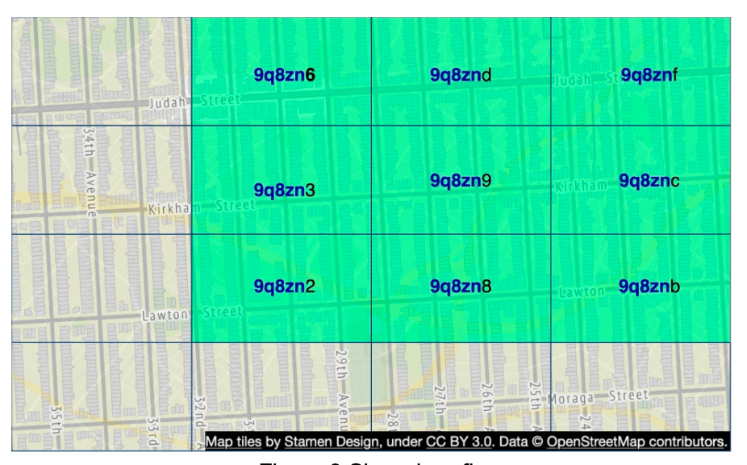
  </p>

  - **Boundary issues** (businesses close to grid edges may get excluded).
    - Two locations can be very close but have no shared prefix at all (can be on other side of equator)
    - Two locations can have a long shared prefix but belong to different geohashes.
  - Solution: Need to search neighboring grids.

  **The prefix property only works in one direction, and that asymmetry is the bug.** A long shared prefix *does* imply proximity. But proximity does **not** imply a shared prefix: two businesses on opposite sides of a cell boundary are metres apart and may differ in the very first character, because the boundary they straddle might be the equator or the prime meridian. A user standing on such a boundary would see half the nearby businesses vanish.

  Hence the standard remedy: compute the **8 neighbouring cells** and query all 9. This is not a patch so much as the actual algorithm — a geohash lookup is always a 9-cell query — and it is why the chapter's final flow has a "fetch neighbouring geohashes" step and why the Redis calls are issued in parallel.

  The cost is that you now examine roughly 9× the candidates and discard most of them in the distance filter. With cells chosen at the right precision that is a few hundred rows, which is cheap; with cells too large it is thousands.


### **Option 4: Quadtree**

  A quadtree is a tree data structure that recursively divides a two-dimensional space into four quadrants, with each internal node having exactly four children, representing the four sub-regions of the space.
  - The quadtree is an in-memory data structure and it runs on each LBS server and built on server startup time.

  <p align="left">
    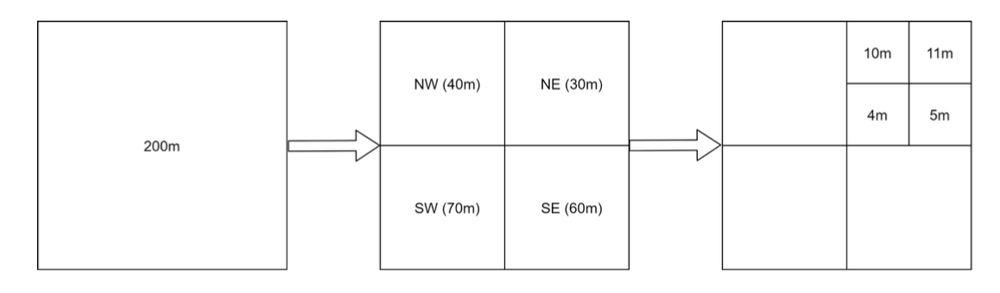
  </p>

  - The root node is recursively broken down into 4 quadrants until no nodes are left with more than x number of businesses (100 in this case).

  <p align="left">
    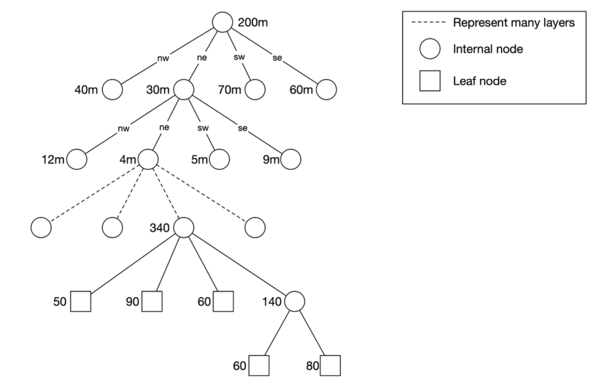
  </p>

- The quadtree index doesn't take too much memory (typically in GBs) and can easily fit in one server.
- Since the time complexity to build the tree is n·log n, it might take a few minutes to build the tree.
- **Efficient for k-nearest search queries** (e.g., find the closest gas station).

  <p align="left">
    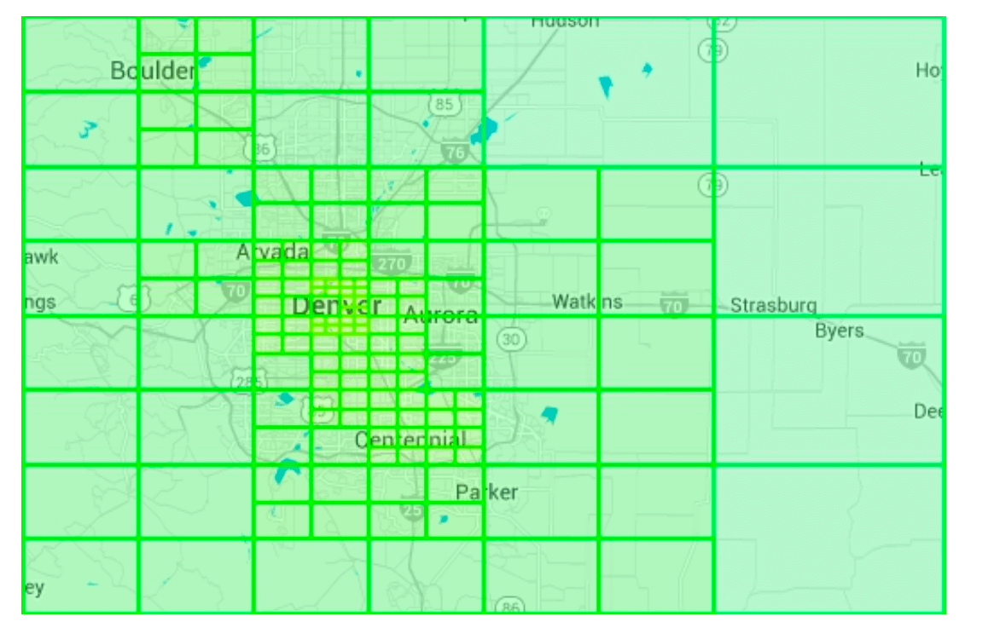
  </p>

#### Operational considerations
 - For around 200 million businesses, it might take few minutes to build a quadtree at the server start time.
 - While the quadtree is built it cannot serve traffic, therefore a new release should be rolled out incrementally to a subset of servers.
 - When updating a business or adding a new the easiest approach is to incrementally rebuild the quadtree. (Leading to a lot of cache invalidation)
 - Also possible to update the quadtree on the fly but more complex to implement. (Needs locking mechanism)

**The deeper trade here is where the index lives.** A geohash index is *data* — rows in Redis or a table, updated like any other row. A quadtree is a *process-local structure*, rebuilt at startup inside every LBS server. That difference drives everything in the list above: minutes of startup time before a server can serve, staggered rollouts so the fleet is never collectively rebuilding, and an update path that is either a full rebuild or a locking protocol.

What you get in exchange is **density adaptation**. Geohash cells are fixed-size, so a cell in Manhattan holds thousands of businesses and the equivalent cell in rural Montana holds none — the query cost varies by two orders of magnitude depending on where the user stands. A quadtree subdivides until every leaf holds at most ~100 businesses, so **query cost is uniform everywhere**, which is exactly what a latency SLA wants. It also makes k-nearest-neighbour queries natural ("find the 5 closest") because you can walk outward from a leaf, whereas with geohash you must guess a radius, query, and widen if you came up short.

### **Option 5: Google S2**
It maps a sphere to a 1D index based on the Hilbert curve. Two points that are close to each other on the Hilbert curve are close in 1D space.


  <p align="left">
    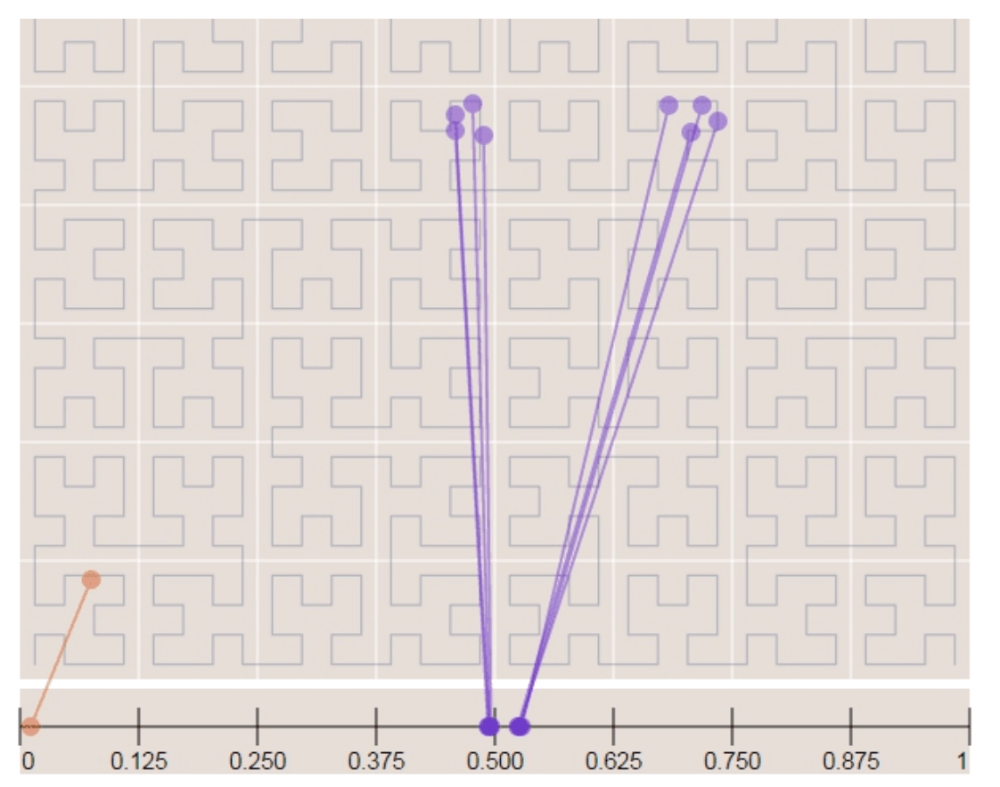
    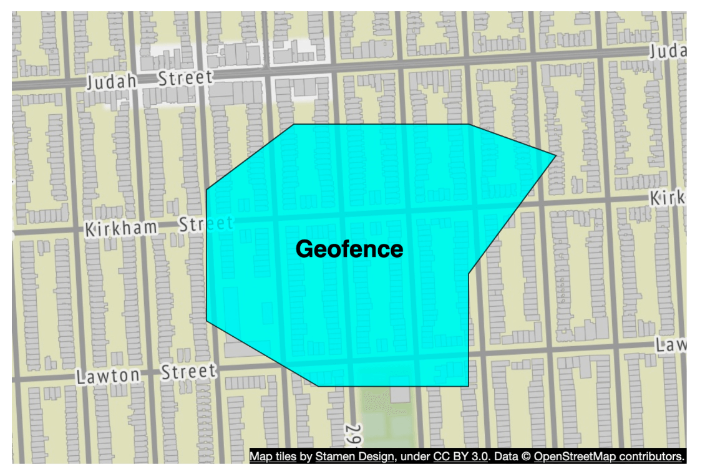
  </p>

- **Divides the earth into small cells using a Hilbert curve**.

**Why a Hilbert curve rather than geohash's Z-order curve.** Both are space-filling curves that assign a 1D number to a 2D point; they differ in how faithfully they preserve locality. Z-order (the interleaved-bits scheme geohash uses) contains large jumps — when it finishes a quadrant it leaps across the map to begin the next, so two cells adjacent in space can be far apart in the ordering. A Hilbert curve never jumps: consecutive values are always spatially adjacent.

The practical payoff is that an arbitrary region covers fewer, longer contiguous ranges on a Hilbert curve than on a Z-order curve. That is why S2 is the better fit for **geofencing** — covering a non-rectangular area such as a city boundary, a delivery zone or an airspace — because the covering can be expressed as a handful of cell ranges at mixed levels rather than thousands of small cells. The `min level / max level / max cells` controls the chapter mentions are the knobs for exactly that trade: fidelity of the covering against the number of ranges to query.

**Worth knowing about: H3.** Uber's hexagonal grid solves a different irritation. With square cells, the 8 neighbours are not equidistant — the 4 diagonal ones are √2 further away — so "adjacent cell" is an inconsistent notion. Hexagons have exactly 6 neighbours, all at the same centre-to-centre distance, which makes radius expansion and flow analysis much cleaner. The cost is that hexagons cannot tile perfectly hierarchically, so a parent cell does not exactly contain its children.
- Great for geofencing because it can cover arbitrary areas with varying levels.
- Geofencing also allows to define parameters that surround the area of interest.
- Another advantage is that instead of a fixed level of precision, S2 lets you specify min level, max level and max cells.


## Tradeoff Comparison 

#### Geohash
- Easy to use and implement — no need to build/rebuild a tree
- Supports fixed radius results
- Updating the index is easy.
- Cannot dynamically adjust the grid size based on population density.

#### Quadtree
- Slightly harder to implement.
- Supports fetching k-nearest businesses.
- Can dynamically adjust the grid size based on population density.
- Updating the index is more complicated as might need to rebuild the whole tree.

#### Side by side

| | Geohash | Quadtree | S2 / Hilbert | H3 (hexagons) |
|---|---|---|---|---|
| Curve / structure | Z-order on a string prefix | Tree, subdivided by density | Hilbert curve on a sphere | Hexagonal hierarchy |
| Where it lives | Rows in a DB or Redis | In-process, rebuilt at startup | Rows (cell IDs), like geohash | Rows (cell IDs) |
| Adapts to density | **No** — fixed cell size | **Yes** — uniform leaf size | No, but mixed levels per query | No |
| k-nearest query | Awkward — guess a radius, widen | **Natural** — walk outward | Workable | Workable |
| Updating one business | Trivial — one row | Rebuild or lock | Trivial — one row | Trivial |
| Arbitrary-region geofencing | Poor | Poor | **Best** — few contiguous ranges | Good |
| Neighbour distances uniform | No (diagonals farther) | No | No | **Yes** — 6 equidistant |
| Implementation effort | Lowest | Medium | Highest | Medium |

**How to choose, in one line each:** geohash if the index must be updatable and simple; quadtree if query latency must be uniform regardless of density; S2 if you need to cover arbitrary shapes; H3 if your problem is about movement and adjacency rather than point lookup.

---

## Step 4: Scaling the Database and Caching Strategy

### **Scaling the Business Table**
- **Sharding by business ID** ensures even data distribution.
- We have separate rows for each business in the table.

| Geohash | Business ID |
|---------|------------|
| 9q9hvu  | 343        |
| 9q9hvu  | 347        |
| 9q9hvu  | 112        |

### **Scaling the Geospatial Index**
- Might not be a good fit for the geohash table. In this case everything can fit in a single server, so there's no technical reason for sharding.
- A better approach is to have read-replicas to help with read loads.


---

### **Cache Strategy**
The most obvious cache key choice is the location coordinate, however it has a few issues:
 - Location coordinates from gps are not accurate.
 - A user can move, causing the location coordinate to change.
 - A better key is the geohash.

**The underlying principle is cache key cardinality.** Raw coordinates are effectively unique per request — `(37.776720, -122.416730)` will likely never be seen again, and two users standing beside each other produce different keys. A cache keyed on coordinates has a hit rate near zero no matter how large it is; it is not a cache, it is a memory leak with a TTL.

A geohash collapses a whole neighbourhood onto one key. Everyone searching from the same block shares a cache entry, so hit rates become high exactly where traffic is densest. This is the same lesson as the autocomplete cache key in [Chapter 13](../13.%20Search%20Autocomplete/#multi-language-and-personalization-the-cache-key-problem): **a cache is only as good as the number of requests that can share a key**, and reducing key precision is often what makes caching possible at all.

Note the pleasing consequence: GPS inaccuracy, which is a problem for the coordinate key, becomes irrelevant once the key is a cell — a few metres of jitter almost always lands in the same cell.

| Cache Key  | Cache Value |
|------------|------------|
| `geohash`  | List of business IDs in that grid |
| `business_id` | Business details (name, address, reviews, etc.) |

---

## Step 5: Deployment Strategy and Final Architecture

### **Region and Availability Zones**
- Deploy LBS and Business Service **across multiple regions**.

### **Handling Real-Time Updates**
- **Business updates are batch processed daily**.

### **Final System Architecture**


  <p align="left">
    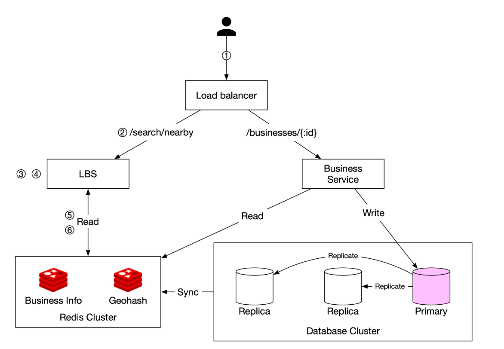
  </p>


This final algorithm looks like this:

## Steps to Retrieve Nearby Businesses
1. **User Request:**  
   - A user searches for restaurants within **500 meters**.  
   - The client sends **latitude (37.776720), longitude (-122.416730), and radius (500m)** to the **load balancer**.

2. **Request Forwarding:**  
   - The **load balancer (LB)** forwards the request to the **Location-Based Service (LBS)**.

3. **Geohash Calculation:**  
   - LBS determines the **geohash length** matching the radius.  
   - Using a reference table, **500m corresponds to geohash length = 6**.

4. **Fetching Neighboring Geohashes:**  
   - LBS calculates **neighboring geohashes** to include nearby areas.  
   - The result is a list:  
     ```
     [my_geohash, neighbor1_geohash, neighbor2_geohash, ..., neighbor8_geohash]
     ```

5. **Fetching Business IDs from Redis:**  
   - For each geohash in the list, LBS queries the **Geohash Redis server** to fetch **business IDs**.  
   - Parallel queries are used to minimize latency.

6. **Retrieving & Ranking Businesses:**  
   - LBS fetches **full business details** from the **Business Info Redis server**.  
   - Businesses are **sorted by distance** from the user’s location.  
   - The **ranked results** are sent back to the client.

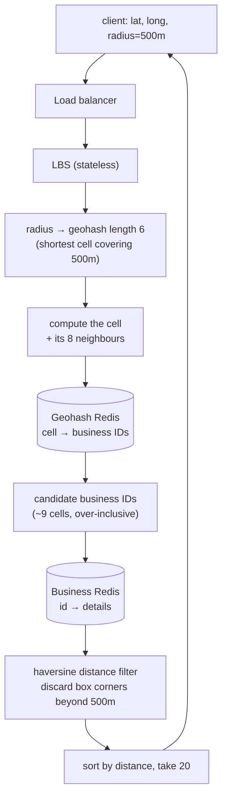

The two steps worth noticing are **N** and **F**: the query deliberately over-fetches — nine cells rather than one, a square rather than a circle — and then narrows precisely. Cheap over-approximation followed by an exact filter is the shape of almost every spatial query.

## Key Optimizations
- **Parallel Redis Calls**: Reduces response time.  
- **Geohash Indexing**: Ensures efficient spatial queries.  
- **Caching**: Speeds up lookup and retrieval of business data.  

This method ensures **low-latency, scalable** retrieval of businesses near a user’s location.

---

### **Choosing the Best Indexing Method**
| Indexing Method | Pros | Cons |
|----------------|------|------|
| **Geohash** | Easy to implement, efficient for proximity search | Boundary issues, fixed grid size |
| **Quadtree** | Dynamically adjusts to density, supports k-nearest queries | More complex, requires tree rebalancing |
| **Google S2** | Advanced geofencing, used in Google Maps | Harder to implement |

---

### Gotchas & failure modes

- **Proximity does not imply a shared prefix.** Two businesses metres apart can differ in the first geohash character if a major boundary runs between them. Every geohash lookup must query the 8 neighbouring cells, not just one.
- **A bounding box is not a circle.** Box corners are 1.41× the radius out, so a final haversine distance filter is mandatory in every variant.
- **Degrees are not distance.** A degree of longitude shrinks with `cos(latitude)`, so a fixed degree offset means very different real distances in Quito and Reykjavík. Cell-size tables are approximations for the same reason.
- **Fixed cells make query cost depend on where the user is standing.** A Manhattan cell can hold thousands of businesses and a rural cell none, so p99 latency is set by the densest cell in the world. Either adapt cell size (quadtree) or vary precision by region.
- **Dense areas are hot keys.** Times Square's cell is requested far more than any other, concentrating load on whichever Redis node owns it; consistent hashing balances keys, not traffic ([Chapter 5](../05.%20Consistent%20Hashing/#gotchas--failure-modes)). Replicate hot cells or cache them locally in the LBS process.
- **A quadtree server cannot serve while it is building.** Minutes of startup time per server means deploys must be staggered and health checks must not mark a rebuilding server as ready — otherwise a routine rollout removes the whole fleet from service at once.
- **Rebuilding on every business update invalidates everything.** The chapter's "incrementally rebuild" note hides a thundering-herd risk: if all servers rebuild on the same schedule, they all stop serving together. Stagger it.
- **The antimeridian and the poles break naive neighbour arithmetic.** Longitude wraps from +180 to −180, and near the poles a small distance spans many degrees of longitude, so "add one cell to the east" needs real wraparound handling rather than integer arithmetic.
- **Radius search and k-nearest are different problems.** "Everything within 500 m" may return nothing in a rural area; "the 5 closest" always returns 5 but may reach 50 km. Geohash answers the first naturally and the second badly; know which the product wants.
- **Location data is regulated.** The non-functional requirements name GDPR and CCPA for a reason: a user's precise coordinates are personal data, and a search log is a movement history. Truncate coordinates before logging, keep retention short, and never put coordinates in URLs where they land in access logs and referrer headers.
- **Replica lag is fine here, and that is a deliberate conclusion.** Business listings update daily in batch, so reading a few seconds behind the primary is harmless. Say so explicitly — it is what licenses the read-replica design, and the same lag would be unacceptable in [Chapter 17](../17.%20Nearby%20Friends/).
- **Deleted and closed businesses linger in the index.** The spatial index and the business table are updated by different paths; a business removed from one and not the other produces results that resolve to nothing. Filter unresolvable IDs rather than returning empty entries.

---

## The design, as problem and technique

| Goal / problem | Technique |
|---|---|
| A 1D index cannot answer a 2D query | Map coordinates to a locality-preserving 1D key (geohash / Hilbert / quadtree) |
| Turning "nearby" into an indexable lookup | Prefix match on the cell key, executed as a range scan |
| Choosing cell size for a given radius | Shortest prefix whose cell covers the radius, then post-filter |
| Boundary exclusion | Query the cell plus its 8 neighbours, in parallel |
| Box-shaped results from a circular query | Final haversine distance filter and sort |
| Uneven business density | Quadtree subdivision to a uniform leaf size, or per-region precision |
| Covering arbitrary shapes (geofences) | S2 cell coverings at mixed levels, bounded by max cells |
| 5,000 QPS of reads, no hot-path writes | In-memory index plus read replicas; no sharding needed |
| Cache hit rates | Key on geohash cell, never on raw coordinates |
| Business detail lookups | Separate `business_id` → details cache |
| Stale business data | Accept replica lag; batch-process owner updates daily |
| Quadtree startup cost | Staggered rollout; a rebuilding server is not healthy |
| Privacy and compliance | Coordinate truncation, short retention, no coordinates in URLs |

## Self-check
1. Why doesn't adding indexes on `latitude` and `longitude` make the naive query fast? What about a composite index?
2. The bounding-box query returns a square. What must every design in this chapter do afterwards, and why?
3. Why is `latitude ± 0.05` a different real-world distance from `longitude ± 0.05`?
4. What property of geohash turns a 2D proximity query into something a B-tree can serve?
5. The prefix property says "long shared prefix ⇒ close". Why is the converse false, and what does the algorithm do about it?
6. How do you choose geohash length for a 500 m radius, and what goes wrong if you pick 8 instead of 6?
7. A user searches from Times Square and another from rural Montana. Why does the geohash design give them very different latencies, and what fixes it?
8. Where does a quadtree live, and what three operational consequences follow from that?
9. Why is S2's Hilbert curve better than geohash's Z-order curve for geofencing?
10. Why would you choose hexagonal cells over square ones?
11. Why is caching on raw GPS coordinates worse than useless?
12. Why is replica lag acceptable in this chapter but not in Chapter 17?

## Glossary

| Term | Meaning |
|---|---|
| **Geospatial index** | A structure mapping 2D coordinates to a 1D key that preserves locality |
| **Geohash** | Base-32 encoding of interleaved latitude/longitude bits; prefix length sets precision |
| **Z-order (Morton) curve** | The space-filling curve geohash uses; preserves locality but with large jumps |
| **Hilbert curve** | A space-filling curve with no jumps, used by S2 |
| **Prefix property** | Shared leading characters imply spatial proximity — but not the reverse |
| **Boundary problem** | Nearby points falling in different cells, requiring a 9-cell query |
| **Quadtree** | Tree subdividing space into four quadrants until each leaf holds ≤ N items |
| **S2 cell / cell covering** | Hilbert-curve cells, and the set of mixed-level cells approximating a region |
| **Geofence** | An arbitrary region of interest, tested for containment |
| **H3** | Hexagonal hierarchical grid; 6 equidistant neighbours, non-exact hierarchy |
| **Haversine distance** | Great-circle distance between two lat/long points |
| **k-nearest (kNN)** | "The closest N", as opposed to "everything within radius R" |
| **LBS** | Location-Based Service — the stateless, read-only search tier |
| **Cache key cardinality** | How many requests can share a cache entry; coordinates have far too many |

## Where to go next
- [Chapter 17 – Nearby Friends](../17.%20Nearby%20Friends/) — the same spatial indexing problem with constant writes instead of a static dataset, which changes the answer entirely.
- [Chapter 18 – Design Google Maps](../18.%20Google%20Maps/) — spatial data at the next level up: tiles, routing graphs and ETA.
- [Chapter 5 – Design Consistent Hashing](../05.%20Consistent%20Hashing/#gotchas--failure-modes) — why a dense cell is a hot key that partitioning will not fix.
- [Chapter 13 – Design A Search Autocomplete System](../13.%20Search%20Autocomplete/#multi-language-and-personalization-the-cache-key-problem) — the same cache-key-cardinality lesson in a different domain.

## References
1. [Geohash Algorithm](https://www.movable-type.co.uk/scripts/geohash.html)
2. [Quadtree Indexing](https://en.wikipedia.org/wiki/Quadtree)
3. [Google S2 Geometry](https://s2geometry.io/)


