# Chapter 17: Nearby Friends

## Introduction

This chapter focuses on designing a scalable backend for an application which enables user to share their location and discover friends who are **nearby**.

The major difference with the proximity chapter is that in this problem, **locations constantly change**, whereas in that one, business addresses more or less stay the same.

**The one-sentence version:** this is [Chapter 16](../16.%20Proximity%20Service/) with the dataset mutating **334,000 times per second**, and that changes the answer completely. A spatial index you must rebuild continuously is worse than no index at all — so this design throws spatial indexing away and uses the **social graph as the index** instead. You do not need to know who is nearby; you need to know where your ≤5,000 friends are, and that is a bounded, enumerable set.

Hold the two chapters side by side, because the contrast is the real lesson:

| | Chapter 16 — Proximity Service | Chapter 17 — Nearby Friends |
|---|---|---|
| Dataset | 200 M businesses, effectively static | 10 M users, moving every 30 s |
| Workload | Read-heavy, no hot-path writes | **Write-heavy**: 334 K updates/sec |
| Index | Spatial (geohash / quadtree / S2) | **Social** — the friend list |
| Candidate set | "everything in these 9 cells" | "these 400 specific people" |
| Delivery | Request/response | Persistent connections and pub/sub |
| Consistency | Replica lag fine, data is stale anyway | Seconds matter; stale is visibly wrong |
| Data loss | Unacceptable | **Explicitly acceptable** |

---

## Step 1: Understand the Problem and Establish Design Scope

Some questions to drive the interview:
 * C: How geographically close is considered to be "nearby"?
 * I: 5 miles, this number should be configurable
 * C: Is distance calculated as straight-line distance vs. taking into consideration eg a river in-between friends
 * I: Yes, that is a reasonable assumption
 * C: How many users does the app have?
 * I: 1bil users and 10% of them use the nearby friends feature
 * C: Do we need to store location history?
 * I: Yes, it can be valuable for eg machine learning
 * C: Can we assume inactive friends will disappear from the feature in 10min
 * I: Yes
 * C: Do we need to worry about GDPR, etc?
 * I: No, for simplicity's sake

### **Functional requirements**

 * Users should be able to see nearby friends on their mobile app. Each friend has a distance and timestamp, indicating when the location was updated
 * Nearby friends list should be updated every few seconds

### **Non-functional requirements**

- **Low latency**: it's important to receive location updates without too much delay
- **Reliability**: Occasional data point loss is acceptable, but system should be generally available
- **Eventual consistency**: Location data store doesn't need strong consistency. Few seconds delay in receiving location data in different replicas is acceptable

### **Back-of-the-envelope**

Some estimations to determine potential scale:
 * Nearby friends are friends within 5mile radius
 * Location refresh interval is 30s. Human walking speed is slow, hence, no need to update location too frequently.
 * On average, 100mil users use the feature every day \w 10% concurrent users, ie 10mil
 * On average, a user has 400 friends, all of them use the nearby friends feature
 * App displays 20 nearby friends per page
 * **Location Update QPS** = 10mil / 30 == ~334k updates per second

### Following the numbers through the system

The 334 K figure is only the *ingress*. What matters is what each update costs downstream:

| Quantity | Derivation | Result |
|---|---|---|
| Location updates in | 10 M concurrent / 30 s | **~334 K/sec** |
| Online friends per user | 400 friends × 10% concurrent | ~40 |
| **Pub/sub pushes out** | 334 K × 40 | **~13.4 M/sec** |
| Redis nodes for that load | 13.4 M / ~100 K pushes per node | **~140 nodes** |
| Channels to pre-allocate | 100 M daily users | ~200 GB of channel metadata |
| Location history rows/day | 334 K × 86,400 | **~29 billion/day** |
| Location history bytes/day | 29 B × ~32 bytes | **~900 GB/day ≈ 330 TB/year** |

Three things to take from this table.

**The fan-out factor of 40 is the whole design problem.** Ingress at 334 K/sec is unremarkable; one update becoming forty is what forces 140 Redis nodes, a service-discovery layer, and consistent hashing onto the channel ring. Every architectural complication in Step 3 traces back to this multiplication.

**The location history database is the largest storage commitment in the chapter, and it is for a feature nobody asked for.** 330 TB/year of write-only data exists purely "for machine learning". It is also append-only with no reads on the serving path — which is precisely why Cassandra is the right answer, and why this write stream should be decoupled from the live path rather than sitting inline in the update flow.

**"Occasional data point loss is acceptable" is load-bearing.** It is what licenses: no acknowledgements, no retries, no durable queue, fire-and-forget pub/sub, and TTL-based expiry instead of explicit offline tracking. Almost every simplification in this design is purchased with that one sentence in the requirements. If it were absent — if every location update had to be delivered — this design would not work at all, and you would be looking at [Chapter 19](../19.%20Distributed%20Message%20Queue/) instead.

> **Interview angle:** the move that earns credit here is recognising that the spatial-index machinery from Chapter 16 is the *wrong* tool once locations change constantly, and that friendship is the better index. Then compute the fan-out factor, because that is the number the rest of the discussion hangs on.

---

## Step 2: Propose High-Level Design and Get Buy-In

Before exploring API and data model design, we'll study the communication protocol we'll use as it's less ubiquitous than traditional request-response communication model.

### **High-level design**

At a high-level we'd want to establish effective message passing between peers. This can be done via a peer-to-peer protocol, but that's not practical for a mobile app with flaky connection and tight power consumption constraints.

A more practical approach is to use a shared backend as a fan-out mechanism towards friends you want to reach:

    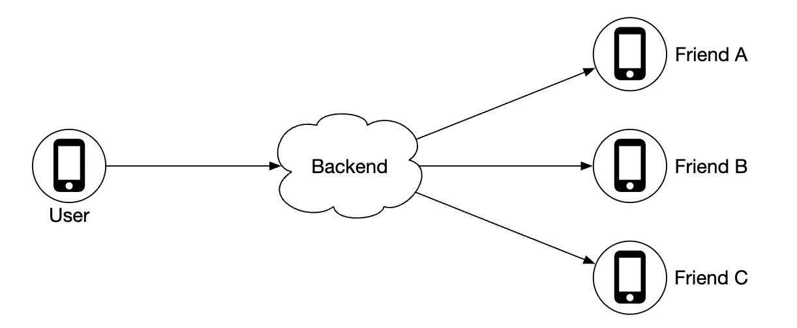

What does the backend do?
 * Receives location updates from all active users
 * For each location update, find all active users which should receive it and forward it to them
 * Do not forward location data if distance between friends is beyond the configured threshold

This sounds simple but the challenge is to design the system for the scale we're operating with.

We'll start with a simpler design at first and discuss a more advanced approach in the deep dive:

    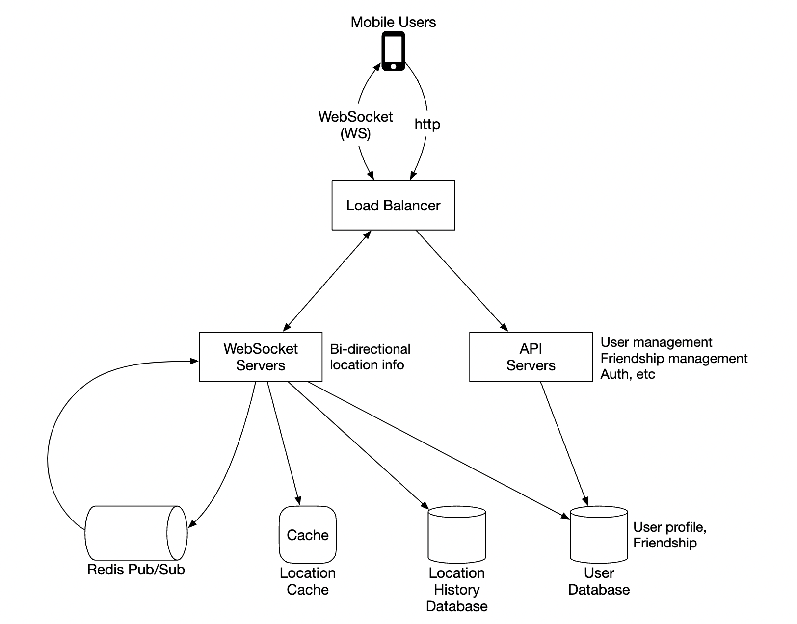

- **Load balancer**: spreads traffic across rest API servers as well as bidirectional web socket servers
- **Rest API servers**: handles auxiliary tasks such as managing friends, updating profiles, etc
- **Websocket servers**: stateful servers, which forward location update requests to respective clients. It also manages seeding the mobile client with nearby friends locations at initialization (discussed in detail later).
- **Redis location cache**: used to store most recent location data for each active user. There is a TTL set on each entry in the cache. When the TTL expires, user is no longer active and their data is removed from the cache.
- **User database**: stores user and friendship data. Either a relational or NoSQL database can be used for this purpose.
- **Location history database**: stores a history of user location data, not necessarily used directly within nearby friends feature, but instead used to track historical data for analytical purposes
- **Redis pubsub**: used as a lightweight message bus which enables different topics for each user channel for location updates.

    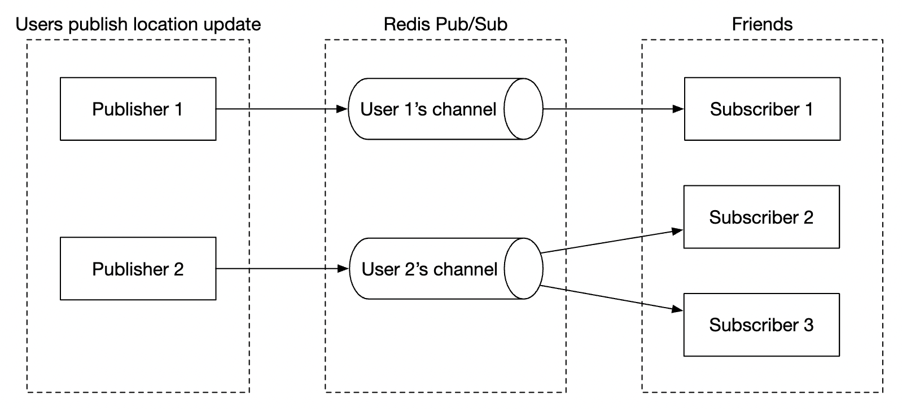

In the above example, websocket servers subscribe to channels for the users which are connected to them & forward location updates whenever they receive them to appropriate users.

### **Periodic location update**

Here's how the periodic location update flow works:

    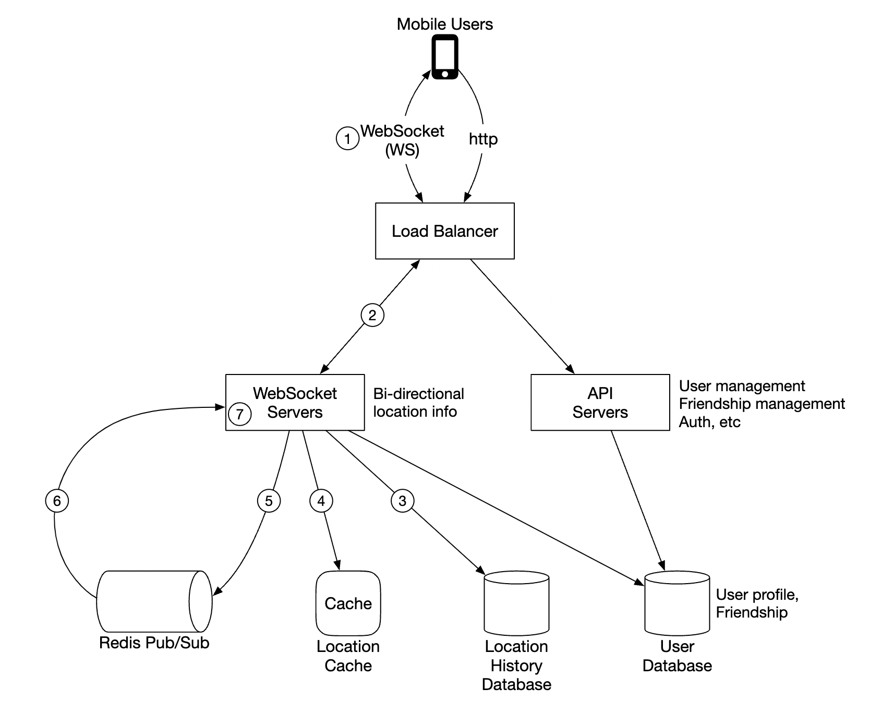

 * Mobile client sends a location update to the load balancer
 * Load balancer forwards location update to the websocket server's persistent connection for that client
 * Websocket server saves location data to location history database
 * Location data is updated in location cache. Websocket server also saves location data in-memory for subsequent distance calculations for that user
 * Websocket server publishes location data in user's channel via redis pub sub
 * Redis pubsub broadcasts location update to all subscribers for that user channel, ie servers responsible for the friends of that user
 * Subscribed web socket servers receive location update, calculate which users the update should be sent to and sends it

Here's a more detailed version of the same flow:

    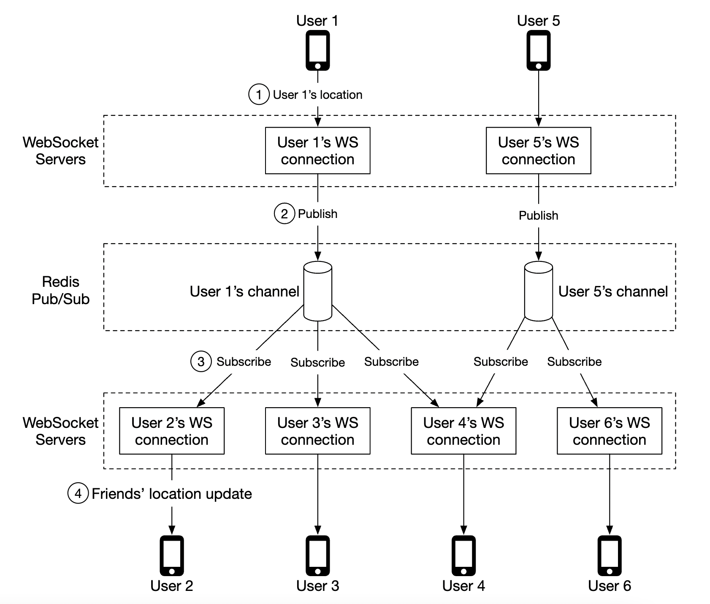

On average, there's going to be 40 location updates to forward as a user has 400 friends on average and 10% of them are online at a time.

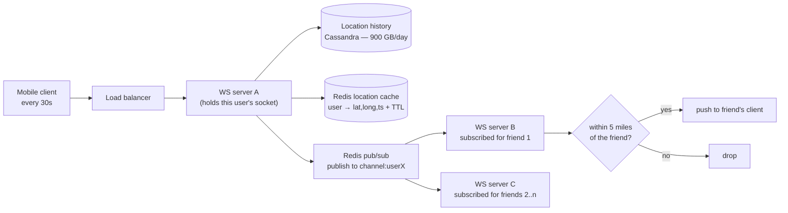

**Where the distance filter sits, and why that is the design's main inefficiency.** The publish is unconditional — one update goes to every subscriber of that user's channel — and the 5-mile test happens afterwards, on the *receiving* websocket server, which knows the recipient's own last location. So the full 13.4 M pushes/sec is paid regardless of distance, and most of it is discarded: your friends on another continent cost exactly as much to fan out to as the one across the street.

That is the price of using friendship as the index rather than space. The alternative — channels keyed by **geohash cell**, so you only receive updates from people physically near you — is exactly the mechanism the chapter later proposes for the "nearby random person" feature, and it has the opposite profile:

| | Channel per **user** (the main design) | Channel per **geohash cell** |
|---|---|---|
| Subscriptions per client | ~400, changing as friends come and go | ~9, changing as the user moves |
| Fan-out efficiency | Poor — most updates fail the distance test | **Good** — everyone in the channel is nearby |
| Semantics | Exactly your friends | Everyone nearby; must then filter by friendship |
| Resubscription churn | On friendship and presence changes | **On every cell crossing** — constant while moving |
| Hot channels | A whale user's channel | A dense cell's channel (a stadium, a city centre) |

Neither dominates, and a production system plausibly uses both: cell channels to bound the candidate set spatially, then a friendship check. Being able to state that trade-off — and that the chapter's main design deliberately accepts wasted fan-out in exchange for simple, exact semantics — is the substantive observation here.

### **API Design**

Websocket Routines we'll need to support:
 * periodic location update - user sends location data to websocket server
 * client receives location update - server sends friend location data and timestamp
 * websocket client initialization - client sends user location, server sends back nearby friends location data
 * Subscribe to a new friend - websocket server sends a friend ID mobile client is supposed to track eg when friend appears online for the first time
 * Unsubscribe a friend - websocket server sends a friend ID, mobile client is supposed to unsubscribe from due to eg friend going offline

HTTP API - traditional request/response payloads for auxiliary responsibilities.

### **Data model**

 * The location cache will store a mapping between `user_id` and `lat,long,timestamp`. Redis is a great choice for this cache as we only care about current location and it supports TTL eviction which we need for our use-case.

   **The TTL is not a cache-tuning parameter; it is a product requirement implemented as one.** "Inactive friends disappear from the feature within 10 minutes" becomes a 10-minute TTL on the cache entry, and that is the entire presence mechanism. No heartbeat tracking, no explicit offline transition, no cleanup job — a user who stops sending updates simply evaporates. Compare the deliberate heartbeat-and-threshold machinery in [Chapter 12](../12.%20Chat%20System/#online-presence); here the data's own expiry does the job because the data *is* the presence signal.

   It also bounds memory: at most 10 minutes of active users can be resident, which is why the chapter can say the cache's size is self-limiting even under a traffic spike.

 * **Why the `timestamp` is in the payload and shown in the UI.** The functional requirements specify that each friend is displayed with a distance *and a timestamp*. That is an honest admission that the location may be up to 30 seconds — or, with loss, several minutes — old. Rather than pretending to real-time accuracy, the product shows its own staleness. This is a good instinct generally: when a system is eventually consistent and users can tell, exposing the age of the data is better than hiding it.
 * Location history table stores the same data but in a relational table \w the four columns stated above. Cassandra can be used for this data as it is optimized for write-heavy loads.

---

## Step 3: Design Deep Dive

Let's discuss how we scale the high-level design so that it works at the scale we're targeting.

### **How well does each component scale?**

- **API servers**: can be easily scaled via autoscaling groups and replicating server instances
- **Websocket servers**: we can easily scale out the ws servers, but we need to ensure we gracefully shutdown existing connections when tearing down a server. Eg we can mark a server as "draining" in the load balancer and stop sending connections to it, prior to being finally removed from the server pool
- **Client initialization**: when a client first connects to a server, it fetches the user's friends, subscribes to their channels on redis pubsub, fetches their location from cache and finally forwards to client
- **User database**: We can shard the database based on user_id. It might also make sense to expose user/friends data via a dedicated service and API, managed by a dedicated team
- **Location cache**: We can shard the cache easily by spinning up several redis nodes. Also, the TTL puts a limit on the max memory we could have taken up at a time. But we still want to handle the large write load
- **Redis pub/sub server**: we leverage the fact that no memory is consumed if there are channels initialized but are not in use. Hence, we can pre-allocate channels for all users who use the nearby friends feature to avoid having to deal with eg bringing up a new channel when a user comes online and notifying active websocket servers

### **Scaling deep-dive on redis pub/sub component**

We will need around 200gb of memory to maintain all pub/sub channels. This can be achieved by using 2 redis servers with 100gb each.

Given that we need to push ~14mil location updates per second, we will however need at least 140 redis servers to handle that amount of load, assuming that a single server can handle ~100k pushes per second.

Hence, we'll need a distributed redis server cluster to handle the intense CPU load.

In order to support a distributed redis cluster, we'll need to utilize a service discovery component, such as zookeeper or etcd, to keep track of which servers are alive.

What we need to encode in the service discovery component is this data:

    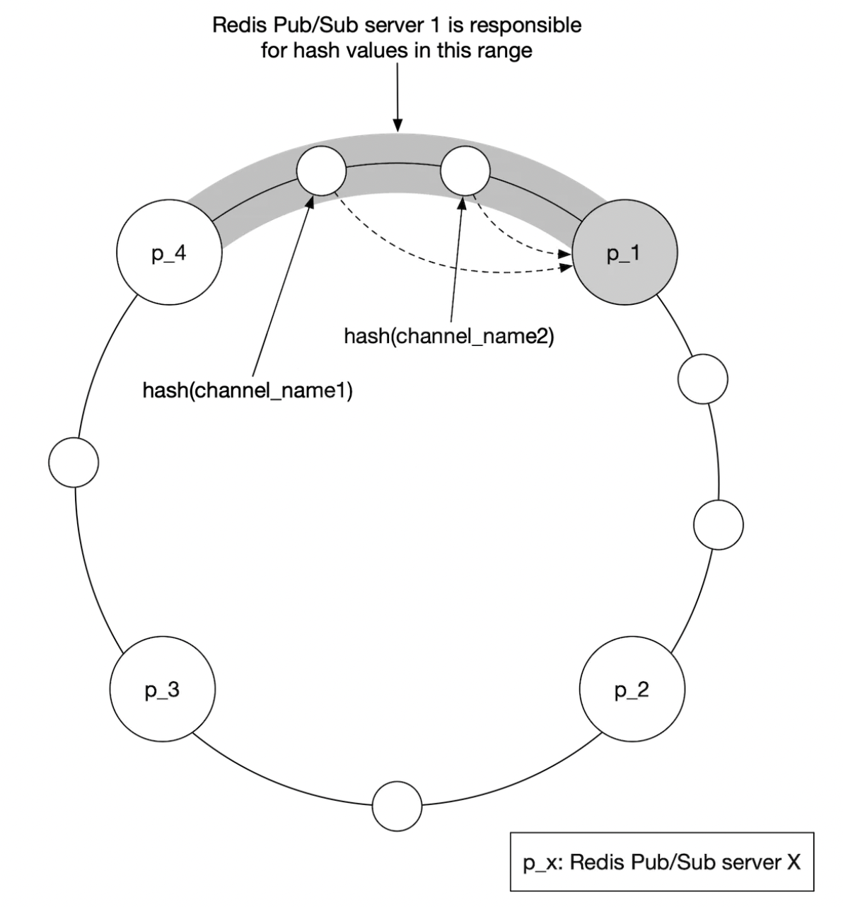

Web socket servers use that encoded data, fetched from zookeeper to determine where a particular channel lives. For efficiency, the hash ring data can be cached in-memory on each websocket server.

In terms of scaling the server cluster up or down, we can setup a daily job to scale the cluster as needed based on historical traffic data. We can also overprovision the cluster to handle spikes in loads.

The redis cluster can be treated as a stateful storage server as there is some state maintained for the channels and there is a need for coordination with subscribers so that they hand-off to newly provisioned nodes in the cluster.

We have to be mindful of some potential issues during scaling operations:
 * There will be a lot of resubscription requests from the web socket servers due to channels being moved around
 * Some location updates might be missed from clients during the operation, which is acceptable for this problem, but we should still minimize it from happening. Consider doing such operation when traffic is at lowest point of the day.
 * We can leverage consistent hashing to minimize amount of channels moved in the event of adding/removing servers

This is [Chapter 5](../05.%20Consistent%20Hashing/) applied exactly as intended, and it is worth being precise about what it does and does not buy. Adding one node to a 140-node ring moves roughly `1/140` of channels rather than remapping all of them — so the resubscription storm is ~0.7% of subscriptions instead of 100%. What it does **not** fix is the hot channel: a dense geohash cell or a whale user still lands entirely on one node, because consistent hashing balances channels, not traffic ([Chapter 5](../05.%20Consistent%20Hashing/#gotchas--failure-modes)).

Note also why the chapter says the Redis cluster must be treated as **stateful** despite holding no durable data: the state is the *subscription set*. Moving a channel is not just moving a key; it requires every websocket server subscribed to it to notice and resubscribe elsewhere, which is why service discovery and the hash ring must be distributed to all of them rather than hidden behind a proxy.

    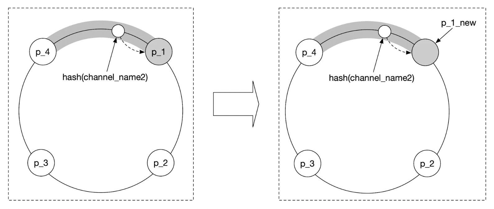

### **Adding/removing friends**

Whenever a friend is added/removed, websocket server responsible for affected user needs to subscribe/unsubscribe from the friend's channel.

Since the "nearby friends" feature is part of a larger app, we can assume that a callback on the mobile client side can be registered whenever any of the events occur and the client will send a message to the websocket server to do the appropriate action.

### **Users with many friends**

We can put a cap on the total number of friends one can have, eg facebook has a cap of 5000 max friends.

The websocket server handling the "whale" user might have a higher load on its end, but as long as we have enough web socket servers, we should be okay.

**The cap is doing more work than it appears.** It converts an unbounded fan-out into a bounded one: with 5,000 friends at 10% concurrency, a whale's single update produces ~500 pushes instead of an arbitrary number. That is the same role the 100-member group cap plays in [Chapter 12](../12.%20Chat%20System/#group-chat) and the opposite of the celebrity problem in [Chapter 11](../11.%20News%20Feed%20System/), where no cap exists and the design has to change shape as a result.

There is still an asymmetry the chapter glosses over: the whale's *channel* has 500 subscribers, and that channel lives on **one** Redis node. More websocket servers spread the receiving work but do nothing for the publishing node, so a popular channel is a hot key. The fixes are the usual ones — replicate the channel across several nodes, or shard one logical channel into several.

### **Nearby random person**

What if the interviewer wants to update the design to include a feature where we can occasionally see a random person pop up on our nearby friends map?

One way to handle this is to define a pool of pubsub channels, based on geohash:

    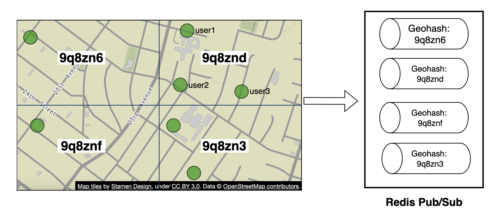

Anyone within the geohash subscribes to the appropriate channel to receive location updates for random users:

    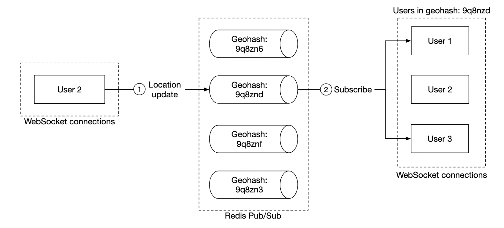

We could also subscribe to several geohashes to handle cases where someone is close but in a bordering geohash:

    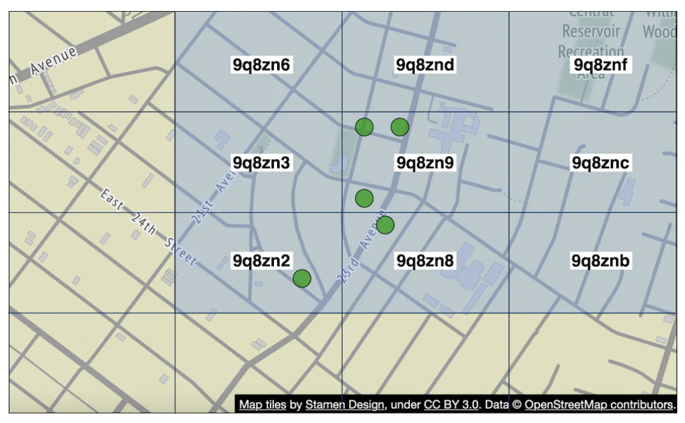

This is the boundary problem from [Chapter 16](../16.%20Proximity%20Service/#option-3-geohash) reappearing in a pub/sub context, with the same 9-cell remedy. But note the new cost that the static case does not have: **a moving user crosses cell boundaries**, and each crossing means unsubscribing from three cells and subscribing to three others. A user on a motorway generates subscription churn continuously, and a user standing exactly on a boundary with noisy GPS will flap between cell sets indefinitely. Hysteresis — only switching once you are comfortably inside the new cell — is what stops that.

It is also worth naming what this feature is: broadcasting your live location to strangers near you. The "interviewer waived GDPR for simplicity" note earlier in the chapter is fine as an interview simplification, but a real version of this feature needs opt-in, coarsened location, and the ability to disappear — the privacy design is the feature, not a compliance afterthought.

### **Alternative to Redis pub/sub**

An alternative to using Redis for pub/sub is to leverage Erlang - a general programming language, optimized for distributed computing applications.

With it, we can spawn millions of small Erlang processes which communicate with each other. We can handle both websocket connections and pub/sub channels within the distributed erlang application.

A challenge with using Erlang, though, is that it's a niche programming language and it could be hard to source strong erlang developers.

---

## Step 4: Wrap Up

We successfully designed a system, supporting the nearby friends features.

Core components:
- **Web socket servers**: real-time comms between client and server
- **Redis**: fast read and write of location data + pub/sub channels

We also explored how to scale restful api servers, websocket servers, data layer, redis pub/sub servers and we also explored an alternative to using Redis Pub/Sub. We also explored a "random nearby person" feature.

---

### Gotchas & failure modes

- **The fan-out factor, not the ingress rate, sizes the system.** 334 K updates/sec is easy; 13.4 M pushes/sec is 140 Redis nodes. Any change to average friend count or concurrency multiplies straight through.
- **Most of the fan-out is discarded.** The distance filter runs *after* the publish, on the receiving server, so updates from distant friends cost full price. This is the accepted cost of indexing by friendship rather than by space.
- **Redis pub/sub has no durability and no replay.** A websocket server that is momentarily disconnected misses those messages permanently — there is no offset to rewind to. That is acceptable only because the requirements allow data loss; it would be disqualifying in [Chapter 19](../19.%20Distributed%20Message%20Queue/)'s terms.
- **Rescaling the Redis cluster causes a resubscription storm.** Consistent hashing holds it to roughly `1/N` of channels, and the chapter's advice to do it at the daily traffic trough is the real mitigation. Expect some updates to be lost during the operation.
- **Losing a websocket server drops all its clients at once.** They reconnect, re-fetch friend lists, and re-subscribe to hundreds of channels each — a far heavier reconnection than chat's, because client initialization is itself expensive. Jittered backoff is mandatory; see [Chapter 12](../12.%20Chat%20System/#gotchas--failure-modes).
- **Client initialization is the expensive operation, not steady state.** Fetching ~400 friends, subscribing to their channels, and reading their cached locations happens on every reconnect. A network blip on a train costs this repeatedly.
- **A whale's channel is a hot key on one node.** More websocket servers do not help the publishing node. Replicate or split the channel.
- **A dense geohash channel is a hotter key.** For the random-person feature, a stadium or a city centre concentrates thousands of publishers and subscribers on one channel. Split by sub-cell, or cap participation.
- **Cell crossings cause continuous resubscription.** Moving users change their cell set constantly; GPS noise on a boundary causes flapping. Use hysteresis rather than switching on the first reading.
- **Distances are computed from possibly-stale cached positions.** Two users who have each just moved can both be told the other is 4.9 miles away when they are 6 apart. The displayed timestamp is the mitigation — show the data's age rather than implying freshness.
- **Straight-line distance is not travel distance.** 5 miles across a bay is not 5 miles of walking. The requirement explicitly accepts this; be aware it is an assumption, not a fact.
- **The 30-second interval is a battery decision.** GPS is one of the most power-hungry things a phone does, and a background app draining the battery gets uninstalled or killed by the OS. Shortening the interval to improve freshness trades directly against that, and against the whole fan-out budget.
- **900 GB/day of history is written for an unspecified future use.** It is the largest cost in the design and has no serving-path reader. Keep it off the live path, give it a retention policy, and be ready to justify it.
- **This is the most sensitive data in the book.** A continuous location history of a billion-user app's users is a surveillance dataset. Real versions need opt-in, granular sharing, coarsening, retention limits and the ability to go invisible — and in most jurisdictions that is law, not preference.
- **Erlang/BEAM is a real alternative with a real cost.** It collapses the websocket tier and the pub/sub tier into one runtime built for millions of lightweight processes, which removes an entire distributed component. The staffing constraint the chapter mentions is the honest objection — this is an operational and hiring decision as much as a technical one.

---

## The design, as problem and technique

| Goal / problem | Technique |
|---|---|
| A spatial index that cannot be maintained under 334 K writes/sec | Abandon spatial indexing; use the friend list as the index |
| Pushing updates to clients in seconds | Persistent websocket connections, not polling |
| Routing an update to the right subscribers | Redis pub/sub channel per user; websocket servers subscribe for their clients |
| 13.4 M pushes/sec | Distributed Redis cluster (~140 nodes) with service discovery |
| Minimising churn when the cluster rescales | Consistent hashing on the channel ring, cached on each websocket server |
| Avoiding channel-creation coordination | Pre-allocate channels for all users; empty channels cost no memory |
| "Inactive friends disappear in 10 minutes" | TTL on the location cache entry — expiry *is* the presence mechanism |
| Bounding cache memory | The same TTL |
| Unbounded fan-out from popular users | Cap on friend count (e.g. 5,000) |
| Honest display of stale data | Ship a timestamp with every location and show it |
| Analytics on movement | Separate write-only history store (Cassandra), off the live path |
| Nearby strangers | A second channel space keyed by geohash cell, with 9-cell neighbour subscription |
| Clients overwhelming the system on reconnect | Jittered backoff; accept that initialization is the heavy operation |

## Self-check
1. Why is the geohash/quadtree machinery from Chapter 16 the wrong tool here, and what replaces it as the index?
2. Compute the fan-out: 334 K updates/sec, 400 friends, 10% concurrent. Which number sizes the Redis cluster?
3. Where does the 5-mile distance filter run, and what does that cost you?
4. Compare channel-per-user with channel-per-geohash-cell. What does each get right?
5. Which single sentence in the requirements licenses fire-and-forget pub/sub with no retries, and what would change without it?
6. How is "inactive friends disappear within 10 minutes" implemented? What else does that mechanism give you for free?
7. Why does the design ship a timestamp to the client alongside the distance?
8. Adding one node to a 140-node Redis ring — how many channels move, and what does *not* improve?
9. Why is the Redis pub/sub cluster described as stateful when it stores no durable data?
10. What does the 5,000-friend cap prevent, and which earlier chapter has no such cap?
11. A user drives along a motorway with the nearby-strangers feature on. What happens, and what dampens it?
12. Which component is the largest storage cost, and who reads from it on the serving path?
13. Why is the 30-second refresh interval not just a freshness decision?

## Glossary

| Term | Meaning |
|---|---|
| **Social index** | Using the friend list, rather than space, to bound the candidate set |
| **Fan-out factor** | Online friends per user — the multiplier from ingress to egress (here ~40) |
| **Location cache** | Redis map of `user_id → lat,long,timestamp` with a TTL |
| **TTL-as-presence** | Letting a cache entry's expiry represent a user going inactive |
| **Pub/sub channel per user** | A topic carrying one user's location updates to all subscribed servers |
| **Channel pre-allocation** | Creating channels for all users up front, since idle channels cost nothing |
| **Resubscription storm** | Mass re-subscription when channels move between Redis nodes |
| **Consistent hashing on the channel ring** | Limiting that movement to roughly `1/N` of channels |
| **Whale user** | A user with the maximum friend count; their channel is a hot key |
| **Geohash channel** | A topic keyed by spatial cell, used for the nearby-strangers feature |
| **Hysteresis** | Requiring a margin before switching cells, to stop boundary flapping |
| **Location history store** | Write-only Cassandra table of all historical positions, for offline use |
| **Draining** | Marking a websocket server ineligible for new connections before shutdown |

## Where to go next
- [Chapter 16 – Proximity Service](../16.%20Proximity%20Service/) — the same spatial problem with a static dataset; read the two together, the contrast is the lesson.
- [Chapter 12 – Design A Chat System](../12.%20Chat%20System/) — the persistent-connection, presence and reconnection-storm machinery this chapter reuses wholesale.
- [Chapter 5 – Design Consistent Hashing](../05.%20Consistent%20Hashing/) — the channel ring, and why it does not solve hot channels.
- [Chapter 19 – Distributed Message Queue](../19.%20Distributed%20Message%20Queue/) — what you would need instead of Redis pub/sub if losing updates were unacceptable.
- [Chapter 11 – Design A News Feed System](../11.%20News%20Feed%20System/) — fan-out without a cap, and what that forces.
