# Chapter 18: Google Maps

## Introduction

We'll design a simple version of **Google Maps**.

Some facts about google maps:
 * Started in 2005
 * Provides various services - satellite imagery, street maps, real-time traffic conditions, route planning
 * By 2021, had 1bil daily active users, 99% coverage of the world, 25mil updates daily of real-time location info

**The one-sentence version:** "Google Maps" is not one system but **three**, sharing only a coordinate space:

1. **Serving the map** — delivering precomputed image or vector tiles. A CDN problem, and a very large storage problem.
2. **Navigation** — a shortest-path search over a road graph far too large to load, let alone search, per request. An algorithms and partitioning problem.
3. **Location ingest** — absorbing a billion GPS streams, which *is* the traffic data the navigation service depends on. A write-heavy pipeline problem.

The idea that unifies them is **tiling**: subdividing space into addressable cells at multiple zoom levels. It is applied to map imagery, then to the road graph (routing tiles), and then — more surprisingly — to bookkeeping about which users' routes pass through which area, for rerouting. Watching the same technique solve three unrelated problems is most of the value of this chapter.

---

## Step 1: Understand the Problem and Establish Design Scope

Sample Q&A between candidate and interviewer:
 * C: How many daily active users are we dealing with?
 * I: 1bil DAU
 * C: What features should we focus on?
 * I: Location update, navigation, ETA, map rendering
 * C: How large is road data? Do we have access to it?
 * I: We obtained road data from various sources, it's TBs of raw data
 * C: Should we take traffic conditions into consideration?
 * I: Yes, we should for accurate time estimations
 * C: How about different travel modes - by foot, biking, driving?
 * I: We should support those
 * C: How about multi-stop directions?
 * I: Let's not focus on that for scope of interview
 * C: Business places and photos?
 * I: Good question, but no need to consider those

We'll focus on three key features - user location update, navigation service including ETA, map rendering.

### **Non-functional requirements**

- **Accuracy**: user shouldn't get wrong directions
- **Smooth navigation**: Users should experience smooth map rendering
- **Data and battery usage**: Client should use as little data and battery as possible. Important for mobile devices.
- General availability and scalability requirements

### **Map 101**

Before jumping into the design, there are some map-related concepts we should understand.

#### Positioning system

World is a sphere, rotating on its axis. Positions are defined by latitude (how far north/south you are) and longitude (how far east/west you are):

<p align="left">
    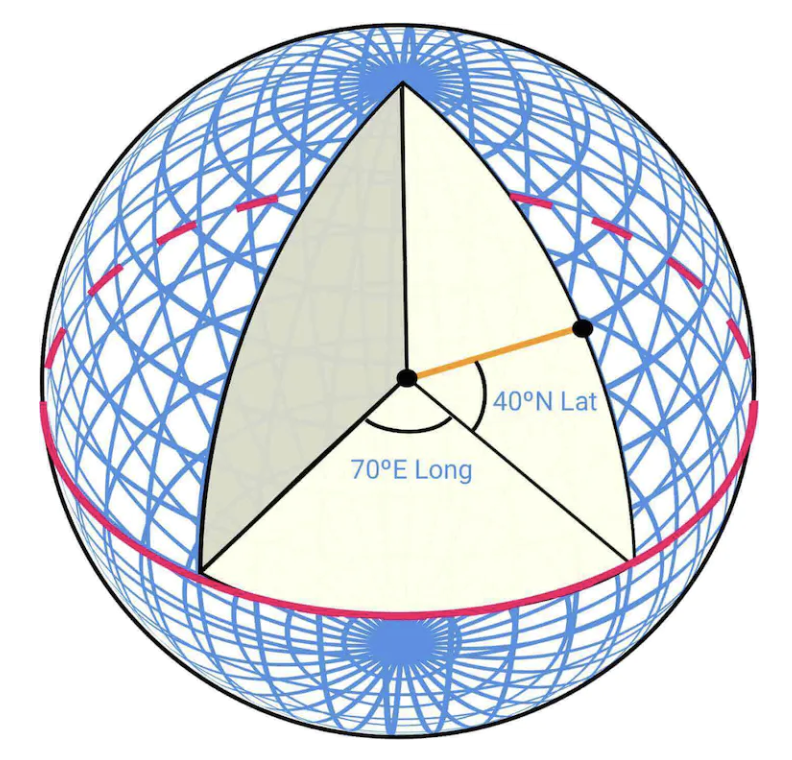
</p>

#### Going from 3D to 2D

The process of translating points from 3D to 2D plane is called "map projection".

There are different ways to do it and each comes with its pros and cons. Almost all distort the actual geometry.

**Which distortion you accept is a product decision.** No flat map preserves area, shape, distance and direction simultaneously — that is a theorem, not an engineering limitation. Mapping and navigation applications almost universally choose **Web Mercator**, and for a specific reason:

| Projection property | Web Mercator | Why it matters here |
|---|---|---|
| **Conformal** (preserves local angles) | **Yes** | Streets meet at their true angles, so "turn 90° right" looks right. Essential for navigation. |
| Preserves area | **No** — badly | Greenland appears the size of Africa. Irrelevant for driving, notorious for world maps. |
| Preserves distance | No | Scale varies with latitude; distances must be computed on the sphere, not from the image. |
| Maps the world to a square | **Yes** | Makes square tiles and a clean quadtree possible — the reason tiling works so neatly. |

Conformality is the one navigation genuinely needs, and the square world is what makes the whole tiling scheme below fall out naturally. The area distortion is the price, and it is paid everywhere except in arguments about world maps.

<p align="left">
    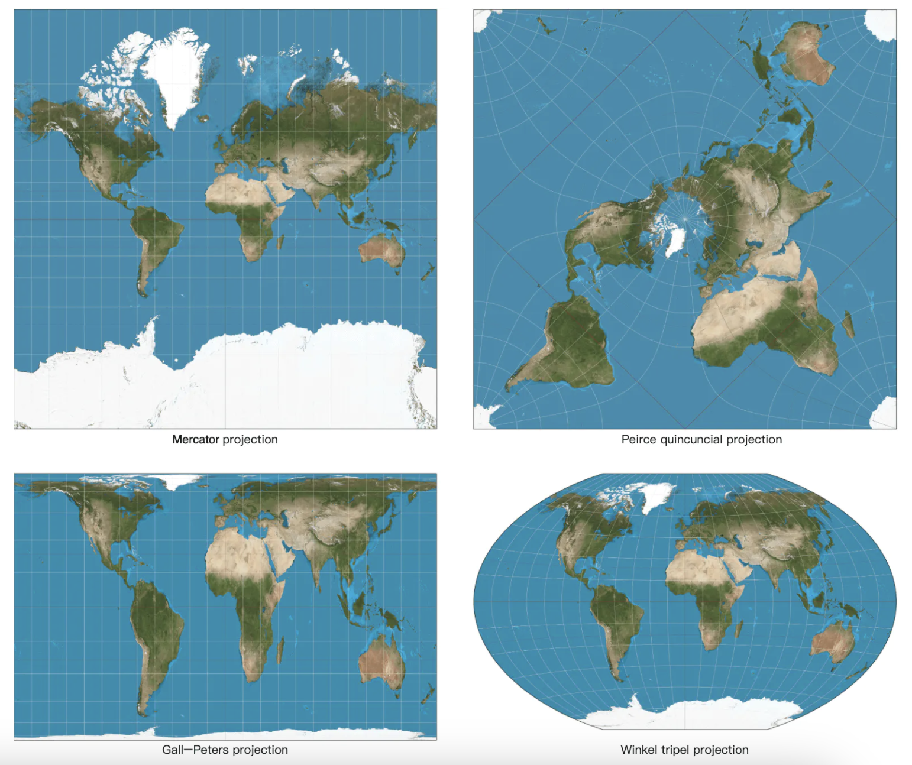
</p>

Google maps selected a modified version of Mercator projection called "Web Mercator".

#### Geocoding

Geocoding is the process of converting addresses to geographic coordinates. 

The reverse process is called "reverse geocoding".

One way to achieve this is to use interpolation - leveraging data from different sources (eg GIS-es) where street network is mapped to geo coordinate space.

#### Geohashing

Geohashing is an encoding system which encodes a geographic area into a string of letters and digits.

It depicts the world as a flattened surface and recursively sub-divides it into four quadrants:

<p align="left">
    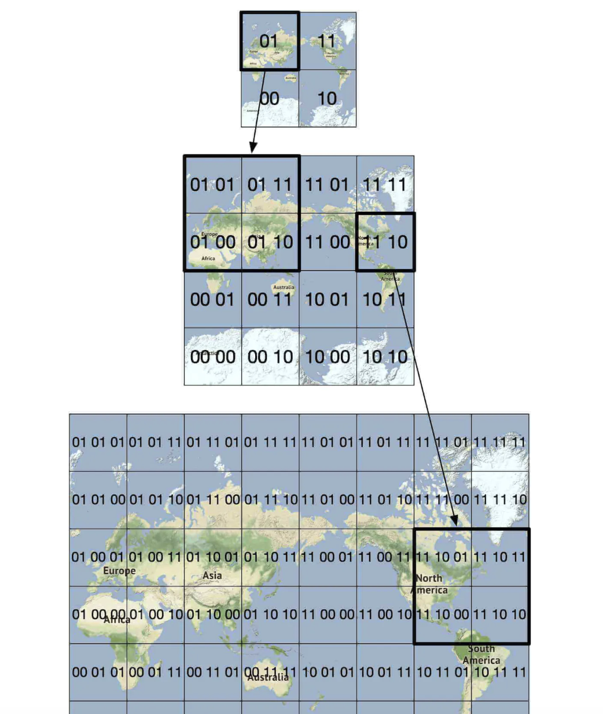
</p>

#### Map rendering

Map rendering happens via tiling. Instead of rendering entire map as one big custom image, world is broken up into smaller tiles.

Client only downloads relevant tiles and renders them like stitching together a mosaic.

There are different tiles for different zoom levels. Client chooses appropriate tiles based on the client's zoom level.

Eg, zooming out the entire world would download only a single 256x256 tile, representing the whole world.

**The tile scheme, and why it explains the 70 PB.** A tile is addressed by `(z, x, y)` — zoom level and position. Each zoom level splits every tile into four, so:

| Zoom | Tiles at this level | What you see |
|---|---|---|
| 0 | 1 | Whole world |
| 1 | 4 | Continents |
| 10 | ~1 million | City |
| 15 | ~1 billion | Streets |
| 21 | **~4.4 trillion** | Individual buildings |

Summing all levels to zoom 21 gives roughly **5.8 trillion tiles**. At ~20 KB each that is over 100 PB — which is where the chapter's ~70 PB estimate comes from, once you account for the fact that most of the planet is ocean or desert and compresses to almost nothing, and that the deepest zoom levels are only generated where there is detail to show.

Two properties make this servable:

- **Only visible tiles are fetched.** A phone screen shows a handful of tiles at one zoom level, so a client downloads kilobytes, not petabytes.
- **Cache locality is excellent.** Tiles are immutable between map updates and demand is enormously concentrated on populated areas, so a CDN serves the overwhelming majority of requests ([Chapter 1 §7](../01.%20Scaling/#section-7-content-delivery-network-cdn)).

**Raster tiles versus vector tiles** is the choice that decides whether the 70 PB stays 70 PB:

| | Raster tiles (pre-rendered images) | Vector tiles (geometry, rendered on device) |
|---|---|---|
| Server work | Render once, serve as a file | Serve geometry; client renders |
| Size on the wire | Larger | **Much smaller** |
| One tile serves | One style, one language, one rotation | **Every** style, language, rotation, and label placement |
| Storage multiplier | × styles × languages × themes | **× 1** |
| Client cost | Trivial — draw a bitmap | Real CPU and battery to render |
| Smooth zoom/rotate | No — must fetch a new level | **Yes** — scale and rotate locally |

With raster tiles, supporting dark mode, 40 languages and satellite/terrain styles multiplies that 70 PB by a large constant. Vector tiles move the rendering to the device and make the multiplier disappear — which is why modern maps use them, and why the non-functional requirement about **data and battery usage** is a genuine tension rather than a platitude: vector tiles save data and spend battery.

#### Road data processing for navigation algorithms

In most routing algorithms, intersections are represented as nodes and roads are represented as edges:

<p align="left">
    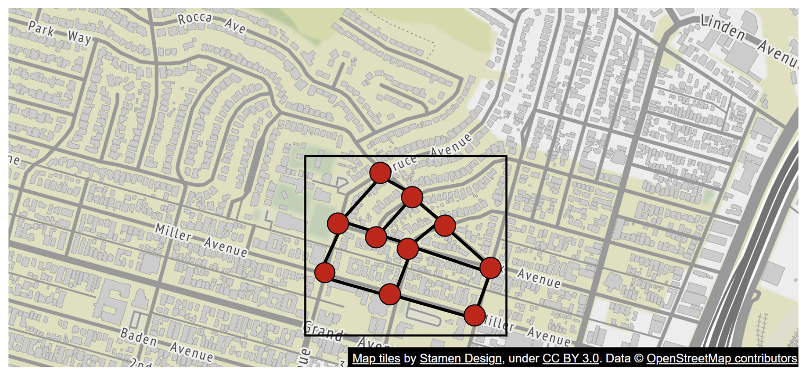
</p>

Most navigation algorithms use a modified version of Dijkstra's or A* algorithms.

Pathfinding performance is sensitive to the size of the graph. To work at scale, we can't represent the whole world as a graph and run the algorithm on it.

**How badly does it scale?** Dijkstra's algorithm is `O(E + V log V)` and, crucially, it explores **outward in all directions** until it reaches the destination. A planetary road graph has on the order of a billion nodes. Routing from Lisbon to Warsaw with plain Dijkstra would visit most of Europe — hundreds of millions of nodes — for one request, and the requirement is up to **1 million navigation requests per second**. The gap is not a constant factor.

A* improves on this by adding a heuristic: estimate the remaining distance to the goal and explore promising nodes first. The usual heuristic is **straight-line distance ÷ maximum speed**, which must be an *under*-estimate of the true remaining cost — an **admissible** heuristic — or A* will confidently return a route that is not the shortest. That requirement is why the heuristic uses maximum speed rather than expected speed: the moment it over-estimates, correctness is gone.

Even so, A* on a continental graph is still far too slow, which is what the tiling below is for. And the technique real routing engines use goes further: **contraction hierarchies** precompute shortcut edges between important junctions, so a long route is found by climbing onto the "highway" layer, crossing the continent in a few hundred node expansions, and descending again. It converts a continental query from hundreds of millions of node visits into thousands, at the cost of an expensive preprocessing step over the whole graph — which is exactly the trade the hierarchical routing tiles below make.

Instead, we use a technique similar to tiling - we subdivide the world into smaller and smaller graphs.

Routing tiles hold references to neighboring tiles and algorithms can stitch together a bigger road graph as it traverses interconnected tiles:

<p align="left">
    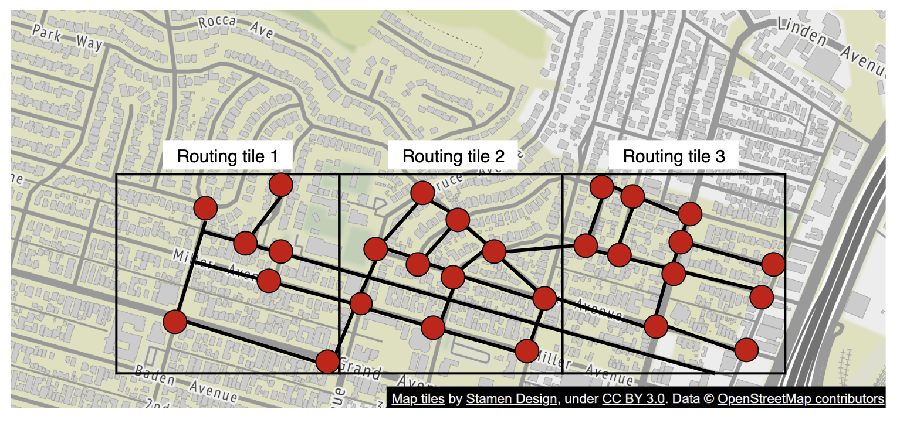
</p>

This technique enables us to significantly reduce memory bandwidth and only load the tiles we need for the given source/destination pair.

Note what the "references to neighboring tiles" are doing: they are the **stitching seams**. A road crossing a tile boundary must appear in both tiles, with each side carrying a pointer to the node in the adjacent tile, or the graph falls apart at every edge of every tile and no route would cross one. Boundary handling is not a detail here; it is what makes the subdivision legal.

However, for larger routes, stitching together small, detailed routing tiles would still be time/memory consuming. Instead, there are routing tiles with different level of detail and the algorithm uses the appropriately-detailed tiles, based on the destination we're headed for:

**This mirrors how a person navigates, which is a useful way to remember it.** To drive from a house in Lisbon to a house in Warsaw you do not plan every turn at uniform detail: you work out the local streets to the motorway, then think at motorway level across the continent, then local streets again at the far end. Hierarchical routing tiles encode exactly that — detailed tiles near the endpoints, coarse tiles (motorways only) in the middle:

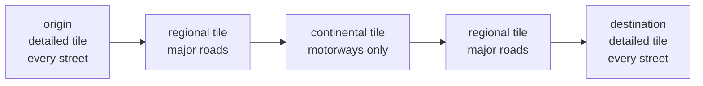
```mermaid
flowchart LR
    A["origin<br/>detailed tile<br/>every street"] --> B["regional tile<br/>major roads"]
    B --> C["continental tile<br/>motorways only"]
    C --> D["regional tile<br/>major roads"]
    D --> E["destination<br/>detailed tile<br/>every street"]
```

The number of tiles loaded grows with the **logarithm** of the distance rather than linearly, which is what brings a Lisbon-to-Warsaw query into the same cost bracket as a cross-town one. The cost is that a coarse layer omits roads, so a route that would genuinely be faster on a minor road across the middle of the continent will not be found — these systems trade a small amount of optimality for several orders of magnitude of speed, and that trade is deliberate.

<p align="left">
    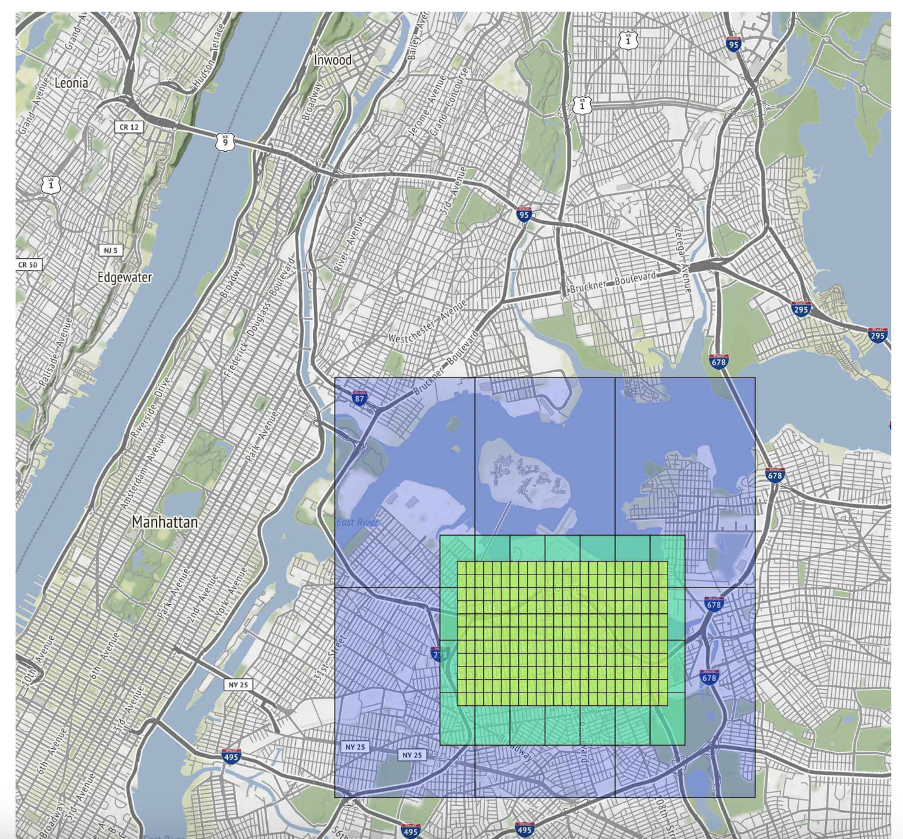
</p>

### **Back-of-the-envelope estimation**

For storage, we need to store:
 * map of the world - estimated as ~70pb based on all the tiles we need to store, but factoring in compression of very similar tiles (eg vast desert)
 * metadata - negligible in size, so we can skip it from calculation
 * Road info - stored as routing tiles

Estimated QPS for navigation requests - 1bil DAU at 35min of usage per week -> 5bil minutes per day. 
Assuming gps update requests are batched, we arrive at 200k QPS and 1mil QPS at peak load

### Reading these numbers together

| Workload | Scale | Shape | Where it goes |
|---|---|---|---|
| Map tiles | ~70 PB stored | Immutable, enormously skewed demand | Object storage behind a CDN |
| Routing tiles | TBs | Rebuilt offline, read-only at request time | Object storage, cached aggressively in-process |
| Navigation requests | 200 K QPS, 1 M peak | CPU-bound graph search | Stateless shortest-path fleet |
| Location updates | Continuous from every navigating user | Write-only, append-only | Cassandra; feeds traffic and analytics |

**The batching assumption deserves attention.** Sending every GPS reading individually would be both a far larger request rate and a serious battery cost — the radio waking repeatedly is more expensive than the GPS fix itself. Buffering readings on the device and sending them every few seconds is what makes 200 K QPS the number instead of something an order of magnitude higher, and it is a direct consequence of the "data and battery usage" requirement.

**Also note what location updates are really for.** They are stored for analytics, but their immediate purpose is to *be* the traffic signal: a million phones moving slowly along a motorway is how the system knows there is a jam. The users are the sensors, which is elegant, and has consequences — see the feedback loop in the gotchas.

---

## Step 2: Propose High-Level Design and Get Buy-In

<p align="left">
    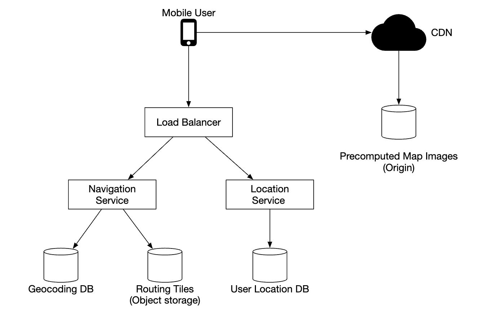
</p>

### **Location service**

<p align="left">
    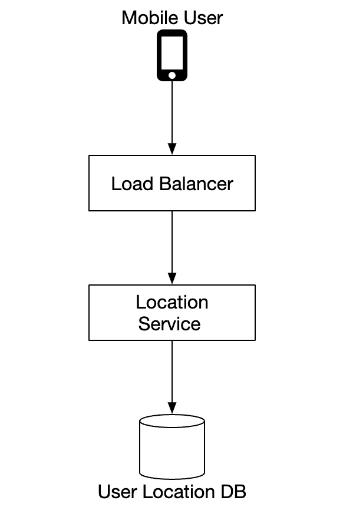
</p>

It is responsible for recording a user's location updates:
 * location updates are sent every `t` seconds
 * location data streams can be used to improve the service over time, eg provide more accurate ETAs, monitor traffic data, detect closed roads, analyze user behavior, etc

Instead of sending location updates to the server all the time, we can batch the updates on the client-side and send batches instead:

<p align="left">
    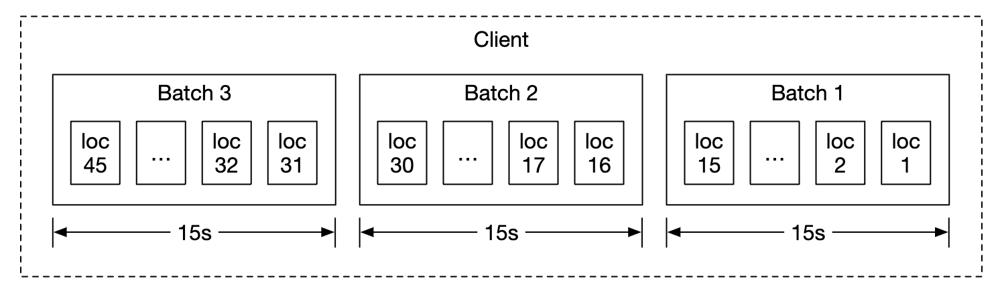
</p>

Despite this optimization, for a system of Google Maps scale, load will still be significant. Therefore, we can leverage a database, optimized for heavy writes such as Cassandra.

We can also leverage Kafka for efficient stream processing of location updates, meant for further analysis.

Example location update request payload:

```
POST /v1/locations
Parameters
  locs: JSON encoded array of (latitude, longitude, timestamp) tuples.
```

### **Navigation service**

This component is responsible for finding fast routes between A and B in a reasonable time (a little bit of latency is okay). Route need not be the fastest, but accuracy is important.

Example request payload:

```
GET /v1/nav?origin=1355+market+street,SF&destination=Disneyland
```

Example response:

```json
{
  "distance": {"text":"0.2 mi", "value": 259},
  "duration": {"text": "1 min", "value": 83},
  "end_location": {"lat": 37.4038943, "Ing": -121.9410454},
  "html_instructions": "Head <b>northeast</b> on <b>Brandon St</b> toward <b>Lumin Way</b><div style=\"font-size:0.9em\">Restricted usage road</div>",
  "polyline": {"points": "_fhcFjbhgVuAwDsCal"},
  "start_location": {"lat": 37.4027165, "lng": -121.9435809},
  "geocoded_waypoints": [
    {
       "geocoder_status" : "OK",
       "partial_match" : true,
       "place_id" : "ChIJwZNMti1fawwRO2aVVVX2yKg",
       "types" : [ "locality", "political" ]
    },
    {
       "geocoder_status" : "OK",
       "partial_match" : true,
       "place_id" : "ChIJ3aPgQGtXawwRLYeiBMUi7bM",
       "types" : [ "locality", "political" ]
    }
  ],
  "travel_mode": "DRIVING"
}
```

Traffic changes and reroutes are not taken into consideration yet, those will be tackled in the deep dive section.

### **Map rendering**

Holding the entire data set of mapping tiles on the client-side is not feasible as it's petabytes in size.

They need to be fetched on-demand from the server, based on the client's location and zoom level.

When should new tiles be fetched - while user is zooming in/out and during navigation, while they're going towards a new tile.

How should the map tiles be served to the client?
 * They can be built dynamically, but that puts a huge load on the server and also makes caching hard
 * Map tiles are served statically, based on their geohash, which a client can calculate. They can be statically stored & served from a CDN

<p align="left">
    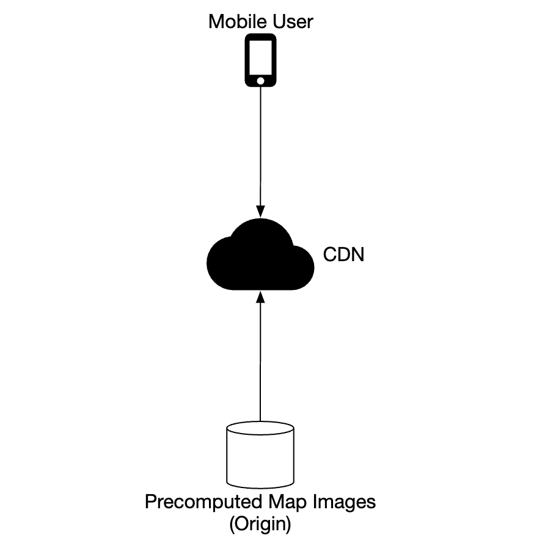
</p>

CDNs enable users to fetch map tiles from point-of-presence servers (POP) which are closest to users in order to minimize latency:

<p align="left">
    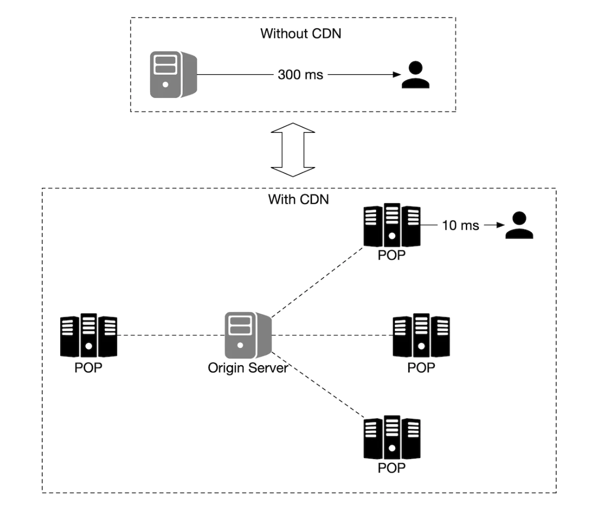
</p>

Options to consider for determining map tiles:
 * geohash for map tile can be calculated on the client-side. If that's the case, we should be careful that we commit to this type of map tile calculation for the long-term as forcing clients to update is hard
 * alternatively, we can have simple API which calculates the map tile URLs on behalf of the clients at the cost of additional API call

<p align="left">
    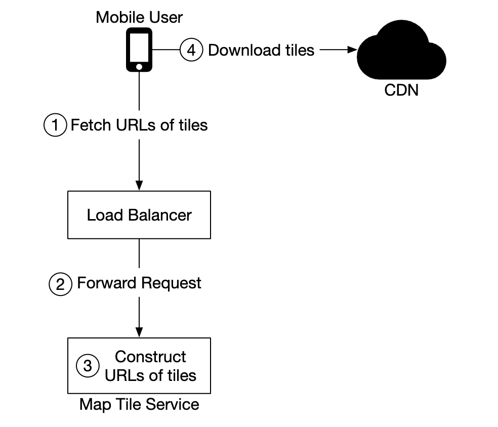
</p>

---

## Step 3: Design Deep Dive

### **Data model**

Let's discuss how we store the different types of data we're dealing with.

#### Routing tiles

Initial road data set is obtained from different sources. It is improved over time based on location updates data.

The road data is unstructured. We have a periodic offline processing pipeline, which transforms this raw data into the graph-based routing tiles our app needs.

Instead of storing these tiles in a database as we don't need any database features. We can store them in S3 object storage, while caching them aggressively.

We can also leverage libraries to compress adjacency lists into binary files efficiently.

#### User location data

User location data is very useful for updating traffic conditions and doing all sorts of other analysis.

We can use Cassandra for storing this kind of data as its nature is to be write-heavy.

Example row:

<p align="left">
    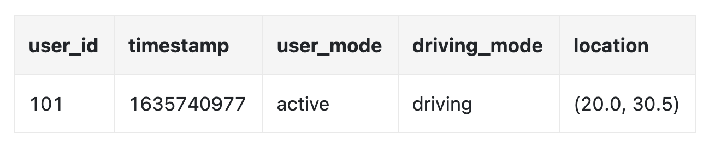
</p>

#### Geocoding database

This database stores a key-value pair of lat/long pairs and places.

We can use Redis for its fast read access speed, as we have frequent read and infrequent writes.

#### Precomputed images of the world map

As we discussed, we will precompute map tiling images and store them in CDN.

<p align="left">
    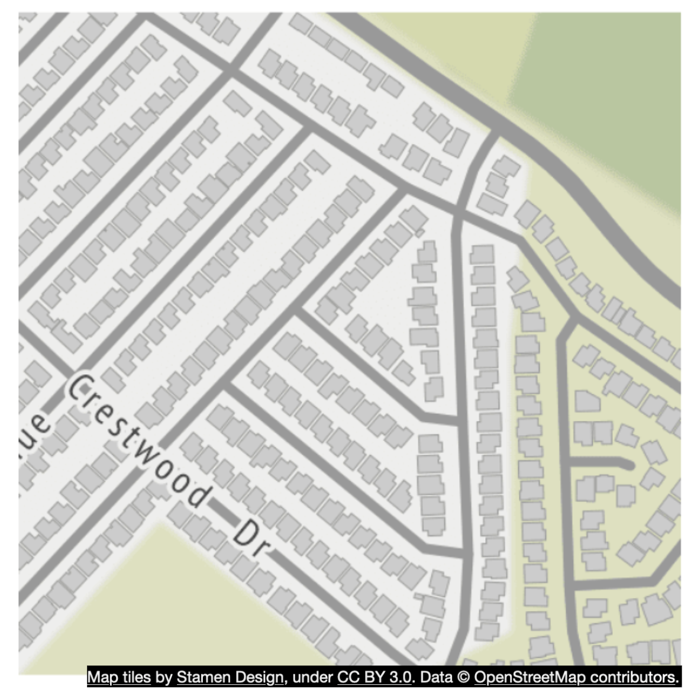
</p>

### **Services**

#### Location service

Let's focus on the database design and how user location is stored in detail for this service.

<p align="left">
    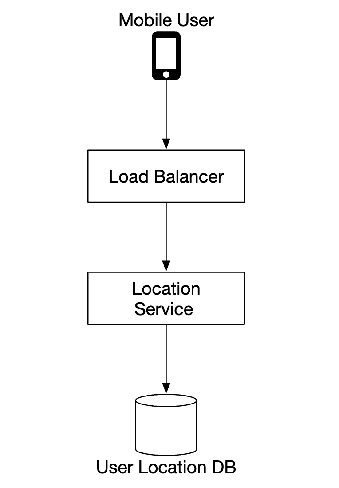
</p>

We can use a NoSQL database to facilitate the heavy write load we have on location updates. We prioritize availability over consistency as user location data often changes and becomes stale as new updates arrive.

We'll choose Cassandra as our database choice as it nicely fits all our requirements.

Example row we're going to store:

<p align="left">
    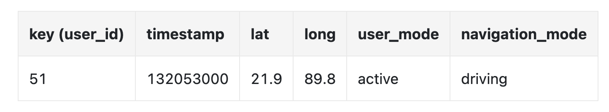
</p>

 * `user_id` is the partition key in order to quickly access all location updates for a particular user
 * `timestamp` is the clustering key in order to store the data sorted by the time a location update is received

We also leverage Kafka to stream location updates to various other service which need the location updates for various purposes:

<p align="left">
    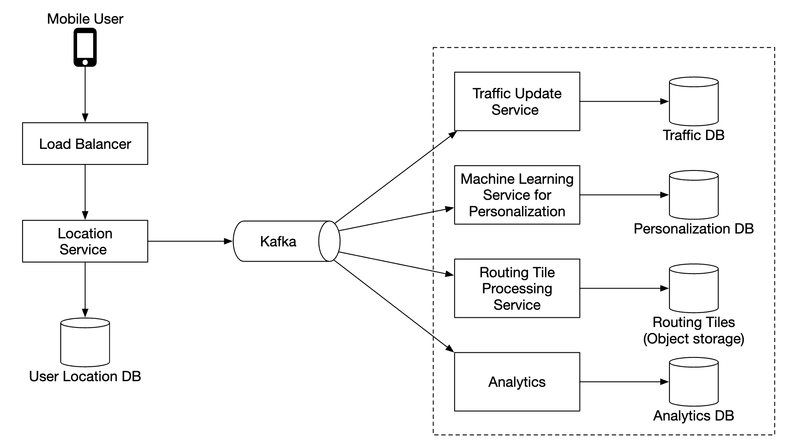
</p>

#### Rendering map

Map tiles are stored at various zoom levels. At the lowest zoom level, the entire world is represented by a single 256x256 tile.

As zoom levels increase, the number of map tiles quadruples:

<p align="left">
    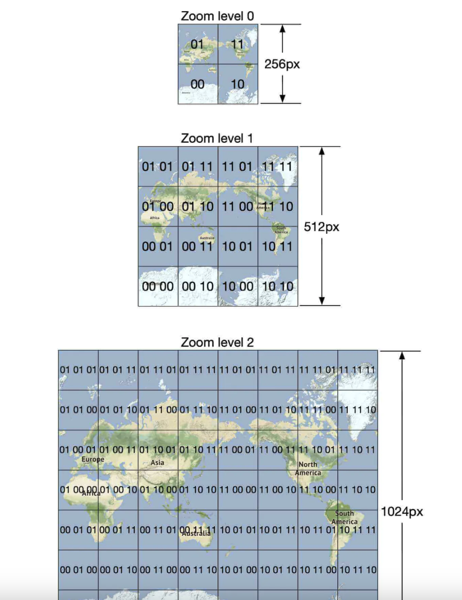
</p>

One optimization we can use is to not send the entire image information over the network, but instead represent tiles as vectors (paths & polygons) and let the client render the tiles dynamically.

This will have substantial bandwidth savings.

#### Navigation service

This service is responsible for finding the fastest routes:

<p align="left">
    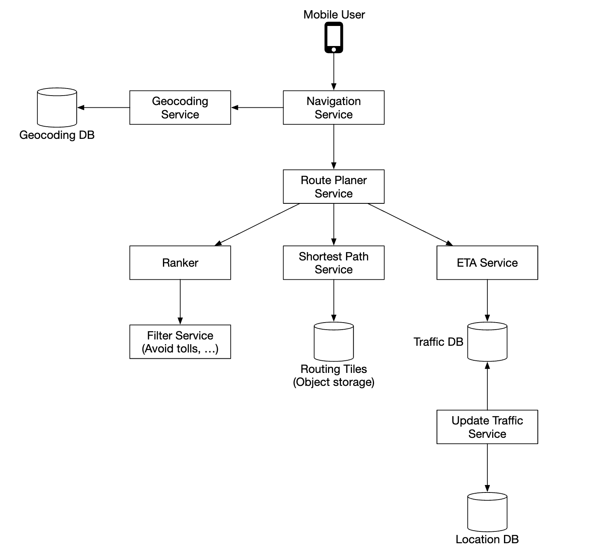
</p>

Let's go through each component in this sub-system.

First, we have the geocoding service which resolves an address to a location of lat/long pair.

Example request:

```
https://maps.googleapis.com/maps/api/geocode/json?address=1600+Amphitheatre+Parkway,+Mountain+View,+CA
```

Example response:

```json
{
   "results" : [
      {
         "formatted_address" : "1600 Amphitheatre Parkway, Mountain View, CA 94043, USA",
         "geometry" : {
            "location" : {
               "lat" : 37.4224764,
               "lng" : -122.0842499
            },
            "location_type" : "ROOFTOP",
            "viewport" : {
               "northeast" : {
                  "lat" : 37.4238253802915,
                  "lng" : -122.0829009197085
               },
               "southwest" : {
                  "lat" : 37.4211274197085,
                  "lng" : -122.0855988802915
               }
            }
         },
         "place_id" : "ChIJ2eUgeAK6j4ARbn5u_wAGqWA",
         "plus_code": {
            "compound_code": "CWC8+W5 Mountain View, California, United States",
            "global_code": "849VCWC8+W5"
         },
         "types" : [ "street_address" ]
      }
   ],
   "status" : "OK"
}
```

The route planner service computes a suggested route, optimized for travel time according to current traffic conditions.

The shortest-path service runs a variation of the A* algorithm against the routing tiles in object storage to compute an optimal path:
 * It receives the source/destination pairs, converts them to lat/long pairs and derives the geohashes from those pairs to derive the routing tiles
 * The algorithm starts from the initial routing tile and starts traversing it until a good enough path is found to the destination tile

<p align="left">
    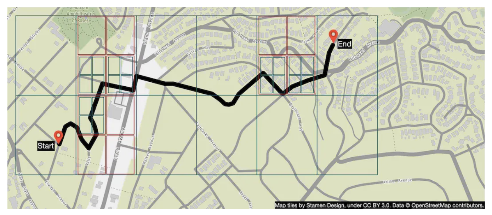
</p>

The ETA service is called by the route planner to get estimated time based on machine learning algorithms, predicting ETA based on traffic data.

**Why ETA needs a model rather than arithmetic, and why it is not simply "current traffic".** Summing each segment's current travel time would be wrong for any journey of length: by the time a driver reaches a motorway two hours into a trip, conditions there will have changed. The prediction must be of **conditions at the time of arrival at each segment**, which is a forecast, not a measurement — and that is what makes it a model rather than a sum. Historical patterns (this road is always slow at 17:30 on weekdays), live traffic, weather, incidents and road class all feed it.

This also creates a subtle circularity with routing: the graph's edge weights are the predicted travel times, so routing depends on ETA while ETA is computed over a route. In practice the search uses cheaper time-dependent weights and the ETA service produces the number shown to the user.

The ranker service is responsible to rank different possible paths based on filters, passed by the user, ie flags to avoid toll roads or freeways.

The updater service asynchronously updates some of the important databases to keep them up-to-date.

#### Improvement - adaptive ETA and rerouting

One improvement we can do is to adaptively update in-flight routes based on newly available traffic data.

One way to implement this is to store users who are currently navigating through a route in the database by storing all the tiles they're supposed to go through.

Data might look like this:

```
user_1: r_1, r_2, r_3, …, r_k
user_2: r_4, r_6, r_9, …, r_n
user_3: r_2, r_8, r_9, …, r_m
...
user_n: r_2, r_10, r21, ..., r_l
```

If a traffic accident happens on some tile, we can identify all users whose path goes through that tile and re-route them.

To reduce the amount of tiles we store in the database, we can instead store the origin routing tile and several routing tiles in different resolution levels until the destination tile is also included:

```
user_1, r_1, super(r_1), super(super(r_1)), ...
```

<p align="left">
    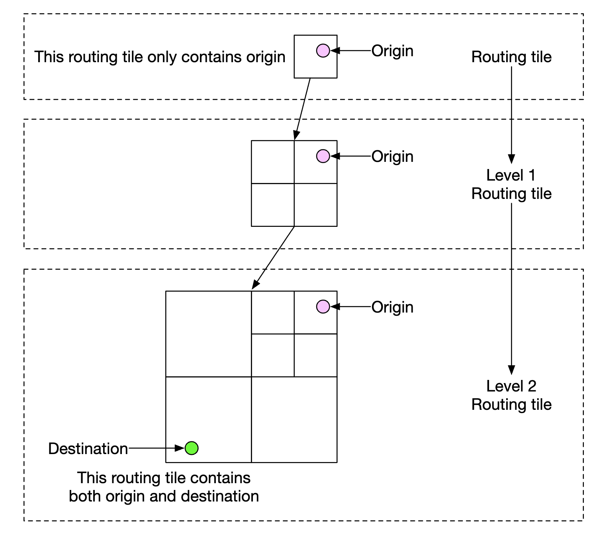
</p>

Using this, we only need to check if the final tile of a user includes the traffic accident tile to see if user is impacted.

**This is a cheap over-approximation followed by an exact check, which is a pattern worth recognising.** Storing `super(super(...r_1))` reduces thousands of fine tiles per user to a handful of coarse ones, so the containment test is cheap — but a coarse tile covering the accident does **not** mean the user's actual path goes through it. The coarse test yields **false positives and no false negatives**, exactly like the Bloom filters in [Chapter 6](../06.%20Key-Value%20Store/) and [Chapter 8](../08.%20URL%20Shortener/): it narrows a huge candidate set cheaply, and the survivors get the expensive precise check against their real route.

The economics are what make it worthwhile. An incident affects a tiny area; without the coarse index you would examine every navigating user's full path on every incident. With it you examine a small shortlist and only they pay for exact evaluation.

We can also keep track of all possible routes for a navigating user and notify them if a faster re-route is available.

#### Delivery protocols

We have several options, which enable us to proactively push data to clients from the server:
 * Mobile push notifications don't work because payload is limited and it's not available for web apps
 * WebSocket is generally a better option than long-polling as it has less compute footprint on servers
 * We can also use server-sent events (SSE) but lean towards web sockets as they support bi-directional communication which can come in handy for eg a last-mile delivery feature

This is the third time these notes work through the same protocol comparison, and the three answers differ because the traffic profiles differ — worth holding together:

| Chapter | Traffic shape | Choice |
|---|---|---|
| [12 – Chat](../12.%20Chat%20System/#choosing-the-receive-channel) | Continuous, both directions | WebSocket |
| [15 – Drive](../15.%20Google%20Drive/#notification-service) | Rare, server → client only | Long polling |
| **18 – Maps (navigating)** | Frequent both ways *while navigating*, nothing otherwise | WebSocket during a session |

The distinguishing feature here is that the connection is **session-scoped**: it exists only while someone is actively navigating, not for every daily active user. That is what keeps the stateful-connection count manageable at 1 billion DAU — you are holding connections for drivers in progress, not for the whole user base.

> **Interview angle:** three questions carry this chapter. "Why can't you run Dijkstra on the world graph?" — it explores outward over hundreds of millions of nodes, at 1 M QPS. "What does hierarchy buy you?" — tiles loaded grow with the log of distance, at the cost of some optimality. "How do you reroute everyone affected by an accident without scanning every user's path?" — coarse super-tile containment as a cheap over-approximation, then an exact check.

---

### Gotchas & failure modes

- **Raster tiles multiply with every style and language.** 70 PB × dark mode × 40 languages × satellite/terrain is untenable. Vector tiles collapse the multiplier by rendering on the device — and spend battery doing it, which is the stated non-functional requirement in direct tension with itself.
- **Each zoom level quadruples the tile count.** Deep zoom is only affordable because most of the planet has nothing to show at that resolution. Generating uniformly to zoom 21 would be impossible.
- **A map update means invalidating tiles across the CDN.** Tiles are cached everywhere by design, so a changed road is not visible until caches turn over. Versioning the tile URL is the usual answer, because it sidesteps invalidation entirely — at the cost of not reusing the old cached copies.
- **Routing tiles must overlap at their seams.** A road crossing a boundary has to exist in both tiles with cross-references, or no route can leave a tile.
- **A node-and-edge graph cannot express turn restrictions.** "No left turn here", "no U-turn", "this turn takes 90 seconds at rush hour" are properties of a *transition between edges*, not of a node or an edge. Representing them needs an edge-based graph (nodes are road segments, edges are legal turns) or explicit turn-cost tables. A naive intersection graph will happily route drivers through illegal turns — one of the most common real bugs in routing systems.
- **An inadmissible A* heuristic silently returns wrong routes.** Over-estimating remaining cost makes the search faster and the answer incorrect, with no error raised. Use straight-line distance ÷ maximum speed.
- **Hierarchical routing gives up some optimality.** Coarse layers omit minor roads, so an unusually good back route across the middle of a long journey will not be discovered. This is a deliberate trade, and worth stating as one.
- **ETA must predict conditions at arrival, not report conditions now.** Summing current segment times is wrong for any long trip.
- **Rerouting is a feedback loop with real-world consequences.** Diverting thousands of drivers off a jammed motorway creates a jam on the side street you sent them to — and generates genuine complaints from residents of quiet roads suddenly carrying motorway traffic. The system's outputs change its own inputs.
- **GPS is wrong in exactly the places navigation matters most.** Urban canyons, tunnels, multi-level interchanges and car parks give readings tens of metres off, or none at all. **Map matching** — snapping a noisy trace to the most plausible road, usually with a hidden Markov model over candidate segments — is a required component, not an optimisation, and dead reckoning covers tunnels.
- **A stale or mismatched position produces confidently wrong instructions.** "Turn right now" delivered 50 metres late is worse than no instruction. Accuracy is the first non-functional requirement for this reason.
- **Battery and radio, not CPU, are the mobile constraints.** Waking the radio for each GPS reading costs more than the fix; hence batched uploads, and hence the 200 K QPS figure.
- **Offline maps are a separate product.** Downloading a region means shipping vector tiles *and* routing tiles and running the search on the device — a different engine with different data, not a cache of the online one.
- **Location history is a surveillance dataset.** Continuous position traces for a billion users are the most sensitive data in these notes. Aggregation for traffic should not require retaining identifiable individual traces, and retention limits and opt-out are part of the design rather than a compliance step afterwards.
- **A billion DAU does not mean a billion connections.** Only actively navigating users hold a socket. Conflating the two over-sizes the stateful tier by orders of magnitude.

---

## The design, as problem and technique

| Goal / problem | Technique |
|---|---|
| Serving a 70 PB map | Precomputed `(z, x, y)` tiles in object storage behind a CDN; fetch only visible tiles |
| Correct-looking turns on a flat map | Web Mercator — conformal, and maps the world to a square for clean tiling |
| Storage multiplying per style and language | Vector tiles rendered on the device |
| A road graph too large to search | Hierarchical routing tiles; load only what the route needs |
| Long routes staying cheap | Coarse tiles in the middle, detailed tiles at the ends — log growth with distance |
| Crossing tile boundaries | Overlapping seams with cross-tile node references |
| Pruning the search | A* with an admissible heuristic (straight-line distance ÷ max speed) |
| Legal turns and turn delays | Edge-based graph or explicit turn costs, not a plain intersection graph |
| Realistic arrival times | ML model predicting conditions at time of arrival per segment |
| Knowing about traffic at all | Users' batched location updates as the sensor network |
| Rerouting only affected drivers | Coarse super-tile containment as a cheap filter, then exact path check |
| Pushing route changes to drivers | Session-scoped WebSocket while navigating |
| Noisy GPS | Map matching onto road segments; dead reckoning in tunnels |
| Battery and data budget | Batched location uploads; vector tiles; fetch only visible tiles |
| Raw road data from many sources | Offline pipeline producing routing tiles, improved by location data over time |

## Self-check
1. Name the three largely independent systems inside "Google Maps", and the one technique common to all of them.
2. Why do maps use a projection that makes Greenland look enormous?
3. How many tiles exist at zoom 21, and why is 70 PB plausible rather than the ~100+ PB the raw count suggests?
4. What exactly do vector tiles save, and what do they cost?
5. Why is Dijkstra unusable here? Quantify both sides of the problem.
6. What makes an A* heuristic admissible, and what happens if it isn't?
7. What does hierarchical routing do to the number of tiles loaded as route length grows, and what does it sacrifice?
8. Why must routing tiles overlap at their edges?
9. Why can't a graph of intersections-as-nodes express "no left turn"?
10. Why is ETA a prediction rather than a sum of current segment times?
11. An accident blocks one tile. How do you find the affected drivers without examining every user's full route? What error does the cheap check make, and in which direction?
12. Chapters 12, 15 and 18 each pick a different push protocol. What distinguishes this chapter's traffic profile?
13. Why does 1 billion DAU not imply 1 billion persistent connections?

## Glossary

| Term | Meaning |
|---|---|
| **Map projection** | Flattening a sphere onto a plane; always distorts something |
| **Web Mercator** | Conformal projection mapping the world to a square — the basis of standard tiling |
| **Tile `(z, x, y)`** | A square map cell addressed by zoom level and position; each level quadruples the count |
| **Raster vs vector tile** | A pre-rendered image vs geometry rendered on the device |
| **Routing tile** | A subgraph of the road network for one area, with references to its neighbours |
| **Tile hierarchy** | Coarser routing tiles containing only major roads, used for the middle of long routes |
| **Geocoding** | Translating a place or address to coordinates (and reverse geocoding, the inverse) |
| **A\*** | Dijkstra plus a heuristic estimate of remaining cost; requires admissibility for correctness |
| **Admissible heuristic** | One that never over-estimates remaining cost |
| **Contraction hierarchies** | Precomputed shortcut edges making continental routing feasible |
| **Edge-based graph** | Road segments as nodes and legal turns as edges, so turn restrictions are expressible |
| **Map matching** | Snapping a noisy GPS trace to the most likely road segments |
| **Dead reckoning** | Estimating position from speed and heading when GPS is unavailable |
| **Adaptive ETA / rerouting** | Revising in-flight routes as traffic changes |
| **Super-tile containment** | The coarse, false-positive-only test for whether a route may pass through an area |

## Where to go next
- [Chapter 16 – Proximity Service](../16.%20Proximity%20Service/) — geohash, quadtrees and S2, the spatial indexing this chapter assumes you know.
- [Chapter 17 – Nearby Friends](../17.%20Nearby%20Friends/) — the location-ingest half of this chapter, treated as its own system.
- [Chapter 1 §7 – Content Delivery Network](../01.%20Scaling/#section-7-content-delivery-network-cdn) — tile serving and the invalidation problem that comes with it.
- [Chapter 24 – S3-like Object Storage](../24.%20S3-like%20Object%20Storage/) — where 70 PB of tiles and the routing tiles actually live.
- [Chapter 6 – Design A Key-Value Store](../06.%20Key-Value%20Store/) — the cheap-over-approximation-then-exact-check pattern, in its original Bloom filter form.
- [Google S2 Geometry](https://s2geometry.io/) — the cell system underneath much of this.
---

## Step 4: Wrap Up

This is our final design:

<p align="left">
    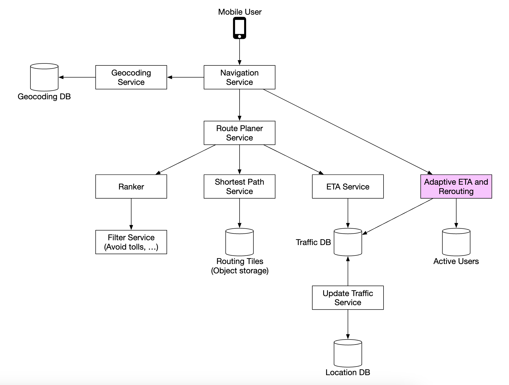
</p>

One additional feature we could provide is multi-stop navigation which can be sold to enterprise customers such as Uber or Lyft in order to determine optimal path for visiting a set of locations.
