# Chapter 19: Distributed Message Queue

## Introduction

We'll be designing a **distributed message queue** in this chapter.

Benefits of message queues:
- **Decoupling**: Eliminates tight coupling between components. Let them update separately.
- **Improved scalability**: Producers and consumers can be scaled independently based on traffic.
- **Increased availability**: If one part of the system goes down, other parts continue interacting with the queue.
- **Better performance**: Producers can produce messages without waiting for consumer confirmation.

Some popular message queue implementations - Kafka, RabbitMQ, RocketMQ, Apache Pulsar, ActiveMQ, ZeroMQ.

Strictly speaking, Kafka and Pulsar are not message queues. They are event streaming platforms.
There is however a convergence of features which blurs the distinction between message queues and event streaming platforms.

In this chapter, we'll be building a message queue with support for more advanced features such as long data retention, repeated message consumption, etc.

**The one-sentence version:** what this chapter actually designs is **a distributed, replicated, append-only log** — not a queue. A queue is a collection you remove things from; a log is a file you append to, and readers track their own position in it. Every distinctive feature in the requirements falls out of that one substitution:

| Requirement | Why the log gives it to you for free |
|---|---|
| Two weeks of retention | Nothing is ever deleted on consumption; deletion is a separate time-based policy |
| Repeated consumption | A reader's position is just a number; rewind it and read again |
| Multiple independent consumers | Each group keeps its own offset; storage cost does not change |
| Order preservation | A file has an intrinsic order, and offsets *are* that order |
| High throughput | Appending to a file is sequential I/O, which is 2–3 orders of magnitude faster than random |

The deepest consequence is this: **the consumer's offset is the only mutable state in the system.** Messages are immutable, segments are immutable once rolled, and the broker holds no per-consumer bookkeeping about what has been delivered. That is what makes brokers cheap, replay free, and adding a new consumer group a zero-cost operation.

| | Traditional queue (point-to-point) | Log (this design) |
|---|---|---|
| Storage model | Mutable collection; consume = remove | Append-only file; consume = advance a cursor |
| After consumption | Message is gone | Message is still there until retention expires |
| Mutable state | Per-message delivery state in the broker | **One offset per consumer group** |
| Replay | Impossible | Reset the offset |
| Second consumer of the same data | Needs a copy of the message | Costs nothing |
| Ordering | Best-effort at most | Guaranteed within a partition |
| Per-message operations | Acknowledge, delete, requeue, priority | None — the log is immutable |

The things in the last row are what you give up, and they are real: a log cannot requeue one message, cannot delete one message, and has no notion of per-message priority.

---

## Step 1: Understand the Problem and Establish Design Scope

Message queues ought to support few basic features - producers produce messages and consumers consume them.
There are, however, different considerations with regards to performance, message delivery, data retention, etc.

Here's a set of potential questions between Candidate and Interviewer:
 * C: What's the format and average message size? Is it text only?
 * I: Messages are text-only and usually a few KBs
 * C: Can messages be repeatedly consumed?
 * I: Yes, messages can be repeatedly consumed by different consumers. This is an added requirement, which traditional message queues don't support.
 * C: Are messages consumed in the same order they were produced?
 * I: Yes, order guarantee should be preserved. This is an added requirement, traditional message queues don't support this.
 * C: What are the data retention requirements?
 * I: Messages need to have a retention of two weeks. This is an added requirement.
 * C: How many producers and consumers do we want to support?
 * I: The more, the better.
 * C: What data delivery semantic do we want to support? At-most-once, at-least-once, exactly-once?
 * I: We definitely want to support at-least-once. Ideally, we can support all and make them configurable.
 * C: What's the target throughput for end-to-end latency?
 * I: It should support high throughput for use cases like log aggregation and low throughput for more traditional use cases.

### **Functional requirements**

 * Producers send messages to a message queue
 * Consumers consume messages from the queue
 * Messages can be consumed once or repeatedly
 * Historical data can be truncated
 * Message size is in the KB range
 * Order of messages needs to be preserved
 * Data delivery semantics is configurable - at-most-once/at-least-once/exactly-once.

### **Non-functional requirements**

- **High throughput or low latency**: Configurable based on use-case
- **Scalable**: system should be distributed and support a sudden surge in message volume
- **Persistent and durable**: data should be persisted on disk and replicated among nodes

Traditional message queues typically don't support data retention and don't provide ordering guarantees. This greatly simplifies the design and we'll discuss it.

### The number that justifies the whole storage design

The chapter later says it is a misconception that disks are slow. It is worth quantifying, because the gap is the entire reason this design works:

| Access pattern | HDD throughput | Messages/sec at ~4 KB each |
|---|---|---|
| Random 4 KB I/O | ~0.4–1 MB/s (a few hundred IOPS) | **~100–250** |
| **Sequential** | **~100–200 MB/s** | **~25,000–50,000 per disk** |

That is a **two-to-three order of magnitude** difference on the same hardware, and it is not much narrower on SSDs. "Is the disk fast?" is the wrong question; "is the access pattern sequential?" is the right one. A database storing messages in a B-tree does random I/O and lands in the top row. An append-only log does sequential I/O and lands in the bottom row — which is why the answer to "what database should hold the messages?" is "none".

Two further multipliers stack on top:

- **Batching** amortises the fixed costs. A network round trip and a syscall cost roughly the same whether they carry one message or a thousand, so batching 100 messages per request divides per-message overhead by 100 — at the cost of waiting for the batch to fill, which is the latency/throughput dial the chapter returns to repeatedly.
- **Zero-copy** removes the data from the CPU's path entirely. Because the message format is identical on the wire, on disk and in the consumer, the broker never has to parse or re-serialise anything: it can hand a byte range from the OS page cache straight to a socket (`sendfile`) without copying it into user space. This is what the chapter means by "immutable to avoid extra copying", and it is why a broker can saturate a network interface while barely using its CPU. It also explains a design constraint that otherwise looks like fussiness — **the moment the broker needs to understand message contents, zero-copy is lost**, which is the real cost of the payload-based filtering discussed near the end.

> **Interview angle:** leading with "I'd build this as a replicated append-only log rather than a queue, because the retention and replay requirements make the offset the only mutable state" frames the entire design in one sentence. Then quantify sequential versus random I/O — that number is why the design is allowed to be this simple.

---

## Step 2: Propose High-Level Design and Get Buy-In

Key components of a message queue:

    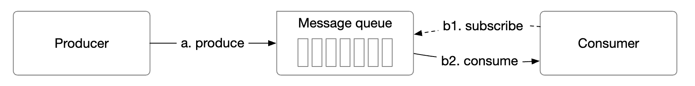

 * Producer sends messages to a queue
 * Consumer subscribes to a queue and consumes the subscribed messages
 * Message queue is a service in the middle which decouples producers from consumers, letting them scale independently.
 * Producer and consumer are both clients, while the message queue is the server.

### **Messaging models**

The first type of messaging model is point-to-point and it's commonly found in traditional message queues:

    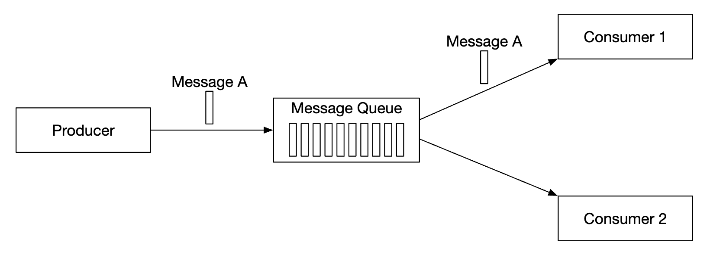

 * A message is sent to a queue and it's consumed by exactly one consumer.
 * There can be multiple consumers, but a message is consumed only once.
 * Once message is acknowledged as consumed, it is removed from the queue.
 * There is no data retention in the point-to-point model, but there is such in our design.

On the other hand, the publish-subscribe model is more common for event streaming platforms:

    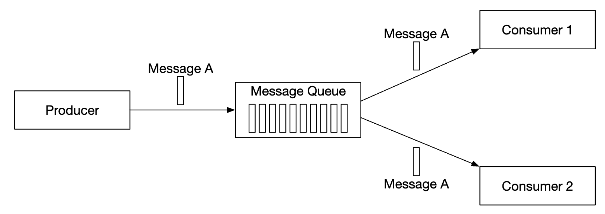

 * In this model, messages are associated to a topic.
 * Consumers are subscribed to a topic and they receive all messages sent to this topic.

### **Topics, partitions and brokers**

What if the data volume for a topic is too large? One way to scale is by splitting a topic into partitions (aka sharding):

    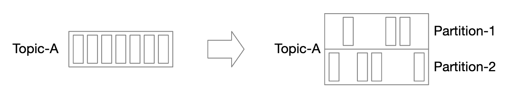

 * Messages sent to a topic are evenly distributed across partitions
 * The servers that host partitions are called brokers
 * Each topic operates like a queue using FIFO for message processing. Message order is preserved within a partition.
 * The position of a message within the partition is called an **offset**.

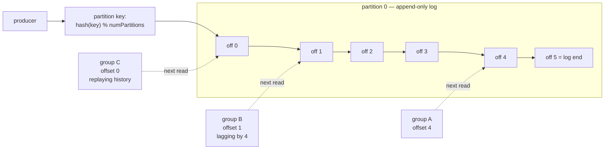
```mermaid
flowchart LR
    P1["producer"] --> K["partition key:<br/>hash(key) % numPartitions"]
    K --> M0
    subgraph LOG["partition 0 — append-only log"]
        direction LR
        M0["off 0"] --> M1["off 1"] --> M2["off 2"] --> M3["off 3"] --> M4["off 4"] --> M5["off 5 = log end"]
    end
    GA["group A<br/>offset 4"] -.->|"next read"| M4
    GB["group B<br/>offset 1<br/>lagging by 4"] -.->|"next read"| M1
    GC["group C<br/>offset 0<br/>replaying history"] -.->|"next read"| M0
```

Three consumer groups, one copy of the data, three independent positions. Group B is **lagging** by four messages; group C has reset its offset to replay history. Nothing about the log changes to accommodate any of them — which is the property that makes retention, replay and multi-consumer fan-out all the same feature.
 * Each message produced is sent to a specific partition. A partition key specifies which partition a message should land in. 
   * Eg a `user_id` can be used as a partition key to guarantee order of messages for the same user.
 * Each consumer subscribes to one or more partitions. When there are multiple consumers for the same messages, they form a consumer group.

**The partition is the unit of everything**, and recognising that resolves most confusion about this system:

| Property | Scope |
|---|---|
| Ordering guarantee | **Within one partition only** — never across a topic |
| Parallelism | One partition per consumer in a group; partitions cap consumer count |
| Offset | Per partition, per consumer group |
| Replication | Per partition (one leader, N followers) |
| Storage | Per partition, as a series of segment files |

So **order and parallelism are in direct tension, and partition count is the dial between them.** Total ordering across a topic requires exactly one partition, which means exactly one consumer and no scaling at all. The usual resolution is to accept *per-key* ordering instead: partition by `user_id` and all events for one user are ordered, while different users proceed in parallel. That is almost always what the business requirement actually needs, and converting "we need ordering" into "we need ordering per entity" is the key move.

The partition key therefore decides two things at once: **what is ordered** and **how evenly load is spread.** Choosing a key with few distinct values, or one dominated by a handful of hot entities, produces a hot partition that no amount of broker capacity fixes — and the ordering guarantee prevents you from spreading that key's messages out, because that is exactly what it promises not to do.

### **Consumer groups**

Consumer groups are a set of consumers working together to consume messages from a topic:

    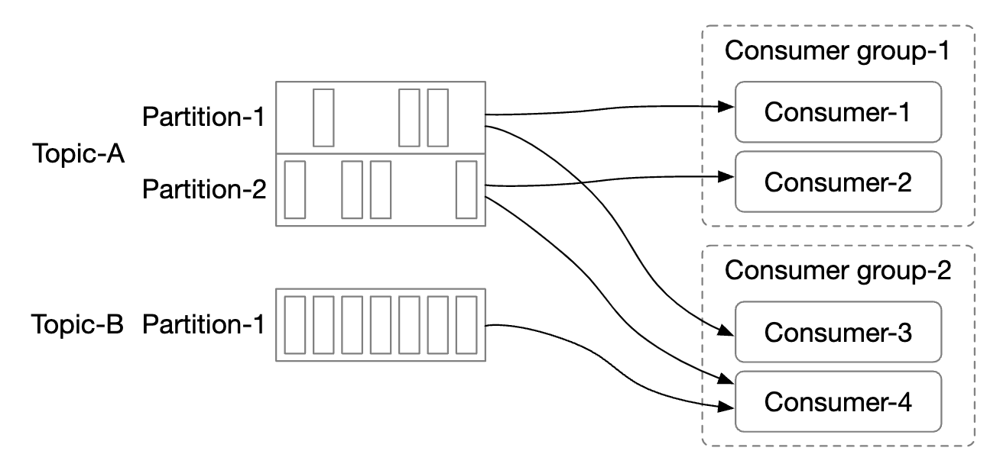

 * Messages are replicated per consumer group (not per consumer).
 * Each consumer group maintains its own offset.
 * Reading messages in parallel by a consumer group improves throughput but hampers the ordering guarantee.
 * This can be mitigated by only allowing one consumer from a group to be subscribed to a partition. 
 * This means that we can't have more consumers in a group than there are partitions.

### **High-level architecture**

    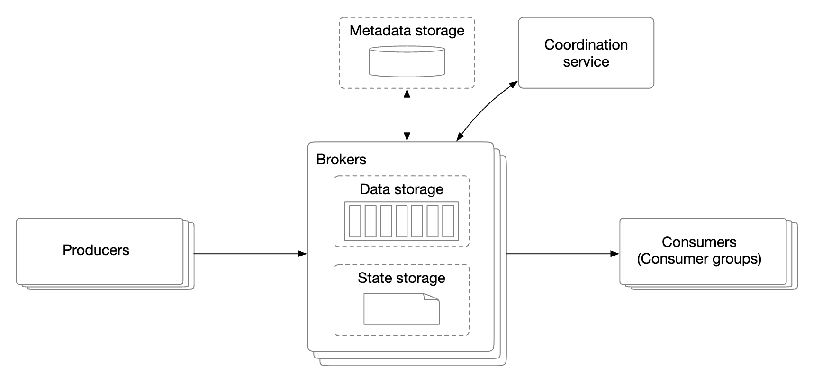

- **Clients**: producer and consumer. Producer pushes messages to a designated topic. Consumer group subscribes to messages from a topic.
- **Brokers**: hold multiple partitions. A partition holds a subset of messages for a topic.
- **Data storage**: stores messages in partitions.
- **State storage**: keeps the consumer states.
- **Metadata storage**: stores configuration and topic properties
- **Coordination service**: responsible for service discovery (which brokers are alive) and leader election (which broker is leader, responsible for assigning partitions).

---

## Step 3: Design Deep Dive

In order to achieve high throughput and preserve the high data retention requirement, we made some important design choices:
 * We chose an on-disk data structure which takes advantage of the properties of modern HDD and disk caching strategies of modern OS-es.
 * The message data structure is immutable to avoid extra copying, which we want to avoid in a high volume/high traffic system.
 * We designed our writes around batching as small I/O is an enemy of high throughput.

### **Data storage**

In order to find the best data store for messages, we must examine a message's properties:
 * Write-heavy, read-heavy
 * No update/delete operations. In traditional message queues, there is a "delete" operation as messages are not retained.
 * Predominantly sequential read/write access pattern.

What are our options:
- **Database**: not ideal as typical databases don't support well both write and read heavy systems.
- **Write-ahead log (WAL)**: a plain text file which only supports appending to it and is very HDD-friendly. 
  * We split partitions into segments to avoid maintaining a very large file.
  * Old segments are read-only. Writes are accepted by latest segment only.

    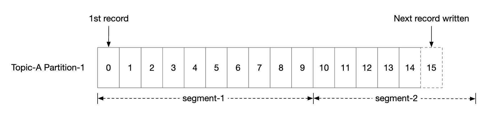

WAL files are extremely efficient when used with traditional HDDs. 

There is a misconception that HDD access is slow, but that hugely depends on the access pattern.
When the access pattern is sequential (as in our case), HDDs can achieve several MB/s write/read speed which is sufficient for our needs.
We also piggyback on the fact that the OS caches disk data in memory aggressively.

### **Message data structure**

It is important that the message schema is compliant between producer, queue and consumer to avoid extra copying. This allows much more efficient processing.

Example message structure:

    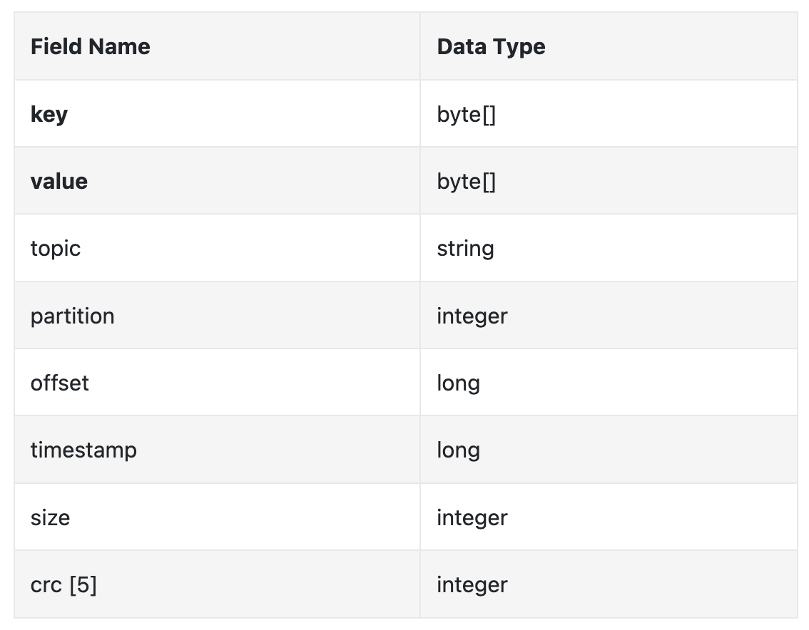

The key of the message specifies which partition a message belongs to. An example mapping is `hash(key) % numPartitions`.
For more flexibility, the producer can override default keys in order to control which partitions messages are distributed to.

The message value is the payload of a message. It can be plaintext or a compressed binary block.

**Note:** Message keys, unlike traditional KV stores, need not be unique. It is acceptable to have duplicate keys and for it to even be missing.

Other message fields:
- **Topic**: topic the message belongs to
- **Partition**: The ID of the partition a message belongs to
- **Offset**: The position of the message in a partition. A message can be located via `topic`, `partition`, `offset`.
- **Timestamp**: When the message is stored
- **Size**: the size of this message
- **CRC**: checksum to ensure message integrity

Additional features such as filtering can be supported by adding additional fields.

### **Batching**

Batching is critical for the performance of our system. We apply it in the producer, consumer and message queue.

It is critical because:
 * It allows the operating system to group messages together, amortizing the cost of expensive network round trips
 * Messages are written to the WAL in groups sequentially, which leads to a lot of sequential writes and disk caching.

There is a trade-off between latency and throughput:
 * High batching leads to high throughput and higher latency. 
 * Less batching leads to lower throughput and lower latency.

If we need to support lower latency since the system is deployed as a traditional message queue, the system could be tuned to use a smaller batch size.

If tuned for throughput, we might need more partitions per topic to compensate for the slower sequential disk write throughput.

### **Producer flow**

If a producer wants to send a message to a partition, which broker should it connect to?

One option is to introduce a routing layer, which route messages to the correct broker. If replication is enabled, the correct broker is the leader replica:

    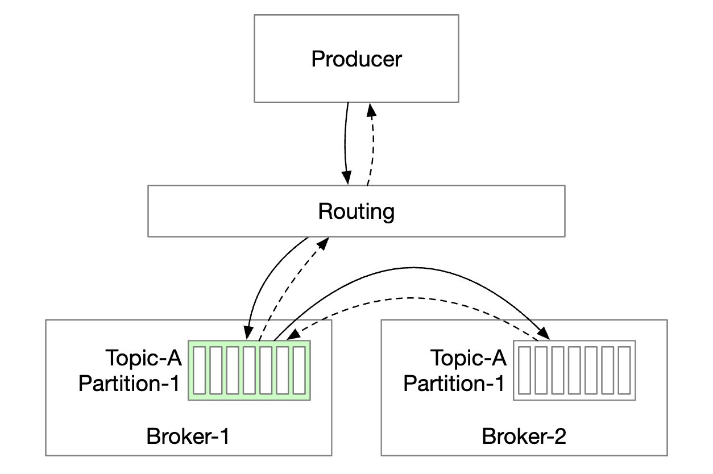

 * Routing layer reads the replication plan from the metadata store and caches it locally.
 * Producer sends a message to the routing layer.
 * Message is forwarded to broker 1 who is the leader of the given partition
 * Follower replicas pull the new message from the leader. Once enough confirmations are received, the leader commits the data and responds to the producer.

The reason for having replicas is to enable fault tolerance.

This approach works but has some drawbacks:
 * Additional network hops due to the extra component
 * The design doesn't enable batching messages

To mitigate these issues, we can embed the routing layer into the producer:

    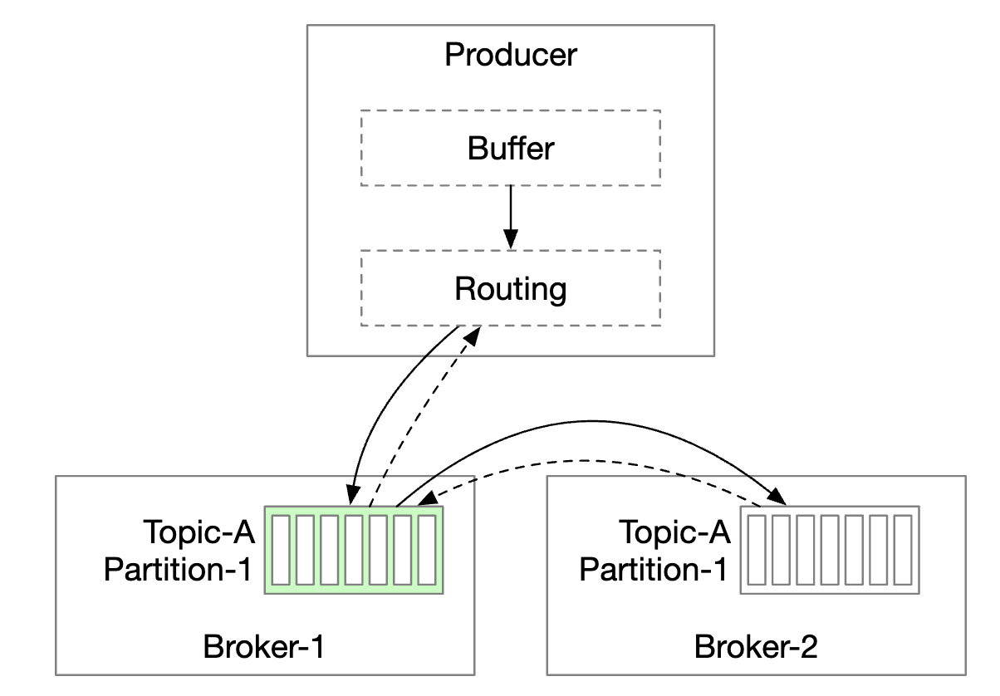

 * Fewer network hops lead to lower latency
 * Producers can control which partition a message is routed to
 * The buffer allows us to batch messages in-memory and send out larger batches in a single request, which increases throughput.

The batch size choice is a classical trade-off between throughput and latency. 

    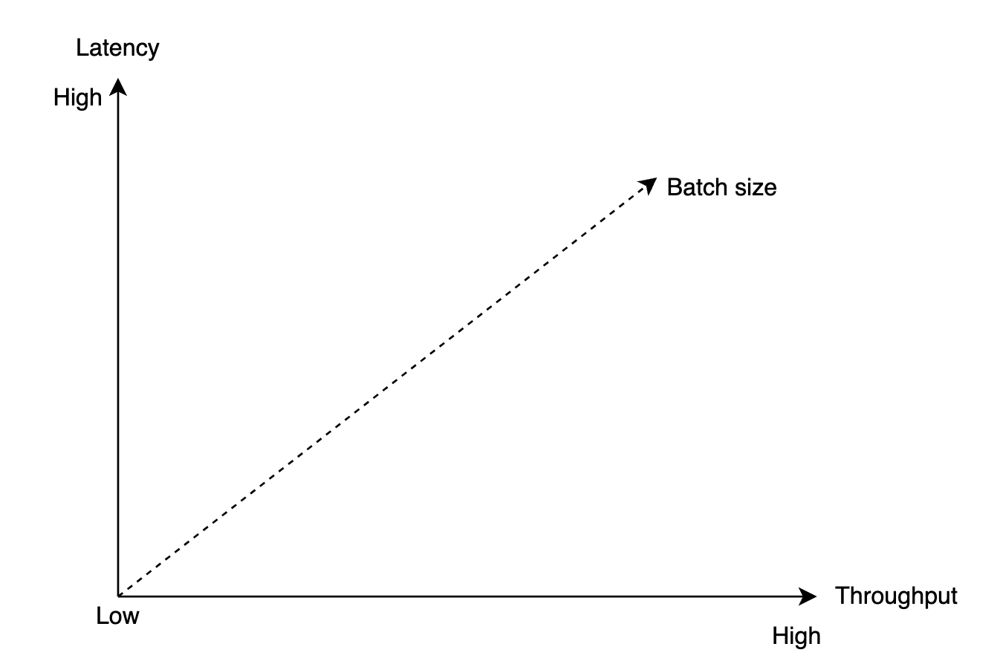

 * Larger batch size leads to longer wait time before batch is committed. 
 * Smaller batch size leads to request being sent sooner and having lower latency but lower throughput.

### **Consumer flow**

The consumer specifies its offset in a partition and receives a chunk of messages, beginning from that offset:

    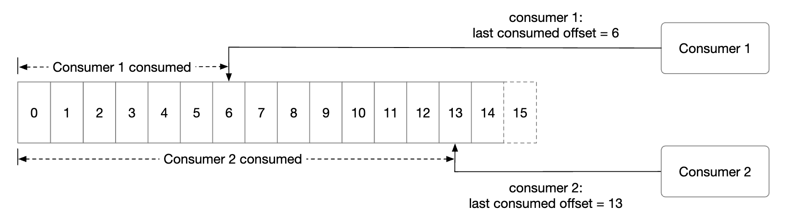

One important consideration when designing the consumer is whether to use a push or a pull model:
- **Push model**: leads to lower latency as broker pushes messages to consumer as it receives them.
  * However, if rate of consumption falls behind the rate of production, the consumer can be overwhelmed.
  * It is challenging to deal with consumers with varying processing power as the broker controls the rate of consumption.
- **Pull model**: leads to the consumer controlling the consumption rate. 
  * If rate of consumption is slow, consumer will not be overwhelmed and we can scale it to catch up.
  * The pull model is more suitable for batch processing, because with the push model, the broker can't know how many messages a consumer can handle. 
  * With the pull model, on the other hand, consumers can aggressively fetch large message batches.
  * The down side is the higher latency and extra network calls when there are no new messages. Latter issue can be mitigated using long polling.

Hence, most message queues (and us) choose the pull model.

    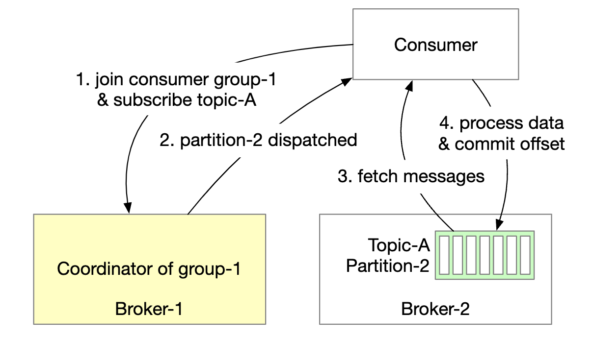

 * A new consumer subscribes to topic A and joins group 1.
 * The correct broker node is found by hashing the group name. This way, all consumers in a group connect to the same broker.
 * Note that this consumer group coordinator is different from the coordination service (ZooKeeper).
 * Coordinator confirms that the consumer has joined the group and assigns partition 2 to that consumer.
 * There are different partition assignment strategies - round-robin, range, etc.
 * Consumer fetches latest messages from the last offset. The state storage keeps the consumer offsets.
 * Consumer processes messages and commits the offset to the broker. The order of those operations affects the message delivery semantics.

### **Consumer rebalancing**

Consumer rebalancing is responsible for deciding which consumers are responsible for which partition.

This process occurs when a consumer joins/leaves or a partition is added/removed.

The broker, acting as a coordinator plays a huge role in orchestrating the rebalancing workflow.

    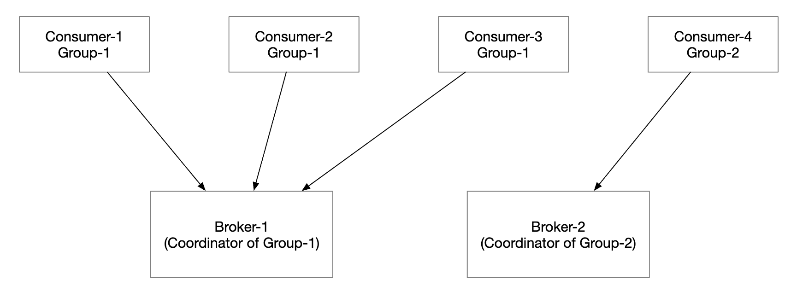

 * All consumers from the same group are connected to the same coordinator. The coordinator is found by hashing the group name.
 * When the consumer list changes, the coordinator chooses a new leader of the group.
 * The leader of the group calculates a new partition dispatch plan and reports it back to the coordinator, which broadcasts it to the other consumers.

When the coordinator stops receiving heartbeats from the consumers in a group, a rebalancing is triggered:

    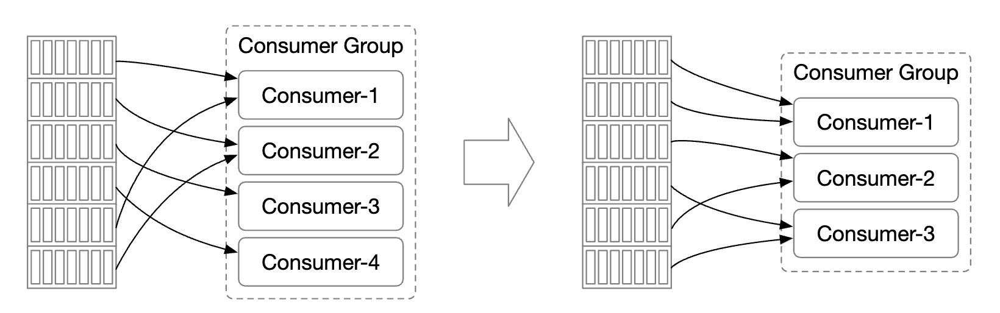

Let's explore what happens when a consumer joins a group:

    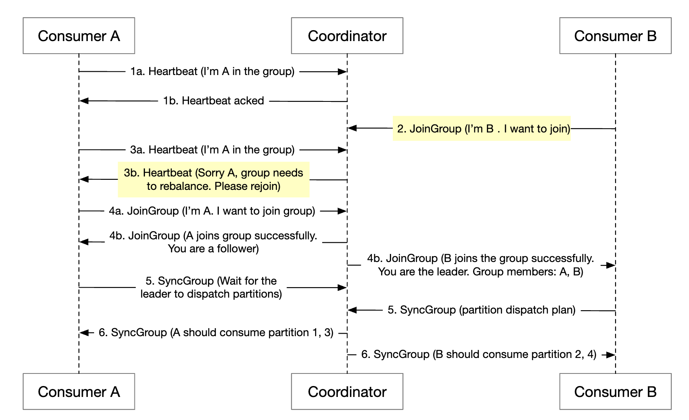

 * Initially, only consumer A is in the group and it consumes all partitions.
 * Consumer B sends a request to join the group.
 * The coordinator notifies all group members that it's time to rebalance passively - as a response to the heartbeat.
 * Once all consumers rejoin the group, the coordinator chooses a leader and notifies the rest about the election result.
 * The leader generates the partition dispatch plan and sends it to the coordinator. Others wait for the dispatch plan.
 * Consumers start consuming from the newly assigned partitions.

Here's what happens when a consumer leaves the group:

    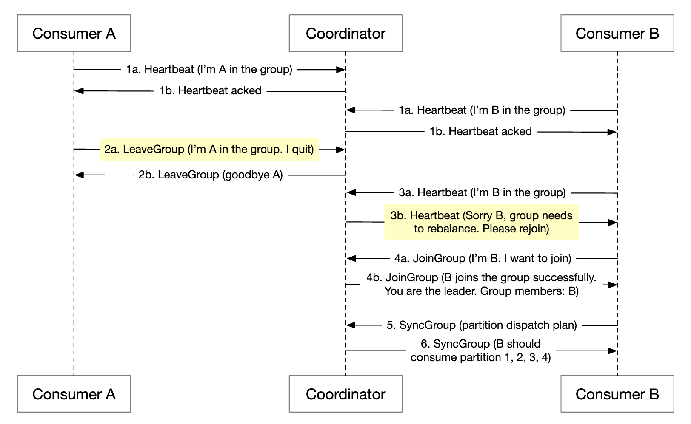

 * Consumer A and B are in the same group
 * Consumer B asks to leave the group
 * When coordinator receives A's heartbeat, it informs them that it's time to rebalance.
 * The rest of the steps are the same.

The process is similar when a consumer doesn't send a heartbeat for a long time:

    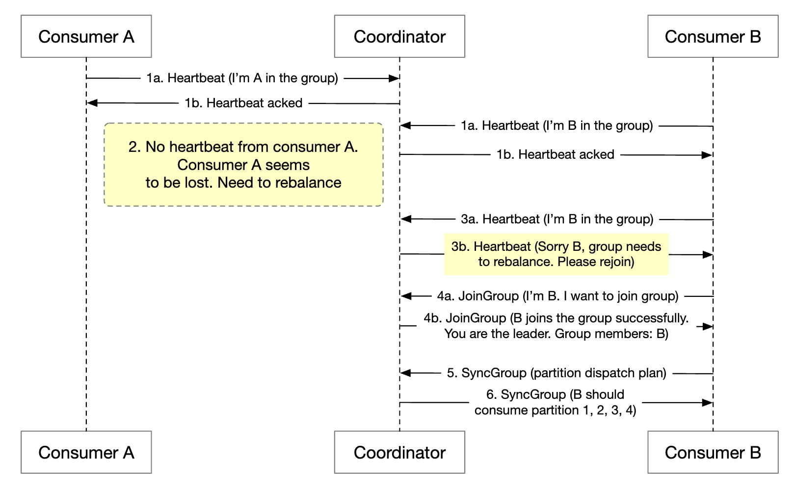

### **State storage**

The state storage stores mapping between partitions and consumers, as well as the last consumed offsets for a partition.

    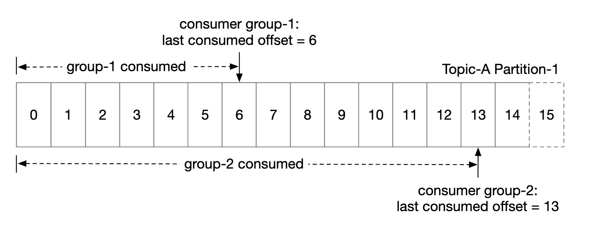

Group 1's offset is at 6, meaning all previous messages are consumed. If a consumer crashes, the new consumer will continue from that message on wards.
 
Data access patterns for consumer states:
 * Frequent read/write operations, but low volume
 * Data is updated frequently, but rarely deleted
 * Random read/write
 * Data consistency is important

Given these requirements, a fast KV storage like Zookeeper is ideal.

### **Metadata storage**

The metadata storage stores configuration and topic properties - partition number, retention period, replica distribution.

Metadata doesn't change often and volume is small, but there is a high consistency requirement.
Zookeeper is a good choice for this storage.

### **ZooKeeper**

Zookeeper is essential for building distributed message queues.

It is a hierarchical key-value store, commonly used for a distributed configuration, synchronization service and naming registry (ie service discovery).

    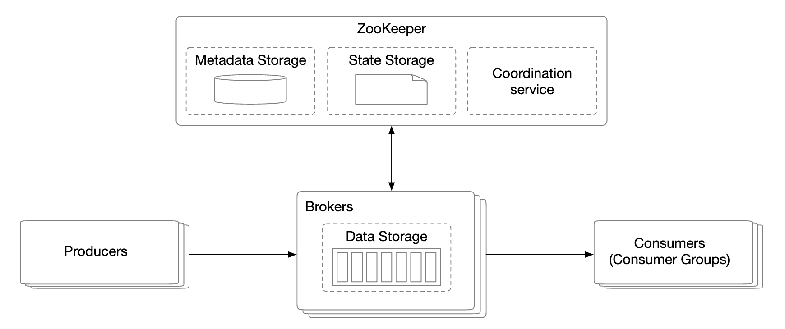

With this change, the broker only needs to maintain data for the messages. Metadata and state storage is in Zookeeper.

Zookeeper also helps with leader election of the broker replicas.

### **Replication**

In distributed systems, hardware issues are inevitable. We can tackle this via replication to achieve high availability.

    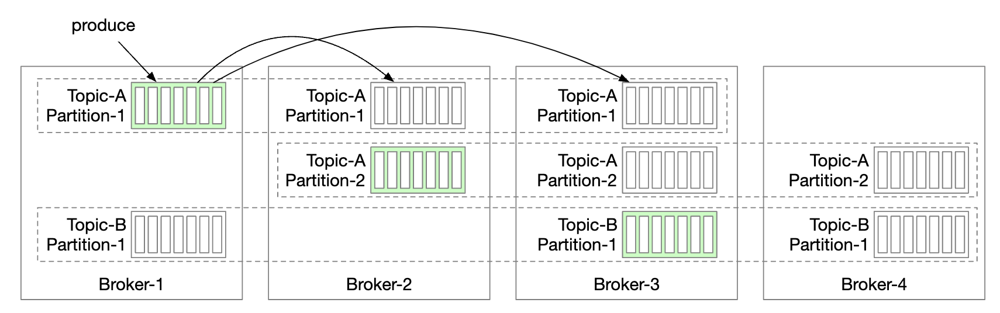

 * Each partition is replicated across multiple brokers, but there is only one leader replica.
 * Producers send messages to leader replicas
 * Followers pull the replicated messages from the leader
 * Once enough replicas are synchronized, the leader returns acknowledgment to the producer
 * Distribution of replicas for each partition is called the replica distribution plan.
 * The leader for a given partition creates the replica distribution plan and saves it in Zookeeper

### **In-sync replicas**

One problem we need to tackle is keeping messages in-sync between the leader and the followers for a given partition.

In-sync replicas (ISR) are replicas for a partition that stay in-sync with the leader.

The `replica.lag.max.messages` defines how many messages can a replica be lagging behind the leader to be considered in-sync.

    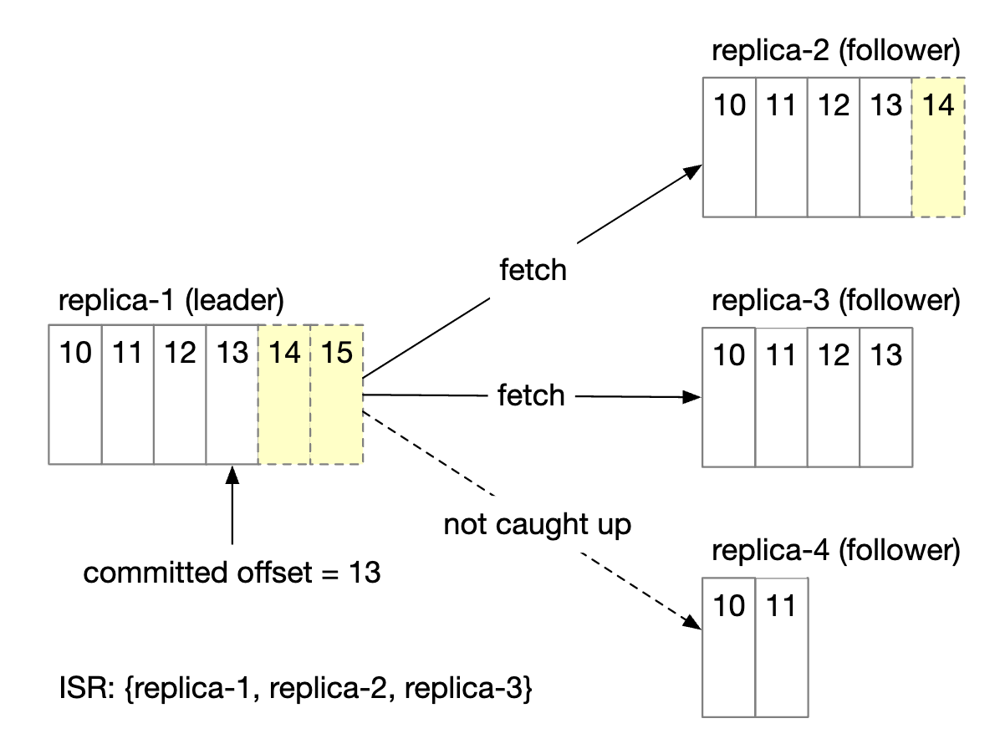

 * Committed offset is 13
 * Two new messages are written to the leader, but not committed yet.
 * A message is committed once all replicas in the ISR have synchronized that message
 * Replica 2 and 3 have fully caught up with leader, hence, they are in ISR
 * Replica 4 has lagged behind, hence, is removed from ISR for now

ISR reflects a trade-off between performance and durability.
 * In order for producers not to lose messages, all replicas should be in sync before sending an acknowledgment
 * But a slow replica will cause the whole partition to become unavailable

Acknowledgment handling is configurable.

`ACK=all` means that all replicas in ISR have to sync a message. Message sending is slow, but message durability is highest.

    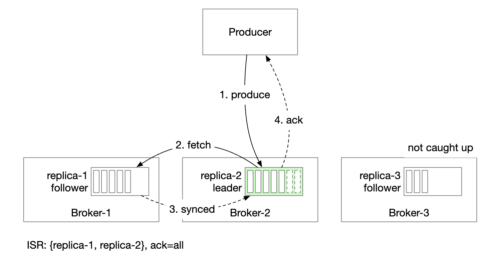

`ACK=1` means that producer receives acknowledgment once leader receives the message. Message sending is fast, but message durability is low.

    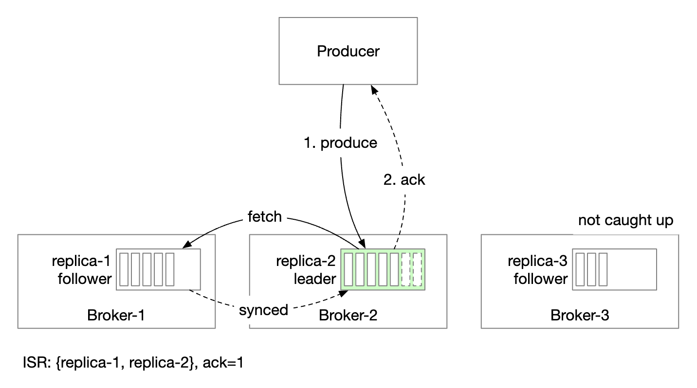

`ACK=0` means that producer sends messages without waiting for any acknowledgment from leader. Message sending is fastest, message durability is lowest.

**What each setting actually loses, concretely:**

| Setting | Acknowledged when | Lost if… | Use for |
|---|---|---|---|
| `ACK=0` | Message leaves the producer | Anything at all goes wrong — including the broker being down | Metrics, traces, where volume beats completeness |
| `ACK=1` | Leader has written it | **The leader fails before a follower replicates it** — silently, with the producer believing it succeeded | Logs, analytics |
| `ACK=all` | All ISR members have it | Every ISR replica is lost simultaneously | Anything whose loss is a defect |

**The trap in `ACK=all` is worth knowing.** It means "all replicas *currently in the ISR*", and the ISR shrinks when followers fall behind. If every follower lags and is evicted, the ISR is just the leader — and `ACK=all` has silently degraded to `ACK=1` without any configuration changing. The safeguard is a **minimum ISR size**: refuse writes rather than accept them with inadequate replication. Without it, the strongest durability setting provides the weakest guarantee exactly when the cluster is unhealthy, which is when you need it.

Note the symmetry with quorum reads and writes in [Chapter 6](../06.%20Key-Value%20Store/#3-consistency): `ACK` is `W`, the ISR is `N`, and the same trade of latency against durability applies.

    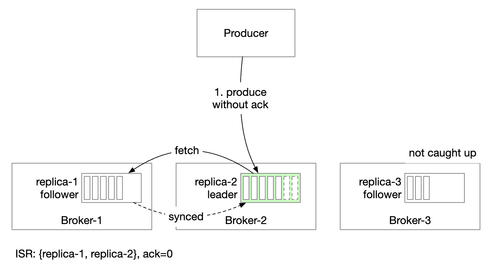

On the consumer side, we can connect all consumers to the leader for a partition and let them read messages from it:
 * This makes for the simplest design and easiest operation
 * Messages in a partition are sent to only one consumer in a group, which limits the connections to the leader replica
 * The number of connections to leader replica is typically not high as long as the topic is not super hot
 * We can scale a hot topic by increasing the number of partitions and consumers
 * In certain scenarios, it might make sense to let a consumer lead from an ISR, eg if they're located in a separate DC

The ISR list is maintained by the leader who tracks the lag between itself and each replica.

### **Scalability**

Let's evaluate how we can scale different parts of the system.

#### Producer

The producer is much smaller than the consumer. Its scalability can easily be achieved by adding/removing new producer instances.

#### Consumer

Consumer groups are isolated from each other. It is easy to add/remove consumer groups at will.

Rebalancing helps handle the case when consumers are added/removed from a group gracefully.

Consumer groups and rebalancing together help us achieve scalability and fault tolerance.

#### Broker

How do brokers handle failure?

    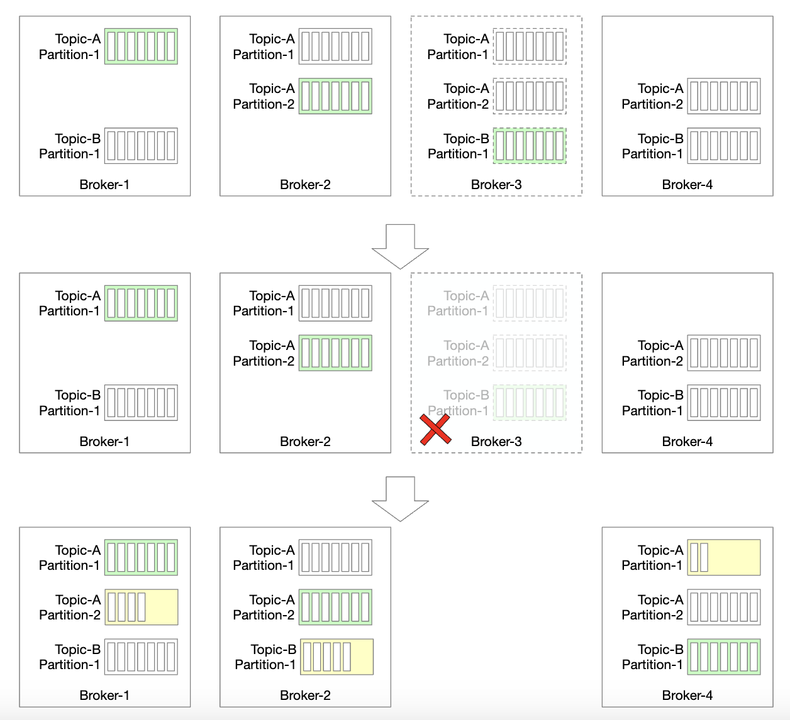

 * Once a broker fails, there are still enough replicas to avoid partition data loss
 * A new leader is elected and the broker coordinator redistributes partitions which were at the failed broker to existing replicas
 * Existing replicas pick up the new partitions and act as followers until they're caught up with the leader and become ISR

Additional considerations to make the broker fault-tolerant:
 * The minimum number of ISRs balances latency and safety. You can fine-tune it to meet your needs.
 * If all replicas of a partition are in the same node, then it's a waste of resources. Replicas should be across different brokers.
 * If all replicas of a partition crash, then the data is lost forever. Spreading replicas across data centers can help, but it adds up a lot of latency. One option is to use [data mirroring](https://cwiki.apache.org/confluence/pages/viewpage.action?pageId=27846330) as a work around.

How do we handle redistribution of replicas when a new broker is added?

    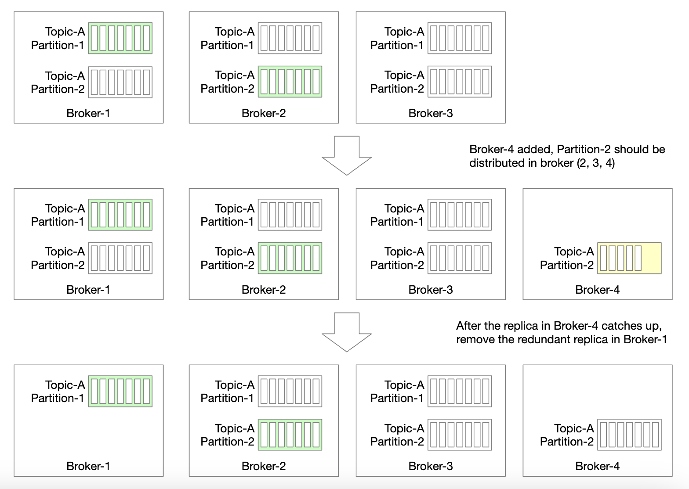

 * We can temporarily allow more replicas than configured, until new broker catches up
 * Once it does, we can remove the partition replica which is no longer needed

#### Partition

Whenever a new partition is added, the producer is notified and consumer rebalancing is triggered.

**And the per-key ordering guarantee breaks at that moment.** If messages are routed by `hash(key) % numPartitions`, then changing `numPartitions` changes the destination of almost every key — this is precisely the rehashing problem from [Chapter 5](../05.%20Consistent%20Hashing/#the-rehashing-problem). A user whose events were landing in partition 3 now lands in partition 7, while their earlier messages sit unconsumed in partition 3. Two partitions now hold that user's history with no defined order between them.

There is no clean fix, only choices:

| Approach | Consequence |
|---|---|
| Accept a temporary ordering break | Simplest; fine if ordering is advisory or the gap can be drained first |
| Drain before expanding | Stop producing, let consumers reach the end, then add partitions |
| Over-provision partitions up front | The usual real-world answer — create far more partitions than needed, since they are cheap and resizing is not |
| Consistent hashing on the key ring | Moves only `1/N` of keys, but is not how mainstream brokers route |

This is why partition count is treated as a near-permanent decision: **increasing it breaks per-key ordering, and decreasing it is the involved process described below.** Over-provisioning is cheap insurance.

In terms of data storage, we can only store new messages to the new partition vs. trying to copy all old ones:

    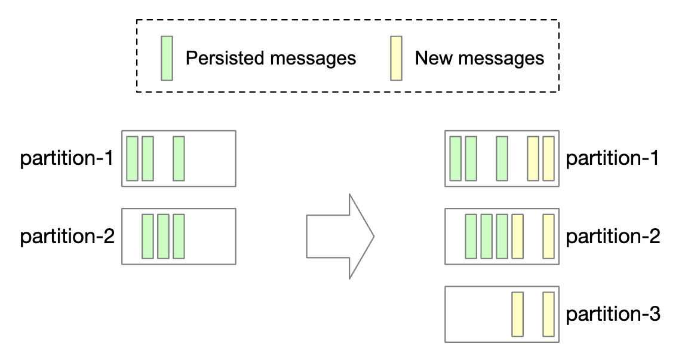

Decreasing the number of partitions is more involved:

    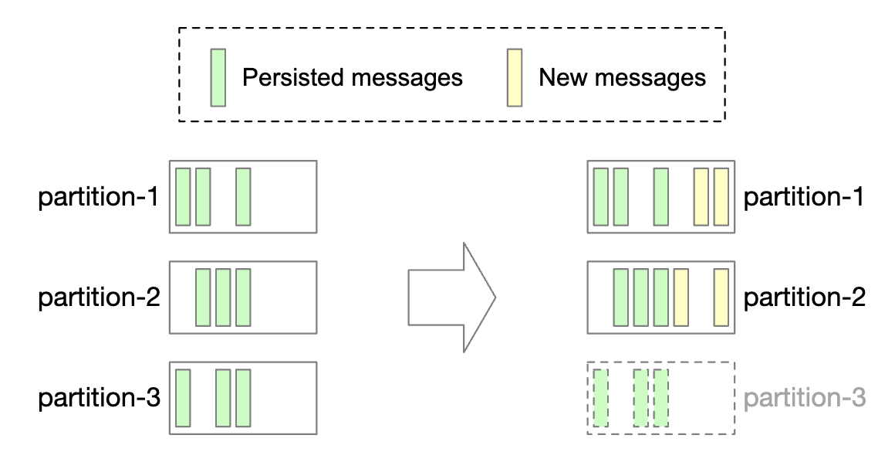

 * Once a partition is decommissioned, new messages are only received by remaining partitions
 * The decommissioned partition isn't removed immediately as messages can still be consumed from it
 * Only once a pre-configured retention period passes do we truncate the data and free up storage space
 * During the transitional period, producers only send messages to active partitions, but consumers read from all
 * Once retention period expires, consumers are rebalanced

### **Data delivery semantics**

Let's discuss different delivery semantics.

#### At-most once

With this guarantee, messages are delivered not more than once and could not be delivered at all.

    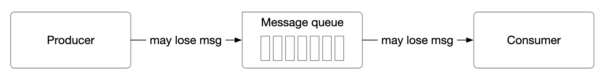

 * Producer sends a message asynchronously to a topic. If message delivery fails, there is no retry.
 * Consumer fetches message and immediately commits offset. If consumer crashes before processing the message, the message will not be processed.

#### At-least once

A message can be sent more than once and no message should be left unprocessed.

    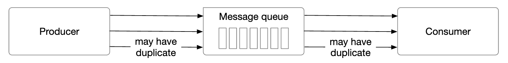

 * Producer sends message with `ack=1` or `ack=all`. If there is any issue, it will keep retrying.
 * Consumer fetches the message and consumes the offset only after it's done processing it.
 * It is possible for a message to be delivered more than once if eg consumer crashes before committing offset but after processing it.
 * This is why, this is good for use-cases where data duplication is acceptable or deduplication is possible.

#### Exactly once

Extremely costly to implement for the system, albeit it's the friendliest guarantee to users:

    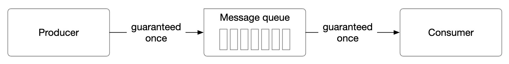

**What makes it expensive, and what it does not give you.** Two mechanisms are required, and they address two different duplicate sources:

1. **Idempotent producer.** Each producer is assigned an ID and tags every message with a per-partition sequence number. A retried send carries the same sequence number, so the broker recognises and discards it. This removes duplicates caused by producer retries — without it, `ACK=all` plus retry *guarantees* occasional duplicates, since a lost acknowledgement is indistinguishable from a lost message.
2. **Transactions.** Consuming, processing and committing the new offset must be atomic with the output being written, or a crash between the two reintroduces a duplicate or a loss. This means a transaction coordinator, a transaction log, and consumers that refuse to read uncommitted records.

And the crucial limitation: **this is exactly-once within the system, not exactly-once in the world.** If processing a message charges a credit card or sends an email, those are external side effects that no broker transaction can roll back. End-to-end exactly-once still requires the *consumer's* side effect to be idempotent — an idempotency key at the payment provider ([Chapter 26](../26.%20Payment%20System/)) or a dedup check before sending ([Chapter 10](../10.%20Notification%20System/#reliability)).

The honest summary, and the right thing to say out loud: **at-least-once delivery plus idempotent processing is what almost every production system actually does**, because it is far cheaper and achieves the same observable outcome.

| | At-most-once | At-least-once | Exactly-once |
|---|---|---|---|
| Producer | Fire and forget | Retry until acked | Idempotent, sequence-numbered |
| Offset commit | **Before** processing | **After** processing | Atomically with the output |
| Duplicates | No | **Yes, expect them** | No (within the system) |
| Message loss | Yes | No | No |
| Cost | Lowest | Low | High — coordinator, transaction log, throughput penalty |
### **Advanced features**

Let's discuss some advanced features, we might discuss in the interview.

#### Message filtering

Some consumers might want to only consume messages of a certain type within a partition.

This can be achieved by building separate topics for each subset of messages, but this can be costly if systems have too many differing use-cases.
 * It is a waste of resources to store the same message on different topics
 * Producer is now tightly coupled to consumers as it changes with each new consumer requirement

We can resolve this using message filtering.
 * A naive approach would be to do the filtering on the consumer-side, but that introduces unnecessary consumer traffic
 * Alternatively, messages can have tags attached to them and consumers can specify which tags they're subscribed to
 * Filtering could also be done via the message payloads but that can be challenging and unsafe for encrypted/serialized messages
 * For more complex mathematical formulae, the broker could implement a grammar parser or script executor, but that can be heavyweight for the message queue

    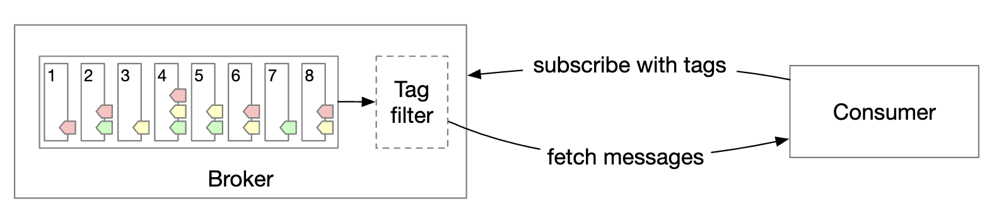

#### Delayed messages & scheduled messages

For some use-cases, we might want to delay or schedule message delivery. 
For example, we might submit a payment verification check for 30m from now, which triggers the consumer to see if a payment was successful.

This can be achieved by sending messages to temporary storage in the broker and moving the message to the partition at the right time:

    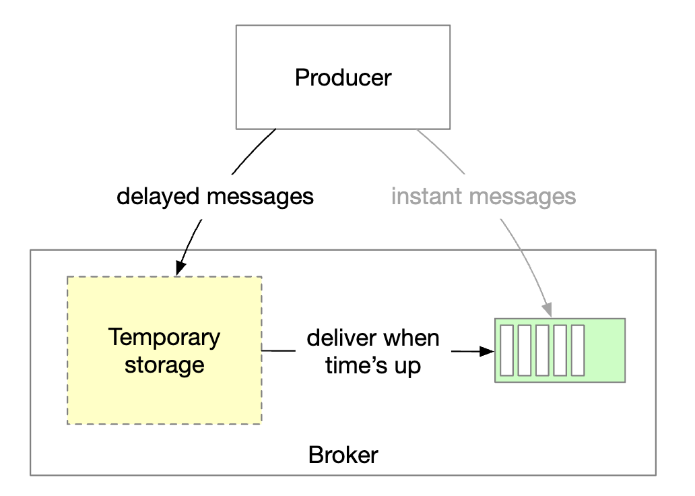

 * The temporary storage can be one or more special message topics
 * The timing function can be achieved using dedicated delay queues or a [hierarchical time wheel](http://www.cs.columbia.edu/~nahum/w6998/papers/sosp87-timing-wheels.pdf)

---

## Step 4: Wrap Up

Additional talking points:
- **Protocol of communication**: Important considerations - support all use-cases and high data volume, as well as verify message integrity. Popular protocols - AMQP and Kafka protocol.
- **Retry consumption**: if we can't process a message immediately, we could send it to a dedicated retry topic to be attempted later.
- **Historical data archive**: old messages can be backed up in high-capacity storages such as HDFS or object storage (eg S3).

**Why the retry topic is not optional.** Offsets advance in order, so a message the consumer cannot process is a wall: you either stop (and the partition's lag grows without bound) or skip it (and lose it silently). A **poison message** therefore blocks everything behind it — head-of-line blocking at the partition level. Moving the failure aside into a retry topic, and after N attempts into a dead letter topic, is what lets the main partition keep moving. Note what this costs: the retried message is now out of order relative to the stream it came from, so the ordering guarantee you worked to preserve is given up for exactly those messages.

**Retention and compaction are two different reclamation policies**, and the chapter only describes the first:

| Policy | Deletes | Good for |
|---|---|---|
| **Time/size retention** | Everything older than two weeks, or beyond N bytes | Event streams, logs — this chapter's requirement |
| **Log compaction** | Superseded values, keeping the **latest message per key** forever | State and changelogs — "the current value of every account" |

Compaction turns the log into something you can rebuild state from no matter how old it is, which is what makes a log usable as a system of record rather than a transport.

**One thing that has changed since this design was written:** mainstream brokers have moved off ZooKeeper. Kafka's KRaft mode runs the metadata log through Raft inside the brokers themselves, removing an entire external system that had to be operated, secured and scaled separately — and that was a hard limit on partition counts. The *role* ZooKeeper plays here (consistent metadata, leader election, membership) is still required; it is now served by an internal consensus group rather than a separate cluster.

---

### Gotchas & failure modes

- **Consumer lag is the metric that matters.** Throughput looks healthy right up until consumers fall permanently behind. Lag — the gap between the log end and a group's offset — is the only signal that distinguishes "keeping up" from "slowly drowning", and the only one that predicts data loss when retention expires before the consumer arrives.
- **Retention expiry is silent data loss.** A consumer down for longer than the retention window comes back to find its offset no longer exists. There is no error at write time, no alarm, no partial delivery — the data was correctly deleted on schedule. Retention must exceed your worst realistic outage, and lag alarms must fire long before it.
- **Adding partitions breaks per-key ordering.** `hash(key) % N` changes when `N` does. Over-provision partitions instead.
- **A skewed partition key is unfixable by scaling.** The ordering guarantee is a promise not to spread one key out, so a dominant key means a hot partition by design. Fix the key, not the cluster.
- **Partition count caps consumer parallelism.** Ten partitions means at most ten useful consumers in a group; the eleventh sits idle. Scaling consumers beyond partitions does nothing.
- **Rebalancing is a stop-the-world event.** During a rebalance, nobody in the group consumes. A rolling restart of 50 consumers can trigger 50 rebalances in sequence, each pausing the group — the deploy itself causes the lag spike. Static group membership and incremental cooperative rebalancing exist specifically to avoid this.
- **A slow consumer looks exactly like a dead one.** Missing heartbeats trigger a rebalance, the partition is reassigned, the original consumer finishes its work and commits — now two consumers have processed the same messages. Keep processing time well under the heartbeat timeout, or heartbeat from a separate thread.
- **`ACK=all` can silently become `ACK=1`.** If all followers fall out of the ISR, "all in-sync replicas" is just the leader. Set a minimum ISR and prefer rejecting writes to accepting under-replicated ones.
- **`ACK=1` loses acknowledged messages.** A leader failure between the local write and replication loses data the producer believes was accepted. This is the normal, expected behaviour of that setting, not a bug.
- **A poison message blocks its partition.** Offsets are ordered, so one unprocessable message stalls everything behind it. Retry topic, then dead letter topic — and accept that those messages lose their ordering.
- **At-least-once means duplicates will happen.** Not "might". Consumers must be idempotent; discovering this in production is the common version of learning it.
- **Exactly-once does not extend past the system boundary.** External side effects still need their own idempotency keys.
- **Replicas on the same broker or rack are not replication.** Three copies that fail together are one copy. Spread across brokers and failure domains, and across data centres only with awareness of the latency cost.
- **Payload filtering destroys zero-copy.** Tag-based filtering stays cheap because the broker reads headers; inspecting or decrypting payloads forces data through the CPU and gives up the design's main throughput advantage.
- **The coordination service is a hard dependency.** Without consistent metadata and leader election, brokers cannot agree on who owns a partition. Losing quorum there stops the cluster even if every broker is healthy.
- **Decreasing partitions takes a full retention period.** The decommissioned partition must remain readable until its data expires, so shrinking is a two-week operation, not a configuration change.
- **A consumer that commits before processing has chosen at-most-once** — possibly without realising it. The order of "process" and "commit offset" *is* the delivery semantic.

---

## The design, as problem and technique

| Goal / problem | Technique |
|---|---|
| Two-week retention and replay | Append-only log; consumption advances an offset instead of deleting |
| Ordering | Guaranteed within a partition; partition by key for per-entity ordering |
| Parallelism | Multiple partitions; one consumer per partition per group |
| High throughput on cheap disks | Purely sequential writes to segment files, exploiting the OS page cache |
| Amortising network and syscall cost | Batching in producer, broker and consumer |
| Not spending CPU on message bytes | Identical wire/disk/consumer format, served with zero-copy |
| Managing a huge partition file | Segment files; old segments immutable and independently truncatable |
| Routing to the right broker | Routing layer embedded in the producer, reading the plan from metadata |
| Consumers not being overwhelmed | Pull model with long polling, so consumers set their own rate |
| Durability of a partition | Leader/follower replication, ISR tracking, configurable `ACK` |
| Avoiding under-replicated writes | Minimum ISR size; reject rather than accept |
| Surviving a broker loss | Leader election via the coordination service; followers catch up and rejoin the ISR |
| Reassigning work as consumers change | Consumer group coordinator plus rebalancing protocol |
| Remembering consumer progress | Offsets in state storage (consistent KV / ZooKeeper, or an internal log) |
| Unprocessable messages | Retry topic, then dead letter topic |
| Duplicates from retries | Idempotent producer with per-partition sequence numbers |
| Atomic consume-process-commit | Transactions with a coordinator — expensive; usually replaced by idempotent consumers |
| Consumers wanting a subset | Tag-based filtering in the broker, which preserves zero-copy |
| Delayed or scheduled delivery | Temporary topics plus a timing wheel, promoted to the real partition when due |
| Data older than retention | Archive to object storage or HDFS |

## Self-check
1. Why is this design better described as a log than a queue, and which single piece of mutable state makes that work?
2. Quantify sequential versus random disk throughput. What does that rule out as a message store?
3. What does zero-copy mean here, and which proposed feature would destroy it?
4. What exactly is the scope of the ordering guarantee, and what does total ordering across a topic cost?
5. You need "events in order". How do you reconcile that with parallelism?
6. A topic has 10 partitions and you run 15 consumers in one group. What happens?
7. Why does adding partitions break per-key ordering, and which earlier chapter is this the same problem as?
8. `ACK=all` is configured and a message is acknowledged, yet it is lost. Give the scenario.
9. Why is the pull model chosen over push, and what does it cost?
10. A consumer takes 10 minutes to process a batch while the heartbeat timeout is 30 seconds. Describe the failure.
11. A consumer group is offline for three weeks with two-week retention. What happens when it returns, and what warning would have fired?
12. One message cannot be deserialised. What happens to the partition, and what is the fix — including what the fix costs?
13. Where exactly does "exactly-once" stop applying?
14. What is the difference between retention and compaction, and when do you want each?

## Glossary

| Term | Meaning |
|---|---|
| **Topic / partition / broker** | A logical stream; a shard of it with its own order; the server hosting partitions |
| **Offset** | A message's position in a partition — and the consumer's bookmark |
| **Segment** | One file of a partition's log; sealed and read-only once rolled |
| **WAL (write-ahead log)** | The append-only on-disk structure holding messages |
| **Partition key** | The field deciding a message's partition — and therefore its ordering scope |
| **Consumer group** | Consumers cooperatively covering a topic's partitions, with a shared offset per partition |
| **Rebalancing** | Reassigning partitions among a group's consumers; pauses consumption while it runs |
| **Group coordinator** | The broker managing a group's membership and offsets |
| **Consumer lag** | Distance between the log end and a group's offset — the system's key health metric |
| **Replica / ISR** | Copies of a partition; those keeping up with the leader |
| **`ACK` (0/1/all)** | How much replication a producer waits for before considering a write done |
| **Minimum ISR** | The floor below which writes are rejected rather than under-replicated |
| **Batching** | Grouping messages per request or per write to amortise fixed costs |
| **Zero-copy** | Serving bytes from page cache to socket without passing through user space |
| **Idempotent producer** | Per-producer sequence numbers letting the broker discard retried sends |
| **Poison message** | An unprocessable message that blocks its partition |
| **Retry / dead letter topic** | Where failed messages go so the main partition can proceed |
| **Log compaction** | Retaining only the latest message per key, indefinitely |
| **Timing wheel** | The structure used to schedule delayed message promotion |

## Where to go next
- [Chapter 5 – Design Consistent Hashing](../05.%20Consistent%20Hashing/#the-rehashing-problem) — why `hash(key) % N` makes partition count hard to change.
- [Chapter 6 – Design A Key-Value Store](../06.%20Key-Value%20Store/#3-consistency) — quorums, where `ACK` and the ISR are `W` and `N` by other names, and the same log-structured storage ideas.
- [Chapter 10 – Design A Notification System](../10.%20Notification%20System/#reliability) — at-least-once delivery handled with idempotent processing, which is what most systems do instead of exactly-once.
- [Chapter 21 – Ad Click Event Aggregation](../21.%20Ad%20Click%20Event%20Aggregation/) — this queue as the backbone of a streaming pipeline, including what exactly-once really costs there.
- [Chapter 20 – Metrics Monitoring and Alerting System](../20.%20Metrics%20Monitoring%20and%20Alerting%20System/) — another high-volume ingest pipeline built on the same primitives.
