# Chapter 20: Metrics Monitoring and Alerting System

## Introduction
This chapter focuses on designing a highly scalable **metrics monitoring and alerting system**, which is critical for ensuring high availability and reliability.

**The one-sentence version:** the workload is an enormous, relentless stream of **tiny, highly compressible, almost never read** data points, whose reads are overwhelmingly about the last few hours. That specific shape is what a time-series database *is* — and the thing that actually destroys these systems in production is not the volume of data points but the **number of distinct time series**, which a careless one-line code change can multiply by a million.

Two more framings worth carrying through the chapter:

- **This system must be more reliable than everything it watches**, and it cannot use itself to discover that it is broken. That asymmetry shapes the alerting design and is the reason for the dead-man's-switch in the gotchas.
- **An alert nobody acts on is worse than no alert.** Most of the engineering here is about data; most of the *failure* is about humans ignoring pages. Both matter.

---

## Step 1: Understand the Problem and Establish Design Scope
A metrics monitoring system can mean a lot of different things - eg you don't want to design a logs aggregation system, when the interviewer is interested in infra metrics only.

Let's try to understand the problem first:
 - C: Who are we building the system for? An in-house monitoring system for a big tech company or a SaaS like DataDog?
 - I: We are building for internal use only.
 - C: Which metrics do we want to collect?
 - I: Operational system metrics - CPU load, Memory, Data disk space. But also high-level metrics like requests per second. Business metrics are not in scope.
 - C: What is the scale of the infrastructure we're monitoring?
 - I: 100mil daily active users, 1000 server pools, 100 machines per pool
 - C: How long should we keep the data?
 - I: Let's assume 1y retention.
 - C: May we reduce metrics data resolution for long-term storage?
 - I: Keep newly received metrics for 7 days. Roll them up to 1m resolution for next 30 days. Further roll them up to 1h resolution after 30 days.
 - C: What are the supported alert channels?
 - I: Email, phone, PagerDuty or webhooks.
 - C: Do we need to collect logs such as error or access logs?
 - I: No
 - C: Do we need to support distributed system tracing?
 - I: No

### **High-level requirements and assumptions**
The infrastructure being monitored is large-scale:
 - 100mil DAU
 - 1000 server pools * 100 machines * ~100 metrics per machine -> ~10mil metrics
 - 1-year data retention
 - Data retention policy - raw for 7d, 1-minute resolution for 30d, 1h resolution for 1y

### What 10 million metrics actually costs

Assume a 10-second scrape interval, which is typical:

| Quantity | Derivation | Result |
|---|---|---|
| Time series | 1,000 pools × 100 machines × 100 metrics | **10 million** |
| **Write rate** | 10 M / 10 s | **~1 million data points/sec** |
| Points/day | 1 M × 86,400 | ~86 billion |
| Raw points retained (7 d) | 86 B × 7 | ~605 billion |
| 1-minute points (30 d) | 10 M × 1,440 × 30 | ~432 billion |
| 1-hour points (1 y) | 10 M × 24 × 365 | ~88 billion |
| **Total points stored** | | **~1.1 trillion** |
| At a naive 50 bytes/point | | ~55 TB |
| **At ~2 bytes/point compressed** | | **~2.2 TB** |

Two conclusions, both load-bearing.

**One million writes per second sets the cluster size.** The chapter notes InfluxDB sustaining ~250 K writes/sec on 8 cores and 32 GB. That is four such nodes at the theoretical limit — so realistically 8–12 with headroom, replication and room for growth. Doing this division out loud is what turns "use a time-series database" into a capacity plan.

**Compression is a 25× effect, not a nicety.** A data point is a timestamp and a float — 16 bytes before you add any identifying information — yet these systems routinely achieve under 2 bytes per point. The reason is that consecutive points in a series are *extremely* predictable: timestamps arrive at a fixed interval, so **delta-of-delta** encoding usually stores zero, and values change slowly, so XOR-ing a float against its predecessor leaves mostly zero bits. Facebook's Gorilla paper reports ~1.37 bytes per point from exactly these two tricks. This is the difference between 55 TB and 2 TB, and it is why a general-purpose database is the wrong tool even before you consider query patterns.

> **Interview angle:** derive 1 M writes/sec from the metric count and scrape interval, then divide by a realistic per-node write rate. That one calculation justifies a purpose-built time-series store, a buffering queue in front of it, and the entire down-sampling policy — all from the requirements.

A variety of metrics can be monitored:
 - CPU load
 - Request count
 - Memory usage
 - Message count in message queues

### **Non-functional requirements**
 - **Scalability**: System should be scalable to accommodate more metrics and alerts
 - **Low latency**: System needs to have low query latency for dashboards and alerts
 - **Reliability**: System should be highly reliable to avoid missing critical alerts
 - **Flexibility**: System should be able to easily integrate new technologies in the future

What requirements are out of scope?
 - **Log monitoring**: the ELK stack is very popular for this use-case
 - **Distributed system tracing**: this refers to collecting data about a request lifecycle as it flows through multiple services within the system

---

## Step 2: Propose High-Level Design and Get Buy-In

### **Fundamentals**
There are five core components involved in a metrics monitoring and alerting system:

<p align="left">
    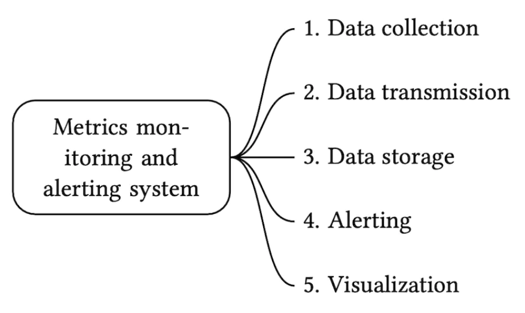
</p>
 - **Data collection**: collect metrics data from different sources
 - **Data transmission**: transfer data from sources to the metrics monitoring system
 - **Data storage**: organize and store incoming data
 - **Alerting**: Analyze incoming data, detect anomalies and generate alerts
 - **Visualization**: Present data in graphs, charts, etc

### **Data model**
Metrics data is usually recorded as a time-series, which contains a set of values with timestamps.
The series can be identified by name and an optional set of tags.

Example 1 - What is the CPU load on production server instance i631 at 20:00?

<p align="left">
    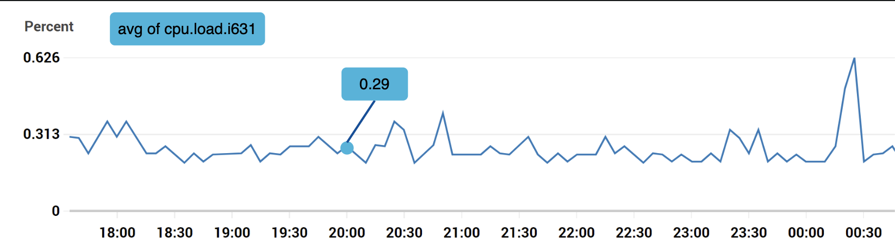
</p>
The data can be identified by the following table:

<p align="left">
    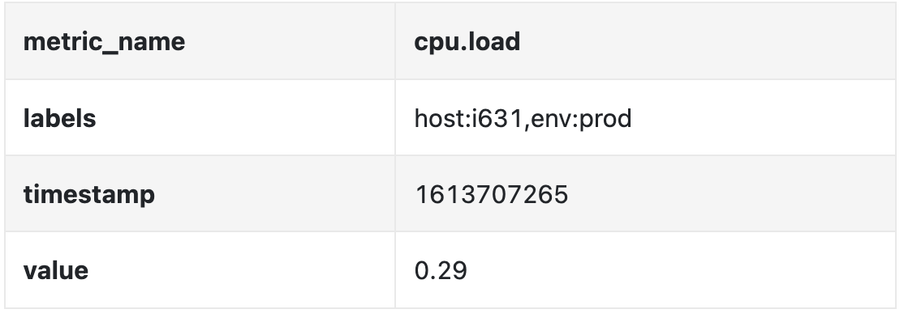
</p>
The time series is identified by the metric name, labels and a single point in at a specific time.

Example 2 - What is the average CPU load across all web servers in the us-west region for the last 10min?

```
CPU.load host=webserver01,region=us-west 1613707265 50

CPU.load host=webserver01,region=us-west 1613707265 62

CPU.load host=webserver02,region=us-west 1613707265 43

CPU.load host=webserver02,region=us-west 1613707265 53

...

CPU.load host=webserver01,region=us-west 1613707265 76

CPU.load host=webserver01,region=us-west 1613707265 83
```

This is an example data we might pull from storage to answer that question.
The average CPU load can be calculated by averaging the values in the last column of the rows.

The format shown above is called the line protocol and is used by many popular monitoring software in the market - eg Prometheus, OpenTSDB.

What every time series consists of:

<p align="left">
    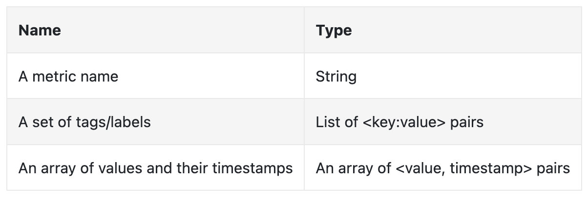
</p>
A good way to visualize how data looks like:

<p align="left">
    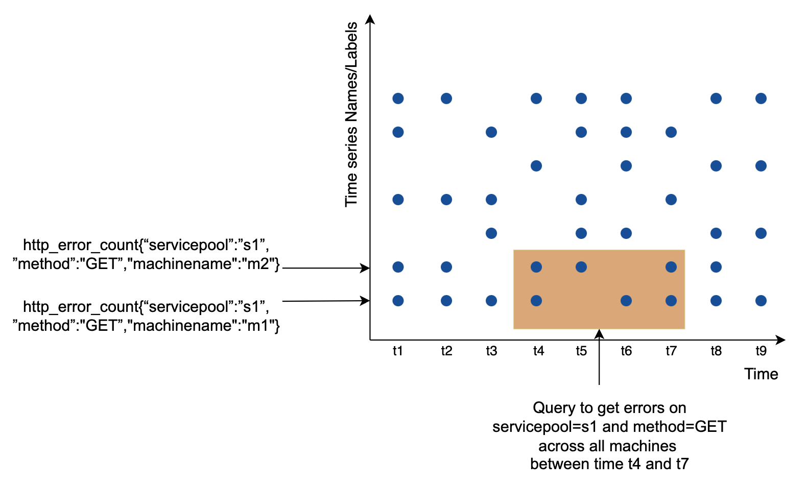
</p>
 - The x axis is the time
 - the y axis is the dimension you're querying - eg metric name, tag, etc.

The data access pattern is write-heavy and spiky reads as we collect a lot of metrics, but they are infrequently accessed, although in bursts when eg there are ongoing incidents.

The data storage system is the heart of this design. 
 - It is not recommended to use a general-purpose database for this problem, although you could achieve good scale \w expert-level tuning.
 - Using a NoSQL database can work in theory, but it is hard to devise a scalable schema for effectively storing and querying time-series data.

There are many databases, specifically tailored for storing time-series data. Many of them support custom query interfaces which allow for effective querying of time-series data.
 - OpenTSDB is a distributed time-series database, but it is based on Hadoop and HBase. If you don't have that infrastructure provisioned, it would be hard to use this tech.
 - Twitter uses MetricsDB, while Amazon offers Timestream.
 - The two most popular time-series databases are InfluxDB and Prometheus. 
 - They are designed to store large volumes of time-series data. Both of them are based on in-memory cache + on-disk storage.

Example scale of InfluxDB - more than 250k writes per second when provisioned with 8 cores and 32gb RAM:

<p align="left">
    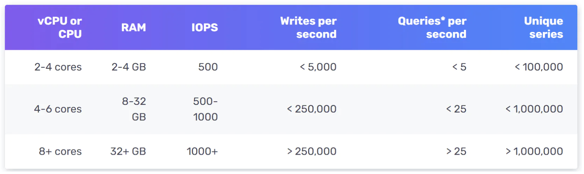
</p>
It is not expected for you to understand the internals of a metrics database as it is niche knowledge. You might be asked only if you've mentioned it on your resume.

For the purposes of the interview, it is sufficient to understand that metrics are time-series data and to be aware of popular time-series databases, like InfluxDB.

One nice feature of time-series databases is the efficient aggregation and analysis of large amounts of time-series data by labels.
InfluxDB, for example, builds indexes for each label.

It is critical, however, to keep the cardinality of labels low - ie, not using too many unique labels.

**This one sentence is the most important operational warning in the chapter, and it deserves unpacking, because cardinality explosion is how essentially every metrics system actually falls over.**

The number of time series is the **product** of the distinct values of every label, not the sum:

```
series = metric_name × host × region × status_code × endpoint × ...
```

| Labels on `http_requests_total` | Distinct series |
|---|---|
| `host` (100 K) | 100,000 |
| `host`, `status_code` (10) | 1,000,000 |
| `host`, `status_code`, `endpoint` (200) | **200,000,000** |
| `host`, `status_code`, `endpoint`, `user_id` (100 M) | **effectively unbounded** |

Each series needs its own index entry, its own in-memory buffer accumulating points before flush, and its own compression state. Memory therefore scales with **series count**, not with data point volume — so a metrics system comfortably handling a million writes per second can be killed outright by a developer adding one innocuous-looking label.

The labels that cause this are always the same kind: anything unbounded or per-request. `user_id`, `request_id`, `trace_id`, `session_id`, raw URL paths (including the ones with IDs in them), container IDs in an autoscaling fleet, error messages used as labels, email addresses. They look like useful context and they are catastrophic as labels.

The discipline is: **labels must have a small, bounded, slowly-changing set of values.** Normalise `/user/12345/profile` to `/user/:id/profile`. Per-request detail belongs in logs or traces — which is exactly why the requirements declared both out of scope, and why they are separate systems rather than more labels on a metric.

Worth noting too: this is a *write-time* decision that is expensive to undo. The series already created persist until retention expires, so the recovery from a cardinality incident is partly just waiting.

### **High-level Design**

<p align="left">
    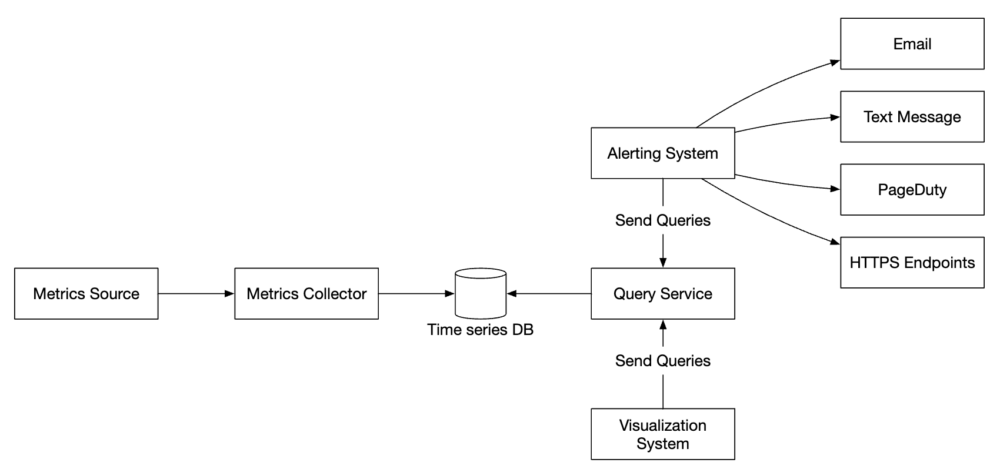
</p>
 - **Metrics source**: can be application servers, SQL databases, message queues, etc.
 - **Metrics collector**: Gathers metrics data and writes to time-series database
 - **Time-series database**: stores metrics as time-series. Provides a custom query interface for analyzing large amounts of metrics.
 - **Query service**: Makes it easy to query and retrieve data from the time-series DB. Could be replaced entirely by the DB's interface if it's sufficiently powerful.
 - **Alerting system**: Sends alert notifications to various alerting destinations.
 - **Visualization system**: Shows metrics in the form of graphs/charts.

---

## Step 3: Design Deep Dive
Let's deep dive into several of the more interesting parts of the system.

### **Metrics collection**
For metrics collection, occasional data loss is not critical. It's acceptable for clients to fire and forget.

<p align="left">
    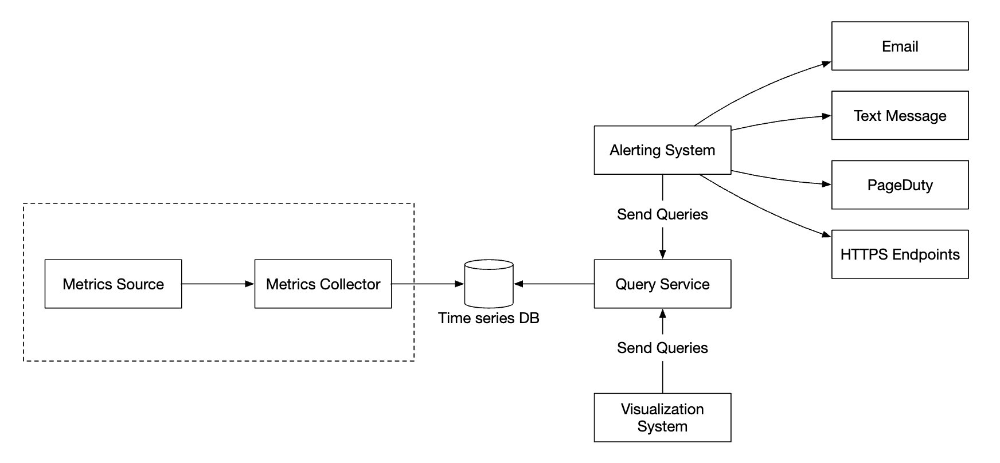
</p>
There are two ways to implement metrics collection - pull or push.

Here's how the pull model might look like:

<p align="left">
    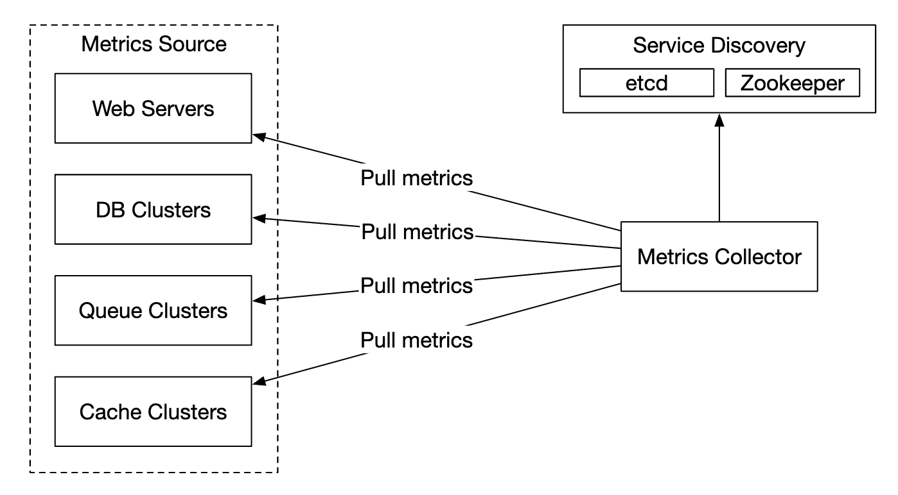
</p>
For this solution, the metrics collector needs to maintain an up-to-date list of services and metrics endpoints.
We can use Zookeeper or etcd for that purpose - service discovery.

Service discovery contains configuration rules about when and where to collect metrics from:

<p align="left">
    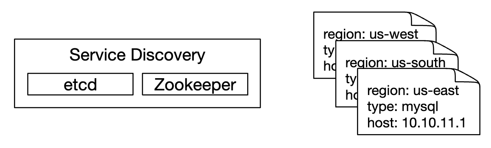
</p>
Here's a detailed explanation of the metrics collection flow:

<p align="left">
    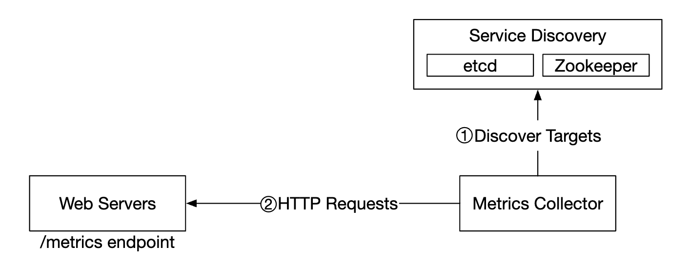
</p>
 - Metrics collector fetches configuration metadata from service discovery. This includes pulling interval, IP addresses, timeout & retry params.
 - Metrics collector pulls metrics data via a pre-defined http endpoint (eg `/metrics`). This is typically done by a client library.
 - Alternatively, the metrics collector can register a change event notification with the service discovery to be notified once the service endpoint changes.
 - Another option is for the metrics collector to periodically poll for metrics endpoint configuration changes.

At our scale, a single metrics collector is not enough. There must be multiple instances. 
However, there must also be some kind of synchronization among them so that two collectors don't collect the same metrics twice.

One solution for this is to position collectors and servers on a consistent hash ring and associate a set of servers with a single collector only:

<p align="left">
    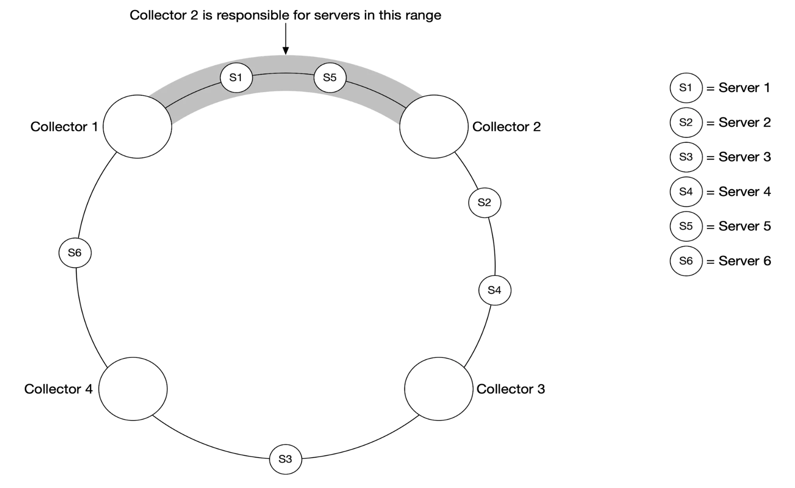
</p>
With the push model, on the other hand, services push their metrics to the metrics collector proactively:

<p align="left">
    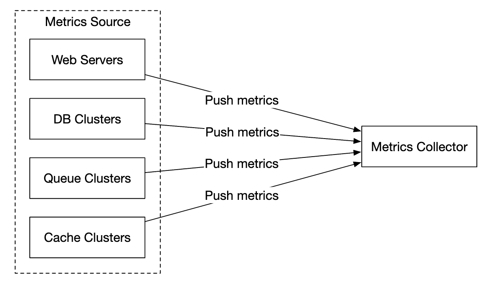
</p>
In this approach, typically a collection agent is installed alongside service instances. 
The agent collects metrics from the server and pushes them to the metrics collector.

<p align="left">
    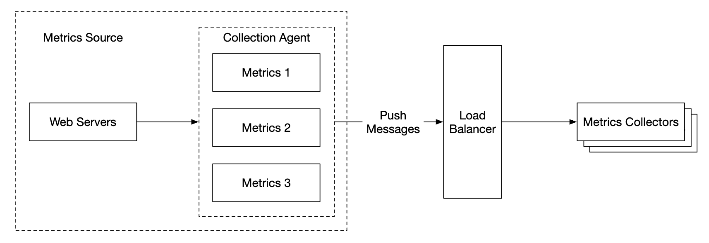
</p>
With this model, we can potentially aggregate metrics before sending them to the collector, which reduces the volume of data processed by the collector.

On the flip side, metrics collector can reject push requests as it can't handle the load. 
It is important, hence, to add the collector to an auto-scaling group behind a load balancer.

So which one is better? There are trade-offs between both approaches and different systems use different approaches:
 - Prometheus uses a pull architecture
 - Amazon Cloud Watch and Graphite use a push architecture

Here are some of the main differences between push and pull:
|                                        | Pull                                                                                                                                                                                                    | Push                                                                                                                                                                                                                                    |
|----------------------------------------|---------------------------------------------------------------------------------------------------------------------------------------------------------------------------------------------------------|-----------------------------------------------------------------------------------------------------------------------------------------------------------------------------------------------------------------------------------------|
| Easy debugging                         | The /metrics endpoint on application servers used for pulling metrics can be used to view metrics at any time. You can even do this on your laptop. Pull wins.                                          | If the metrics collector doesn't receive metrics, the problem might be caused by network issues.                                                                                                                                        |
| Health check                           | If an application server doesn't respond to the pull, you can quickly figure out if an application server is down. Pull wins.                                                                           | If the metrics collector doesn't receive metrics, the problem might be caused by network issues.                                                                                                                                        |
| Short-lived jobs                       |                                                                                                                                                                                                         | Some of the batch jobs might be short-lived and don't last long enough to be pulled. Push wins. This can be fixed by introducing push gateways for the pull model [22].                                                                 |
| Firewall or complicated network setups | Having servers pulling metrics requires all metric endpoints to be reachable. This is potentially problematic in multiple data center setups. It might require a more elaborate network infrastructure. | If the metrics collector is set up with a load balancer and an auto-scaling group, it is possible to receive data from anywhere. Push wins.                                                                                             |
| Performance                            | Pull methods typically use TCP.                                                                                                                                                                         | Push methods typically use UDP. This means the push method provides lower-latency transports of metrics. The counterargument here is that the effort of establishing a TCP connection is small compared to sending the metrics payload. |
| Data authenticity                      | Application servers to collect metrics from are defined in config files in advance. Metrics gathered from those servers are guaranteed to be authentic.                                                 | Any kind of client can push metrics to the metrics collector. This can be fixed by whitelisting servers from which to accept metrics, or by requiring authentication.                                                                   |

There is no clear winner. A large organization probably needs to support both. There might not be a way to install a push agent in the first place.

**The asymmetry underneath the whole table is about who holds the list of what should exist.**

With **pull**, the collector has an authoritative inventory from service discovery, so *absence of data is itself information*: a target that does not answer is down, and you can alert on it. With **push**, the collector only knows what arrived. Silence is ambiguous — the service may be down, the agent may have crashed, the network may be broken, or the service may simply have been decommissioned on purpose. You cannot distinguish "dead" from "never existed" without maintaining a separate inventory, at which point you have rebuilt service discovery anyway.

That is why `up == 0` is a trivially expressible alert in a pull system and an awkward one in a push system, and it is the single strongest argument for pull.

The counter-argument is equally structural: **pull requires the collector to reach every target**, which is a problem across firewalls, NAT, and multiple data centres, and it is simply impossible for things that do not live long enough to be scraped — batch jobs, serverless functions, CI steps. The standard patch is a **push gateway**: short-lived jobs push to an intermediary that the collector then pulls. It works, and it inherits push's weakness, because a stale entry in a push gateway looks exactly like a healthy one.

The practical answer for a large organisation is pull as the default (because of the health-check property) plus a push path for the cases pull cannot reach.

### **Scale the metrics transmission pipeline**

<p align="left">
    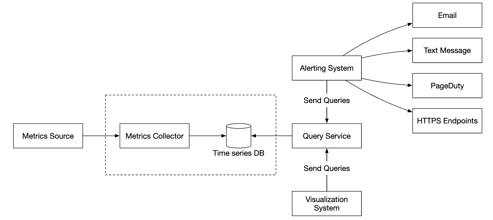
</p>
The metrics collector is provisioned in an auto-scaling group, regardless if we use the push or pull model.

There is a chance of data loss if the time-series DB is down, however. To mitigate this, we'll provision a queuing mechanism:

<p align="left">
    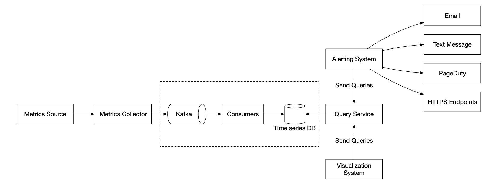
</p>
 - Metrics collectors push metrics data into kafka
 - Consumers or stream processing services such as Apache Storm, Flink or Spark process the data and push it to the time-series DB

This approach has several advantages:
 - Kafka is used as a highly-reliable and scalable distributed message platform
 - It decouples data collection and data processing from one another
 - It can prevent data loss by retaining the data in Kafka

Kafka can be configured with one partition per metric name, so that consumers can aggregate data by metric names.
To scale this, we can further partition by tags/labels and categorize/prioritize metrics to be collected first.

<p align="left">
    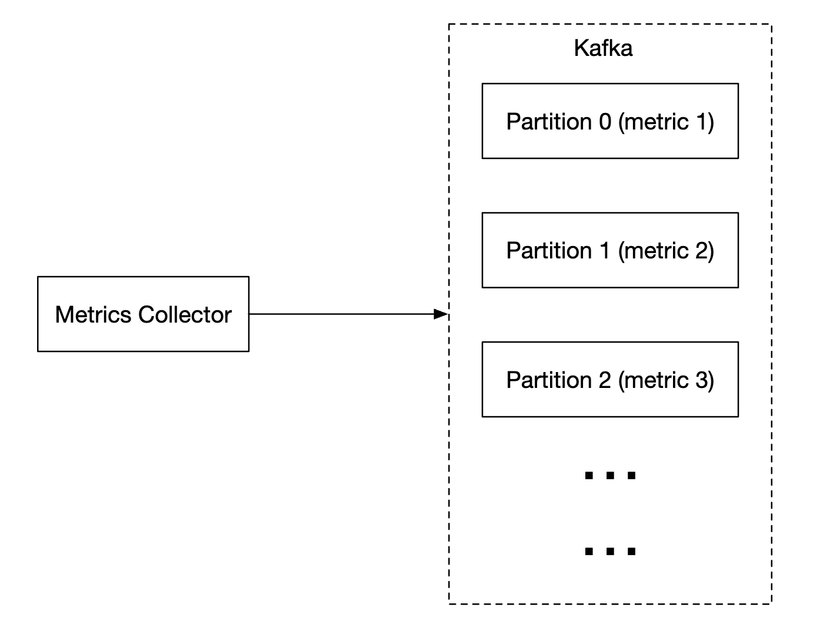
</p>
The main downside of using Kafka for this problem is the maintenance/operation overhead.
An alternative is to use a large-scale ingestion system like [Gorilla](https://www.vldb.org/pvldb/vol8/p1816-teller.pdf).
It can be argued that using that would be as scalable as using Kafka for queuing.

### **Where aggregations can happen**
Metrics can be aggregated at several places. There are trade-offs between different choices:
 - **Collection agent**: client-side collection agent only supports simple aggregation logic. Eg collect a counter for 1m and send it to the metrics collector.
 - **Ingestion pipeline**: To aggregate data before writing to the DB, we need a stream processing engine like Flink. This reduces write volume, but we lose data precision as we don't store raw data.
 - **Query side**: We can aggregate data when we run queries via our visualization system. There is no data loss, but queries can be slow due to a lot of data processing.

| Where | Write volume | Query speed | What you lose |
|---|---|---|---|
| Collection agent | Reduced at the source | Fast | Sub-interval detail; agent-side complexity and memory |
| Ingestion pipeline (Flink) | **Greatly reduced** | Fast | **Raw data — permanently.** Questions you did not anticipate become unanswerable |
| Query time | Unchanged (highest) | Slow on wide ranges | Nothing |

The decision is really about **which questions you are willing to foreclose.** Pre-aggregation is irreversible: once only the 1-minute average is stored, nobody can ever ask about the 5-second spike, or re-slice the data by a dimension that was aggregated away. Query-time aggregation keeps every question open and pays for it on every dashboard load. Most systems do both — aggregate at query time for recent raw data, and pre-aggregate as data ages, which is exactly what the down-sampling policy below is.

**One aggregation that is mathematically invalid, and is attempted constantly:** you cannot average percentiles. The mean of each host's p99 latency is **not** the fleet's p99, and there is no arithmetic that recovers it from the per-host percentiles — the information required is simply not there. A host serving 10 requests and one serving 10 million contribute equally to the average, and a genuine tail concentrated on one host disappears.

The correct approach is to aggregate the *distribution*, not the summary: store a **histogram** (bucket counts, which add correctly across hosts) or a mergeable sketch such as t-digest or HDR histogram, and compute the percentile after merging. This is the single most common correctness bug in metrics dashboards, and it reliably hides exactly the latency problems the dashboard exists to reveal.

### **Query Service**
Having a separate query service from the time-series DB decouples the visualization and alerting system from the database, which enables us to decouple the DB from clients and change it at will.

We can add a Cache layer here to reduce the load to the time-series database:

<p align="left">
    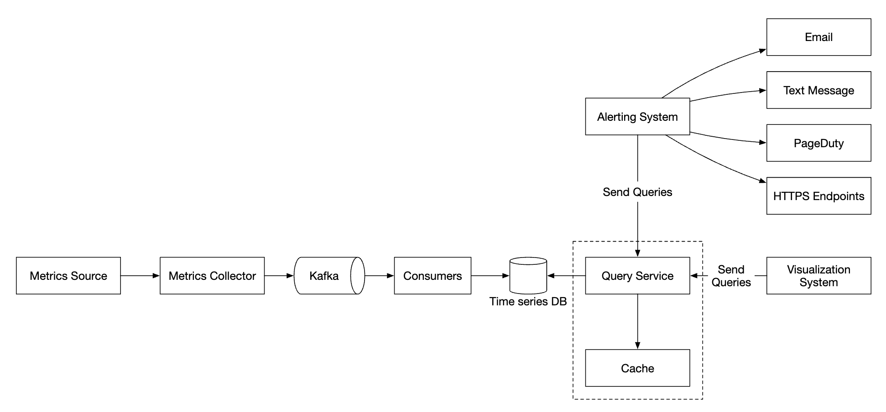
</p>
We can also avoid adding a query service altogether as most visualization and alerting systems have powerful plugins to integrate with most time-series databases.
With a well-chosen time-series DB, we might not need to introduce our own caching layer as well.

Most time-series DBs don't support SQL simply because it is ineffective for querying time-series data. Here's an example SQL query for computing an exponential moving average:

```
select id,
       temp,
       avg(temp) over (partition by group_nr order by time_read) as rolling_avg
from (
  select id,
         temp,
         time_read,
         interval_group,
         id - row_number() over (partition by interval_group order by time_read) as group_nr
  from (
    select id,
    time_read,
    "epoch"::timestamp + "900 seconds"::interval * (extract(epoch from time_read)::int4 / 900) as interval_group,
    temp
    from readings
  ) t1
) t2
order by time_read;
```

Here's the same query in Flux - query language used in InfluxDB:

```
from(db:"telegraf")
  |> range(start:-1h)
  |> filter(fn: (r) => r._measurement == "foo")
  |> exponentialMovingAverage(size:-10s)
```

### **Storage layer**
It is important to choose the time-series database carefully.

According to research published by Facebook, ~85% of queries to the operational store were for data from the past 26h.

If we choose a database, which harnesses this property, it could have significant impact on system performance. InfluxDB is one such option.

Regardless of the database we choose, there are some optimizations we might employ.

Data encoding and compression can significantly reduce the size of data. Those features are usually built into a good time-series database.

<p align="left">
    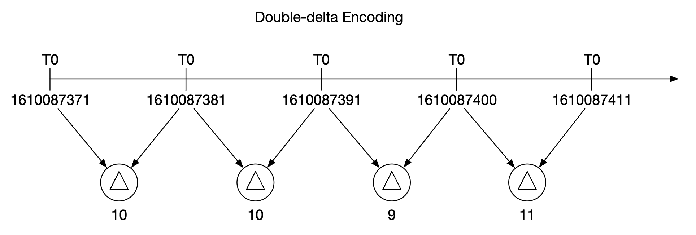
</p>
In the above example, instead of storing full timestamps, we can store timestamp deltas.

Another technique we can employ is down-sampling - converting high-resolution data to low-resolution in order to reduce disk usage.

Down-sampling works because of the access pattern noted just above — Facebook found ~85% of queries touched the last 26 hours. **Data loses value with age far faster than it loses volume**, so paying full resolution for a year is paying for data nobody will query. The policy encodes a judgement about what questions survive at what age: debugging an incident needs seconds of resolution and a window of hours; capacity planning needs hours of resolution and a window of a year. Neither needs what the other has.

Note the one real trap: down-sampling must preserve the *right* aggregate. Averaging an average is fine; averaging a maximum destroys exactly the spikes you were watching for. Store min, max, sum, count and the bucket counts rather than a single mean, or a down-sampled series will quietly stop being able to answer the question it was created for.

We can use that for old data and make the rules configurable by data scientists, eg:
 - 7d - no down-sampling
 - 30d - down-sample to 1min
 - 1y - down-sample to 1h

For example, here's a 10-second resolution metrics table:
| metric | timestamp            | hostname | Metric_value |
|--------|----------------------|----------|--------------|
| cpu    | 2021-10-24T19:00:00Z | host-a   | 10           |
| cpu    | 2021-10-24T19:00:10Z | host-a   | 16           |
| cpu    | 2021-10-24T19:00:20Z | host-a   | 20           |
| cpu    | 2021-10-24T19:00:30Z | host-a   | 30           |
| cpu    | 2021-10-24T19:00:40Z | host-a   | 20           |
| cpu    | 2021-10-24T19:00:50Z | host-a   | 30           |

down-sampled to 30-second resolution:
| metric | timestamp            | hostname | Metric_value (avg) |
|--------|----------------------|----------|--------------------|
| cpu    | 2021-10-24T19:00:00Z | host-a   | 19                 |
| cpu    | 2021-10-24T19:00:30Z | host-a   | 25                 |

Finally, we can also use cold storage for old data, which is no longer actively queried. The financial cost for cold storage is much lower.

### **Alerting system**

<p align="left">
    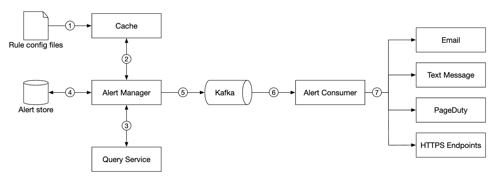
</p>
Configuration is loaded to cache servers. Rules are typically defined in YAML format. Here's an example:

```
- name: instance_down
  rules:

  # Alert for any instance that is unreachable for >5 minutes.
  - alert: instance_down
    expr: up == 0
    for: 5m
    labels:
      severity: page
```

The alert manager fetches alert configurations from cache. Based on configuration rules, it also calls the query service at a predefined interval.
If a rule is met, an alert event is created.

Other responsibilities of the alert manager are:
 - Filtering, merging and deduplicating alerts. Eg if an alert of a single instance is triggered multiple times, only one alert event is generated.
 - Access control - it is important to restrict alert-management operations to certain individuals only
 - Retry - the manager ensures that the alert is propagated at least once.

**The `for: 5m` clause is doing more work than it looks.** Without it, any metric crossing the threshold for a single scrape pages someone — and real metrics are noisy, so an alert on `up == 0` without a duration will fire on every transient scrape failure, every deploy, every garbage-collection pause. Requiring the condition to hold *continuously* for a period is the anti-flapping mechanism, and tuning it is a direct trade: shorter means faster detection and more false pages, longer means fewer false pages and slower detection.

Grouping and deduplication serve the same goal from the other side. A rack losing power trips 100 instance-down rules; sending 100 pages makes the actual problem *harder* to see. Collapsing related alerts into one notification, and suppressing downstream alerts when an upstream cause is already firing, is what keeps a real incident legible.

**And the part no architecture diagram shows: alert fatigue is a system failure.** An on-call engineer who has been woken three times this week by alerts that resolved themselves will start ignoring the fourth, which will be the real one. The design consequences are concrete:

- **Alert on symptoms, not causes.** "p99 latency exceeds 2 s" is actionable and user-facing; "CPU is at 80%" may be entirely normal. One high-CPU host in a healthy fleet is not worth a human.
- **Every page needs a plausible action.** If the response is "look, confirm it recovered, go back to sleep", it should have been a dashboard, not a page.
- **Severity must be real.** If everything is a page, nothing is.

The alert store is a key-value database, like Cassandra, which keeps the state of all alerts. It ensures a notification is sent at least once.
Once an alert is triggered, it is published to Kafka.

Finally, alert consumers pull alerts data from Kafka and send notifications over to different channels - Email, text message, PagerDuty, webhooks.

In the real-world, there are many off-the-shelf solutions for alerting systems. It is difficult to justify building your own system in-house.

### **Visualization system**
The visualization system shows metrics and alerts over a time period. Here's a dashboard built with Grafana:

<p align="left">
    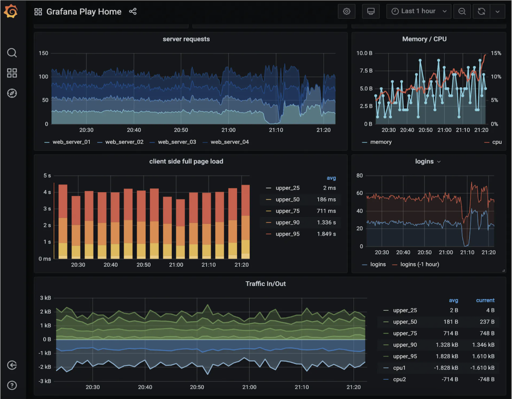
</p>
A high-quality visualization system is very hard to build. It is hard to justify not using an off-the-shelf solution like Grafana.

---

## Step 4: Wrap up
Here's our final design:

<p align="left">
    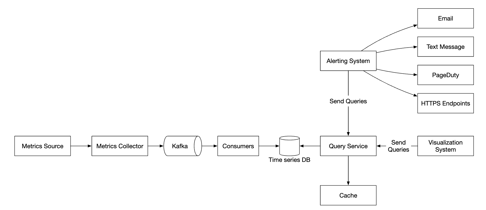
</p>

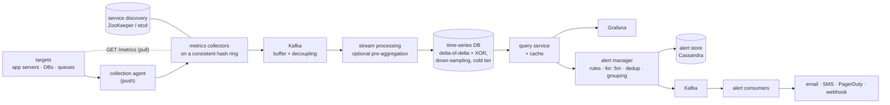

**Why the queue in the middle earns its place**, beyond the chapter's point about surviving a database outage: it decouples two components with completely different scaling behaviour and failure modes. Collectors are stateless and autoscale freely; the time-series database is stateful, carefully sized, and occasionally needs maintenance. Without the buffer, every write-path hiccup propagates straight back to the collectors and metrics are lost precisely during the incident you most need to observe. This is [Chapter 19](../19.%20Distributed%20Message%20Queue/) doing the job it exists for.

---

### Gotchas & failure modes

- **Cardinality explosion is the dominant failure mode.** Memory scales with the number of series, not the number of points, so one high-cardinality label (`user_id`, `request_id`, an un-normalised URL) can multiply series count by millions and take the cluster down. It is usually introduced by a one-line application change, and the created series persist until retention expires.
- **The monitoring system cannot report its own death.** If ingestion stops, every dashboard goes flat and every threshold alert goes quiet — which looks exactly like a perfectly healthy system. The remedy is a **dead-man's-switch**: a heartbeat that fires continuously, watched by something *outside* this system, which alerts when it stops arriving. Alerting on absence rather than on threshold is the only construction that catches this.
- **Averaging percentiles is mathematically wrong** and hides the tail latency you are looking for. Aggregate histograms or mergeable sketches, then compute the percentile.
- **Pre-aggregation is irreversible.** Raw data discarded in the ingestion pipeline forecloses every question you did not think to ask in advance, and those are the questions incidents generate.
- **Down-sampling the wrong aggregate destroys the signal.** Averaging maxima smooths away spikes. Keep min/max/sum/count, not just a mean.
- **In push mode, silence is ambiguous.** Dead service, dead agent, broken network and intentional decommission are indistinguishable without a separate inventory.
- **Short-lived jobs are invisible to pull.** Batch jobs and serverless functions finish before a scrape. A push gateway fixes it and inherits push's staleness problem — an old entry looks healthy.
- **Scrape intervals and alert windows interact.** A `for: 1m` rule on a 60-second scrape interval has one sample to work with. Alert windows need to be several scrape intervals wide, or they fire on single missed samples.
- **An alert storm buries the actual cause.** A rack losing power trips every instance rule it hosts. Grouping and inhibition (suppressing downstream alerts when an upstream cause is firing) are what keep an incident readable.
- **Alert fatigue is a real failure of the system, not of the engineer.** Pages that are routinely self-resolving train people to ignore the one that matters. Alert on user-visible symptoms, and ensure every page has an action.
- **Metrics collection must degrade gracefully, never block.** An agent that blocks the application thread when the collector is unreachable turns a monitoring outage into a production outage. Fire-and-forget, bounded buffers, and drop on overflow.
- **Timestamps come from the sources.** Clock skew across a fleet puts points in the wrong buckets and can produce out-of-order writes that a time-series database handles poorly or rejects outright.
- **Collector rebalancing double-counts or drops.** With collectors on a consistent hash ring, a membership change reassigns targets — briefly two collectors scrape the same target, or none does. [Chapter 5](../05.%20Consistent%20Hashing/) limits the churn; it does not eliminate the window.
- **Incidents invert the read pattern.** Reads are rare and then suddenly enormous, as everyone opens dashboards over the same window at once — a thundering herd on the query path at the worst possible time. The query cache exists for this.
- **Observing a system changes it.** 100 metrics per machine scraped every 10 seconds consumes CPU, memory and network on the machine being measured. At fine intervals this becomes a measurable tax on the fleet.
- **Building this is rarely justified.** The chapter says so twice, about alerting and visualisation, and it is right — the interview value is in understanding the trade-offs, not in the implementation.

---

## The design, as problem and technique

| Goal / problem | Technique |
|---|---|
| 1 M writes/sec of tiny points | Purpose-built time-series database, not a general-purpose one |
| 55 TB of data points | Delta-of-delta timestamps and XOR-encoded values — ~25× compression |
| A year of retention nobody queries at full resolution | Tiered down-sampling (raw 7 d → 1 min 30 d → 1 h 1 y), then cold storage |
| Most queries touching the last 26 hours | A store that keeps recent data in memory; query-layer cache |
| Knowing a target is down | Pull model with service discovery, so absence is meaningful |
| Targets pull cannot reach | Push path with agents, plus a push gateway for short-lived jobs |
| Two collectors scraping the same target | Collectors and targets on a consistent hash ring |
| Database outage losing metrics | Kafka between collectors and storage |
| Reducing write volume | Aggregation at the agent or in a stream processor, accepting lost precision |
| Correct fleet-wide percentiles | Aggregate histograms or sketches, never averages of percentiles |
| Noisy metrics causing false pages | `for:` duration on rules; grouping, deduplication and inhibition |
| At-least-once alert delivery | Alert state in a durable KV store; Kafka to the notification channels |
| Detecting that monitoring itself has stopped | External dead-man's-switch alerting on the absence of a heartbeat |
| Changing the database later | Query service decoupling clients from the store |

## Self-check
1. Derive the write rate from 10 M metrics at a 10-second interval. How many nodes does that imply at ~250 K writes/sec each?
2. Why does a data point cost under 2 bytes when a timestamp and a float are 16? Name both mechanisms.
3. Does memory usage scale with data points or with time series? What follows from that?
4. A developer adds `endpoint` and `user_id` labels to a request counter. Estimate the new series count and describe what happens.
5. Why is `up == 0` natural in a pull system and awkward in a push system?
6. What cannot be monitored by pull at all, and what is the patch — including what the patch inherits?
7. You have each host's p99 latency. How do you get the fleet's p99? What must you have stored instead?
8. Which aggregation choice is irreversible, and what does it cost you during an incident?
9. Down-sampling a `max` series by averaging — what breaks?
10. Ingestion stops entirely. What do the dashboards show, which alerts fire, and what construction catches it?
11. A rack loses power and 100 instances go down. What does a naive alert configuration do, and why is that harmful?
12. Why must a collection agent never block the application it is measuring?
13. Reads are described as rare but spiky. When do the spikes happen, and why is that the worst time?

## Glossary

| Term | Meaning |
|---|---|
| **Time series** | A named, labelled sequence of timestamped values |
| **Label / tag** | A key-value dimension on a metric; their product determines series count |
| **Cardinality** | The number of distinct time series — the resource that actually constrains the system |
| **Line protocol** | The `name tags timestamp value` text format used by Prometheus, OpenTSDB and others |
| **Pull vs push** | Collector scrapes targets vs targets send to the collector |
| **Push gateway** | An intermediary letting short-lived jobs be scraped after they exit |
| **Delta-of-delta encoding** | Storing the change in the interval between timestamps — usually zero |
| **XOR float compression** | Storing a value XOR-ed with its predecessor, leaving mostly zero bits |
| **Down-sampling** | Reducing resolution as data ages |
| **Rollup** | The aggregate stored when down-sampling (avg, min, max, sum, count) |
| **Histogram / sketch** | Bucketed or mergeable distribution, so percentiles survive aggregation |
| **`for:` duration** | How long a rule's condition must hold before alerting — the anti-flapping control |
| **Grouping / inhibition** | Collapsing related alerts, and suppressing downstream ones when a cause is firing |
| **Dead-man's-switch** | An external alert on the *absence* of a heartbeat, which catches monitoring failure |
| **Alert fatigue** | Degraded human response caused by too many low-value pages |

## Where to go next
- [Chapter 19 – Distributed Message Queue](../19.%20Distributed%20Message%20Queue/) — the buffer between collectors and storage, and the log-structured ideas the time-series store reuses.
- [Chapter 21 – Ad Click Event Aggregation](../21.%20Ad%20Click%20Event%20Aggregation/) — the same ingest-and-aggregate shape where correctness matters, so watermarks and reconciliation appear.
- [Chapter 1 §11 – Logging, Metrics, and Automation](../01.%20Scaling/#section-11-logging-metrics-and-automation) — where metrics sit among the three pillars of observability.
- [Chapter 5 – Design Consistent Hashing](../05.%20Consistent%20Hashing/) — the collector ring, and the churn window a membership change opens.
- [Chapter 10 – Design A Notification System](../10.%20Notification%20System/) — the delivery path the alert consumers hand off to.