# Chapter 21: Ad Click Event Aggregation

## Introduction
**Digital advertising** is a big industry with the rise of Facebook, YouTube, TikTok, etc.

Hence, tracking ad click events is important. In this chapter, we explore how to design an **ad click event aggregation** system at Facebook/Google scale.

Digital advertising has a process called **real-time bidding (RTB)**, where digital advertising inventory is bought and sold:

<p align="left">
    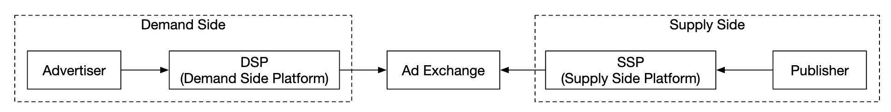
</p>

Speed of RTB is important as it usually occurs within a second.
Data accuracy is also very important as it impacts how much money advertisers pay.

Based on ad click event aggregations, advertisers can make decisions such as adjust target audience and keywords.

**The one-sentence version:** the output of this system is **money** — it is what advertisers are billed from — and that single fact reorders every priority in the book. Elsewhere you trade correctness for latency and cost without much hesitation; here a 0.1% error on a billion events a day is a material financial discrepancy and a legal problem.

Everything unusual about this design follows from that:

| Unusual choice | Because the output is money |
|---|---|
| Event time, not processing time | A click's value belongs to the minute it happened, not the minute you processed it |
| Watermarks | Late events must still be counted, so the window waits |
| Exactly-once rather than at-least-once | Double-counted clicks mean over-billing |
| Raw events retained, not just aggregates | So any number can be recomputed and audited |
| End-of-day reconciliation | The streaming result is fast; the batch result is **authoritative** |

That last row is the real architecture of this chapter: **the fast answer and the correct answer are produced by different paths, and the correct one wins.** A streaming system alone cannot promise accuracy in the presence of late events, duplicates, and partial failures — so it does not try to. It promises speed, and a batch job promises truth.

---

## Step 1: Understand the Problem and Establish Design Scope
 - C: What is the format of the input data?
 - I: 1bil ad clicks per day and 2mil ads in total. Number of ad-click events grows 30% year-over-year.
 - C: What are some of the most important queries our system needs to support?
 - I: Top queries to take into consideration:
   - Return number of click events for ad X in last Y minutes
   - Return top 100 most clicked ads in the past 1min. Both parameters should be configurable. Aggregation occurs every minute.
   - Support data filtering by `ip`, `user_id`, `country` for the above queries
 - C: Do we need to worry about edge cases? Some of the ones I can think of:
   - There might be events that arrive later than expected
   - There might be duplicate events
   - Different parts of the system might be down, so we need to consider system recovery
 - I: That's a good list, take those into consideration
 - C: What is the latency requirement?
 - I: A few minutes of e2e latency for ad click aggregation. For RTB, it is less than a second. It is ok to have that latency for ad click aggregation as those are usually used for billing and reporting.

### **Functional requirements**
 - Aggregate the number of clicks of `ad_id` in the last Y minutes
 - Return top 100 most clicked `ad_id` every minute
 - Support aggregation filtering by different attributes
 - Dataset volume is at Facebook or Google scale

### **Non-functional requirements**
 - Correctness of the aggregation result is important as it's used for RTB and ads billing
 - Properly handle delayed or duplicate events
 - Robustness - system should be resilient to partial failures
 - Latency - a few minutes of e2e latency at most

### **Back-of-the-envelope estimation**
 - 1bil DAU
 - Assuming user clicks 1 ad per day -> 1bil ad clicks per day
 - Ad click QPS = 10,000
 - Peak QPS is 5 times the number = 50,000
 - A single ad click occupies 0.1KB storage. Daily storage requirement is 100gb
 - Monthly storage = 3tb

### Input versus output, and why you keep both

| Quantity | Derivation | Result |
|---|---|---|
| Click QPS | 1 B / 86,400 | **~11,600/sec** (the chapter rounds to 10,000) |
| Peak QPS | ~5× | **~50,000/sec** |
| Raw storage | 1 B × 0.1 KB | **100 GB/day, ~36 TB/year** |
| Aggregated cells/day | 2 M ads × 1,440 minutes | ≤ 2.9 B, mostly empty in practice |
| Aggregated size | A few tens of bytes per non-empty cell | **Orders of magnitude smaller than raw** |

The aggregated output is tiny compared with the input — and **you must keep the raw input anyway.** That is worth stating explicitly because it looks redundant: if nobody queries raw events, why store 36 TB a year of them?

Three reasons, all consequences of the money framing:

1. **Recomputation.** A bug in aggregation logic is not hypothetical, and without raw events the wrong numbers are permanent.
2. **Reconciliation.** The end-of-day batch job needs an independent source of truth to compare against.
3. **Audit.** "Why was I charged for 40,312 clicks?" must be answerable from evidence, not from a derived counter.

**One estimate the chapter omits: the cost of filters.** The requirement is to filter by `ip`, `user_id` and `country`. Pre-aggregating every combination of `k` filter dimensions means up to `2^k` aggregates per ad per minute, and `user_id` alone has a billion distinct values — the cardinality explosion from [Chapter 20](../20.%20Metrics%20Monitoring%20and%20Alerting%20System/#data-model) in a different costume. This is exactly why the API takes a **filter identifier** (`filter=001` meaning "non-US clicks") rather than arbitrary predicates: a small set of useful filter combinations is pre-declared and pre-aggregated, and anything else is a query against raw data, not a served aggregate. Noticing that the opaque filter ID is a *cardinality control* rather than an API shortcut is the sort of detail worth pointing out in an interview.

> **Interview angle:** say early that the output is billing data, and that this makes correctness dominate latency. Then propose the two-path structure — streaming for minutes-fresh numbers, batch reconciliation for the authoritative ones — because it pre-answers the interviewer's entire line of questioning about duplicates, late events and recovery.

---

## Step 2: Propose High-Level Design and Get Buy-In
In this section, we discuss query API design, data model and high-level design.

### **Query API Design**
The API is a contract between the client and the server. In our case, the client is the dashboard user - data scientist/analyst, advertiser, etc.

Here's our functional requirements:
 - Aggregate the number of clicks of `ad_id` in the last Y minutes
 - Return top N most clicked `ad_id` in the last M minutes
 - Support aggregation filtering by different attributes

We need two endpoints to achieve those requirements. Filtering can be done via query parameters on one of them.

**Aggregate number of clicks of ad_id in the last M minutes**:

```
GET /v1/ads/{:ad_id}/aggregated_count
```

Query parameters:
 - from - start minute. Default is now - 1 min
 - to - end minute. Default is now
 - filter - identifier for different filtering strategies. Eg 001 means "non-US clicks".

Response:
 - ad_id - ad identifier
 - count - aggregated count between start and end minutes

**Return top N most clicked ad_ids in the last M minutes**

```
GET /v1/ads/popular_ads
```

Query parameters:
 - count - top N most clicked ads
 - window - aggregation window size in minutes
 - filter - identifier for different filtering strategies

Response:
 - list of ad_ids

### **Data model**
In our system, we have raw and aggregated data.

Raw data looks like this:

```
[AdClickEvent] ad001, 2021-01-01 00:00:01, user 1, 207.148.22.22, USA
```

Here's an example in a structured format:
| ad_id | click_timestamp     | user  | ip            | country |
|-------|---------------------|-------|---------------|---------|
| ad001 | 2021-01-01 00:00:01 | user1 | 207.148.22.22 | USA     |
| ad001 | 2021-01-01 00:00:02 | user1 | 207.148.22.22 | USA     |
| ad002 | 2021-01-01 00:00:02 | user2 | 209.153.56.11 | USA     |

Here's the aggregated version:
| ad_id | click_minute | filter_id | count |
|-------|--------------|-----------|-------|
| ad001 | 202101010000 | 0012      | 2     |
| ad001 | 202101010000 | 0023      | 3     |
| ad001 | 202101010001 | 0012      | 1     |
| ad001 | 202101010001 | 0023      | 6     |

The `filter_id` helps us achieve our filtering requirements.
| filter_id | region | IP        | user_id |
|-----------|--------|-----------|---------|
| 0012      | US     | *         | *       |
| 0013      | *      | 123.1.2.3 | *       |

To support quickly returning top N most clicked ads in the last M minutes, we'll also maintain this structure:
| most_clicked_ads   |           |                                                  |
|--------------------|-----------|--------------------------------------------------|
| window_size        | integer   | The aggregation window size (M) in minutes       |
| update_time_minute | timestamp | Last updated timestamp (in 1-minute granularity) |
| most_clicked_ads   | array     | List of ad IDs in JSON format.                   |

What are some pros and cons between storing raw data and storing aggregated data?
 - Raw data enables using the full data set and supports data filtering and recalculation
 - On the other hand, aggregated data allows us to have a smaller data set and a faster query
 - Raw data means having a larger data store and a slower query
 - Aggregated data, however, is derived data, hence there is some data loss.

In our design, we'll use a combination of both approaches:
 - It's a good idea to keep the raw data around for debugging. If there is some bug in aggregation, we can discover the bug and backfill.
 - Aggregated data should be stored as well for faster query performance.
 - Raw data can be stored in cold storage to avoid extra storage costs.

When it comes to the database, there are several factors to take into consideration:
 - What does the data look like? Is it relational, document or blob?
 - Is the workload read-heavy, write-heavy or both?
 - Are transactions needed?
 - Do the queries rely on OLAP functions like SUM and COUNT?

For the raw data, we can see that the average QPS is 10k and peak QPS is 50k, so the system is write-heavy.
On the other hand, read traffic is low as raw data is mostly used as backup if anything goes wrong.

Relational databases can do the job, but it can be challenging to scale the writes. 
Alternatively, we can use Cassandra or InfluxDB which have better native support for heavy write loads.

Another option is to use Amazon S3 with a columnar data format like ORC, Parquet or AVRO. Since this setup is unfamiliar, we'll stick to Cassandra.

For aggregated data, the workload is both read and write heavy as aggregated data is constantly queried for dashboards and alerts.
It is also write-heavy as data is aggregated and written every minute by the aggregation service. 
Hence, we'll use the same data store (Cassandra) here as well.

### **High-level design**
Here's how our system looks like:

<p align="left">
    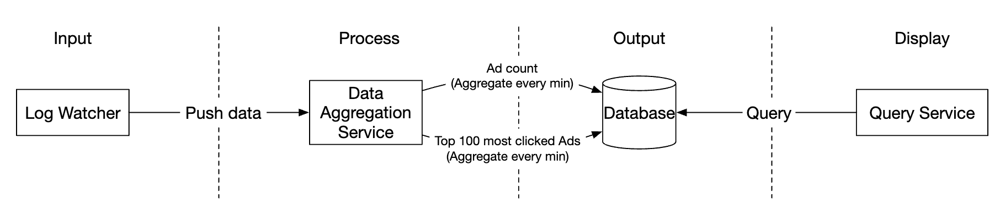
</p>

Data flows as an unbounded data stream on both inputs and outputs.

In order to avoid having a synchronous sink, where a consumer crashing can cause the whole system to stall, 
we'll leverage asynchronous processing using message queues (Kafka) to decouple consumers and producers.

<p align="left">
    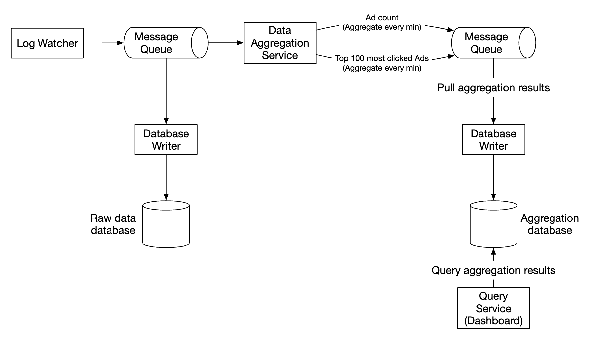
</p>

The first message queue stores ad click event data:
| ad_id | click_timestamp | user_id | ip | country |
|-------|-----------------|---------|----|---------|

The second message queue contains ad click counts, aggregated per-minute:
| ad_id | click_minute | count |
|-------|--------------|-------|

As well as top N clicked ads aggregated per minute:
| update_time_minute | most_clicked_ads |
|--------------------|------------------|

The second message queue is there in order to achieve end to end exactly-once atomic commit semantics:

<p align="left">
    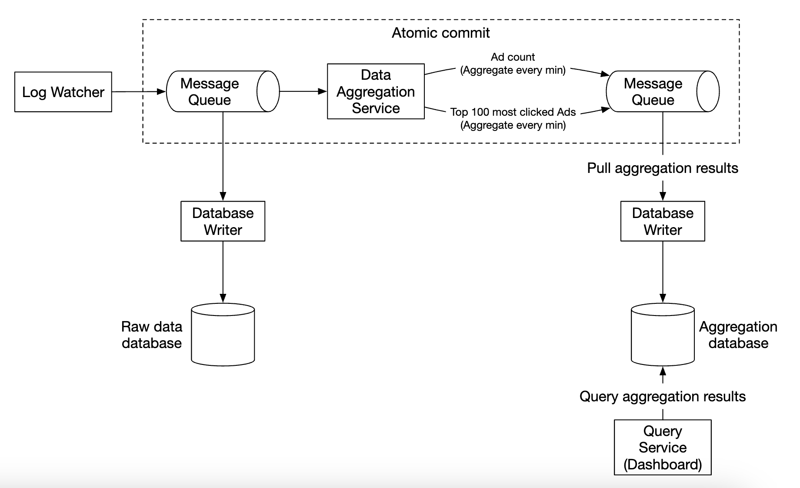
</p>

For the aggregation service, using the MapReduce framework is a good option:

<p align="left">
    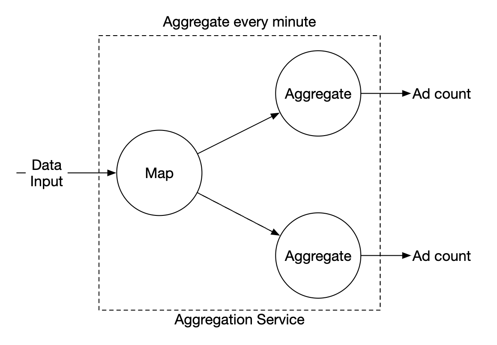
</p>

<p align="left">
    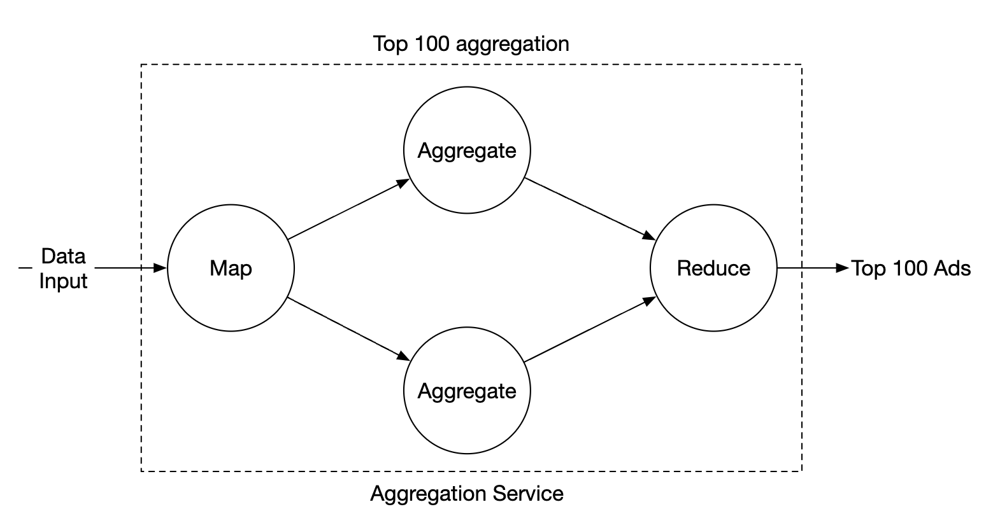
</p>

Each node is responsible for one single task and it sends the processing result to the downstream node.

The map node is responsible for reading from the data source, then filtering and transforming the data.

For example, the map node can allocate data across different aggregation nodes based on the `ad_id`:

<p align="left">
    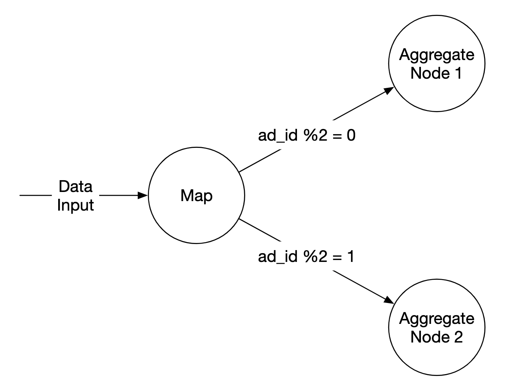
</p>

Alternatively, we can distribute ads across Kafka partitions and let the aggregation nodes subscribe directly within a consumer group.
However, the mapping node enables us to sanitize or transform the data before subsequent processing.

Another reason might be that we don't have control over how data is produced, 
so events related to the same `ad_id` might go on different partitions.

The aggregate node counts ad click events by `ad_id` in-memory every minute.

The reduce node collects aggregated results from aggregate node and produces the final result:

<p align="left">
    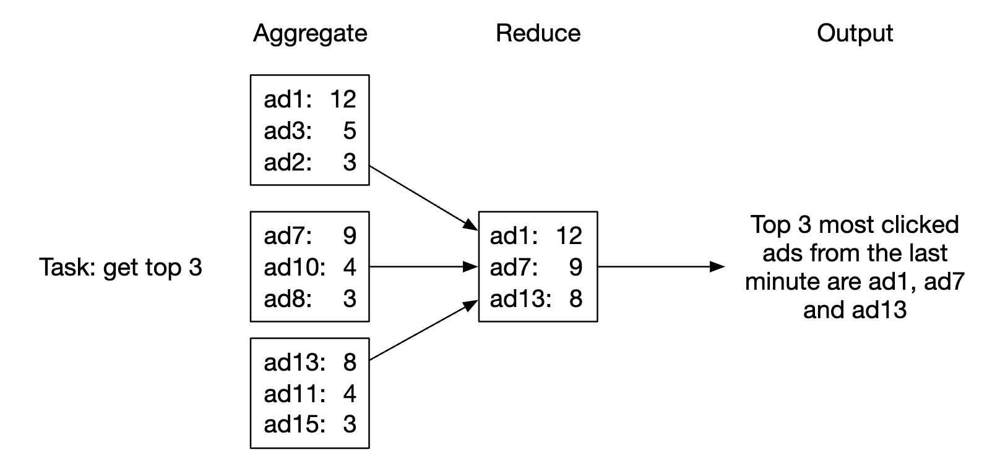
</p>

This DAG model uses the MapReduce paradigm. It takes big data and leverages parallel distributed computing to turn it into regular-sized data.

In the DAG model, intermediate data is stored in-memory and different nodes communicate with each other using TCP or shared memory.

Let's explore how this model can now help us to achieve our various use-cases.

**Use-case 1 - aggregate the number of clicks**:

<p align="left">
    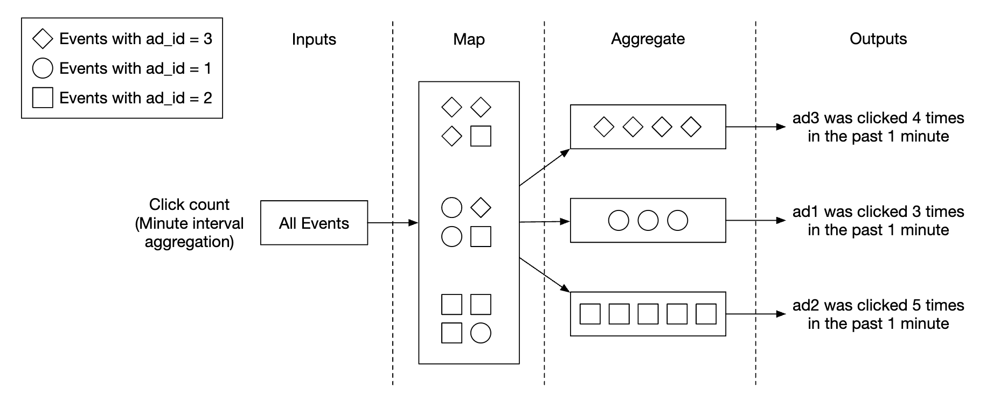
</p>

 - Ads are partitioned using `ad_id % 3`

**Use-case 2 - return top N most clicked ads**:

<p align="left">
    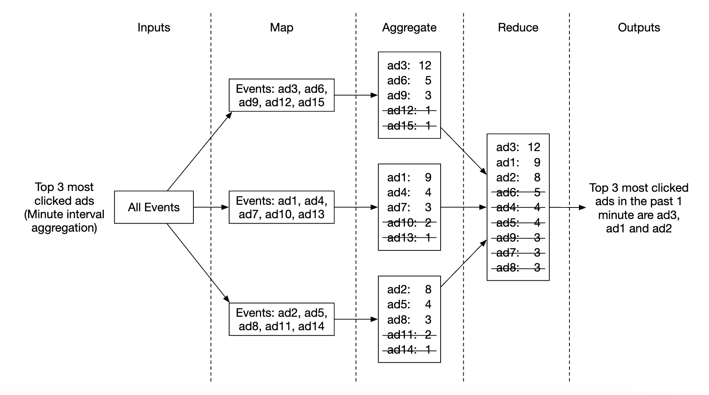
</p>

 - In this case, we're aggregating the top 3 ads, but this can be extended to top N ads easily
 - Each node maintains a heap data structure for fast retrieval of top N ads

**Use-case 3 - data filtering**:
To support fast data filtering, we can predefine filtering criterias and pre-aggregate based on it:
| ad_id | click_minute | country | count |
|-------|--------------|---------|-------|
| ad001 | 202101010001 | USA     | 100   |
| ad001 | 202101010001 | GPB     | 200   |
| ad001 | 202101010001 | others  | 3000  |
| ad002 | 202101010001 | USA     | 10    |
| ad002 | 202101010001 | GPB     | 25    |
| ad002 | 202101010001 | others  | 12    |

This technique is called the **star schema** and is widely used in data warehouses.
The filtering fields are called **dimensions**.

This approach has the following benefits:
 - Simple to undertand and build
 - Current aggregation service can be reused to create more dimensions in the star schema.
 - Accessing data based on filtering criteria is fast as results are pre-calculated

A limitation of this approach is that it creates many more buckets and records, especially when we have lots of filtering criterias.

---

## Step 3: Design Deep Dive
Let's dive deeper into some of the more interesting topics.

### **Streaming vs. Batching**
The high-level architecture we proposed is a type of stream processing system. 
Here's a comparison between three types of systems:
|                         | Services (Online system)      | Batch system (offline system)                          | Streaming system (near real-time system)     |
|-------------------------|-------------------------------|--------------------------------------------------------|----------------------------------------------|
| Responsiveness          | Respond to the client quickly | No response to the client needed                       | No response to the client needed             |
| Input                   | User requests                 | Bounded input with finite size. A large amount of data | Input has no boundary (infinite streams)     |
| Output                  | Responses to clients          | Materialized views, aggregated metrics, etc.           | Materialized views, aggregated metrics, etc. |
| Performance measurement | Availability, latency         | Throughput                                             | Throughput, latency                          |
| Example                 | Online shopping               | MapReduce                                              | Flink [13]                                   |

In our design, we used a mixture of batching and streaming. 

We used streaming for processing data as it arrives and generates aggregated results in near real-time.
We used batching, on the other hand, for historical data backup.

A system which contains two processing paths — batch and streaming — simultaneously is called a lambda architecture.
A disadvantage is that you have two processing paths with two different codebases to maintain.

Kappa is an alternative architecture, which combines batch and stream processing in one processing path.
The key idea is to use a single stream processing engine.

Lambda architecture:

<p align="left">
    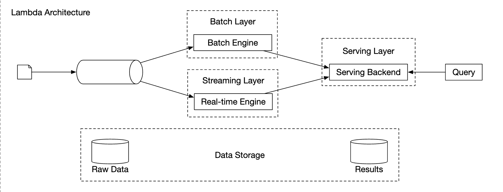
</p>

Kappa architecture:

<p align="left">
    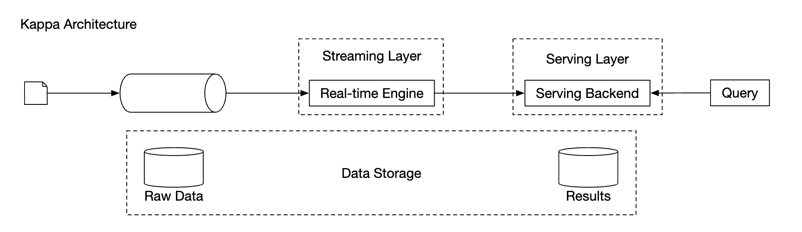
</p>

Our high-level design uses Kappa architecture as reprocessing of historical data also goes through the aggregation service.

Whenever we have to recalculate aggregated data due to eg a major bug in aggregation logic, we can recalculate the aggregation from the raw data we store.
 - Recalculation service retrieves data from raw storage. This is a batch job.
 - Retrieved data is sent to a dedicated aggregation service, so that the real-time processing aggregation service is not impacted.
 - Aggregated results are sent to the second message queue, after which we update the results in the aggregation database.

<p align="left">
    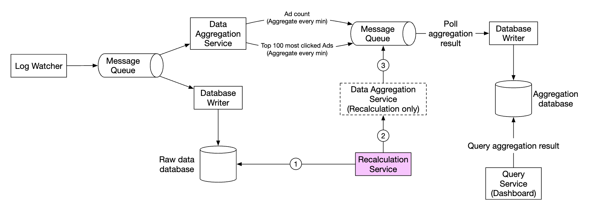
</p>

### **Time**
We need a timestamp to perform aggregation. It can be generated in two places:
 - event time - when ad click occurs
 - Processing time - system time when the server processes the event

Due to the usage of async processing (message queues) and network delays, there can be significant difference between event time and processing time.
 - If we use processing time, aggregation results can be inaccurate
 - If we use event time, we have to deal with delayed events

There is no perfect solution, we need to consider trade-offs:
|                 | Pros                                  | Cons                                                                                 |
|-----------------|---------------------------------------|--------------------------------------------------------------------------------------|
| Event time      | Aggregation results are more accurate | Clients might have the wrong time or timestamp might be generated by malicious users |
| Processing time | Server timestamp is more reliable     | The timestamp is not accurate if event is late                                       |

Since data accuracy is important, we'll use the event time for aggregation.

**How late can "late" be?** This is worth bounding, because it determines how long windows must stay open and how much state the aggregation nodes must hold:

| Source of lateness | Typical delay |
|---|---|
| Network and queue latency | Milliseconds to seconds |
| Consumer lag during a traffic spike | Seconds to minutes |
| A failed aggregation node being replaced | Minutes |
| **A mobile client that was offline** | **Hours — possibly days** |

The last row is the one that breaks naive designs. A phone with buffered events in a tunnel, on a plane, or with the app backgrounded will eventually upload clicks whose event time is hours old. No watermark is wide enough for that, and extending the window to cover it would delay every number by the same amount. Those events have to be handled by the reconciliation path, not the streaming path — which is another way of saying the batch job is not a safety net bolted on afterwards, it is the mechanism for a category of events the stream structurally cannot handle.

**And since clients supply the event time, clients can lie.** Timestamps far in the future, or far in the past, are either broken clocks or fraud. The practical defence is to **bound acceptable event time** — reject or quarantine anything outside a plausible window relative to server time — and to keep the server's receive timestamp alongside the client's claim so the two can be compared during reconciliation and fraud analysis.

To mitigate the issue of delayed events, a technique called "watermark" can be leveraged.

In the example below, event 2 misses the window where it needs to be aggregated:

<p align="left">
    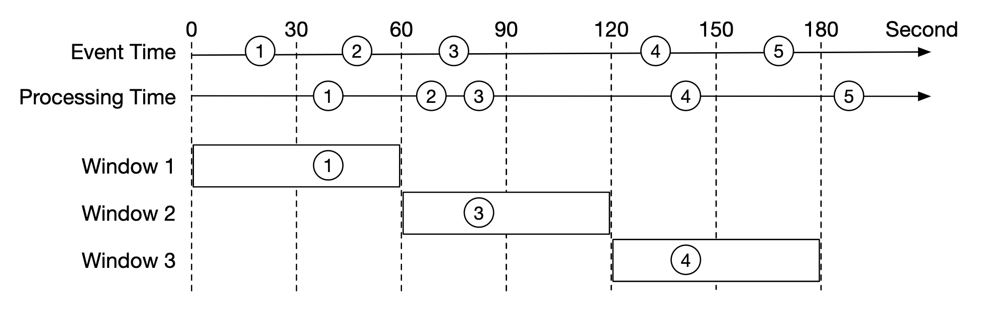
</p>

However, if we purposefully extend the aggregation window, we can reduce the likelihood of missed events.
The extended part of a window is called a "watermark":

<p align="left">
    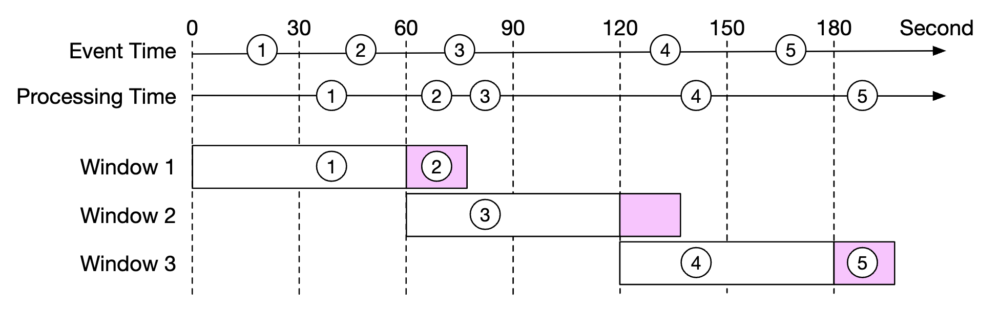
</p>

 - Short watermark increases likelihood of missed events, but reduces latency
 - Longer watermark reduces likelihood of missed events, but increases latency

There is always likelihood of missed events, regardless of the watermark's size. But there is no use in optimizing for such low-probability events.

We can instead resolve such inconsistencies by doing end-of-day reconciliation.

**A note on terminology, because the chapter's usage is loose.** In stream processing, a *watermark* is not the extended part of a window — it is an **assertion about event-time progress**: "no events with event time earlier than T will arrive from here on". The stream engine advances the watermark based on the timestamps it has observed, and a window is closed and emitted only when the watermark passes its end. The visible effect is the one the chapter describes — windows stay open longer than their nominal end, and results arrive later — but framing it as an assertion is what makes the behaviour predictable:

- Events arriving **before** the watermark passes their window are counted normally.
- Events arriving **after** are *late*. The engine can drop them, route them to a side output, or re-open the window and emit a correction — and which of the three you choose is a design decision, not a default.

For billing, "drop" is unacceptable and "re-emit a correction" means downstream must handle restatements, so the usual answer is a side output feeding the reconciliation path.

### **Aggregation window**
There are four types of window functions:
 - Tumbling (fixed) window
 - Hopping window
 - Sliding window
 - Session window

| Window type | Shape | Each event belongs to | Used here for |
|---|---|---|---|
| **Tumbling (fixed)** | Fixed size, no overlap | **Exactly one window** | Per-minute click counts |
| **Hopping** | Fixed size, fixed advance, may overlap | Several windows | — |
| **Sliding** | Continuously moving window of the last M minutes | Many windows | Top-N over the last M minutes |
| **Session** | Bounded by a gap in activity, variable length | One session | User-behaviour analysis, not counting |

**Why tumbling for counts and sliding for top-N**, which is the substantive point:

A tumbling window's defining property is that windows **do not overlap**, so every event is counted exactly once. That makes the per-minute counts **additive**: the count for an hour is the sum of its sixty minutes, and any range query can be answered by summing stored cells. For billing, where numbers must add up, non-overlapping windows are not a stylistic preference — they are what makes the stored aggregates composable and auditable.

"Top 100 ads in the last M minutes", by contrast, is a question about *now* that must be answerable continuously, not only at minute boundaries — hence a sliding window. The cost is that an event contributes to many overlapping windows, so the state is larger and the result is not additive.

In our design, we leverage a tumbling window for ad click aggregations:

<p align="left">
    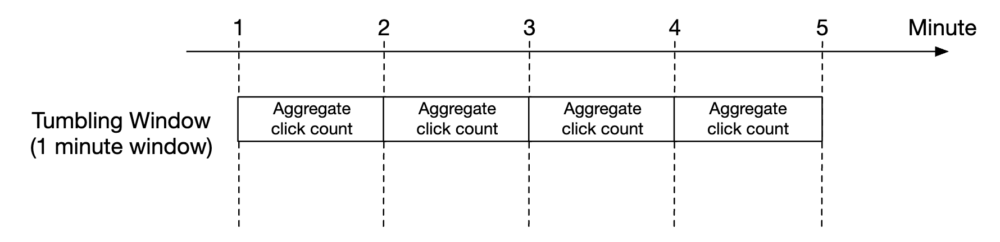
</p>

As well as a sliding window for the top N clicked ads in M minutes aggregation:

<p align="left">
    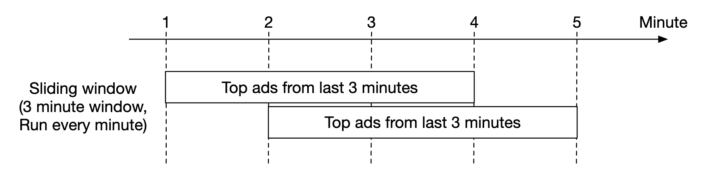
</p>

### **Delivery guarantees**
Since the data we're aggregating is going to be used for billing, data accuracy is a priority.

Hence, we need to discuss:
 - How to avoid processing duplicate events
 - How to ensure all events are processed

There are three delivery guarantees we can use - at-most-once, at-least-once and exactly once.

In most circumstances, at-least-once is sufficient when a small amount of duplicates is acceptable.
This is not the case for our system, though, as a difference in small percent can result in millions of dollars of discrepancy.
Hence, we'll need to use exactly-once delivery semantics.

### **Data deduplication**
One of the most common data quality issues is duplicated data.

It can come from a wide range of sources:
 - Client-side - a client might resend the same event multiple times. Duplicated events sent with malicious intent are best handled by a risk engine.
 - Server outage - An aggregation service node goes down in the middle of aggregation and the upstream service hasn't received an acknowledgment so event is resent.

Here's an example of data duplication occurring due to failure to acknowledge an event on the last hop:

<p align="left">
    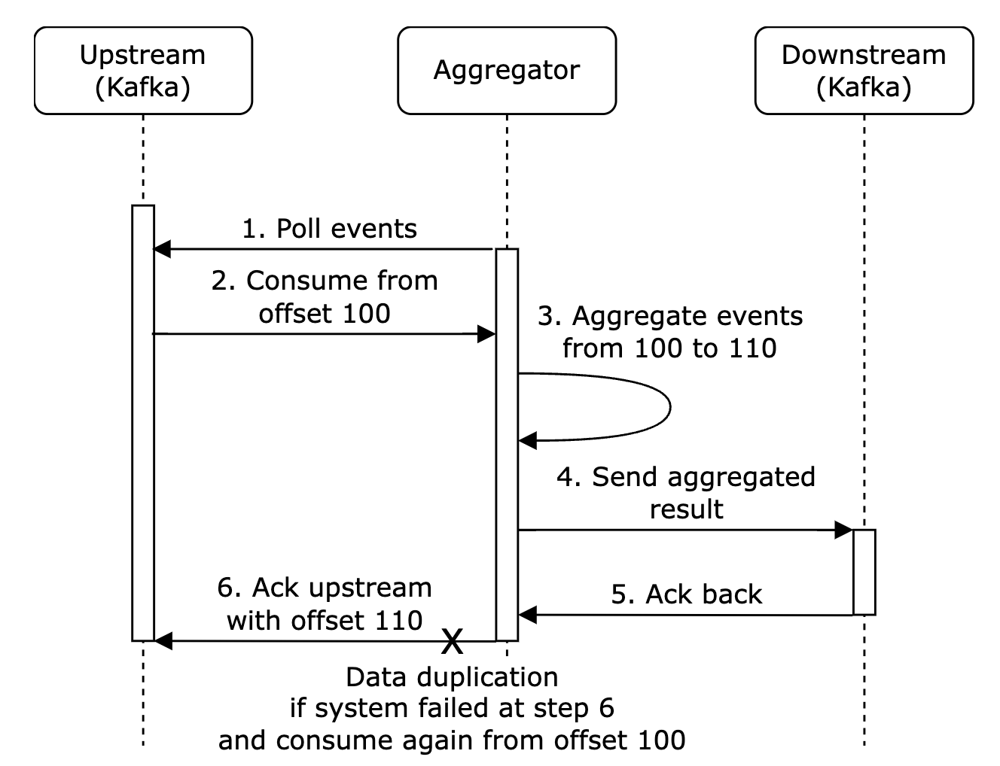
</p>

In this example, offset 100 will be processed and sent downstream multiple times.

One option to try and mitigate this is to store the last seen offset in HDFS/S3, but this risks the result never reaching downstream:

<p align="left">
    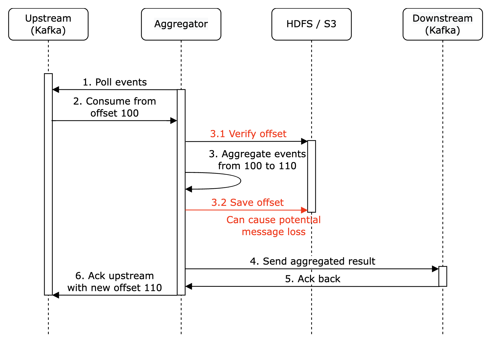
</p>

Finally, we can store the offset while interacting with downstream atomically. To achieve this, we need to implement a distributed transaction:

<p align="left">
    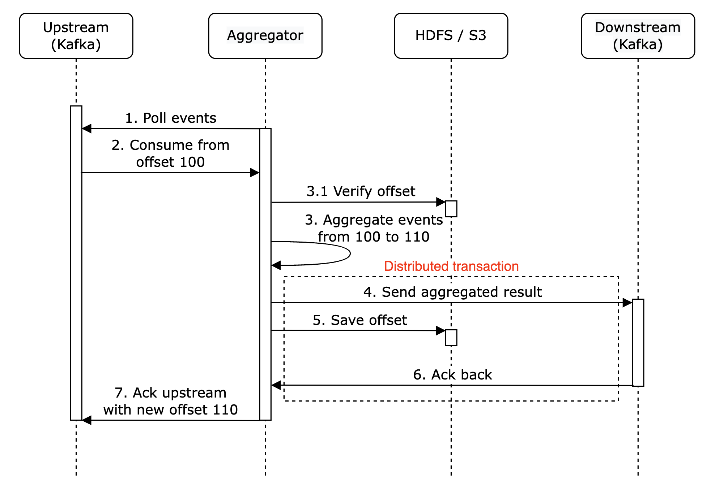
</p>

**Personal side-note**: Alternatively, if the downstream system handles the aggregation result idempotently, there is no need for a distributed transaction.

**That side-note is the better answer, and it is worth making central.** A distributed transaction spanning a message queue and a database is expensive, operationally fragile, and reduces throughput. An idempotent sink avoids the need for one entirely, and the trick is to make the write an **overwrite rather than an increment**:

```
-- not this: replay double-counts
UPDATE counts SET clicks = clicks + 42 WHERE ad_id = ? AND minute = ?

-- this: replay is harmless, the result is the same
UPSERT INTO counts (ad_id, minute, clicks) VALUES (?, ?, 42)
```

Because a tumbling window produces one final value per `(ad_id, minute)` cell, re-processing that window from the same input yields the same value, and writing it again changes nothing. Replay becomes safe, recovery becomes trivial, and the exactly-once requirement is satisfied by **idempotence rather than coordination**. This is the same lesson as [Chapter 19](../19.%20Distributed%20Message%20Queue/#exactly-once) and [Chapter 10](../10.%20Notification%20System/#reliability): at-least-once delivery plus idempotent processing beats exactly-once delivery almost every time, and here the aggregation's own structure hands you idempotence for free.

Note the one duplicate this does *not* fix: a client that genuinely sends the same click event twice with a distinct event ID is indistinguishable from two real clicks. That is click fraud detection, a separate system with a separate adversary — which is why the chapter mentions a risk engine rather than trying to solve it here.

### **Scale the system**
Let's discuss how we scale the system as it grows.

We have three independent components - message queue, aggregation service and database.
Since they are decoupled, we can scale them independently.

How do we scale the message queue:
 - We don't put a limit on producers, so they can be scaled easily
 - Consumers can be scaled by assigning them to consumer groups and increasing the number of consumers.
 - For this to work, we also need to ensure there are enough partitions created preemptively
 - Also, consumer rebalancing can take a while when there are thousands of consumers so it is recommended to do it off peak hours
 - We could also consider partitioning the topic by geography, eg `topic_na`, `topic_eu`, etc.

<p align="left">
    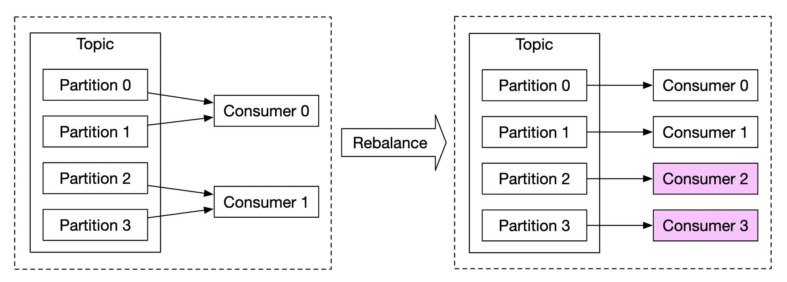
</p>

How do we scale the aggregation service:

<p align="left">
    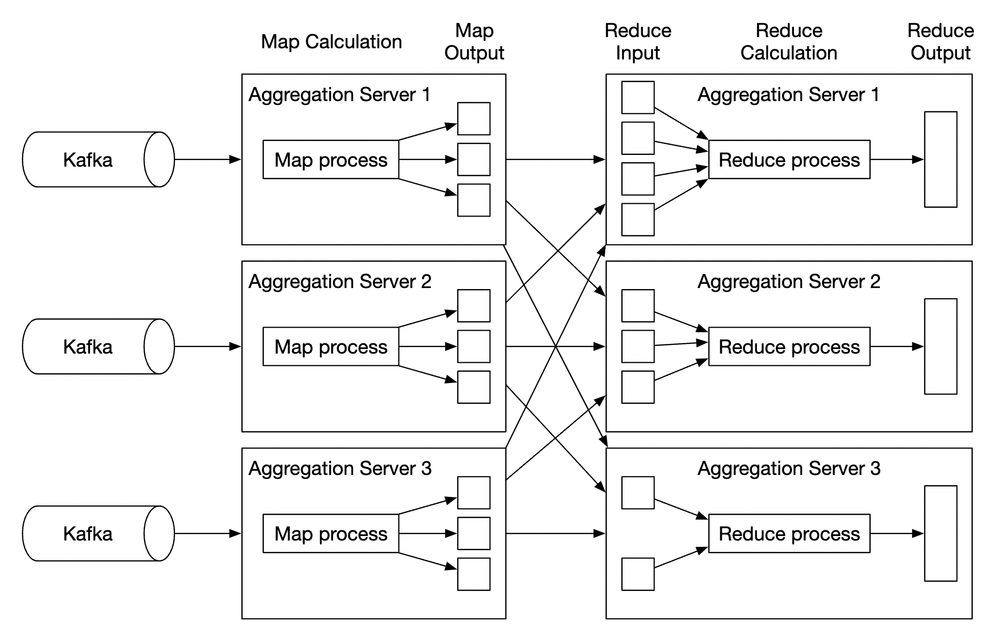
</p>

 - The map-reduce nodes can easily be scaled by adding more nodes
 - The throughput of the aggregation service can be scaled by utilising multi-threading
 - Alternatively, we can leverage resource providers such as Apache YARN to utilize multi-processing
 - Option 1 is easier, but option 2 is more widely used in practice as it's more scalable
 - Here's the multi-threading example:

<p align="left">
    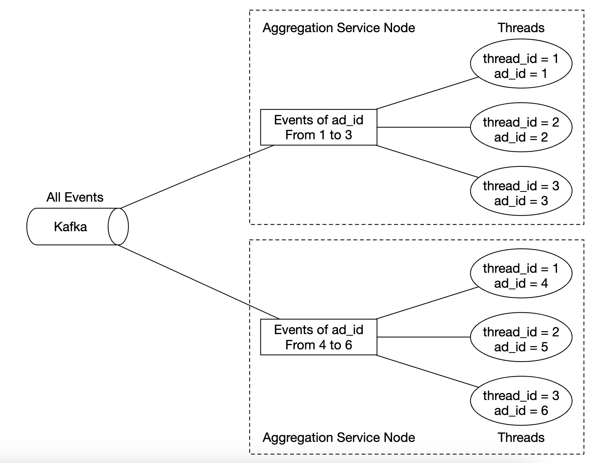
</p>

How do we scale the database:
 - If we use Cassandra, it natively supports horizontal scaling utilizing consistent hashing
 - If a new node is added to the cluster, data automatically gets rebalanced across all (virtual) nodes
 - With this approach, no manual (re)sharding is required

<p align="left">
    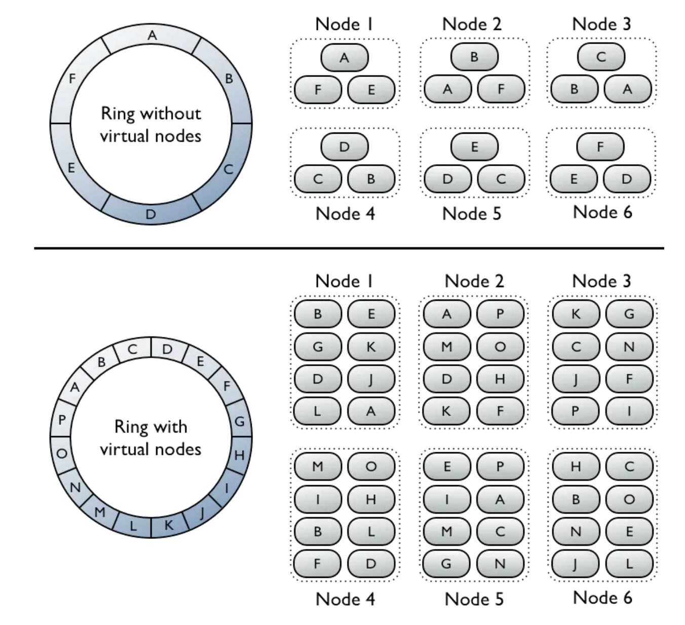
</p>

Another scalability issue to consider is the hotspot issue - what if an ad is more popular and gets more attention than others?

<p align="left">
    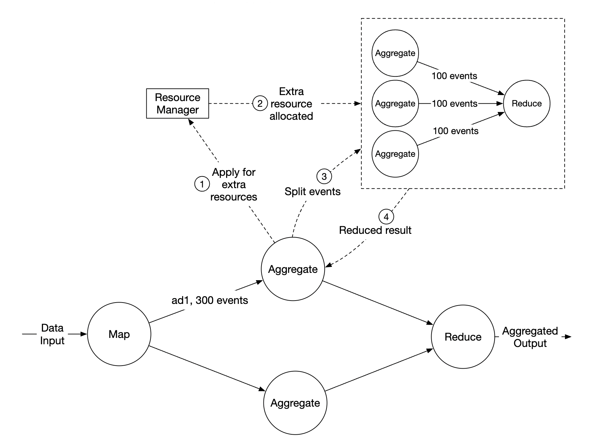
</p>

 - In the above example, aggregation service nodes can apply for extra resources via the resource manager
 - The resource manager allocates more resources, so the original node isn't overloaded
 - The original node splits the events into 3 groups and each of the aggregation nodes handles 100 events
 - Result is written back to the original aggregation node

Alternatively, more sophisticated ways to handle the hotspot problem:
 - Global-Local Aggregation
 - Split Distinct Aggregation

**These two are named without explanation, and both are simple ideas worth knowing.**

**Global-local aggregation** solves the hot key directly. Aggregation must partition by `ad_id` so that each ad's total lives in one place — which means a single viral ad sends all its traffic to one node, and no amount of extra nodes helps. The fix is to **salt the key**: aggregate on `(ad_id, random 0..N)` in a first stage, spreading one hot ad across N nodes, then strip the salt and sum the N partial counts in a second stage.

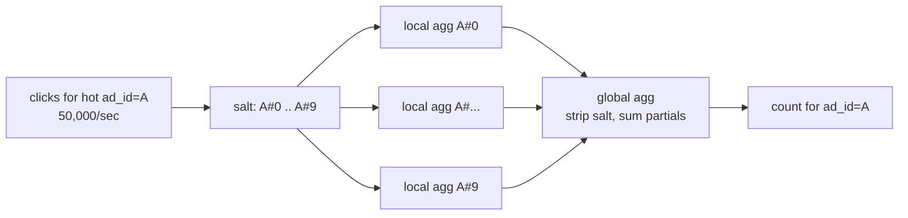
```mermaid
flowchart LR
    E["clicks for hot ad_id=A<br/>50,000/sec"] --> S["salt: A#0 .. A#9"]
    S --> L1["local agg A#0"]
    S --> L2["local agg A#..."]
    S --> L3["local agg A#9"]
    L1 --> G["global agg<br/>strip salt, sum partials"]
    L2 --> G
    L3 --> G
    G --> R["count for ad_id=A"]
```

The first stage reduces 50,000 events/sec into 10 partial counts per window, so the second stage handles a trivial volume. It works because **count is associative and commutative** — summing partial sums gives the true sum — and that is the condition for the technique generally.

**Split distinct aggregation** is the version for `COUNT(DISTINCT user_id)`, where that condition fails: you cannot sum partial distinct-counts, because the same user may appear in several partials. The fix is to make the first stage partition by the *distinct* field as well — `(ad_id, hash(user_id) % N)` — so each user lands deterministically in one partial and the second stage can safely add the partial distinct counts. Partitioning by the thing being counted is what restores additivity.

### **Fault Tolerance**
Within the aggregation nodes, we are processing data in-memory. If a node goes down, the processed data is lost.

We can leverage consumer offsets in kafka to continue from where we left off once another node picks up the slack.
However, there is additional intermediary state we need to maintain, as we're aggregating the top N ads in M minutes.

We can make snapshots at a particular minute for the on-going aggregation:

<p align="left">
    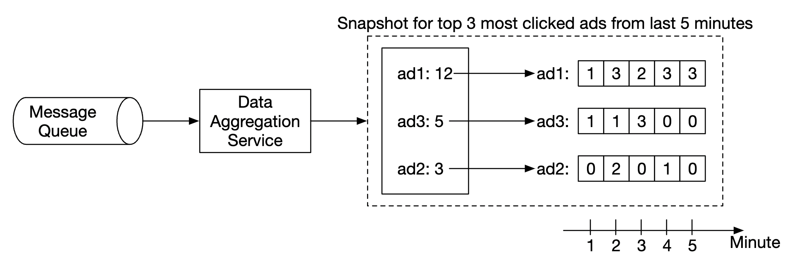
</p>

If a node goes down, the new node can read the latest committed consumer offset, as well as the latest snapshot to continue the job:

<p align="left">
    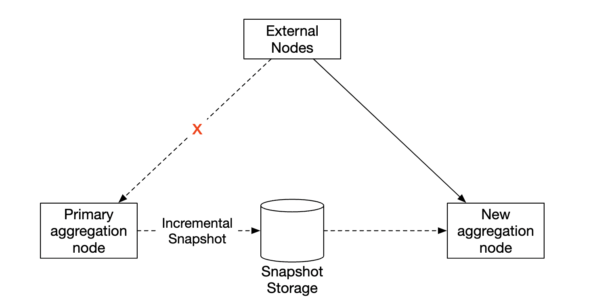
</p>

### **Data monitoring and correctness**
As the data we're aggregating is critical as it's used for billing, it is very important to have rigorous monitoring in place in order to ensure correctness.

Some metrics we might want to monitor:
 - **Latency**: Timestamps of different events can be tracked in order to understand the e2e latency of the system
 - **Message queue size**: If there is a sudden increase in queue size, we need to add more aggregation nodes. As Kafka is implemented via a distributed commit log, we need to keep track of records-lag metrics instead.
 - **System resources on aggregation nodes**: CPU, disk, JVM, etc.

We also need to implement a reconciliation flow which is a batch job, running at the end of the day. 
It calculates the aggregated results from the raw data and compares them against the actual data stored in the aggregation database:

<p align="left">
    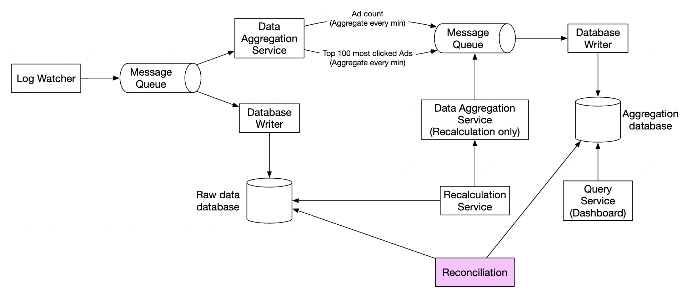
</p>

### **Alternative design**
In a generalist system design interview, you are not expected to know the internals of specialized software used in big data processing.

Explaining the thought process and discussing trade-offs is more important than knowing specific tools, which is why the chapter covers a generic solution.

An alternative design, which leverages off-the-shelf tooling, is to store ad click data in Hive with an ElasticSearch layer on top built for faster queries.

Aggregation is typically done in OLAP databases such as ClickHouse or Druid.

<p align="left">
    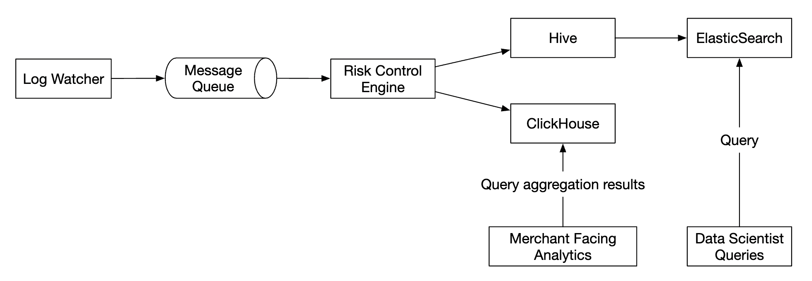
</p>

---

## Step 4: Wrap up
Things we covered:
 - Data model and API Design
 - Using MapReduce to aggregate ad click events
 - Scaling the message queue, aggregation service and database
 - Mitigating the hotspot issue
 - Monitoring the system continuously
 - Using reconciliation to ensure correctness
 - Fault tolerance

The ad click event aggregation is a typical big data processing system.

It would be easier to understand and design it if you have prior knowledge of related technologies:
 - Apache Kafka
 - Apache Spark
 - Apache Flink

---

### Gotchas & failure modes

- **"Exactly once" is achieved by idempotence, not by coordination.** Making the sink an upsert of `(ad_id, minute) → count` makes replay harmless and removes the need for a distributed transaction. Reach for transactions only when the output genuinely cannot be made idempotent.
- **Replay into an incrementing counter double-counts.** The most expensive bug available in this design, because the output is billing data and the error is invisible — the numbers look plausible, just wrong.
- **Hours-late mobile events cannot be handled by any watermark.** A client offline for a day will upload events whose window closed long ago. They belong to the reconciliation path; stretching the watermark to cover them would delay every number instead.
- **Client-supplied event time is attacker-controlled.** Bound acceptable timestamps against server time, keep the server receive time alongside, and treat the difference as a fraud signal.
- **Late events arriving after billing has closed need a stated policy.** Credit them to the original day and restate the invoice, or count them in the current period? Both are defensible; having no answer is not, and the reconciliation job forces the question.
- **Reconciliation mismatches need a resolution rule, not just an alert.** When the batch total and the streaming total disagree, which one is billed, who is notified, and what happens to invoices already sent? A reconciliation job that only reports a discrepancy has moved the problem rather than solved it.
- **A hot ad cannot be fixed by scaling.** Partitioning by `ad_id` is required for correct totals, so all of one ad's traffic lands on one node by design. Salt the key and aggregate in two stages.
- **`COUNT(DISTINCT)` does not decompose.** Summing partial distinct counts over-counts. Partition by the distinct field itself, or use a mergeable sketch (HyperLogLog) and accept approximation — which for *billing* numbers you cannot.
- **Pre-aggregating every filter combination explodes.** `2^k` aggregates per ad per minute, and a `user_id` dimension is unbounded. Pre-declare a small set of filter IDs; serve anything else from raw data.
- **Window boundaries need a declared timezone.** "Daily" billing is ambiguous across timezones, and so is the day a click at 23:59:58 UTC belongs to. Pick one timezone for billing periods and never compute boundaries in local time.
- **In-memory aggregation state is lost on node failure.** Consumer offsets alone are insufficient because sliding-window top-N state is not reconstructible from the offset. Periodic snapshots plus offsets are what make recovery possible — and snapshot size grows with window width and key count.
- **Consumer rebalancing pauses aggregation.** With thousands of consumers a rebalance takes a while and nobody is processing during it; the chapter's advice to rescale off-peak is the real mitigation. See [Chapter 19](../19.%20Distributed%20Message%20Queue/#gotchas--failure-modes).
- **Queue lag is the leading indicator.** For a log-based queue, queue "size" is not the metric — **consumer lag** is. Rising lag means event time is falling further behind processing time, which widens the late-event problem before it shows up anywhere else.
- **Raw retention is a real cost with a real justification.** 36 TB/year exists for recomputation, reconciliation and audit, not for queries. Tier it to cheap storage, but do not let anyone delete it to save money without understanding what it is for.
- **Kappa with a recalculation path is lambda wearing a different name.** The chapter claims Kappa because reprocessing flows through the same aggregation service, which is true and valuable — one codebase, one set of semantics. But there are still two paths with different latency and authority, and the batch one is the source of truth. That is fine; it is just worth being precise about.
- **The dashboard shows a number that may change.** Streaming results are provisional until watermarks close and reconciliation runs. Exposing that — a "finalised" flag, or a timestamp of last reconciliation — prevents advertisers treating an in-flight count as a bill.

---

## The design, as problem and technique

| Goal / problem | Technique |
|---|---|
| Billing accuracy at 50,000 events/sec | Streaming aggregation for freshness, batch reconciliation for authority |
| Attributing a click to when it happened | Event time, not processing time |
| Events arriving after their window | Watermarks holding windows open; late events to a side output |
| Events arriving hours late | Reconciliation path, not the stream |
| Malicious or broken client clocks | Bound acceptable event time; retain server receive time |
| Duplicate events from retries and failures | Idempotent upsert of `(ad_id, minute) → count`, making replay safe |
| Additive, auditable counts | Tumbling (non-overlapping) windows |
| "Top N in the last M minutes" | Sliding window with per-window top-N state |
| A viral ad overloading one node | Global-local aggregation: salt the key, aggregate in two stages |
| Distinct counts that do not decompose | Split distinct aggregation — partition by the distinct field |
| Unbounded filter combinations | Pre-declared filter IDs, pre-aggregated; everything else from raw |
| Recovering in-flight aggregation state | Periodic snapshots plus committed consumer offsets |
| Fixing a bug in aggregation logic | Retain raw events; recalculation service replays through a separate aggregator |
| Scaling the three tiers independently | Queue, aggregation service and database decoupled |
| Knowing the system is healthy | End-to-end latency, consumer lag, and a daily reconciliation comparison |

## Self-check
1. What makes this system different from every other aggregation pipeline in the book, and which requirement does that promote above the rest?
2. The aggregated output is far smaller than the raw input. Give three reasons the raw events are still kept.
3. Why does the query API take an opaque `filter` identifier rather than arbitrary filter predicates?
4. Give the trade-off between event time and processing time, and say which is chosen and why.
5. What is a watermark, stated precisely? What are the three things an engine can do with a late event?
6. Why can no watermark handle a mobile client that was offline for a day, and where do those events go?
7. Why are tumbling windows used for counts? What property do they give the stored aggregates?
8. Why is a sliding window needed for top-N but not for per-minute counts?
9. Rewrite an incrementing counter update so that replaying a window is harmless. Why does that remove the need for a distributed transaction?
10. Which kind of duplicate does idempotent aggregation *not* solve?
11. One ad receives 50,000 clicks/sec. Why doesn't adding aggregation nodes help, and what does?
12. Why can't you sum partial `COUNT(DISTINCT user_id)` results, and what fixes it?
13. An aggregation node dies mid-window. Why is the consumer offset not enough to recover?
14. The daily reconciliation finds a 0.3% discrepancy. What questions must the design already have answers to?

## Glossary

| Term | Meaning |
|---|---|
| **RTB (real-time bidding)** | Sub-second ad auction; the latency-critical sibling of this batch-tolerant system |
| **Event time vs processing time** | When the click happened vs when the system handled it |
| **Watermark** | An assertion that no events older than T will arrive; it gates window emission |
| **Late event** | One arriving after its window's watermark has passed |
| **Tumbling window** | Fixed, non-overlapping window — each event counted once, counts additive |
| **Hopping / sliding / session window** | Overlapping fixed windows; a continuously moving window; a gap-delimited window |
| **Lambda architecture** | Separate batch and streaming paths, with separate codebases |
| **Kappa architecture** | One stream-processing path, with reprocessing replayed through it |
| **Recalculation service** | Batch replay of raw events through a dedicated aggregator after a logic change |
| **Reconciliation** | End-of-day batch recomputation compared against stored aggregates — the source of truth |
| **Idempotent sink** | A write whose repetition changes nothing, typically an upsert rather than an increment |
| **Global-local aggregation** | Salting a hot key to aggregate in two stages |
| **Split distinct aggregation** | Partitioning by the distinct field so partial distinct counts can be summed |
| **Hotspot** | A single key receiving disproportionate traffic, unfixable by adding nodes |
| **Consumer lag** | How far aggregation is behind the event stream — the leading health indicator |
| **Snapshot / checkpoint** | Persisted in-flight aggregation state enabling recovery with the offset |

## Where to go next
- [Chapter 19 – Distributed Message Queue](../19.%20Distributed%20Message%20Queue/#exactly-once) — what exactly-once costs at the transport layer, and why idempotent processing is the usual answer.
- [Chapter 20 – Metrics Monitoring and Alerting System](../20.%20Metrics%20Monitoring%20and%20Alerting%20System/) — the same ingest-and-aggregate shape where approximation is acceptable; compare what changes when the output is not money.
- [Chapter 26 – Payment System](../26.%20Payment%20System/) — reconciliation and idempotency as first-class concerns, where the money is moved rather than counted.
- [Chapter 13 – Design A Search Autocomplete System](../13.%20Search%20Autocomplete/#updated-design) — the batch-plus-speed-layer pattern in a simpler setting.
- [Chapter 5 – Design Consistent Hashing](../05.%20Consistent%20Hashing/#gotchas--failure-modes) — why a hot key is not a partitioning problem.
