# Chapter 22: Hotel Reservation System

## Introduction
In this chapter, we're designing a **hotel reservation system**, similar to Marriott International.

Applicable to other types of systems as well - Airbnb, flight reservation, movie ticket booking.

**The one-sentence version:** this is a **concurrency** problem wearing a CRUD costume. The dataset is tiny (73 million rows, comfortably one server), the write rate is about **3 reservations per second**, and every service is stateless — by the standards of this book it is trivially small. It is nonetheless one of the harder chapters, because the system has exactly one invariant that must never be violated — *do not sell the same room twice* — and correctness under concurrency is the one thing distributed systems do not hand you for free.

**And then the requirements quietly dissolve the hardest part of the problem.** Overbooking by 10% is permitted, which means the invariant is not "never exceed inventory" but "never exceed 110% of inventory" — a *soft* limit, deliberately set above the real one. That is only acceptable because the business already has a procedure for the failure case: when a hotel is genuinely oversold, the guest is walked to another property at the hotel's expense. **The business absorbs the inconsistency.**

This is worth noticing as a general technique, not a quirk of hotels. Asking "what does the business do when this constraint is violated?" sometimes reveals that an apparently absolute technical requirement is a negotiable one — and negotiable constraints are enormously cheaper to enforce. Airline seats work the same way; a bank balance does not ([Chapter 27](../27.%20%20Digital%20Wallet/)).

---

## Step 1: Understand the Problem and Establish Design Scope
Before diving into designing the system, we should ask the interviewer questions to clarify the scope:
 - C: What is the scale of the system?
 - I: We're building a website for a hotel chain \w 5000 hotels and 1mil rooms
 - C: Do customers pay when they make a reservation or when they arrive at the hotel?
 - I: They pay in full when making reservations.
 - C: Do customers book hotel rooms through the website only? Do we have to support other reservation options such as phone calls?
 - I: They make bookings through the website or app only.
 - C: Can customers cancel reservations?
 - I: Yes
 - C: Other things to consider?
 - I: Yes, we allow overbooking by 10%. Hotel will sell more rooms than there actually are. Hotels do this in anticipation that clients will cancel bookings.
 - C: Since not much time, we'll focus on - show hotel-related page, hotel-room details page, reserve a room, admin panel, support overbooking.
 - I: Sounds good.
 - I: One more thing - hotel prices change all the time. Assume a hotel room's price changes every day.
 - C: OK.

### **Non-functional requirements**
 - Support high concurrency - there might be a lot of customers trying to book the same hotel during peak season.
 - Moderate latency - it's ideal to have low latency when a user makes a reservation, but it's acceptable if the system takes a few seconds to process it.

### **Back-of-the-envelope estimation**
 - 5000 hotels and 1mil rooms in total
 - Assume 70% of rooms are occupied and average stay duration is 3 days
 - Estimated daily reservations - 1mil * 0.7 / 3 = ~240k reservations per day
 - Reservations per second - 240k / 10^5 seconds in a day = ~3. Average reservation TPS is low.

**Hold on to the number 3**, because it decides the rest of the chapter. At three writes per second:

| | Implication |
|---|---|
| Sharding | Unnecessary — 73 M rows and 3 TPS fit one server with replicas |
| Caching the write path | Unnecessary, and actively dangerous (see the gotchas) |
| Pessimistic locking | Would be *perfectly adequate* on throughput grounds |
| Optimistic locking | Preferred — conflicts are rare, so retries are rare |
| Eventual consistency | Not needed, and not wanted; a single ACID transaction is available |

The low write rate is what licenses the chapter's most important architectural decision: **keep reservation and inventory in one service on one relational database, and use a transaction.** You are allowed the simple, strongly-consistent answer precisely because the volume never forces you off it.

But note the asymmetry the estimation reveals: **reads are ~100× writes** (300 detail-page views per 3 reservations), and reads are of static, cacheable hotel data. So the read path is a caching problem and the write path is a concurrency problem, and they share almost nothing. Treating them as one system is what makes this design look confusing.

> **Interview angle:** compute 3 TPS early and say what it buys you — no sharding, no eventual consistency, a real transaction. Candidates who reflexively shard and introduce sagas here are solving a problem the requirements do not contain, and they lose the ACID guarantee that makes the actual problem tractable.

Let's estimate the QPS. If we assume that there are three steps to reach the reservation page and there is a 10% conversion rate per page,
we can estimate that if there are 3 reservations, then there must be 30 views of reservation page and 300 views of hotel room detail page.

<p align="left">
    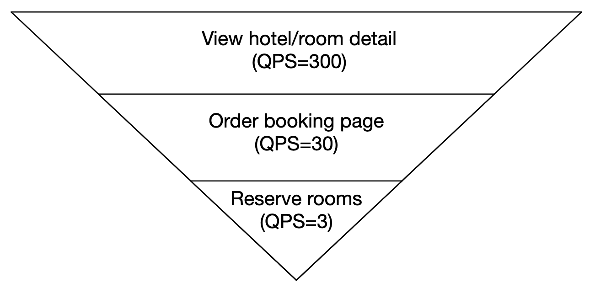
</p>
---

## Step 2: Propose High-Level Design and Get Buy-In
We'll explore - API Design, Data model, high-level design.

### **API Design**
This API Design focuses on the core endpoints (using RESTful practices), we'll need in order to support a hotel reservation system.

A fully-fledged system would require a more extensive API with support for searching for rooms based on lots of criteria, but we won't be focusing on that in this section.
Reason is that they aren't technically challenging, so they're out of scope.

**Hotel-related API**
 - `GET /v1/hotels/{id}` - get detailed info about a hotel
 - `POST /v1/hotels` - add a new hotel. Only available to ops
 - `PUT /v1/hotels/{id}` - update hotel info. Only available to ops
 - `DELETE /v1/hotels/{id}` - delete a hotel. API is only available to ops

**Room-related API**
 - `GET /v1/hotels/{id}/rooms/{id}` - get detailed information about a room
 - `POST /v1/hotels/{id}/rooms` - Add a room. Only available to ops
 - `PUT /v1/hotels/{id}/rooms/{id}` - Update room info. Only available to ops
 - `DELETE /v1/hotels/{id}/rooms/{id}` - Delete a room. Only available to ops

**Reservation-related API**
 - `GET /v1/reservations` - get reservation history of current user
 - `GET /v1/reservations/{id}` - get detailed info about a reservation
 - `POST /v1/reservations` - make a new reservation
 - `DELETE /v1/reservations/{id}` - cancel a reservation

Here's an example request to make a reservation:

```
{
  "startDate":"2021-04-28",
  "endDate":"2021-04-30",
  "hotelID":"245",
  "roomID":"U12354673389",
  "reservationID":"13422445"
}
```

Note that the `reservationID` is an idempotency key to avoid double booking. Details explained in [concurrency section](#concurrency-issues)

### **Data model**
Before we choose what database to use, let's consider our access patterns.

We need to support the following queries:
 - View detailed info about a hotel
 - Find available types of rooms given a date range
 - Record a reservation
 - Look up a reservation or past history of reservations

From our estimations, we know the scale of the system is not large, but we need to prepare for traffic surges.

Given this knowledge, we'll choose a relational database because:
 - Relational DBs work well with read-heavy and less write-heavy systems.
 - NoSQL databases are normally optimized for writes, but we know we won't have many as only a fraction of users who visit the site make a reservation.
 - Relational DBs provide ACID guarantees. These are important for such a system as without them, we won't be able to prevent problems such as negative balance, double charge, etc.
 - Relational DBs can easily model the data as the structure is very clear.

Here is our schema design:

<p align="left">
    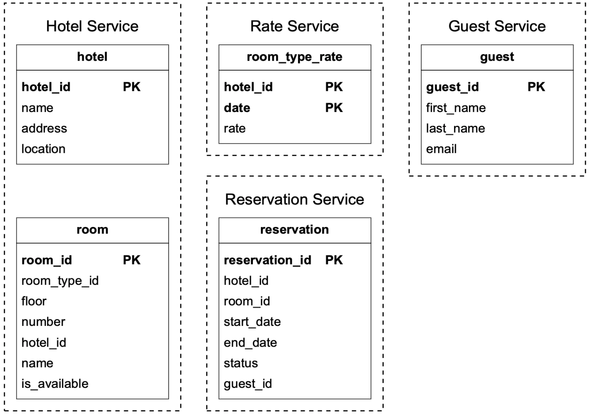
</p>
Most fields are self-explanatory. Only field worth mentioning is the `status` field which represents the state machine of a given room:

<p align="left">
    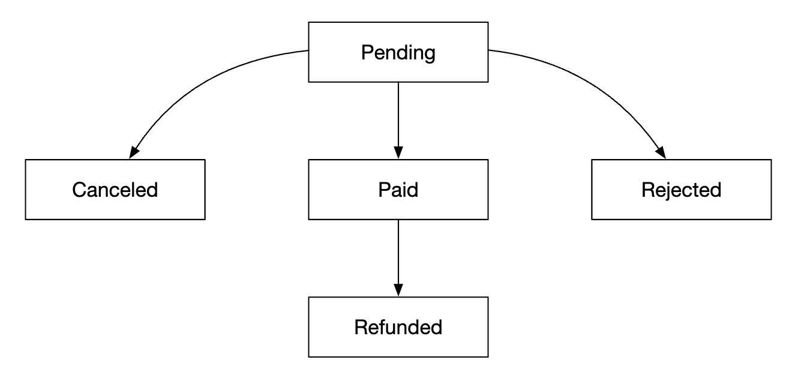
</p>
This data model works well for a system like Airbnb, but not for hotels where users don't reserve a particular room but a room type.
They reserve a type of room and a room number is chosen at the point of reservation.

This shortcoming will be addressed in the [Improved Data Model](#improved-data-model) section.

### **High-level Design**
We've chosen a microservice architecture for this design. It has gained great popularity in recent years:

<p align="left">
    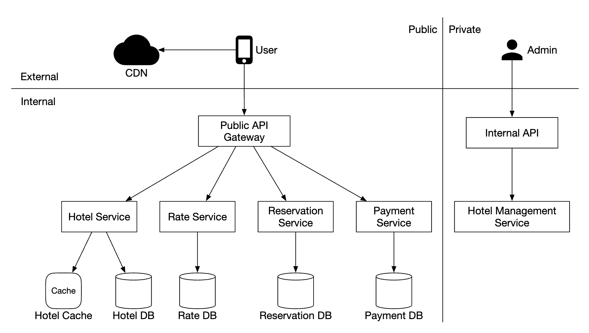
</p>
 - **Users**: book a hotel room on their phone or computer
 - **Admin**: perform administrative functions such as refunding/cancelling a payment, etc
 - **CDN**: caches static resources such as JS bundles, images, videos, etc
 - **Public API Gateway**: fully-managed service which supports rate limiting, authentication, etc.
 - **Internal APIs**: only visible to authorized personnel. Usually protected by a VPN.
 - **Hotel service**: provides detailed information about hotels and rooms. Hotel and room data is static, so it can be cached aggressively.
 - **Rate service**: provides room rates for different future dates. An interesting note about this domain is that prices depend on how full a hotel is at a given day.
 - **Reservation service**: receives reservation requests and reserves hotel rooms. Also tracks room inventory as reservations are made/cancelled.
 - **Payment service**: processes payments and updates reservation statuses on success.
 - **Hotel management service**: available to authorized personnel only. Allows certain administrative functions for managing and viewing reservations, hotels, etc.

Inter-service communication can be facilitated via a RPC framework, such as gRPC.

---

## Step 3: Design Deep Dive
Let's dive deeper into:
 - Improved data model
 - Concurrency issues
 - Scalability
 - Resolving data inconsistency in microservices

### **Improved data model**
As mentioned in a previous section, we need to amend our API and schema to enable reserving a type of room vs. a particular one.

For the reservation API, we no longer reserve a `roomID`, but we reserve a `roomTypeID`:

```
POST /v1/reservations
{
  "startDate":"2021-04-28",
  "endDate":"2021-04-30",
  "hotelID":"245",
  "roomTypeID":"12354673389",
  "roomCount":"3",
  "reservationID":"13422445"
}
```

Here's the updated schema:

<p align="left">
    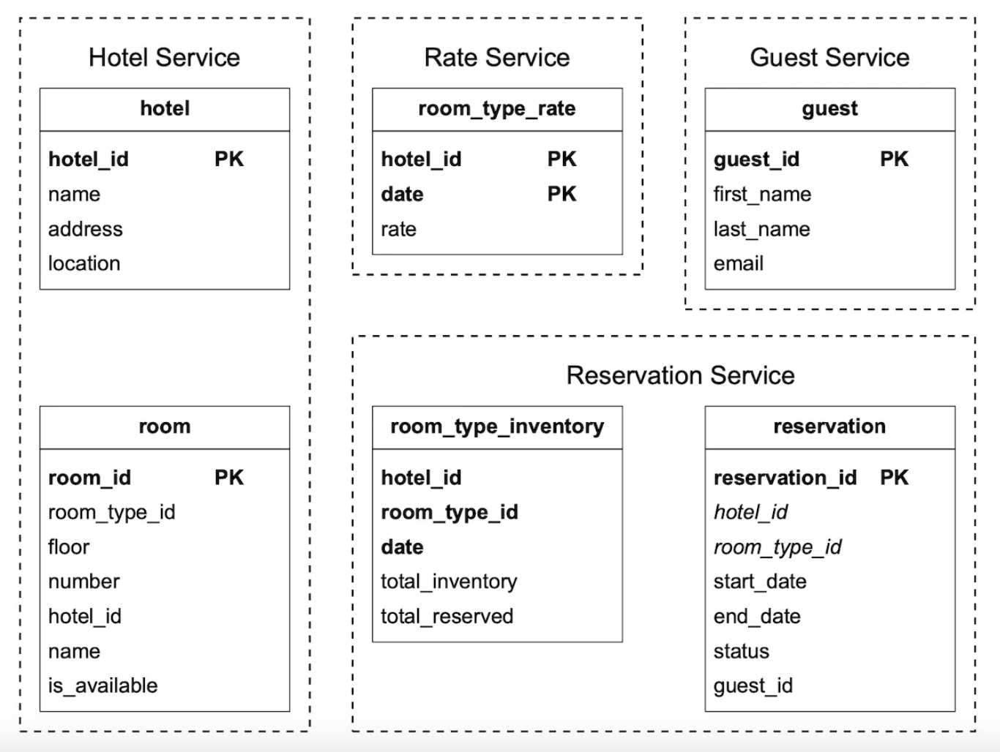
</p>
 - **room**: contains information about a room
 - **room_type_rate**: contains information about prices for a given room type
 - **reservation**: records guest reservation data
 - **room_type_inventory**: stores inventory data about hotel rooms. 

Let's take a look at the `room_type_inventory` columns as that table is more interesting:
 - **hotel_id**: id of hotel
 - **room_type_id**: id of a room type
 - **date**: a single date
 - **total_inventory**: total number of rooms minus those that are temporarily taken off the inventory.
 - **total_reserved**: total number of rooms booked for given (hotel_id, room_type_id, date)

There are alternative ways to design this table, but having one room per (hotel_id, room_type_id, date) enables easy 
reservation management and easier queries.

**This is the pivotal design decision in the chapter and it is easy to read past.** The natural model is to store reservations with a start and end date and derive availability from them. That makes every availability check an **interval-overlap query**: find all reservations for this room type whose date range intersects the requested one, count them, compare with capacity. It is correct, and it is poorly suited to both querying and locking — the set of rows involved depends on the data, so you cannot know in advance what to lock, and the count is recomputed from scratch every time.

Materialising **one row per (hotel, room type, date)** changes the problem completely:

| | Reservations with date ranges | One inventory row per date |
|---|---|---|
| Availability check | Interval-overlap scan and aggregate | **N point lookups** (one per night) |
| The invariant lives | Implicitly, across many rows | **Explicitly, in a single column** |
| Enforceable by the database? | Not really | **Yes — a `CHECK` constraint on one row** |
| What to lock | Depends on the data | **Known before you start: these N rows** |
| Cost | Nothing extra stored | 73 M pre-populated rows |

The denormalisation buys the thing the whole chapter needs: **the invariant becomes a property of a single row**, which is the only form a database can enforce cheaply and absolutely. Trading 73 million rows — which is nothing — for that is an excellent deal, and it is why the concurrency section below has three workable options instead of none.

The consequence to carry forward: **a three-night booking touches three rows and must be all-or-nothing.** That is what makes this a transaction rather than an update.

The rows in the table are pre-populated using a daily CRON job.

Sample data:
| hotel_id | room_type_id | date       | total_inventory | total_reserved |
|----------|--------------|------------|-----------------|----------------|
| 211      | 1001         | 2021-06-01 | 100             | 80             |
| 211      | 1001         | 2021-06-02 | 100             | 82             |
| 211      | 1001         | 2021-06-03 | 100             | 86             |
| 211      | 1001         | ...        | ...             |                |
| 211      | 1001         | 2023-05-31 | 100             | 0              |
| 211      | 1002         | 2021-06-01 | 200             | 16             |
| 2210     | 101          | 2021-06-01 | 30              | 23             |
| 2210     | 101          | 2021-06-02 | 30              | 25             |

Sample SQL query to check the availability of a type of room:

```
SELECT date, total_inventory, total_reserved
FROM room_type_inventory
WHERE room_type_id = ${roomTypeId} AND hotel_id = ${hotelId}
AND date between ${startDate} and ${endDate}
```

How to check availability for a specified number of rooms using that data (note that we support overbooking):

```
if (total_reserved + ${numberOfRoomsToReserve}) <= 110% * total_inventory
```

Now let's do some estimation about the storage volume.
 - We have 5000 hotels.
 - Each hotel has 20 types of rooms.
 - 5000 * 20 * 2 (years) * 365 (days) = 73mil rows

73 million rows is not a lot of data and a single database server can handle it.
It makes sense, however, to setup read replication (potentially across different zones) to enable high availability.

Follow-up question - if reservation data is too large for a single database, what would you do?
 - Store only current and future reservation data. Reservation history can be moved to cold storage.
 - Database sharding - we can shard our data by `hash(hotel_id) % servers_cnt` as we always select the `hotel_id` in our queries.

### **Concurrency issues**
Another important problem to address is double booking.

There are two issues to address:
 - Same user clicks on "book" twice
 - Multiple users try to book a room at the same time

Here's a visualization of the first problem:

<p align="left">
    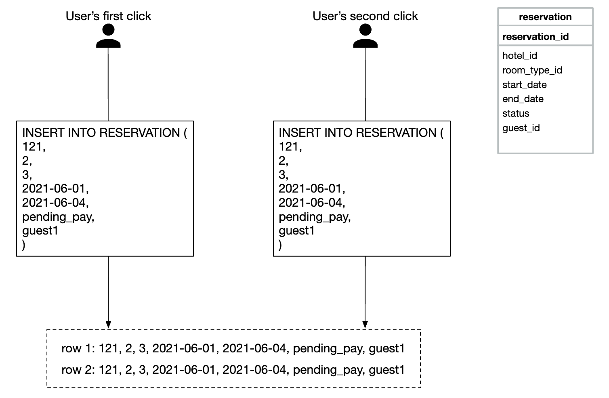
</p>
There are two approaches to solving this problem:
 - Client-side handling - front-end can disable the book button once clicked. If a user disabled javascript, however, they won't see the button becoming grayed out.
 - Idempotent API - Add an idempotency key to the API, which enables a user to execute an action once, regardless of how many times the endpoint is invoked:

<p align="left">
    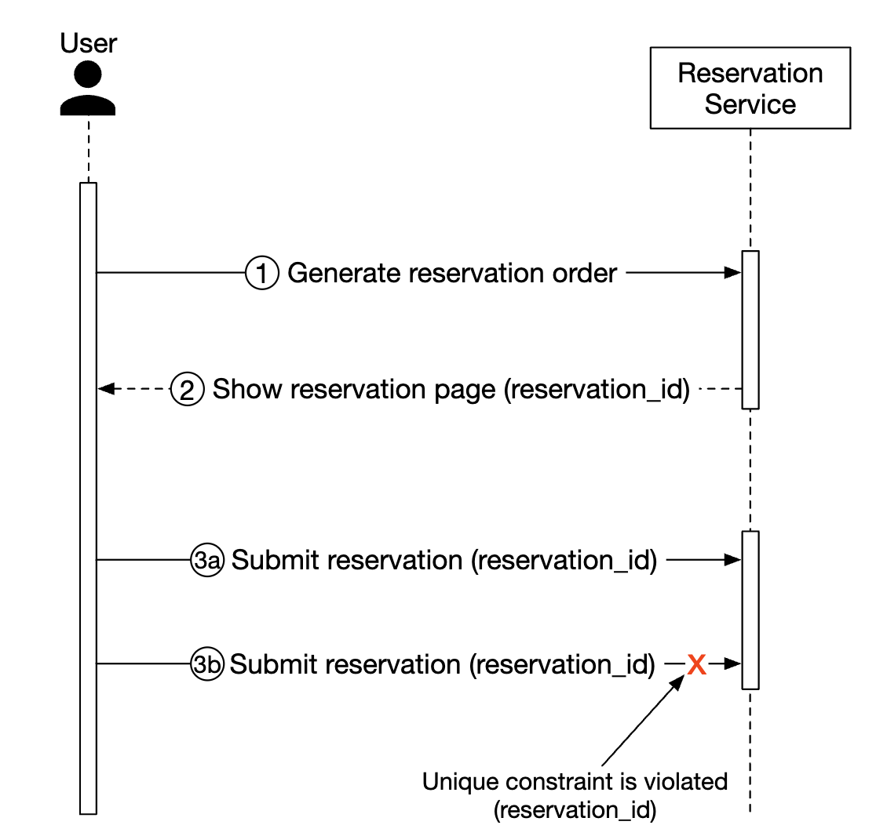
</p>
Here's how this flow works:
 - A reservation order is generated once you're in the process of filling in your details and making a booking. The reservation order is generated using a globally unique identifier.
 - Submit reservation 1 using the `reservation_id` generated in the previous step.
 - If "complete booking" is clicked a second time, the same `reservation_id` is sent and the backend detects that this is a duplicate reservation.
 - The duplication is avoided by making the `reservation_id` column have a unique constraint, preventing multiple records with that id being stored in the DB.

**The important detail is *when* the ID is generated.** It is created when the user starts filling in the booking form — before any submission — so that every retry of that booking carries the *same* identifier. An ID generated by the server on receipt would be different for each click and would deduplicate nothing.

This is the idempotency-key pattern in its canonical form, and it is the same mechanism as the `client_msg_id` in [Chapter 12](../12.%20Chat%20System/#gotchas--failure-modes) and the idempotency key in [Chapter 26](../26.%20Payment%20System/). The database's unique constraint is what makes it airtight: two concurrent requests with the same key both attempt the insert, and exactly one survives — the guarantee is enforced by the storage engine rather than by application logic that can race.

It also solves a problem beyond double-clicks. A network timeout leaves the client unable to tell whether the reservation succeeded. With an idempotency key, the safe action is simply to retry: either it creates the reservation or it collides with the existing one, and both outcomes are correct.

<p align="left">
    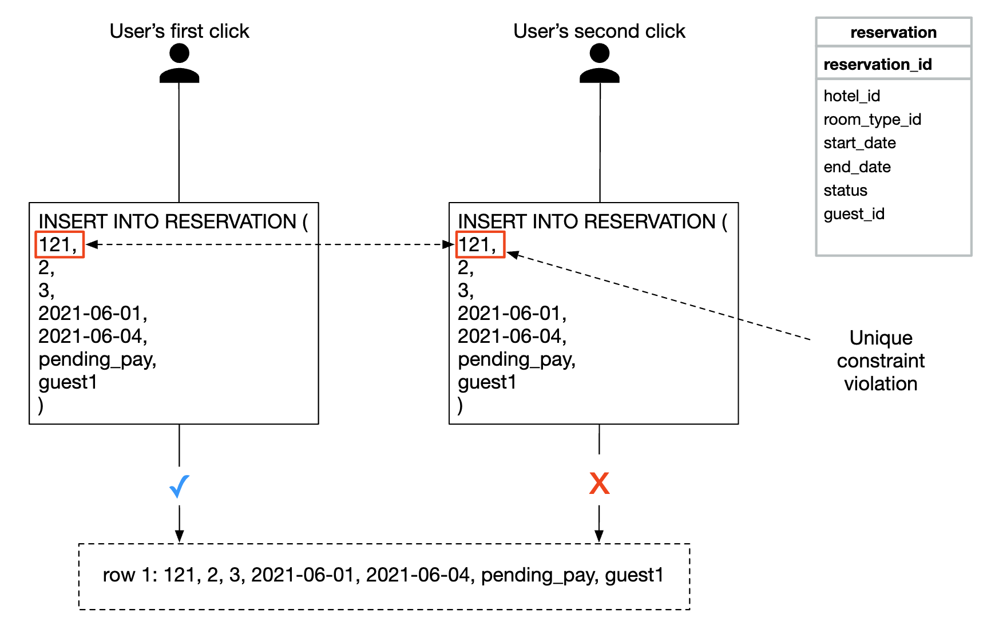
</p>
What if there are multiple users making the same reservation?

<p align="left">
    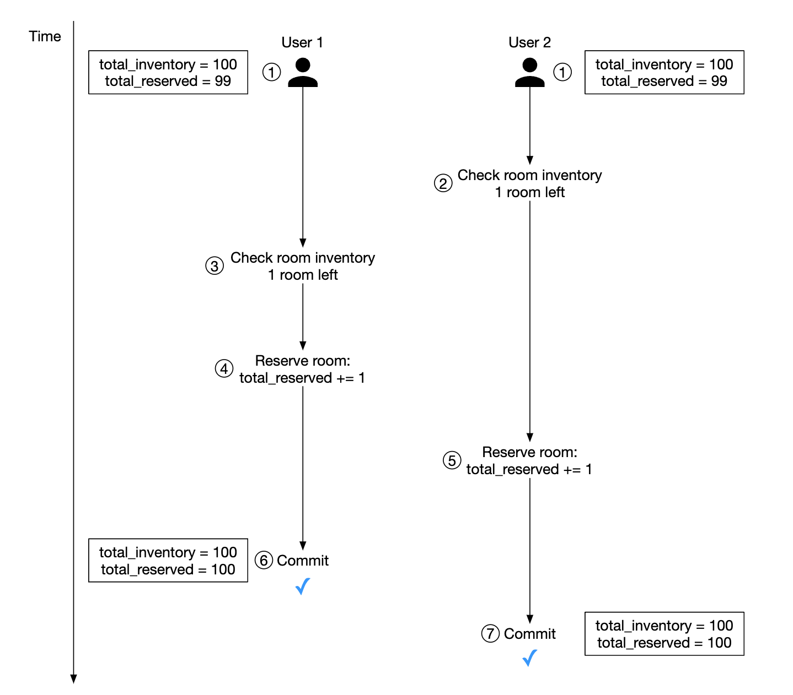
</p>
 - Let's assume the transaction isolation level is not serializable
 - User 1 and 2 attempt to book the same room at the same time.
 - Transaction 1 checks if there are enough rooms - there are
 - Transaction 2 check if there are enough rooms - there are
 - Transaction 2 reserves the room and updates the inventory
 - Transaction 1 also reserves the room as it still sees there are 99 `total_reserved` rooms out of 100.
 - Both transactions successfully commit the changes

This problem can be solved using some form of locking mechanism:
 - Pessimistic locking
 - Optimistic locking
 - Database constraints

Here's the SQL we use to reserve a room:

```sql
# step 1: check room inventory
SELECT date, total_inventory, total_reserved
FROM room_type_inventory
WHERE room_type_id = ${roomTypeId} AND hotel_id = ${hotelId}
AND date between ${startDate} and ${endDate}

# For every entry returned from step 1
if((total_reserved + ${numberOfRoomsToReserve}) > 110% * total_inventory) {
  Rollback
}

# step 2: reserve rooms
UPDATE room_type_inventory
SET total_reserved = total_reserved + ${numberOfRoomsToReserve}
WHERE room_type_id = ${roomTypeId}
AND date between ${startDate} and ${endDate}

Commit
```

#### Option 1: Pessimistic locking
Pessimistic locking prevents simultaneous updates by putting a lock on a record while it's being updated.

This can be done in MySQL by using the `SELECT... FOR UPDATE` query, which locks the rows selected by the query until the transaction is committed.

<p align="left">
    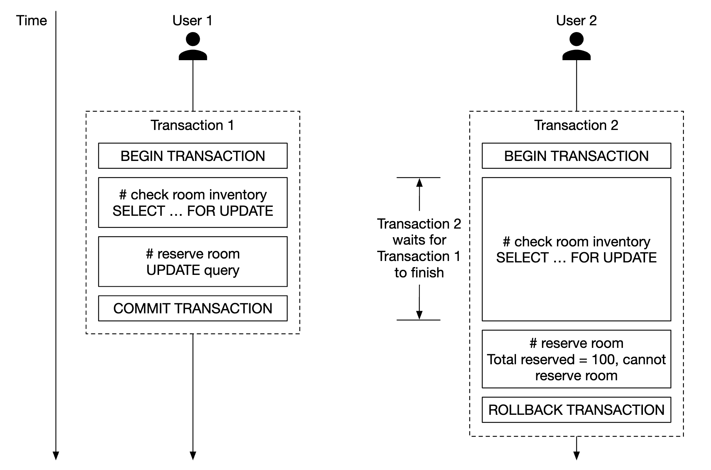
</p>
Pros:
 - Prevents applications from updating data that is being changed
 - Easy to implement and avoids conflict by serializing updates. Useful when there is heavy data contention.

Cons:
 - Deadlocks may occur when multiple resources are locked.
 - This approach is not scalable - if transaction is locked for too long, this has impact on all other transactions trying to access the resource.
 - The impact is severe when the query selects a lot of resources and the transaction is long-lived.

The author doesn't recommend this approach due to its scalability issues.

#### Option 2: Optimistic locking
Optimistic locking allows multiple users to attempt to update a record at the same time.

There are two common ways to implement it - version numbers and timestamps. Version numbers are recommended as server clocks can be inaccurate.

<p align="left">
    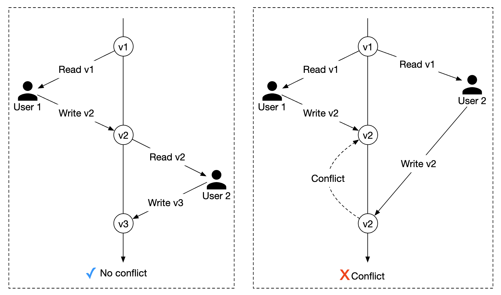
</p>
 - A new `version` column is added to the database table
 - Before a user modifies a database row, the version number is read
 - When the user updates the row, the version number is increased by 1 and written back to the database
 - Database validation prevents the insert if the new version number doesn't exceed the previous one

Optimistic locking is usually faster than pessimistic locking as we're not locking the database. 
Its performance tends to degrade when concurrency is high, however, as that leads to a lot of rollbacks.

Pros:
 - It prevents applications from editing stale data
 - We don't need to acquire a lock in the database
 - Preferred option when data contention is low, ie rarely are there update conflicts

Cons:
 - Performance is poor when data contention is high

Optimistic locking is a good option for our system as reservation QPS is not extremely high.

#### Option 3: Database constraints
This approach is very similar to optimistic locking, but the guardrails are implemented using a database constraint:

```
CONSTRAINT `check_room_count` CHECK((`total_inventory - total_reserved` >= 0))
```

<p align="left">
    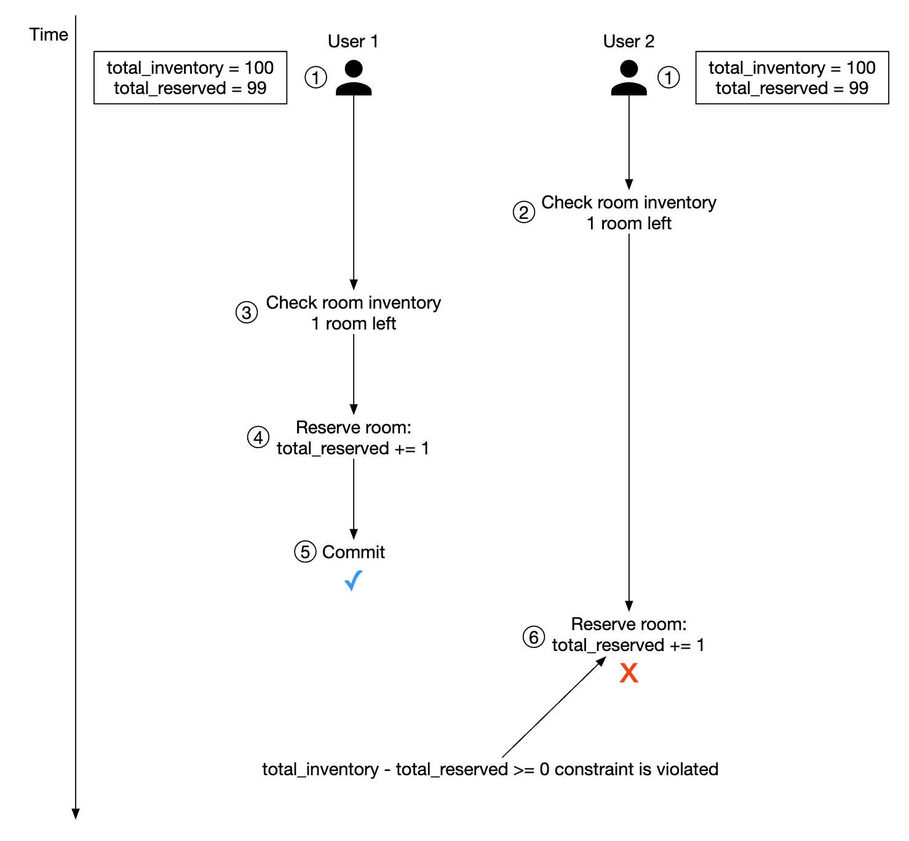
</p>
Pros:
 - Easy to implement
 - Works well when data contention is small

Cons:
 - Similar to optimistic locking, performs poorly when data contention is high
 - Database constraints cannot be easily version-controlled like application code
 - Not all databases support constraints

This is another good option for a hotel reservation system due to its ease of implementation.

#### Choosing between the three

| | Pessimistic (`SELECT … FOR UPDATE`) | Optimistic (version column) | Database constraint |
|---|---|---|---|
| When the conflict is detected | **Before** the work — others wait | **At commit** — loser retries | **At commit** — loser errors |
| Cost when contention is low | Lock overhead on every booking | Near zero | Near zero |
| Cost when contention is high | Queueing, growing latency, deadlock risk | **Retry storms** — wasted work | Repeated failed writes |
| Protects against application bugs | No | No | **Yes** — the rule lives in the schema |
| Risk | Deadlocks, long-held locks | Livelock on a very hot row | Hard to version-control; portability |

Two things are worth drawing out.

**Optimistic locking and the `CHECK` constraint are the same strategy** — let writes proceed and detect the conflict at commit — differing only in where the rule is written. Pessimistic locking is the genuinely different one: it prevents conflict instead of detecting it.

**They are not mutually exclusive, and the right answer is to use both.** The constraint is the only mechanism that holds regardless of which code path performs the write — a new service, a migration script, an admin tool, or a bug that skips the version check cannot violate it. Optimistic locking gives a clean retry path and a good error message; the constraint is the backstop that makes the invariant actually true. Defence in depth, with the database as the last line.

#### The deadlock the chapter does not mention

A multi-night booking locks several rows, and **lock order decides whether concurrent bookings deadlock**:

```
Transaction A (June 1–3):  locks June 1, then June 2, then June 3
Transaction B (June 3–5):  locks June 3, then June 4, then June 5
```

If B happens to acquire June 3 first while A holds June 1 and 2 and then waits for June 3 — and B subsequently needs a row A holds — the two wait on each other and the database kills one. With overlapping date ranges arriving in arbitrary order, this is not a rare scenario; it is the normal case under load.

The fix is a one-line discipline: **always acquire rows in a deterministic order**, here ascending by date. Then any two transactions that contend take the same rows in the same sequence, one simply waits, and a cycle is impossible. This applies to pessimistic locking directly, and to the other two options in the softer form that deterministic ordering makes contention behaviour predictable instead of pathological.

#### What is missing: holds

A real reservation system does not go straight from "available" to "reserved". It places a **temporary hold** while the user enters payment details — typically 10–15 minutes — because taking payment takes time and selling the room out from under someone mid-checkout is a terrible experience.

That adds a third state and a background process:

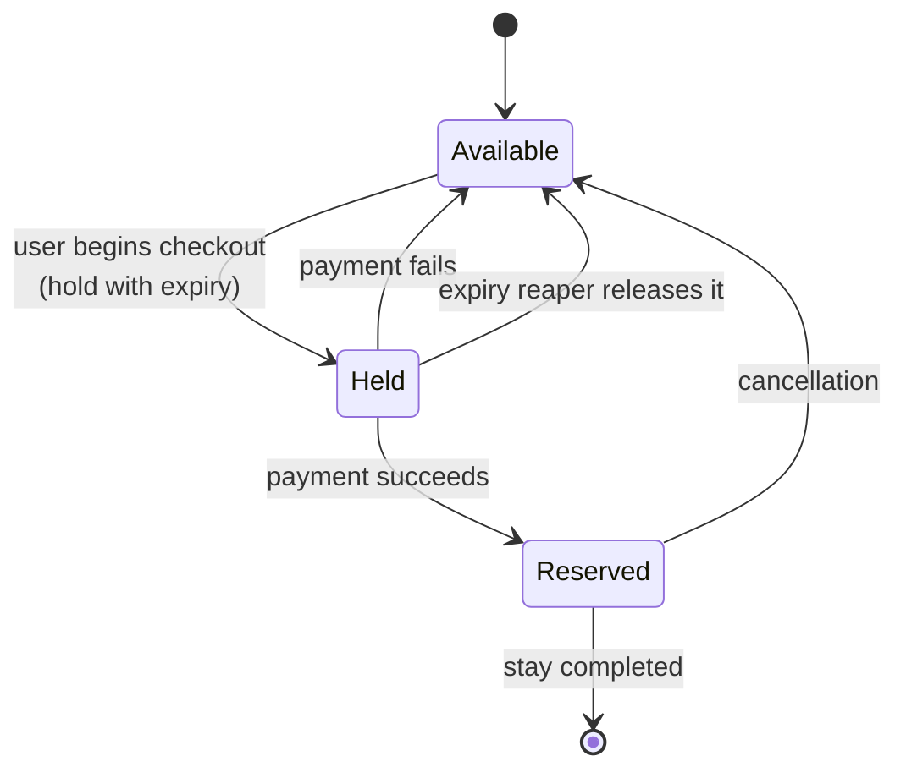
```mermaid
stateDiagram-v2
    [*] --> Available
    Available --> Held: user begins checkout<br/>(hold with expiry)
    Held --> Reserved: payment succeeds
    Held --> Available: payment fails
    Held --> Available: expiry reaper releases it
    Reserved --> Available: cancellation
    Reserved --> [*]: stay completed
```

Two consequences worth stating: **the inventory check must count holds as consumed**, or holds are pointless; and **a reaper must release expired holds**, or inventory leaks away every time a user abandons a checkout. The reaper is the part that gets forgotten, and the symptom — a hotel that appears full while rooms sit unsold — looks like a data bug rather than a missing cron job.

### **Scalability**
Usually, the load of a hotel reservation system is not high. 

However, the interviewer might ask you how you'd handle a situation where the system gets adopted for a larger, popular travel site such as booking.com
In that case, QPS can be 1000 times larger.

When there is such a situation, it is important to understand where our bottlenecks are. All the services are stateless, so they can be easily scaled via replication.

The database, however, is stateful and it's not as obvious how it can get scaled.

**It is more obvious here than in most chapters, and for a reason worth naming: `hotel_id` is both the natural shard key and the transaction boundary.** A reservation never spans two hotels, so every transaction — availability check, inventory decrement, reservation insert — touches rows belonging to exactly one hotel. Sharding on `hash(hotel_id)` therefore keeps every transaction inside a single shard, and you keep ACID guarantees while scaling horizontally.

That is a genuinely fortunate property and not the usual case. Compare [Chapter 15](../15.%20Google%20Drive/#gotchas--failure-modes), where sharding metadata by `user_id` is broken by file sharing, because a shared file's transaction spans two users and therefore two shards. **Sharding is easy exactly when the shard key contains every transaction, and hard the moment a single operation crosses the boundary.** Checking that alignment before proposing a shard key is the general lesson.

For the read path, the answer is different and simpler: hotel and room data is static, so cache it aggressively and serve the ~100× read traffic from cache and CDN. Rates change daily and belong in a short-TTL cache.

**The one thing sharding does not fix is a hot row.** A single desirable hotel on a single date — a festival weekend, a holiday — concentrates all its contention on one `(hotel_id, room_type_id, date)` row, and that row cannot be split without breaking the invariant that lives in it. The options:

| Approach | Trade-off |
|---|---|
| Optimistic retry with backoff | Simplest; adequate when the contention window is short |
| Deliberately serialise that row | Queue requests for the hot key and process them in order — predictable latency, bounded throughput |
| Split inventory into buckets | Borrows global-local aggregation from [Chapter 21](../21.%20Ad%20Click%20Event%20Aggregation/); now availability must sum the buckets, and a room can be unsellable because it is stranded in the wrong bucket |

The second is usually the right answer, and it is a useful instinct generally: when a resource must be serialised anyway, serialising it *explicitly* with a queue gives better and more predictable behaviour than letting the database discover the conflict through repeated failed transactions.

One way to scale it is by implementing database sharding - we can split the data across multiple databases, where each of them contain a portion of the data.

We can shard based on `hotel_id` as all queries filter based on it. 
Assuming, QPS is 30,000, after sharding the database in 16 shards, each shard handles 1875 QPS, which is within a single MySQL cluster's load capacity.

<p align="left">
    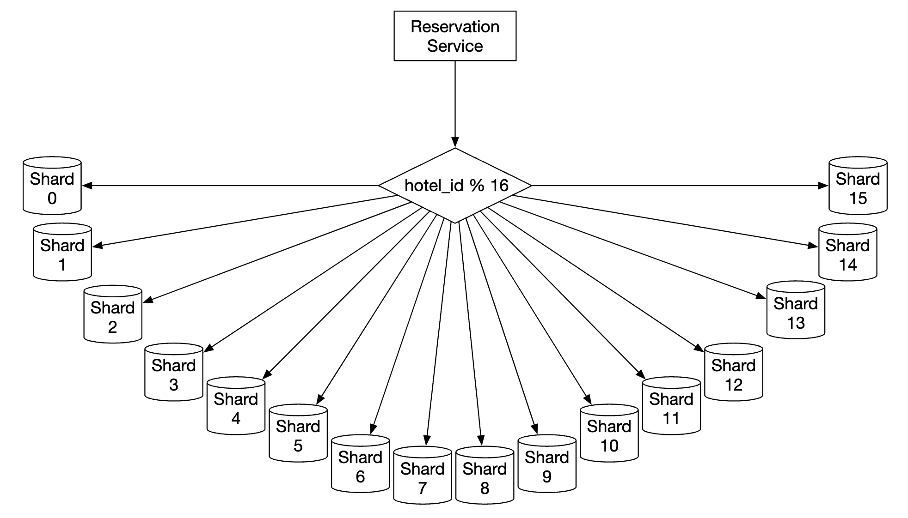
</p>
We can also utilize caching for room inventory and reservations via Redis. We can set TTL so that old data can expire for days which are past.

<p align="left">
    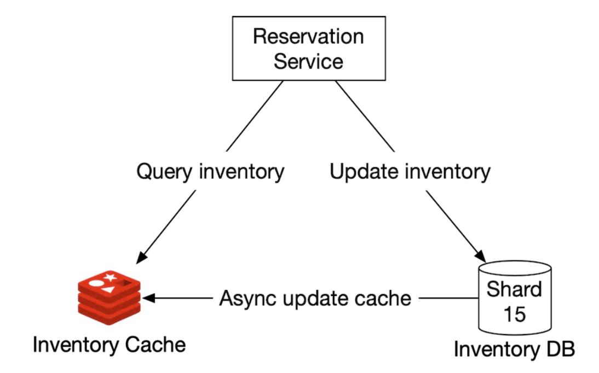
</p>
The way we store an inventory is based on the `hotel_id`, `room_type_id` and `date`:

```
key: hotelID_roomTypeID_{date}
value: the number of available rooms for the given hotel ID, room type ID and date.
```

Data consistency happens async and is managed by using a CDC streaming mechanism - database changes are read and applied to a separate system.
Debezium is a popular option for synchronizing database changes with Redis.

Using such a mechanism, there is a possibility that the cache and database are inconsistent for some time.
This is fine in our case because the database will prevent us from making an invalid reservation.

This will cause some issue on the UI as a user would have to refresh the page to see that "there are no more rooms left", 
but that is something which can happen regardless of this issue if eg a person hesitates a lot before making a reservation.

Caching pros:
 - Reduced database load
 - High performance, as Redis manages data in-memory

Caching cons:
 - Maintaining data consistency between cache and DB is hard. We need to consider how the inconsistency impacts user experience.

### **Data consistency among services**
A monolithic application enables us to use a shared relational database for ensuring data consistency.

In our microservice design, we chose a hybrid approach where some services are separate, 
but the reservation and inventory APIs are handled by the same service.

This is done because we want to leverage the relational database's ACID guarantees to ensure consistency.

However, the interviewer might challenge this approach as it's not a pure microservice architecture, where each service has a dedicated database:

<p align="left">
    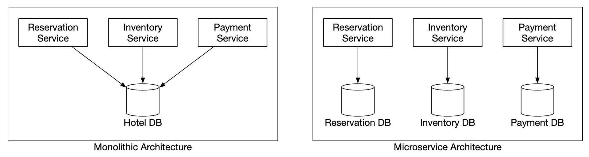
</p>
This can lead to consistency issues. In a monolithic server, we can leverage a relational DBs transaction capabilities to implement atomic operations:

<p align="left">
    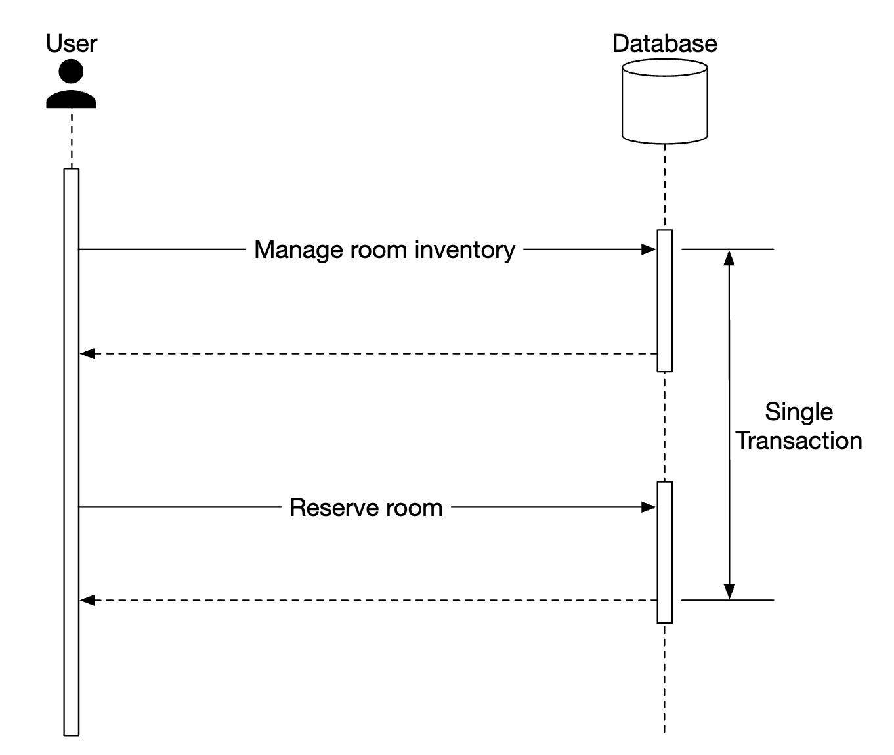
</p>
It's more challenging, however, to guarantee this atomicity when the operation spans across multiple services:

<p align="left">
    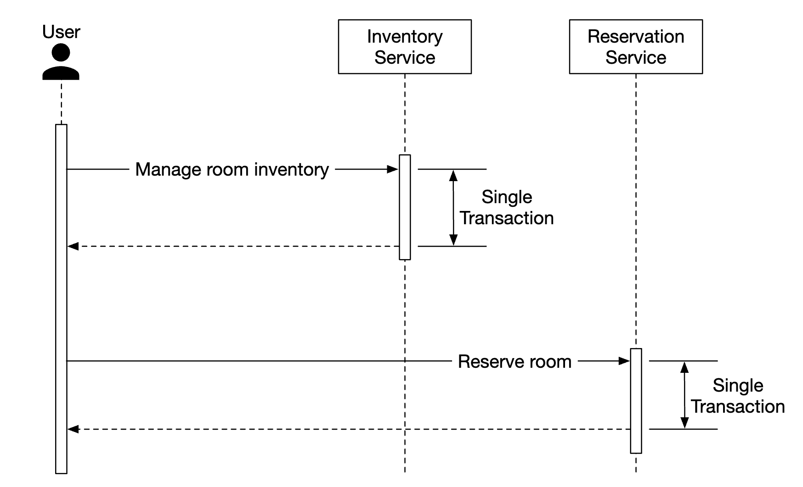
</p>
There are some well-known techniques to handle these data inconsistencies:
 - **Two-phase commit**: a database protocol which guarantees atomic transaction commit across multiple nodes. 
   It's not performant, though, since a single node lag leads to all nodes blocking the operation.
 - **Saga**: a sequence of local transactions, where compensating transactions are triggered if any of the steps in a workflow fail. This is an eventually consistent approach.

It's worth noting that addressing data inconsistencies across microservices is a challenging problem, which raises the system complexity.
It is good to consider whether the cost is worth it, given our more pragmatic approach of encapsulating dependent operations within the same relational database.

| | Single service + ACID transaction (chosen) | Two-phase commit | Saga |
|---|---|---|---|
| Consistency | **Strong, immediate** | Strong | **Eventual** |
| Failure behaviour | Rollback, nothing happened | Blocks if a participant stalls | Compensating transactions undo earlier steps |
| Latency | One transaction | Two round trips, locks held throughout | Fast per step |
| Availability | Limited by one database | **Worst** — any participant can block all | Best |
| Complexity | **Lowest** | High | High — every step needs a compensator |
| Partial states visible? | No | No | **Yes** — a reservation can exist unpaid |

**The chapter's conclusion is the right one and worth defending rather than apologising for.** At 3 TPS, splitting reservation and inventory into separate services with separate databases buys nothing and costs you atomicity — you would then rebuild atomicity, badly, with a saga. "Service boundaries should not cut through a transaction" is the principle; the pure-microservices answer here is architecture as fashion.

**Where a saga is genuinely needed is payment**, which cannot be inside the database transaction because it is a call to an external provider that may take seconds and cannot be rolled back. So the real flow is: reserve inventory atomically → charge the card → on failure, compensate by releasing the inventory. The hold mechanism above is precisely that compensation window, and the expiry reaper is the compensator of last resort for the case where the system crashes mid-flow. [Chapter 26](../26.%20Payment%20System/) is this problem taken seriously.

---

### Gotchas & failure modes

- **Never make the availability *decision* from a cache.** Showing cached availability on a listing page is fine and necessary. Deciding whether to accept a booking from a cached value is a double-booking generator, because the cache is by definition behind. The display may be optimistic; the write must be transactional.
- **Read replica lag has the same effect.** An availability check against a replica can see a stale `total_reserved`. Availability checks on the write path must read the primary.
- **Multi-night bookings deadlock without a lock order.** Overlapping date ranges acquired in arbitrary order produce cycles. Always lock rows in ascending date order.
- **No expiry reaper means inventory leaks.** Every abandoned checkout permanently consumes a room. The hotel shows as full while rooms go unsold, and it looks like a data corruption bug.
- **Cancellation must be idempotent too.** A retried cancellation that decrements `total_reserved` twice silently creates phantom inventory — the mirror image of double booking, and harder to notice because nobody complains about a room being available.
- **The inventory pre-population cron job is a silent dependency.** If it stops running, rows for future dates simply do not exist. Depending on the code path, that reads as "no availability" (lost revenue, no error) or — worse — a write path that inserts a missing row unconstrained and bypasses the invariant entirely. Alert on inventory horizon, not just on job success.
- **`date` needs a declared timezone.** A booking is for a hotel's local calendar date, which is not the server's date and not UTC. Deriving the date from a server timestamp will put bookings on the wrong night for some fraction of guests, and DST transitions make some local days 23 or 25 hours long.
- **Overbooking is a policy, not a bug — and it needs an owner.** 110% must be configurable per hotel and per date (a hotel with no nearby alternatives should not oversell), and someone must handle the walk. Hard-coding it in a `CHECK` constraint makes it uneditable without a migration.
- **A hot row cannot be sharded.** The invariant lives in that row. Serialise access deliberately or bucket the inventory and accept the consequences.
- **Retry storms make contention worse.** Optimistic locking plus immediate client retries on a popular row turns one conflict into a sustained load spike. Exponential backoff with jitter, and a cap on attempts.
- **Payment cannot be in the database transaction.** It is an external call that may succeed after your transaction times out. The reservation must tolerate "charged but not confirmed" and "confirmed but not charged" and have a reconciliation path for both.
- **The `CHECK` constraint lives in the schema, so changing the rules means a migration.** The chapter lists this as a con and it is a real one: price and policy logic belongs in code, but *integrity* rules belong in the schema. Keep the constraint as the invariant ("never negative") and put the policy (how much overbooking) in a column the constraint reads.
- **Rates change daily, which makes the price a point-in-time fact.** The price quoted at booking must be stored on the reservation, not looked up later. Otherwise a guest's bill changes when the hotel reprices.
- **Admin tools bypass everything.** The internal API lets staff adjust reservations and inventory. Those paths need the same constraints and the same idempotency, and they are the ones that get written in a hurry.

---

## The design, as problem and technique

| Goal / problem | Technique |
|---|---|
| Never sell the same room twice | The invariant in a single row, enforced by a database `CHECK` constraint |
| Availability without interval-overlap queries | Materialised `room_type_inventory`, one row per (hotel, type, date) |
| All-or-nothing multi-night bookings | One ACID transaction over the N date rows |
| Avoiding deadlock across those rows | Deterministic lock order (ascending date) |
| Low contention, cheap writes | Optimistic locking with a version column; retry on conflict |
| Protection from any code path | The constraint as a backstop beneath the application check |
| Double-clicks and retried requests | Idempotency key created before submission, with a unique constraint |
| Holding a room during checkout | A `Held` state counted as consumed, plus an expiry reaper |
| ~100× read traffic on static data | Aggressive caching and CDN for hotel/room data; short TTL for rates |
| Scaling writes if volume grows 1000× | Shard on `hotel_id`, which contains every transaction |
| A single in-demand hotel-date | Deliberate serialisation of that row, or bucketed inventory |
| Atomicity across reservation and inventory | Keep them in one service and one database — do not cut a transaction with a service boundary |
| Payment, which cannot be transactional | Saga: reserve, charge, compensate by releasing on failure |
| Cancellations freeing inventory | Idempotent decrement keyed on the reservation |
| Overbooking | Configurable percentage per hotel/date, read by the constraint |

## Self-check
1. Compute the reservation TPS. Name three design decisions that number lets you avoid.
2. Reads are roughly 100× writes here. Why does that mean the read and write paths share almost no design?
3. What does overbooking by 10% reveal about the nature of the constraint, and what business process makes it acceptable?
4. Why store one inventory row per date rather than deriving availability from reservation date ranges? Name the property that buys you.
5. A three-night booking must be all-or-nothing. What does that make it, and what does it imply about service boundaries?
6. Optimistic locking and a `CHECK` constraint are nearly the same strategy. What is the difference, and why use both?
7. Two overlapping multi-night bookings arrive at once. Describe the deadlock and the one-line fix.
8. Why must the idempotency key be generated before the user submits, rather than by the server?
9. A user abandons checkout. What two mechanisms must exist for the room to become sellable again?
10. Why is `hash(hotel_id)` an unusually good shard key, and which earlier chapter shows the opposite case?
11. A festival weekend concentrates all bookings on one inventory row. Why can't sharding help, and what are the options?
12. Why can't the availability decision be made from a cache or a read replica?
13. What breaks if a retried cancellation decrements `total_reserved` twice, and why is it harder to detect than double booking?
14. Why must the price be stored on the reservation rather than looked up from the rate table later?

## Glossary

| Term | Meaning |
|---|---|
| **Room type** | The sellable unit — guests book a category, not a specific room |
| **`room_type_inventory`** | Materialised per-date capacity and reserved count; where the invariant lives |
| **Overbooking** | Deliberately selling above capacity, expecting cancellations |
| **Double booking** | Selling the same inventory twice — the failure this chapter exists to prevent |
| **Pessimistic locking** | `SELECT … FOR UPDATE`; prevent conflict by making others wait |
| **Optimistic locking** | Version column checked at commit; detect conflict and retry |
| **Database constraint** | `CHECK` enforcing the invariant regardless of the code path |
| **Lock ordering** | Acquiring contended rows in a deterministic sequence to make deadlock impossible |
| **Idempotency key** | A client-generated reservation ID, made unique in the schema |
| **Hold** | Temporary inventory reservation during checkout, with an expiry |
| **Reaper** | The background job releasing expired holds |
| **Two-phase commit** | Blocking protocol giving atomicity across databases |
| **Saga** | A sequence of local transactions with compensating actions on failure |
| **Compensating transaction** | The undo step — here, releasing inventory when payment fails |
| **Hot row** | A single inventory row absorbing disproportionate contention |

## Where to go next
- [Chapter 26 – Payment System](../26.%20Payment%20System/) — idempotency, sagas and reconciliation where the money actually moves.
- [Chapter 27 – Digital Wallet](../27.%20%20Digital%20Wallet/) — the same correctness problem with a constraint the business *cannot* absorb.
- [Chapter 15 – Design Google Drive](../15.%20Google%20Drive/#gotchas--failure-modes) — the counter-example: a shard key that does not contain the transaction.
- [Chapter 21 – Ad Click Event Aggregation](../21.%20Ad%20Click%20Event%20Aggregation/) — bucketing a hot key, and why it is harder when an invariant lives in the key.
- [Chapter 6 – Design A Key-Value Store](../06.%20Key-Value%20Store/#cap-theorem) — why this chapter chooses consistency over availability without hesitation.
---

## Step 4: Wrap Up
We presented a design for a hotel reservation system.

These are the steps we went through:
 - Gathering requirements and doing back-of-the-envelope calculations to understand the system's scale
 - We presented the API Design, Data Model and system architecture in the high-level design
 - In the deep dive, we explored alternative database schema designs as requirements changed
 - We discussed race conditions and proposed solutions - pessimistic/optimistic locking, database constraints
 - Ways to scale the system via database sharding and caching
 - Finally we addressed how to handle data consistency issues across multiple microservices
