# Chapter 23: Distributed Email Service

## Introduction

We'll design a **distributed email service**, similar to **Gmail** in this chapter.

In 2020, **Gmail** had 1.8bil active users, while **Outlook** had 400mil users worldwide.

**The one-sentence version:** email is the only system in these notes that is **federated** — you do not control the protocol, the other participants, or whether your output is even accepted. Everything else here you can redesign; SMTP you must speak as it was specified in 1982, to thousands of independently operated servers run by people you will never meet.

That produces an unusual split in difficulty:

- **The storage design is comparatively easy.** Every operation — fetch, mark as read, search — concerns exactly one user, so `user_id` partitions the data perfectly and there are no cross-shard transactions. Compare the trouble sharing causes in [Chapter 15](../15.%20Google%20Drive/#gotchas--failure-modes).
- **The scale is extreme but boring.** Exabytes per year of data that is written once and read approximately once.
- **The genuinely hard part is deliverability**, and it is not an engineering problem at all. It is reputation management against other companies' adaptive spam filters, and no amount of good architecture substitutes for it.

One reframing worth carrying through the chapter: **SMTP is a distributed message queue from 1982.** It is store-and-forward, retries on soft failure (`4xx`), gives up permanently on hard failure (`5xx`), and reports the latter as a bounce. That is at-least-once delivery with a dead letter queue, built forty years before [Chapter 19](../19.%20Distributed%20Message%20Queue/) described the pattern — and it means duplicates are a normal occurrence in email, which is why `Message-Id` exists.

---

## Step 1: Understand the Problem and Establish Design Scope

- C: How many users use the system?
- I: 1bil users
- C: I think following features are important - auth, send/receive email, fetch email, filter emails, search email, anti-spam protection.
- I: Good list. Don't worry about auth for now.
- C: How do users connect \w email servers?
- I: Typically, email clients connect via SMTP, POP, IMAP, but we'll use HTTP for this problem.
- C: Can emails have attachments?
- I: Yes

### **Non-functional requirements**

- **Reliability** - we shouldn't lose data
- **Availability** - We should use replication to prevent single points of failure. We should also tolerate partial system failures.
- **Scalability** - As userbase grows, our system should be able to handle them.
- **Flexibility and extensibility** - system should be flexible and easy to extend with new features. One of the reasons we chose HTTP over SMTP/other mail protocols.

### **Back-of-the-envelope estimation**

- **1bil users**
- Assuming one person sends 10 emails per day -> **100k emails per second**.
- Assuming one person receives 40 emails per day and each email on average has 50kb metadata -> **730pb storage per year**.
- Assuming 20% of emails have attachments and average size is 500kb -> **1,460pb per year**.

### Reading those numbers

| Quantity | Derivation | Result |
|---|---|---|
| Send rate | 1 B × 10 / 86,400 | **~116,000 emails/sec** |
| Metadata stored | 1 B × 40/day × 50 KB × 365 | **~730 PB/year** |
| Attachment bytes | 1 B × 40/day × 20% × 500 KB × 365 | **~1,460 PB/year** |
| **Total** | | **~2.2 exabytes/year** |

Two observations the estimate invites.

**Attachments are two thirds of the cost, and most of them are duplicates.** An email with a 5 MB deck sent to 100 colleagues produces 100 copies under a naive design — the same content, stored a hundred times, because each recipient's mailbox is independent. Storing attachments **content-addressed** (keyed by the hash of their bytes) and having mailboxes hold references collapses that to one copy. On a 1,460 PB/year line item this is the single largest optimisation available, which is why the chapter's wrap-up lists attachment deduplication as a talking point. It is the same mechanism as [Chapter 15](../15.%20Google%20Drive/#improved-design), with the same consequence: deletion now needs reference counting, and "delete my data" becomes genuinely hard.

**Sending is fan-out on write, and it has no alternative.** One send becomes N mailbox writes, because recipients are independent and many of them are on servers you do not operate. The push-versus-pull choice that dominates [Chapter 11](../11.%20News%20Feed%20System/) does not exist here — you cannot ask Yahoo to compute a mailbox view for your user at read time. Federation forces the push model.

> **Interview angle:** distinguish early between the parts that are hard and the parts that are merely large. `user_id` partitioning makes the data layer tractable; deliverability and spam are where this system actually lives, and saying so demonstrates you know what email is rather than just how to store rows.

## Step 2: Propose High-Level Design and Get Buy-In

### **Email knowledge 101**

There are various protocols used for sending and receiving emails:
- **SMTP** - standard protocol for sending emails from one server to another.
- **POP** - standard protocol for receiving and downloading emails from a remote mail server to a local client. Once retrieved, emails are deleted from remote server.
- **IMAP** - similar to POP, it is used for receiving and downloading emails from a remote server, but it keeps the emails on the server-side.
- **HTTPS** - not technically an email protocol, but it can be used for web-based email clients.

Apart from the mailing protocol, there are some DNS records we need to configure for our email server - the MX records:

<p align="left">
    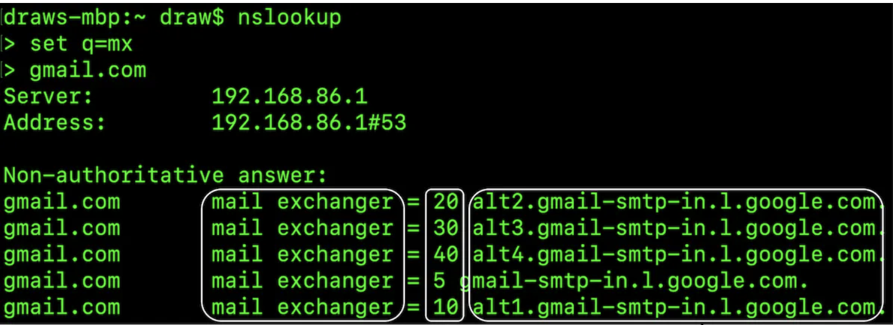
</p>

Email attachments are sent base64-encoded and there is usually a size limit of 25mb on most mail services.
This is configurable and varies from individual to corporate accounts.

**Base64 costs 33%**, which is why the limits feel arbitrary: it encodes every 3 bytes as 4 printable characters, so a 25 MB message limit admits a file of only about **18.75 MB**. The encoding exists because SMTP was specified for 7-bit text and cannot carry arbitrary binary, and it is a good illustration of the chapter's theme — you are paying a third of your attachment bandwidth to a 1982 assumption that you cannot unilaterally change.

**MX records are also the mechanism that makes delivery retryable.** A sending server resolves the recipient domain's MX records, which come with priorities, and tries them in order. If none answer, the message stays queued and is retried over hours or days before being bounced. Store-and-forward with prioritised fallbacks is why email tolerates the recipient being down for a weekend — and why "sent" never means "delivered".

### **Traditional mail servers**

Traditional mail servers work well when there are a limited number of users, connected to a single server.

<p align="left">
    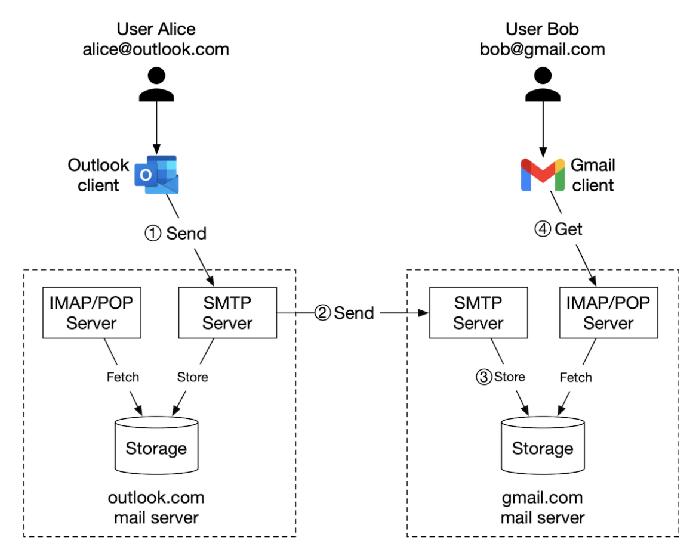
</p>

- Alice logs into her Outlook email and presses "send". Email is sent to Outlook mail server. Communication is via SMTP.
- Outlook server queries DNS to find MX record for gmail.com and transfers the email to their servers. Communication is via SMTP.
- Bob fetches emails from his gmail server via IMAP/POP.

In traditional mail servers, emails were stored on the local file system. Every email was a separate file.

<p align="left">
    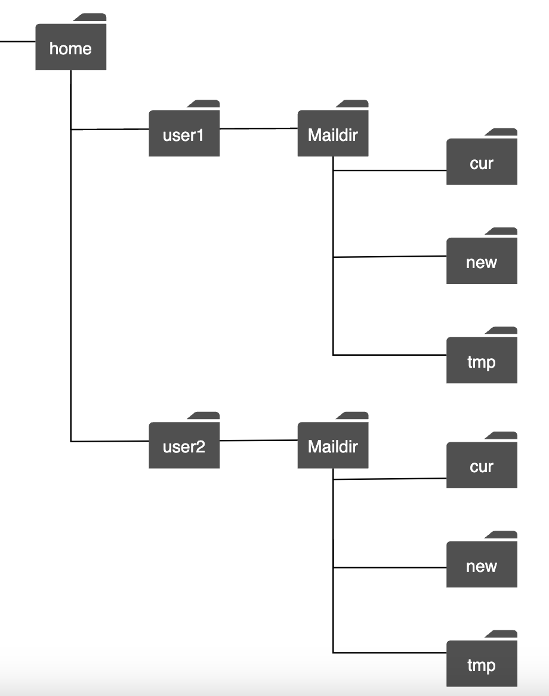
</p>

As the scale grew, disk I/O became a bottleneck. Also, it doesn't satisfy our high availability and reliability requirements.
Disks can be damaged and server can go down.

### **Distributed mail servers**

Distributed mail servers are designed to support modern use-cases and solve modern scalability issues.

These servers can still support IMAP/POP for native email clients and SMTP for mail exchange across servers.

But for rich web-based mail clients, a RESTful API over HTTP is typically used.

Example APIs:
- `POST /v1/messages` - sends a message to recipients in To, Cc, Bcc headers.
- `GET /v1/folders` - returns all folders of an email account

Example response:

```
[{id: string        Unique folder identifier.
  name: string      Name of the folder.
                    According to RFC6154 [9], the default folders can be one of
                    the following: All, Archive, Drafts, Flagged, Junk, Sent,
                    and Trash.
  user_id: string   Reference to the account owner
}]
```

- `GET /v1/folders/{:folder_id}/messages` - returns all messages under a folder \w pagination
- `GET /v1/messages/{:message_id}` - get all information about a particular message

Example response:

```
{
  user_id: string                      // Reference to the account owner.
  from: {name: string, email: string}  // <name, email> pair of the sender.
  to: [{name: string, email: string}]  // A list of <name, email> pairs
  subject: string                      // Subject of an email
  body: string                         //  Message body
  is_read: boolean                     //  Indicate if a message is read or not.
}
```

Here's the high-level design of the distributed mail server:

<p align="left">
    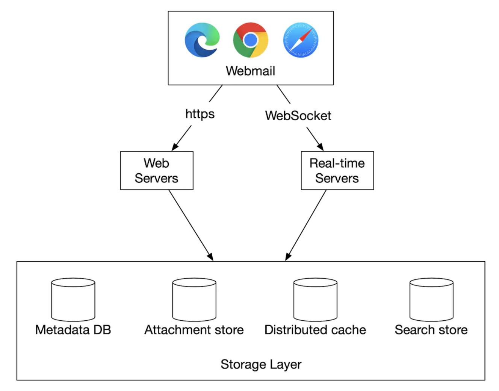
</p>

- **Webmail** - users use web browsers to send/receive emails
- **Web servers** - public-facing request/response services used to manage login, signup, user profile, etc.
- **Real-time servers** - Used for pushing new email updates to clients in real-time. We use websockets for real-time communication but fallback to long-polling for older browsers that don't support them.
- **Metadata db** - stores email metadata such as subject, body, from, to, etc.
- **Attachment store** - Object store (eg Amazon S3), suitable for storing large files.
- **Distributed cache** - We can cache recent emails in Redis to improve UX.
- **Search store** - distributed document store, used for supporting full-text searches.

Here's what the email sending flow looks like:

<p align="left">
    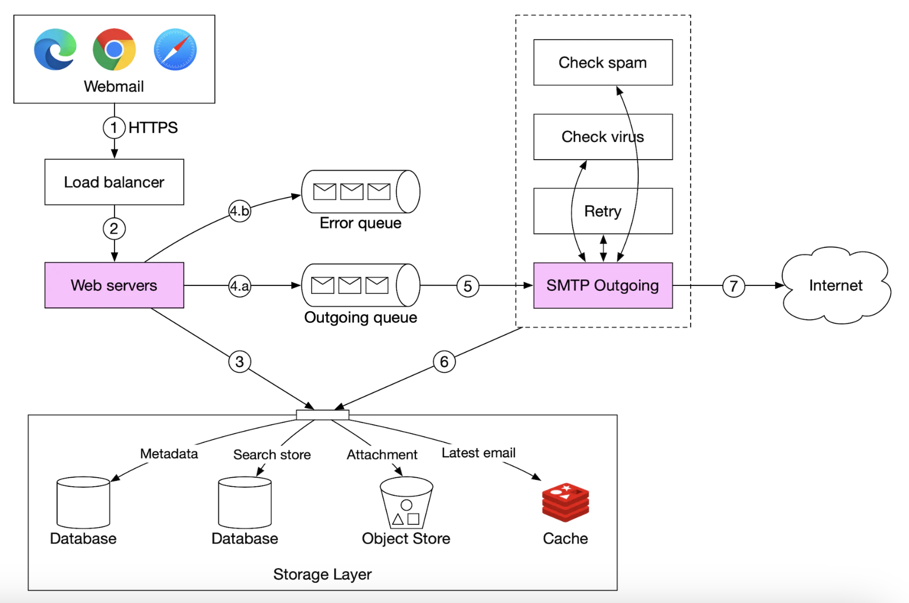
</p>

- User writes an email and presses "send". Email is sent to load balancer.
- Load balancer rate limits excessive mail sends and routes to one of the web servers.
- Web servers do basic email validation (eg email size) and short-circuits outbound flow if domain is same as sender. But does spam check first.
- If basic validation passes, email is sent to message queue (attachment is referenced from object store)
- If basic validation fails, email is sent to error queue
- SMTP outgoing workers pull messages from outgoing queue, do spam/virus checks and route to destination mail server.
- Email is stored in the "Sent Emails" folder

We need to also monitor size of outgoing message queue. Growing too large might indicate a problem:
- Recipient's mail server is unavailable. We can retry sending the email at a later time using exponential backoff.
- Not enough consumers to handle the load, we might have to scale the consumers.

Here's the email receiving flow:

<p align="left">
    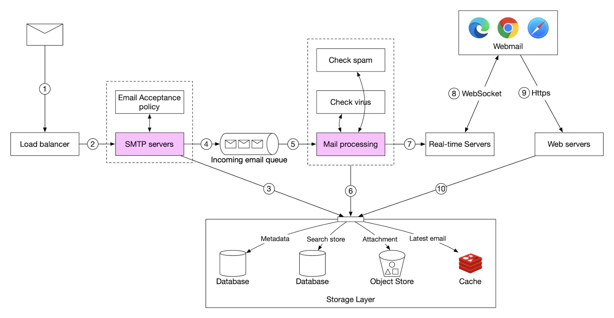
</p>

- Incoming emails arrive at the SMTP load balancer. Mails are distributed to SMTP servers, where mail acceptance policy is done (eg invalid emails are directly discarded).
- If attachment of email is too large, we can put it in object store (s3).
- Mail processing workers do preliminary checks, after which mails are forwarded to storage, cache, object store and real-time servers.
- Offline users get their new emails once they come back online via HTTP API.

---

## Step 3: Design Deep Dive

Let's now go deeper into some of the components.

### **Metadata database**

Here are some of the characteristics of email metadata:
- headers are usually small and frequently accessed
- Body size ranges from small to big, but is typically read once
- Most mail operations are isolated to a single user - eg fetching email, marking as read, searching.
- Data recency impacts data usage. Users typically read only recent emails
- Data has high-reliability requirements. Data loss is unacceptable.

At gmail/outlook scale, the database is typically custom made to reduce input/output operations per second (IOPS).

Let's consider what database options we have:
- **Relational database** - we can build indexes for headers and body, but these DBs are typically optimized for small chunks of data.
- **Distributed object store** - this can be a good option for backup storage, but can't efficiently support searching/marking as read/etc.
- **NoSQL** - Google BigTable is used by gmail, but it's not open-sourced.

Based on the above analysis, very few existing solutions seem to fit our needs perfectly.
In an interview setting, it's infeasible to design a new distributed database solution, but important to mention characteristics:
- Single column can be a single-digit MB
- Strong data consistency
- Designed to reduce disk I/O
- Highly available and fault tolerant
- Should be easy to create incremental backups

In order to partition the data, we can use the `user_id` as a partition key, so that one user's data is stored on a single shard.
This prohibits us from sharing an email with multiple users, but this is not a requirement for this interview.

**This is the third time in these notes that the quality of a shard key comes down to one question: does it contain every transaction?**

| Chapter | Shard key | Does a single operation stay inside one shard? |
|---|---|---|
| [22 – Hotel](../22.%20Hotel%20Reservation%20System/#scalability) | `hotel_id` | **Yes** — a booking never spans hotels |
| **23 – Email** | `user_id` | **Yes** — every mail operation is one mailbox |
| [15 – Drive](../15.%20Google%20Drive/#gotchas--failure-modes) | `user_id` | **No** — a shared file spans two users, and that breaks it |

Email gets the easy case, and the chapter is explicit about the price: no shared mailboxes. That is a genuine product limitation (shared team inboxes are a real feature) and the honest statement is that supporting them would require either duplicating the mailbox per member — fan-out again — or a second access path that does cross shards.

Let's define the tables:
- Primary key consists of partition key (data distribution) and clustering key (sorting data)
- Queries we need to support - get all folders for a user, display all emails for a folder, create/get/delete an email, fetch read/unread email, get conversation threads (bonus)

Legend for tables to follow:

<p align="left">
    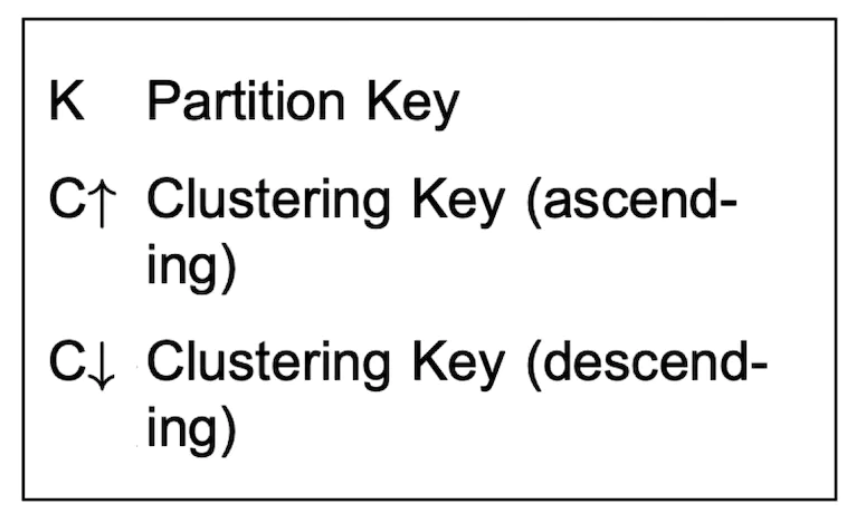
</p>

Here is the folders table:

<p align="left">
    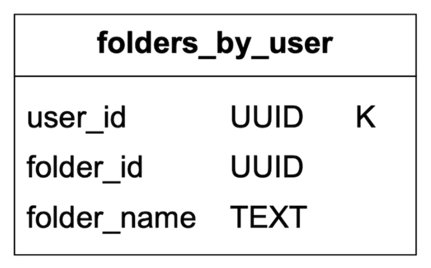
</p>

emails table:

<p align="left">
    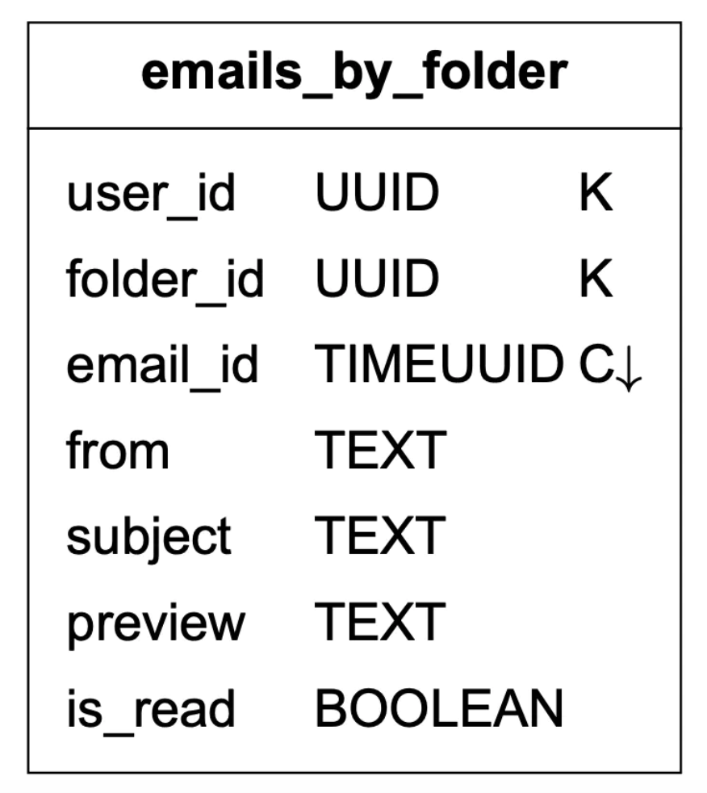
</p>

- email_id is timeuuid which allows sorting based on timestamp when email was created

Attachments are stored in a separate table, identified by filename:

<p align="left">
    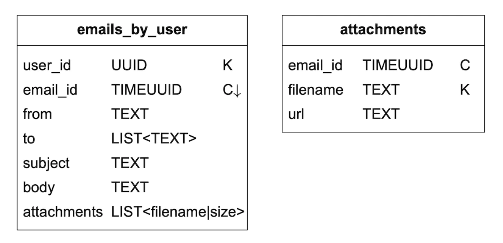
</p>

Supporting fetching read/unread emails is easy in a traditional relational database, but not in Cassandra, since filtering on non-partition/clustering key is prohibited.
One workaround is to fetch all emails in a folder and filter in-memory, but that doesn't work well for a big-enough application.

What we can do is denormalize the emails table into read/unread emails tables:

This is **a secondary index built by duplication**, and it is the standard move in a system where the storage engine only lets you query by partition and clustering key. The cost is on the write path and is worth stating plainly: marking an email as read becomes *two* writes — delete from `unread`, insert into `read` — and there is no transaction to make them atomic. The failure modes are an email appearing in **both** tables or in **neither**, so either the writes go in a batch that the engine will retry to completion, or the read path must tolerate and repair the discrepancy.

That is the recurring shape of denormalisation: you move cost from read time to write time, and you take on responsibility for consistency that a relational database would have handled for you.

<p align="left">
    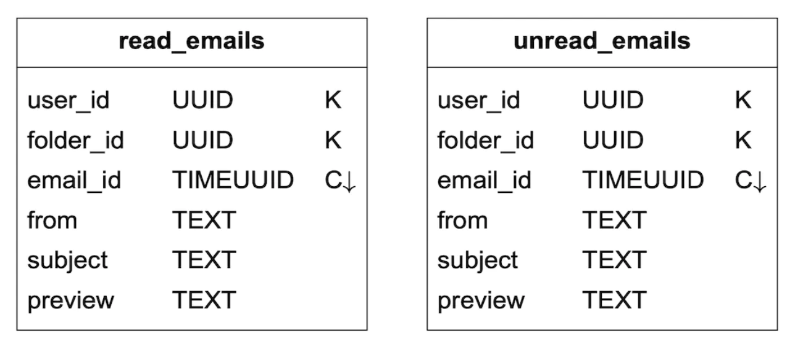
</p>

In order to support conversation threads, we can include some headers, which mail clients interpret and use to reconstruct a conversation thread:

```
{
  "headers" {
     "Message-Id": "<7BA04B2A-430C-4D12-8B57-862103C34501@gmail.com>",
     "In-Reply-To": "<CAEWTXuPfN=LzECjDJtgY9Vu03kgFvJnJUSHTt6TW@gmail.com>",
     "References": ["<7BA04B2A-430C-4D12-8B57-862103C34501@gmail.com>"]
  }
}
```

Finally, we'll trade availability for consistency for our distributed database, since it is a hard requirement for this problem.

Hence, in the event of a failover or network partition, sync/update actions will be briefly unavailable to impacted users.

**This is one of the few chapters that chooses CP over AP, and it is worth understanding why**, since most of these notes reach for availability. The deciding factor is that email state changes are *user-visible and user-initiated*: an email you read reappearing as unread, a message you deleted returning, or a draft losing its last edit are all experienced as the product being broken rather than as momentary staleness. And unlike a like count ([Chapter 11](../11.%20News%20Feed%20System/)), there is no version of the data that is acceptably approximate.

The mitigating factor is that the blast radius is tiny. Because everything is partitioned by user, a partition or failover affects only the users on that shard, and only for the duration — rather than degrading the whole service. Strong consistency is affordable here precisely because the data is so cleanly partitioned.

### **Email deliverability**

It is easy to setup a server to send emails, but getting the email to a receiver's inbox is hard, due to spam-protection algorithms.

If we just setup a new mail server and start sending mails through it, our emails will probably end up in the spam folder.

Here's what we can do to prevent that:
- **Dedicated IPs** - use dedicated IPs for sending emails, otherwise, recipient servers will not trust you.
- **Classify emails** - avoid sending marketing emails from the same servers to prevent more important email to be classified as spam
- **Warm up your IP address** slowly to build a good reputation with big email providers. It takes 2 to 6 weeks to warm up a new IP
- **Ban spammers** quickly to not deteriorate your reputation
- **Feedback processing** - setup a feedback loop with ISPs to keep track of complaint rate and ban spam accounts quickly.
- **Email authentication** - use common techniques to combat phishing such as Sender Policy Framework, DomainKeys Identified Mail, etc.

You don't need to remember all of this. Just know that building a good mail server requires a lot of domain knowledge.

**Three of these are worth knowing by name, because they are the actual answer to "how do I not land in spam" and they are all just DNS records:**

| Mechanism | What it asserts | How a receiver checks it |
|---|---|---|
| **SPF** | Which IP addresses are allowed to send mail for this domain | DNS `TXT` lookup on the sending domain; compare with the connecting IP |
| **DKIM** | This message's headers and body were signed by the domain's private key | Fetch the public key from DNS; verify the signature |
| **DMARC** | What to do when SPF or DKIM fails (none / quarantine / reject), and where to send reports | DNS `TXT` policy lookup; apply the stated policy |

The division of labour matters: SPF authenticates the *connection*, DKIM authenticates the *message* (and so survives forwarding, which SPF does not), and DMARC turns two advisory checks into an enforceable policy plus a feedback channel. Publishing all three is the highest-leverage deliverability work available, and it is configuration rather than code.

**The rest is reputation, which behaves like credit.** It accrues slowly — the chapter's 2-to-6-week IP warm-up — and is destroyed quickly by a complaint rate above roughly a tenth of a percent. The operational consequences:

- **Process bounces and suppress the addresses**, distinguishing hard (permanent: no such mailbox) from soft (temporary: mailbox full). Continuing to send to a hard-bounced address is read as spammer behaviour. This is the same failure classification as [Chapter 10](../10.%20Notification%20System/#retries-the-part-that-is-usually-wrong), with your sending reputation as the penalty.
- **Honour feedback loops.** ISPs will report complaints in a machine-readable format (ARF) if you register; ignoring them costs you the relationship.
- **Separate transactional from marketing traffic onto different IPs and subdomains**, so a campaign's complaint rate cannot sink password-reset emails.

And note the symmetry: you must also *receive* mail and filter spam, against an adversary who adapts to whatever you deploy. Greylisting, connection rate limits, content classifiers and reputation lists all feature, and the asymmetry of errors is severe — a false positive silently discards legitimate mail, which users experience as data loss, while a false negative is merely annoying.

### **Search**

Searching includes doing a full-text search based on email contents or more advanced queries based on from, to, subject, unread, etc filters.

One characteristic of email search is that it is local to the user and it has more writes than reads, because we need to re-index it on each operation, but users rarely use the search tab.

**Both halves of that sentence make email search much easier than web search, and it is worth being explicit about why.**

| | Web search ([Chapter 9](../09.%20Web%20Crawler/), [13](../13.%20Search%20Autocomplete/)) | Email search |
|---|---|---|
| Index scope | One global index over billions of documents | **One small index per user** — thousands of documents |
| Sharding | Hard; a query must consult many shards | **Trivial** — the query goes to the user's shard only |
| Ranking | Relevance, the entire problem | Sort by date; relevance barely matters |
| Read:write ratio | Reads dominate overwhelmingly | **Writes dominate** — every email is indexed, few are searched |
| Freshness | Minutes to days is fine | An email must be findable immediately |

So the per-user index is small enough to be cheap to query and to rebuild, and no global inverted index is needed at all. What is unusual is the **write amplification**: the index is maintained continuously for a feature most users invoke rarely, which means the dominant cost is indexing work that is never read. That inverted ratio is exactly the argument for an LSM-tree — optimise writes, accept more work at read time — and it is the same storage structure as [Chapter 6](../06.%20Key-Value%20Store/).

Let's compare google search with email search:

|               | Scope                | Sorting                               | Accuracy                                          |
|---------------|----------------------|---------------------------------------|---------------------------------------------------|
| Google search | The whole internet   | Sort by relevance                     | Indexing takes some time, so not instant results. |
| Email search  | User's own email box | Sort by attributes eg time, date, etc | Indexing should be quick and results accurate.    |

To achieve this search functionality, one option is to use an Elasticsearch cluster. We can use `user_id` as the partition key to group data under the same node:

<p align="left">
    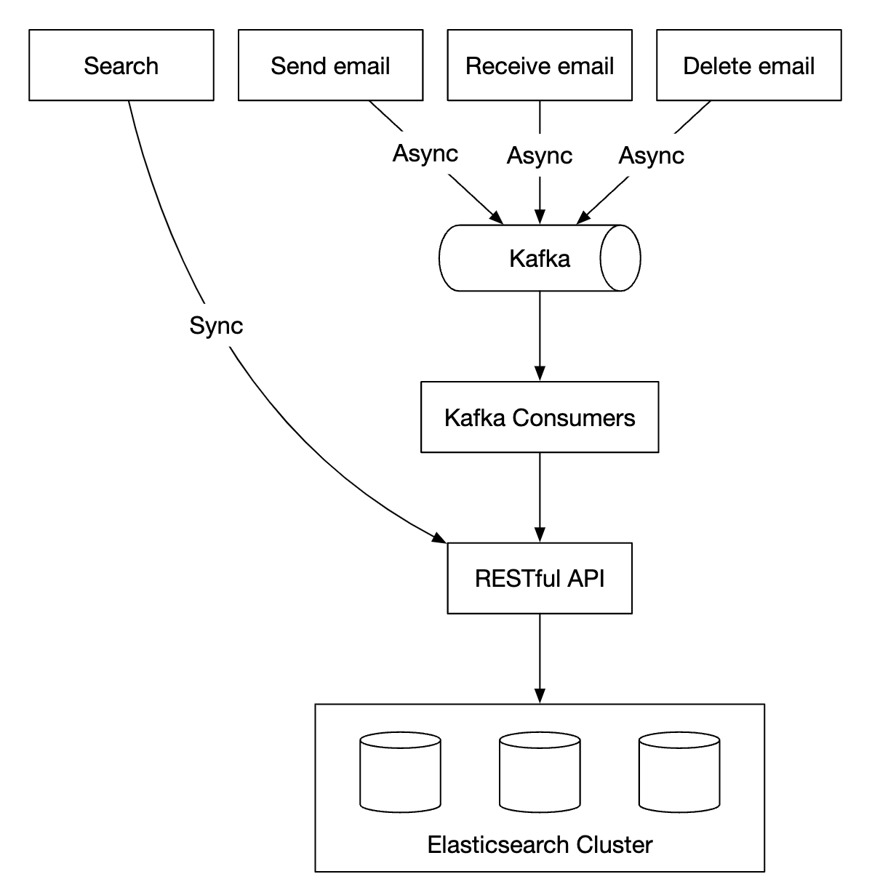
</p>

Mutating operations are async via Kafka in order to decouple services from the reindexing flow.
Actually searching for data happens synchronously.

Elasticsearch is one of the most popular search-engine databases and supports full-text search for emails very well.

Alternatively, we can attempt to develop our own custom search solution to meet our specific requirements.

Designing such a system is out of scope. One of the core challenges when building it is to optimize it for write-heavy workloads.

To achieve that, we can use Log-Structured Merge-Trees (LSM) to structure the index data on disk. Write path is optimized for sequential writes only.
This technique is used in Cassandra, BigTable and RocksDB.

Its core idea is to store data in-memory until a predefined threshold is reached, after which it is merged in the next layer (disk):

<p align="left">
    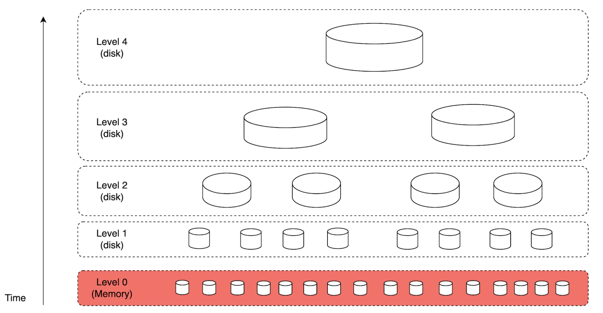
</p>

Main trade-offs between the two approaches:
- Elasticsearch scales to some extent, whereas a custom search engine can be fine-tuned for the email use-case, allowing it to scale further.
- Elasticsearch is a separate service we need to maintain, alongside the metadata store. A custom solution can be the datastore itself.
- Elasticsearch is an off-the-shelf solution, whereas the custom search engine would require significant engineering effort to build.

### **Scalability and availability**

Since individual user operations don't collide with other users, most components can be independently scaled.

To ensure high availability, we can also use a multi-DC setup with leader-follower failover in case of failures:

<p align="left">
    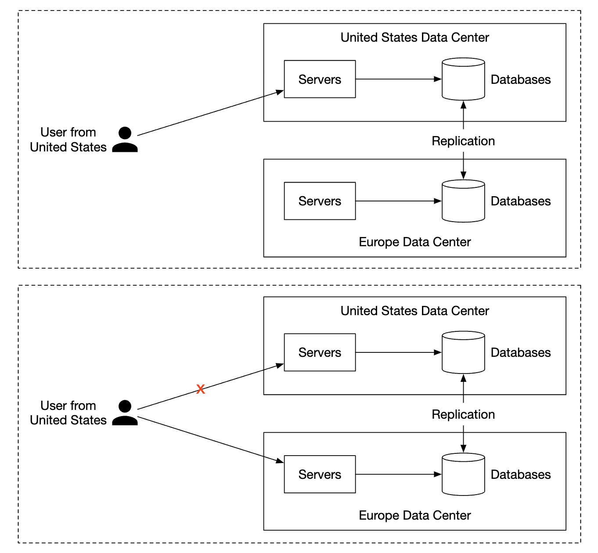
</p>

---

## Step 4: Wrap Up

Additional talking points:
- **Fault tolerance** - Many parts of the system could fail. It is worthwhile considering how we'd handle node failures.
- **Compliance** - PII needs to be stored in a reasonable way, given Europe's GDPR laws.
- **Security** - email encryption, phishing protection, safe browsing, etc.
- **Optimizations** - eg preventing duplication of the same attachments, sent multiple times by different users.

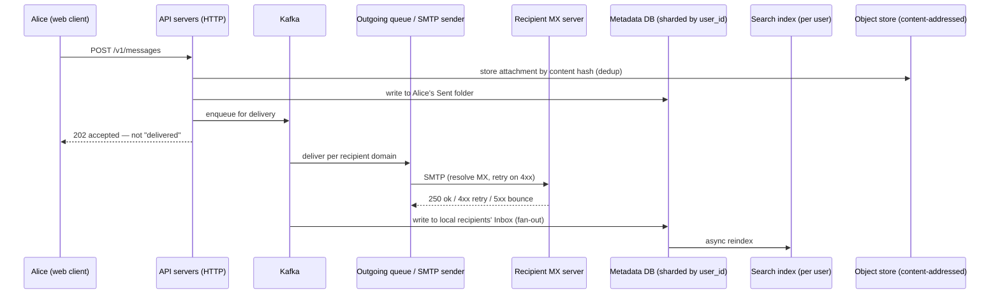

**The one thing to notice in this diagram is the `202 accepted`.** The API cannot report delivery, because delivery involves other people's servers, retries over hours, and spam filters whose verdict is never communicated. Everything downstream of the queue is best-effort with a bounce as the only negative signal — and a message silently filed in a recipient's spam folder produces no signal at all.

---

### Gotchas & failure modes

- **"Sent" does not mean delivered, and nothing in the protocol will tell you.** A `250 OK` from the recipient's MX means accepted for processing, after which it may be spam-filed with no notification. Deliverability is therefore measured statistically (engagement, complaint rates, seed lists), not per message.
- **Deliverability is reputation, and reputation is slow to build and fast to lose.** A complaint rate above ~0.1% degrades delivery for everything you send. Publish SPF, DKIM and DMARC, warm IPs over weeks, and separate transactional from marketing traffic.
- **Not processing bounces is read as spammer behaviour.** Hard bounces must suppress the address permanently; soft bounces may be retried. Continuing to send to dead addresses is one of the fastest ways to lose reputation.
- **Attachment dedup makes deletion and compliance hard.** Content-addressed storage means a GDPR erasure request cannot simply delete the bytes — another user's mailbox may reference them. Reference counting, plus the uncomfortable truth that "delete" means "unlink and wait for collection".
- **Base64 inflates attachments by 33%.** A 25 MB message limit is an ~18.75 MB file, and the overhead is paid on every hop.
- **The read/unread denormalisation can leave an email in both tables or neither.** Two writes with no transaction. Use a batch the engine retries, and make the read path repair what it finds.
- **`user_id` partitioning prohibits shared mailboxes.** A real product requirement that this schema cannot express without fan-out or a second cross-shard access path.
- **A single enormous mailbox is a hot partition.** A user with a million messages, or a mailing-list address receiving thousands an hour, concentrates on one shard — and `user_id` partitioning gives you no way to split them, because every query assumes one mailbox lives in one place.
- **Thread reconstruction depends on headers that clients get wrong.** `In-Reply-To` and `References` are set by the sending client; many set them incorrectly or not at all, and subject-line heuristics then have to paper over it. Threads are therefore a best-effort presentation, not a data structure you can trust.
- **Sorting by date means sorting by a header the sender controls.** The `Date` header can be wrong, absent, or deliberately set in the future to pin a message to the top of the inbox. Keep your own receive timestamp and sort by that.
- **Duplicate delivery is normal.** SMTP retries after an ambiguous failure, so the same message can arrive twice. `Message-Id` is the deduplication key — the idempotency key of [Chapter 19](../19.%20Distributed%20Message%20Queue/) under an older name.
- **Spam false positives are worse than false negatives.** Discarding legitimate mail is indistinguishable from losing it, against a stated requirement that data loss is unacceptable. Quarantine rather than delete, and make the quarantine visible.
- **The search index is write-amplified for a rarely used feature.** Every received message is indexed; few users search. Worth measuring before optimising anything else about search.
- **Forwarding rules create loops.** Two accounts forwarding to each other, or a filter that re-delivers into the same mailbox, will amplify without bound. Hop counts and loop detection headers exist for this.
- **Mail is the most phished channel in existence.** Display-name spoofing, lookalike domains and attachment-borne malware are routine, so link rewriting, attachment scanning and prominent authentication indicators are product features rather than extras.
- **A custom storage engine is the realistic answer at this scale and an unrealistic interview answer.** Gmail runs on BigTable; the chapter is right that the useful move is to state the required *characteristics* rather than to design a database.

---

## The design, as problem and technique

| Goal / problem | Technique |
|---|---|
| Interoperating with every other mail server | SMTP for transfer, MX records for routing, store-and-forward with retry |
| Rich web clients | HTTP/REST API instead of IMAP/POP, while still supporting both for native clients |
| Every operation concerning one mailbox | Partition metadata by `user_id`; no cross-shard transactions |
| Reading an email must stay read | Choose consistency over availability; blast radius limited to one shard |
| Querying by read/unread in a partition-key store | Denormalised `read` and `unread` tables, written together |
| Sorting a folder by time | `timeuuid` message IDs, used as the clustering key |
| 1,460 PB/year of attachments, mostly duplicated | Content-addressed attachment storage with reference counting |
| One email to many recipients | Fan-out on write — unavoidable under federation |
| Full-text search | Small per-user index, sharded by `user_id`; async reindex via Kafka |
| Write-heavy index maintenance | LSM-tree storage optimised for sequential writes |
| Landing in the inbox rather than spam | SPF, DKIM and DMARC; dedicated warmed IPs; traffic separation |
| Protecting sender reputation | Bounce classification and suppression; ISP feedback loops; fast spammer bans |
| Duplicate deliveries from SMTP retries | Deduplicate on `Message-Id` |
| Conversation threads | `Message-Id` / `In-Reply-To` / `References` headers, interpreted best-effort |
| Surviving a data centre loss | Multi-DC replication with leader-follower failover |

## Self-check
1. What makes this system structurally different from every other chapter in these notes?
2. In what sense is SMTP a message queue, and which two of its behaviours correspond to retry and dead-lettering?
3. Which line item dominates storage, and what is the single largest optimisation available against it?
4. Why is the push-versus-pull fan-out question from Chapter 11 not available here?
5. Why does `user_id` work so well as a shard key, and which earlier chapter shows the same key failing?
6. What product feature does that partitioning prohibit?
7. Marking an email as read requires two writes. What are the two failure modes, and how are they handled?
8. Why does this chapter choose consistency over availability, and what makes that affordable?
9. Give three reasons email search is easier than web search, and the one way it is harder.
10. What do SPF, DKIM and DMARC each assert, and why does DKIM survive forwarding when SPF does not?
11. Why does failing to process hard bounces damage deliverability?
12. A 25 MB attachment limit admits a file of what size, and why?
13. Why can't you trust the `Date` header for sorting, or `In-Reply-To` for threading?
14. Why is a spam false positive worse than a false negative here?

## Glossary

| Term | Meaning |
|---|---|
| **SMTP / POP / IMAP** | Server-to-server transfer; download-and-delete retrieval; server-side retrieval |
| **MX record** | DNS record naming a domain's mail servers, with priorities for fallback |
| **Store-and-forward** | Queueing a message and retrying delivery over hours before bouncing |
| **Hard / soft bounce** | Permanent (`5xx`) vs temporary (`4xx`) delivery failure |
| **SPF** | DNS record listing IPs permitted to send for a domain |
| **DKIM** | Domain signature over a message, verifiable via a DNS-published public key |
| **DMARC** | Policy and reporting layer telling receivers what to do when SPF/DKIM fail |
| **IP warm-up** | Gradually increasing send volume on a new IP to build reputation |
| **Feedback loop (ARF)** | Machine-readable complaint reports from ISPs |
| **Complaint rate** | Fraction of recipients marking mail as spam; ~0.1% is the danger threshold |
| **Content-addressed storage** | Storing attachments keyed by the hash of their bytes, so duplicates collapse |
| **`timeuuid`** | Time-ordered UUID used as a clustering key so folders sort chronologically |
| **Denormalised index** | Duplicate tables (`read` / `unread`) standing in for a secondary index |
| **`Message-Id` / `In-Reply-To` / `References`** | Headers used for deduplication and thread reconstruction |
| **Greylisting** | Temporarily rejecting an unknown sender, since real servers retry and many spammers do not |
| **LSM-tree** | Write-optimised storage structure suited to the index's write-heavy profile |

## Where to go next
- [Chapter 15 – Design Google Drive](../15.%20Google%20Drive/#improved-design) — content-addressed storage and dedup, including why deletion becomes reference counting.
- [Chapter 6 – Design A Key-Value Store](../06.%20Key-Value%20Store/) — the LSM-tree storage and the CAP trade-off this chapter resolves the other way.
- [Chapter 19 – Distributed Message Queue](../19.%20Distributed%20Message%20Queue/) — the modern description of what SMTP has been doing since 1982.
- [Chapter 10 – Design A Notification System](../10.%20Notification%20System/#retries-the-part-that-is-usually-wrong) — bounce classification and the third-party deliverability boundary, from the sender's side.
- [Chapter 13 – Design A Search Autocomplete System](../13.%20Search%20Autocomplete/) — search where the index is global and reads dominate; the mirror image of this one.
