# Chapter 24: S3-like Object Storage

## Introduction

In this chapter, we'll be designing an **object storage** service, similar to **Amazon S3**.

**The one-sentence version:** two decisions generate this entire design — **objects are immutable**, and **metadata is stored separately from the bytes**. Immutability means you never modify data in place, which is what makes it safe to pack many objects into one big append-only file, to checksum content permanently, to erasure-code it, to version it, and to reclaim space by copying rather than editing. The metadata split is what lets a flat key-value namespace scale independently of petabytes of content.

Notice the consequence that runs through the chapter: **because nothing is ever modified, "delete" is not an operation on data.** It is a metadata change plus a promise that a background garbage collector will eventually reclaim the space. Almost every hard problem later in the chapter — versioning, deletion, compaction, orphaned upload parts — is a consequence of that one property.

The other thing worth holding onto: object storage is the layer underneath several earlier chapters. The video tiers in [Chapter 14](../14.%20Youtube/), the blocks in [Chapter 15](../15.%20Google%20Drive/), the map tiles in [Chapter 18](../18.%20Google%20Maps/) and the archived messages in [Chapter 19](../19.%20Distributed%20Message%20Queue/) all land here.

Storage systems fall into three broad categories:
- **Block storage**
- **File storage**
- **Object storage**

**Block storage** are devices, which came out in 1960s. HDDs and SSDs are such examples.
These devices are typically physically attached to a server, although they can also be network-attached via high-speed network protocols.
Servers can format the raw blocks and use them as a file system or it can hand control of them to servers directly.

**File storage** is built on top of block storage. It provides a higher level of abstraction, making it easier to manage folders and files.

**Object storage** sacrifices performance for high durability, vast scale and low cost.
It targets "cold" data and is mainly used for archival and backup.
There is no hierarchical directory structure, all data is stored as objects in a flat structure.
It is relatively slow compared to other storage types. Most cloud providers have an object storage offering - Amazon S3, Google GCS, etc.

<p align="left">
    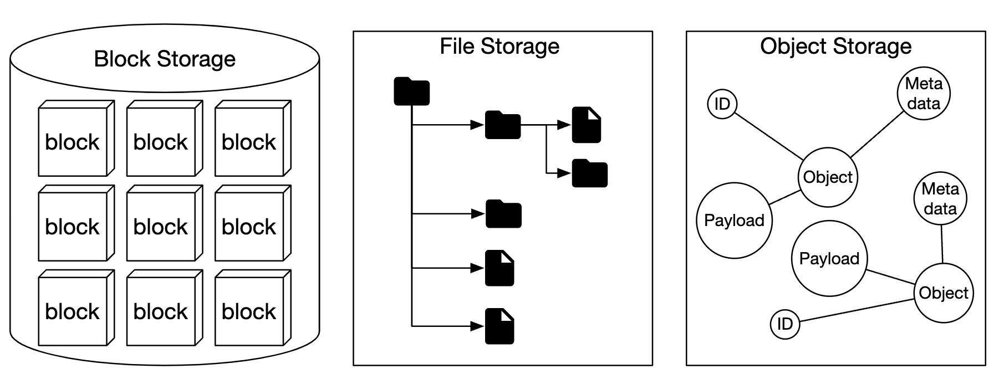
</p>

|                 | Block Storage                    | File Storage                            | Object Storage                 |
|-----------------|----------------------------------|-----------------------------------------|--------------------------------|
| Mutable Content | Y                                | Y                                       | N (has object versioning）     |
| Cost            | High                             | Medium to high                          | Low                            |
| Performance     | Medium to high, very high        | Medium to high                          | Low to medium                  |
| Consistency     | Strong consistency               | Strong consistency                      | Strong consistency [5]         |
| Data access     | SAS/iSCSI/FC                     | Standard file access, CIFS/SMB, and NFS | RESTful API                    |
| Scalability     | Medium scalability               | High scalability                        | Vast scalability               |
| Good for        | Virtual machines (VM), databases | General-purpose file system access      | Binary data, unstructured data |

Some terminology, related to object storage:
- **Bucket** - logical container for objects. Name is globally unique.
- **Object** - An individual piece of data, stored in a bucket. Contains object data and metadata.
- **Versioning** - A feature keeping multiple variants of an object in the same bucket.
- **Uniform Resource Identifier (URI)** - each resource is uniquely identified by a URI.
- **Service-level Agreement (SLA)** - contract between service provider and client.

Amazon S3 Standard-Infrequent Access storage class SLAs:
- Durability of 99.999999999% across multiple Availability Zones
- Data is resilient in the event of entire Availability Zone being destroyed
- Designed for 99.9% availability

---

## Step 1: Understand the Problem and Establish Design Scope

- C: Which features should be included?
- I: Bucket creation, Object upload/download, versioning, Listing objects in a bucket
- C: What is the typical data size?
- I: We need to store both massive objects and small objects efficiently
- C: How much data do we store in a year?
- I: 100 petabytes
- C: Can we assume 6 nines of data durability (99.9999%) and service availability of 4 nines (99.99%)?
- I: Yes, sounds reasonable

### **Non-functional requirements**

- **100 PB of data**
- **6 nines of data durability**
- **4 nines of service availability**
- Storage efficiency. Reduce storage cost while maintaining high reliability and performance

### **Back-of-the-envelope estimation**

Object storage is likely to have bottlenecks in disk capacity or IO per second (IOPS).

Assumptions:
- we have 20% small (less than 1mb), 60% mid-size (1-64mb) and 20% large objects (greater than 64mb),
- One hard disk (SATA, 7200rpm) is capable of doing 100-150 random seeks per second (100-150 IOPS)

Given the assumptions, we can estimate the total number of objects the system can persist.
- Let's use median size per object type to simplify calculation - 0.5mb for small, 32mb for medium, 200mb for large.
- Given 100PB of storage (10^11 MB) and 40% of storage usage results in 0.68bil objects
- If we assume metadata is 1kb, then we need 0.68tb space to store metadata info

### Why these two numbers matter more than they look

**0.68 billion objects is the number that forces the packing design.** If each object were a separate file:

| Problem | Arithmetic |
|---|---|
| Block waste | A filesystem block is typically 4 KB, and a file occupies whole blocks. A 1 KB object wastes 75% of its block — and 20% of objects are under 1 MB |
| Inode exhaustion | One inode per file × 0.68 billion files. Filesystems have hard inode limits, and performance degrades badly long before them |
| IOPS | At 100–150 IOPS per HDD, every extra seek per request is a direct reduction in throughput |

So merging small objects into large append-only files is **not an optimisation, it is a requirement** — the naive one-file-per-object design does not fit on the hardware at all.

**0.68 TB of metadata against 100 PB of data is a ratio of about 1:150,000.** That asymmetry is the justification for the metadata/data split: the metadata is small enough to live in a database with indexes, transactions and rich queries, while the data is far too large for any of that. Scaling them together would mean either a database holding 100 PB or an object store you cannot query — the split lets each be the right kind of system.

> **Interview angle:** derive the object count, then say what it rules out. "0.68 billion objects means one-file-per-object exhausts inodes and wastes 4 KB blocks, so I need to pack objects into large files and keep an offset index" is the central insight of the chapter, reached from the estimate rather than recalled.

## Step 2: Propose High-Level Design and Get Buy-In

Let's explore some interesting properties of object storage before diving into the design:
- **Object immutability** - objects in object storage are immutable (not the case in other storage systems). We may delete them or replace them, but no update.
- **Key-value store** - an object URI is its key and we can get its contents by making an HTTP call
- **Write once, read many times** - data access pattern is writing once and reading many times. According to some Linkedin research, 95% of operations are reads
- Support both small and large objects

Design philosophy of object storage is similar to UNIX - when we save a file, it creates the filename in a data structure, called inode and file data is stored in different disk locations.
The inode contains a list of file block pointers, which point to different locations on disk.

When accessing a file, we first fetch its metadata from the inode, prior to fetching the file contents.

Object storage works similarly - metadata store is used for file information, but contents are stored on disk:

<p align="left">
    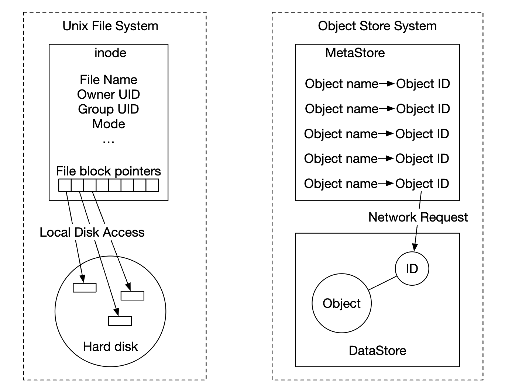
</p>

By separating metadata from file contents, we can scale the different stores independently:

<p align="left">
    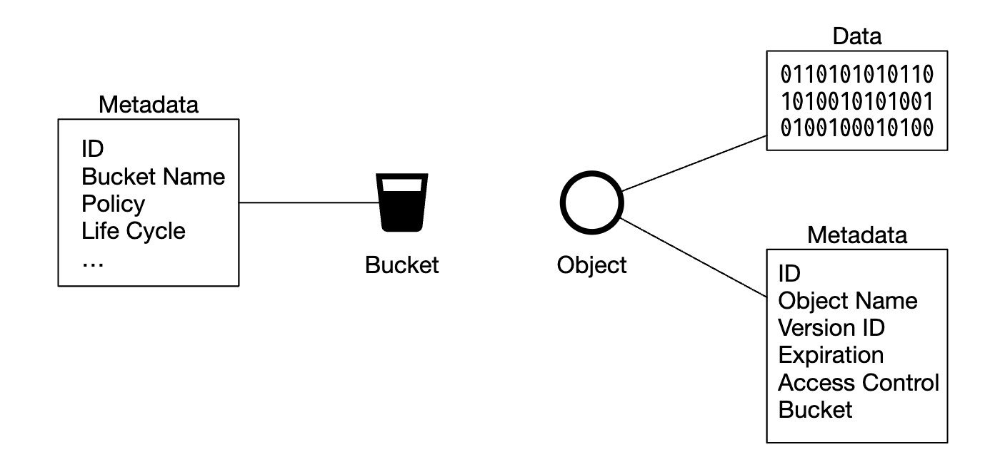
</p>

### **High-level design**

<p align="left">
    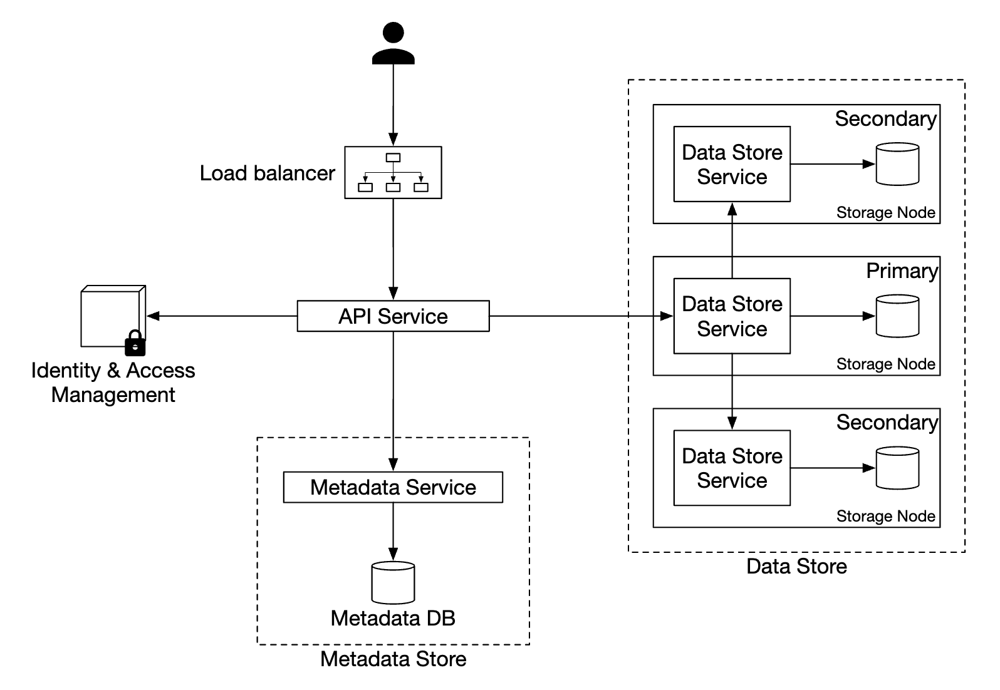
</p>

- **Load balancer** - distributes API requests across service replicas
- **API service** - Stateless server, orchestrating calls to metadata and object store, as well as IAM service.
- **Identity and access management (IAM)** - central place for auth, authz, access control.
- **Data store** - stores and retrieves actual data. Operations are based on object ID (UUID).
- **Metadata store** - stores object metadata

### **Uploading an object**

<p align="left">
    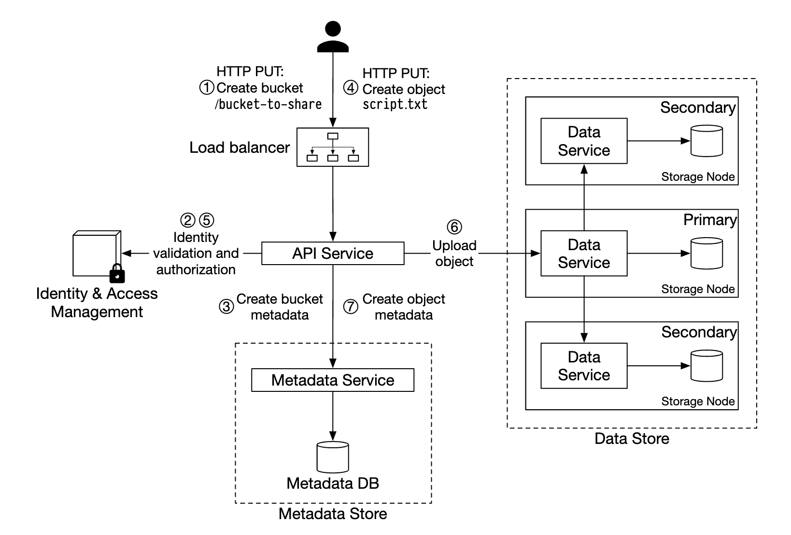
</p>

- Create a bucket named "bucket-to-share" via HTTP PUT request
- API service calls IAM to ensure user is authorized and has write permissions
- API service calls metadata store to create a bucket entry. Once created, success response is returned.
- After bucket is created, HTTP PUT is sent to create an object named "script.txt"
- API service verifies user identity and ensures user has write permissions
- Once validation passes, object payload is sent via HTTP PUT to the data store. Data store persists it and returns a UUID.
- API service calls metadata store to create a new entry with object_id, bucket_id and bucket_name, among other metadata.

Example object upload request:

```
PUT /bucket-to-share/script.txt HTTP/1.1
Host: foo.s3example.org
Date: Sun, 12 Sept 2021 17:51:00 GMT
Authorization: authorization string
Content-Type: text/plain
Content-Length: 4567
x-amz-meta-author: Alex

[4567 bytes of object data]
```

### **Downloading an object**

Buckets have no directory hierarchy, buy we can create a logical hierarchy by concatenating bucket name and object name to simulate a folder structure.

Example GET request for fetching an object:

```
GET /bucket-to-share/script.txt HTTP/1.1
Host: foo.s3example.org
Date: Sun, 12 Sept 2021 18:30:01 GMT
Authorization: authorization string
```

<p align="left">
    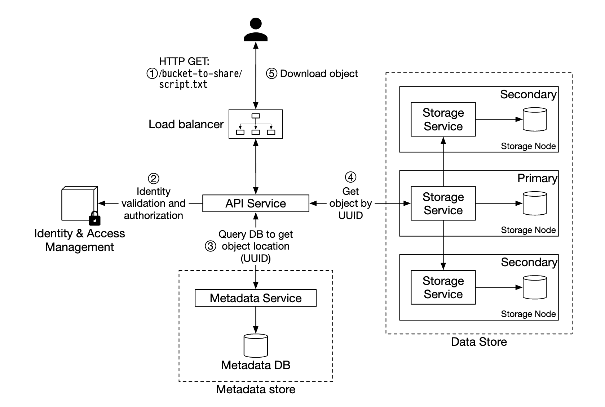
</p>

- Client sends an HTTP GET request to the load balancer, ie `GET /bucket-to-share/script.txt`
- API service queries IAM to verify the user has correct permissions to read the bucket
- Once validated, UUID of object is retrieved from metadata store
- Object payload is retrieved from data store based on UUID and returned to the client

---

// sprint 1

## Step 3: Design Deep Dive

### **Data store**

Here's how the API service interacts with the data store:

<p align="left">
    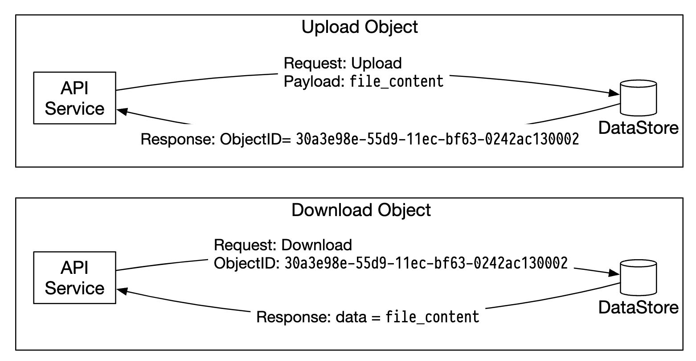
</p>

The data store's main components:

<p align="left">
    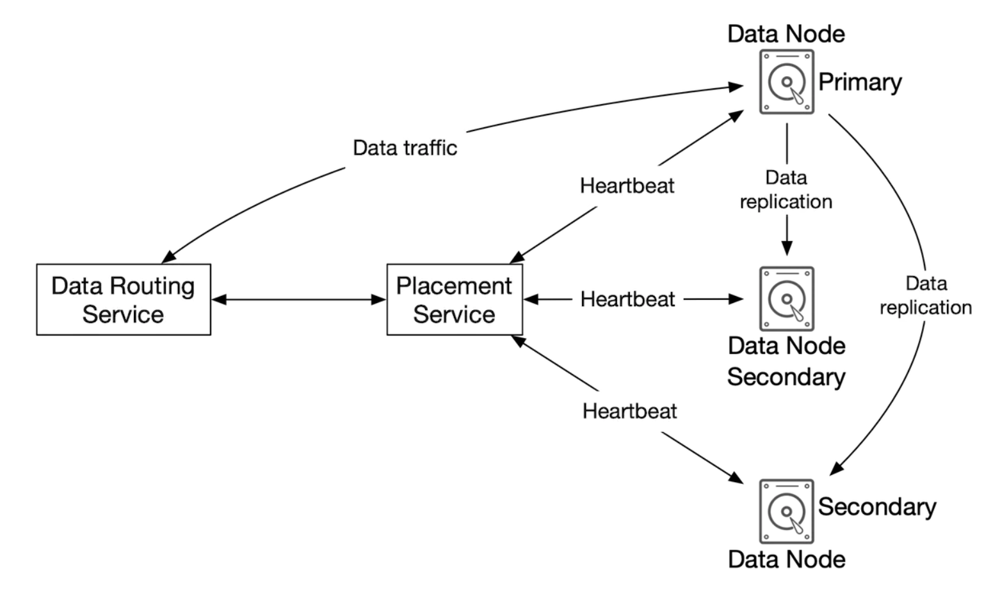
</p>

The data routing service provides a RESTful or gRPC API to access the data node cluster.
It is a stateless service, which scales by adding more servers.

It's main responsibilities are:
- querying the placement service to get the best data node to store data
- reading data from data nodes and returning it to the API service
- Writing data to data nodes

The placement service determines which data nodes should store an object.
It maintains a virtual cluster map, which determines the physical topology of a cluster.

<p align="left">
    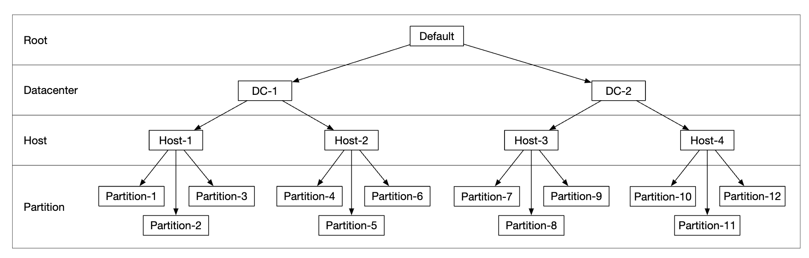
</p>

The service also sends heartbeats to all data nodes to determine if they should be removed from the virtual cluster.

Since this is a critical service, it is recommended to maintain a cluster of 5 or 7 replicas, synchronized via Paxos or Raft consensus algorithms.
Eg a 7 node cluster can tolerate 3 nodes failing.

Data nodes store the actual object data.
Reliability and durability is ensured by replicating data to multiple data nodes.

Each data node has a daemon running, which sends heartbeats to the placement service.

The heartbeat includes:
- How many disk drives (HDD or SSD) does the data node manage?
- How much data is stored on each drive?

#### Data persistence flow

<p align="left">
    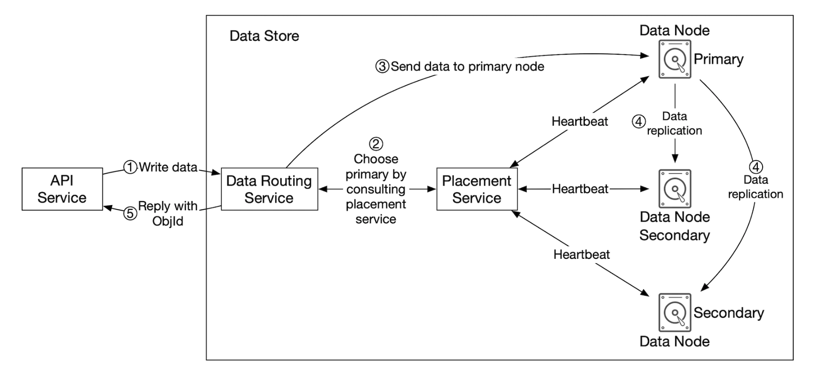
</p>

- API service forwards the object data to data store
- Data routing service sends the data to the primary data node
- Primary data node saves the data locally and replicates it to two secondary data nodes. Response is sent after successful replication.
- The UUID of the object is returned to the API service.

Caveats:
- Given an object UUID, it's replication group is deterministically chosen by using consistent hashing
- In step 4, the primary data node replicates the object data before returning a response. This favors strong consistency over higher latency.

<p align="left">
    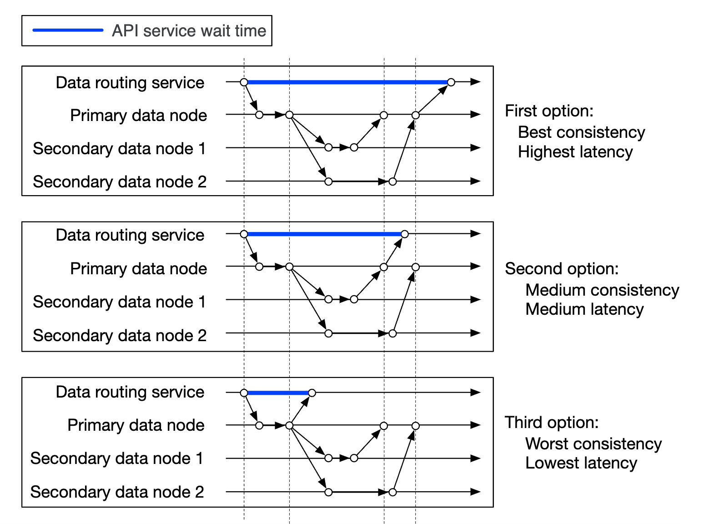
</p>

#### How data is organized

One simple approach to managing data is to store each object in a separate file.

This works, but is not performant with many small files in a file system:
- Data blocks on HDD are wasted, because every file uses the whole block size. Typical block size is 4kb.
- Many files means many inodes. Operating systems don't deal well with too many inodes and there is also a max inode limit.

These issues can be addressed by merging many small files into bigger ones via a write-ahead log (WAL). Once the file reaches its capacity (typically a few GB), a new file is created:

<p align="left">
    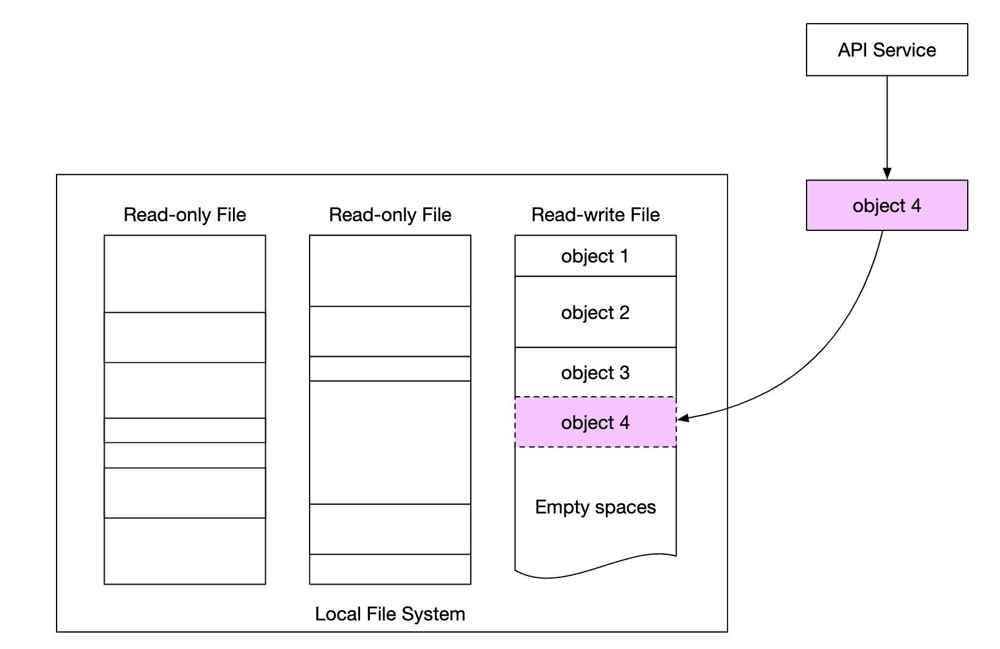
</p>

The downside of this approach is that write access to the file needs to be serialized. Multiple cores accessing the same file must wait for each other.
To fix this, we can confine files to specific cores to avoid lock contention.

#### Object lookup

To support storing multiple objects in the same file, we need to maintain a table, which tells the data node:
- `object_id`
- `filename` where object is stored
- `file_offset` where object starts
- `object_size`

We can deploy this table in a file-based db like RocksDB or a traditional relational database.
Since the access pattern is low write+high read, a relational database works better.

Note the structure this creates. The object mapping table is an **offset index into a packed file** — `object_id → (filename, offset, size)` — which is precisely the UNIX inode's list of block pointers, rebuilt one level up. The chapter's analogy is not decorative; it is the same mechanism.

How should we deploy it?
We could deploy the db and scale it separately in a cluster, accessed by all data nodes.

Downsides:
- we'd need to aggressively scale the cluster to serve all requests
- there's additional network latency between data node and db cluster

An alternative is to take advantage of the fact that data nodes are only interested to data related to them,
so we can deploy the relational db within the data node itself.

SQLite is a good option as it's a lightweight file-based relational database.

**This is the most quietly important decision in the data store, and the reason is IOPS and latency, not convenience.** 95% of operations are reads, and every read needs one lookup before it can seek to the bytes. If that lookup is a network call to a shared database cluster:

- every read pays an extra round trip before any data moves;
- the cluster must be sized for the *entire fleet's* read rate, making it the global bottleneck;
- and it becomes a shared failure domain — its outage stops all reads everywhere.

Co-locating the index with the data it describes makes the lookup a local file read, removes the round trip, and scales automatically with the number of data nodes, because each node's index only ever describes its own files. **The index is partitioned by construction rather than by a sharding scheme** — which is the cleanest form of partitioning available, and it works only because a data node genuinely never needs to know about another node's objects.

#### Updated data persistence flow

<p align="left">
    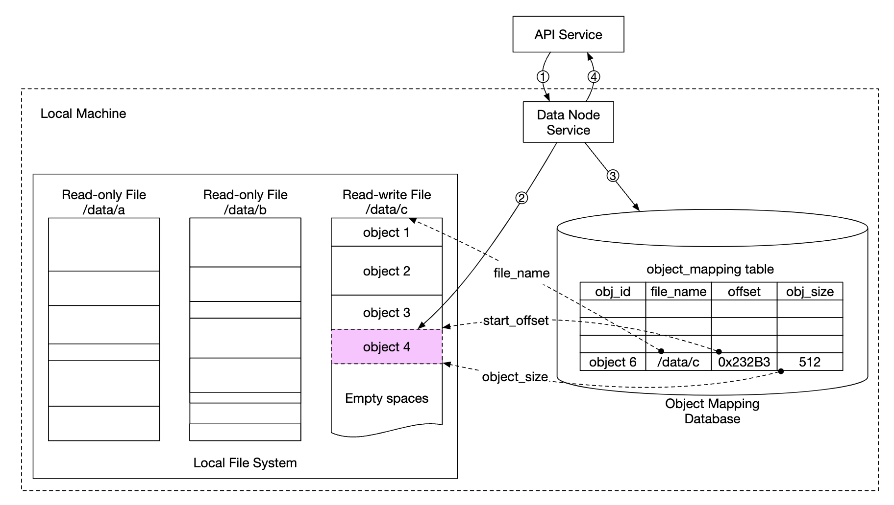
</p>

- API Service sends a request to save a new object
- Data node service appends the new object at the end of a file, named "/data/c"
- A new record for the object is inserted into the object mapping table

#### Durability

Data durability is an important requirement in our design. In order to achieve 6 nines of durability, every failure case needs to be properly examined.

First problem to address is hardware failures. We can achieve that by replicating data nodes to minimize probability of failure.
But in addition to that, we also ought to replicate across different failure domains (cross-rack, cross-dc, separate networks, etc).
A critical event can cause multiple hardware failures within the same domain:

<p align="left">
    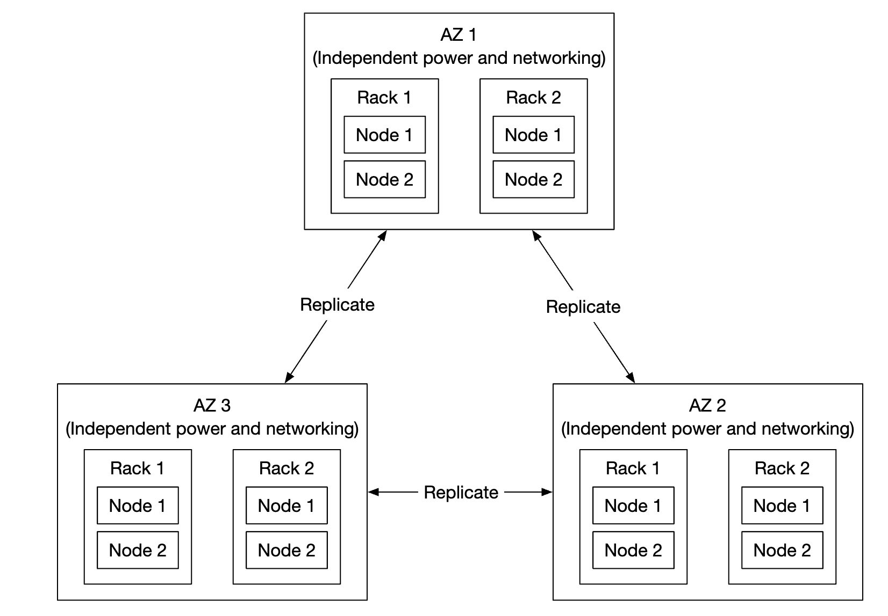
</p>

Assuming annual failure rate of a typical HDD is 0.81%, making three copies gives us 6 nines of durability.

**The arithmetic, since "nines" is easy to assert and worth being able to derive.** If a disk's annual failure rate is 0.81% and the three copies fail independently:

```
P(losing all three in a year) = 0.0081³ ≈ 5.3 × 10⁻⁷
durability = 1 − 5.3 × 10⁻⁷ ≈ 0.9999995  →  ~6 nines
```

Two things that calculation depends on, and both are design requirements rather than assumptions:

**The failures must be independent.** `0.0081³` is only valid if the three copies cannot fail together — which is exactly why replicas are placed across racks, power domains, networks and data centres. Three copies in one rack are, for the purposes of this formula, one copy: a single power event correlates them and the exponent collapses. **Failure-domain isolation is what makes the multiplication legal**, and it is the whole reason the chapter raises it before the maths.

**Lost copies must be re-created quickly.** The model assumes you are back to three copies long before a second disk fails. Durability is really a race between failure rate and repair rate, which is why repair speed — see the erasure coding caveat below — is a durability property, not just an operational one.

Replicating the data nodes like that grants us the durability we want, but we could also leverage erasure coding to reduce storage costs.

Erasure coding enables us to use parity bits, which allow us to reconstruct lost bits in the event of a failure:

**How it works, in one paragraph.** Split an object into `n` data chunks, compute `m` parity chunks from them (Reed-Solomon coding is the usual scheme), and distribute all `n + m` across failure domains. Any `n` of the `n + m` chunks are sufficient to reconstruct the original — it does not matter which `n`. With 8+4 you store 12 chunks and survive the loss of **any 4**, while occupying 12/8 = **1.5×** the logical size instead of replication's 3×.

The cost saving at this scale is the headline number:

| Scheme | Raw storage for 100 PB logical | Survives | Overhead |
|---|---|---|---|
| 3× replication | **300 PB** | any 2 losses | 200% |
| 8+4 erasure coding | **150 PB** | any 4 losses | 50% |

**150 petabytes saved, with better fault tolerance.** That is why every large object store uses erasure coding for the bulk of its data.

<p align="left">
    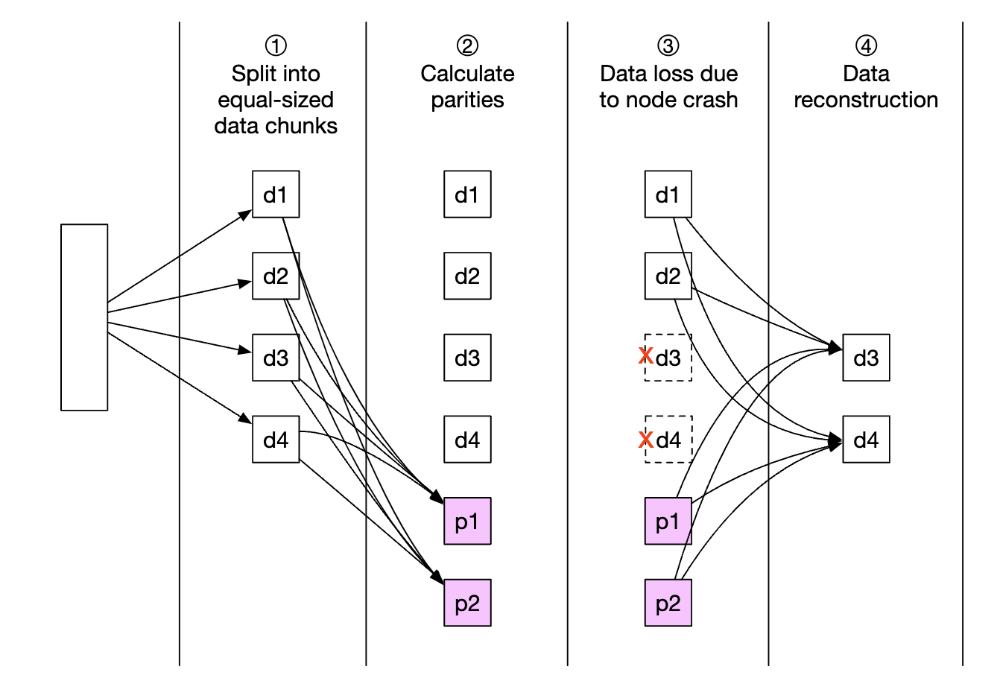
</p>

Imagine those bits are data nodes. If two of them go down, they can be recovered using the remaining four ones.

There are different erasure coding schemes. In our case, we could use 8+4 erasure coding, split across different failure domains to maximize reliability:

<p align="left">
    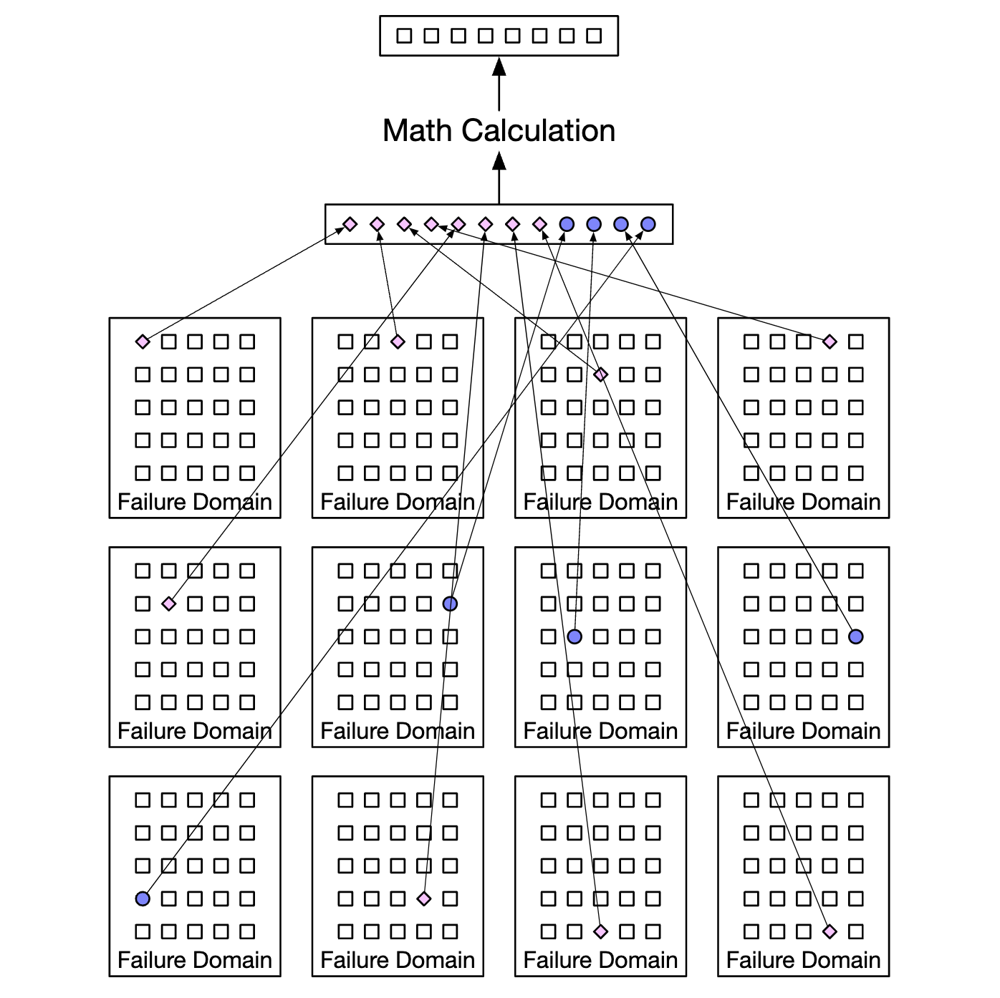
</p>

Erasure coding enables us to achieve a much lower storage cost (50% improvement) at the expense of access speed due to the data routing service having to collect data from multiple locations:

<p align="left">
    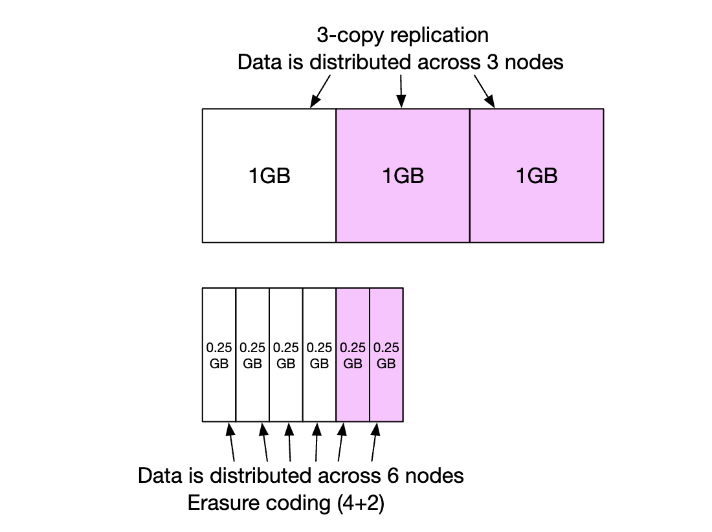
</p>

Other caveats:
- Replication requires 200% storage overhead (in case of 3 replicas) vs. 50% via erasure coding
- Erasure coding [gives us 11 nines of durability](https://github.com/Backblaze/erasure-coding-durability) vs 6 nines via replication
- Erasure coding requires more computation to calculate and store parities

In sum, replication is more useful for latency-sensitive applications, whereas erasure coding is attractive for storage cost efficiency and durability.
Erasure coding is also much harder to implement.

**Three costs of erasure coding that the comparison leaves implicit, and they are the reasons it is not used for everything:**

**Reads touch many nodes, so tail latency gets worse.** A replicated read can be served by whichever of three replicas answers first — the *minimum* of three latencies, which is a latency *improvement*. An 8+4 read must collect 8 chunks and therefore waits for the **slowest of 8** — the maximum, not the minimum. One slow disk anywhere in the group sets the response time. This single asymmetry is why hot data is replicated and cold data is erasure-coded.

**Repair amplification.** Losing one replicated chunk means copying one chunk from a peer. Losing one erasure-coded chunk means reading **8 chunks** across the network and recomputing the missing one — eight times the repair traffic for the same amount of lost data, plus CPU. During a disk or node failure this repair load competes with live traffic, and because durability depends on repairing before the next failure, slow repair is a durability problem as well as an operational one.

**Small objects do not erasure-code sensibly.** Splitting a 1 KB object into eight 128-byte chunks plus four parity chunks gives you twelve tiny network round trips and twelve index entries to manage a kilobyte. Erasure coding has a minimum sensible object size, which is one more reason small objects are packed into large files first.

Which gives a clear policy:

| Data profile | Scheme | Why |
|---|---|---|
| Small, hot, latency-sensitive | Replication | Read the fastest copy; EC overhead is absurd below a few MB |
| Large, cold, cost-dominated | **Erasure coding** | Half the storage, better durability, latency does not matter |

#### Correctness verification

If a disk fails entirely, then the failure is easy to detect. This is less straightforward in the event part of the disk memory gets corrupted.

To detect this, we can use checksums - a hash of the file contents, which can be used to verify the file's integrity.

In our case, we'll store checksums for each file and each object:

<p align="left">
    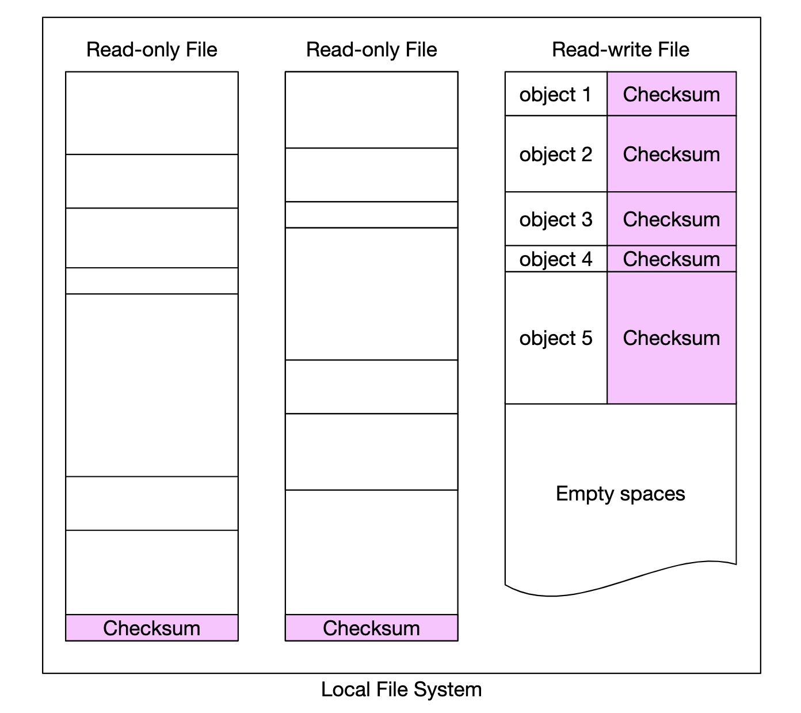
</p>

In the case of erasure coding (8+4), we'll need to fetch each of the 8 pieces of data separately and verify each of their checksums.

**Checksums are what make the durability claim meaningful, and the failure they defend against is the nasty one.** A disk that dies is obvious — it stops answering, repair begins, the system heals. A disk that silently returns *wrong bytes* — bit rot, a firmware bug, a cosmic-ray flip, a misdirected write — is invisible. Without checksums you serve corruption as though it were data, and you cheerfully replicate it over your good copies.

And detection on read is not sufficient. Cold data may not be read for years, by which time all copies could have rotted independently. The missing piece is **scrubbing**: a background process that continuously reads every object, verifies its checksum, and repairs from a good copy or from parity. Durability figures like 11 nines implicitly assume scrubbing is running — they describe a system that *finds and fixes* corruption, not one that merely stores three copies and hopes.

This is also why immutability matters again: because content never changes, a checksum computed once is valid forever, and any mismatch is unambiguously corruption rather than a stale digest.

### **Metadata data model**

Table schemas:

<p align="left">
    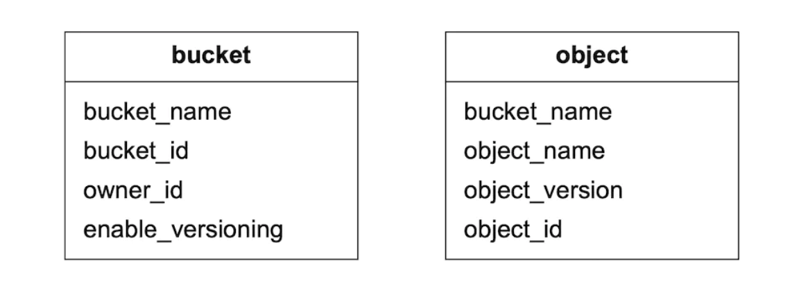
</p>

Queries we need to support:
- Find an object ID by name
- Insert/delete object based on name
- List objects in a bucket sharing the same prefix

There is usually a limit on the number of buckets a user can create, hence, the size of the buckets table is small and can fit into a single db server.
But we still need to scale the server for read throughput.

The object table will probably not fit into a single database server, though. Hence, we can scale the table via sharding:
- Sharding by bucket_id will lead to hotspot issues as a bucket can have billions of objects
- Sharding by `object_id` makes the load more evenly distributed, but our queries will be slow
- We choose sharding by `hash(bucket_name, object_name)` since most queries are based on the object/bucket name.

Even with this sharding scheme, though, listing objects in a bucket will be slow.

### **Listing objects in a bucket**

In a single database, listing an object based on its prefix (looks like a directory) works like this:

```
SELECT * FROM object WHERE bucket_id = "123" AND object_name LIKE `abc/%`
```

This is challenging to fulfill when the database is sharded. To achieve it, we can run the query on every shard and aggregate the results in-memory.
This makes pagination challenging though, since different shards contain a different result size and we need to maintain separate limit/offset for each.

We can leverage the fact that typically object stores are not optimized for listing objects, so we can sacrifice listing performance.
We can also create a denormalized table for listing objects, sharded by bucket ID.
That would make our listing query sufficiently fast as it's isolated to a single database instance.

**The underlying tension is that the namespace is flat and users insist on treating it as a hierarchy.** There are no directories in an object store; `photos/2021/june/img.jpg` is a single opaque key that merely contains slashes. "Listing a directory" is a prefix scan, and the folder structure you see in a console is an illusion reconstructed from key prefixes by splitting on `/`.

That illusion is cheap in one database and expensive once sharded, and the two requirements pull in opposite directions:

| Shard key | Point lookup (`GET object`) | Prefix listing |
|---|---|---|
| `hash(bucket_name, object_name)` | **Fast** — one shard | **Slow** — scatter-gather across every shard |
| `bucket_id` | Fast | **Fast** — one shard | 
| | | but a billion-object bucket is a hot shard |

The chosen resolution — hash-shard the authoritative table for lookups, and keep a **separate denormalised listing table sharded by bucket** — is the standard answer: maintain two differently-partitioned copies of the same facts, each optimised for one access pattern. The price is a second write per object and the usual consistency gap between the two tables, which is acceptable here precisely because listing is allowed to lag.

**And note the pagination trap**, which is the same one as [Chapter 11](../11.%20News%20Feed%20System/#reading-the-feed-end-to-end): `LIMIT`/`OFFSET` cannot work across shards, because an offset is meaningless when results come from several independently-ordered sources. Listing must paginate with a **continuation token** that encodes the last key returned — which is exactly what S3's `continuation-token` is, and why the API has no concept of "page 5".

### **Object versioning**

Versioning works by having another `object_version` column which is of type TIMEUUID, enabling us to sort records based on it.

Each new version produces a new `object_id`:

<p align="left">
    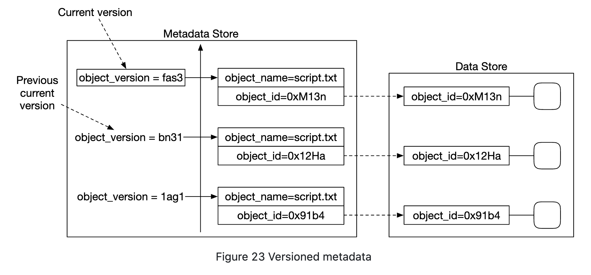
</p>

The versioning design is the clearest expression of immutability in the chapter: **a new version is a new object**, with its own `object_id` and its own bytes, and the old one is untouched. Nothing is ever overwritten; the "current" version is simply the newest row.

Deleting an object creates a new version with a special `object_id` indicating that the object was deleted. Queries for it return 404:

<p align="left">
    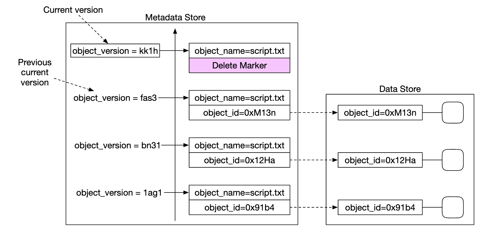
</p>

That special row is a **delete marker**, and it is the same device as the tombstone in [Chapter 6](../06.%20Key-Value%20Store/#gotchas--failure-modes): in a store where you cannot modify data, the only way to record an absence is to append a record saying so.

Two consequences worth stating, because both surprise people in production:

- **Deleting does not free space, and may consume more.** The bytes of every prior version remain, plus a new metadata row for the marker. A bucket with versioning enabled and no lifecycle policy grows monotonically no matter how much its users delete — and the bill reflects stored bytes, not visible ones.
- **"Undelete" is free, which is the point.** Removing the delete marker restores the object, which is why versioning is the standard defence against the accidental-mass-deletion failure mode from [Chapter 15](../15.%20Google%20Drive/#gotchas--failure-modes).

**Lifecycle policies** are therefore not optional at scale: expire non-current versions after N days, abort incomplete multipart uploads after N days, and transition cold objects to cheaper tiers. Without them, versioning is a slow storage leak with a legitimate-looking cause.
### **Optimizing uploads of large files**

Uploading large files can be optimized by using multipart uploads - splitting a big file into several chunks, uploaded independently:

<p align="left">
    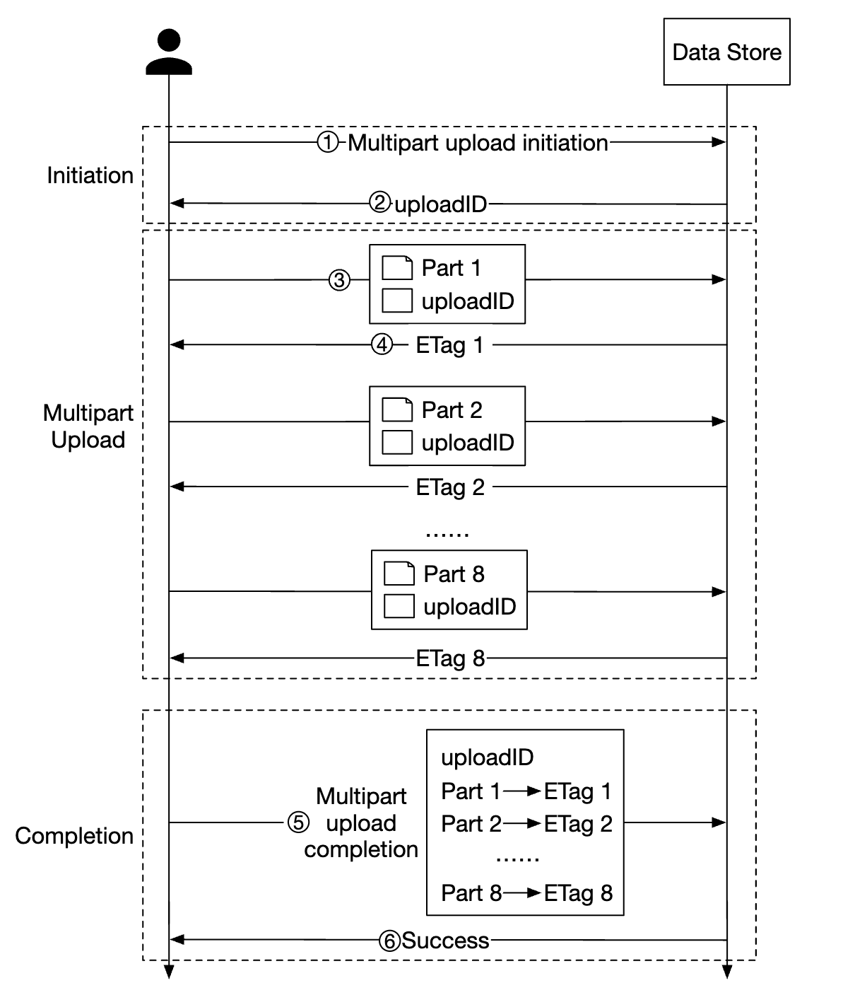
</p>

- Client calls service to initiate a multipart upload
- Data store returns an upload ID which uniquely identifies the upload
- Client splits the large file into several chunks, uploaded independently using the upload id
- When a chunk is uploaded, the data store returns an etag, which is a md5 checksum, identifying that upload chunk
- After all parts are uploaded, client sends a complete multipart upload request, which includes upload_id, part numbers and all etags
- Data store reassembles the object from its parts. The process can take a few minutes. After that, success response is returned to the client.

Old parts, which are no longer useful can be removed at this point. We can introduce a garbage collector to deal with it.

**Multipart upload buys four things**, all of which matter for an object that may be hundreds of gigabytes: parts upload in **parallel**, a failed part is retried **alone** rather than restarting the whole transfer, the client can **pause and resume**, and the object's total size need not be known in advance. It is the same mechanism as the chunked uploads in [Chapter 14](../14.%20Youtube/#speed-optimizations) and [Chapter 15](../15.%20Google%20Drive/), for the same reasons.

**The ETag stops being an MD5, and this trips people up.** For a single-part upload the ETag is the MD5 of the object, so clients can verify integrity by comparing hashes. For a multipart upload it is a **hash of the concatenated part hashes, suffixed with the part count** (`"a1b2…-12"`). It is still a valid integrity check, but it is no longer the MD5 of the object's bytes, so a client that recomputes MD5 locally and compares will see a mismatch on every large file — and the value depends on the part size chosen, so the same object uploaded with different part sizes gets different ETags.

**And incomplete uploads cost money silently.** A client that initiates a multipart upload, sends 90 parts and then disappears leaves those parts stored and billed, invisible in any object listing because the object was never completed. This is the single most common source of unexplained object-storage spend, and the fix is a lifecycle rule that aborts incomplete uploads after a few days.

### **Garbage collection**

Garbage collection is the process of reclaiming storage space, which is no longer used. There are a few ways data becomes garbage:
- **lazy object deletion** - object is marked as deleted without actually getting deleted
- **orphan data** - eg an upload failed mid-flight and old parts need to be deleted
- **corrupted data** - data which failed checksum verification

The garbage collector is also responsible for reclaiming unused space in replicas.
With replication, data is deleted from both primaries and replicas. With erasure coding (8+4), data is deleted from all 12 nodes.

To facilitate the deletion, we'll use a process called compaction:
- Garbage collector copies objects which are not deleted from "data/b" to "data/d"
- `object_mapping` table is updated once copying is complete using a database transaction
- To avoid making too many small files, compaction is done on files which grow beyond a certain threshold

<p align="left">
    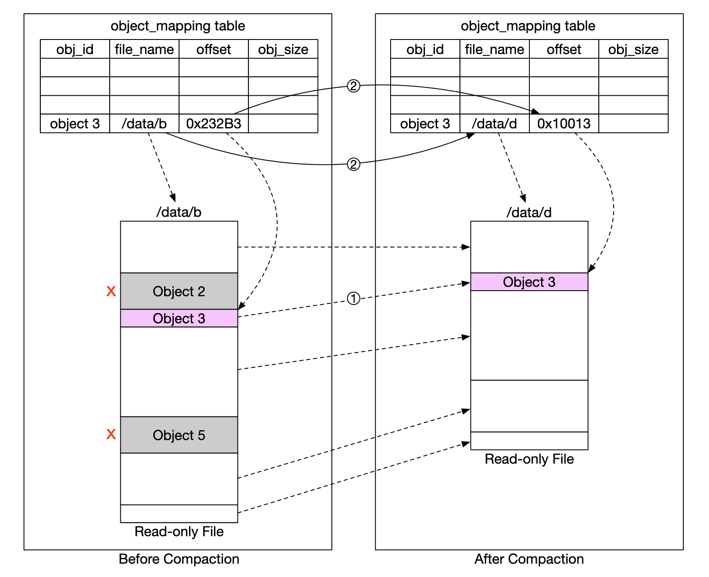
</p>

---

## Step 4: Wrap Up

Things we covered:
- Designing an S3-like object storage
- Comparing differences between object, block and file storages
- Covered uploading, downloading, listing, versioning of objects in a bucket
- Deep dived in the design - data store and metadata store, replication and erasure coding, multipart uploads, sharding

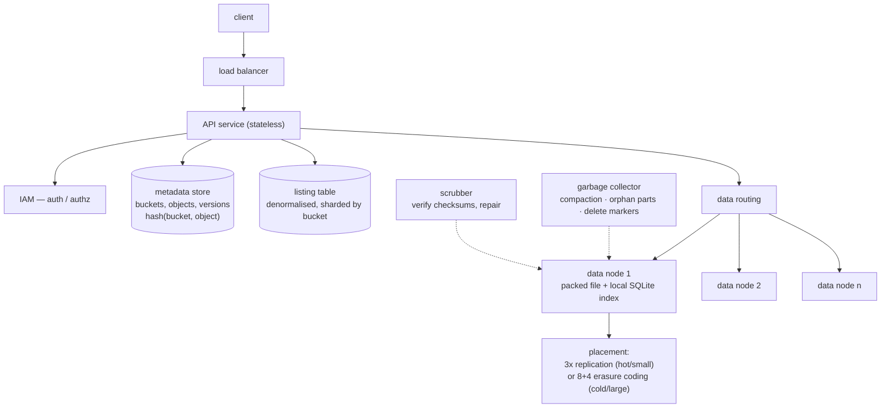
```mermaid
flowchart TD
    C["client"] --> LB["load balancer"]
    LB --> API["API service (stateless)"]
    API --> IAM["IAM — auth / authz"]
    API --> MD[("metadata store<br/>buckets, objects, versions<br/>hash(bucket, object)")]
    API --> LST[("listing table<br/>denormalised, sharded by bucket")]
    API --> DR["data routing"]
    DR --> DN1["data node 1<br/>packed file + local SQLite index"]
    DR --> DN2["data node 2"]
    DR --> DN3["data node n"]
    DN1 --> EC["placement:<br/>3x replication (hot/small)<br/>or 8+4 erasure coding (cold/large)"]
    GC["garbage collector<br/>compaction · orphan parts · delete markers"] -.-> DN1
    SC["scrubber<br/>verify checksums, repair"] -.-> DN1
```

**The two dotted boxes are the ones people forget to draw**, and the design does not meet its durability target without either of them. The scrubber is what turns "three copies exist" into "three *correct* copies exist", and the garbage collector is what keeps an immutable store from growing without bound. Both are background processes competing with live traffic for the same disks, which makes their scheduling a real design concern rather than an implementation detail.

---

### Gotchas & failure modes

- **Erasure-coded reads are as slow as their slowest chunk.** Replication reads the fastest of N copies; 8+4 waits for the slowest of 8. Use replication for anything latency-sensitive and EC for cold bulk.
- **Repairing an erasure-coded chunk reads 8× the lost data.** Repair traffic competes with live reads, and since durability is a race between failure and repair, slow repair lowers durability.
- **Small objects must not be erasure-coded.** Twelve chunks to store a kilobyte is all overhead. Pack first, then code.
- **Replicas in one failure domain are one replica.** The `0.0081³` durability calculation is only valid under independence; rack, power and network isolation is what makes it true.
- **Silent corruption is the dangerous failure.** A dead disk announces itself; a disk returning wrong bytes does not. Per-object checksums plus a **background scrubber** are required, otherwise cold data rots undetected and all copies may degrade before anyone reads it.
- **Delete does not free space.** With versioning, deleting appends a marker and retains every prior version. Without lifecycle policies, a bucket grows forever while appearing to shrink.
- **Incomplete multipart uploads are billed and invisible.** Parts of an abandoned upload do not appear in any object listing but do appear on the invoice. Expire them with a lifecycle rule.
- **A multipart ETag is not the object's MD5.** It is a hash of part hashes with a part-count suffix, and it varies with part size. Clients verifying integrity by local MD5 will see spurious mismatches.
- **Listing is the operation object storage is worst at.** A flat namespace sharded by `hash(bucket, object)` makes a prefix scan a scatter-gather across every shard. Hence a second, differently-sharded listing table — and the consistency gap that comes with it.
- **`LIMIT`/`OFFSET` cannot paginate across shards.** Offsets are meaningless over several independently-ordered sources. Use a continuation token encoding the last key returned.
- **A single bucket with a billion objects is a hot shard** in the listing table, which is sharded by bucket precisely to make listing fast. The two goals conflict and one of them has to give.
- **Sequential key prefixes create hot partitions.** If the metadata store partitions by key range, keys beginning with a timestamp send every new write to one partition — the time-ordered-ID problem from [Chapter 7](../07.%20Unique-Id%20Generator/#gotchas--failure-modes). Put high-entropy characters early in the key, or hash-partition.
- **Bucket names are a global namespace**, which means a coordination point: uniqueness must be checked against every bucket that has ever existed, and the name becomes squattable and non-reusable.
- **Metadata must be committed after the data is durable.** Commit first and you publish an object whose bytes are not safely stored — the same ordering requirement as [Chapter 15](../15.%20Google%20Drive/#file-upload-flow). This ordering is also why strong read-after-write consistency was historically hard for object stores; S3 only became strongly consistent in late 2020.
- **Garbage collection races with readers.** Compaction copies live objects to a new file and repoints the mapping table; a read in flight against the old file must still succeed. The mapping update has to be transactional and the old file retained until no reader can be using it.
- **Immutability means no append and no partial update.** Changing one byte of a 1 TB object means rewriting the whole object. Applications that need in-place mutation want block storage, not this.
- **Packing objects into shared files serialises writes to that file.** The chapter's fix — pinning files to specific cores — matters because the lock contention otherwise negates the benefit of packing.

---

## The design, as problem and technique

| Goal / problem | Technique |
|---|---|
| 0.68 billion objects on a filesystem | Pack many objects into large append-only files; never one file per object |
| Finding an object inside a packed file | `object_id → (file, offset, size)` mapping — an inode, one level up |
| The mapping lookup not becoming a bottleneck | Keep the index local to the data node (SQLite), partitioned by construction |
| Metadata needing queries, data needing petabytes | Separate metadata store from data store; scale independently |
| 6 nines durability | 3× replication across isolated failure domains, plus fast repair |
| 200% storage overhead | 8+4 erasure coding — 50% overhead, survives any 4 losses |
| Latency-sensitive data under EC | Keep hot and small objects replicated; erasure-code cold bulk |
| Silent data corruption | Per-object and per-file checksums, plus a background scrubber that repairs |
| Point lookups by name | Metadata sharded by `hash(bucket_name, object_name)` |
| Prefix listing on a flat namespace | Denormalised listing table sharded by bucket |
| Paginating a sharded listing | Continuation token on the last key, never offset |
| Multi-hundred-gigabyte uploads | Multipart upload: parallel, retryable, resumable parts |
| Mutating an immutable store | Versioning — a new version is a new object; deletion is a delete marker |
| Unbounded growth from versions and orphans | Lifecycle policies plus a garbage collector |
| Reclaiming space inside packed files | Compaction: copy live objects to a new file, repoint the mapping transactionally |
| Objects never visible without their bytes | Commit metadata only after the data is durable |

## Self-check
1. Which two properties generate the rest of this design, and what does each make possible?
2. Why is one-file-per-object not merely inefficient but unworkable at 0.68 billion objects?
3. Metadata is 0.68 TB against 100 PB of data. What does that ratio justify?
4. Why is the object mapping table deployed on the data node rather than in a shared cluster? Give two reasons.
5. Derive 6 nines of durability from a 0.81% annual failure rate. What two conditions does that calculation silently assume?
6. For 100 PB of logical data, how much raw storage does 3× replication need, and how much does 8+4 erasure coding need?
7. Name three costs of erasure coding, and say which one determines that hot data stays replicated.
8. A disk starts returning wrong bytes instead of failing. What detects it, and why is detection-on-read not enough?
9. Why does deleting objects in a versioned bucket sometimes increase storage?
10. A client uploads 90 of 100 parts and vanishes. What happens to the data, the listing, and the bill?
11. Why doesn't a multipart ETag match a locally computed MD5?
12. Why is listing the operation object storage is worst at, and what are the two sharding options?
13. Why can't a sharded listing API offer "page 5"?
14. Object keys begin with a timestamp. What goes wrong, and which earlier chapter is this the same problem as?
15. Why must metadata be committed after the data, and what consistency property does that ordering complicate?

## Glossary

| Term | Meaning |
|---|---|
| **Block / file / object storage** | Raw devices; a filesystem over them; a flat HTTP key-value store of immutable blobs |
| **Bucket / object / key** | Globally-named container; an immutable blob; the object's full name within the bucket |
| **Object immutability** | Content never changes; a modification is a new object with a new ID |
| **Metadata/data split** | Small queryable metadata in a database, large content in the data store |
| **Object mapping table** | `object_id → (filename, offset, size)` — the index into a packed file |
| **Packed file / WAL** | Large append-only file holding many objects, avoiding per-object files and inodes |
| **Failure domain** | A rack, power circuit, network or data centre whose failure correlates its members |
| **Annual failure rate (AFR)** | Probability a disk fails in a year; the input to durability maths |
| **Erasure coding (n+m)** | `n` data plus `m` parity chunks; any `n` reconstruct the object |
| **Reed-Solomon** | The coding scheme normally used for the parity computation |
| **Repair amplification** | Reading `n` chunks to rebuild one — erasure coding's hidden repair cost |
| **Scrubbing** | Background verification of checksums with repair, which catches bit rot |
| **Delete marker / tombstone** | An appended record representing an absence, since data cannot be modified |
| **Lifecycle policy** | Rules expiring old versions, aborting stale uploads and tiering cold data |
| **Multipart upload / ETag** | Parallel resumable part uploads; the identifier that is a hash-of-hashes for them |
| **Continuation token** | Cursor-based pagination for listings, replacing offsets |
| **Compaction** | Copying live objects into a new file to reclaim space from deleted ones |

## Where to go next
- [Chapter 15 – Design Google Drive](../15.%20Google%20Drive/) — the layer above: content-addressed blocks, delta sync, and the same metadata-commit ordering.
- [Chapter 14 – Design YouTube](../14.%20Youtube/) — object storage as the backing store, plus the CDN tiering that sits in front of it.
- [Chapter 6 – Design A Key-Value Store](../06.%20Key-Value%20Store/#gotchas--failure-modes) — tombstones, compaction and the cost of deletion in an append-only world.
- [Chapter 7 – Design A Unique ID Generator](../07.%20Unique-Id%20Generator/#gotchas--failure-modes) — why timestamp-prefixed keys create a hot partition.
- [Chapter 18 – Design Google Maps](../18.%20Google%20Maps/) — 70 PB of tiles, which is what a real customer of this system looks like.
