# Chapter 25: Real-time Gaming Leaderboard

## Introduction

We are going to design a **leaderboard** for an online mobile game:

**The one-sentence version:** this chapter is about **one operation that databases do not provide cheaply — rank.** Storing scores is trivial, and so is finding the top 10 with an index. But answering *"what position is this particular user in?"* means counting everyone ahead of them, which is `O(N)` and gets slower the further down the leaderboard you look. A sorted set answers it in `O(log N)`, and that single capability is the reason the chapter exists.

Two framing points worth carrying through:

- **Redis here is the system of record, not a cache.** There is no slower, more authoritative store behind it that could repopulate the leaderboard. That changes the requirements completely — persistence, replication and failover all become correctness concerns rather than performance ones.
- **The data is bounded and disposable.** A new tournament starts each month, so a leaderboard has a known maximum size and a natural expiry. This is what makes a single in-memory instance a credible answer rather than a liability.

<p align="left">
    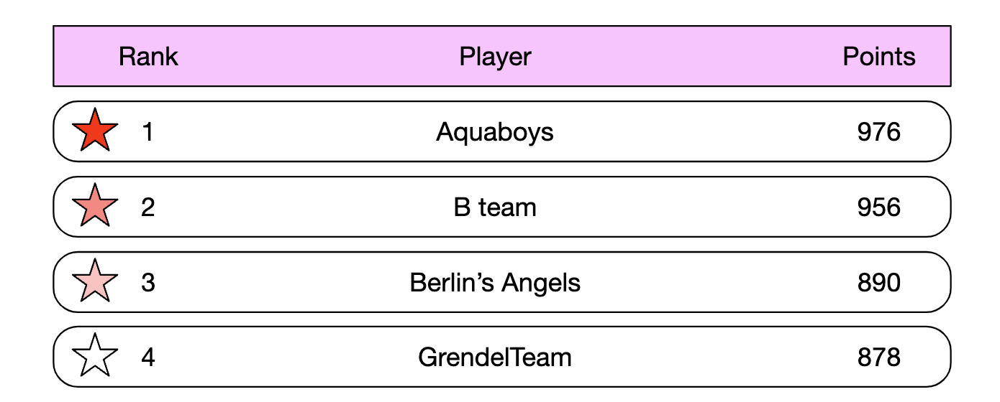
</p>

---

## Step 1: Understand the Problem and Establish Design Scope

- C: How is the score calculated for the leaderboard?
- I: User gets a point whenever they win a match.
- C: Are all players included in the leaderboard?
- I: Yes
- C: Is there a time segment, associated with the leaderboard?
- I: Each month, a new tournament starts which starts a new leaderboard.
- C: Can we assume we only care about top 10 users?
- I: We want to display top 10 users, along with position of specific user. If time permits, we can discuss showing users around particular user in the leaderboard.
- C: How many users are in a tournament?
- I: 5mil DAU and 25mil MAU
- C: How many matches are played on average during a tournament?
- I: Each player plays 10 matches per day on average
- C: How do we determine the rank if two players have the same score?
- I: Their rank is the same in that case. If time permits, we can discuss breaking ties.
- C: Does the leaderboard need to be real-time?
- I: Yes, we want to present real-time results or as close as possible to real-time. It is not okay to present batched result history.

### **Functional requirements**

- Display top 10 players on leaderboard
- Show a user's specific rank
- Display users which are four places above and below given user (bonus)

### **Non-functional requirements**

- Real-time updates on scores
- Score update is reflected on the leaderboard in real-time
- General scalability, availability, reliability

### **Back-of-the-envelope estimation**

With 5mil DAU, if the game has an even distribution of players during a 24h period, we'd have an average of 50 users per second.
However, since distribution is typically uneven, we can estimate that the peak online users would be 250 users per second.

QPS for users scoring a point - given 10 games per day on average, 50 users/s * 10 = 500 QPS. Peak QPS = 2500.

QPS for fetching the top 10 leaderboard - assuming users open that once a day on average, QPS is 50.

### This is a small system, and saying so is the point

| Quantity | Derivation | Result |
|---|---|---|
| Score updates | 58 users/sec × 10 matches | **~500 QPS** (peak ~2,500) |
| Leaderboard reads | 5 M / 86,400 | **~50 QPS** |
| Players in a tournament | 25 M MAU | 25 million entries |
| Memory | 25 M × ~130 bytes of sorted-set entry | **~3.25 GB — one Redis instance** |

Five hundred writes per second and fifty reads per second is, by the standards of these notes, nothing. There is no throughput problem, no storage problem, and no sharding problem at the stated scale — the chapter is explicit that one Redis instance suffices.

**So the difficulty is entirely about the shape of the query, not its volume.** That is unusual and worth naming: most chapters are hard because of scale, and this one is hard because `rank` is an awkward operation no matter how little data you have. A candidate who spends the interview sharding has mis-identified the problem.

The scaling discussion only becomes real at the hypothetical 10× growth the chapter introduces later — 500 M DAU, 65 GB, 250 K QPS — and it is worth treating that as a separate, clearly-labelled extension rather than the baseline design.

> **Interview angle:** compute the QPS, state that one instance handles it, and then pivot to "the interesting problem is answering `rank` for a user in the middle of the leaderboard". That reframing is what the question is testing.

## Step 2: Propose High-Level Design and Get Buy-In

### **API Design**

The first API we need is one to update a user's score:

```
POST /v1/scores
```

This API takes two params - `user_id` and `points` scored for winning a game.

This API should only be accessible to game servers, not end clients.

Next one is for getting the top 10 players of the leaderboard:

```
GET /v1/scores
```

Example response:

```
{
  "data": [
    {
      "user_id": "user_id1",
      "user_name": "alice",
      "rank": 1,
      "score": 12543
    },
    {
      "user_id": "user_id2",
      "user_name": "bob",
      "rank": 2,
      "score": 11500
    }
  ],
  ...
  "total": 10
}
```

You can also get the score of a particular user:

```
GET /v1/scores/{:user_id}
```

Example response:

```
{
    "user_info": {
        "user_id": "user5",
        "score": 1000,
        "rank": 6,
    }
}
```

### **High-level architecture**

<p align="left">
    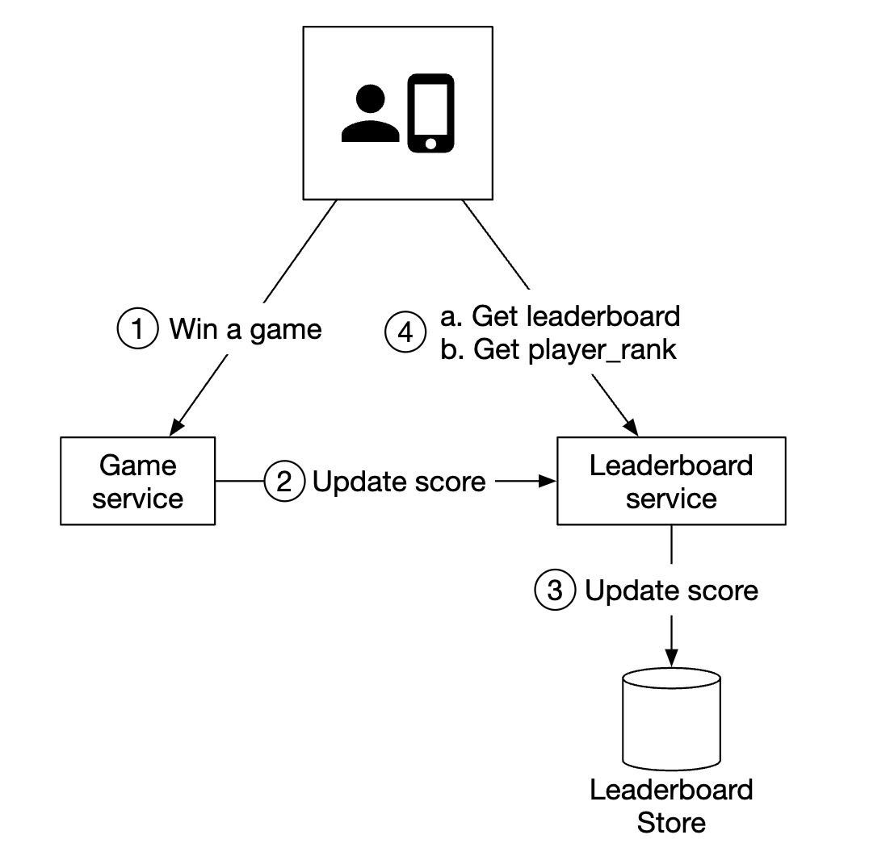
</p>

- When a player wins a game, client sends a request to the game service
- Game service validates if win is valid and calls the leaderboard service to update the player's score
- Leaderboard service updates the user's score in the leaderboard store
- Player makes a call to leaderboard service to fetch leaderboard data, eg top 10 players and given player's rank

An alternative design which was considered is the client updating their score directly within the leaderboard service:

<p align="left">
    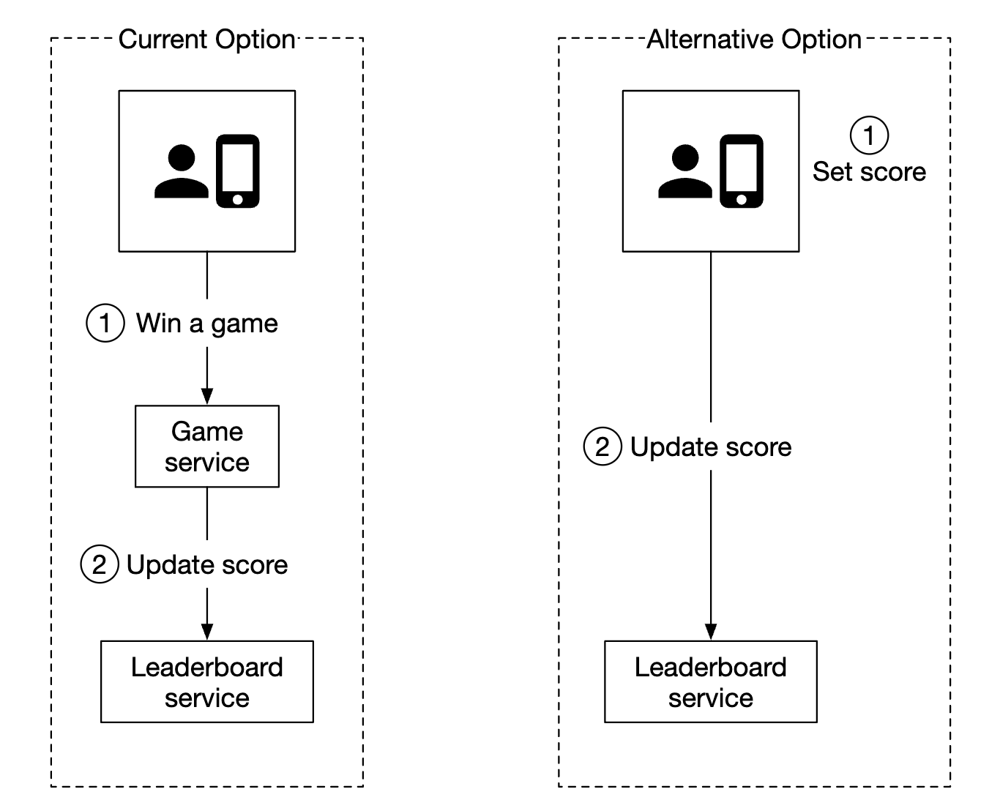
</p>

This option is not secure as it's susceptible to man-in-the-middle attacks. Players can put a proxy and change their score as they please.

One additional caveat is that for games, where the game logic is managed by the server, cliets don't need to call the server explicitly to record their win.
Servers do it automatically for them based on the game logic.

One additional consideration is whether we should put a message queue between the game server and the leaderboard service. This would be useful if other services are interested in game results, but that is not an explicit requirement in the interview so far, hence it's not included in the design:

<p align="left">
    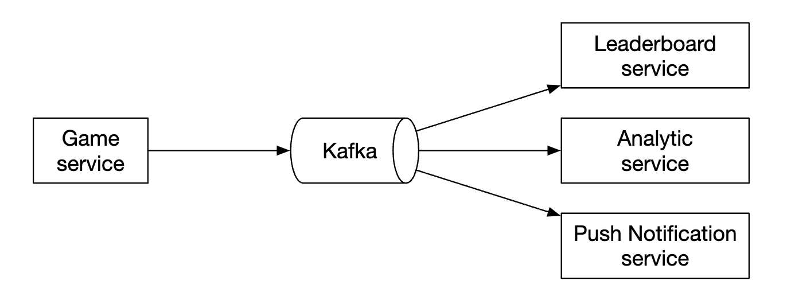
</p>

### **Data models**

Let's discuss the options we have for storing leaderboard data - relational DBs, Redis, NoSQL.

The NoSQL solution is discussed in the deep dive section.

#### Relational database solution

If the scale doesn't matter and we don't have that many users, a relational DB serves us quite well.

We can start from a simple leaderboard table, one for each month (personal note - this doesn't make sense. You can just add a `month` column and avoid the headache of maintaining new tables each month):

<p align="left">
    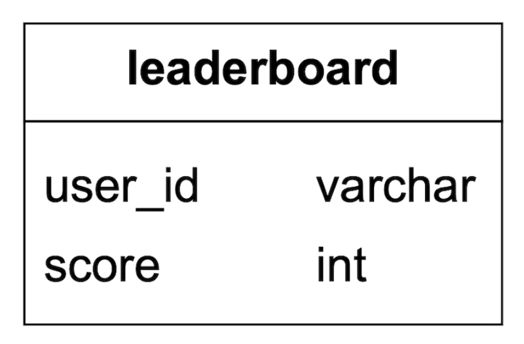
</p>

There is additional data to include in there, but that is irrelevant to the queries we'd run, so it's omitted.

What happens when a user wins a point?

<p align="left">
    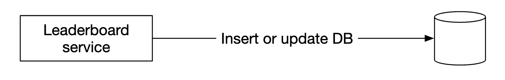
</p>

If a user doesn't exist in the table yet, we need to insert them first:

```
INSERT INTO leaderboard (user_id, score) VALUES ('mary1934', 1);
```

On subsequent calls, we'd just update their score:

```
UPDATE leaderboard set score=score + 1 where user_id='mary1934';
```

How do we find the top players of a leaderboard?

<p align="left">
    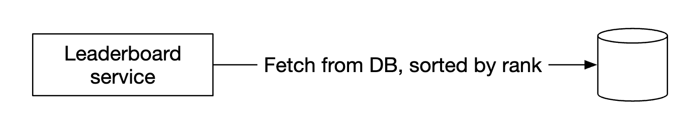
</p>

We can run the following query:

```
SELECT (@rownum := @rownum + 1) AS rank, user_id, score
FROM leaderboard
ORDER BY score DESC;
```

This is not performant though as it makes a table scan to order all records in the database table.

We can optimize it by adding an index on `score` and using the `LIMIT` operation to avoid scanning everything:

```
SELECT (@rownum := @rownum + 1) AS rank, user_id, score
FROM leaderboard
ORDER BY score DESC
LIMIT 10;
```

This approach, however, doesn't scale well if the user is not at the top of the leaderboard and you'd want to locate their rank.

**This is the crux of the chapter, and it deserves to be made concrete.** The top-10 query is fine — an index on `score` plus `LIMIT 10` reads ten index entries. But finding one user's rank is a different query:

```sql
SELECT COUNT(*) FROM leaderboard WHERE score > (
  SELECT score FROM leaderboard WHERE user_id = 'mary1934'
);
```

That counts **every player ahead of them**. For a user in 20-millionth place it visits 20 million index entries, and the cost grows the *worse* a player is doing — so the query is slowest for the overwhelming majority of users, who are the ones most likely to want to know their rank.

| Query | Relational cost | Why |
|---|---|---|
| Top 10 | **Cheap** | Index scan, stop after 10 |
| Rank of a top player | Cheap | Few rows ahead of them |
| **Rank of an average player** | **O(N)** | Count everyone above |
| Four players above and below a given user | **O(N)** | Must know their rank first |

Window functions (`RANK() OVER (ORDER BY score DESC)`) do not rescue this — they still have to order and number the whole set before filtering to one row. The problem is not SQL's syntax; it is that **a B-tree index gives you ordering but not position**, because a tree node does not know how many entries precede it. (Databases *could* support this with order-statistic trees that store subtree counts; mainstream ones do not.)

So the requirement "show a user's specific rank" is the one that eliminates the relational solution, and it does so regardless of scale.

#### Redis solution

We want to find a solution, which works well even for millions of players without having to fallback on complex database queries.

Redis is an in-memory data store, which is fast as it works in-memory and has a suitable data structure to serve our needs - sorted set.

A sorted set is a data structure similar to sets in programming languages, which allows you to keep a data structure sorted by a given criteria.
Internally, it is implemented using a hash-map to maintain mapping between key (user_id) and value (score) and a skip list which maps scores to users in sorted order:

<p align="left">
    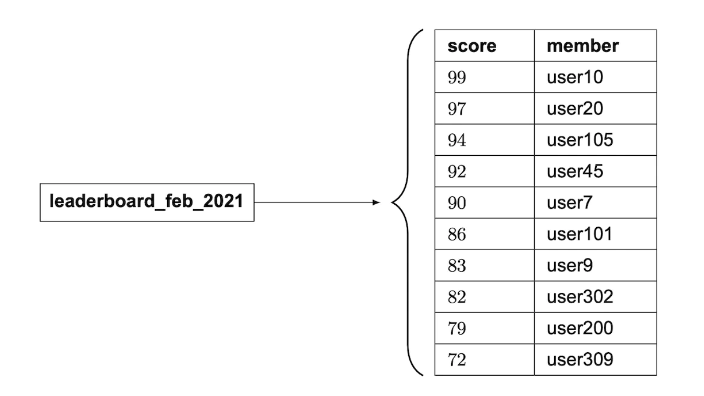
</p>

How does a skip list work?
- It is a linked list which allows for fast search
- It consists of a sorted linked list and multi-level indexes

<p align="left">
    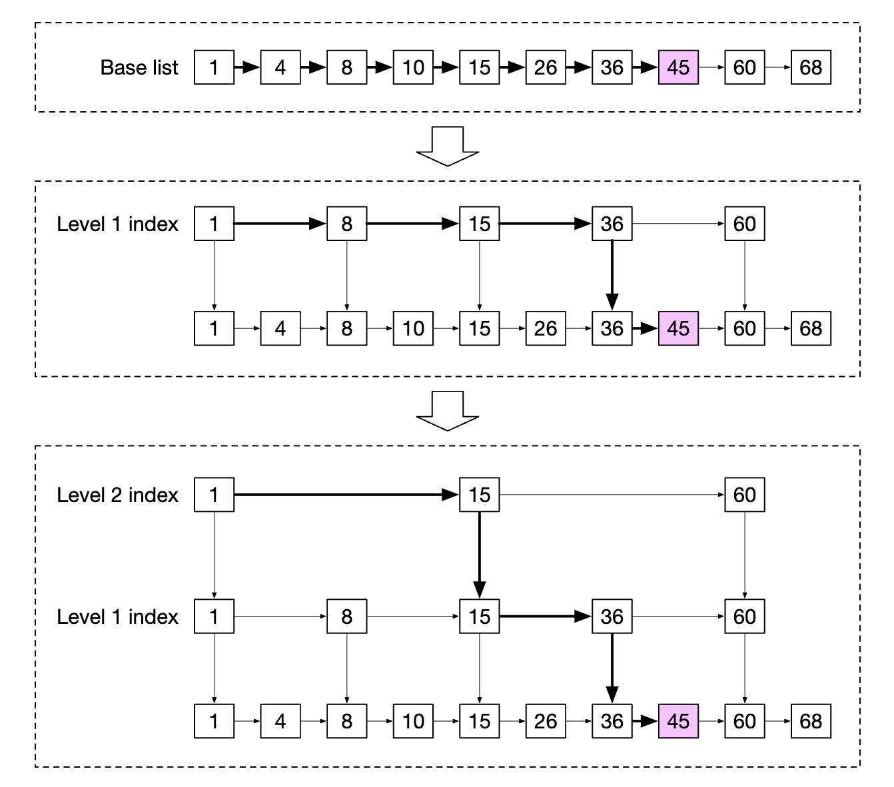
</p>

This structure enables us to quickly search for specific values when the data set is large enough.
In the example below (64 nodes), it requires traversing 62 nodes in a base linked list to find the given value and 11 nodes in the skip-list case:

**Why a skip list rather than a balanced tree.** Both give `O(log N)` search; the skip list is chosen because it is dramatically simpler to implement correctly (no rotations or rebalancing — levels are assigned by coin flip, so balance is probabilistic), it supports ordered range scans naturally by walking the bottom list, and it is friendlier to concurrent access since an insert touches only a few forward pointers. It is a case where a probabilistic structure wins on engineering grounds rather than asymptotics.

**And here is why this specific structure solves the chapter's problem**, which the diagram does not make obvious. Redis's sorted set maintains, alongside each skip-list node, a **span** — the number of bottom-level nodes each forward pointer skips. Walking down from the top while summing those spans yields the number of elements passed, which *is* the rank. That is the order-statistic capability a B-tree index lacks, and it is the entire reason `ZREVRANK` is `O(log N)` instead of `O(N)`.

**Every requirement in this chapter maps to exactly one command:**

| Requirement | Command | Complexity |
|---|---|---|
| Player wins a match | `ZINCRBY leaderboard 1 user_id` | `O(log N)` |
| Top 10 players | `ZREVRANGE leaderboard 0 9 WITHSCORES` | `O(log N + 10)` |
| **A user's rank** | `ZREVRANK leaderboard user_id` | **`O(log N)`** |
| Four above and below a user | `ZREVRANK`, then `ZREVRANGE rank-4 rank+4` | `O(log N + 9)` |
| Number of players | `ZCARD leaderboard` | `O(1)` |

The relational design needed a table scan for two of those five. That is the whole argument, and it is worth being able to state it in this form.

**Ties, which the chapter defers.** Redis orders equal scores **lexicographically by member**, so two players on the same score are ranked by their user ID — deterministic, but arbitrary and unfair (it systematically favours whoever's name sorts first). If ties should go to whoever reached the score first, the usual trick is to pack a timestamp into the score itself:

```
composite = points × 2^k − timestamp     # earlier timestamp ⇒ higher composite
```

This works, with a caveat worth knowing: sorted-set scores are IEEE-754 doubles with a **53-bit mantissa**, so the points and the timestamp together must fit in 53 bits of precision or the low-order bits — the tiebreak — are silently rounded away.

<p align="left">
    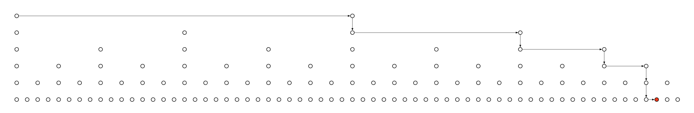
</p>

Sorted sets are more performant than relational databases as the data is kept sorted at all times at the price of O(logN) add and find operation.

In contract, here's an example nested query we need to run to find the rank of a given user in a relational DB:

```
SELECT *,(SELECT COUNT(*) FROM leaderboard lb2
WHERE lb2.score >= lb1.score) RANK
FROM leaderboard lb1
WHERE lb1.user_id = {:user_id};
```

What operations do we need to operate our leaderboard in Redis?
- **ZADD** - insert the user into the set if they don't exist. Otherwise, update the score. O(logN) time complexity.
- **ZINCRBY** - increment the score of a user by given amount. If user doesn't exist, score starts at zero. O(logN) time complexity.
- **ZRANGE/ZREVRANGE** - fetch a range of users, sorted by their score. We can specify order (ASC/DESC), offset and result size. O(logN+M) time complexity where M is result size.
- **ZRANK/ZREVRANK** - Fetch the position (rank) of given user in ASC/DESC order. O(logN) time complexity.

What happens when a user scores a point?

```
ZINCRBY leaderboard_feb_2021 1 'mary1934'
```

There's a new leaderboard created every month while old ones are moved to historical storage.

What happens when a user fetches top 10 players?

```
ZREVRANGE leaderboard_feb_2021 0 9 WITHSCORES
```

Example result:

```
[(user2,score2),(user1,score1),(user5,score5)...]
```

What about user fetching their leaderboard position?

<p align="left">
    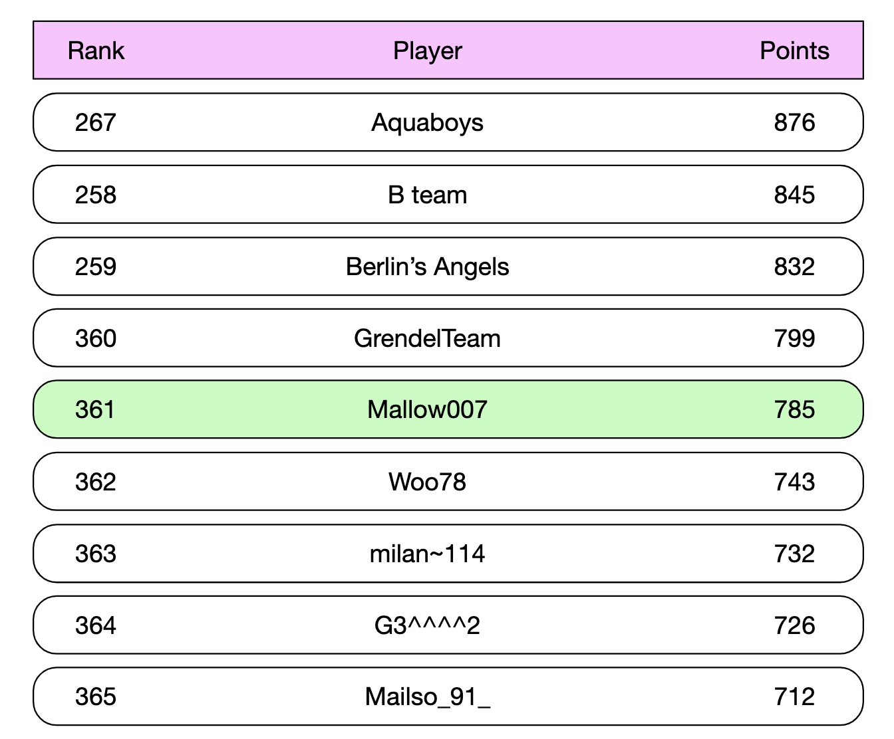
</p>

This can be easily achieved by the following query, given that we know a user's leaderboard position:

```
ZREVRANGE leaderboard_feb_2021 357 365
```

A user's position can be fetched using `ZREVRANK <user-id>`.

Let's explore what our storage requirements are:
- Assuming worst-case scenario of all 25mil MAU participating in the game for a given month
- ID is 24-character string and score is 16-bit integer, we need 26 bytes * 25mil = ~650MB of storage
- Even if we double the storage cost due to the overhead of the skip list, this would still easily fit in a modern redis cluster

Another non-functional requirement to consider is supporting 2500 updates per second. This is well within a single Redis server's capabilities.

Additional caveats:
- We can spin up a Redis replica to avoid losing data when a redis server crashes
- We can still leverage Redis persistence to not lose data in the event of a crash
- We'll need two supporting tables in MySQL to fetch user details such as username, display name, etc as well as store when eg a user won a game
- The second table in MySQL can be used to reconstruct leaderboard when there is an infrastructure failure
- As a small performance optimization, we could cache the user details of top 10 players as they'd be frequently accessed

---

## Step 3: Design Deep Dive

### **To use a cloud provider or not**

We can either choose to deploy and manage our own services or use a cloud provider to manage them for us.

If we choose to manage the services ourselves, we'll use redis for leaderboard data, mysql for user profile and potentially a cache for user profile if we want to scale the database:

<p align="left">
    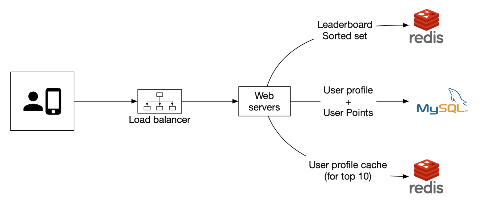
</p>

Alternatively, we could use cloud offerings to manage a lot of the services for us. For example, we can use AWS API Gateway to route API calls to AWS Lambda functions:

<p align="left">
    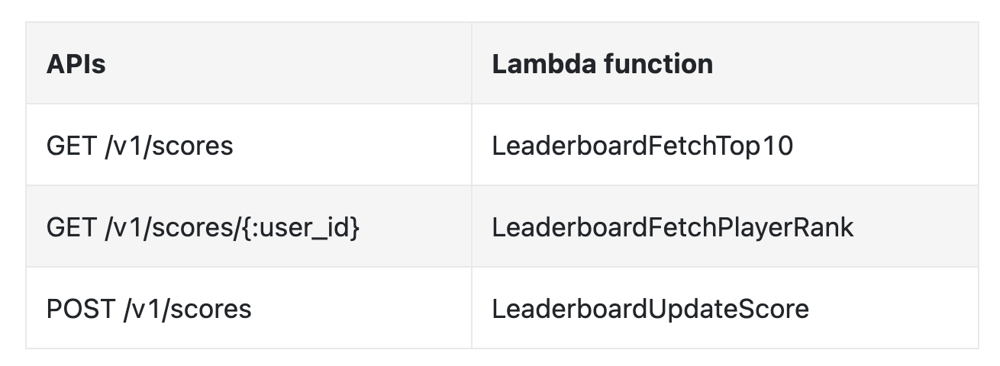
</p>

AWS Lambda enables us to run code without managing or provisioning servers ourselves. It runs only when needed and scales automatically.

Example of a user scoring a point:

<p align="left">
    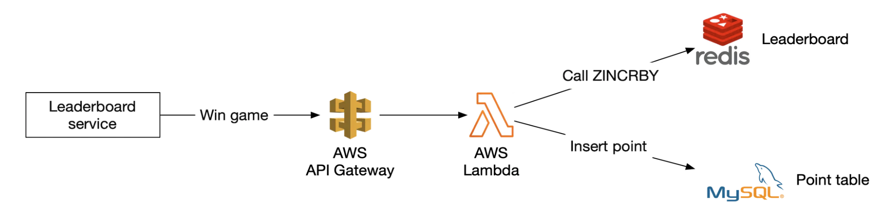
</p>

Example user retrieving leaderboard:

<p align="left">
    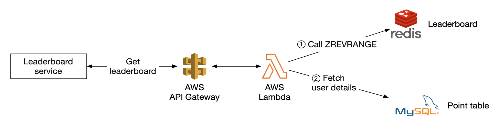
</p>

Lambdas are an implementation of a serverless architecture. We don't need to manage scaling and environment setup.

Author recommends going with this approach if we build the game from the ground up.

### **Scaling Redis**

With 5mil DAU, we can get away with a single Redis instance from both a storage and QPS perspective.

However, if we imagine userbase grows 10x to 500mil DAU, then we'd need 65gb for storage and QPS goes to 250k.

Such scale would require sharding.

One way to achieve it is by range-partitioning the data:

<p align="left">
    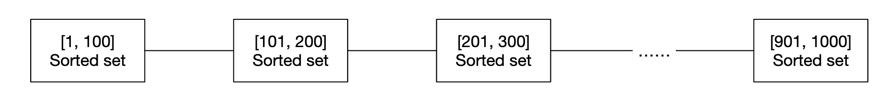
</p>

**Before sharding, note what a leaderboard *is* in Redis terms: a single key.** The whole sorted set lives under one key, and Redis Cluster shards *by key* — so Redis Cluster cannot split one leaderboard across nodes at all. "Sharding the leaderboard" necessarily means **deciding to store it as several separate sorted sets** and reassembling answers in the application. That is why both options below are application-level schemes rather than a configuration change, and it is the detail that makes this section harder than it looks.

In this example, we'll shard based on user's score. We'll maintain the mapping between user_id and shard in application code.
We can do that either via MySQL or another cache for the mapping itself.

**Two problems with range-partitioning by score that the chapter does not raise**, and both are structural:

- **Scores change, so users migrate between shards.** Range partitioning normally assumes the partition key is stable; here the key is the thing being updated. Every score increment risks crossing a boundary, which means a remove-from-one-shard plus add-to-another, plus an update to the `user_id → shard` mapping — three operations, non-atomic, on what should be a single `ZINCRBY`. A crash in the middle duplicates or loses the player.
- **The score distribution is extremely skewed.** Almost everyone has a low score and very few have high ones, so equal-width ranges like `[0–100]` and `[900–1000]` hold wildly different populations. The lowest bucket holds most of the user base and becomes the hot shard — and it is also where new players start, so it absorbs most of the write traffic too.

To fetch the top 10 players, we'd query the shard with the highest scores (`[900-1000]`).

To fetch a user's rank, we'll need to calculate the rank within the user's shard and add up all users with higher scores in other shards.
The latter is a O(1) operation as total records per shard can quickly be accessed via the info keyspace command.

Alternatively, we can use hash partitioning via Redis Cluster. It is a proxy which distributes data across redis nodes based on partitioning similar to consistent hashing, but not exactly the same:

<p align="left">
    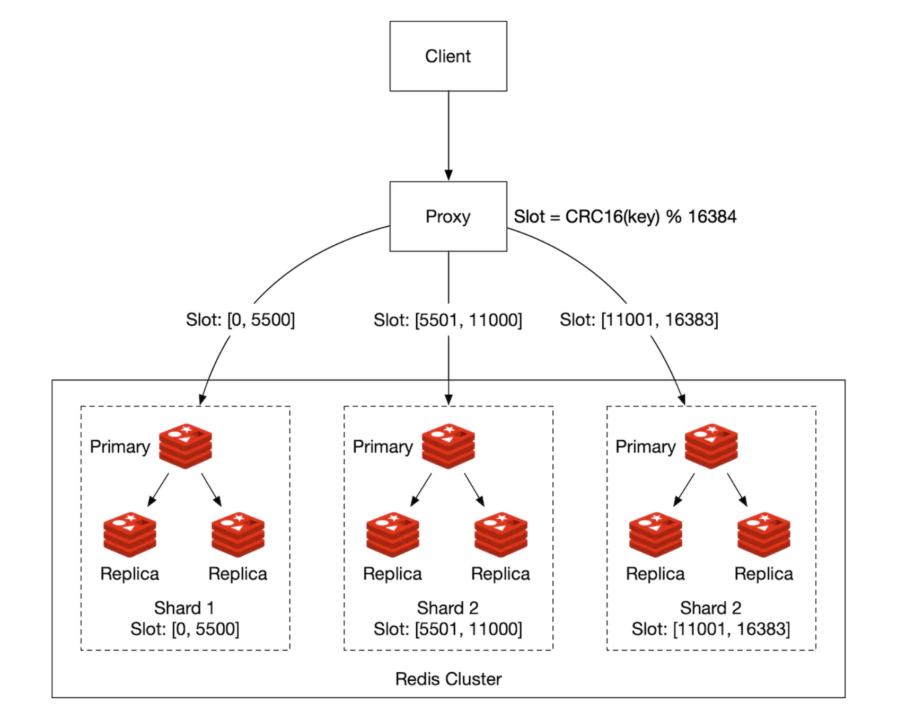
</p>

Calculating the top 10 players is challenging with this setup. We'll need to get the top 10 players of each shard and merge the results in the application:

<p align="left">
    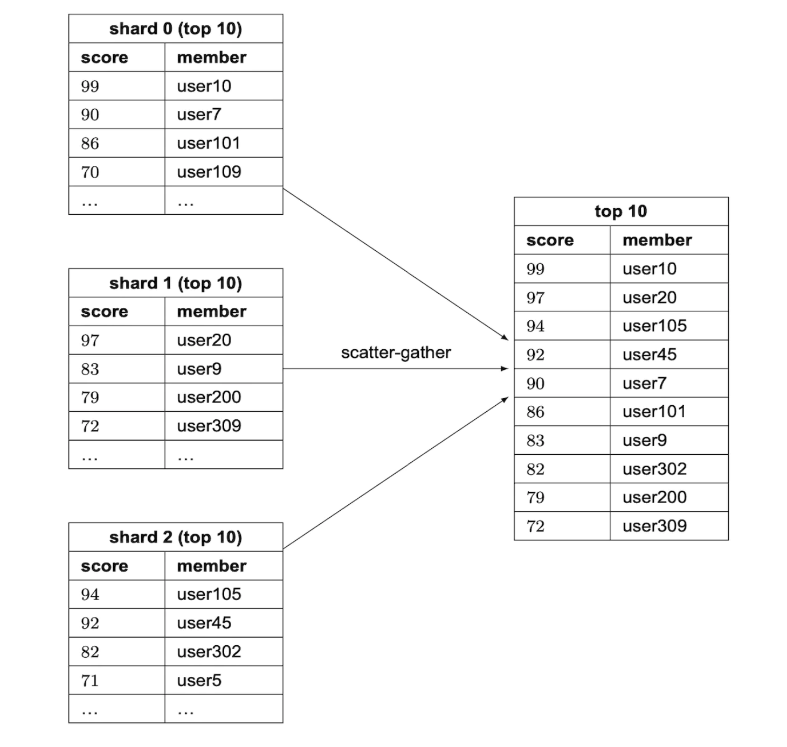
</p>

There are some limitations with the hash partitioning:
- If we need to fetch top K users, where K is high, latency can increase as we'll need to fetch a lot of data from all the shards
- Latency increases as the number of partitions grows
- There is no straightforward approach to determine a user's rank

Due to all this, the author leans towards using fixed partitions for this problem.

**There is a third approach that real systems use, and it sidesteps both**: separate the two queries, because they have completely different requirements.

| Query | Who asks | Accuracy needed | Mechanism |
|---|---|---|---|
| Top 10 (or top 1,000) | Everyone, constantly | **Exact** | One small sorted set holding only high scorers — tiny, cheap, unsharded |
| "What rank am I?" for the long tail | One user about themselves | **Approximate is fine** | A histogram of score buckets: rank ≈ sum of counts in higher buckets + position within your bucket |

The insight is that nobody in 4,312,887th place needs that number to be exact — they need it to be roughly right and to move when they score. Maintaining per-bucket counters makes that an `O(buckets)` sum instead of an `O(N)` count, and the counters are trivially shardable because they are just numbers being incremented. Meanwhile the exact top-K set stays small enough to live on one node.

**Separating "exact for the few, approximate for the many" is the general technique**, and it is the same instinct as the cheap-over-approximation-then-exact-check pattern in [Chapter 18](../18.%20Google%20Maps/#improvement---adaptive-eta-and-rerouting) and [Chapter 6](../06.%20Key-Value%20Store/) — spend precision only where someone will notice.

Also worth noting about the read path: at 50 QPS, **the top-10 query does not need to be fast, it needs to be cached.** A one-second TTL on the top 10 reduces it to roughly one Redis call per second, and no human perceives a leaderboard that is one second stale.

Other caveats:
- A best practice is to allocate twice as much memory as required for write-heavy redis nodes to accommodate snapshots if required

  The reason is `fork()` and copy-on-write: Redis snapshots by forking a child process that shares memory pages with the parent, and every page the parent then *writes* must be copied. Under heavy writes a large fraction of the dataset gets copied during the snapshot, so peak usage approaches twice the dataset size. Being out of memory at that moment means the snapshot fails or the kernel kills Redis — which, since Redis is the system of record here, means losing the leaderboard.

- **Persistence and replication are correctness requirements, not optimisations.** Nothing else holds the leaderboard, so an unreplicated instance with persistence disabled loses a month-long tournament on a single restart. Enable AOF (and know that `appendfsync everysec` can still lose up to a second of scores), run a replica, and consider writing score events to a durable log as well so the leaderboard can be rebuilt from scratch — which also gives you an audit trail for disputes.
- We can use a tool called Redis-benchmark to track the performance of a redis setup and make data-driven decisions

### **Alternative solution: NoSQL**

An alternative solution to consider is using an appropriate NoSQL database optimized for:
- heavy writes
- effectively sorting items within the same partition by score

DynamoDB, Cassandra or MongoDB are all good fits.

In this chapter, the author has decided to use DynamoDB. It is a fully-managed NoSQL database, which offers reliable performance and great scalability.
It also enables usage of global secondary indexes when we need to query fields not part of the primary key.

<p align="left">
    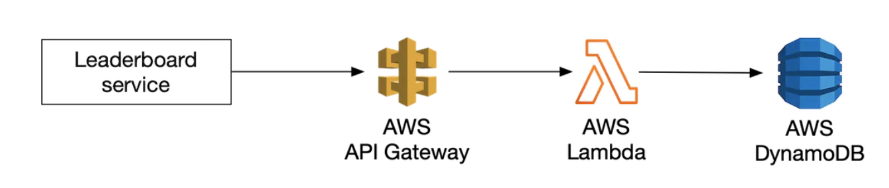
</p>

Let's start from a table for storing a leaderboard for a chess game:

<p align="left">
    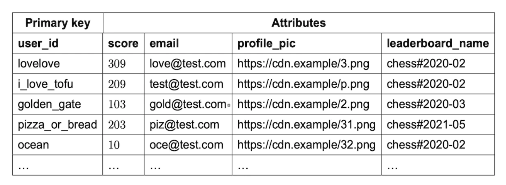
</p>

This works well, but doesn't scale well if we need to query anything by score. Hence, we can put the score as a sort key:

<p align="left">
    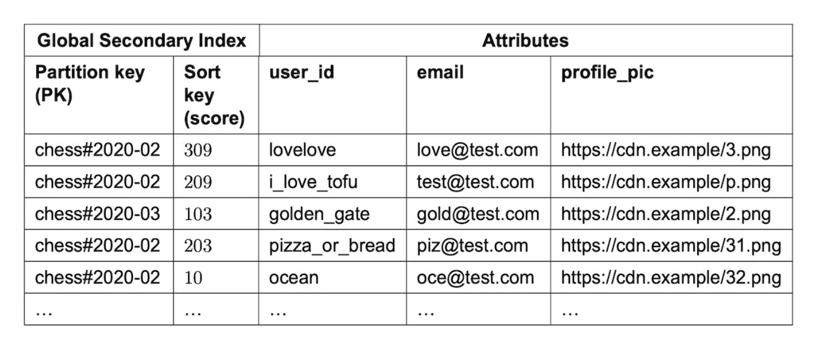
</p>

Another problem with this design is that we're partitioning by month. This leads to a hotspot partition as the latest month will be unevenly accessed compared to the others.

We could use a technique called write sharding, where we append a partition number for each key, calculated via `user_id % num_partitions`:

<p align="left">
    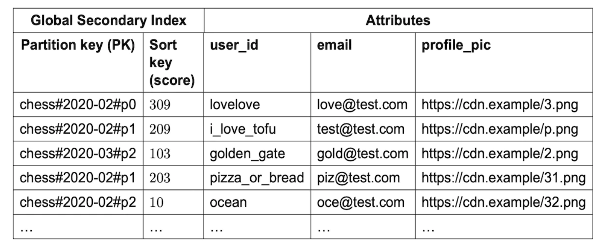
</p>

An important trade-off to consider is how many partitions we should use:
- The more partitions there are, the higher the write scalability
- However, read scalability suffers as we need to query more partitions to collect aggregate results

Using this approach requires that we use the "scatter-gather" technique we saw earlier, which grows in time complexity as we add more partitions:

<p align="left">
    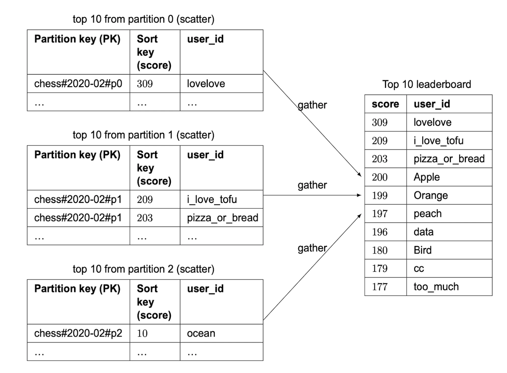
</p>

To make a good evaluation on the number of partitions, we'd need to do some benchmarking.

This NoSQL approach still has one major downside - it is hard to calculate the specific rank of a user.

If we have sufficient scale to require us to shard, we could then perhaps tell users what "percentile" of scores they're in.

A cron job can periodically run to analyze score distributions, based on which a user's percentile is determined, eg:

```
10th percentile = score < 100
20th percentile = score < 500
...
90th percentile = score < 6500
```

---

## Step 4: Wrap Up

Other things to discuss if time permits:
- **Faster retrieval** - We can cache the user object via a Redis hash with mapping `user_id -> user object`. This enables faster retrieval vs. querying the database.
- **Breaking ties** - When two players have the same score, we can break the tie by sorting them based on last played game.
- **System failure recovery** - In the event of a large-scale Redis outage, we can recreate the leaderboard by going through the MySQL WAL entries and recreate it via an ad-hoc script

That last point is the one to make unprompted rather than "if time permits", because it answers the obvious objection to putting the system of record in memory: **the leaderboard is derived state.** If every score event is durably recorded somewhere (a relational WAL, a Kafka topic, an append-only log), then the sorted set is a materialised view that can be rebuilt by replaying them. That converts "Redis is a single point of failure for a month of tournament data" into "Redis is a fast index we can regenerate", which is a completely different risk profile — and it is the same relationship as between the raw events and the aggregates in [Chapter 21](../21.%20Ad%20Click%20Event%20Aggregation/).

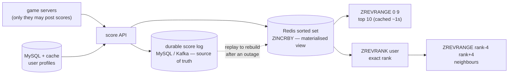
```mermaid
flowchart LR
    GS["game servers<br/>(only they may post scores)"] --> API["score API"]
    API --> LOG[("durable score log<br/>MySQL / Kafka — source of truth")]
    API --> Z[("Redis sorted set<br/>ZINCRBY — materialised view")]
    Z --> TOP["ZREVRANGE 0 9<br/>top 10 (cached ~1s)"]
    Z --> RNK["ZREVRANK user<br/>exact rank"]
    RNK --> NBR["ZREVRANGE rank-4 rank+4<br/>neighbours"]
    LOG -.->|"replay to rebuild<br/>after an outage"| Z
    PROF[("MySQL + cache<br/>user profiles")] --> API
```

---

### Gotchas & failure modes

- **Rank is the operation that breaks the relational design**, and it breaks worst for average players — `COUNT(*) WHERE score > x` visits every row above them. Top-10 is easy; rank is not.
- **A leaderboard is one Redis key, so Redis Cluster cannot shard it.** Any sharding scheme must deliberately split it into several sorted sets and merge in the application.
- **Range-partitioning by score means users migrate between shards as they score.** The partition key is the mutable value, so a single increment becomes a non-atomic remove-add-remap across three systems.
- **Score distributions are heavily skewed.** Equal-width score ranges put most of the population — and most of the write traffic, since new players start at zero — in the lowest bucket.
- **Hash partitioning makes rank effectively unanswerable** and makes large top-K a scatter-gather over every shard, with latency growing as partitions are added.
- **Redis is the system of record, so persistence is a correctness concern.** With AOF `everysec`, a crash can lose a second of scores; with persistence off, a restart loses the tournament. Replicate, and keep a durable score log so the set can be rebuilt.
- **Snapshotting can double memory.** `fork()` plus copy-on-write under a write-heavy load copies much of the dataset. Provision 2× or the snapshot fails — or the OOM killer takes the leaderboard.
- **Ties default to alphabetical order by user ID**, which is deterministic and quietly unfair. Packing a timestamp into the score fixes it, but sorted-set scores are doubles — exceed the 53-bit mantissa and the tiebreak silently rounds away.
- **Client-reported scores are the primary leaderboard exploit.** The chapter is right that the score API must be reachable only by game servers; the moment a client can post its own score, the leaderboard measures packet-crafting skill. Server-side validation, plausibility checks (score rate per player) and anomaly detection on the top ranks are all part of the design.
- **Players with no score are absent from the set**, so `ZREVRANK` returns nil rather than "last". The API needs a defined answer for an unranked user.
- **Monthly rollover is a discontinuity.** A new tournament means a new key, archiving the old set, and deciding exactly when the switch happens across timezones — plus what a player sees if they finish a match in the boundary second.
- **"Real-time" is a product claim, not a latency budget.** Scores are visible within a round trip, but the *displayed* leaderboard is whatever the client last fetched. Caching the top 10 for a second is invisible to users and removes almost all read load; the honest statement is "fresh within about a second", not "real-time".
- **Large K is expensive in any sharded design.** Top 10 is nine extra entries; top 10,000 across 16 shards is 160,000 entries fetched and discarded.
- **Serverless has a cold-start and a per-invocation cost.** The Lambda design removes operational burden and adds latency variance on cold paths plus a cost model that scales with request count — fine at 500 QPS, worth re-examining at 250 K.

---

## The design, as problem and technique

| Goal / problem | Technique |
|---|---|
| Answering a user's rank in better than `O(N)` | Sorted set over a skip list with per-pointer spans — `ZREVRANK` in `O(log N)` |
| Top 10 | `ZREVRANGE 0 9`, cached for ~1 second |
| Four players above and below | `ZREVRANK` then a `ZREVRANGE` on the surrounding offsets |
| Incrementing a score | `ZINCRBY` — one `O(log N)` operation, no read-modify-write |
| 25 M players | ~3.25 GB in one Redis instance; no sharding required at stated scale |
| Monthly tournaments | A sorted set per tournament; bounded size and natural expiry |
| Redis holding the only copy | Durable score log as the source of truth; sorted set as a rebuildable view |
| Surviving a restart | AOF plus a replica, with 2× memory headroom for fork-based snapshots |
| Fair tie-breaking | Composite score packing a timestamp, within the 53-bit mantissa |
| Rank at 500 M players | Exact top-K in one small set, plus bucket-count histogram for approximate long-tail rank |
| Cheating | Score API restricted to game servers; server-side validation and rate plausibility checks |
| User profile lookups for display | `user_id → user object` Redis hash in front of MySQL |

## Self-check
1. Which single requirement eliminates the relational solution, and why does scale not matter to that argument?
2. Why is finding the rank of a player in 20-millionth place expensive, and why is top-10 cheap?
3. Why doesn't a B-tree index give you position, and what does a sorted set maintain that provides it?
4. Map all four functional requirements to Redis commands and give each one's complexity.
5. Why a skip list rather than a balanced tree?
6. A leaderboard is a single Redis key. What does that imply about Redis Cluster?
7. What goes wrong when you range-partition by score — name both problems.
8. How would you answer "what rank am I?" for 500 million players without an `O(N)` count?
9. Why must Redis persistence be configured here when it would be optional for a cache?
10. Why does a write-heavy Redis node need twice its dataset in memory?
11. Two players have 500 points. Who ranks higher by default, and why is that a problem?
12. How do you break ties by time, and what numeric limit constrains the trick?
13. What is the single most important access-control rule in this design, and what happens without it?
14. A player has never scored. What does `ZREVRANK` return, and what should the API say?

## Glossary

| Term | Meaning |
|---|---|
| **Rank** | A player's position in the ordering — the operation this chapter exists to make cheap |
| **Sorted set (ZSET)** | Redis structure combining a hash map and a skip list, ordered by score |
| **Skip list** | Probabilistically balanced linked list with multi-level indexes giving `O(log N)` search |
| **Span** | The count of nodes a skip-list forward pointer skips; summing spans yields rank |
| **`ZINCRBY` / `ZREVRANGE` / `ZREVRANK`** | Increment a score; read a range by descending score; read a member's descending rank |
| **Order-statistic structure** | One that can report *how many* elements precede a given element |
| **Composite score** | Points packed with a timestamp into one numeric score for deterministic tie-breaking |
| **Range vs hash partitioning** | Splitting by score interval vs by hashed member; the former migrates users, the latter loses rank |
| **Approximate rank** | Score-bucket counters giving near-correct rank for the long tail at `O(buckets)` |
| **Materialised view** | The leaderboard understood as derived state, rebuildable from a durable score log |
| **AOF / RDB** | Redis append-only log and point-in-time snapshot persistence modes |
| **Copy-on-write fork** | Snapshot mechanism whose memory cost rises with the write rate during the snapshot |

## Where to go next
- [Chapter 6 – Design A Key-Value Store](../06.%20Key-Value%20Store/) — what sits behind Redis conceptually, and the durability machinery this chapter needs.
- [Chapter 21 – Ad Click Event Aggregation](../21.%20Ad%20Click%20Event%20Aggregation/) — raw events as the source of truth with aggregates as rebuildable views, which is the right way to think about this leaderboard.
- [Chapter 11 – Design A News Feed System](../11.%20News%20Feed%20System/) — counter caches and atomic increments at a much larger write rate.
- [Chapter 5 – Design Consistent Hashing](../05.%20Consistent%20Hashing/#gotchas--failure-modes) — why partitioning the leaderboard does not solve a hot key.
- [Chapter 18 – Design Google Maps](../18.%20Google%20Maps/#improvement---adaptive-eta-and-rerouting) — the same "approximate for the many, exact for the few" instinct in a different domain.
