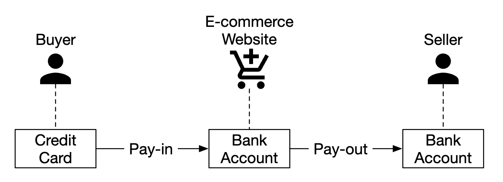
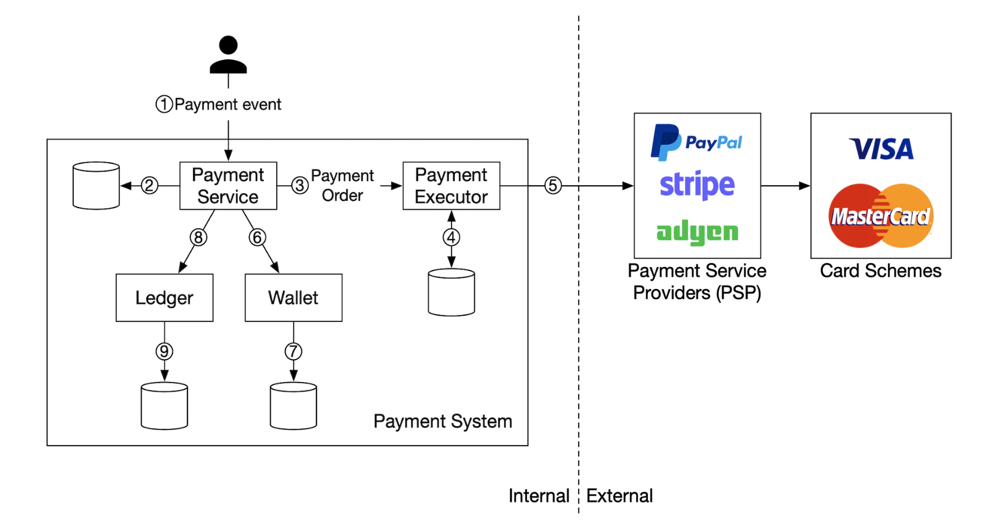
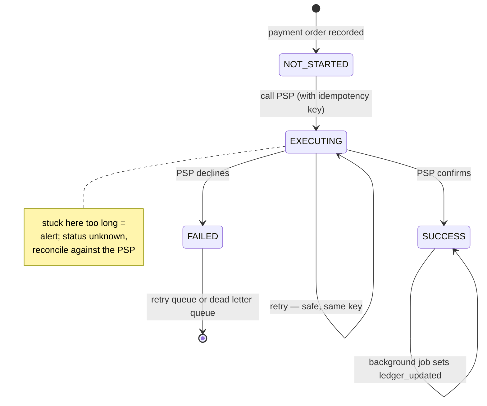
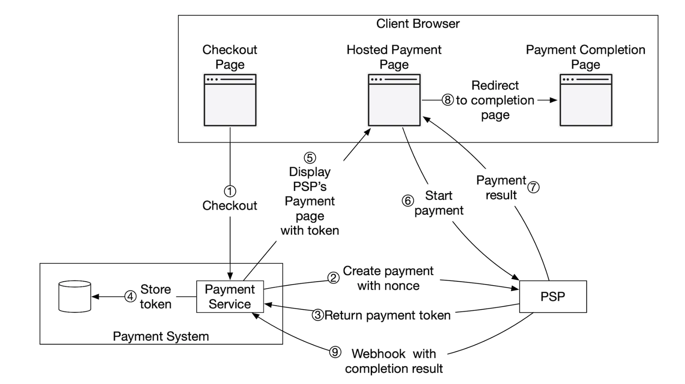
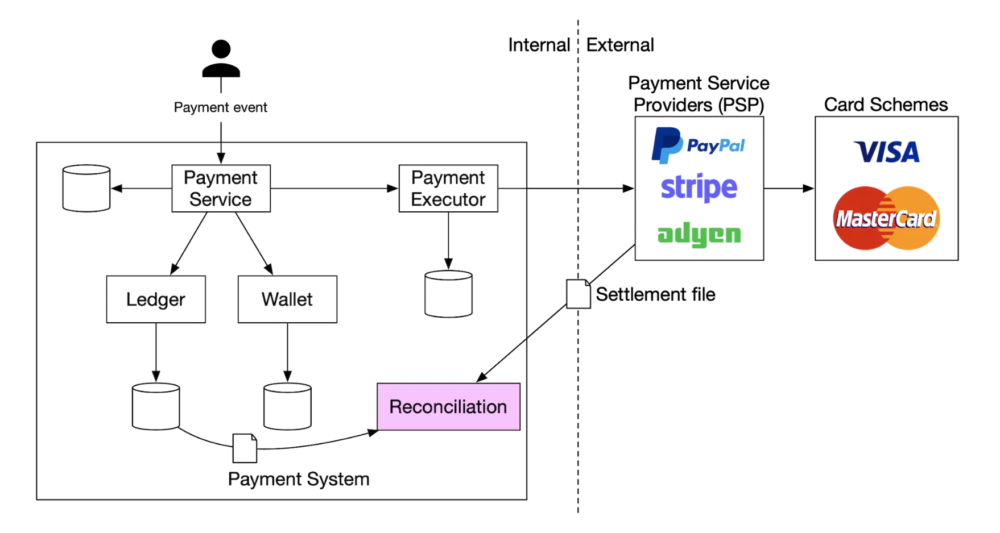
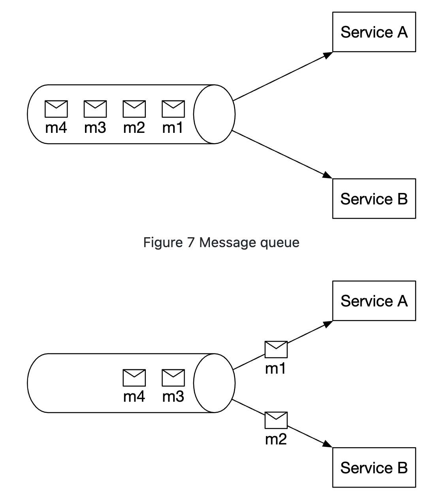
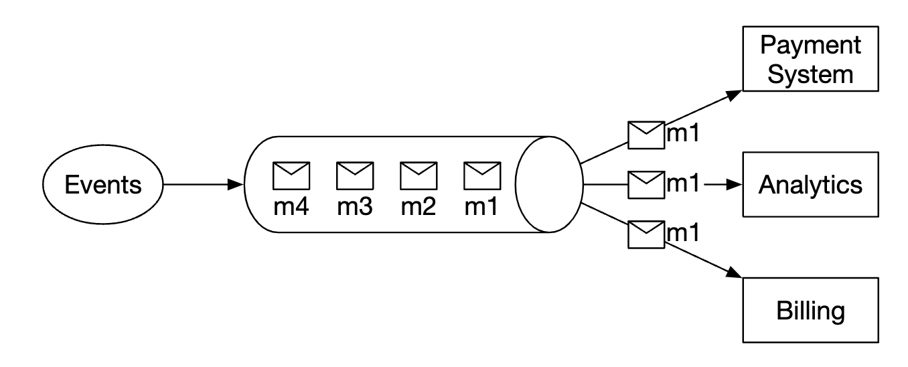
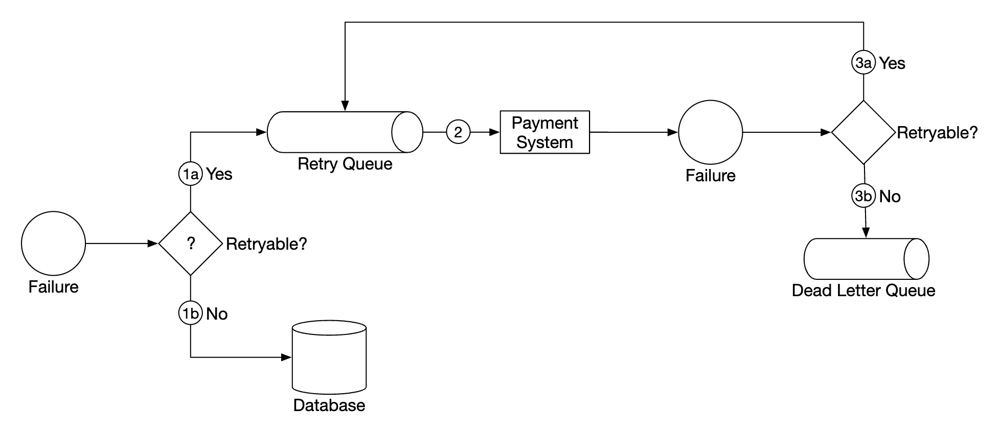
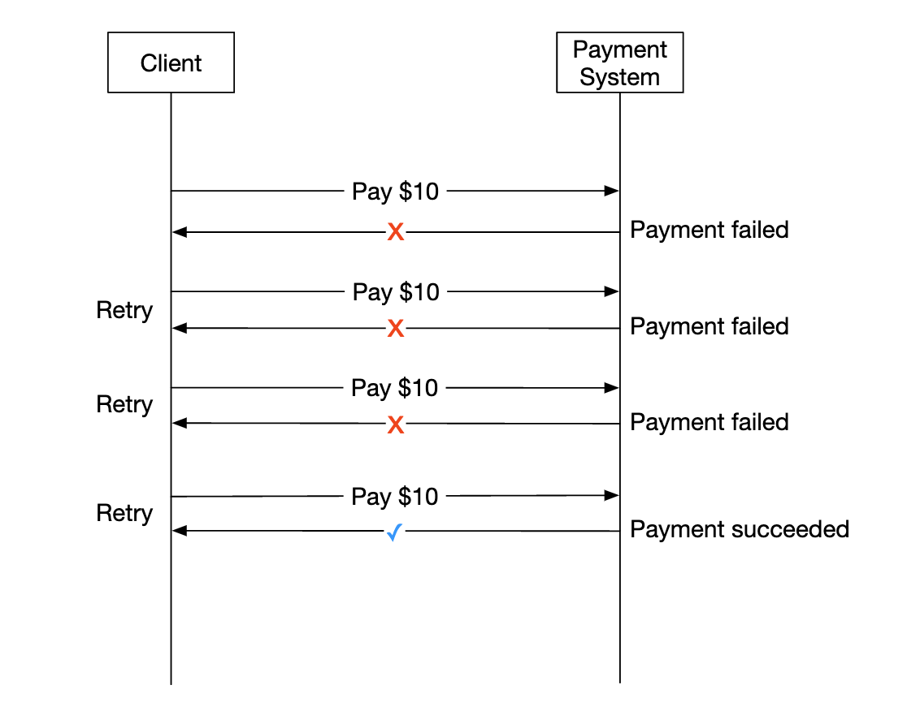
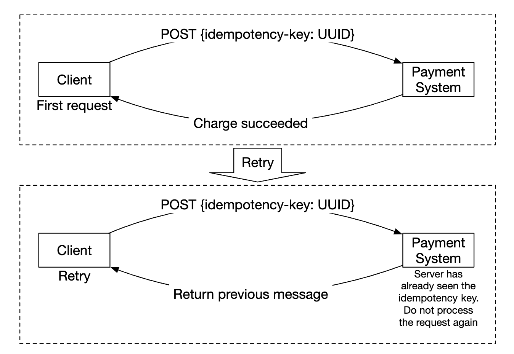

# Chapter 26: Payment System

## Introduction
We'll design a **payment system** in this chapter, which underpins all of modern **e-commerce**.

A **payment system** is used to settle financial transactions, transferring monetary value.

**The one-sentence version:** at **~11 transactions per second** this is the lowest-throughput system in these notes and comfortably the hardest, because money movement has two properties nothing else here has — **it cannot be lost, and it cannot be undone.** Combine that with the fact that the authoritative record lives in systems you do not control (the PSP, the card networks, the banks) and is only confirmed to you hours later, and the shape of the problem appears.

**Two mechanisms do almost all of the work, and everything else is plumbing:**

| Mechanism | Job |
|---|---|
| **Idempotency keys** | Make sure an operation that is retried is not *performed* twice |
| **Reconciliation** | Detect, after the fact, the cases where your records and reality diverged |

The second is the one worth internalising, because it is counter-intuitive. You cannot *prevent* inconsistency in a flow that spans your database, a third-party API and a bank — no transaction spans those systems, and no protocol will give you one. So reconciliation is not a safety net bolted on at the end; **it is the correctness mechanism.** The design accepts that it will sometimes be wrong and guarantees that it will find out and fix it.

It is worth contrasting with [Chapter 21](../21.%20Ad%20Click%20Event%20Aggregation/), which is also about money:

| | Ch 21 — Ad click aggregation | Ch 26 — Payment system |
|---|---|---|
| Throughput | 50,000 events/sec | **11 transactions/sec** |
| Operation | **Counts** money | **Moves** money |
| Wrong answer | Recompute from raw events | **Cannot be recomputed** — a charge happened |
| Fix for an error | Replay the pipeline | A *new, compensating* transaction |
| Authority | Your batch job | An external bank, hours later |

---

## Step 1: Understand the Problem and Establish Design Scope
 * C: What kind of payment system are we building?
 * I: A payment backend for an e-commerce system, similar to Amazon.com. It handles everything related to money movement.
 * C: What payment options are supported - Credit cards, PayPal, bank cards, etc?
 * I: The system should support all these options in real life. For the purposes of the interview, we can use credit card payments.
 * C: Do we handle credit card processing ourselves?
 * I: No, we use a third-party provider like Stripe, Braintree, Square, etc.
 * C: Do we store credit card data in our system?
 * I: Due to compliance reasons, we do not store credit card data directly in our systems. We rely on third-party payment processors.
 * C: Is the application global? Do we need to support different currencies and international payments?
 * I: The application is global, but we assume only one currency is used for the purposes of the interview.
 * C: How many payment transactions per day do we support?
 * I: 1mil transactions per day.
 * C: Do we need to support the payout flow to eg payout to payers each month?
 * I: Yes, we need to support that
 * C: Is there anything else I should pay attention to?
 * I: We need to support reconciliations to fix any inconsistencies in communicating with internal and external systems.

### **Functional requirements**
 * Pay-in flow - payment system receives money from customers on behalf of merchants
 * Pay-out flow - payment system sends money to sellers around the world

### **Non-functional requirements**
 * Reliability and fault-tolerance. Failed payments need to be carefully handled
 * A reconciliation between internal and external systems needs to be setup.

### **Back-of-the-envelope estimation**
The system needs to process 1mil transactions per day, which is 10 transactions per second.

This is not a high throughput for any database system, so it's not the focus of this interview.

| Quantity | Derivation | Result |
|---|---|---|
| Transactions/sec | 1 M / 86,400 | **~11.6 TPS** |
| Storage/day | 1 M × ~1 KB of payment and ledger records | ~1 GB/day |
| Storage at 7-year regulatory retention | 1 GB × 365 × 7 | **~2.5 TB** |

So: eleven writes per second and a couple of terabytes. **Saying out loud that the scale is irrelevant is the right opening move**, because it redirects the interview to where the difficulty actually is — correctness, auditability and recovery — and it licenses the single most important design decision in the chapter: **use a boring relational database with real ACID transactions.** Nothing about this workload forces you off it, and everything about the requirements wants it.

> **Interview angle:** candidates who reach for sharding, NoSQL or eventual consistency here have misread the problem. The correct instinct is the opposite: take the strongest consistency guarantees available, because the volume never makes you pay for them.

## Step 2: Propose High-Level Design and Get Buy-In
At a high-level, we have three actors, participating in money movement:

<p align="left">
    
</p>

### **Pay-in flow**
Here's the high-level overview of the pay-in flow:

<p align="left">
    
</p>

 * Payment service - accepts payment events and coordinates the payment process. It typically also does a risk check using a third-party provider for AML violations or criminal activity.
 * Payment executor - executes a single payment order via the Payment Service Provider (PSP). Payment events may contain several payment orders.
 * Payment service provider (PSP) - moves money from one account to another, eg from buyer's credit card account to e-commerce site's bank account.
 * Card schemes - organizations that process credit card operations, eg Visa MasterCard, etc.
 * Ledger - keeps financial record of all payment transactions.
 * Wallet - keeps the account balance for all merchants.

Here's an example pay-in flow:
 * user clicks "place order" and a payment event is sent to the payment service
 * payment service stores the event in its database
 * payment service calls the payment executor for all payment orders, part of that payment event
 * payment executor stores the payment order in its database
 * payment executor calls external PSP to process the credit card payment
 * After the payment executor processes the payment, the payment service updates the wallet to record how much money the seller has
 * wallet service stores updated balance information in its database
 * payment service calls the ledger to record all money movements

### **APIs for payment service**
```
POST /v1/payments
{
  "buyer_info": {...},
  "checkout_id": "some_id",
  "credit_card_info": {...},
  "payment_orders": [{...}, {...}, {...}]
}
```

Example `payment_order`:
```
{
  "seller_account": "SELLER_IBAN",
  "amount": "3.15",
  "currency": "USD",
  "payment_order_id": "globally_unique_payment_id"
}
```

Caveats:
 * The `payment_order_id` is forwarded to the PSP to deduplicate payments, ie it is the idempotency key.
 * The amount field is `string` as `double` is not appropriate for representing monetary values.

**That second caveat is one line and deserves several, because using a float for money is the most common and most expensive bug in this domain.** IEEE-754 binary floating point cannot represent most decimal fractions exactly — `0.1` is stored as a value very slightly above or below one tenth — so:

```
0.1 + 0.2 == 0.30000000000000004     # not 0.3
```

Individually invisible; in aggregate, fatal. Sum a million transactions and the error accumulates into real discrepancies, and a double-entry ledger whose debits and credits differ by a fraction of a cent fails its own integrity check. Worse, the error is *inconsistent* — the same logical total computed in a different order gives a different answer, which makes reconciliation mismatches that cannot be explained or reproduced.

The two correct representations:

| Approach | Example | Notes |
|---|---|---|
| **Integer minor units** | `$3.15` → `315` (cents) | Exact, fast, the usual choice; the currency's exponent must travel with it (JPY has 0 decimals, BHD has 3) |
| **Fixed-point decimal** | `DECIMAL(19,4)`, `BigDecimal` | Exact, handles more decimal places for FX rates and interest |

The amount is carried as a **string** across the API boundary precisely so that no JSON parser silently turns it into a double on the way through — the same hazard as 64-bit IDs in JavaScript from [Chapter 7](../07.%20Unique-Id%20Generator/#gotchas--failure-modes), with money instead of identifiers.

```
GET /v1/payments/{:id}
```

This endpoint returns the execution status of a single payment, based on the `payment_order_id`.

### **Payment service data model**
We need to maintain two tables - `payment_events` and `payment_orders`.

For payments, performance is typically not an important factor. Strong consistency, however, is.

Other considerations for choosing the database:
 * Strong market of DBAs to hire to administer the database
 * Proven track-record where the database has been used by other big financial institutions
 * Richness of supporting tools
 * Traditional SQL over NoSQL/NewSQL for its ACID guarantees

Here's what the `payment_events` table contains:
 * `checkout_id` - string, primary key
 * `buyer_info` - string (personal note - prob a foreign key to another table is more appropriate)
 * `seller_info` - string (personal note - same remark as above)
 * `credit_card_info` - depends on card provider
 * `is_payment_done` - boolean

Here's what the `payment_orders` table contains:
 * `payment_order_id` - string, primary key
 * `buyer_account` - string
 * `amount` - string
 * `currency` - string
 * `checkout_id` - string, foreign key
 * `payment_order_status` - enum (`NOT_STARTED`, `EXECUTING`, `SUCCESS`, `FAILED`)
 * `ledger_updated` - boolean
 * `wallet_updated` - boolean

Caveats:
 * there are many payment orders, linked to a given payment event
 * we don't need the `seller_info` for the pay-in flow. That's required on pay-out only
 * `ledger_updated` and `wallet_updated` are updated when the respective service is called to record the result of a payment
 * payment transitions are managed by a background job, which checks updates of in-flight payments and triggers an alert if a payment is not processed in a reasonable timeframe

**The `ledger_updated` and `wallet_updated` booleans are more interesting than they look: they are a persisted to-do list, and they are what make the whole flow resumable.** A payment involves several side effects that cannot be performed in one transaction — call the PSP, update the wallet, post to the ledger — so a crash can happen between any two of them. Recording *which steps have completed* means the background job can pick up any payment, see exactly what remains, and finish it.

That turns an unreliable multi-step process into a convergent one:



**The crucial detail is that the payment order is written to the database *before* the PSP is called.** If the process dies immediately after the external call, there is still a local record saying "I was in the middle of charging this card", which is the only thing that lets reconciliation ask the PSP what actually happened. A design that calls the PSP first and records afterwards can lose all knowledge that a charge was ever attempted — and an unrecorded charge is the worst outcome available, because the customer has paid and your system does not know.

This is the same "record intent, then act" ordering as the metadata commit in [Chapter 15](../15.%20Google%20Drive/#file-upload-flow) and [Chapter 24](../24.%20S3-like%20Object%20Storage/), applied to an external side effect instead of to storage.

### **Double-entry ledger system**
The double-entry accounting mechanism is key to any payment system. It is a mechanism of tracking money movements by always applying money operations to two accounts, where one's account balance increases (credit) and the other decreases (debit):

| Account | Debit | Credit |
|---------|-------|--------|
| buyer   | $1    |        |
| seller  |       | $1     |

Sum of all transaction entries is always zero. This mechanism provides end-to-end traceability of all money movements within the system.

**"Sum of all entries is always zero" is not an accounting nicety — it is a continuously checkable invariant**, and that is why double-entry has survived since the 15th century. At any moment you can sum every entry in the ledger; if the total is not zero, money has been created or destroyed by a bug, and you know it without needing an external reference. No single-entry design gives you that, because there is nothing to check against.

Three consequences follow, and they shape the whole system:

**The ledger is append-only and immutable.** You never edit an entry. A mistake is corrected by posting a *reversing* entry, which leaves both the error and its correction permanently visible. That is what makes the ledger auditable — history cannot be rewritten — and it is the same immutability argument as [Chapter 24](../24.%20S3-like%20Object%20Storage/).

**A refund is therefore a new transaction, not an undo.** This is the practical form of "money movement cannot be rolled back": the original charge happened, is recorded, and stays recorded; the refund is a second, opposite movement. Anyone reasoning about this system as though failed operations can be rolled back has the wrong model.

**The ledger is the source of truth and the wallet is a derived view.** The ledger says what happened; the wallet says what the balance *currently is*, which is a sum over the ledger. That means the wallet can always be rebuilt by replaying the ledger — and if the wallet and the ledger disagree, the ledger wins. This is now the third instance of the same pattern in these notes:

| Chapter | Source of truth | Derived view |
|---|---|---|
| [21 – Ad clicks](../21.%20Ad%20Click%20Event%20Aggregation/) | Raw click events | Per-minute aggregates |
| [25 – Leaderboard](../25.%20Real-time%20Gaming%20Leaderboard/) | Durable score log | Redis sorted set |
| **26 – Payments** | **Double-entry ledger** | **Wallet balance** |

Keeping an immutable log of events plus a rebuildable projection of current state is one of the most generally useful structures in system design, and payments is where it is least optional.

### **Hosted payment page**
To avoid storing credit card information and having to comply with various heavy regulations, most companies prefer utilizing a widget, provided by PSPs, which store and handle credit card payments for you:

**The regulation being avoided is PCI DSS, and the saving is enormous.** If card numbers ever touch your servers, your entire environment falls within PCI scope — which means network segmentation, encryption at rest and in transit, access controls, logging, quarterly scans, annual audits, and the full Self-Assessment Questionnaire D with hundreds of controls. If the card number goes directly from the customer's browser to the PSP and you only ever hold a token, your scope collapses to the much shorter SAQ A.

So the hosted page is not primarily a convenience: **it is a deliberate transfer of regulatory liability**, and it is why nearly every company that is not itself a payment processor uses one. The engineering cost is that you give up control of the checkout UI and gain an asynchronous, webhook-driven flow instead of a synchronous result — which is exactly the complexity the rest of this chapter deals with.

<p align="left">
    
</p>

### **Pay-out flow**
The components of the pay-out flow are very similar to the pay-in flow.

Main differences:
 * money is moved from e-commerce site's bank account to merchant's bank account
 * we can utilize a third-party account payable provider such as Tipalti
 * There's a lot of bookkeeping and regulatory requirements to handle with regards to pay-outs as well

---

## Step 3: Design Deep Dive
This section focuses on making the system faster, more robust and secure.

### **PSP Integration**
If our system can directly connect to banks or card schemes, payment can be made without a PSP.
These kinds of connections are very rare and uncommon, typically done at large companies which can justify the investment.

If we go down the traditional route, a PSP can be integrated in one of two ways:
 * Through API, if our payment system can collect payment information
 * Through a hosted payment page to avoid dealing with payment information regulations

Here's how the hosted payment page workflow works:

<p align="left">
    
</p>

 * User clicks "checkout" button in the browser
 * Client calls the payment service with the payment order information
 * After receiving payment order information, the payment service sends a payment registration request to the PSP.
 * The PSP receives payment info such as currency, amount, expiration, etc, as well as a UUID for idempotency purposes. Typically the UUID of the payment order.
 * The PSP returns a token back which uniquely identifies the payment registration. The token is stored in the payment service database.
 * Once token is stored, the user is served with a PSP-hosted payment page. It is initialized using the token as well as a redirect URL for success/failure. 
 * User fills in payment details on the PSP page, PSP processes payment and returns the payment status
 * User is now redirected back to the redirectURL. Example redirect url - `https://your-company.com/?tokenID=JIOUIQ123NSF&payResult=X324FSa`
 * Asynchronously, the PSP calls our payment service via a webhook to inform our backend of the payment result
 * Payment service records the payment result based on the webhook received

**Three things about webhooks that this flow depends on and that are easy to get wrong:**

- **They are at-least-once and unordered.** A PSP will retry a webhook it believes was not acknowledged, and under retry two webhooks for the same payment can arrive out of order — a `succeeded` after a `pending`, or a duplicate `succeeded`. The handler must therefore be idempotent and must ignore a transition that moves the state backwards.
- **They must be authenticated.** A webhook endpoint is a public URL that tells your system a payment succeeded. Unverified, it is an instruction to ship goods for free. PSPs sign the payload (typically HMAC over the raw body with a shared secret); verify the signature on the **raw bytes** before parsing, and reject anything unsigned.
- **The webhook can beat your own bookkeeping.** The PSP may call your webhook before the synchronous registration response has been committed locally, so the handler can receive a result for a payment it has no record of. The handler must tolerate that — park it and retry, rather than rejecting it as unknown.

And note the redirect URL is **not** a trustworthy result. `?payResult=X324FSa` is a value the customer's browser can edit. The redirect tells the user what happened; the webhook tells the system.

### **Reconciliation**
The previous section explains the happy path of a payment. Unhappy paths are detected and reconciled using a background reconciliation process.

Every night, the PSP sends a settlement file which our system uses to compare the external system's state against our internal system's state.

<p align="left">
    
</p>

This process can also be used to detect internal inconsistencies between eg the ledger and the wallet services.

Mismatches are handled manually by the finance team. Mismatches are handled as:
 * classifiable, hence, it is a known mismatch which can be adjusted using a standard procedure
 * classifiable, but can't be automated. Manually adjusted by the finance team
 * unclassifiable. Manually investigated and adjusted by the finance team

**Reconciliation deserves to be understood as the design's correctness guarantee rather than as a cleanup chore.** No transaction can span your database, the PSP's API and a bank's ledger, so there is no way to make the three agree atomically. What reconciliation provides is a different and achievable guarantee: **any divergence will be detected within one settlement cycle and corrected.**

The three mismatch categories are really a maturity ladder, and the useful observation is which direction you want to move:

| Class | Example | Handling |
|---|---|---|
| Known and automatable | A payment our side marked `EXECUTING` that the PSP reports as settled | Script applies the standard adjustment |
| Known, not automatable | Amount differs because of an FX rate or a fee we did not model | Finance applies a judged adjustment |
| **Unclassifiable** | A settled payment with no corresponding record at all | **Investigation — and a bug** |

Every unclassifiable mismatch is a signal that the system has a failure mode nobody has modelled yet, so the health of a payment system can be measured by how much of its reconciliation is automated and whether the unclassifiable bucket is shrinking. A growing unclassifiable backlog is the clearest early warning that something is structurally wrong.

Three practical points the chapter leaves out:

- **Reconcile internally as well as externally.** Comparing the ledger against the wallet catches your own bugs without waiting for the PSP's file. Since the wallet is a projection of the ledger, that check is just "does the sum match?".
- **Settlement files have a cutoff and a timezone.** A payment at 23:59 local time may fall in either day's file depending on the PSP's clock, which produces apparent mismatches that resolve themselves the next day. Reconciliation must tolerate boundary effects rather than alerting on them.
- **Reconciliation is also the fraud and incident detector.** Totals that drift in one direction, or a sudden rise in a particular mismatch class, surface problems that no single request-level check would.

### **Handling payment processing delays**
There are cases, where a payment can take hours to complete, although it typically takes seconds.

This can happen due to:
 * a payment being flagged as high-risk and someone has to manually review it
 * credit card requires extra protection, eg 3D Secure Authentication, which requires extra details from card holder to complete

These situations are handled by:
 * waiting for the PSP to send us a webhook when a payment is complete or polling its API if the PSP doesn't provide webhooks
 * showing a "pending" status to the user and giving them a page, where they can check-in for payment updates. We could also send them an email once their payment is complete

### **Communication among internal services**
There are two types of communication patterns services use to communicate with one another - synchronous and asynchronous.

Synchronous communication (ie HTTP) works well for small-scale systems, but suffers as scale increases:
 * low performance - request-response cycle is long as more services get involved in the call chain
 * poor failure isolation - if PSPs or any other service fails, user will not receive a response
 * tight coupling - sender needs to know the receiver
 * hard to scale - not easy to support sudden increase in traffic due to not having a buffer

Asynchronous communication can be divided into two categories.

Single receiver - multiple receivers subscribe to the same topic and messages are processed only once:

<p align="left">
    
</p>

Multiple receivers - multiple receivers subscribe to the same topic, but messages are forwarded to all of them:

<p align="left">
    
</p>

Latter model works well for our payment system as a payment can trigger multiple side effects, handled by different services.

In a nutshell, synchronous communication is simpler but doesn't allow services to be autonomous. 
Async communication trades simplicity and consistency for scalability and resilience.

### **Handling failed payments**
Every payment system needs to address failed payments. Here are some of the mechanisms we'll use to achieve that:
 * Tracking payment state - whenever a payment fails, we can determine whether to retry/refund based on the payment state.
 * Retry queue - payments which we'll retry are published to a retry queue
 * Dead-letter queue - payments which have terminally failed are pushed to a dead-letter queue, where the failed payment can be debugged and inspected.

<p align="left">
    
</p>

### **Exactly-once delivery**
We need to ensure a payment gets processed exactly-once to avoid double-charging a customer.

An operation is executed exactly-once if it is executed at-least-once and at-most-once at the same time.

To achieve the at-least-once guarantee, we'll use a retry mechanism:

<p align="left">
    
</p>

Here are some common strategies on deciding the retry intervals:
 * immediate retry - client immediately sends another request after failure
 * fixed intervals - wait a fixed amount of time before retrying a payment
 * incremental intervals - incrementally increase retry interval between each retry
 * exponential back-off - double retry interval between subsequent retries
 * cancel - client cancels the request. This happens when the error is terminal or retry threshold is reached

As a rule of thumb, default to an exponential back-off retry strategy. A good practice is for the server to specify a retry interval using a `Retry-After` header.

An issue with retries is that the server can potentially process a payment twice:
 * client clicks the "pay button" twice, hence, they are charged twice
 * payment is successfully processed by PSP, but not by downstream services (ledger, wallet). Retry causes the payment to be processed by the PSP again

To address the double payment problem, we need to use an idempotency mechanism - a property that an operation applied multiple times is processed only once.

From an API perspective, clients can make multiple calls which produce the same result. 
Idempotency is managed by a special header in the request (eg `idempotency-key`), which is typically a UUID.

<p align="left">
    
</p>

Idempotency can be achieved using the database's mechanism of adding unique key constraints:
 * server attempts to insert a new row in the database
 * the insertion fails due to a unique key constraint violation
 * server detects that error and instead returns the existing object back to the client

**The unique constraint is the whole mechanism, and the reason it works is that it is enforced by the storage engine rather than by application logic.** Two concurrent requests carrying the same key both attempt the insert; exactly one can succeed. A check-then-insert in application code would race, which is the same argument as the reservation key in [Chapter 22](../22.%20Hotel%20Reservation%20System/#concurrency-issues).

Three details that separate a working implementation from a broken one:

**Store the response, not just the key.** The point of idempotency is that a retry returns *the same answer*, so the stored record must include the original result. Returning "already processed" with no payload forces the client to guess what happened — which is exactly the uncertainty the key was supposed to remove.

**Decide what happens when the same key arrives with a different payload.** A client that reuses an idempotency key for a *different* payment has a bug, and silently returning the first payment's result would hide it while the second payment never happens. The standard behaviour, and Stripe's, is to **reject the request with an error**: store a fingerprint of the request body alongside the key and compare. Silence here is how a genuine missing payment becomes invisible.

**Scope and expire keys deliberately.** Keys are usually scoped per API endpoint and per account, and retained for a bounded window (24 hours is typical) — long enough to cover every realistic retry, short enough that the table does not grow forever. The window is a real trade-off: a retry after expiry will create a second payment.

**Finally, be precise about what is actually guaranteed.** "Exactly-once" here means at-least-once *delivery* plus idempotent *processing* — the same formulation as [Chapter 19](../19.%20Distributed%20Message%20Queue/#exactly-once) and [Chapter 10](../10.%20Notification%20System/#reliability). There is no distributed transaction and no two-phase commit across the PSP boundary; there is a retry loop whose repetition is harmless, which produces exactly-once *effects*.

Idempotency is also applied at the PSP side, using the UUID sent at payment registration, which was previously discussed. PSPs will take care to not process payments with the same key twice.

### **Consistency**
There are several stateful services called throughout a payment's lifecycle - PSP, ledger, wallet, payment service.

Communication between any two services can fail. 
We can ensure eventual data consistency between all services by implementing exactly-once processing and reconciliation.

If we use replication, we'll have to deal with replication lag, which can lead to users observing inconsistent data between primary and replica databases.

To mitigate that, we can serve all reads and writes from the primary database and only utilize replicas for redundancy and fail-over.
Alternatively, we can ensure replicas are always in-sync by utilizing a consensus algorithm such as Paxos or Raft.
We could also use a consensus-based distributed database such as YugabyteDB or CockroachDB.

### **Payment security**
Here are some mechanisms we can use to ensure payment security:
 * Request/response eavesdropping - we can use HTTPS to secure all communication
 * Data tampering - enforce encryption and integrity monitoring
 * Man-in-the-middle attacks - use SSL \w certificate pinning
 * Data loss - replicate data across multiple regions and take data snapshots
 * DDoS attack - implement rate limiting and firewall
 * Card theft - use tokens instead of storing real card information in our system
 * PCI compliance - a security standard for organizations which handle branded credit cards
 * Fraud - address verification, card verification value (CVV), user behavior analysis, etc

---

## Step 4: Wrap Up
Other talking points:
 * Monitoring and alerting
 * Debugging tools - we need tools which make it easy to understand why a payment has failed
 * Currency exchange - important when designing a payment system for international use
 * Geography - different regions might have different payment methods
 * Cash payment - very common in places like India and Brazil

### Two mechanisms the chapter does not cover, and both come up

**Authorization versus capture.** A card payment is normally two operations, not one: an **authorization** places a hold on the customer's funds and reserves them, and a **capture** actually transfers the money. They can be seconds or days apart — which is how e-commerce charges you when the item ships rather than when you order. The design consequences are real:

- An authorization **expires** (typically ~7 days), after which the hold disappears and the capture will fail.
- A capture can be for **less** than the authorized amount (partial shipment), and often not for more.
- "Payment succeeded" is therefore ambiguous: authorized, captured, or settled? Each is a different state with different reversibility, and the `payment_order_status` enum in this chapter's schema collapses all of them into `SUCCESS`.

This is the hold-and-expiry pattern from [Chapter 22](../22.%20Hotel%20Reservation%20System/#what-is-missing-holds), implemented by the card networks rather than by you — including the expiry reaper.

**Chargebacks.** A customer can dispute a charge with their bank *months later*, and the funds are pulled back from you by the network, often with a fee, whether or not you agree. This is the only money movement in the system that you neither initiate nor can refuse, and it has to be modelled: a ledger entry reversing the original, a potential negative balance for a merchant who has already been paid out, and an evidence-submission workflow. A payment system that treats a settled payment as final will be wrong about its own balance sheet.

---

### Gotchas & failure modes

- **Floats for money.** `0.1 + 0.2 != 0.3`, errors accumulate inconsistently, and a double-entry ledger that does not sum to zero cannot be audited. Integer minor units or fixed-point decimal, and strings on the wire.
- **No transaction spans your database and the PSP.** You cannot atomically charge a card and record the charge. Record intent first, use an idempotency key so retry is safe, and reconcile. Anyone proposing two-phase commit across that boundary has not noticed that the bank is not a participant.
- **A charge cannot be rolled back, only refunded.** The compensating action is a *new* transaction with its own cost, timing and failure modes — unlike the inventory release in [Chapter 22](../22.%20Hotel%20Reservation%20System/), which genuinely undoes the earlier step.
- **Calling the PSP before recording locally can lose a charge entirely.** A crash then leaves money taken and no record that it was ever attempted. This is the worst failure in the system and the ordering is the only defence.
- **A payment stuck in `EXECUTING` has an unknown outcome.** It is not failed — the customer may have been charged. It must never be retried blindly without the idempotency key, and it must be resolved against the PSP, not guessed at.
- **Idempotency keys reused with a different payload must error, not succeed.** Returning the first result hides a bug and silently drops a real payment.
- **Idempotency records must include the original response**, or a retry cannot return the same answer and the client is left uncertain.
- **Idempotency keys expire.** A retry after the window creates a second payment. Pick a window that exceeds every realistic retry path, including a human clicking "pay" again an hour later.
- **Webhooks are at-least-once, unordered, and publicly reachable.** Verify the signature on the raw body, be idempotent, ignore backwards state transitions, and tolerate a webhook arriving before your own record of the payment exists.
- **The redirect URL is not a result.** `payResult=...` is browser-supplied and editable. Trust the webhook or a server-side status query.
- **Retry storms make a struggling PSP worse.** Exponential backoff with jitter, honour `Retry-After`, and use a circuit breaker — as in [Chapter 10](../10.%20Notification%20System/#retries-the-part-that-is-usually-wrong).
- **Replica lag can show a customer a payment that "has not happened".** Serve payment reads from the primary; use replicas only for redundancy.
- **An unclassifiable reconciliation backlog is a structural warning, not a workload.** Each entry is a failure mode nobody modelled. Track the trend.
- **Settlement-file boundaries produce phantom mismatches.** Timezone and cutoff differences shift payments between daily files. Tolerate boundary effects rather than paging on them.
- **Refunds after payout can make a merchant's balance negative.** The money has already left for the seller when the buyer's refund arrives. The wallet must represent negative balances and the payout flow must handle recovery.
- **Test and live credentials must be impossible to confuse.** The failure is symmetric and both directions are bad: real money moved in a test, or a customer's real payment silently going nowhere.
- **Currency exponents are not all 2.** JPY has none, BHD has three. An amount is meaningless without its currency, and a hard-coded `× 100` is a bug waiting for an international launch.
- **PCI scope is determined by whether card data touches your systems**, not by intent. One debug log line containing a card number brings the whole environment into scope.

---

## The design, as problem and technique

| Goal / problem | Technique |
|---|---|
| Not charging a customer twice | Client-supplied idempotency key enforced by a unique constraint, stored with its response |
| Not losing a charge across a crash | Record the payment order *before* calling the PSP |
| Resuming a half-completed payment | Per-step flags (`ledger_updated`, `wallet_updated`) as a persisted to-do list, driven by a background job |
| No atomic commit across your DB, PSP and bank | Accept divergence; detect and correct it by reconciliation |
| Detecting divergence | Nightly settlement-file comparison, plus internal ledger-vs-wallet checks |
| Auditability and provable integrity | Immutable double-entry ledger; debits equal credits, sum is zero |
| Correcting a mistake | A reversing entry — never an edit, never a delete |
| Current balances | Wallet as a rebuildable projection of the ledger |
| Representing money exactly | Integer minor units or fixed-point decimal; strings across API boundaries |
| Avoiding PCI DSS scope | Hosted payment page; hold only a PSP token, never a card number |
| Asynchronous payment results | Signed webhooks, idempotent handlers, plus polling as a fallback |
| Payments that take hours | `pending` state, a status page, and notification on completion |
| Transient PSP failures | Exponential backoff with jitter, `Retry-After`, retry queue |
| Terminally failed payments | Dead letter queue for inspection |
| One payment with many side effects | Asynchronous publish/subscribe to ledger, wallet and notification consumers |
| Strong consistency at 11 TPS | Relational database, reads from the primary, or a Raft-based distributed SQL store |

## Self-check
1. This is the lowest-throughput system in these notes. Why is it also among the hardest?
2. Which two mechanisms carry the correctness of this design, and which one is counter-intuitive?
3. Why is reconciliation the correctness mechanism rather than a cleanup process?
4. Why is `amount` a string in the API and never a `double` anywhere?
5. What invariant does double-entry bookkeeping give you, and why is it valuable that you can check it without an external reference?
6. Why is a refund not an undo? What does that tell you about compensating actions in this system?
7. Which is the source of truth, the ledger or the wallet? What follows if they disagree?
8. What are `ledger_updated` and `wallet_updated` really for?
9. Why must the payment order be written before the PSP is called? Describe the failure if you reverse it.
10. A payment has been in `EXECUTING` for an hour. What do you know, what don't you know, and what must you not do?
11. A retry arrives with a known idempotency key but a different amount. What should happen, and why is returning the stored result dangerous?
12. Give three ways a webhook handler can be wrong.
13. Why is `?payResult=success` in the redirect URL not sufficient evidence of payment?
14. What is the real reason for a hosted payment page, and what does it cost you?
15. What is the difference between authorization and capture, and what does the chapter's `SUCCESS` status hide?
16. A buyer is refunded after the seller has been paid out. What happens to the seller's balance?

## Glossary

| Term | Meaning |
|---|---|
| **Pay-in / pay-out** | Collecting money from buyers; disbursing it to sellers |
| **PSP** | Payment Service Provider (Stripe, Braintree) — moves money and holds card data |
| **Card scheme** | Visa, Mastercard and similar networks that route and settle card transactions |
| **Payment event / payment order** | A checkout; one money movement within it, to one seller |
| **Idempotency key** | Client-generated unique identifier making a retried request harmless |
| **Double-entry ledger** | Every movement recorded as a debit and an equal credit; all entries sum to zero |
| **Reversing entry** | A new, opposite entry correcting an earlier one, since entries are immutable |
| **Wallet** | Current balance per merchant — a projection of the ledger |
| **Reconciliation** | Comparing internal records against the PSP's settlement file to detect divergence |
| **Settlement file** | The PSP's nightly authoritative record of what actually moved |
| **Hosted payment page** | PSP-served checkout form that keeps card data out of your systems |
| **PCI DSS** | Card-data security standard; scope depends on whether card numbers touch your systems |
| **Tokenization** | Replacing a card number with a PSP-issued token that is useless if stolen |
| **Authorization / capture** | Reserving funds; later actually transferring them — separate, time-limited operations |
| **Chargeback** | A bank-initiated reversal months later, which you cannot refuse |
| **3D Secure** | Extra cardholder authentication step, a common cause of multi-hour payment delays |
| **Retry / dead letter queue** | Where retryable and terminally failed payments go |
| **Minor units** | The smallest currency denomination (cents), used to store money as integers |

## Where to go next
- [Chapter 27 – Digital Wallet](../27.%20%20Digital%20Wallet/) — the ledger and wallet taken seriously, with event sourcing and reproducible state.
- [Chapter 22 – Hotel Reservation System](../22.%20Hotel%20Reservation%20System/#concurrency-issues) — idempotency keys, sagas and holds, where the compensating action genuinely undoes the earlier step.
- [Chapter 19 – Distributed Message Queue](../19.%20Distributed%20Message%20Queue/#exactly-once) — why "exactly-once" means at-least-once delivery plus idempotent processing.
- [Chapter 21 – Ad Click Event Aggregation](../21.%20Ad%20Click%20Event%20Aggregation/) — counting money rather than moving it, and reconciliation in a streaming setting.
- [Chapter 10 – Design A Notification System](../10.%20Notification%20System/#retries-the-part-that-is-usually-wrong) — failure classification and backoff at a third-party boundary.
- [Stripe's idempotency documentation](https://docs.stripe.com/api/idempotent_requests) — the canonical implementation of the key mechanism in this chapter.
 * Google/Apple Pay integration
