# Chapter 27: Digital Wallet

## Introduction
**Payment platforms** usually have a **wallet service**, where they allow clients to store funds within the application, which they can withdraw later.

You can also use it to pay for goods & services or transfer money to other users, who use the **digital wallet** service. That can be faster and cheaper than doing it via normal payment rails.

**The one-sentence version:** this system has the one constraint the business **cannot** absorb — *money must never be created or destroyed* — combined with a throughput requirement of **1 million TPS**, which puts the usual answer to strict correctness (one ACID database) permanently out of reach. The chapter is therefore a tour of what you do when you need transactional guarantees at a scale no transactional database can deliver: **stop using a database's transaction log and build your own.**

Compare [Chapter 22](../22.%20Hotel%20Reservation%20System/): there, overbooking by 10% is acceptable because a hotel can walk a guest to another property. There is no equivalent move here. A wallet that is wrong by a cent is a defect, and one that is wrong by a cent *and cannot explain why* is unshippable — which is why the requirements ask for **reproducibility** rather than just reconciliation.

**The chapter's real content is its sequence of designs**, each fixing the previous one's defect and introducing a new one. It is worth holding the whole arc in view before reading the parts:

| Design | What it fixes | What it now costs you |
|---|---|---|
| In-memory Redis `map<user, balance>` | Fast enough | **Not durable** — a restart loses money |
| Sharded relational DBs + **2PC** | Durable, atomic | Lock contention; coordinator is a single point of failure |
| **TC/C** or **Saga** | No distributed locks; available | Atomicity is gone — intermediate states are visible, compensation can fail |
| **Event sourcing** | Auditable and reproducible | Slower; replay time grows forever |
| Events on **local disk** instead of Kafka | Removes a network hop; sequential appends | The service is now **stateful** |
| **Raft** replication | Durable and fast, no SPOF | Capacity is limited to one Raft group |
| **Sharded Raft groups + Saga** | Scales to 1 M TPS | Back to distributed transactions, now over your own log |

Notice it ends where it began — with distributed transactions — but over infrastructure that can actually sustain the throughput. That is the shape of the answer, and being able to narrate it as a sequence of forced moves is worth more than any individual component.

<p align="left">
    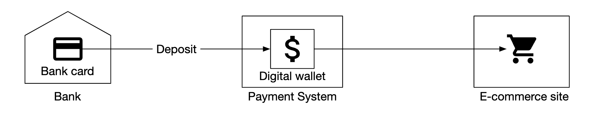
</p>
---

## Step 1: Understand the Problem and Establish Design Scope
 * C: Should we only focus on transfers between digital wallets? Should we support any other operations?
 * I: Let's focus on transfers between digital wallets for now.
 * C: How many transactions per second does the system need to support?
 * I: Let's assume 1mil TPS
 * C: A digital wallet has strict correctness requirements. Can we assume transactional guarantees are sufficient?
 * I: Sounds good
 * C: Do we need to prove correctness?
 * I: We can do that via reconciliation, but that only detects discrepancies vs. showing us the root cause for them. Instead, we want to be able to replay data from the beginning to reconstruct the history.
 * C: Can we assume availability requirement is 99.99%?
 * I: Yes
 * C: Do we need to take foreign exchange into consideration?
 * I: No, it's out of scope

Here's what we have to support in summary:
 * Support balance transfers between two accounts
 * Support 1mil TPS
 * Reliability is 99.99%
 * Support transactions
 * Support reproducibility

### **Back-of-the-envelope estimation**
A traditional relational database, provisioned in the cloud can support ~1000 TPS.

In order to reach 1mil TPS, we'd need 1000 database nodes. But if each transfer has two legs, then we actually need to support 2mil TPS.

One of our design goals would be to increase the TPS a single node can handle so that we can have less database nodes.

**And the reason that is a design goal is not cost — it is correctness complexity.** Every transfer whose two legs land on different shards needs a distributed transaction, and distributed transactions get worse as the number of participants grows:

| Nodes | Consequence |
|---|---|
| 20,000 | Almost every transfer is cross-shard; coordination dominates; the probability that *some* participant is unhealthy approaches 1 |
| 2,000 | Still mostly cross-shard |
| 200 | Fewer, shorter coordination paths; far fewer participants to fail |

So raising per-node throughput **reduces the number of distributed transactions you have to get right**, which is the expensive part of this system. Every optimisation in Step 3 — local disk instead of Kafka, append-only writes, caching the read path — is ultimately in service of that, not of hardware savings.

The 2× factor is also worth noting explicitly: **a transfer is two balance changes**, so 1 M transfers/sec is 2 M balance updates/sec. Double-entry bookkeeping ([Chapter 26](../26.%20Payment%20System/#double-entry-ledger-system)) is not optional here, and it doubles the write volume by construction.

| Per-node TPS | Node Number |
|--------------|-------------|
| 100          | 20,000      |
| 1,000        | 2,000       |
| 10,000       | 200         |

---

## Step 2: Propose High-Level Design and Get Buy-In

### **API Design**
We only need to support one endpoint for this interview:
```
POST /v1/wallet/balance_transfer - transfers balance from one wallet to another
```

Request parameters - from_account, to_account, amount (string to not lose precision), currency, transaction_id (idempotency key).

Sample response:
```
{
    "status": "success"
    "transaction_id": "01589980-2664-11ec-9621-0242ac130002"
}
```

### **In-memory sharding solution**
Our wallet application maintains account balances for every user account.

One good data structure to represent this is a `map<user_id, balance>`, which can be implemented using an in-memory Redis store.

Since one redis node cannot withstand 1mil TPS, we need to partition our redis cluster into multiple nodes.

Example partitioning algorithm:
```
String accountID = "A";
Int partitionNumber = 7;
Int myPartition = accountID.hashCode() % partitionNumber;
```

Zookeeper can be used to store the number of partitions and addresses of redis nodes as it's a highly-available configuration storage. 

Finally, a wallet service is a stateless service responsible for carrying out transfer operations. It can easily scale horizontally:

<p align="left">
    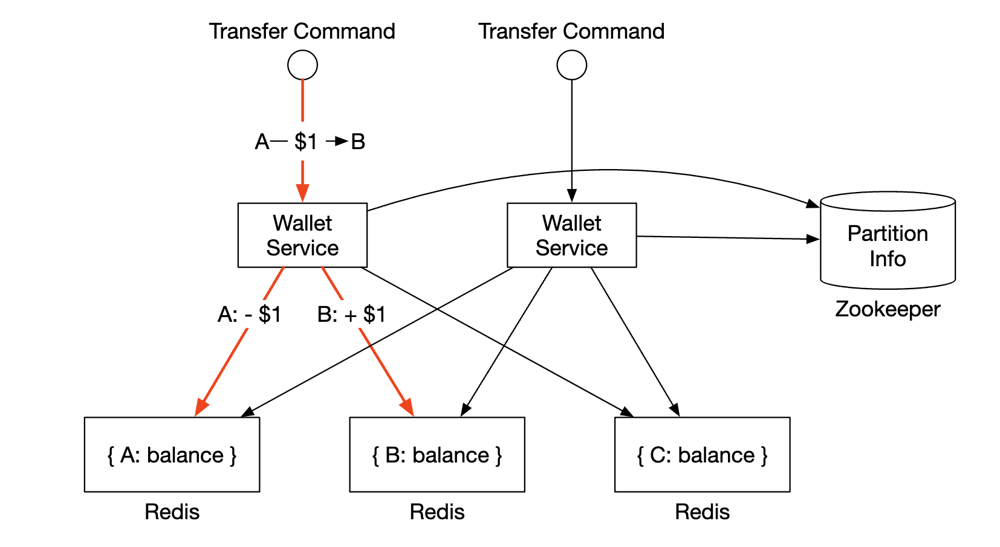
</p>
Although this solution addresses scalability concerns, it doesn't allow us to execute balance transfers atomically.

### **Distributed transactions**
One approach for handling transactions is to use the two-phase commit protocol on top of standard, sharded relational databases:

<p align="left">
    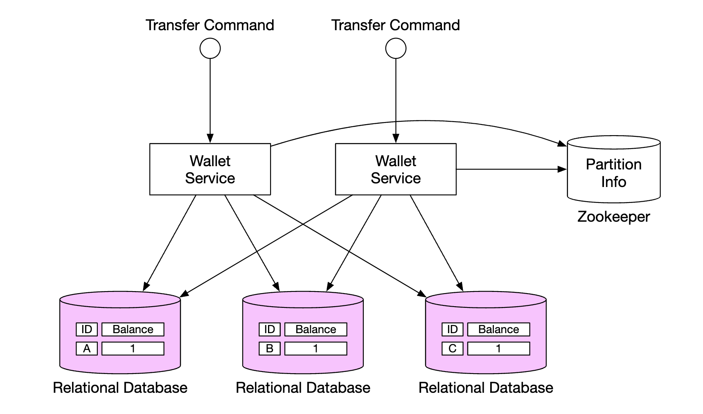
</p>
Here's how the two-phase commit (2PC) protocol works:

<p align="left">
    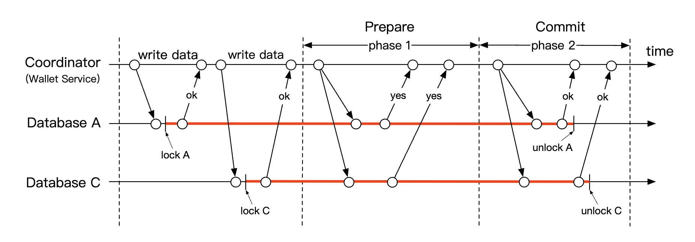
</p>
 * Coordinator (wallet service) performs read and write operations on multiple databases as normal
 * When application is ready to commit the transaction, coordinator asks all databases to prepare it
 * If all databases replied with a "yes", then the coordinator asks the databases to commit the transaction.
 * Otherwise, all databases are asked to abort the transaction

Downsides to the 2PC approach:
 * Not performant due to lock contention
 * The coordinator is a single point of failure

**Be precise about why 2PC is slow, because "lock contention" undersells it.** Locks are held on every participant from `prepare` until `commit`, which means **for the duration of a network round trip plus the slowest participant's response**. The locked rows are unavailable to everyone else for that whole window, so throughput is bounded by round-trip latency rather than by any node's capacity. At 1 M TPS that is not a tuning problem.

And the coordinator failure is worse than "single point of failure" suggests. If the coordinator dies after participants have voted `yes` but before the commit decision reaches them, those participants are **blocked holding locks and cannot safely decide anything** — committing risks violating atomicity if the decision was `abort`, and aborting risks it if the decision was `commit`. They must wait for the coordinator to return. This is the well-known blocking property of 2PC, and it is the reason the chapter moves on.

### **Distributed transaction using Try-Confirm/Cancel (TC/C)**
TC/C is a variation of the 2PC protocol, which works with compensating transactions:
 * Coordinator asks all databases to reserve resources for the transaction
 * Coordinator collects replies from DBs - if yes, DBs are asked to try-confirm. If no, DBs are asked to try-cancel.

One important difference between TC/C and 2PC is that 2PC performs a single transaction, whereas in TC/C, there are two independent transactions.

**That difference is the whole point: no locks are held across the network.** Each phase commits locally and immediately, so nothing blocks waiting for a peer. The price is that **atomicity is gone and intermediate states are visible** — between Try and Confirm, A's money has left but has not arrived.

**Which raises a money-conservation problem that is easy to miss.** If the Try phase simply debits A by $1, then for that interval the system's total balance is $1 short, and any audit run in that window finds money missing. The standard fix comes straight from double-entry: debit A and credit a **clearing (suspense) account** representing funds in flight. Then

```
A: −$1    clearing: +$1     → total unchanged
```

and Confirm moves it from clearing to C. **The invariant "total money is constant" now holds at every instant**, including mid-transaction, which is what makes continuous auditing possible. Treating in-flight money as an account rather than as an absence is the mechanism, and it is why real ledgers are full of suspense accounts.

Two more consequences of TC/C worth naming:

- **Reserved funds leak if the coordinator dies.** A Try with no Confirm or Cancel leaves A's money sitting in clearing indefinitely. You need a timeout and a reaper to cancel stale reservations — exactly the hold-and-expiry mechanism from [Chapter 22](../22.%20Hotel%20Reservation%20System/#what-is-missing-holds).
- **Cancel must be idempotent and must not fail.** A compensating action that can itself fail leaves the system in a state with no defined recovery, so compensations must be retried until they succeed, which in turn means they must be safe to repeat.

Here's how TC/C works in phases:

| Phase | Operation | A                   | C                   |
|-------|-----------|---------------------|---------------------|
| 1     | Try       | Balance change: -$1 | Do nothing          |
| 2     | Confirm   | Do nothing          | Balance change: +$1 |
|       | Cancel    | Balance change: +$1 | Do Nothing          |

Phase 1 - try:

<p align="left">
    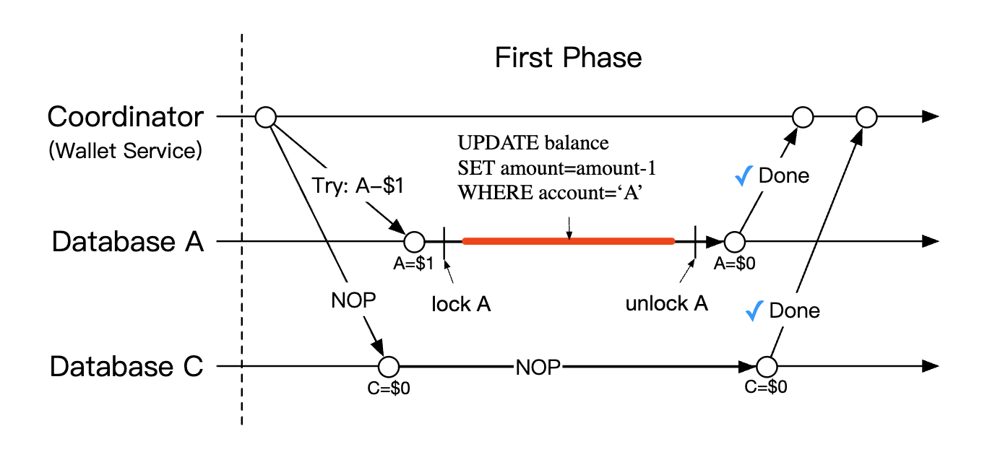
</p>
 * coordinator starts local transaction in A's DB to reduce A's balance by 1$
 * C's DB is given a NOP instruction, which does nothing

Phase 2a - confirm:

<p align="left">
    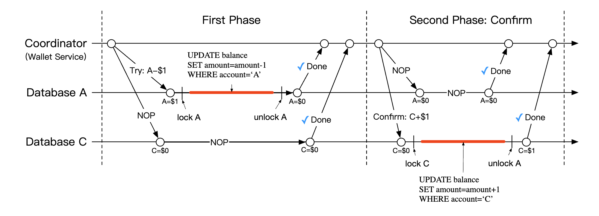
</p>
 * if both DBs replied with "yes", confirm phase starts.
 * A's DB receives NOP, whereas C's DB is instructed to increase C's balance by 1$ (local transaction)

Phase 2b - cancel:

<p align="left">
    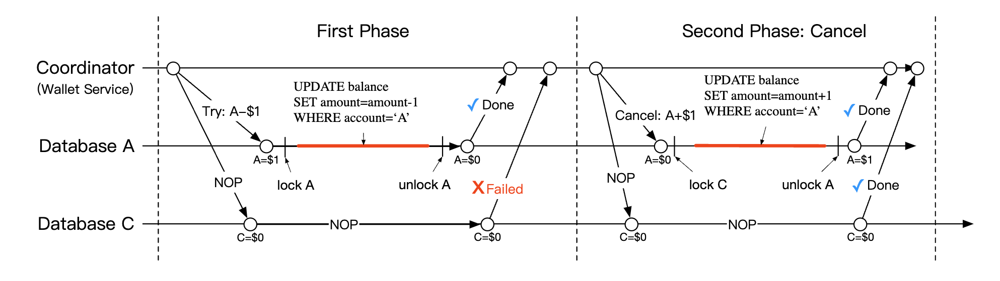
</p>
 * If any of the operations in phase 1 fails, the cancel phase starts.
 * A's DB is instructed to increase A's balance by 1$, C's DB receives NOP

Here's a comparison between 2PC and TC/C:

|      | First Phase                                            | Second Phase: success              | Second Phase: fail                        |
|------|--------------------------------------------------------|------------------------------------|-------------------------------------------|
| 2PC  | transactions are not done yet                          | Commit/Cancel all transactions     | Cancel all transactions                   |
| TC/C | All transactions are completed - committed or canceled | Execute new transactions if needed | Reverse the already committed transaction |

TC/C is also referred to as a distributed transaction by compensation. High-level operation is handled in the business logic.

Other properties of TC/C:
 * database agnostic, as long as database supports transactions
 * Details and complexity of distributed transactions need to be handled in the business logic

### **TC/C Failure modes**
If the coordinator dies mid-flight, it needs to recover its intermediary state. 
That can be done by maintaining phase status tables, atomically updated within the database shards:

<p align="left">
    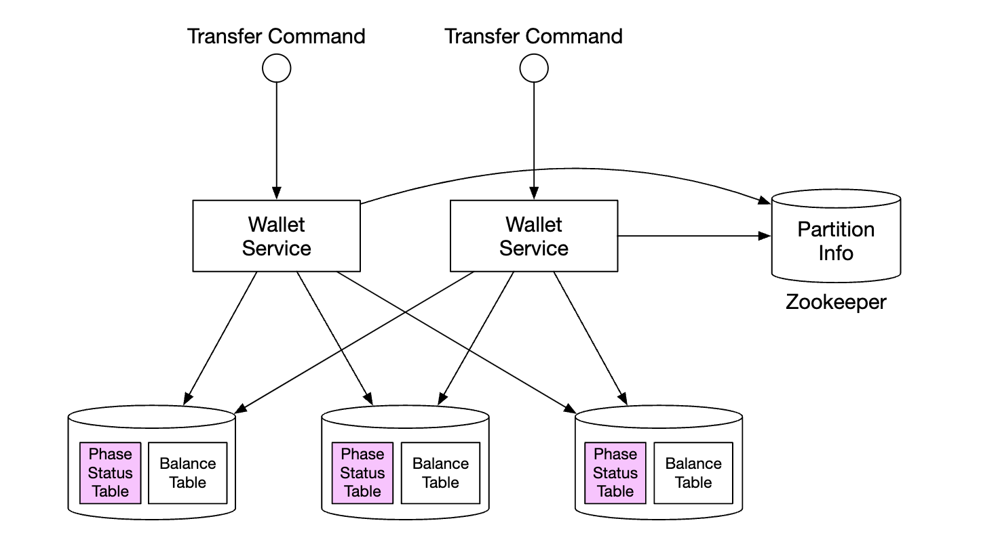
</p>
What does that table contain:
 * ID and content of distributed transaction
 * status of try phase - not sent, has been sent, response received
 * second phase name - confirm or cancel
 * status of second phase
 * out-of-order flag (explained later)

One caveat when using TC/C is that there is a brief moment where the account states are inconsistent with each other while a distributed transaction is in-flight:

<p align="left">
    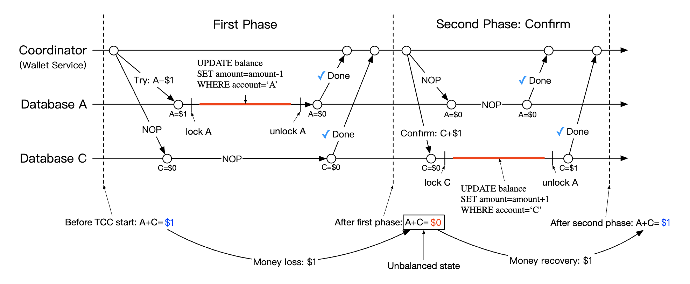
</p>
This is fine as long as we always recover from this state and that users cannot use the intermediary state to eg spend it. 
This is guaranteed by always executing deductions prior to additions.

| Try phase choices  | Account A | Account C |
|--------------------|-----------|-----------|
| Choice 1           | -$1       | NOP       |
| Choice 2 (invalid) | NOP       | +$1       |
| Choice 3 (invalid) | -$1       | +$1       |

Note that choice 3 from table above is invalid because we cannot guarantee atomic execution of transactions across different databases without relying on 2PC.

One edge-case to address is out of order execution:

<p align="left">
    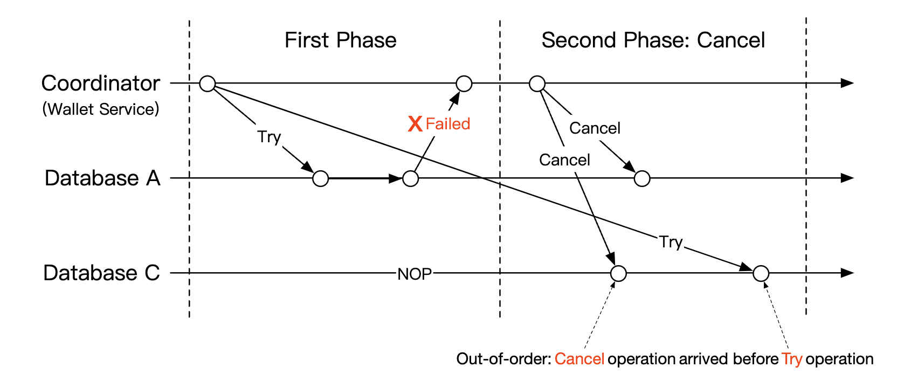
</p>
It is possible that a database receives a cancel operation, before receiving a try. This edge case can be handled by adding an out of order flag in our phase status table.
When we receive a try operation, we first check if the out of order flag is set and if so, a failure is returned.

### **Distributed transaction using Saga**
Another popular approach is using Sagas - a standard for implementing distributed transactions with microservice architectures.

Here's how it works:
 * all operations are ordered in a sequence. All operations are independent in their own databases.
 * operations are executed from first to last
 * when an operation fails, the entire process starts to roll back until the beginning with compensating operations

<p align="left">
    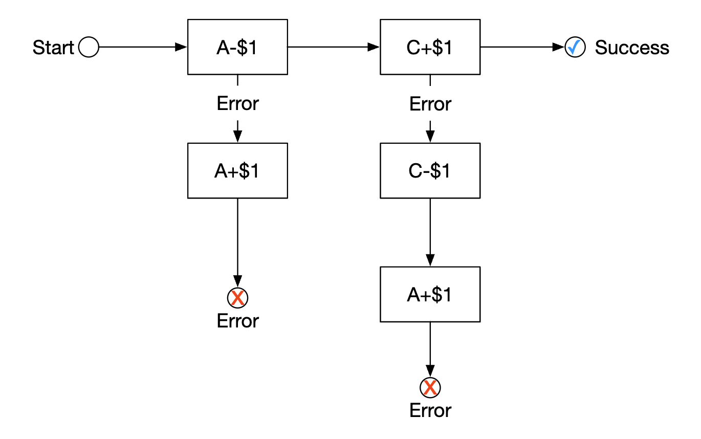
</p>
How do we coordinate the workflow? There are two approaches we can take:
 * Choreography - all services involved in a saga subscribe to the related events and do their part in the saga
 * Orchestration - a single coordinator instructs all services to do their jobs in the correct order

The challenge of using choreography is that business logic is split across multiple service, which communicate asynchronously.
The orchestration approach handles complexity well, so it is typically the preferred approach in a digital wallet system.

Here's a comparison between TC/C and Saga:

|                                           | TC/C            | Saga                     |
|-------------------------------------------|-----------------|--------------------------|
| Compensating action                       | In Cancel phase | In rollback phase        |
| Central coordination                      | Yes             | Yes (orchestration mode) |
| Operation execution order                 | any             | linear                   |
| Parallel execution possibility            | Yes             | No (linear execution)    |
| Could see the partial inconsistent status | Yes             | Yes                      |
| Application or database logic             | Application     | Application              |

The main difference is that TC/C is parallelizable, so our decision is based on the latency requirement - if we need to achieve low latency, we should go for the TC/C approach.

Regardless of the approach we take, we still need to support auditing and replaying history to recover from failed states.

### **Event sourcing**
In real-life, a digital wallet application might be audited and we have to answer certain questions:
 * Do we know the account balance at any given time?
 * How do we know the historical and current balances are correct?
 * How do we prove the system logic is correct after a code change?

Event sourcing is a technique which helps us answer these questions.

It consists of four concepts:
 * command - intended action from the real world, eg transfer 1$ from account A to B. Need to have a global order, due to which they're put into a FIFO queue.
   * commands, unlike events, can fail and have some randomness due to eg IO or invalid state.
   * commands can produce zero or more events
   * event generation can contain randomness such as external IO. This will be revisited later
 * event - historical facts about events which occurred in the system, eg "transferred 1$ from A to B".
   * unlike commands, events are facts that have happened within our system
   * similar to commands, they need to be ordered, hence, they're enqueued in a FIFO queue
 * state - what has changed as a result of an event. Eg a key-value store between account and their balances.
 * state machine - drives the event sourcing process. It mainly validates commands and applies events to update the system state.
   * the state machine should be deterministic, hence, it shouldn't read external IO or rely on randomness. 

**That last bullet is the single most important sentence in the chapter, and everything the design claims rests on it.** Reproducibility means: take the event list, feed it through the state machine, and get *exactly* the state the system had. That holds only if the state machine is a pure function of its inputs — so the moment it reads the clock, generates a random ID, calls an external service, or iterates a hash map in an unspecified order, replay can diverge and the audit guarantee silently evaporates.

The discipline this imposes is specific and worth stating: **every non-deterministic input must be resolved before the event is written, and recorded inside it.** The command may say "transfer $1 from A to B"; the event must say "at timestamp T, with fee F computed at rate R, transferred $1 from A to B" — with T, F and R baked in as facts. Replay then reads them rather than recomputing them.

**This is also why the chapter replicates the *event* log and not the command log**, which otherwise looks like an arbitrary choice:

| | Commands | Events |
|---|---|---|
| Nature | Requests — "please do this" | Facts — "this happened" |
| Can fail / be rejected | **Yes** | **No** — already happened |
| Deterministic | **No** — validation depends on current state and external input | **Yes** |
| Replayable | **No** — replaying could produce different events | **Yes** — always produces identical state |
| Must be durable? | No | **Yes — this is the only data that cannot be regenerated** |

State and snapshots are derived and rebuildable. The event list is not. That is the reliability analysis in one table, and it is the same source-of-truth-plus-projection structure as the ledger and wallet in [Chapter 26](../26.%20Payment%20System/#double-entry-ledger-system), the raw events and aggregates in [Chapter 21](../21.%20Ad%20Click%20Event%20Aggregation/), and the score log and sorted set in [Chapter 25](../25.%20Real-time%20Gaming%20Leaderboard/).

<p align="left">
    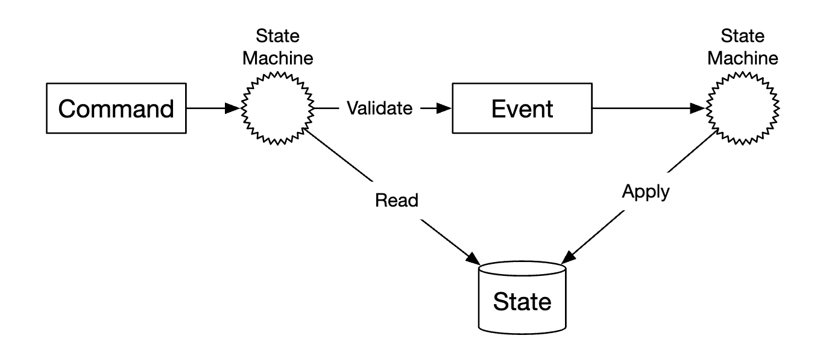
</p>
Here's a dynamic view of event sourcing:

<p align="left">
    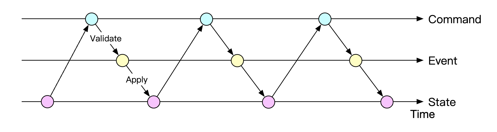
</p>
For our wallet service, the commands are balance transfer requests. We can put them in a FIFO queue, such as Kafka:

<p align="left">
    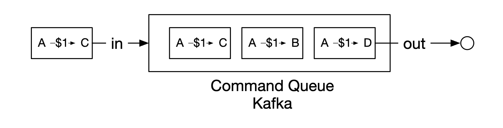
</p>
Here's the full picture:

<p align="left">
    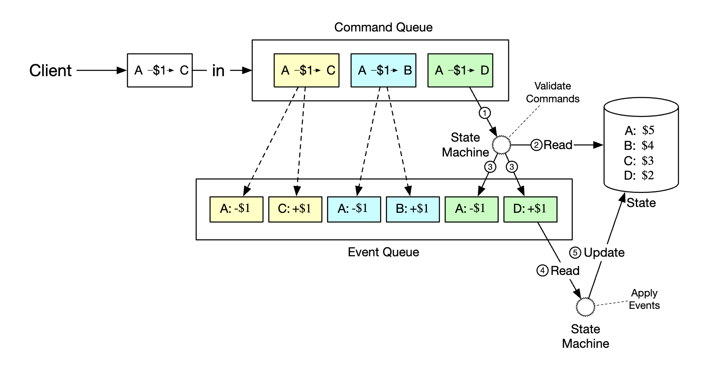
</p>
 * state machine reads commands from the command queue
 * balance state is read from the database
 * command is validated. If valid, two events for each of the accounts is generated
 * next event is read and applied by updating the balance (state) in the database

The main advantage of using event sourcing is its reproducibility. In this design, all state update operations are saved as immutable history of all balance changes.

Historical balances can always be reconstructed by replaying events from the beginning. 
Because the event list is immutable and the state machine is deterministic, we are guaranteed to succeed in replaying any of the intermediary states.

<p align="left">
    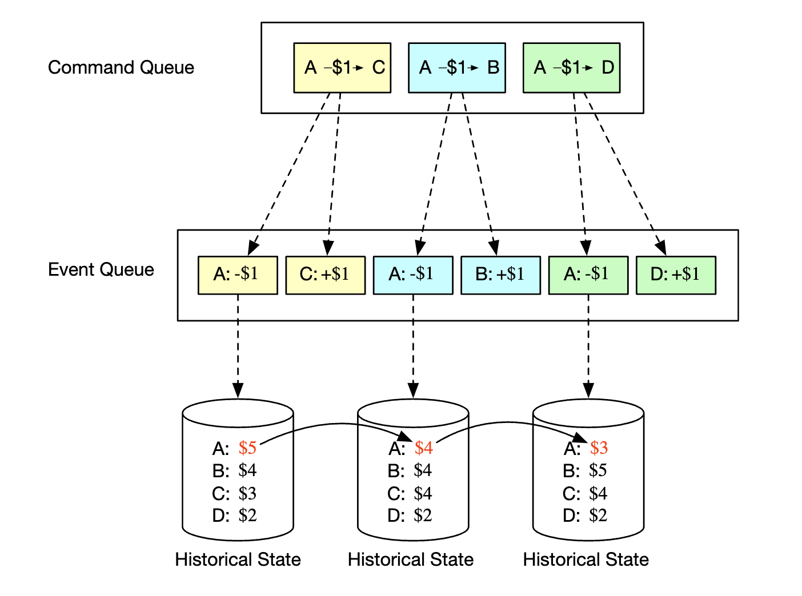
</p>
All audit-related questions asked in the beginning of the section can be addressed by relying on event sourcing:
 * Do we know the account balance at any given time? - events can be replayed from the start until the point which we are interested in
 * How do we know the historical and current balances are correct? - correctness can be verified by recalculating all events from the start
 * How do we prove the system logic is correct after a code change? - we can run different versions of the code against the events and verify their results are identical

That third answer is more powerful than it sounds: it is **regression testing against the entire production history.** Rather than hoping a test suite covers the interesting cases, you replay every transaction that has ever happened through the new code and diff the resulting state against the old. For financial logic — fee calculations, rounding rules, limit checks — this is about as strong an assurance as is available, and it exists only because the event log is complete and the state machine is deterministic.

**The cost that comes with it: replay time grows without bound.** Rebuilding state from genesis is fine in month one and impossible in year five. The fix is **periodic snapshots** — persist the full state at event N, and replay only from there — which is why the chapter lists "state and snapshot" together as regenerable. The snapshot is an optimisation, never a source of truth: it must always be reconstructible from the events, and it is the first thing to discard if it is ever suspected.

> **Interview angle:** this chapter is best answered as a narrative rather than a diagram — "Redis is fast but not durable, so relational with 2PC; 2PC holds locks across the network, so TC/C or saga; now I've lost atomicity and auditability, so event sourcing; the external log is too slow, so local disk; now I'm stateful, so Raft; now I'm capped at one group, so sharded groups with a saga." Each step is forced by the previous step's defect. Then be ready for the two follow-ups that separate depth from recall: "what exactly must be deterministic, and what breaks if it isn't?" and "during a transfer, where is the money?" — the clearing account.

Answering client queries about their balance can be addressed using the CQRS architecture - there can be multiple read-only state machines which are responsible for querying the historical state, based on the immutable events list:

<p align="left">
    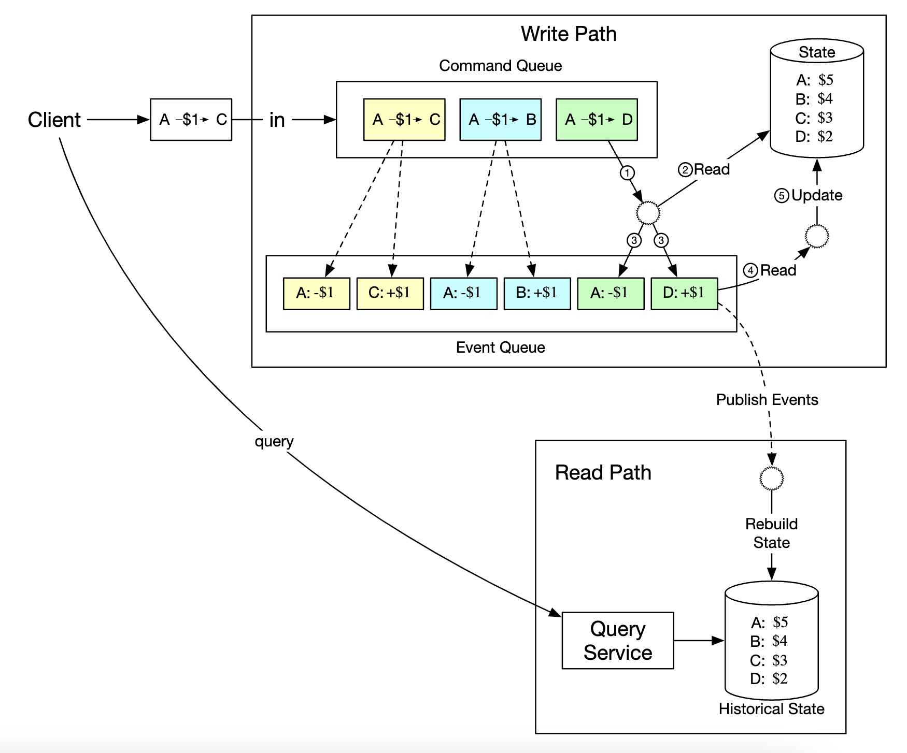
</p>
---

## Step 3: Design Deep Dive
In this section we'll explore some performance optimizations as we're still required to scale to 1mil TPS.

### **High-performance event sourcing**
The first optimization we'll explore is to save commands and events into local disk store instead of an external store such as Kafka.

This avoids the network latency and also, since we're only doing appends, that operation is generally fast for HDDs.

This is the same argument as [Chapter 19](../19.%20Distributed%20Message%20Queue/#the-number-that-justifies-the-whole-storage-design), and the numbers from there apply directly: sequential disk writes run at **100–200 MB/s** against roughly **0.4–1 MB/s** for random I/O — two to three orders of magnitude. An append-only event log is the single most disk-friendly access pattern there is, and writing it locally removes the network round trip that Kafka would add to every transaction.

What is being traded away is worth naming: Kafka gave you durability and replication for free. Taking the log in-process means **you now owe both of them yourself**, which is precisely what the next two sections are about.

The next optimization is to cache recent commands and events in-memory in order to save the time of loading them back from disk.

At a low-level, we can achieve the aforementioned optimizations by leveraging a command called mmap, which stores data in local disk as well as cache it in-memory:

<p align="left">
    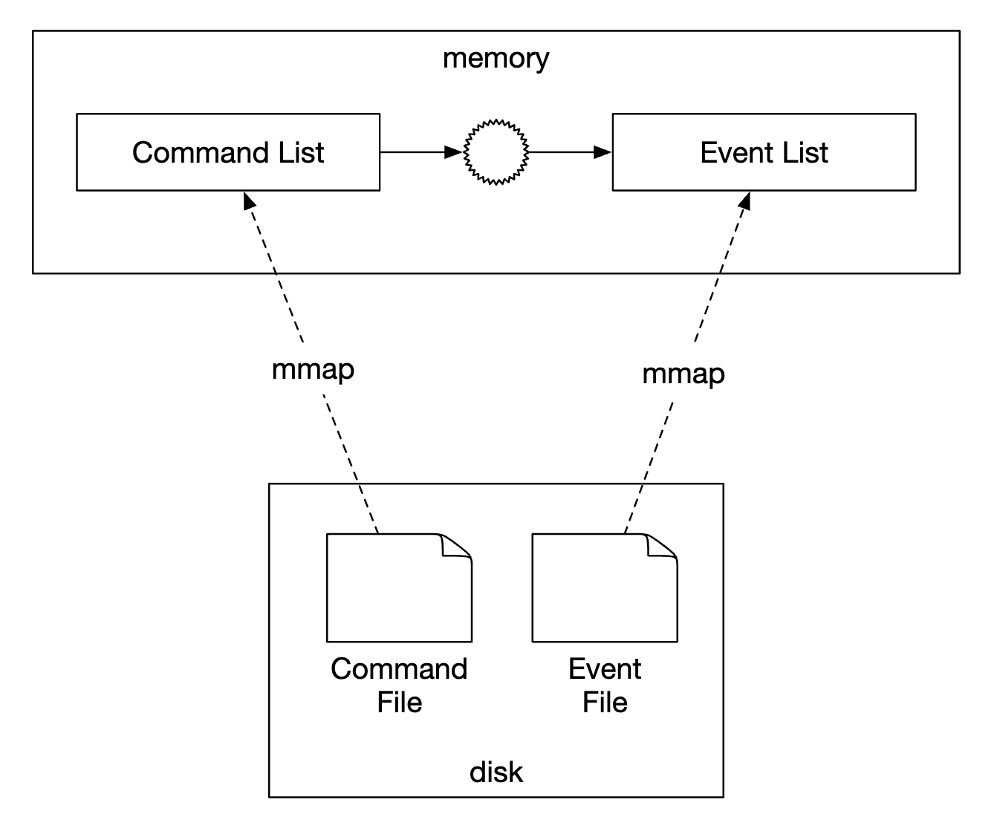
</p>
The next optimization we can do is also store state in the local file system using SQLite - a file-based local relational database. RocksDB is also another good option.

For our purposes, we'll choose RocksDB because it uses a log-structured merge-tree (LSM), which is optimized for write operations.
Read performance is optimized via caching.

<p align="left">
    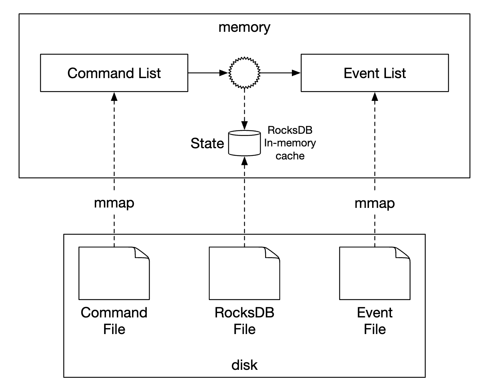
</p>
To optimize the reproducibility, we can periodically save snapshots to disk so that we don't have to reproduce a given state from the very beginning every time. We could store snapshots as large binary files in distributed file storage, eg HDFS:

<p align="left">
    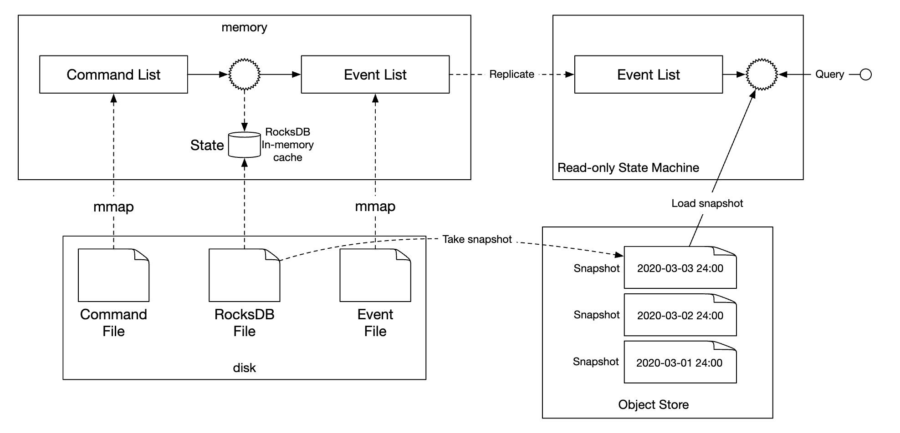
</p>
### **Reliable high-performance event sourcing**
All the optimizations done so far are great, but they make our service stateful. We need to introduce some form of replication for reliability purposes.

Before we do that, we should analyze what kind of data needs high reliability in our system:
 * state and snapshot can always be regenerated by reproducing them from the events list. Hence, we only need to guarantee the event list reliability.
 * one might think we can always regenerate the events list from the command list, but that is not true, since commands are non-deterministic.
 * conclusion is that we need to ensure high reliability for the events list only

In order to achieve high reliability for events, we need to replicate the list across multiple nodes. We need to guarantee:
 * that there is no data loss
 * the relative order of data within a log file remains the same across replicas

To achieve this, we can employ a consensus algorithm, such as Raft.

**The fit between Raft and event sourcing is unusually tight, and not by coincidence.** Raft's job is to maintain *a replicated, totally-ordered, append-only log* across a set of nodes — which is exactly the data structure event sourcing needs. Both are built around "an ordered sequence of immutable entries, applied in order to a deterministic state machine"; Raft even uses that terminology. So rather than bolting replication onto an event log, you are using a protocol whose native abstraction *is* an event log.

Two properties worth stating precisely:

- **A majority quorum is what provides durability.** An entry is committed once more than half the nodes have it, so with 5 nodes the system survives 2 failures and loses nothing — committing to a majority guarantees any future leader's log contains that entry.
- **"More than half" is also what prevents split-brain.** Two disjoint majorities cannot exist, so two leaders cannot both commit. That is why the group size is odd and why availability requires a majority rather than merely one survivor.

The honest cost: **a write now requires a round trip to a majority before it is acknowledged.** Local disk made writes fast; Raft puts a network hop back on the critical path — just one, to peers you choose, rather than to an external system.

With Raft, there is a leader who is active and there are followers who are passive. If a leader dies, one of the followers picks up. 
As long as more than half of the nodes are up, the system continues running.

<p align="left">
    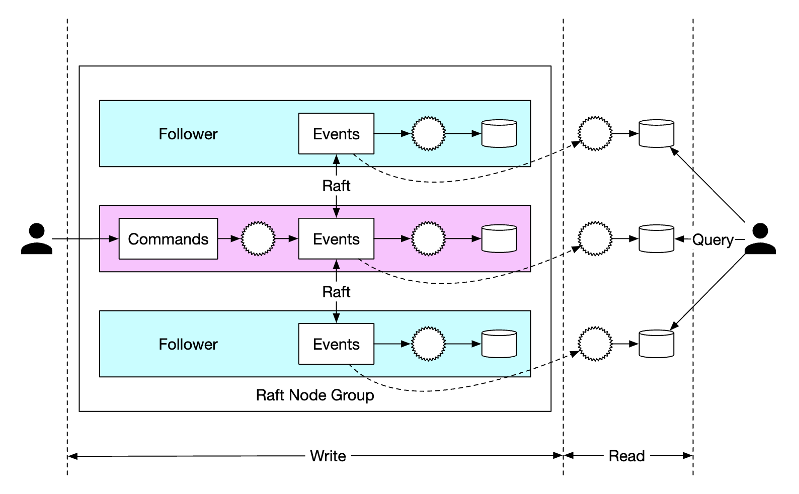
</p>
With this approach, all nodes update the state, based on the events list. Raft ensures leader and followers have the same events list.

### **Distributed event sourcing**
So far, we've managed to design a system which has high single-node performance and is reliable.

Some limitations we have to tackle:
 * The capacity of a single raft group is limited. At some point, we need to shard the data and implement distributed transactions
 * In the CQRS architecture, the request/response flow is slow. A client would need to periodically poll the system to learn when their wallet has been updated

Polling is not real-time, hence, it can take a while for a user to learn about an update in their balance. Also, it can overload the query services if the polling frequency is too high:

<p align="left">
    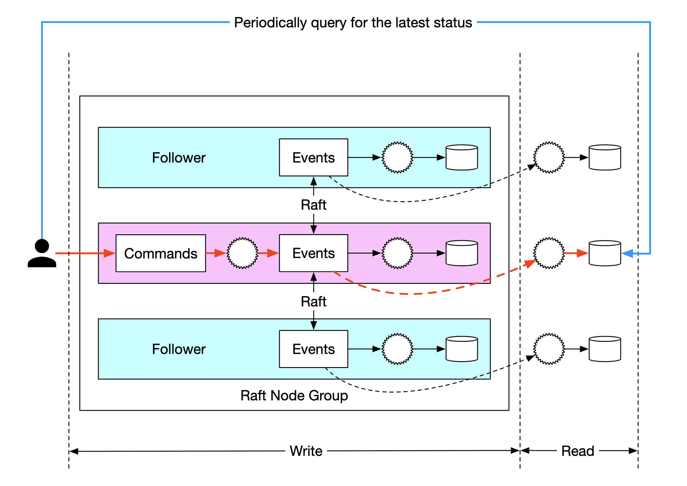
</p>
To mitigate the system load, we can introduce a reverse proxy, which sends commands on behalf of the user and polls for response on their behalf:

<p align="left">
    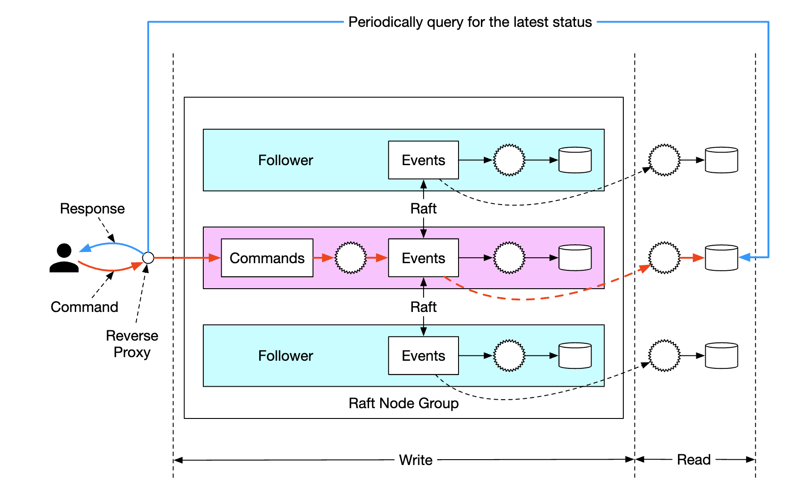
</p>
This alleviates the system load as we could fetch data for multiple users using a single request, but it still doesn't solve the real-time receipt requirement.

One final change we could do is make the read-only state machines push responses back to the reverse proxy once it's available. This can give the user the sense that updates happen real-time:

<p align="left">
    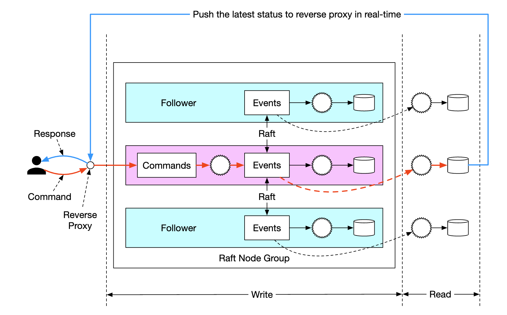
</p>
Finally, to scale the system even further, we can shard the system into multiple raft groups, where we implement distributed transactions on top of them using an orchestrator either via TC/C or Sagas:

<p align="left">
    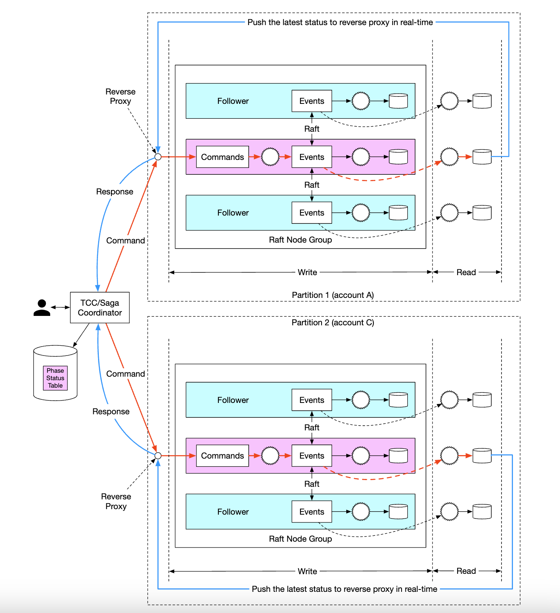
</p>
Here's an example lifecycle of a balance transfer request in our final system:
 * User A sends a distributed transaction to the Saga coordinator with two operations - `A-1` and `C+1`.
 * Saga coordinator creates a record in the phase status table to trace the status of the transaction
 * Coordinator determines which partitions it needs to send commands to.
 * Partition 1's raft leader receives the `A-1` command, validates it, converts it to an event and replicates it across other nodes in the raft group
 * Event result is synchronized to the read state machine, which pushes a response back to the coordinator
 * Coordinator creates a record indicating that the operation was successful and proceeds with the next operation - `C+1`
 * Next operation is executed similarly to the first one - partition is determined, command is sent, executed, read state machine pushes back a response
 * Coordinator creates a record indicating operation 2 was also successful and finally informs the client of the result

**Note what the phase status table is doing: it makes the saga itself event-sourced.** The coordinator records each step's outcome durably before proceeding, so a coordinator that dies mid-transfer can be replaced by one that reads the table and continues — or compensates. Without it, a crashed coordinator leaves a transfer half-applied with nobody knowing which half. It is the same "persisted to-do list" device as the `ledger_updated` / `wallet_updated` flags in [Chapter 26](../26.%20Payment%20System/#payment-service-data-model), applied to a distributed transaction.

**And here is the limitation the sharded design cannot remove: a hot account.** A popular merchant's wallet receives transfers from everyone, but its balance lives in exactly one Raft group with exactly one leader, so all of those writes serialise through one node. You cannot shard a single account's balance, because the invariant being protected — the balance — *is* the thing you would be splitting. This is the same wall as the hot inventory row in [Chapter 22](../22.%20Hotel%20Reservation%20System/#the-deadlock-the-chapter-does-not-mention) and the hot ad in [Chapter 21](../21.%20Ad%20Click%20Event%20Aggregation/#scale-the-system), and the available responses are the same three: serialise deliberately and accept the ceiling, batch many transfers into one update, or split the account into sub-balances and sum them — at which point "what is my balance" becomes a scatter-gather and the simple invariant is gone.

---

## Step 4: Wrap Up
Here's the evolution of our design:
 * We started from a solution using an in-memory Redis. The problem with this approach is that it is not durable storage.
 * We moved on to using relational databases, on top of which we execute distributed transactions using 2PC, TC/C or distributed saga.
 * Next, we introduced event sourcing in order to make all the operations auditable
 * We started by storing the data into external storage using external database and queue, but that's not performant
 * We proceeded to store data in local file storage, leveraging the performance of append-only operations. We also used caching to optimize the read path
 * The previous approach, although performant, wasn't durable. Hence, we introduced Raft consensus with replication to avoid single points of failure
 * We also adopted CQRS with a reverse proxy to manage a transaction's lifecycle on behalf of our users

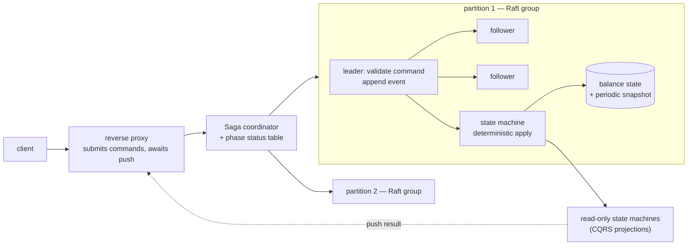
```mermaid
flowchart LR
    U["client"] --> RP["reverse proxy<br/>submits commands, awaits push"]
    RP --> SC["Saga coordinator<br/>+ phase status table"]
    SC --> P1["partition 1 — Raft group"]
    SC --> P2["partition 2 — Raft group"]
    subgraph P1["partition 1 — Raft group"]
        L1["leader: validate command<br/>append event"] --> F1["follower"]
        L1 --> F2["follower"]
        L1 --> SM1["state machine<br/>deterministic apply"]
        SM1 --> ST1[("balance state<br/>+ periodic snapshot")]
    end
    SM1 --> RO["read-only state machines<br/>(CQRS projections)"]
    RO -.->|"push result"| RP
```

---

### Gotchas & failure modes

- **Any non-determinism in the state machine destroys the audit guarantee, silently.** A clock read, a random ID, an external call, or an unordered map iteration can make replay diverge from production. Resolve every non-deterministic input *before* writing the event and record it inside the event.
- **Events are a permanent API.** Code written in year five must still correctly replay events written in year one, so event schemas can only be extended, never changed or removed, and every version's semantics must be preserved in the replay path forever. This is the real long-term cost of event sourcing, and it is usually underestimated.
- **Replay time grows without bound.** Snapshots are mandatory, not an optimisation — but a snapshot must never become a source of truth, and must always be reconstructible from the events.
- **Replaying only the commands does not work.** Commands are non-deterministic and can be rejected; replaying them may produce different events. The event log is the only data that cannot be regenerated, which is why it is the only thing that must be replicated.
- **TC/C's Try phase can appear to destroy money.** Debiting A without crediting anything leaves the global total short for the duration. Credit a clearing account so the conservation invariant holds at every instant.
- **A reservation with no Confirm or Cancel leaks funds indefinitely.** Timeouts and a reaper are required, exactly as with reservation holds.
- **A compensating action that fails has no defined recovery.** Compensations must be idempotent and retried until they succeed; a Cancel that can permanently fail is a design defect.
- **Saga exposes intermediate states.** With A debited and C not yet credited, a balance query sees an inconsistent world. Either model in-flight funds explicitly or make the read path aware of pending transactions.
- **2PC blocks participants when the coordinator dies after voting.** Locks are held with no safe unilateral decision available.
- **A stateful service is operationally heavier.** Local event logs mean node identity matters, deploys must preserve data, restores take as long as replay, and you cannot treat instances as interchangeable.
- **Raft commits need a majority, so losing it stops writes.** A 3-node group tolerates one failure; a 5-node group tolerates two. Partition the group and the minority side must refuse writes — correctly, but it is unavailable.
- **A hot account is a hard ceiling.** One account is one Raft group is one leader. The balance invariant is what prevents splitting it.
- **Overdraft validation must live inside the deterministic state machine.** If the balance check happens anywhere else — in a service that read a stale cache, say — replay will not reproduce the decision, and the system can create money.
- **Commands need idempotency keys too.** The `transaction_id` in the API is that key; without it a client retry submits a second transfer. The uniqueness must be enforced where the command is accepted, not later.
- **Ordering must come from the log, not from timestamps.** Wall clocks across nodes disagree; the event log's position is the only authoritative order. Using timestamps to sequence events reintroduces clock skew as a correctness bug.
- **CQRS read projections lag the write side.** A user who completes a transfer and immediately queries their balance may not see it — hence the push mechanism. Read-your-own-writes needs explicit handling.
- **Reconciliation is still required.** Event sourcing proves your state matches your events; it cannot prove your events match the outside world. Where the wallet touches external rails, [Chapter 26](../26.%20Payment%20System/#reconciliation)'s reconciliation applies unchanged.

---

## The design, as problem and technique

| Goal / problem | Technique |
|---|---|
| Money must never be created or destroyed | Double-entry balance changes; conservation checkable at every instant |
| Proving correctness, not just detecting error | Event sourcing — immutable event log plus a deterministic state machine |
| Answering "what was the balance at time T?" | Replay events up to T |
| Validating a code change against reality | Replay the full history through both versions and diff the resulting state |
| Replay getting slower forever | Periodic snapshots, always reconstructible from events |
| Atomicity across shards without distributed locks | TC/C or Saga with compensating transactions |
| Money appearing to vanish mid-transfer | Clearing/suspense account holding in-flight funds |
| Abandoned reservations | Timeout plus a reaper that cancels stale Try phases |
| Surviving a coordinator crash mid-saga | Phase status table — the saga's own durable to-do list |
| Removing the network hop from the write path | Append the event log to local disk instead of Kafka |
| Durability of a local log | Raft replication to a majority quorum |
| Avoiding split-brain | Majority quorum — two disjoint majorities cannot exist |
| Scaling past one Raft group | Shard into multiple groups; coordinate cross-shard transfers with a saga |
| Clients learning their transfer completed | CQRS read projections, with the reverse proxy receiving a push |
| Duplicate transfer submissions | `transaction_id` as an idempotency key at command acceptance |
| Deterministic ordering | The position in the event log — never wall-clock timestamps |

## Self-check
1. Which constraint here is one the business cannot absorb, and which earlier chapter shows the opposite case?
2. Narrate the chapter's seven designs as a chain of forced moves: what each fixes and what each costs.
3. 1 M transfers/sec means how many balance updates/sec, and why?
4. Why is raising per-node throughput a *correctness* goal and not just a cost goal?
5. Why does a coordinator failure in 2PC leave participants unable to decide anything?
6. During a TC/C Try phase, money has left A and not arrived at C. What invariant breaks, and what accounting device repairs it?
7. What happens to reserved funds if the coordinator dies between Try and Confirm?
8. State the difference between a command and an event along four dimensions.
9. Why is the event log replicated rather than the command log?
10. Name four ways a state machine can be accidentally non-deterministic, and what each breaks.
11. How do you verify that a change to fee logic is correct? What makes that possible?
12. Why are snapshots mandatory, and what must never be true of them?
13. Why does Raft's abstraction fit event sourcing so naturally?
14. Why must a Raft group have an odd number of nodes and a majority to commit?
15. A merchant account receives transfers from a million users. Why can't you shard it, and what are the options?
16. Where must the overdraft check live, and what goes wrong if it lives elsewhere?

## Glossary

| Term | Meaning |
|---|---|
| **Two-phase commit (2PC)** | Prepare-then-commit across participants; atomic, blocking, coordinator-dependent |
| **TC/C (Try-Confirm/Cancel)** | Two independent local transactions — reserve, then confirm or compensate |
| **Saga** | A sequence of local transactions with compensating actions on failure |
| **Compensating transaction** | The opposite operation undoing an earlier committed step |
| **Clearing / suspense account** | An account holding in-flight funds so the total is conserved mid-transfer |
| **Command vs event** | A request that may fail vs a recorded fact that already happened |
| **Event sourcing** | Storing the immutable event log as the source of truth; state is derived by replay |
| **Deterministic state machine** | Applies events to state with no external input, so replay is exact |
| **Reproducibility** | The ability to reconstruct any historical state by replaying events |
| **Snapshot** | Persisted state at a known event offset, shortening replay |
| **CQRS** | Separating the write path (state machine) from read projections |
| **Raft** | Consensus protocol maintaining a replicated, ordered, append-only log |
| **Majority quorum** | More than half the nodes — what makes a commit durable and split-brain impossible |
| **Raft group / partition** | One replicated log and its nodes; the unit of sharding |
| **Phase status table** | The coordinator's durable record of a saga's progress |
| **Hot account** | An account whose write rate exceeds one Raft group, and which cannot be split |

## Where to go next
- [Chapter 26 – Payment System](../26.%20Payment%20System/) — the double-entry ledger and reconciliation this chapter builds on, and the external rails it eventually touches.
- [Chapter 19 – Distributed Message Queue](../19.%20Distributed%20Message%20Queue/) — the replicated append-only log as a product, including the sequential-I/O numbers used here.
- [Chapter 22 – Hotel Reservation System](../22.%20Hotel%20Reservation%20System/) — sagas, holds and reapers where the compensating action genuinely undoes the earlier step.
- [Chapter 6 – Design A Key-Value Store](../06.%20Key-Value%20Store/#3-consistency) — quorums and the consistency/availability trade-off Raft resolves toward consistency.
- [Chapter 28 – Stock Exchange](../28.%20Stock%20Exchange/) — a deterministic state machine over an ordered event log again, with latency as the dominant requirement.
 * Finally, we partitioned our data across multiple raft groups, which are orchestrated using a distributed transaction mechanism - TC/C or distributed saga
