# Chapter 28: Stock Exchange

## Introduction
We'll design an **electronic stock exchange** in this chapter.

Its basic function is to efficiently match buyers and sellers.

**The one-sentence version:** **latency is the requirement that reshapes everything else.** At a target of tens of microseconds, every architectural convenience the rest of these notes rely on — microservices, network calls between them, message brokers, logging, locks, garbage collection, even disk — costs more than the entire latency budget. So this design runs the usual advice backwards: **one machine, one thread, shared memory, no disk, no locks, no allocations.**

That makes this chapter the collection's deliberate counter-example. Every other system here scales *out*, because its constraint is volume. This one scales *in*, because its constraint is the speed of a single decision — and the useful lesson is that "distribute it" is an answer to a particular kind of problem, not a universal principle.

Two other threads run through it:

- **The matching engine is a deterministic state machine over an ordered log** — the same structure as [Chapter 27](../27.%20%20Digital%20Wallet/#event-sourcing) and [Chapter 19](../19.%20Distributed%20Message%20Queue/). Here determinism buys fault tolerance as well as auditability, because a replica fed the same sequence arrives at the same state.
- **Fairness is a functional requirement.** Delivering market data to one subscriber microseconds before another hands them a tradeable advantage, so equal delivery is a regulatory obligation rather than a nicety — which is why multicast and cable-length equalisation appear in a software design.

Major stock exchanges are **NYSE**, **NASDAQ**, among others.

<p align="left">
    
</p>

---

## Step 1: Understand the Problem and Establish Design scope
 * C: Which securities are we going to trade? Stocks, options or futures?
 * I: Only stocks for simplicity
 * C: Which order types are supported - place, cancel, replace? What about limit, market, conditional orders?
 * I: We need to support placing and canceling an order. We need to only consider limit orders for the order type.
 * C: Does the system need to support after hours trading?
 * I: No, just normal trading hours
 * C: Could you describe the exchange's basic functions?
 * I: Clients can place or cancel limit orders and receive matched trades in real-time. They should be able to see the order book in real time.
 * C: What's the scale of the exchange?
 * I: Tens of thousands of users trading at the same time and ~100 symbols. Billions of orders per day. We need to also support risk checks for compliance.
 * C: What kind of risk checks?
 * I: Let's do simple risk checks - eg limiting a user to trade only 1mil apple stocks in a day
 * C: How about user wallet engagement?
 * I: We need to ensure clients have sufficient funds before placing orders. Funds meant for pending orders need to be withheld until order is finalized.

### **Non-functional requirements**
The scale mentioned by the interviewer hints that we are to design a small to medium scale exchange.
We need to also ensure flexibility to support more symbols and users in the future.

Other non-functional requirements:
 * Availability - At least 99.99%. Downtime can harm reputation
 * Fault tolerance - fault tolerance and a fast recovery mechanism are needed to limit the impact of a production incident
 * Latency - Round-trip latency should be in the ms level with focus on 99th percentile. Persistently high 99p latency causes a bad experience for a handful of users.
 * Security - We should have an account management system. For legal compliance, we need to support KYC to verify user identity. We should also protect against DDoS for public resources.

### **Back-of-the-envelope estimation**
 * 100 symbols, 1bil orders per day
 * Normal trading hours are from 09:30 to 16:00 (6.5h)
 * QPS = 1bil / 6.5 / 3600 = 43000
 * Peak QPS = 5*QPS = 215000
 * Trading volume is significantly higher when the market opens

### The number that rules out almost every design in these notes

43,000 orders/sec sustained and ~215,000 at peak is a middling throughput by the standards of these notes. **The latency target is what makes it hard.** At 215,000 orders/sec, orders arrive about every **4.6 microseconds** — so a single-threaded matching engine has roughly that long to handle one, and the end-to-end target is "tens of microseconds".

Now put that budget next to what operations actually cost:

| Operation | Typical latency | Fraction of a ~50 μs budget |
|---|---|---|
| L1 cache reference | ~1 ns | 0.002% |
| Main memory reference | ~100 ns | 0.2% |
| Reading 1 MB sequentially from memory | ~10 μs | 20% |
| **One network round trip inside a data centre** | **~100–500 μs** | **200–1000% — exceeds the entire budget** |
| SSD random read | ~100 μs | ~200% |
| **A single stop-the-world GC pause** | **~10 ms** | **~20,000%** |
| Cross-country network round trip | ~50 ms | ~100,000% |

**One network hop costs more than the whole budget.** That single row is the entire justification for the chapter's unusual architecture: if a service call to a risk checker, a wallet or a sequencer costs 200 μs, then *any* distributed design is disqualified before you consider its merits. There is no amount of tuning that makes a network round trip fit inside tens of microseconds.

Which forces, in order:

1. **No network on the critical path** → put every hot-path component in one process or one machine.
2. **No disk on the critical path** → `mmap` a file in `/dev/shm`, so the "event store" is RAM.
3. **No locks** → a single pinned thread, so there is nothing to contend.
4. **No garbage collection pauses** → preallocate, pool objects, allocate nothing on the hot path.

**And note the market-open burst.** The chapter observes volume is much higher at the open, which means the 5× peak multiplier is a daily average peak, not the real worst case — the first seconds of trading are far spikier, and they are the moment the system is least warmed up.

> **Interview angle:** quote one latency number — a same-datacenter round trip at hundreds of microseconds against a budget of tens — and the whole "why is this on one server?" discussion resolves itself. Candidates who propose a microservice architecture here have not costed a network hop.

## Step 2: Propose High-Level Design and Get Buy-In

### **Business Knowledge 101**
Let's discuss some basic concepts, related to an exchange.

A broker mediates interactions between an exchange and end users - Robinhood, Fidelity, etc.

Institutional clients trade in large quantities using specialized trading software. They need specialized treatment.
Eg order splitting when trading in large volumes to avoid impacting the market.

Types of orders:
 * Limit - buy or sell at a fixed price. It might not find a match immediately or it might be partially matched.
 * Market - doesn't specify a price. Executed at the current market price immediately.

Prices:
 * Bid - highest price a buyer is willing to buy a stock
 * Ask - lowest price a seller is willing to sell a stock

The US market has three tiers of price quotes - L1, L2, L3.

L1 market data contains best bid/ask prices and quantities:

<p align="left">
    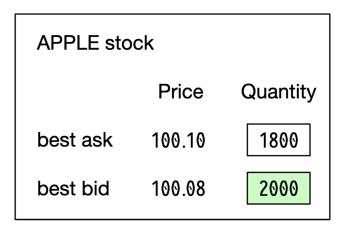
</p>

L2 includes more price levels:

<p align="left">
    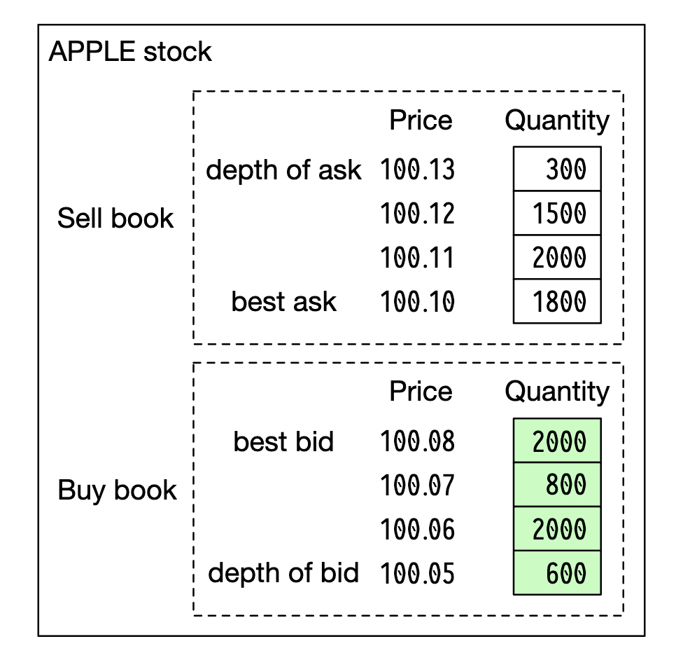
</p>

L3 shows levels and queued quantity at each level:

<p align="left">
    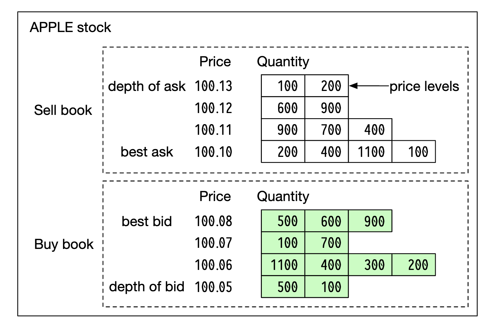
</p>

A candlestick shows the market open and close price, as well as the highest and lowest prices in the given interval:

<p align="left">
    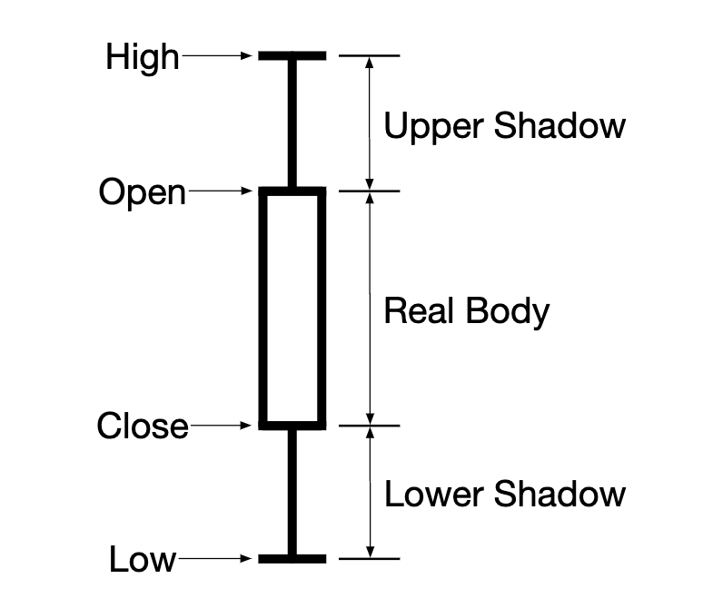
</p>

FIX is a protocol for exchanging securities transaction information, used by most vendors. Example securities transaction:
```
8=FIX.4.2 | 9=176 | 35=8 | 49=PHLX | 56=PERS | 52=20071123-05:30:00.000 | 11=ATOMNOCCC9990900 | 20=3 | 150=E | 39=E | 55=MSFT | 167=CS | 54=1 | 38=15 | 40=2 | 44=15 | 58=PHLX EQUITY TESTING | 59=0 | 47=C | 32=0 | 31=0 | 151=15 | 14=0 | 6=0 | 10=128 |
```

### **High-level design**

<p align="left">
    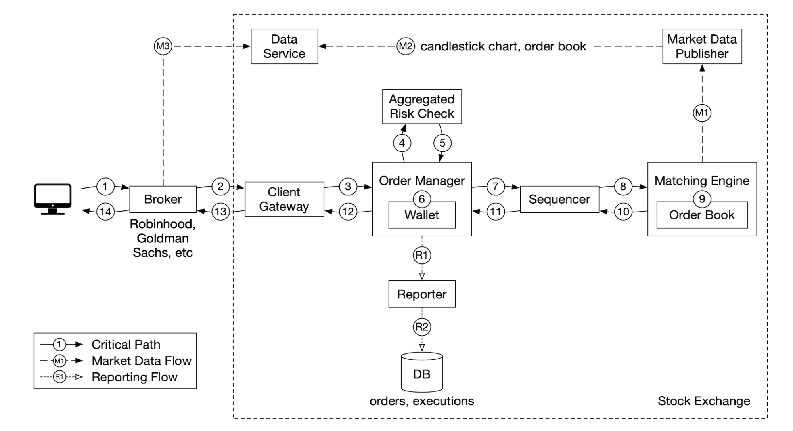
</p>

Trade flow:
 * Client places order via trading interface
 * Broker sends the order to the exchange
 * Order enters exchange through client gateway, which validates, rate limits, authenticates, etc. Order is forwarded to order manager.
 * Order manager performs risk checks based on rules set by the risk manager
 * After passing risk checks, order manager verifies there are sufficient funds in the wallet for the order
 * Order is sent to matching engine. When match is found, matching engine emits two executions (called fills) for buy and sell. Both orders are sequenced so that they're deterministic.
 * Executions are returned to the client.

Market data flow (M1-M3):
 * matching engine generates a stream of executions, sent to the market data publisher
 * Market data publisher constructs the candlestick charts and sends them to the data service
 * Market data is stored in specialized storage for real-time analytics. Brokers connect to the data service for timely market data.

Reporter flow (R1-R2):
 * reporter collects all necessary reporting fields from orders and executions and writes them to DB
 * reporting fields - client_id, price, quantity, order_type, filled_quantity, remaining_quantity

Trading flow is on the critical path, whereas the rest of the flows are not, hence, latency requirements differ between them.

#### Trading flow
The trading flow is on the critical path, hence, it should be highly optimized for low latency.

The matching engine is at its heart, also called the cross engine. Primary responsibilities:
 * Maintain the order book for each symbol - a list of buy/sell orders for a symbol.
 * Match buy and sell orders - a match results in two executions (fills), with one each for the buy and sell sides. This function must be fast and accurate
 * Distribute the execution stream as market data
 * Matches must be produced in a deterministic order. Foundational for high availability

Next is the sequencer - it is the key component making the matching engine deterministic by stamping each inbound order and outbound fill with a sequence ID.

<p align="left">
    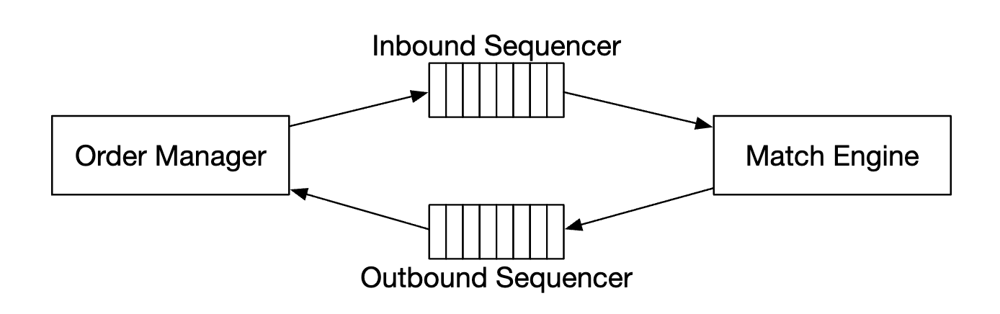
</p>

We stamp inbound orders and outbound fills for several reasons:
 * timeliness and fairness
 * fast recovery/replay
 * exactly-once guarantee

Conceptually, we could use Kafka as our sequencer since it's effectively an inbound and outbound message queue. However, we're going to implement it ourselves in order to achieve lower latency.

The order manager manages the orders state. It also interacts with the matching engine - sending orders and receiving fills.

The order manager's responsibilities:
 * Sends orders for risk checks - eg verifying user's trade volume is less than 1mil
 * Checks the order against the user wallet and verifies there are sufficient funds to execute it
 * It sends the order to the sequencer and on to the matching engine. To reduce bandwidth, only necessary order information is passed to the matching engine
 * Executions (fills) are received back from the sequencer, where they are then send to the brokers via the client gateway

The main challenge with implementing the order manager is the state transition management. Event sourcing is one viable solution (discussed in deep dive).

Finally, the client gateway receives orders from users and sends them to the order manager. Its responsibilities:

<p align="left">
    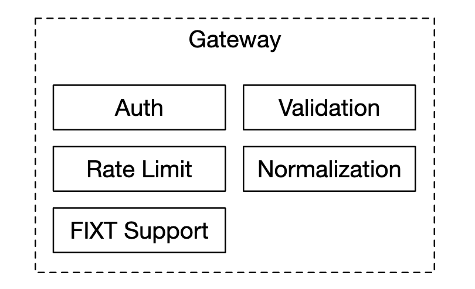
</p>

Since the client gateway is on the critical path, it should stay lightweight.

There can be multiple client gateways for different clients. Eg a colo engine is a trading engine server, rented by the broker in the exchange's data center:

<p align="left">
    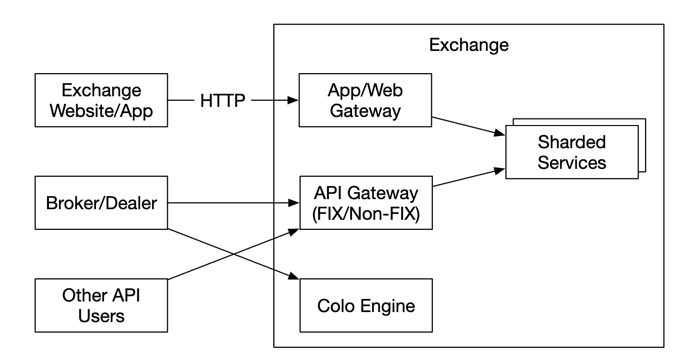
</p>

#### Market data flow
The market data publisher receives executions from the matching engine and builds the order book/candlestick charts from the execution stream.

That data is sent to the data service, which is responsible for showing the aggregated data to subscribers:

<p align="left">
    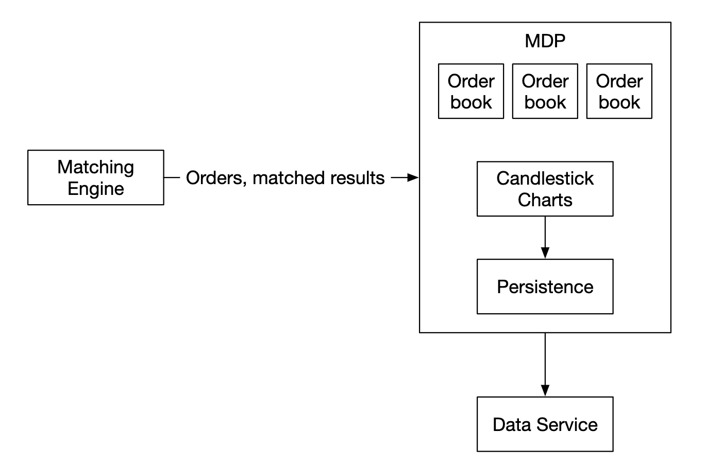
</p>

#### Reporting flow
The reporter is not on the critical path, but it is an important component nevertheless.

<p align="left">
    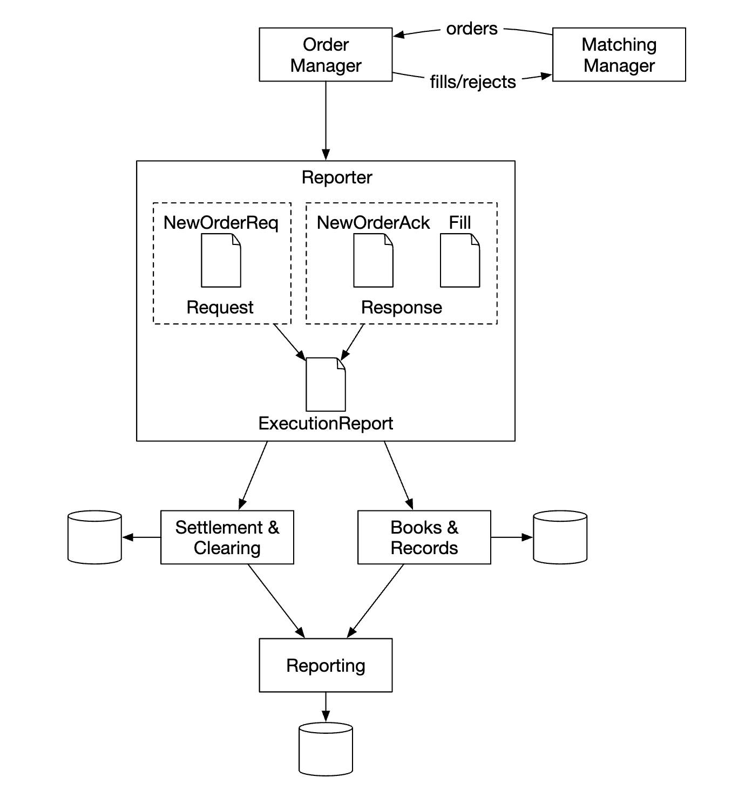
</p>

It is responsible for trading history, tax reporting, compliance reporting, settlements, etc.
Latency is not a critical requirement for the reporting flow. Accuracy and compliance are more important.

### **API Design**
Clients interact with the stock exchange via the brokers to place orders, view executions, market data, download historical data for analysis, etc.

We use a RESTful API for communication between the client gateway and the brokers.

For institutional clients, a proprietary protocol is used to satisfy their low-latency requirements.

Create order:
```
POST /v1/order
```

Parameters:
 * symbol - the stock symbol. String
 * side - buy or sell. String
 * price - the price of the limit order. Long
 * orderType - limit or market (we only support limit orders in our design). String
 * quantity - the quantity of the order. Long

Response:
 * id - the ID of the order. Long
 * creationTime - the system creation time of the order. Long
 * filledQuantity - the quantity that has been successfully executed. Long
 * remainingQuantity - the quantity still to be executed. Long
 * status - new/canceled/filled. String
 * rest of the attributes are the same as the input parameters

Get execution:
```
GET /execution?symbol={:symbol}&orderId={:orderId}&startTime={:startTime}&endTime={:endTime}
```

Parameters:
 * symbol - the stock symbol. String
 * orderId - the ID of the order. Optional. String
 * startTime - query start time in epoch \[11\]. Long
 * endTime - query end time in epoch. Long

Response:
 * executions - array with each execution in scope (see attributes below). Array
 * id - the ID of the execution. Long
 * orderId - the ID of the order. Long
 * symbol - the stock symbol. String
 * side - buy or sell. String
 * price - the price of the execution. Long
 * orderType - limit or market. String
 * quantity - the filled quantity. Long

Get order book:
```
GET /marketdata/orderBook/L2?symbol={:symbol}&depth={:depth}
```

Parameters:
 * symbol - the stock symbol. String
 * depth - order book depth per side. Int

Response:
 * bids - array with price and size. Array
 * asks - array with price and size. Array

get candlesticks:
```
GET /marketdata/candles?symbol={:symbol}&resolution={:resolution}&startTime={:startTime}&endTime={:endTime}
```

Parameters:
 * symbol - the stock symbol. String
 * resolution - window length of the candlestick chart in seconds. Long
 * startTime - start time of the window in epoch. Long
 * endTime - end time of the window in epoch. Long

Response:
 * candles - array with each candlestick data (attributes listed below). Array
 * open - open price of each candlestick. Double
 * close - close price of each candlestick. Double
 * high - high price of each candlestick. Double
 * low - low price of each candlestick. Double

### **Data models**
There are three main types of data in our exchange:
 * Product, order, execution
 * order book
 * candlestick chart

#### Product, order, execution
Products describe the attributes of a traded symbol - product type, trading symbol, UI display symbol, etc.

This data doesn't change frequently, it is primarily used for rendering in a UI.

An order represents an instruction for a buy/sell order. Executions are outbound matched result.

Here's the data model:

<p align="left">
    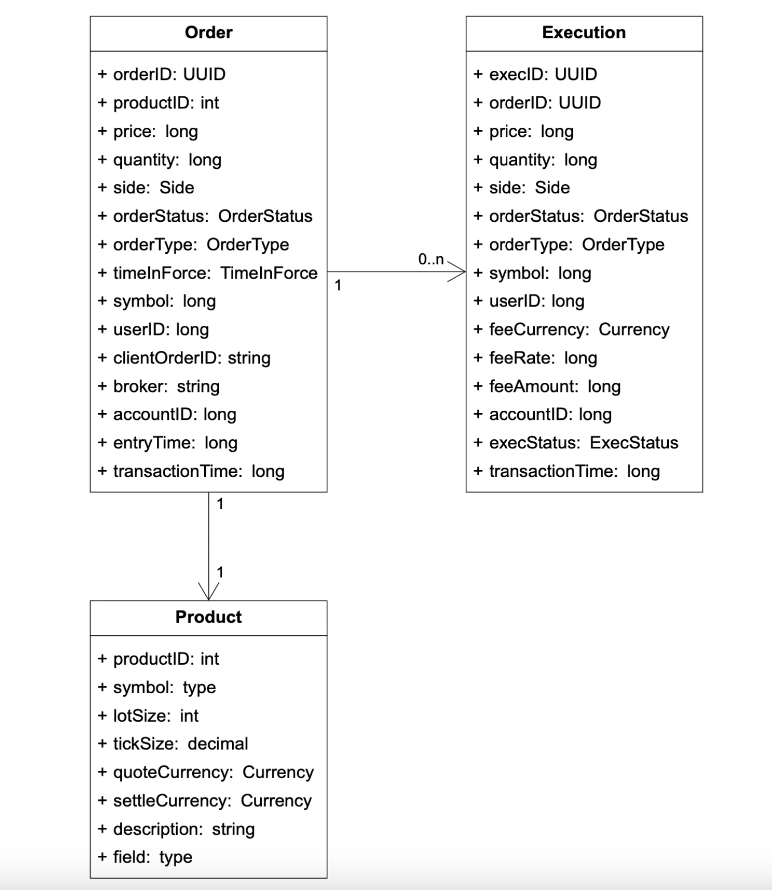
</p>

We encounter orders and executions in all of our three flows:
 * in the critical path, they are processed in-memory for high performance. They are stored and recovered from the sequencer.
 * The reporter writes orders and executions to the database for reporting use-cases
 * Executions are forwarded to market data to reconstruct the order book and candlestick chart

#### Order book
The order book is a list of buy/sell orders for an instrument, organized by price level.

An efficient data structure for this model, needs to satisfy:
 * constant lookup time - getting volume at price level or between price levels
 * fast add/execute/cancel operations
 * query best bid/ask price
 * iterate through price levels

Example order book execution:

<p align="left">
    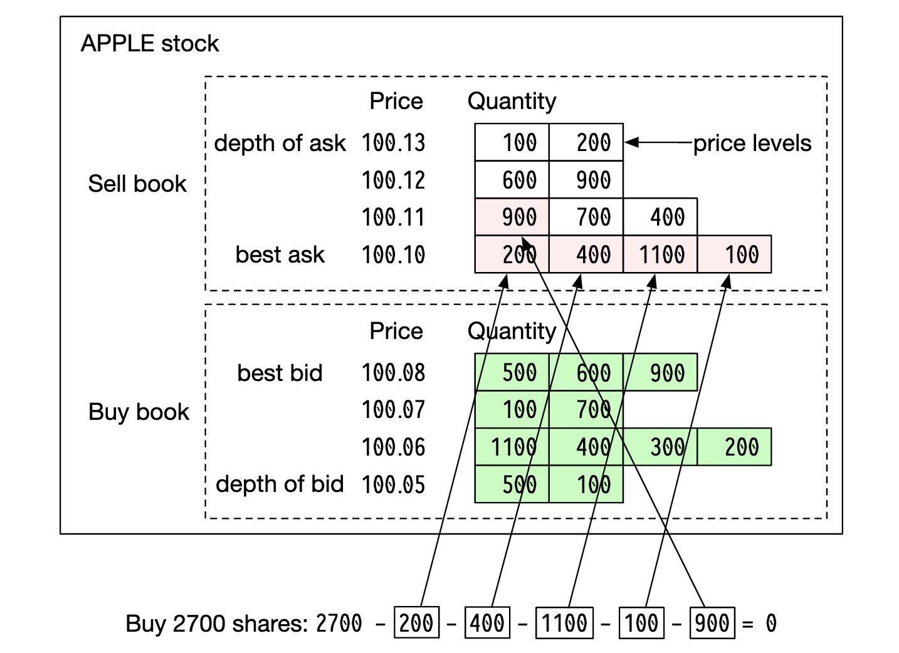
</p>

After fulfilling this large order, the price increases as the bid/ask spread widens.

Example order book implementation in pseudo code:
```
class PriceLevel{
    private Price limitPrice;
    private long totalVolume;
    private List<Order> orders;
}

class Book<Side> {
    private Side side;
    private Map<Price, PriceLevel> limitMap;
}

class OrderBook {
    private Book<Buy> buyBook;
    private Book<Sell> sellBook;
    private PriceLevel bestBid;
    private PriceLevel bestOffer;
    private Map<OrderID, Order> orderMap;
}
```

For a more efficient implementation, we can use a doubly-linked list instead of a standard list:
 * Placing a new order is O(1), because we're adding an order to the tail of the list.
 * Matching an order is O(1), because we are deleting an order from the head
 * Canceling an order means deleting an order from the order book. We utilize `orderMap` for O(1) lookup and O(1) delete (due to the `Order` having a reference to the previous element in the list).

**Why this particular combination of structures, and why it is exactly the right one:**

| Operation | Structure used | Cost |
|---|---|---|
| Place an order | Append to the tail of the price level's list | **O(1)** |
| Match an order | Take from the head of the opposing level's list | **O(1)** |
| Cancel an order | `orderMap` lookup, then unlink via prev/next pointers | **O(1)** |
| Best bid / best ask | Cached `bestBid` / `bestOffer` pointers | **O(1)** |
| Volume at a price | `totalVolume` maintained on the `PriceLevel` | **O(1)** |

Everything on the hot path is constant time, which is what a microsecond budget requires — there is no room for an `O(log n)` tree walk, let alone a scan.

**And the data structure is not an arbitrary optimisation; it encodes the fairness rule.** Exchanges match by **price-time priority**: better prices first, and among orders at the same price, *whoever arrived first*. A FIFO queue per price level means insertion order *is* priority order, so the matching rule is implemented by the structure rather than by a comparison. The doubly-linked list is what makes cancellation O(1) without disturbing anyone else's position in the queue — a singly-linked list would require a scan to find the predecessor, and an array would require shifting every later order, which would also be unfair to re-sequence.

**One simplification in the pseudo-code worth noticing:** `match()` looks up `book.limitMap.get(order.price)` — only the exact price level. A real matcher walks price levels from the best available price *towards* the incoming order's limit, filling at each level until the order is exhausted or no acceptable price remains. That is how a large order "walks the book" and widens the spread, which is precisely the behaviour the order-book execution diagram above illustrates.

<p align="left">
    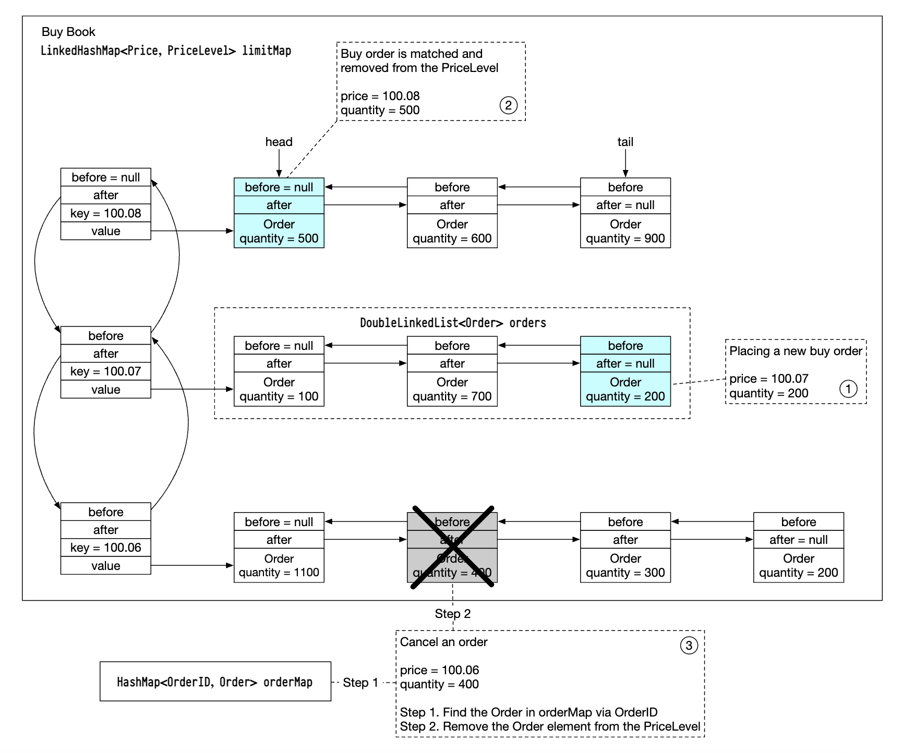
</p>

This data structure is also used in the market data services to reconstruct the order book.

#### Candlestick chart
The candlestick data is calculated within the market data services based on processing orders in a time interval:
```
class Candlestick {
    private long openPrice;
    private long closePrice;
    private long highPrice;
    private long lowPrice;
    private long volume;
    private long timestamp;
    private int interval;
}

class CandlestickChart {
    private LinkedList<Candlestick> sticks;
}
```

Some optimizations to avoid consuming too much memory:
 * Use pre-allocated ring buffers to hold sticks to reduce the allocation number
 * Limit the number of sticks in memory and persist the rest to disk

We'll use an in-memory columnar database (eg KDB) for real-time analytics. After market close, data is persisted in historical database.

---

## Step 3: Design Deep Dive
One interesting thing to be aware of about modern exchanges is that unlike most other software, they typically run everything on one gigantic server.

Let's explore the details.

### **Performance**
For an exchange, it is very important to have good overall latency for all percentiles.

How can we reduce latency?
 * Reduce the number of tasks on the critical path
 * Shorten the time spent on each task by reducing network/disk usage and/or reducing task execution time

To achieve the first goal, we've stripped the critical path from all extraneous responsibility, even logging is removed to achieve optimal latency.

If we follow the original design, there are several bottlenecks - network latency between services and disk usage of the sequencer.

With such a design we can achieve tens of milliseconds end to end latency. We want to achieve tens of microseconds instead.

Hence, we'll put everything on one server and processes are going to communicate via mmap as an event store:

<p align="left">
    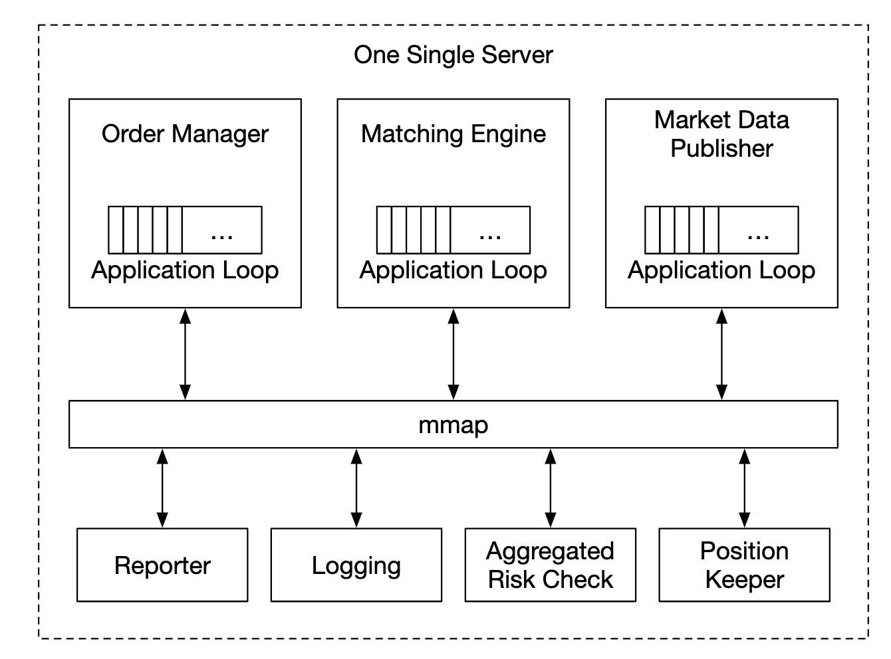
</p>

Another optimization is using an application loop (while loop executing mission-critical tasks), pinned to the same CPU to avoid context switching:

<p align="left">
    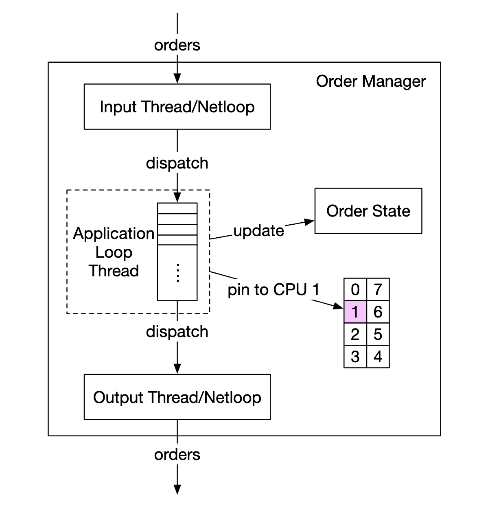
</p>

Another side effect of using an application loop is that there is no lock contention - multiple threads fighting for the same resource.

**Three distinct costs disappear with a single pinned thread, and it is worth separating them:**

- **No lock contention**, because there is no second thread to contend with. Not "less contention" — none. An uncontended lock is cheap but a contended one can cost microseconds, and worse, its cost is *unpredictable*.
- **No context switches.** A thread that is descheduled loses the CPU for potentially milliseconds, and when it returns its caches are cold. Pinning to a core and never yielding keeps the working set in L1/L2.
- **No cache invalidation from migration.** A thread moved to another core finds its data in the wrong cache hierarchy.

The price is paid deliberately: **a busy-spin loop consumes 100% of a core doing nothing while idle**, burning power and heat to avoid the microseconds that sleeping and waking would cost. That is an explicit trade of efficiency for *predictability*, and it is characteristic of this whole domain — the goal is not the best average but the tightest distribution.

**Garbage collection is the other predictability killer, and it is worse than everything else combined.** A single stop-the-world pause of 10 ms is roughly a thousand times the end-to-end latency target, and it will land on some unlucky order. Hence: preallocate everything, pool and reuse objects, allocate nothing on the hot path, use primitive arrays rather than object graphs — or write the engine in a language without a collector. This is why the chapter's **"latency determinism"** section names GC explicitly; in a system like this a garbage collector is not a performance concern but a correctness-of-experience one.

Let's now explore how mmap works - it is a UNIX syscall, which maps a file on disk to an application's memory.

One trick we can use is creating the file in `/dev/shm`, which stands for "shared memory". Hence, we have no disk access at all.

**What this buys, precisely:** `mmap` maps a file into a process's address space so reading and writing it are ordinary memory operations — no `read`/`write` syscalls, no kernel buffer copies. Mapping the *same* file into several processes gives them a shared memory region, so inter-process communication becomes "write to a memory address" rather than "send a message". And because `/dev/shm` is a RAM-backed filesystem, nothing ever touches a disk.

So the "event store" between the sequencer, matching engine and market data publisher is a region of RAM that several processes can read and write at memory speed. That is how components stay separate programs — independently deployable, independently crashable — while communicating at roughly the cost of a function call.

**The thing to be explicit about is that this storage is not durable.** `/dev/shm` does not survive a reboot or a machine failure, so the design's recovery story cannot rest on it. Durability has to come from somewhere else — writing the sequenced event stream to persistent storage *off* the critical path, and from the replicas discussed under high availability — which is the same "fast path in memory, durable path asynchronous" split as the commit log in [Chapter 6](../06.%20Key-Value%20Store/#write-and-read-paths).

### **Event sourcing**
Event sourcing is discussed in-depth in the [digital wallet chapter](../27.%20%20Digital%20Wallet/#event-sourcing). Reference it for all the details.

In a nutshell, instead of storing current states, we store immutable state transitions:

<p align="left">
    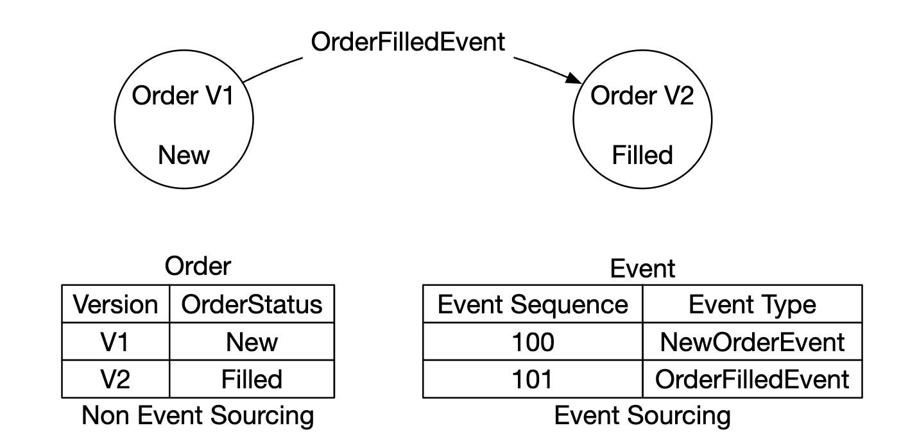
</p>

 * On the left - traditional schema
 * On the right - event source schema

Here's how our design looks like thus far:

<p align="left">
    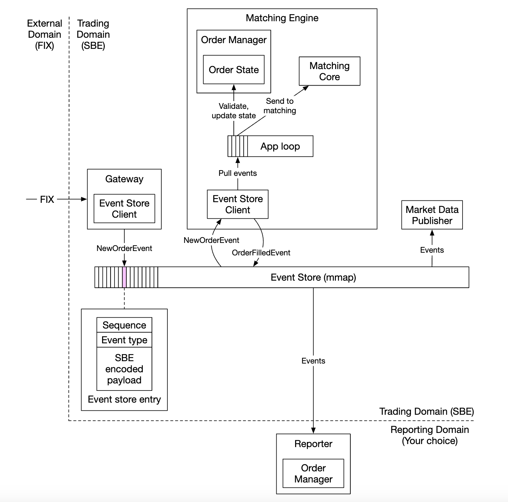
</p>

 * external domain interacts with our client gateway using the FIX protocol
 * Order manager receives the new order event, validates it and adds it to its internal state. Order is then sent to matching core
 * If order is matched, the `OrderFilledEvent` is generated and sent over mmap
 * Other components subscribe to the event store and do their part of the processing

One additional optimizations - all components hold a copy of the order manager, which is packaged as a library to avoid extra calls for managing orders

The sequencer in this design, changes to not be an event store, but be a single writer, sequencing events before forwarding them to the event store:

<p align="left">
    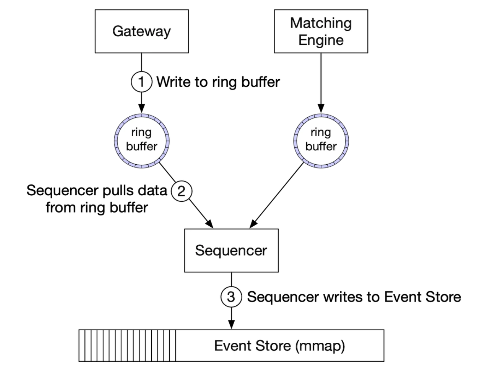
</p>

### **High availability**
We aim for 99.99% availability - only 8.64s of downtime per day.

To achieve that, we have to identify single-point-of-failures in the exchange architecture:
 * setup backup instances of critical services (eg matching engine) which are on stand-by
 * aggressively automate failure detection and failover to the backup instance

Stateless services such as the client gateway can easily be horizontally scaled by adding more servers.

For stateful components, we can process inbound events, but not publish outbound events if we're not the leader:

<p align="left">
    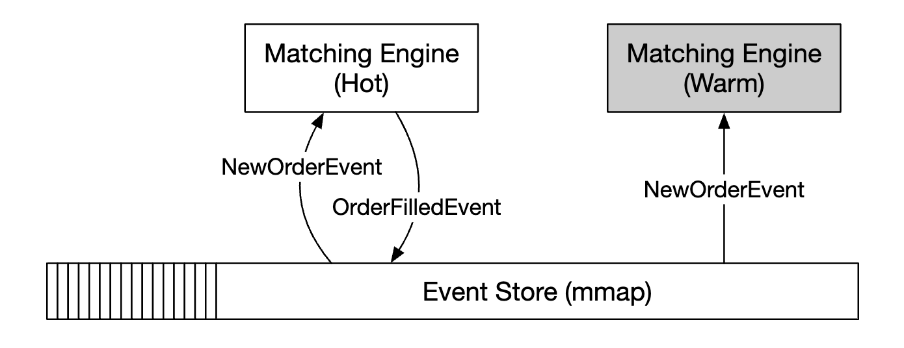
</p>

To detect the primary replica being down, we can send heartbeats to detect that its non-functional.

This mechanism only works within the boundary of a single server. 
If we want to extend it, we can setup an entire server as hot/warm replica and failover in case of failure.

To replicate the event store across the replicas, we can use reliable UDP for faster communication.

### **Fault tolerance**
What if even the warm instances go down? It is a low probability event but we should be ready for it.

Large tech companies tackle this problem by replicating core data to data centers in multiple cities to mitigate eg natural disasters.

Questions to consider:
 * If the primary instance is down, how and when do we failover to the backup instance?
 * How do we choose the leader among the backup instances?
 * What is the recovery time needed (RTO - recovery time objective)?
 * What functionalities need to be recovered? Can our system operate under degraded conditions?

How to address these:
 * System can be down due to a bug (affecting primary and replicas), we can use chaos engineering to surface edge-cases and disastrous outcomes like these
 * Initially though, we could perform failovers manually until we gather sufficient knowledge about the system's failure modes
 * leader-election can be used (eg Raft) to determine which replica becomes the leader in the event of the primary going down

Example of how replication works across different servers:

<p align="left">
    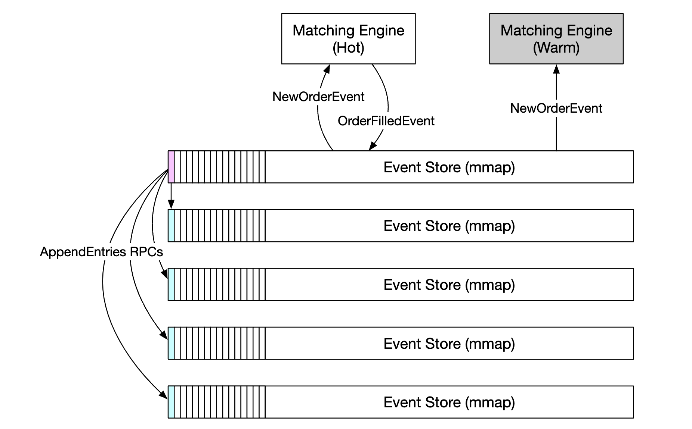
</p>

Example leader-election terms:

<p align="left">
    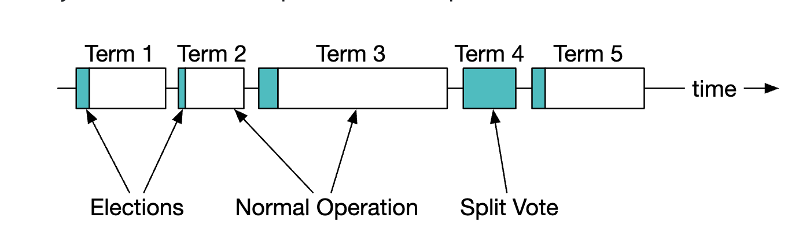
</p>

For details on how Raft works, [check this out](https://thesecretlivesofdata.com/raft/)

Finally, we need to also consider loss tolerance - how much data can we lose before things get critical?
This will determine how often we backup our data.

For a stock exchange, data loss is unacceptable, so we have to backup data often and rely on raft's replication to reduce probability of data loss.

### **Matching algorithms**
Slight detour on how matching works via pseudo code:
```
Context handleOrder(OrderBook orderBook, OrderEvent orderEvent) {
    if (orderEvent.getSequenceId() != nextSequence) {
        return Error(OUT_OF_ORDER, nextSequence);
    }

    if (!validateOrder(symbol, price, quantity)) {
        return ERROR(INVALID_ORDER, orderEvent);
    }

    Order order = createOrderFromEvent(orderEvent);
    switch (msgType):
        case NEW:
            return handleNew(orderBook, order);
        case CANCEL:
            return handleCancel(orderBook, order);
        default:
            return ERROR(INVALID_MSG_TYPE, msgType);

}

Context handleNew(OrderBook orderBook, Order order) {
    if (BUY.equals(order.side)) {
        return match(orderBook.sellBook, order);
    } else {
        return match(orderBook.buyBook, order);
    }
}

Context handleCancel(OrderBook orderBook, Order order) {
    if (!orderBook.orderMap.contains(order.orderId)) {
        return ERROR(CANNOT_CANCEL_ALREADY_MATCHED, order);
    }

    removeOrder(order);
    setOrderStatus(order, CANCELED);
    return SUCCESS(CANCEL_SUCCESS, order);
}

Context match(OrderBook book, Order order) {
    Quantity leavesQuantity = order.quantity - order.matchedQuantity;
    Iterator<Order> limitIter = book.limitMap.get(order.price).orders;
    while (limitIter.hasNext() && leavesQuantity > 0) {
        Quantity matched = min(limitIter.next.quantity, order.quantity);
        order.matchedQuantity += matched;
        leavesQuantity = order.quantity - order.matchedQuantity;
        remove(limitIter.next);
        generateMatchedFill();
    }
    return SUCCESS(MATCH_SUCCESS, order);
}
```

This matching algorithm uses the FIFO algorithm for determining which orders at a price level to match.

### **Determinism**
Functional determinism is guaranteed via the sequencer technique we used.

The actual time when the event happens doesn't matter:

<p align="left">
    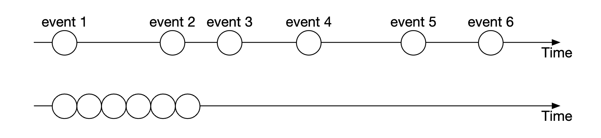
</p>

**And functional determinism is doing more work here than audit.** Because the matching engine is a pure function of the sequenced event stream, any replica fed the same sequence reaches the same state — which is what makes hot-warm standbys possible at all, and what makes recovery a replay rather than a reconciliation. The sequencer is the thing that creates that stream, so it is simultaneously the ordering authority, the fairness authority (sequence number = arrival priority), and the foundation of fault tolerance.

It is worth noting what that means for the sequencer itself: it is a **single point of failure and the system's throughput ceiling**, because every order must pass through it to be ordered. There is no sharding it without giving up the total order that everything else depends on — the same wall as the hot account in [Chapter 27](../27.%20%20Digital%20Wallet/) and the hot inventory row in [Chapter 22](../22.%20Hotel%20Reservation%20System/). An exchange accepts that ceiling and makes the single path as fast as possible, which is the whole of Step 3.

Latency determinism is something we have to track. We can calculate it based on monitoring 99 or 99.99 percentile latency.

**Why the percentile matters more than the mean here**, which is the chapter's point stated more sharply: a trader whose order is delayed 50 ms during a price move loses money, and averages hide that completely. A system with a 20 μs mean and a 50 ms p99.99 is processing hundreds of orders a day catastrophically badly while every dashboard looks healthy. **The goal is a tight distribution, not a low average** — which is why every technique in this section is about removing variance (no GC, no context switches, no locks, no disk, preallocated memory) rather than about raw speed.

Things which can cause latency spikes are garbage collector events in eg Java.

### **Market data publisher optimizations**
The market data publisher receives matched results from the matching engine and rebuilds the order book and candlestick charts based on them.

We only keep part of the candlesticks as we don't have infinite memory. Clients can choose how much granular info they want. More granular info might require a higher price:

<p align="left">
    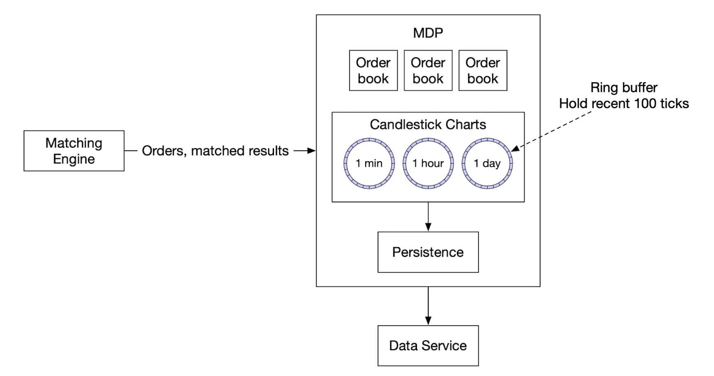
</p>

A ring buffer (aka circular buffer) is a fixed-size queue with the head connected to the tail. The space is preallocated to avoid allocations. The data structure is also lock-free.

Another technique to optimize the ring buffer is padding, which ensures the sequence number is never in a cache line with anything else.

**The problem padding solves is called false sharing, and it is one of the few places where cache-line mechanics show up directly in a system design.** CPUs move memory between cores in **64-byte cache lines**, not individual variables. If a producer's sequence counter and a consumer's sequence counter happen to sit in the same 64-byte line, then every write by the producer invalidates that line in the consumer's cache and vice versa — the line ping-pongs between cores, and two variables that are logically independent become a hardware-level contention point costing tens of nanoseconds per access.

Padding each counter out to its own cache line removes the interference entirely. It wastes a little memory to avoid a coherence storm, and at these latencies that is obviously the right trade.

**The ring buffer itself is doing three jobs at once**, which is why it is the standard structure for this kind of pipeline: the space is **preallocated** (so no allocation on the hot path, and no GC pressure), it is **lock-free** (producers and consumers coordinate through sequence numbers with memory barriers rather than mutexes), and it is **contiguous** (so access is cache- and prefetcher-friendly, unlike a linked structure). This is the design popularised as the **LMAX Disruptor**, which came out of exactly this problem — a financial exchange needing a low-latency inter-thread pipeline.

### **Distribution fairness of market data and multicast**
We need to ensure subscribers receive the data at the same time since if one receives data before another, that gives them crucial market insight, which they can use to manipulate the market.

To achieve this, we can use multicast using reliable UDP when publishing data to subscribers.

Data can be transported via the internet in three ways:
 * Unicast - one source, one destination
 * Broadcast - one source to entire subnetwork
 * Multicast - one source to a set of hosts on different subnetworks

In theory, by using multicast, all subscribers should receive the data at the same time.

UDP, however, is unreliable and the data might not reach everyone. It can be enhanced with retransmissions, however.

**Spell out why unicast is unacceptable, because it is the clearest example of fairness as a functional requirement.** Sending the same update to 500 subscribers over 500 TCP connections means writing to them in *some* order, so the first recipient learns the new price microseconds before the last. At these timescales that is a tradeable advantage — the early recipient can act on information the others do not yet have — which is market manipulation enabled by an implementation detail. Multicast sends one packet that the network fabric replicates, so copies diverge only in the last hop.

**And retransmission reintroduces exactly the unfairness multicast removed.** A subscriber that drops a packet and requests it again receives that data later than everyone else, so reliable-multicast protocols (PGM and similar) have to be designed carefully — NAK-based rather than ACK-based so the normal path carries no feedback traffic, with retransmissions sent to the group rather than to one requester, so nobody gains from someone else's loss.

Exchanges take this further than software: colocated servers are connected with **length-equalised fibre**, so a rack at the far end of the data centre is not disadvantaged by a few metres of cable. Once the software is this fast, the speed of light in glass is a measurable source of unfairness — which is a good indication of how completely latency dominates this problem.

### **Colocation**
Exchanges offer brokers the ability to colocate their servers in the same data center as the exchange.

This reduces the latency drastically and can be considered a VIP service.

### **Network Security**
DDoS is a challenge for exchanges as there are some internet-facing services. Here's our options:
 * Isolate public services and data from private services, so DDoS attacks don't impact the most important clients
 * Use a caching layer to store data which is infrequently updated
 * Harden URLs against DDoS, eg prefer `https://my.website.com/data/recent` vs. `https://my.website.com/data?from=123&to=456`, because the former is more cacheable
 * Effective allowlist/blocklist mechanism is needed.
 * Rate limiting can be used to mitigate DDoS

---

## Step 4: Wrap Up
Other interesting notes:
 * not all exchanges rely on putting everything on one big server, but some still do
 * modern exchanges rely more on cloud infrastructure and also on automatic market makers (AMM) to avoid maintaining an order book

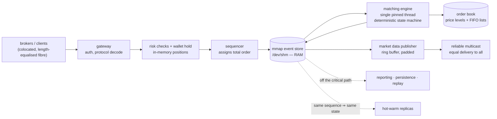
```mermaid
flowchart LR
    B["brokers / clients<br/>(colocated, length-equalised fibre)"] --> GW["gateway<br/>auth, protocol decode"]
    GW --> RISK["risk checks + wallet hold<br/>in-memory positions"]
    RISK --> SEQ["sequencer<br/>assigns total order"]
    SEQ --> EB[("mmap event store<br/>/dev/shm — RAM")]
    EB --> ME["matching engine<br/>single pinned thread<br/>deterministic state machine"]
    ME --> OB[("order book<br/>price levels + FIFO lists")]
    ME --> EB
    EB --> MDP["market data publisher<br/>ring buffer, padded"]
    MDP --> MC["reliable multicast<br/>equal delivery to all"]
    EB -.->|"off the critical path"| RPT["reporting · persistence · replay"]
    EB -.->|"same sequence ⇒ same state"| HW["hot-warm replicas"]
```

**The two dotted arrows are where durability and availability come from**, and both are deliberately *off* the hot path. Persistence and reporting consume the sequenced stream asynchronously, so no order ever waits for a disk. Replicas consume the same stream and — because the matching engine is deterministic — arrive at an identical order book without any state transfer. Determinism is what converts "replicate a complex in-memory structure" into "replay the same inputs".

---

### Gotchas & failure modes

- **A single network hop blows the entire latency budget.** Hundreds of microseconds against a target of tens. This is why the design is one machine, and why any proposal involving a service call on the hot path is wrong by two orders of magnitude.
- **A garbage collection pause is ~1,000× the budget.** Preallocate, pool, allocate nothing on the hot path — or use a language without a collector. A single pause ruins a p99.99 target and lands on a real customer's order.
- **False sharing makes independent variables contend in hardware.** Two counters in one 64-byte cache line ping-pong between cores. Pad to cache-line boundaries.
- **One machine is one failure domain.** The mitigation is hot-warm replicas driven by the same sequence, plus fast failover — but the sequence, not a state copy, is what keeps them identical.
- **`/dev/shm` is not durable.** It does not survive a reboot, so recovery must rest on asynchronously persisted sequence data and on replicas, never on the shared-memory event store.
- **The sequencer is a single point of failure and the throughput ceiling.** It cannot be sharded without abandoning the total order everything else depends on.
- **Recovery by replay takes time, and market open is the worst moment to need it.** A replica must be already warm and already caught up; replaying a billion-order day from scratch is not an incident response.
- **Busy-spin loops burn a core continuously.** Deliberate, but it means capacity planning is about cores reserved rather than cores utilised, and the machine runs hot while idle.
- **Determinism is fragile in the same ways as [Chapter 27](../27.%20%20Digital%20Wallet/#gotchas--failure-modes).** A clock read, a random value, an unordered iteration or an external call inside the matching engine breaks replica agreement and replay — and here it breaks *failover*, not just audit.
- **Unicast market data is an unfairness bug.** Serial delivery to N subscribers gives the first one a tradeable head start. Multicast — and retransmit to the group, not to the requester, or recovery re-creates the advantage.
- **UDP multicast silently drops data.** Subscribers must detect gaps by sequence number and recover; a subscriber that assumes delivery will reconstruct a wrong order book and act on it.
- **Market open is far spikier than a 5× average peak.** The first seconds carry the day's heaviest burst, against the coldest caches.
- **Risk checks and wallet holds are on the critical path.** They cannot call out to another service, so positions and available funds must be tracked in memory — with the funds-withheld mechanism of [Chapter 27](../27.%20%20Digital%20Wallet/) implemented locally.
- **Cancel racing a fill is a routine correctness case.** A cancel arriving after the order has matched must fail cleanly rather than cancelling a trade that already happened — which is why `handleCancel` checks `orderMap` first, and why cancellation can never be assumed to succeed.
- **The pseudo-code matches only at the order's exact limit price.** A real engine walks price levels from the best available. Reading it literally gives the wrong model of how a large order moves the market.
- **Timestamps are a regulatory artefact.** Regimes such as MiFID II require microsecond-resolution timestamps synchronised to UTC within tight bounds, so clock synchronisation is a compliance requirement even though the matching engine orders by sequence number rather than by time.
- **Self-trade prevention, halts, auctions and market orders are all missing from this scope.** Opening and closing auctions use a different matching algorithm entirely, and circuit breakers can halt a symbol mid-session; a design that only understands continuous limit-order matching is incomplete as a real exchange.
- **Public endpoints invite DDoS while the matching path must stay untouched.** Isolate public market-data and account services from the trading path so an attack on the former cannot degrade the latter.

---

## The design, as problem and technique

| Goal / problem | Technique |
|---|---|
| Tens of microseconds end to end | Everything on one machine; nothing networked on the critical path |
| Inter-process communication at memory speed | `mmap` a file in `/dev/shm` as a shared event store |
| No disk in the request path | RAM-backed filesystem; persistence consumes the stream asynchronously |
| Lock contention and context switches | A single application loop pinned to one core, busy-spinning |
| Allocation stalls and GC pauses | Preallocated ring buffers, object pooling, zero allocation on the hot path |
| Cores invalidating each other's caches | Cache-line padding to eliminate false sharing |
| A total, fair order of events | Sequencer assigning monotonic sequence numbers |
| Price-time priority | Price-level map plus a FIFO doubly-linked list per level |
| O(1) cancel without disturbing priority | `orderMap` for lookup, prev/next pointers for unlinking |
| O(1) best bid/ask and level volume | Cached `bestBid`/`bestOffer` pointers; running `totalVolume` |
| Auditability and reproducibility | Event sourcing over the sequenced stream |
| Fast failover without state transfer | Deterministic engine plus hot-warm replicas consuming the same sequence |
| Equal market data delivery | Reliable multicast; group retransmission; length-equalised fibre |
| Bounded candlestick memory | Ring buffers with tiered retention by granularity |
| Pre-trade risk and funds | In-memory position limits and withheld balances on the hot path |
| Protecting the trading path from the internet | Isolate public services; cache; allowlists; rate limiting |

## Self-check
1. Why is this chapter the counter-example to the rest of these notes? What does it do that every other chapter does not?
2. At 215,000 orders/sec, how long is the mean inter-arrival time? How does one data-centre network round trip compare with the whole latency budget?
3. Name the four things the latency target forces out of the critical path, and what replaces each.
4. What does `mmap` on `/dev/shm` give you, and what does it emphatically not give you?
5. Name the three separate costs removed by a single pinned thread, and the price paid for it.
6. Why is a garbage collector a correctness-of-experience problem here rather than a performance one?
7. What is false sharing, what is the unit that causes it, and what is the fix?
8. Give the complexity of place, match, cancel and best-bid in this order book, and say which structure provides each.
9. How does the order book's data structure encode the fairness rule, and why would an array be both slower *and* unfair?
10. Beyond auditing, what does determinism buy in this design?
11. Why can't the sequencer be sharded?
12. Why is unicast market data a fairness violation, and how can retransmission reintroduce the same problem?
13. Why does a system with a 20 μs mean latency and a 50 ms p99.99 have a serious problem?
14. A cancel arrives for an order that has just been filled. What must happen?
15. The order book is in RAM on one machine. How does the system survive losing that machine?

## Glossary

| Term | Meaning |
|---|---|
| **Limit / market order** | Buy or sell at a specified price or better; execute immediately at the prevailing price |
| **Bid / ask / spread** | Best buy price, best sell price, and the gap between them |
| **L1 / L2 / L3 market data** | Best prices only; several price levels; full order-by-order detail |
| **Order book** | All resting orders for a symbol, organised by price level |
| **Price-time priority** | Matching rule: better price first, then earliest arrival at that price |
| **Price level** | All orders at one price, held as a FIFO queue |
| **Sequencer** | Component assigning a total order to incoming events; the ordering and fairness authority |
| **Matching engine** | Deterministic state machine applying sequenced events to the order book |
| **Event sourcing** | Storing immutable state transitions rather than current state |
| **Determinism (functional / latency)** | Same inputs give the same state; and latency has a tight, predictable distribution |
| **`mmap` / `/dev/shm`** | Mapping a file into memory; a RAM-backed filesystem, so no disk is touched |
| **Application loop** | A busy-spinning thread pinned to a core, avoiding locks and context switches |
| **Ring buffer** | Preallocated, lock-free circular queue — the basis of the LMAX Disruptor design |
| **False sharing** | Independent variables sharing a 64-byte cache line and contending in hardware |
| **Cache-line padding** | Separating such variables so each occupies its own line |
| **Multicast** | One packet replicated by the network to many subscribers, for equal-time delivery |
| **Colocation** | Renting rack space beside the exchange, with length-equalised fibre |
| **Candlestick** | Open/high/low/close aggregation of trades over an interval |
| **AMM** | Automated market maker — pricing from a formula rather than an order book |

## Where to go next
- [Chapter 27 – Digital Wallet](../27.%20%20Digital%20Wallet/#event-sourcing) — event sourcing, deterministic state machines and the replicated log, developed at length.
- [Chapter 19 – Distributed Message Queue](../19.%20Distributed%20Message%20Queue/) — the ordered append-only log as a general-purpose system, and the sequential-I/O and zero-copy ideas behind the fast path here.
- [Chapter 26 – Payment System](../26.%20Payment%20System/) — the settlement and ledger side of what happens after a trade matches.
- [Chapter 2 – Back-of-the-envelope Estimation](../02.%20Back%20Of%20the%20Envelope%20Estimation/) — the latency numbers that make this chapter's architecture inevitable.
- [Chapter 1 – Scale From Zero To Millions Of Users](../01.%20Scaling/) — worth re-reading against this chapter, as the clearest illustration that "scale out" answers one kind of constraint and not another.
- [The LMAX Disruptor](https://lmax-exchange.github.io/disruptor/) — the ring buffer, cache-line padding and single-writer design, from the exchange that published it.
